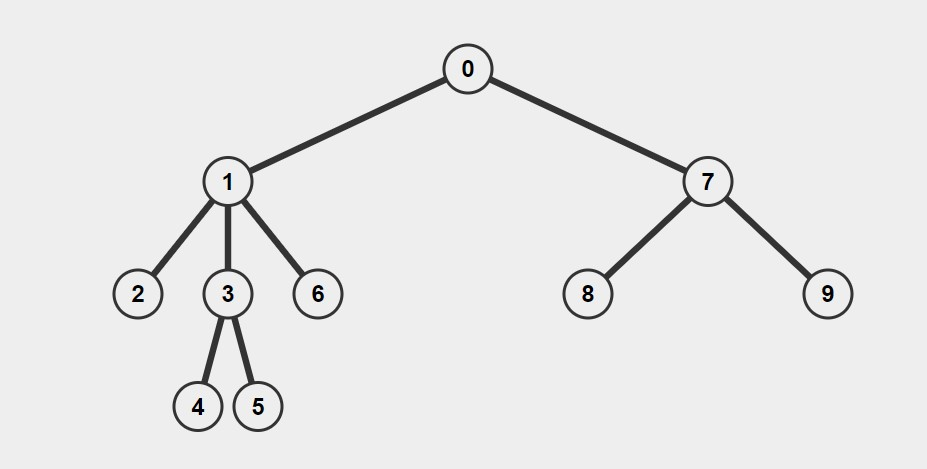
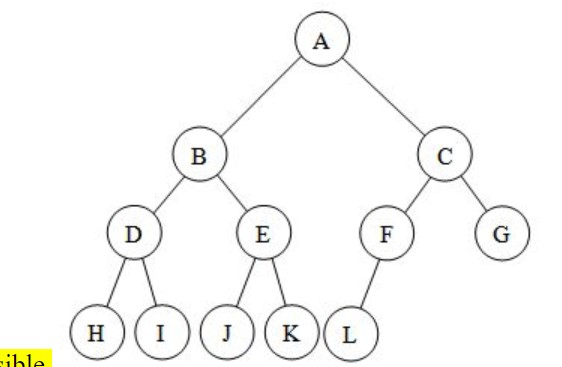

# Interesting Insights

## If 2 nodes like each other.
- Say if we are having a study where, we find who are more likely to have on average more sexual partner men or women, we can use graph theory, 
  - Average male sex partners = Total number of relationship/Number of men i.e Average male sex partners = Edge in the graph/Number of men
  - Similarly, Average female sex partner = Edge in the graph/Number of women.
  - So depending on the number of women/men ratio in population our answer depends. Not some social stigma.
  - Same logic applies when talking about minority students on average study with non minority rather than other way around. It is because they are minority.

## If 2 nodes don't like each other. i.e can't go with each other
- This is where graph Coloring algorithms comes into picture. We need to assign different color to adjacent nodes. Adjacent nodes are nodes which don't like each other.
- ### Some Theorems
  - For any graph G, with n nodes and max degree d, we can color the graph, with atmost d+1 colors. We don't need any more than that. (This upper bound case comes when all nodes are connected to each other).
  - It is important to understand the value of ordering in which we traverse the graph to assign colors.
  - A basic greedy solution i.e just order in some random way and start with any node and assign lowest possible color to it won't work for checking if it is a bipartite graph.

## Matching Problem.
- Solution TMA (Stable Marriage problem).

# Terminology
## Path
- A path (of length n) in an (undirected) graph G is a sequence of vertices {v0, v1, ..., vn-1, vn} such that there is an edge between vi and vi+1 ∀i ∈ [0..n-1] along the path.

## Directed Graph
### Degree
- In a directed graph, we have to further differentiate the degree of a vertex v into in-degree and out-degree. The in-degree/out-degree is the number of edges coming-into/going-out-from v, respectively. For example, vertex 1 has in-degree/out-degree of 2/1, respectively.

### Strongly Connected Components
- A directed graph is strongly connected if there is a path between all pairs of vertices. 
-  The strongly connected components of an arbitrary directed graph form a partition into subgraphs that are themselves strongly connected. 

# Special Graphs
## Tree
- Tree is a connected graph with V vertices and E = V-1 edges,
- acyclic,
- ### has one unique path between any pair of vertices.
- Usually a Tree is defined on undirected graph.

## Rooted Tree
- Tree with one of its vertex designated as root vertex is called a rooted Tree.

- We can always transform any Tree into a rooted Tree by designating a specific vertex (usually vertex 0) as the root, and run a DFS or BFS algorithm from the root.

### Binary Tree
- A binary tree is a rooted tree in which a vertex has at most two children that are aptly named: left and right child. We will frequently see this form during discussion of Binary Search Tree and Binary Heap.

### Full Tree
- A full binary tree is a binary tree in which each non-leaf (also called the internal) vertex has exactly two children. The binary tree shown above fulfils this criteria.

### Complete Tree
- A complete binary tree is a binary tree in which every level is completely filled, except possibly the last level may be filled as far left as possible. We will frequently see this form especially during discussion of Binary Heap.

### Bipartite Graph
- Bipartite graph is an undirected graph with V vertices that can be partitioned into two disjoint set of vertices of size m and n where V = m+n.
- There is no edge between members of the same set. Bipartite graph is also free from odd-length cycle.