# Datatypes
## Primitive Datatypes
- Byte -> 1 byte -128 to 127
- ### It is important to note negative sign has one more possible value.
- Char -> **(Unicode 16)**2 byte 0 to 65535 **'\u00A9' needs hex code for each of the 4 places.**
- Short -> 2 byte -32768 to 32767
- Int -> 4 byte -2147483648 to 2147483647
- Long -> 8 bytes -9,223,372,036,854,775,808 to 9,223,372,036,854,775,807 **need to append L at the end.**
- float -> 4 bytes
    **If you write float x = 233.3 it will through an error. You need to do float x = 233.3f or float x = (float) 233.3;**
- double -> 8 bytes
- boolean -> 1 bit (true or false)


## AutoBoxing
- Autoboxing is the automatic conversion that the Java compiler makes between the primitive types and their corresponding object wrapper classes. For example, converting an int to an Integer, a double to a Double, and so on. If the conversion goes the other way, this is called unboxing.

```java
\\example 1
Character ch = 'a';

\\example 2
List<Object> li = new ArrayList<>();
for (int i = 1; i < 50; i += 2)
    li.add(i);

```

- In the above example, even though Object class is not a superclass of primitives, since primivites are not reference types, but still we can add due to the fact that int gets autoboxed to Integer. 

# JAVA is call by Value
- Just that references are passed by Value, we don't deal with actual Objects.


# Varargs
- It is short-form for variable-length arguments. A method that takes a variable number of arguments is a varargs method.
- It contains 3 dots.
- The underlying type of a variadic method function(Object... args) is function(Object[] args). In other words, a T... is only a syntactic sugar for a T[]
- The argument which is stored as varargs is an array.
## Rules
- There can be only one variable argument in the method.
- Variable argument (varargs) must be the last argument.
- ### You can also pass an actual array where varargs is expected, useful in scenarios like ```CompletableFuture.anyOf``` where you have a list of future which you want to wait on.

```java
//a is stored in array of type String
static void varargsExample(int firstParameter, String ... a){
  System.out.println(a.getClass());
  for (String s : a) {
      System.out.println(s);
  }
}

//in main
varargsExample(1,"eh","3dsf","Ny","name", "Is", "Manish");


```

# Equals vs == operator
We can use == operators for reference comparison (address comparison) and .equals() method for content comparison. In simple words, == checks if both objects point to the same memory location whereas .equals() evaluates to the comparison of values in the objects.

# Cloning in Java
-  A clone is an exact copy of the original. It essentially means the ability to create an object with similar state as the original object.

## Clone
- By default, java cloning is ‘field by field copy’.
  - If the class has only primitive data type members then a completely new copy of the object will be created and the reference to the new object copy will be returned.
  - If the class contains members of any class type then only the object references to those members are copied and hence the member references in both the original object as well as the cloned object refer to the same object.

### Shallow Copy vs Deep Copy
- Shallow clone is “default implementation” in Java. In overridden clone method, if you are not cloning all the object types (not primitives), then you are making a shallow copy.
- In the deep copy, we create a clone which is independent of original object and making changes in the cloned object should not affect original object.

### Clonable Interface

In java, if a class needs to support cloning it has to do following things:
- You must implement Cloneable interface.
- You must override clone() method from Object class. [Its weird. clone() method should have been in Cloneable interface.]
- If you don't do this you will get a CloneNotSupportedException runtime.
- Make sure all the fields (Non-Primitive) also implement Clonable, else you need to copy every state in the non primitive field.
- Clone is the protected method, you need to make it public to access in other packages.
- No constructor is called on the object being cloned. As a result, it is your responsibility, to make sure all the members have been properly set.
```java
//Cloneable has to be implemented else there will be runtime exception CloneNotSupportedException
public class ClassA implements Cloneable{
    public int a;
    public List<Integer> l;
    public String b;
    public ClassA(int a, List<Integer> l, String b){
        this.a = a;
        this.l = l;
        this.b = b;
    }
    //Keep in mind the return type is Object so you need to cast wherever you clone
    //The access specifier by default is protected, so only accessible within the same package.
    @Override
    protected Object clone() throws CloneNotSupportedException {
        ClassA temp =(ClassA) super.clone();
        temp.l = new ArrayList<>(this.l);
        return temp;
    }
}
```
## Copy Constructor
- Copy constructors are special constructors in a class which takes argument for its own class type. 
- when you pass an instance of class to copy constructor, then constructor will return a new instance of class with values copied from argument instance.
```java
public class PointOne 
{
    private Integer x;
    private Integer y;
 
    public PointOne(PointOne point){
        this.x = point.x;
        this.y = point.y;
    }
}
```

### Copy Constructors and Inheritance
- When you define a class by extending above class, you need to define a similar constructor there also. In child class, you need to copy child specific attributes and pass the argument to the super class’s constructor.
```java
public class PointTwo extends PointOne
{
    private Integer z;
    public PointTwo(PointTwo point){
        super(point); //Call Super class constructor here
        this.z = point.z;
    }
}
```
- The problem with inheritance is that exact behavior is identified only at runtime. So, in our case if some class passed the instance of PointTwo in constructor of PointOne.
- In this case, you will get the instance of PointOne in return where you passed instance of PointTwo as argument.

## Static Factory Methods
- Another way of creating a copy constructor is to have static factory methods. They take class type in argument and create a new instance using another constructor of the class.
```java
public class PointOne implements Cloneable
{
    private Integer x;
    private Integer y;
    public PointOne(Integer x, Integer y)
    {
        this.x = x;
        this.y = y;
    }
    public PointOne copyPoint(PointOne point) throws CloneNotSupportedException
    {
        if(!(point instanceof Cloneable))
        {
            throw new CloneNotSupportedException("Invalid cloning");
        }
        //Can do multiple other things here
        return new PointOne(point.x, point.y);
    }
}
```

## Java deep copy with serialization
- See serialization notes.

# Immutable Class
To create Immutable Class
- Make all fields final and private
- Don’t provide “setter” methods — methods that modify fields or objects referred to by fields.
- ## Special attention when having mutable instance variables
  - ### Always remember that your instance variables will be either mutable or immutable. Identify them and return new objects with copied content for all mutable objects. Immutable variables can be returned safely without extra effort.

```java
//Make it final so no method can be overridden.
public final class ImmutableClass {
    private final Integer num;
    private final String name;
    private final List<Integer> list;
    public ImmutableClass(Integer num, String name, List<Integer> list){
        this.num = num;
        this.name = name;
        //This is important to do deep copy not the shallow copy.
        this.list = new ArrayList<>(list);
    }
    public Integer getNum(){
        return num;
    }
    public String getName(){
        return name;
    }
    public List<Integer> getList(){
        //This is important, don't return the original list, but create a copy of it.
        return new ArrayList<>(list);
    }
}
```

## To get the address of the object use:
```java
System.identityHashCode(s1); //Don't use object.hashCode(), since this depends on the contents.
```
# NULL in Java
- Unlike common misconception, null is not Object or neither a type. It’s just a special value, which can be assigned to any reference type and you can type cast null to any type.
- null is Case sensitive: null is literal in Java and because keywords are case-sensitive in java, we can’t write NULL or 0 as in C language.
- Any reference variable in Java has default value null.
- ### static method, can be called by null reference.
- Non-static method, cannot be called by null reference.
- The comparison and not equal to operators are allowed with null in Java.
- ### HashCode of null is 0. ```System.identityHashCode(null))```
- ### ConcurrentHashMap and HashTable don't allow null to be the key or values. See collections notes for reason.
  - HashMap allows null to be keys.

# Various ways of object creation
- new Keyword
- DeSerialization
- clone
- Reflection
- Class.forName().newInstance()


# Throwables
## Exceptions
- We have two choices when an exception object is created in our application. 
  - Either we will handle it within method
  - Or we can pass it to the caller method to let it handle.
  - This is very important decision to be made while setting the responsibilities of a method.
-  Throw only those exceptions which a method can not handle by any mean. Method should first try to handle it as soon as it encounters. Throw the exception only if it is not possible to handle inside method.
- If an exception is not handled in the application, then it will propagate to JVM and JVM will usually terminate the program itself.
- In reality, most applications will have to recover from pretty much all exceptions including NullPointerException, IllegalArgumentExceptions and many other unchecked exceptions. The action / transaction that failed will be aborted but the application has to stay alive and be ready to serve the next action / transaction.
### Checked Exceptions
-  These exceptions should be either caught or handled during compile time. If we do not catch or handle them then the compiler will throw a compilation error.
- These are used where chances of failure are greater.
Mainly when an exception occurs and we know what we need to do.
- checked exceptions denote error scenarios which are outside the immediate control of the program. They occur usually interacting with outside resources/network resources e.g. database problems, network connection errors, missing files etc.
```java
  try
  {
      FileReader file = new FileReader("somefile.txt");
  } 
  catch (FileNotFoundException e) 
  {
      //Alternate logic
      e.printStackTrace();
  }
```
- Checked exceptions ideally should never be used for programming errors, but absolutely should be used for resource errors and for flow control in such cases.

#### Examples
- File Not Found Exception
- Interrupted Exception
- Execution Exception
- Parse Exception
- IO Exception


### Unchecked Exceptions/Runtime Exception
- It is not a requirement to handle or catch them at compile time. These are mainly due to the mistakes in the program.
- 

#### Examples
- Arithmetic Exception
- Arithmetic Exception
- Null Pointer Exception
- Array Index Out of Bounds Exception

## Errors
- are serious runtime environment problems that are almost certainly not recoverable. Some examples are OutOfMemoryError, LinkageError, and StackOverflowError. They generally crash you program or part of program. Only a good logging practice will help you in determining the exact causes of errors.
- Can't catch using Exception in catch clause. Need to use throwable.

## Best Practises for exception handling
- ### Remember “Throw early catch late” principle
  - This principle implicitly says that you will be more likely to throw it in the low-level methods, where you will be checking if single values are null or not appropriate. And you will be making the exception climb the stack trace for quite several levels until you reach a sufficient level of abstraction to be able to handle the problem.
- User defined custom exceptions for fine grained exception control
-  Never swallow the exception in catch block
```java
catch (NoSuchMethodException e) {
   return null;
}
```
- Declare the specific checked exceptions that your method can throw
```java
public void foo() throws Exception { 
  //Incorrect way
}
```
- Do not catch the Exception class rather catch specific sub classes
- Never catch Throwable class
  - rrors are irreversible conditions that can not be handled by JVM itself. 
- Either log the exception or throw it but never do the both
-  Never throw any exception from finally block
    ```java
    try {
      someMethod();  //Throws exceptionOne
    } finally {
      cleanUp();    //If finally also threw any exception the exceptionOne will be lost forever
    }
    ```
    - This is fine, as long as cleanUp() can never throw any exception. In the above example, if someMethod() throws an exception, and in the finally block also, cleanUp() throws an exception, **that second exception will come out of method and the original first exception (correct reason) will be lost forever.** If the code that you call in a finally block can possibly throw an exception, make sure that you either handle it, or log it. Never let it come out of the finally block.
-  Always catch only those exceptions that you can actually handle. Don't catch the exception just to throw it again.
-  Use finally blocks instead of catch blocks if you are not going to handle exception
-  Never use exceptions for flow control in your program
-  Validate user input to catch adverse conditions very early in request processing. Validate all values first, before moving forward with processing, else if anything is invalid and some database fields are mutated, your db will be in inconsistent state.
-  Always include all information about an exception in single log message
-  Document all exceptions in the application with javadoc
-  return statement in finally block overrides the return statement anywhere else.

# Access Modifiers
- Default access modifier in Java is package-protected, visible to all classes within the package not outside of package.
- ### protected access modifier also allows non-subclass which are part of the same package
- It is important to note, a class member is accessible outside the subpackage by inheritance only. Can't do
  ```java
    public class subClass{
      SuperClassDifferentPackage supclass= new SuperClassDifferentPackage(2);
      public int sampleInt(){
        //Not allowed
        return supclass.protectedInt;
      }
    }
  ```


## For Classes and Interfaces.
- ### Top Level (not inner class or nested class) class or interface cannot be private cause then it is useless as it cannot be accessed by anything outside.[link](http://net-informations.com/java/cjava/private.htm)
- ### Top Level class or interface  cannot be protected. [Link](https://stackoverflow.com/questions/3869556/why-can-a-class-not-be-defined-as-protected#:~:text=The%20answer%20why%20protected%20class,it%20will%20inherit%20will%20class.&text=Similarly%2C%20A%20top%20level%20class%20can't%20be%20private.)
  - To understand this, let's look at what a protected method/field is, a protected method/field is visible to all the classes within the package and class in other packages which are subclasses to the class(current class) containing the protected method/field.
  - It is important to note that the only way a class outside the package was able to inherit the current class is because the current class is public.
  - No let us try to identify what it means for the class to be protected, it should be visible to all the classes within the package and all the packages(not class cause we are one step above method level) which inherit from current package, the above statement doesn't make sense in Java, since there are no concept of package inheritance, essentially rendering protected == package private (default access modifier).
- implicit modifiers for interfaces are public static final for fields and public for methods.
- 2 public class cannot be in the same file.

## For Methods/fields
- methods declared public in superclass must be public in all the subclasses.
- ### methods declared protected in superclass must be declared protected/public in all subclasses. i.e you cannot decrease the scope, you can increase it though.
  - A subclass should always satisfy the contract of the superclass. Liskov Substitution principle.
  - The visibility of methods is part of this contract. So anything publicly visible in the superclass should be public in the subclass as well.
- ### methods declared private are not inherited.
- main method has to be public else it cannot be called by Java Interpreter.

# Non Access Modifiers
## Static
### Static Variable
- Exists independent of any instances of the class.
- Only one copy exists regardless of number of instances.
- Static variables are initialized only once , when the class loads [See below for when a class is loaded](#when-is-a-class-loaded-in-java). These variables will be initialized first, before the initialization of any instance variables
### Static Methods
- Exists independent of any instances of the class.
- Static methods cannot use non-static fields.
- Operations that don't require any data from the instance of class(this).
- ### **Cannot be overridden by subclass. It won't lead to method overriding but method hiding.** [Link](https://www.java67.com/2012/08/can-we-override-static-method-in-java.html)
  - In practice it means that the compiler will decide which method to execute at the compile time, and not at the runtime, as it does with overridden instance methods.
  - Overriding in Java simply means that the particular method would be called based on the run time type of the object and not on the compile time type of it (which is the case with overriden static methods). Okay... any guesses for the reason why do they behave strangely? Because they are class methods and hence access to them is always resolved during compile time only using the compile time type information.
  - Why this matters? The advantage of dynamic binding is that it allows us to write code that is generic and you don't have to recompile all the source code that is dynamically bonded, It is probably the basis of dependency injection.
  - If you use super classes's reference to call the static method of a subclass's body it will call super classes's static method, instead of calling subclasses. (No dynamic binding takes place). Can't use superclass reference to call subclasses's method implementation.
- Methods with static/final/private are resolved at the compile time and hence can't be overriden.

### Static class
- Only nested class can be static
- Non-static nested classes (inner classes) have access to other members of the enclosing class, even if they are declared private.
- Static nested classes do not have access to other members of the enclosing class.

### Static and non Static initialization blocks
- The non-static block gets called every time an instance of the class is constructed. The static block only gets called once, when the class itself is initialized, no matter how many objects of that type you create. 
- ### Both static and non-static initializer runs before the constructor runs.
- ### Used for initialization not for declaration.
  ```java
  public class Test {
      public static final StaticClass timevarman;
      static{
          //Used for initialization not for declaration.
          timevarman = new StaticClass();
          System.out.println("Static Block");
      }

      {
          System.out.println("Non-static block");
      }

      public static void main(String[] args) {
          Test t = new Test();
          Test t2 = new Test();
      }
  }
  ```

## Final
### Instance Variable
- ### A Final Instance Variable has to be initialized before the constructor ends, you can initializ it in non-static initializer or inside the constructor, but not within any other method.
- ### Declaring them as static final will help you to create a CONSTANT. Only one copy of variable exists which can’t be reinitialize.
### For Variable
- Final variable can be explicitly initialized only once i.e reference variable declared final can never be reassigned.
- The data within the final object can change so the state of the object can change not the reference of the object. (i.e when you are declaring the variable as final, it is the reference which is final, not the underlying object).
### For Method
- Final method can't be overridden by subclass.
- ### It is important to note that a private method cannot be inherited, a final method can be inherited, just not overriden.
### For Class
- Final class can't be inheritted.

# Compile time constant must be
- declared final
- primitive or String
- initialized within declaration
- initialized with constant expression

# Abstract
## Method
- Method declared without any body.
- Body is provided by subclass.
- abstract method can't be final.
- ends with a semicolumn.
## Class
- Class having one or more abstract method has be declared abstract.
- Any class extending the abstract class has to implement all its methods else be declared abstract itself.

```java
public abstract class AbstractClassExample {
    abstract void abstractMethod();

    int returnOne(){
        return 1;
    }

}
```

# Object Oriented Programming

- Every class inherits from Object class of Java.
- Use IntelliJ's Generate to generate code for getter and setter in class.

## Class Initialization
### When is a class loaded in java
- Class loading is done by ClassLoaders in Java which can be implemented to eagerly load a class as soon as another class references it or lazy load the class until a need of class initialization occurs. If Class is loaded before its actually being used it can sit inside before being initialized. I believe this may vary from JVM to JVM. While its guaranteed by JLS that a class will be loaded when there is a need of static initialization.

### When is a class initialized
- After class loading, initialization takes place which means initializing all static members of the class.
- A class is initialized when
  - An instance of class is created using new/reflection.
  - A Static method of class is invoked.
  - A Static field of class is assigned.
  - ### A Static field of class is used which is not a compile time constant. Use of compile time constant doesn't trigger class initialization.
  - if Class is a top-level class and an assert statement lexically nested within the class is executed.

### How is a class initialized
#### If static initialization
- static block of super classes
- static block of current class
- If new is used inside the static block
  - Then non-static block is also initialized followed by constructor. 
    ```java
    public class CurrentClass {

        public static final CurrentClass staticmembervariable;

        {
            System.out.println("Non Static Block");
        }

        static{
            System.out.println("Static Block");
            staticmembervariable = new CurrentClass();
        }

        private CurrentClass(){
            System.out.println("Constructor block");
        }
    }

    public class Main{
        public static void main(String[] args) {
            System.out.println("progRAM STARTED");
            //(Class is initialized here since a non compile time constant is called)
            System.out.println(StaticClass.staticmembervariable);
        }
    }

    //Prints out
    /*progRAM STARTED
    Static Block 
    Non Static Block
    Constructor Block
    */
    ```
#### Some more points
- Classes are initialized from top to bottom so field declared on top initialized before field declared in bottom.
- ###  If Class initialization is triggered due to access of static field, only Class which has declared static field is initialized and it doesn't trigger initialization of super class or sub class even if static field is referenced by Type  of Sub Class, Sub Interface or by implementation class of interface (see below example)
- ### Interface initialization in Java doesn't cause super interfaces to be initialized.
-  ### Static fields are initialized before non-static fields in Java.
   Static fields are initialized during static initialization of class while non static fields are initialized when an instance of the class is created.
- ### non-static fields are initialized by constructors in Java. sub class constructor implicitly call super class constructor before doing any initialization, which guarantees that non static or instance variables of super class is initialized before sub class.

#### Some examples
- ```NotUsed o = null;``` this class is not used, should not be initialized on hitting this code.
- The following example ->
  ```java
  class Parent{
    //Not a compile time constant since no final.
    protected static String familyName = "Madugula";
    {
      System.out.println("Non static block in super class is intialized");
    }
    static{
      System.out.println("static block in Super class is intialized");
    }
  }
  class Child extends Parent{
    {
      //never called
        System.out.println("Child non static block");
    }
    static {
      //never called
        System.out.println("Child static block");
    }
  }
  class Main{
     public static void main(String[] args) {
        System.out.println("progRAM STARTED");
        System.out.println(Child.familyName);
    }
  }

  //Prints
  /*
  progRAM STARTED
  static block in Super class is intialized
  Madugula
  */
  ```
  - Here class initialization occurs because static field is accessed which is not a compile time constant. had you declare "familyName" **compile time constant using final keyword in Java, class initialization of super class would not have occurred**.
  - Only super class is initialized even though static field is referenced using sub type.

- ### The following example -> Singleton Holder Pattern.
  ```java
  public class OuterClass {
    public static int x = 23;
    static {
        System.out.println("Outer Class initialized");
    }

    private static class InnerClass {
        static {
            System.out.println("Inner Class initialized");
            s = new OuterClass();
        }
        private static OuterClass s;
    }
    
    public static OuterClass getInstance() {
        return InnerClass.s;
    }
  }

  public class Main{
    public static void main(String[] args) {
        System.out.println("progRAM STARTED");
        //This is where Outer class was intialized.
        System.out.println(OuterClass.x);
        System.out.println("Break");
        //This is where Inner class was intialized.
        System.out.println(OuterClass.getInstance());
    }
  }
  //Prints
  /*
  progRAM STARTED
  Outer Class initialized
  23
  Break
  Inner Class initialized
  */
  ```
  - Even if the Outer Class is initialized, the InnerClasses's initialization was deferred till it was actually used. i.e on line ```System.out.println(OuterClass.getInstance());```

## Constructor
- Use IntelliJ's Generate to generate code for constructors.
- ### **Constructors are not class members and thus aren't inherited.**

  - Constructors are special and have same name as class name. So if constructors were inherited in child class then child class would contain a parent class constructor which is against the constraint that constructor should have same name as class name. 

  - Constructor is a block of code that allows you to create an object of class and has same name as class with no explicit return type.

  - A parent class constructor is not inherited in child class and this is why super() is added automatically in child class constructor if there is no explicit call to super or this.

- A Java constructor cannot be abstract, static, final, and synchronized

- ### Call one constructor inside another constructor. this should be the first statement in constructor body.
    ```java
    public class Account{
        int m;
        int n;
        public Account(){
            this(1,1);
        }
        public Account(int x, int y){
            this.m = x;
            this.n = y;
        }
    }
    ```
- Call super class constructor in subclass using super. super() has to be the first line in the constructor.
- ### You cannot call this and super inside the constructor as both has to be called in first line, also this will call super anyways inside it so doesn't make sense.
- RULE_OF_THUMB -> Don't use setters or other methods in constructors. 
- java compiler puts a default call to super() if we don't add it, and it is always the non-arg super that is inserted by compiler.
- Abstract class are still a super class and it's constructor are run when someone makes an instance of its subclass.

### Default Constructor
- If there is no constructor in a class, compiler automatically creates a default constructor.

### Parameterized constructor
- If there is a single parameterized constructor, Java's compiler won't create a default one.

### Copy Constructor
- There is no copy constructor in Java. However, we can copy the values from one object to another like copy constructor in C++.
```java
class Student{  
    
    Student(int i, String n){
      id = i;  
      name = n;  
    }

    Student(Student s){  
      id = s.id;  
      name =s.name;  
    }  
}
```

### IMPORTANT - Having only Private constructors
- ### Because a class must call its super class constructor always. If the super class constructor can't be accessed, then the sub class can't be initialized. - Thus classes without public/protected constructors cannot be subclassed.(Unless both subclass and superclass are nested inside the same class).
- Also a package local constructor cannot be used in another package.


## this and super
- super is used to access methods and variable of parent class as well as its constructor.
- this is used to  access methods and variable of current class as well as its constructor.
- super and this can be used anywhere inside a class **except static areas/methods.**

## Inheritance
- ### to call super class methods inside subclass use ```super.methodName();```

## Abstraction 
-  OOP concept which focuses on relevant information by hiding unnecessary detail
- There are many design principles that are based on Abstraction e.g. "coding for interfaces then implementation.
- For example, if you need HashMap, your class should depend upon Map instead of HashMap. Similarly, if you need ArrayList, make sure you should use the List. 

### Abstract Classes
#### Abstract Classes and static methods
-  ### It’s not welcomed in a object oriented design, because static methods can not be overridden in Java. It’s very rare, you see static methods inside abstract class

#### Abstract Classes and constructor
- ### An abstract class can declare and define a constructor in Java.
-  Since you can not create an instance of an abstract class, a constructor can only be called during constructor chaining, i.e. when you create an instance of the concrete implementation class. 
- Even if constructor won't be used to initialize abstract class,  it can still be used to initialize common variables, which are declared inside an abstract class, and used by the various implementation. 

### Interfaces
- Interface offers protection with change in requirement or future enhancement.
-  Interface can speed up development process and facilitate communication between two different module even if they are not complete.
- All variables declared inside interface is implicitly public final variable or constants.
- All methods declared inside Java Interfaces are implicitly public and abstract
- ### An interface cannot implement another interface in Java.
  - In Java its legal for an interface to **extend** multiple interface. **Look carefully, I used the word extend, i.e inherit and not implement. A class cannot extend more than one class.**
  -  An interface can extend any number of interfaces but one interface cannot implement another interface, because if any interface is implemented then its methods must be defined and interface never has the definition of any method.
  ```java
  interface Session extends Serializable, Clonnable{ }
  ```

- In java 8 and above you can define a body inside interface if the method is static/ default.[Link](https://stackoverflow.com/questions/22713652/can-an-interface-method-have-a-body). But these static methods cannot be overridden just like any other class.

#### Some design points
- Very useful for declaring Constants since all variables are implicitly final public variable.
- Interfaces should only have few methods, maybe one or 2, helps with Interface seggregation principles.
- **Its also a good Object-oriented design principle to "program for interfaces than implementation"** because when you use interface to declare reference variable, method return type or method argument you are flexible enough to accept any future implementation of that interface which could be the much better and high-performance alternative of the current implementation. 

#### Marker Interfaces
- **Marker interface in Java is interfaces with no field or methods or in simple word empty interface in java is called marker interface.**
- Example of marker interface is Serializable, Cloneable, and Remote interface. 
- **Marker interface indicate signal or a command to Compiler or JVM.** So if JVM sees a Class is Serializable it done some special operation on it, similar way if JVM sees one Class is implement Clonnable it performs some operation to support cloning. 
- Apart from using built-in marker interface for making a class Serializable or Cloneable. One can also develop his own marker interface. Marker interface is a good way to classify code. You can create marker interface to logically divide your code and if you have your own tool than you can perform some pre-processing operation on those classes. Particularly useful for developing API and framework like Spring 
- **After Java 5, Annotation is a better way of classifying and commenting, JUnit uses annotation.**


### Abstract Classes vs Interfaces
- **Abstract class an ideal place to provide common or default functionality**

   Interface in Java can only contains declaration. You can not declare any concrete methods inside interface. On the other hand abstract class may contain both abstract and concrete methods, which makes . If you have too many methods inside interface, you are creating pain for all it’s implementation, consider providing an abstract class for default implementation. This is the pattern followed in Java collection package, you can see AbstractList provides default implementation for List interface

- **Java interface can extend multiple interface also Java class can implement multiple interfaces, Which means interface can provide more Polymorphism support than abstract class.**

   By extending abstract class, a class can only participate in one Type hierarchy but by using interface it can be part of multiple type hierarchies. If you choose abstract class over interface than you lost your chance to extend another class.
  - ### One of the common example, in favor of interface over abstract class is Thread vs Runnable case. If you want to execute a task and need run() method it's better to implement Runnable interface than extending Thread class.

- **Since abstract class can include concrete methods, it’s great for maintenance point of view, particularly when your base class is evolving and keep changing.**

   If you need a functionality across all your implementation e.g. a common method, than, you need to change every single implementation to include that change if  you have chosen interface to describe your base class. Abstract class comes handy in this case because you can just define new functionality in abstract super class and every sub class will automatically gets it. In short, abstract class are great in terms of evolving functionality. If you are using interface, you need to exercise extra care while defining contracts because its not easy to change them once published.

- **One more general rule of when to use abstract class and interface is to find out whether a certain class will form a IS-A hierarchy or CAN-DO-THIS hierarchy.** 

  If you know that you will be creating classes e.g. Circle, Square than it's better to create an abstract class Shape which can have area() and perimeter() as abstract method, rather than defining Shape as interface in Java. On the other hand if you are going to create classes which can do thinks like, can fly, you can use interface Flyable instead of abstract class.

- **Another interesting use of Abstract class and interface is defining contract using interface and providing skeletal using abstract class**

  ```java.util.List``` from Java collection framework is a good example of this pattern. List is declared as interface and extends Collection and Iterable interface and AbstractList is an abstract class which implements List. AbstractList provides skeletal implementation of List interface. **Benefit of using this approach is that it minimize the effort to implement this interface by concrete class e.g. ArrayList or LinkedList.** If you don't use skeletal implementation e.g. abstract class and instead decide to implement List interface than not only you need to implement all List methods but also you might be duplicating common code. **Abstract class in this case reduce effort to implement interface.**

- **Using interface also help while implementing Dependency Injection design pattern and makes testing easy.** Many mock testing framework utilize this behavior.


## Encapsulation
- OOP concept which hides data from the outside world.
- Because of Encapsulation, you can change the internal implementation of HashMap with ease without impacting clients who are using HashMap. For example, in Java 8, the java.util.HashMap changes its implementation to use a binary tree instead of LinkedList to store objects in the same bucket after a certain threshold
- Encapsulation is wrapping, just hiding properties and methods. Encapsulation is used for hide the code and data in a single unit to protect the data from the outside the world. 

### Abstraction vs Encapsulation
- both Abstraction and Encapsulation does hide something, but the key difference is on intent. Abstraction hides details at the design level, while Encapsulation hides details at the implementation level.
- Abstraction is about hiding unwanted details while giving out the most essential details, while Encapsulation means hiding the code and data into a single unit e.g. class or method to protect the inner working of an object from the outside world. In other words, Abstraction means extracting common details or generalizing things.
- **In Java, Abstraction is supported using interface and abstract class while Encapsulation is supported using access modifiers e.g. public, private and protected getters and setters.**

## Polymorphism
### V.V.V Important Polymorphism doesn't work with member variables:
- The polymorphic behaviour of the java language works with methods and not member variables: they designed the language to bind member variables at compile time.
- https://stackoverflow.com/questions/15513467/polymorphism-with-instance-variables
```java
public class Main {
    public static void main(String[] args) {
        A a = new B();
        System.out.println(a.temp); // Will print : 10 (Not 20)
        a.print();  //Will print "In Class B".
        System.out.println(a.getTemp()) // prints 10, will call the super classes getTemp method and thus will refer to A.temp not B.temp.
        //
 

    }
}

class A {
    int temp = 10;
    public int getTemp(){
      return temp;
    }
    public void print()
    {
        System.out.println("In Class A");
    }
}
class B extends A {
    int temp = 20;
    public void print()
    {
        System.out.println("In Class B");
    }
}
```
- However if we override the same getTemp method the subclasses temp would be referred. (B.temp)
```java
public class Main {
    public static void main(String[] args) {
        A a = new B();
        System.out.println(a.temp);
        a.print();
        System.out.println(a.getTemp()); // Will now return 20.
    }
}

class A {
    int temp = 10;
    public int getTemp(){
      return temp;
    }
    public void print()
    {
        System.out.println("In Class A");
    }
}
class B extends A {
    int temp = 20;
    @Override
    public int getTemp(){
      return temp;
    }
    public void print()
    {
        System.out.println("In Class B");
    }
}
```
- What is essentially happening is on inheriting A, 2 temp variables are being created
```java
class B{
  int A.temp=10;
  int B.temp=20;
}
```
- In the scope of B, A.temp is hidden(the superclass field of the same name is hidden), but can be referred using super.temp.
- If we don't override getTemp in B, the scope remains the super class, so super class's temp variable is called in the getTemp method.

### Method Overriding


  - same name and parameters but super class method overriden by sub class.
  - Fancy names
    - Run time polymorphism. which method to call is decided by JVM at run-time. 
    - dynamic polymorphism
    - late binding or dynamic binding
    - dynamic method dispatch
  - Use @Override decorator on top of Overloaded method is good practise as compiler will show an error if method is not overrided properly
  - only inherited methods can be overriden.
  - ### return type can be a subclass of return type in super class.
  - ### constructors and private methods can't be overriden.
  - ### final methods can't be overriden.
  - ### it can't have a lower access modifier.
    - if parent is protected then child cannot be private but it can be public.
  - ### must not throw new or broader checked exception.
### Method Overloading
  - ### same name different parameters.
  - ### If name is same, parameters is same but return type or access modifier is different it would throw error.
  - Fancy names
    - Compile time Polymorphism, compiler decides which method to call based on method name, return type and argument list.
    - known as static polymorphism.
    - early binding or static binding.
    - static method dispatch

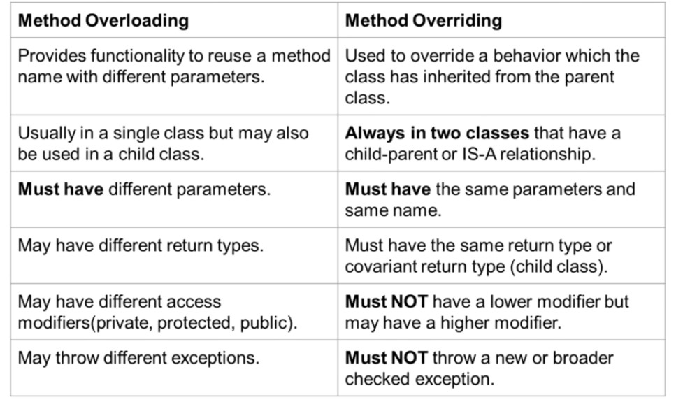
  
### Early Binding (Static binding)
  - Early Binding, methods, functions and properties are detected and checked during compile time and perform other optimizations before an application executes. The biggest advantage of using early binding is for performance and ease of development.
  ```java
    System.IO.FileStream FS ;
    FS = new System.IO.FileStream("C:\\temp.txt", System.IO.FileMode.Open);
  ```
  Above code, create a variable FS to hold a new object and then assign a new object to the variable. Here type is known before the variable is exercised during run-time, usually through declarative means. The FileStream is a specific object type, the instance assigned to FS is early bound. Early Binding is also called static binding or compile time binding.
  - ### static, private and final methods and variables are resolved using static binding which makes there execution fast because no time is wasted to find correct method during runtime. (Doubt?? if this is applicable to Java)

### Late Binding (Dynamic Binding)
  - Late binding functions, methods, variables and properties are detected and checked only at the run-time. It implies that the compiler does not know what kind of object or actual type of an object or which methods or properties an object contains until run time. The biggest advantages of Late binding is that the Objects of this type can hold references to any object, but lack many of the advantages of early-bound objects.

  ```java
    object FS = null;
    FS = CreateObject("Scripting.FileSystemObject");
  ```

  - Above code does not require a reference to be set beforehand, the instance creation and type determination will just happen at runtime.
  - ### It is important to note that the Late binding can only be used to access type members that are declared as Public. Accessing members declared as Friend or Protected Friend resulted in a run-time error.
  - Static Binding uses type, while dynamic binding uses actual object to bind. 
  

## Nested Classes
- The Java programming language allows you to define a class within another class. Such a class is called a nested class.
- #### As a member of the OuterClass, a nested class can be declared private, public, protected, or package private.
- #### Outer class can only be declared public or  package private
- #### only nested classes can have static keyword in their class defination.
- All outer classes are static by the defination of class, so doesn't make sense to define them static explicitly. (There is always going to be one class per class).

### Reason to use nested classes
- It is a way to logically group classes that are used only in one place, also leads to more readable and more maintainable code by placing code closer to where it is used.
- No other class should use this class.


### Types of Nested Classes
- Nested classes are divided into two categories: static and non-static. Nested classes that are declared static are called **static nested classes**.
- **Non-static nested classes are called inner classes**.

#### Static Nested Classes
- As with static methods and variables, a static nested class is associated with its outer class not with an instance of outer class.
- Like static method and static variables static nested class cannot refer directly to instance variables.
- The static nested class cannot access the outer class' instance properties, it can access static properties (shared by all the instances), which are inside the visibility scope.
-  In effect, a static nested class is behaviorally a top-level class that has been nested in another top-level class for packaging convenience.
-  Static nested classes can be accesed as ```OuterClass.StaticNestedClass```

#### Inner Class/ Non Static Nested Class.
- ### The inner class(nested non static) has access to all the members of the outer class. This is important (Mosh did mistake in the iterator example creation assuming it doesn't.)
- As with instance methods and variables, an inner class is associated with an instance of its enclosing class and has direct access to that object's methods and fields. 
- Inner classes have access to other members of the enclosing class, even if they are declared private.
- ### **Also, because an inner class is associated with an instance, it cannot define any static members itself.**
- Objects that are instances of an inner class exist within an instance of the outer class.
- You can explicitly refer to the OuterClass instance from within the inner class using ```OuterClassName.this.outerClassMethodOrField```. Useful when both inner and outer class have the same name
  ```java
  class Outer {
      void show() {
          System.out.println("outter show");
      }

      class Inner{
          void show() {
              System.out.println("inner show");
          }

          void outerShow(){
            //Call using Outer.this.show();
            Outer.this.show();
          }
      }
  }
  ```

- Inner Classes are of 2 types local classes and anonymous classes.
#### Local Inner Class
- Local Inner Classes are the inner classes that are defined inside a block. Generally, this block is a method body. Sometimes this block can be a for loop, or an if clause.Local Inner classes are not a member of any enclosing classes.
- Local inner class cannot be instantiated from outside the block where it is created in.

#### Anonymous Class
It is an inner class without a name and for which only a single object is created. An anonymous inner class can be useful when making an instance of an object with certain “extras” such as overloading methods of a class or interface, without having to actually subclass a class.

Anonymous inner class are mainly created in two ways:
- ### Class (may be abstract or concrete)
- Interface ( The usual way)
  - Useful in creating a task in a new thread
The syntax of an anonymous class expression is like the **invocation of a constructor**, except that there is a class definition contained in a block of code.
- Don't forget that we are actually invoking the constructor in case of abstract/ concrete classes.
- The anonynmous class syntax actually invokes an object of the anonymous class. 
```java
new InterfaceSample(){
  @Override
  public void test_method(){
    //This is where you can override the method of InterfaceSample.
  }
}
```
- In above code, we can also use a concrete/ abstract class instead of a interface.
- Useful in creating threads
  ```java
  Thread t = new Thread(
    new Runnable(){ 
              @Override
              public void run() 
              { 
                  System.out.println("Child Thread"); 
              } 
          }); 
  ```
- Functional Interfaces + Anonymous classes + Syntactic sugar = Lambdas


## Accessors - Getters and Setters 
- **The advantage of using getters and setters - that only get and set - instead of simply using public fields for those variables, if it is just a simple get and set**
  - Because 2 weeks (months, years) from now when you realize that your setter needs to do more than just set the value, you'll also realize that the property has been used directly in 238 other classes.
  - Encapsulation of behavior associated with getting or setting the property - this allows additional functionality (like validation) to be added more easily later.
  - Providing a debugging interception point for when a property changes at runtime - debugging when and where a property changed to a particular value can be quite difficult without this in some languages.
  - Improved interoperability with libraries that are designed to operate against property getter/setters - Mocking, Serialization, and WPF come to mind.
  - Allowing inheritors to change the semantics of how the property behaves and is exposed by overriding the getter/setter methods
- **Getter and Setter break encapsulation?**
  - Having getters and setters does not in itself break encapsulation. What does break encapsulation is having a getter and a setter for every data member (every field, in java lingo). That is one step away from making all data members public.
  - Bad OO design: public fields.
  - Sort of bad OO design : when getters and setters are used, even when not required. An object can be teared apart by other objects, since they are able to inject any new data into it, through setters. The object simply can’t encapsulate its own state safely enough, since anyone can alter it.
  - Great OO design : used only where they're really required - and that to expose the behaviour of your class instead of a tool to manipulate the data.  For data transfer objects public fields or all getters and setters are not so bad. It is also common to only have getters on object that we dont want others to modify, hence immutable.

## Enums in Java
- In Java, an enum (short for enumeration) is a type that has a fixed set of possible values.
- If we declare a variable of the Enum type, it is guaranteed that the variable will hold one of the declared values. If we try to pass values other than those declared values, the compiler will generate an error.

### Advantages
- Type safety and value safety.
- Guaranteed singleton.
- Ability to use values in switch statement case statements without qualification.
- Built-in sequentialization of values via ordinal().
### Enums as fixed number of constants
```java
public enum SitePointChannel {
    JAVA,
    MOBILE,
    WEB,
    PHP,
    WORDPRESS,
    JAVASCRIPT,
    DESIGN;
}
```
- you can assign an enum like ```SitePointChannel channel = SitePointChannel.JAVA;```
- Enums can be used in identity comparisions and switch statement.
- Switch Statement
  ```java
  switch (channel) {
      case JAVA:
          System.out.println("Java, web and desktop technologies");
          break;
      case MOBILE:
          System.out.println("Mobile technologies");
          break;
      case PHP:
          // as usual for switch, once a match was found, the execution
          // "falls through" to the next branch until it hits a break
      case WEB:
      case JAVASCRIPT:
      case WORDPRESS:
          System.out.println("Web technologies");
          break;
      default:
          throw new IllegalArgumentException(
                  "Unknown channel '" + channel + "'.")
          break;
  }
  ```
  It is good practice to list all enum constants (even if some of them don’t do anything) and add a default branch, usually with an exception (in case a new constant gets added and someone misses the switch statement and doesn’t update it.)

### Enums as a class - Important
- Enums are much more like classes.
- When an enum class is created, the compiler will also create instances (objects) of each enum constants.

- ### **Each enumeration constant is an object of its enumeration type**
- Enum constants are not special, they are just, public static final members of their enum type. Internally they are just like
  ```java
  public static final Planet MERCURY = new Planet(3.303e+23, 2.4397e6);
  public static final Planet VENUS = new Planet(4.869e+24, 6.0518e6);
  public static final Planet EARTH = new Planet(5.976e+24, 6.37814e6);
  public static final Planet MARS = new Planet(6.421e+23, 3.3972e6);
  public static final Planet JUPITER = new Planet(1.9e+27, 7.1492e7);
  public static final Planet SATURN = new Planet(5.688e+26, 6.0268e7);
  public static final Planet URANUS = new Planet(8.686e+25, 2.5559e7);
  public static final Planet NEPTUNE = new Planet(1.024e+26, 2.4746e7);
  ```
- The only reason we don’t have to put public static final in is that the compiler fills it in for us.
- They can implement interface just like classses.
- They can have fields and methods.
- ### The difference is they cannot be created using the new keyword
- They cannot be exetend other classes.
- ### All enums implicitly extend java.lang.Enum. In Java, a class can only extend one parent and therefore an enum cannot extend any other class (but implement interfaces).


#### Methods in enum
- Extending enums means it has the following methods to use.
  - static ```values()```
    -  returns an array of enum-type variables containing all of the enumeration constants.
  - static ```valueOf(String)```
    - The valueOf(String) method returns an enumeration constant whose value corresponds to the string passed to it or throws an IllegalArgumentException if no constant with the specified name was found.
    - Case sensitive  
  - name()
    - This method returns the name(String) of this enum constant, exactly as declared in its enum declaration.
  - ordinal()
    - This method is used to obtain an enumeration constant’s position in the list of constants. This is called the ordinal value.
  - compareTo(Enum)
    -  This method is used to compare the ordinal value of two constants of the same enumeration. This method returns a negative integer, zero, or a positive integer based on the ordinal positions of the two instances that are being compared

#### Enums with Fields (IMPORTANT)
- Java enumeration constants can have fields, which must be given a value at creation time.
- Keep in mind that as with instances of a regular class, each enumeration constant has its own fields. 
- In order to define values, the enclosing type must have a constructor that accepts parameters.
- ### ENUM Values are comma separated. And also when there are fields and methods, the list of enum constants must end with a semicolon.
- ### each enumeration constant is an object of its enumeration type, so a constructor is called for each of the enumeration constants.

```java
public enum Month {

    JANUARY(31),
    FEBRUARY(28),
    MARCH(31),
    APRIL(30),
    MAY(31),
    JULY(31),
    AUGUST(31),
    SEPTEMBER(30),
    OCTOBER(31),
    NOVEMBER(30),
    DECEMBER(31);

    private int numberOfDays;

    Month(int days){
        this.numberOfDays = days;
    }

    public int getDays(){
        return numberOfDays;
    }
}
```

#### Enums with Methods
- Besides the basic method available to all enums you can add custom methods to add additional functionalities.
```java
public enum SitePointChannel {

    JAVA,
    MOBILE,
    WEB,
    PHP,
    WORDPRESS,
    JAVASCRIPT,
    DESING;

    public static SitePointChannel valueOfIgnoreCase(String channelName) {
        channelName = channelName.toUpperCase();
        return valueOf(channelName);
    }

}
```

## Type of class and object.
- ### instanceof 
  - tests whether the object reference on the left-hand side (LHS) is an instance of the type on the right-hand side (RHS) or some subtype.
- ### getClass()
  - - tests whether the object reference on the left-hand side (LHS) is an instance of the type on the right-hand side (RHS) or some subtype.
- ### SomeClass.class
  ```java
    List<Integer> l = new ArrayList<>();
    System.out.println(l instanceof List); // True
    System.out.println(l.getClass() == List.class); //False
  ```

# Generics


## Using Object vs Generic Approach for Generalization

### Compile Time checks
Instead of using generics, if we just use Array of Objects to implement our GenericList, we have
```java
  public class GenericList {
    private Object[] items = Object[10];
    
    private int count;
    
    public void add(Object item){
      items[count++] = item
    }

    public Object get(int idx){
      return items[idx];
    }
```
- The problem with the above approach, is that in the above approach, we don't have any **compile time check** for the type of the object that is passed, so if we ever have any type casting in the main/calling class we will get a run-time error.
```java
  var list = GenericList();
  list.add(1);
  list.add("1");
  int number = (int)list[1]; //This line will throw a run-time exception.
```

## Things to keep in mind

### Can't be Instantiated.
- Java compiler doesn't know what is T at the compile time so it cannot instantiate it.
### Can't use primitives in generics
- However autoboxing still can happen
```java
GenericList<Integer> l = new GenericList<>();
l.add(1);//Valid
```
## Generics in class
```java
public class GenericList<T> {
  private T[] items = (T[])Object[10];
  
  private int count;
  
  public void add(T item){
    items[count++] = item
  }
}
```
- See here We have to instantiate using the Object[] and not directly T[].


## Generics in methods
- different position than that of class, the template parameter is defined before the return type, instead of after the name( as with classes).
  ```java
  //class need not have generics to have a generic method.
    public class Utils{
      public <T extends Comparable<T>> T max(T first, T second){
          return first.compareTo(second) > 0 ? first : second;
      }
    }
  ```
- ## Remember to write ```T extends Comparable<T>``` and not just ```T extends Comparable```, since that will cause possibilities of run-time exceptions. (Very Important since a similar mistake was made.)
- calling a method generic is also different, there is no arrow notation to define the type while calling, the type is inferred from the first time T is assigned.
  ```java
  Utils.max(1,2);
  ```
- Calling ```Utils.max(1,"245")``` will cause compile time warning if ```Comparable<T>``` is extended and run-time exception if only ```Comparable``` is extended.

## Multiple Type Params in Generics
```java
public static <K,V> void printCustom(K key, V value){
  System.out.println("Key : " + k + ": Value " + value);
}


public static void main(){
  printCustom(14,"Fourteen"); // (K can be anything and V can also be any other Object or same too).
}
```

## Bounded Type Params

### Class constraints
- Say we only want to store numbers in a list, so T should only be Number class or any child of Number class (Integer, Float, Byte, Long, Double etc)
```java
public class GenericList<T extends Number> {
  private T[] items = (T[])Object[10];
  
  private int count;
  
  public void add(T item){
    items[count++] = item
  }
}
```
### Interface constraints
- We can also place the constraint in interfaces, say our class will require the T to be comparable. (i.e implements comparable)
  ```java
  public class GenericList<T extends Comparable<T>> {
    private T[] items = (T[])Object[10];
    
    private int count;
    
    public void add(T item){
      items[count++] = item
    }

    public int compareIndex(int idx1, int idx2){
      items[idx1].compareTo(items[idx2]);
    }

  }
  ```

- Multiple Interfaces can be passed (Note it is a single ampersand)
  ```java
  public class GenericList<T extends Comparable<T> & Clonable> {
    private T[] items = (T[])Object[10];
      ....
    }
  }
  ```

## Raw Types

- Raw types refer to using a generic type without specifying a type parameter. For example, List is a raw type, while List<String> is a parameterized type.
- We should avoid raw types, they aren't type safe, and some important kinds of errors will only appear at runtime
- raw types were retained only to maintain backwards compatibility with older versions of Java.


## Type Erasure (Generics under the hood)
- When a class is compiled from .java file to byte-code. The compiler converts the type parameter T and replace with an actual class. In other words, Type erasure is a process in which compiler replaces a generic parameter with actual class or bridge method.

  - T : Gets converted to Object
  - T[] : Gets converted to Object[]
  - T extends Number : Gets converted to Number
  - T extends Comparable : Gets converted to Comparable
  - T extends Comparable & Clonable : Gets converted to Comparable (Left-most one)


## List<SubType> not a subtype of List<SuperType>
- If we have the requirement, where Users is superclass and Instructors is subclass and we want a generic print all method which should print all the subtypes of users with List<T extends User> as input, we would need to use wildcards. (List<Instructor> is not a subtype of List<User>)


## Wildcards
- As seen above List<SubType> is not a subtype of List<SuperType>, wildcard is how we tell the compiler to have a upper bound(? extends) and lower bound(? super) on the List.
- PECS (PRODUCERS EXTEND, CONSUMER SUPER)
### Unbounded Wildcard
- Just using ```List<?>``` will accept Lists of all the types.
### Upper Bound (? extends T)
- Accepts all the values of T which are either T or are a subclass of T.
- You cannot add (say integer) the list below though, since you don't have access to the type of ?, it can be Double, Integer, Big Decimal. You have no way of knowing. So this is only for reading. list is of type producer, you read from it, if your parameter is producer use extend.
```java
//Accepts all the List of Objects where object is the subclass of Number.
static double sumAllNumbers(List<? extends Number> list){
    double sum=0.0;
    for (Number number : list) sum += number.doubleValue();
    return sum;
}
```


### Lower Bound (? super T)
- Accepts all the values of T, which are either T or are the superclass of T.
- If you want to write to list you need to use ? super T, you cannot read from it(without casting). here since the list is consuming the data, it is a consumer and consumers super. (PECS : Producers extend, Consumer Super)
```java
//Cannot get Number from the list (without casting)
static void insertFewNumbersToList(List<? super Number> list){
  list.add(1);
  list.add(1f);
  list.add(1.1);
}
public static void main(String[] args) throws InterruptedException {
  //Cannot use List<String> Here though. That is the type safety you get.
  List<Number> list = new ArrayList<>();
  insertFewNumbersToList(list);
}
```

# Important Classes
## Number Class
- SuperClass of Float, Byte, Integer, Long, Double, Short, BigInteger etc.


# Important Interfaces
## Comparable Interface
- It is a generic interface.
  ```java
  public class User implements Comparable<User>{

    int points;

    @Overide
    int compareTo(User other){
      return this.points - other.points;
    }

  }
  ```
- If you don't pass the generic type argument to comparable, the compareTo method will be implemented as follows
  ```java
  int compareTo(Object other){ // instead of int compareTo(User other)
    ....
  }
  ```
  - This is bad since the compile time checks for casting etc, won't be there.

## Comparator Interface
- It is also a generic interface. Don't use raw types.
- If there are multiple fields that an object can be compared against, then a comparable interface just won't do. In this case we can define our own custom comparator objects for each field that can be compared against, and feed our comparator object to the sort method in the calling function.
- The above method can be simply called using a lambda function since it is a functional interface.

```java
import java.util.Comparator;
public class EmailComparator implements Comparator<Customer> {
    @Override
    public int compare(Customer o1, Customer o2) {
        return o1.getEmail().compareTo(o2.getEmail());
    }
}

//In main call like:
Collections.sort(customerList, new EmailComparator());
```

### Reveresed Method
- To reverse the order of sorting.

# JVM
[Link for video](https://www.youtube.com/watch?v=ZBJ0u9MaKtM&t=2s)
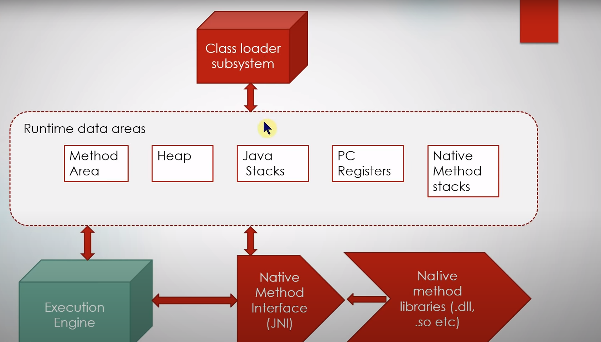
## Class Loader
- The Java ClassLoader is a part of the Java Runtime Environment that dynamically loads Java classes into the Java Virtual Machine. 
- Java classes aren’t loaded into memory all at once, but when required by an application, at which point class loader is called by the JRE, these class loaders load classes into memory dynamically.
- Not all classes are loaded by a single ClassLoader. Depending on the type of class and the path of class, the ClassLoader that loads that particular class is decided. 
- ```ClassLoader getClassLoader()``` : This method returns the class loader for this class. 
### BootStrap ClassLoader
- A Bootstrap Classloader is a Machine code which kickstarts the operation when the JVM calls it. It is not a java class. Its job is to load the first pure Java ClassLoader. Bootstrap ClassLoader loads classes from the location rt.jar.
- rt = Run Time. It contains all the java runtime libraries. (Essential)
### Extension ClassLoader:
- The Extension ClassLoader is a child of Bootstrap ClassLoader and loads the extensions of core java classes from the respective JDK Extension library. It loads files from jre/lib/ext directory or any other directory pointed by the system property java.ext.dirs.

### Application/System ClassLoader
-  An Application ClassLoader is also known as a System ClassLoader. It loads the Application type classes found in the environment variable CLASSPATH, -classpath or -cp command line option. The Application ClassLoader is a child class of Extension ClassLoader.

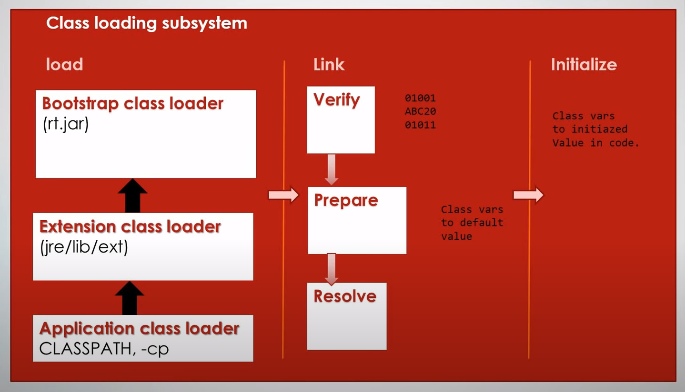

## Runtime Data Areas
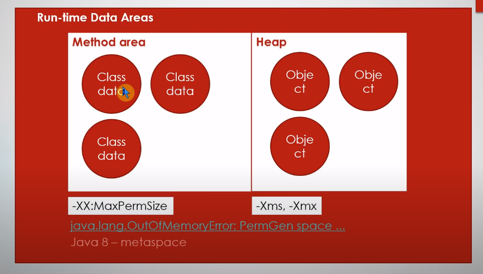
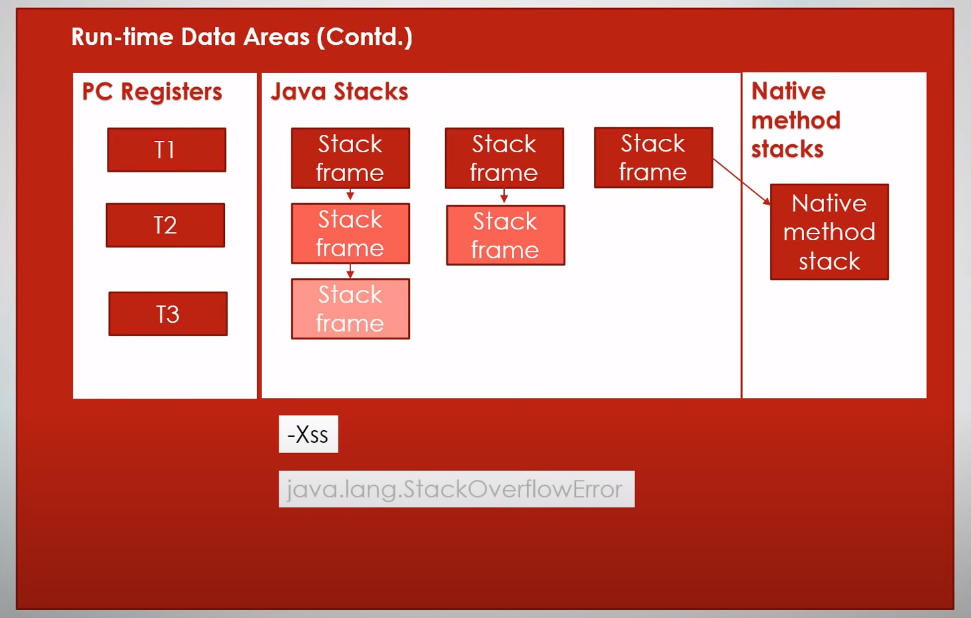

### Method Area / Perm Gen Space (JAVA-8 Metaspace) (Shared - Not Thread Safe) 
- (Shared - Not Thread Safe)
- class/static variables
- byte code
- class level constant pool/Runtime Constant Pool
- ?reflection uses this area.
- #### Moved to metaspace in java 8, native OS Memory, as much memory/virtual memory as there is available for operating system.
- before java 8 -> (64 MB - Default) change using -XX:MaxPermSize, if low perm size you get java.lang.OutOfMemoryError:PermGen


#### PermGen vs MetaSpace
- Metaspace by default auto increases its size (up to what the underlying OS provides), while PermGen always has a fixed maximum size. You can set a fixed maximum for Metaspace with JVM parameters, but you cannot make PermGen auto-increase.

#### Runtime Constant Pool
A class file keeps all its symbolic references in one place, the constant pool. Each class file has a constant pool, and each class or interface loaded by the Java virtual machine has an internal version of its constant pool called the runtime constant pool . The runtime constant pool is an implementation-specific data structure that maps to the constant pool in the class file. Thus, after a type is initially loaded, all the symbolic references from the type reside in the type's runtime constant pool.
[Link](https://blog.jamesdbloom.com/JVMInternals.html#constant_pool)

### Heap (Shared - Not Thread Safe)
- (Shared - Not Thread Safe)
- Object data is stored.
- Every time you instantiate an object your object is stored in heap.
- Instance variables etc.
- Tuned using -Xms (Minimum) and -Xmx (Maximum)
- Default Xms is 1/4 of memory.

### PC Register (Isolated Per Thread) i.e Thread Safe
- Contains the Program counter, i.e pointer to the next instruction to be executed per thread, In image above T1 is program counter for thread 1.

### Java Stack (Isolated Per Thread) i.e Thread Safe
- Contains stack frame corresponding to current method execution per thread. In above image, T1 has 3 methods, method 1 calling method 2 and it calling method 3 in turn.
- local variables inside a method.
- operand stacks/ scratch area.
- parameters, return values.
- For each thread we have a unique stack.
- Depth controlled using -Xss. If too much stack then we get StackOverFlow Error.

### Native Method Stack (Isolated Per Thread) i.e Thread Safe
Suppose you are trying to load a dll, and calling a method inside that dll, we use Native Method Stack.

## Execution Engine
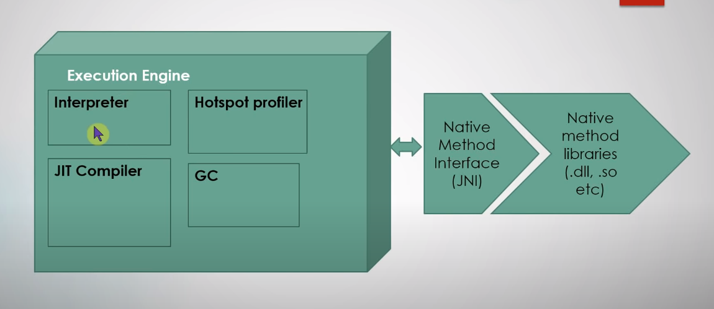

### Interpreter
- Takes bytecode, looks at it and finds out what native operation has to be done and executes that native operation using Native Method Interface(JNI) and native methods are in .dll/.so files.
### Just in Time Compiler (JIT)
- JIT Compiler on the fly, compiles the repeated code (hotspots) (so they won't be interpretted again and again) to native machine code.
### Hotspot Profiler/VM
- It keeps the eye on bytecode that is running and identifies hotspots for use by the JIT Compiler.
### Garbage collector
- Cleans up unused classes, objects in memory areas.

### AOT Compiler
- The primary motivator behind using AOT in Java is to bypass the interpreter. It is generally faster for the machine to execute machine code than it is to execute the code via the bytecode interpreter.


# Garbage Collector
- Java provides automatic memory management using program management.
- Garbage collection is carried by a daemon thread called Garbage collector.
- We cannot force gc to happen (but calling System.gc() might trigger it).
- ```java.lang.outOfMemoryError``` heap space is full. Even with Garbage Collector you can have memory leaks.

## Types of garbage collections
- There are 2 types of garbage collections, minor(eden space) and major(across the heap).
- Both are stop the world garbage collection.

## Based on hypothesis
- Most objects soon become unreachable.
- Objects which are going to live an extending period of time usually don't refer to freshly created objects.

## Terminology
### Live Objects
- Reachable objects
### Dead Objects
- Unreachable objects

## Steps
### Mark
- Garbage collector walks through object graph, and marks reachable object as reachable.

### Sweep
- unreachable objects are deleted.

### Compaction
- arrange everything in order, defragmentation. Make allocation contigious. Takes time.

## Heap space division
- Java garbage collectors are generational collectors.
- Below is a diagram of heap.
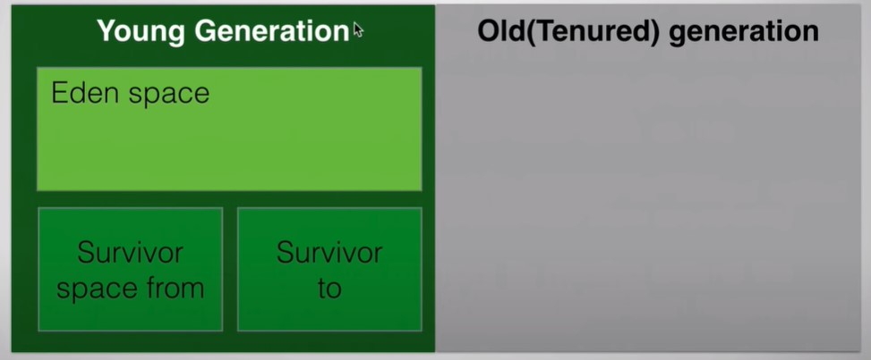
### Young Generation
- Place where objects are created initially.

#### Eden Space
- The space where objects are created.

#### Survivor Space
- When eden space is full, a minor garbage collection kicks in and moves reachable objects from eden to survivor space.
- There are 2 survivor space.
- The below pic shows the state of the heap after the first cycle of minor gc.
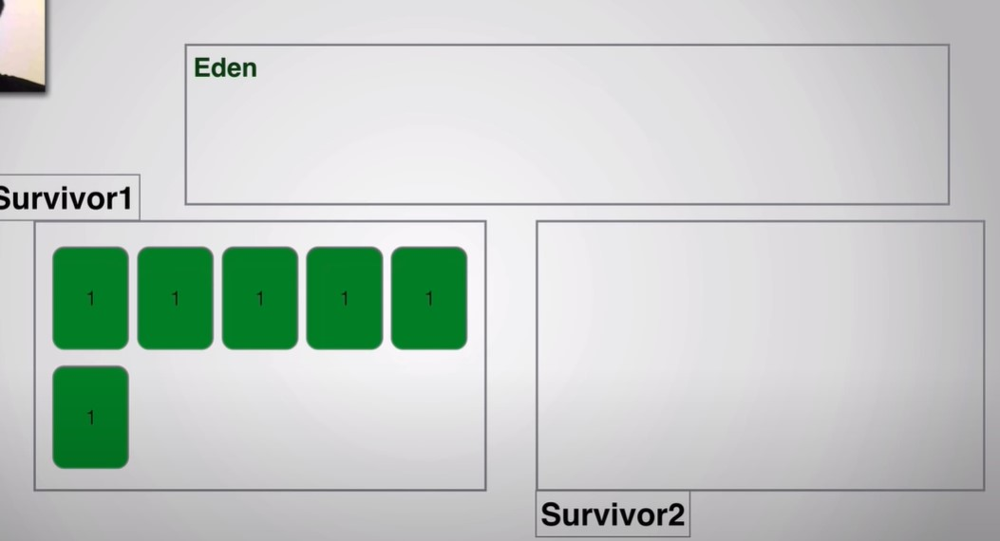
- As time passes now more objects are added to eden space and some objects in survivor space become unreachable. And when eden space becomes full again, it triggers another minor gc across eden and survivor and are moved to survivor space 2.
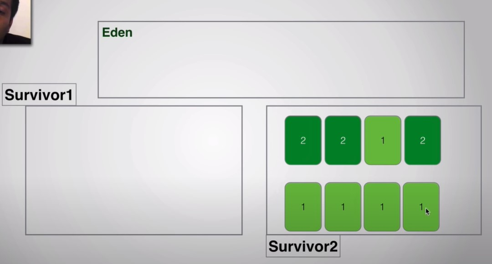
- The presence of 2 survivors spaces is to avoid an additional compaction step.
- Similarly there is toggling/reordering of survivor spaces occurs in alternative minor gc cycle till a threshold is reached. At the end of that threshold all the survivor objects are moved to old/tenured generation.

### Old/ Tenured Generation
- Objects which survives for a long time.
- When old generation becomes almost full/reaches a threshold ```(-XX:MaxTenuringThreshold)``` we run major gc.
- Will block the application execution and is very heavy operation.


## GC Types based on implementation.

### Performace of GC
#### Latency
- How quickly an application responds with requested piece of data.
- How fast a website is loaded or how fast a query is returned.
- Application that requires high responsiveness, large pauses in time are not acceptable. 
#### Throughput
- Maximize the amount of work by application over a period of time.
- Batch Processing or total db queries in an hour.
- High pauses are acceptable. Since we focus on benchmarks over longer period of time.
- Based on above 

Based on the discussion above we should choose gc that is apt for us.

### Serial GC
- Single thread for all mark, sweep and compaction
- Stops the world at all steps.
- for basic application/ console apps.

### Concurrent GC (Low Latency GC)
- Performs GC along with application execution.
- Does not wait for old generation to be full.
- ### Stops the world only during mark/re-mark step.
- Application demands short pauses not long pauses.

### Parallel GC
- Uses multiple cores of CPU.
- Multiple thread doing mark/sweep/compaction.
- It doesn't run at the same time as application.
- ### (NOT SURE) The GC Actions stops the world at all steps but the execution is fast.
- Doesn't trigger till GC is near full.
- Application demands high throughput.

### G1 Garbage First GC (Java 9 onwards default)
- Tunable GC Pauses.
- Low pauses in fragmentation
- Parallelism and Concurrency Together
- Better heap utilization
- Divides the heap into small regions of memory, each of these region can be eden/survivor/tenured.
- It dynamically selects a region to act as young generation in the next gc cycle, Regions with most unreachable places will be collected first

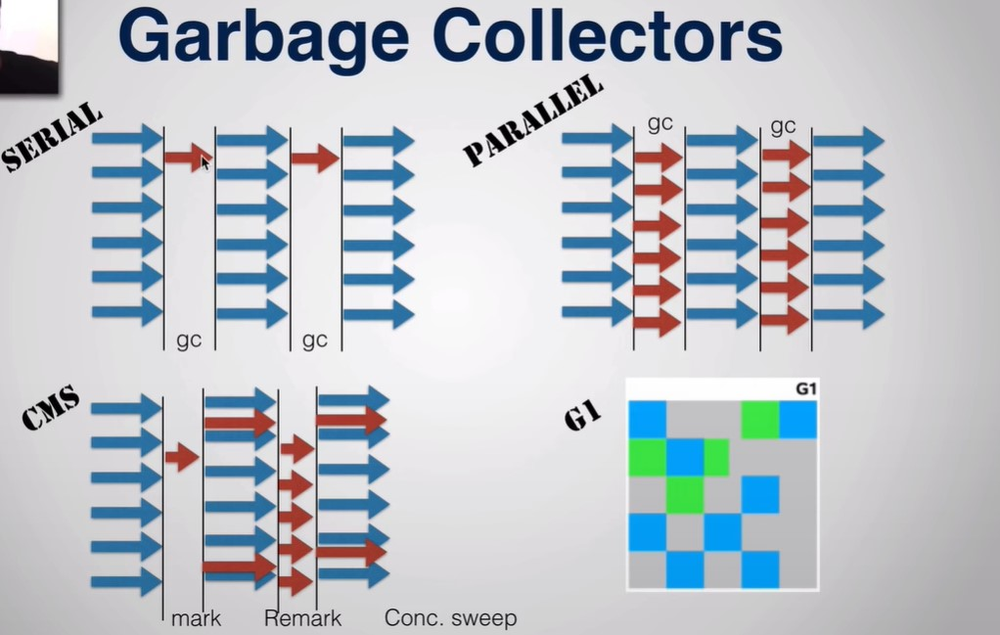

You can configure the gc to use in the flag passed.
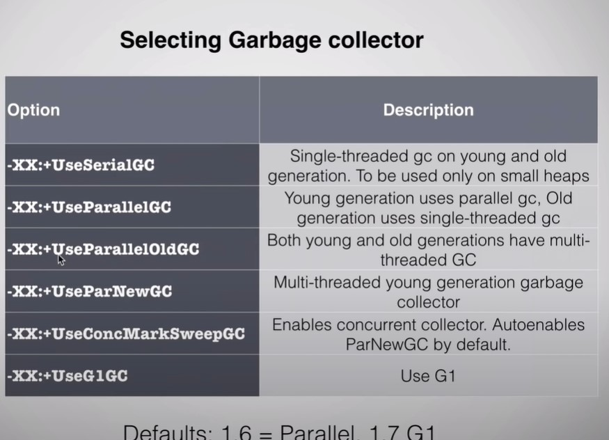


## Finalize Method.
- This method is called when the object is garbage collected.
- But it is not recommended to put dbconnection.close kind of the important methods. Since the object can stay in heap for a long time and the dbconnection will be consuming the memory till that time. So better to remove expensive resources once you know you no longer need it.
- You can instead use try-with autoclose idiom to close the dbconnections, make sure your object that needs to be autoclosed on going out of scope implements the **java.lang.AutoCloseable.**
- If you recreate the object during finalizer. The object is recreated and is not garbage collected, to avoid permanent object persistence there is a contract which says an object's finalizer can only be run once.

## Debug GC
- You can print details of gc using ```-Xloggc:gc.log```.
- jvisualvm

# Design Patterns used in JAVA
## Singleton
- java.lang.Runtime#getRuntime()

## Prototype
- Clone method

## Decorator
- InputStream, OutputStream

## Observer
- EventListener

## Strategy
- Comparator

## Flyweight
- is used with some values of Byte, Short, Integer, Long and String.

# String

- Backed by character array.
- It is immutable ```s1.toUpperCase()``` doesn't modify the string s1 but returns a new String with upperCase letters.
- Using code like ```String s = "This " + 20 + "is" + Boolean.valueOf(true)"; ``` was discouraged since these kinds of statements lead to creation of lots of intermediate String objects. This issue is no longer an issue since these statements are now implemented using StringBuilder.

## Integer Cache in JAVA
- In Java 5, a new feature was introduced to save the memory and improve performance for Integer type objects handling. Integer objects are cached internally and reused via the same referenced objects.

- This is applicable for Integer values in the range between –128 to +127.
This Integer caching works only on auto-boxing. Integer objects will not be cached when they are built using the constructor.
- This is based on the assumption that these small values occur much more often than other ints and therefore it makes sense to avoid the overhead of having different objects for every instance 


## String Pool
- ### Strings are stored in a separate memory pool in permGen space(<Java 1.7) or main heap(>=Java1.8) called string pool. Each string you create is cached/interned if it is created using string literal.
  ```java
  //Creating string using a string literal. 
  String s1 = "Hello";  //Caches the s1 object.
  String s2 = "Hello"; //JVM, searches the permGen space to see if it already has "Hello" object, and returns its reference if it is found.
  ``` 
  Both s1 and s2 in above code point to same object. You can test this by checking ```s1==s2```.
- ### Strings created using new keyword/ constructor are not interned
  ```java
  String s1 = "Hello";
  String s2 = new String("Hello"); // Not gonna search for the cached string.
  System.out.println("are references equal? :" + (s1 == s2).toString()); //Prints false.
  ```
  s1 and s2 are not pointing to same object.


- ### You can explictly tell JVM to intern the object created using new by using intern keyword.
  ```java
  String s1 = "Hello";
  String s2 = new String("Hello").intern();
  s1 == s2 //prints true.
  ```

## Why Strings are immutable
- To preserve the strings cached in string pool, it is restricted to modify the string since that same string object might be being used in multiple other places and changing it will lead to unexpected results.
- By making it immutable, Strings are immutable.
- Since Strings are immutable, their hashcode are cached(inside object itself) and this improves performance.

## Useful Methods
### indexOf
- Used to find the index of substring.
- Use indexOf(substring, fromIndex) to find additional occurance of the substring. By default returns the first found index.

### lastIndexOf
- Find the last index of a substring in a string.

### contains
- boolean, if a given string contains a substrings.

### substring
- returns a new string which is a substring of the given string.
  ```java
    s1.substring(startIndex,endIndex);
  ```
- ### endIndex is non inclusive
- ### Pecular behavior of substring is that if startIndex/endIndex is too large it throws arrayIndexOutOfBounds Exception. But if the startIndex == length of string, it doesn't throw an exception just returns an empty string. 
- Till Java 1.7, substring operation was a source of memory leak. The substring method was actually storing the reference of the original string and was using offset parameter in String to return substring.

## Regular Expressions

### matches


### Find occurances of a pattern in a string using regular expression
```java
        String s = "HelloHelloafsdafa fasfasfasfHellohello";
        Pattern pattern = Pattern.compile("(H|h)ello");
        Matcher matcher = pattern.matcher(s);
        int occurances =0;
        while (matcher.find()){
            occurances++;
        }
        System.out.println(occurances); //Prints 4
```

## Good Practises
- If you are trying to compare 2 strings, one of which can be null(Maybe a return value from other function). Compare using the other String.
  ```java
  class Main{
    static final SUCCESS = "success";

    void process(){

      string s = getString(); // may return null
      if(SUCCESS.equal(s)){ //Instead of s!=null && s.equal(SUCCESS)
        ...
      }
      else{
        ...
      }

    }
    String getString(){
      return null;
    }

  }
  ```

- String is not a good way to store passwords, since string are created and cached in string pool for some time. Use a char array, and after you are done using the password, set char array elements to 0.


# StringBuffer
- mutable character array, similar to strings.
- synchronised implementation.


# StringBuilder
- not synchronised.
- Use stringBuilder when you want to concat large number of strings or do lots of changes to string.
## append
- Example ->
  ```java
    StringBuilder s = new StringBuilder("This ").append(20).append("is").append(true);
  ```
## concat


# Java Language Features
## Weak Reference
- If no other reference is available for the object pointed by weak reference, the object is marked for garbage collection.

## Soft Reference
- Like weak reference, but the garbage collection will wait till there is need to perform garbage collection, if heap is getting full.


## Annotations
- Special type of keyword used to embed instructions for JAVA Compiler
- Embed Instructions for source code processing tools
- Embed meta data which can be read at runtime by Java Application or third party tools
  - Spring etc.
  - Java library will access the annotation at runtime via Java Reflection.

### Where it can be used
- Above a / Infront of a
  - class declaration
  - member variable declaration
  - constructor
  - method
  - parameter
  - static method
  - static parameter

- Annotations are usually designed to be used with one of the above places, not all.

### Built-In Annotations
- @Override
- @Deprecated //Source code processing.
- @SuppressWarnings 

### Custom Annotation
- Similar to creating class. The ```@interface``` element is used to declare an annotation.
- Points to keep in mind
  - Method should return one of the following: primitive data types, String, Class, enum or array of these data types.
  - Method should not have any throws clauses
  - Method should not have any parameter.
  - We should attach @ just before interface keyword to define annotation.
  - We may assign a default value to the method.
  - We can use another annotation ```@Target(ElementType.X)``` where X can be TYPE or METHOD or CONSTRUCTOR or FIELD, to limit where the annotation can be used.
  - You can specify for your custom annotation if it should be available at runtime(for inspection via reflection)/ source(only visible in source code, not in byte code/ run time)/ class(visible in source and byte code but not in runtime),. You do so by annotating your annotation definition with the @Retention annotation. Here is how that is done: ```@Retention(RetentionPolicy.RUNTIME)```
  - The ```@Inherited``` annotation signals that a custom Java annotation used in a class should be inherited by subclasses inheriting from that class.
  - The ```@Documented``` annotation is used to signal to the JavaDoc tool that your custom annotation should be visible in the JavaDoc for classes using your custom annotation.
```java

  //Define using @interface
  //Restrict where an annotation can be used

  import java.lang.annotation.ElementType;
  import java.lang.annotation.Target;

  //Annotation can only be used above a class/interface/enum/another annotation
  @Target(ElementType.TYPE)
  public @interface MyAnnotation {
      //Methods for Java Annotation, Annotation properties are also called elements
      String Name();
      int count() default 99;
      String[] arrayString();
  }
  ```

## User Input

- The Scanner.next()/ nextInt() won't consume the newline character so to use nextLine after nextInt you need to first consume newline by an additional nextLine.

- ```java 
  String text = new Scanner( source ).useDelimiter("\\A").next();
  ```
    One line, one class. The only tricky is to remember the regex ```\A```, which matches the beginning of input. This effectively tells Scanner to tokenize the entire stream, from beginning to (illogical) next beginning. As a bonus, Scanner can work not only with an InputStream as the source, but also a File, Channel, or anything that implements the new java.lang.Readable interface. For example, to read a file:

    ```java
    String text = new Scanner( new File("poem.txt") ).useDelimiter("\\A").next();
    ```

- you can accommodate a specific character set with Scanner example you can pass a charset to the constructor.


## Regex


## Misc
- In java the assignment operator returns the object that is assigned
```java
boolean r;
boolean x = r = false;
if(r=true) //This condion passes
  System.out.println("We entered the loop")
```
- Look carefully in MCQs they don't write new while creating objects or they don't assign proper Reference type to objects.

```java
try{
  
}
catch(Exception e){
  throw Exception(); 
  // This will lead to compilation error.
}
```

```java
ArrayList arr = new CopyOnWriteArrayList();
// This will cause compilation error.
```
- Remember the using static keyword doesn't really change behavior of the function overload behaviour. The following code will lead to compilation error.
```java
  public static void main(String[] args){
    ...
  }
  public void main(String[] args){
    ...
  }
``` 

# Path vs ClassPath vs SourcePath
## ClassPath
- The CLASSPATH variable is one way to tell applications, including the JDK tools, where to look for user classes. (Classes that are part of the JRE, JDK platform, and extensions should be defined through other means, such as the bootstrap class path or the extensions directory.)

## SourcePath
- The sourcepath is the path to the sources you are compiling.

## Path
- Used to tell operating system where to find the binaries, like javac and java etc.


# Packages In Java
- Package in Java is a mechanism to encapsulate a group of classes, sub packages and interfaces. 
  - Preventing naming conflicts.
  - Making searching/locating and usage of classes, interfaces, enumerations and annotations easier
  - Providing controlled access
  - Data encapsulation
- We can access public classes in another (named) package using: package-name.class-name

## Default Package
- If no package is specified, the classes in the file goes into a special unnamed package (the same unnamed package for all files).
- If no package declaration is specified for 2 classes, they cannot access each other method unless the method is public.
- Package statement must be first statement in the program even before the import statement.


## Built-in Packages
-  java.lang: Contains language support classes(e.g classed which defines primitive data types, math operations). This package is automatically imported.
-  java.io: Contains classed for supporting input / output operations.
-  ava.util: Contains utility classes which implement data structures like Linked List, Dictionary and support ; for Date / Time operations.
-  
## User-defined packages
```java
package myPackage;

public class MyClass
{
    public void getNames(String s)
    {        
        System.out.println(s);        
    }
}
```

# Importing
- Sub packages are not imported if you perform * on the package.
## Useful libraries to import.
```java
import java.math.*;
import java.util.*;
import java.lang.*;
import java.util.regex.*;
import java.util.concurrent.*;
import java.util.stream.*;
import java.util.function.*;
```

## Static import in Java
- static import is a feature that expands the capabilities of import keyword. It is used to import static member of a class.
-  We all know that static member are referred in association with its class name outside the class. Using static import, it is possible to refer to the static member directly without its class name.
```java
import static java.lang.Math.*;
public class Test
{
    public static void main(String[] args)
    {
        System.out.println(sqrt(144)); // No need for Math.sqrt(144)
    }
}
```
- Similarly, if we import the ```import static java.lang.System.*``` then we can do ```out.println("Hellow")``` instead of ```System.out.println```.

# Serialization
- Java serialization enables writing Java objects to file system for permanent storage or on network to transfer to other applications. Serialization in Java is achieved with Serializable interface.
- writeObject
- readObject
- writeReplace
- readResolve

## serialVersionUID
- The serialVersionUID is a universal version identifier for a Serializable class. Deserialization uses this number to ensure that a loaded class corresponds exactly to a serialized object. If no match is found, then an InvalidClassException is thrown.

# New IO

# Reflection
- You almost would never need to use it
- But as soon as, you are told to deal with classes which you don’t know at time of writing the code, and you must write code in too general way such that it can handle any class type then you will need reflection to do the job.

## real examples of Reflection
- Code analyzer tools
- Eclipse (Other IDEs) auto completion of method names
- Marshalling and unmarshalling XML (or JSON) to/from java beans code.
- Spring Framework for creating the beans
  - DI framework actually heavily uses reflection for injecting these bean dependencies.
- Parsing annotations by ORMs like hibernate entity
- Junit Testcases

### JSR-330

# To read

- https://javarevisited.blogspot.com/2012/05/how-to-access-private-field-and-method.html
- https://stackoverflow.com/questions/596462/any-reason-to-prefer-getclass-over-instanceof-when-generating-equals
- https://javarevisited.blogspot.com/2011/04/top-10-java-serialization-interview.html
- https://javarevisited.blogspot.com/2015/10/133-java-interview-questions-answers-from-last-5-years.html
- https://javarevisited.blogspot.com/2012/07/when-class-loading-initialization-java-example.html#:~:text=When%20a%20class%20is%20initialized%20in%20Java,-After%20class%20loading&text=A%20Class%20is%20initialized%20in%20Java%20when%20%3A,method%20of%20class%20is%20invoked.