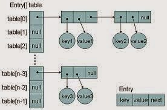

# Regular Array

## Simple way to initialize arrays
```java
int[] arr = {1,2,3,4,5,6,7};
```

- Arrays.asList(a)
# Iterable
- part of java.lang package not collections, fundamental interface to Java
- The advantage of using the iterable interface is it allows our code to be decoupled from the client side, i.e if the inner containers is changed from say array to arrayList none of the client side code that is using our class is affected. 
## Iterator Object
- Foreach is a syntantic sugar over iterator object. Bytecode representation will be using the iterator object, so if you want to iterate over an object use Iterable interface and define the get iterator object method.
  ```java
    IterableExample<String> iterableExample = new IterableExample();
    for (String s : iterableExample) {
        System.out.println( s);
    }
  ```
  is same as
  ```java
  var iterator = iterableExample.iterator();
  while(iterator.hasNext()){
      String current = iterator.next();
      System.out.println(current);
  }
  ```

- Used to iterate over an object of type iterable.
- Complete custom iterable and iterator example. Try implementing yourself to get concrete idea.
- Look at comments below, some important information is there.
```java
import java.util.Iterator;

public class IterableExample<T> implements Iterable<T> {

    private T[] items = (T[]) new Object[10];
    private int count;

    void add(T item){
        items[count++] = item;
    }

    T get(int idx){
        return items[idx];
    }


    //We define our own custom iterator as an inner class and return that.
    @Override
    public Iterator<T> iterator() {
        return new ListIterator();
    }

    //See that the Iterator also should have the generic parameter T passed for type safety.
    private class ListIterator implements Iterator<T>{
        
        //The inner class(nested non static) has access to all the members of the outer class
        // (Mosh did mistake by adding non required fields for the Outer Classes's instance, correct implementation
        // reference : https://www.csc.ncsu.edu/courses/csc216-common/Heckman/lectures/19_InnerClasses_Iterators.pdf)
        //Using this index we can check the current i in the for loop.
        int index=0;

        //You can check what methods doesn't have default implementation in IntelliJ by looking at the icon of the method,
        // it will have 2 parallel lines.
        @Override
        public boolean hasNext() {
            return index < count;
        }

        @Override
        public T next() {
          //direct access to outer class member variables and functions
          //Also can explicitly reference outerclass instance as 
          //return IterableExample.this.get(index++); if there is a get in the inner class too.
          return get(index++);
        }
    }
}
```
- Using the above approa, if in future we replace the array with an ArrayList or LinkedList or HashSet the client side's for each loop won't be affected.

## Collections<E> Interface (extends Iterable)
- Collections implement a generic implementation.
- add(E element_to_insert)
- addAll(collections<E> subcollection)
- clear()
- size()
- **contains(E element_to_find)**

### Compare 2 collections.
```collection.equals(otherCollection)```
### Convert to a regular array
- This is very useful in ```CompletableFuture.allOf```. Which expects an array of Completable Futures not List/Collection.
- toArray returns an array of objects. You cannot simply cast to string[]. You need to do the following.
```java
var stringArray = myCollection.toArray(new String[0]);//Java compiler will automatically assign enough memory, even if 0 is passed.
```
- Do note above we can simply pass 0 in the indices for Java compiler to automatically assign enough memory.


## Collections (Utility Class)
### Static method :
#### Collections.addAll(collection,...elements);
- means one or more of the collections type. Say you want to add 3 strings in a single line
  ```java
    Collections.addAll(myCollection, "a","b","c");
  ```
#### Collections.sort(```List<T>``` list)
- The object type of collection should implement the ```Comparable<T>``` interface(Make sure it is generic and not raw type).
- To sort complex objects, override compareTo method in the class defination.

#### Collections.binarySearch(```List<T>``` list, T key):
  - index of the search key, if it is contained in the list; otherwise, (-(insertion point) - 1).
  - The insertion point is defined as the point at which the key would be inserted into the list:
    - the index of the first element greater than the key,
    - or list.size(), if all elements in the list are less than the specified key.
  - Note that this guarantees that the return value will be >= 0 if and only if the key is found. 
- The object type of collection should implement the ```Comparable<T>``` interface(Make sure it is generic and not raw type).


#### Collections.reverse(```List<T>``` list)

#### Collections.synchronizedCollection()

- Converts to sychronized Collection
- Use Collections class in java, it has methods which can convert ordinary collections to synchronized collections, a sychronized collections, just wraps the ordinary collections method in synchronized keyword.
- It is very unefficient to use sychronized collections.
```java
    List<Integer> list = Collections.synchronizedList(new ArrayList<>());
    Thread t1 = new Thread(()-> {
        Collections.addAll(list, 1,2,3,4);
    });

    Thread t2 = new Thread(()-> {
        Collections.addAll(list, 4,5,6,7);
    });

    t1.start();
    t2.start();

    t1.join();
    t2.join();

    System.out.println(list);
```

- Not recommended
- Use concurrent collections instead
- Similar methods include
  - Collections.synchronizedList
  - Collections.synchronizedCollection
  - Collection.synchronizedMap
  - Collection.synchronizedSet

## List (extends Collection)
- access objects using index (also Linked List)
- All the methods of the colleciion interface.
- ```add(index, element);``` Overloaded with index as parameter
- ```addAll(index, collection_to_add);``` Overloaded with index as parameter
- ```remove(index);``` remove by index, Overloaded with index as parameter
- ```set(index, element);``` // Set the element's value at an index
- ```indexOf(element)``` //Index of first appearance of element or -1 if the element doesn't exisit.
- ```lastIndexOf(element)``` //Index  of last apperanace of element or -1 if the element doesn't exist.
- ```sublist(start_index, excluding_end_index)``` //returns a new list
- ```get(index)``` //Returns the item at the index. (Can't use the array deferencing operator) 
- ### List<Integer> ```list = List.of(1,2,3,4,56,78,8);``` useful in testing the code in competitive programming.

### ArrayList (extends List)
- (Can't use the array deferencing operator) i.e array[2]
- Dynamic resizable array
- To initialize like c++ vector use ```Collection.ncopies()```.
```java
  ArrayList<Integer> v = new ArrayList<>(Collections.nCopies(10,0));
```

### Vector
- Synchronised ArrayList
- Less performant.

### LinkedList (extends List)

## Queue (extends Collection)
- ```q.peek()``` : shows the item at the start of queue. Null if the queue is empty
- ```q.poll()``` : same as remove but doesn't throw an exception if the queue is empty.
- ```q.offer(element)``` : Same as add but doesn't throw an exception if queue is full in case of limited sized queue.
### Priority Queue (extends Queue)

### LinkedList (also extends Queue)

### Blocking Queue

## Set extends Collection
- Make sure there are no duplicates in the collection.
- Union :        ```set1.addAll(set2)```
- Intersection : ```set1.retainAll(set2)```
- Difference :   ```set1.removeAll(set2)```

### HashSet (extends Set)

# Map (Does not extend neither iterable and nor collections) 
- maps a Key to Value, key is unique.
- Cost of find is constant no matter the size.
- ```get(key)``` returns the value
- ```put(key)``` insertst the key value pair in the Map.

```java
var c3 = new Customer("d", "f");
Map<String, Customer> map = new HashMap<>();
map.put(c1.getEmail(), c1);
map.get(c1.getEmail()) // will return the c1 object.
```

## How to iterate a map
- There is no defined order for iteration
- You can  iterate over the key using ```map.keySet()``` which returns a ```Set<K>``` of keys.
  ```java
  for (String s : map.keySet()) {
      System.out.println(s);
  } 
  ```

- You can iterate over the values using ```map.values()``` which returns a ```Collection<V>``` of values. Note it doesn't return a ```Set<V>```, since values can be duplicate.
- You can also iterate over the key value pair using the ```map.entrySet()``` which returns a ```Set<Map.Entry<K,V>>``` of ```Map.Entry<K,V>```
  ```java
  for (Map.Entry<String, Customer> entry : map.entrySet()) {
      System.out.println(entry.getKey() + " "  + entry.getValue().getName());
  }
  ```
  - The ```getKey()``` and ```getValue()``` methods of the ```Map.Entry<K,V>``` object can be used to fetch the key and the value.

## HashMap
- It uses a tree instead of linkedlist to make sure in worst case item retrieval is O(log(n)) for collisions.
- Accepts null
  ```java
    HashMap<Integer, String> hashMap = new HashMap<Integer, String>();
    hashMap.put(null, "value");
    System.out.println(hashMap.get(null));
    //Prints
    //"value"
    ```
- ### HashMap in Java stores both key and value object as Map.Entry in a bucket.

- ### Map.Entry has the following fields ex->
  ```java
  {
    int hash = 11314241,
    Key key = {"Manish"},
    Integer value = 24,
    Node next = null
    //If tree is used left and right nodes.
  }
  ```
  
- ### HashMap is not thread safe.
- To be a key hashmap has to implement both hashCode() and equals method( to resolve collisons).
- When we pass Key and Value object  to put() method on Java HashMap, HashMap implementation calls **hashCode** method on Key object and applies returned hashcode into its own hashing function to find a bucket location for storing Entry object. Objects like String, Integer, and other wrapper classes (Double) are good candidates for key since they are immutable and also implement the hashCode method.
- **Your non immutable custom object can also be the key if it implements the hashCode and equals contract and a few fields which are used to calculate the hashCode implementation for you object are defined final i.e its hashCode should not vary once the object is inserted into Map. If the custom object is Immutable than this will be already taken care because you can not change it once created.**


#### Rehashing / Exceeding Load Factor
- If a hashmap's size exceeds a given threshold which is the **load factor**, say .75, it will re-size itself, creating a new array of buckets, twice the size of the previous bucket array and then **it starts putting old elements in the new bucket array.** This process is called **Rehashing**. The HashMap cannot be used in a multithreaded environment, since if 2 threads trigger rehashing this can lead to race conditions.

  ### ```capacity = number of buckets * load factor```

[Working of hashmap](https://www.geeksforgeeks.org/internal-working-of-hashmap-java/#:~:text=As%20HashMap%20also%20allows%20null,null%20will%20always%20be%200.&text=hashCode()%20method%20is%20used,of%20object%20in%20integer%20form.&text=In%20HashMap%2C%20hashCode()%20is,and%20therefore%20calculate%20the%20index.)
## HashTable (Deprecated)
- HashTable doesn't accept null
  ```java
  Hashtable<Integer, String> hashTable = new Hashtable<Integer, String>();
  hashTable.put(null, "342");
  //Exception -> java.lang.NullPointerException
  ```

- ### HashMap is thread safe.
- ### Has synchronised keyword on all public methods. So it is going to cause overhead on read and writes to maps. 


### Concurrent HashMap
- Reads don't require a lock, so full concurrency during retrieval. Most retrieval operations are not blocked even if other threads are writing to it, unless both read and write are in the same segment. 
- Writes require the lock at a granular level called segments, this makes sures reads are rarely blocked.
- ### Does not fail-fast. Won't cause ConcurrentModificationException (Look at EnumMap).
- Null key isn't allowed, unlike HashMap since, on map.get(null) returns null, it is not sure, if null is mapped to null value or if null is not mapped. In HashMap it is allowed since we can use contains() call to check it it has value, but in concurrent Map values can changes in between API calls so null isn't allowed.
- No guarantee on operation times, can be O(Log(N)) sometimes during collision.(Trees used instead of linked list).
- Multiple operations are not atomic. Will still need to use synchronized/ Atomic Types sometimes.
  - Say we are trying to run the following method in multiple threads
  ```java

    static Map<String, Integer> orders = new ConcurrentHashMap<>();
    
    
    //Not thread safe
    static void processOrder(){
      for(String city : orders.keySet()){
        for(int i=0; i<50;i++){
          //The combination of below 2 operations are not atomic.
          Integer x = orders.get(city);
          //another thread can overwrite city's value before we are going to write to it.
          orders.put(city, x+1);
        }
      }
    }
  ```

  This causes synchronization issues, one easy fix is to just write get and put in synchornized block, instead for incrementing it you can use AtomicInteger.getAndIncrement() operation which is more performant and also atomic.
  ```java
  static Map<String, AtomicInteger> orders = new ConcurrentHashMap<>();
    
    
  //thread safe
  static void processOrder(){
    for(String city : orders.keySet()){
      for(int i=0; i<50;i++){
        //Atomic operation.
        orders.get(city).getAndIncrement();
        
      }
    }
  }
  ```
  ### You can also deal with such situation using replace API on concurrentHashMap which will update the hashMap with newValue only if the oldValue matches the currentValue.
  ```replace(K key, V oldValue, V newValue)```

#### Internals
- Concurrency-Level: Defines the number which is an estimated number of concurrently updating threads. The implementation performs internal sizing to try to accommodate this     many threads.   

- Load-Factor: It's a threshold, used to control resizing.
- A ConcurrentHashMap is divided into number of segments, default 32 segments, so at max 32 threads can work at a time.

## LinkedHashMap
- ### It is similar to hashMap, but with Iteration guaranteed to be in order of insertion order.
- Maintains a doubly linked list to keep track of insertion order.

## TreeMap
- Iteration is ordered according to natural sorted order
- ### Keys should implement Comparable if they are Custom Object. Else exception will be thrown.(ClassCastException). You can instead pass a custom comparator in constructor.
- Uses red-black tree to make sure bst is balanced.
- Also implements methods which returns the closest match to the key.
- Log(N) is complexity
- Implementation of SortedMap and NavigableMap Interfaces

## ConcurrentSkipListMap
- A scalable concurrent implementation of SortedMap and ConcurrentNavigableMap
- This is equivalent of TreeMap in concurrent world.
- Guarantees O(Log(N)).
- Parallel reads are very rarely blocked, and writes only lock on segments. Just like ConcurrentHashMap
- Keys sorted on natural order.

## IdentityHashMap
- Instead of .equals method, it uses "==" operator to check implement reference equality.
- not synchronised
- Uses System.identityHashCode(key) instead of key.hashCode().
- ### The memory footprint is smaller than HashMap since there are no Entry/Nodes, this is useful incase of dealing with interned strings, since all strings which are equal refer to same object unless created using new.

## EnumMap
- Takes enum as a key
- Null key is not permitted 
- not synchronised
- ### Does not fail-fast. Won't cause ConcurrentModificationException
### ConcurrentModificationException
- It happens when a read is happening from a Map, and if the currentThread/ someOtherThread is also trying to write to the map, the ConcurrentModificationException comes.
- #### It can also come in single threaded application
  ```java
  Map<String,Integer> m = new HashMap<String,Integer>();
  m.put("user1",2);
  m.put("user2",2);
  m.put("user3",2);
  Iterator<String> iter = m.keySet().iterator();
  while(iter.hasNext())
  {
      iter.next();
      m.put("user7",6);
  }
  //Causes Exception, won't cause exception in case of EnumMap.
  ```

## WeakHashMap
- Elements in weak hashmap can be reclaimed by the garbage collector. The weak hashmap has the weak reference to the object, and if there are no other strong reference to the object then garbage collector will destroy that item.
- Uses in case of lookup/cache. As the lifetime of cache entries are determined by external refernces to the key.

## SynchronizedMap
- ### A convinient decorator to create a fully synchronized map.
- It is gonna make all the public methods synchronised and thus is similar to HashTable. 
- This is not recommended.

# HashMap, HashTable, ConcurrentHashMap and NULL
- hashcode of null is 0.
- ConcurrentHashMap and HashTable don't allow null as keys.
- ### The main reason that nulls aren't allowed in ConcurrentMaps (ConcurrentHashMaps, ConcurrentSkipListMaps) is that ambiguities that may be just barely tolerable in non-concurrent maps can't be accommodated. The main one is that if map.get(key) returns null, you can't detect whether the key explicitly maps to null vs the key isn't mapped. In a non-concurrent map, you can check this via map.contains(key), but in a concurrent one, the map might have changed between calls.
- HashMap allows for null.
- Hashtable does not allow null keys. This is because the objects used as keys in a Hashtable implements the hashCode() and equals() methods for their storage and retrieval. Since null is not an object it cannot implement the methods. If you try hashing a null key, it will throw a NullPointerException .


# Synchronized Collections vs Concurrent Collections
- Though both Synchronized and Concurrent Collection classes provide thread-safety, the differences between them come in performance, scalability and how they achieve thread-safety.
- Synchronized collections like synchronized HashMap, Hashtable, HashSet, Vector, and synchronized ArrayList are much slower than their concurrent counterparts e.g. ConcurrentHashMap, CopyOnWriteArrayList, and CopyOnWriteHashSet.
- The main reason for this slowness is locking; synchronized collections locks the whole collection e.g. whole Map or List while concurrent collection never locks the whole Map or List.
- They achieve thread-safety by using advanced and sophisticated techniques like lock stripping. For example, the ConcurrentHashMap divides the whole map into several segments and locks only the relevant segments, which allows multiple threads to access other segments of the same ConcurrentHashMap without locking.
- Similarly, CopyOnWriteArrayList allows multiple reader threads to read without synchronization and when a write happens it copies the whole ArrayList and swaps with a newer one.
- So if you use concurrent collection classes in their favorable conditions e.g. for more reading and fewer updates, they are much more scalable than synchronized collections.

# Synchronized Collections
- Look at the Collections classes's decorate methods above

# Concurrent Collections

## ConcurrentHashMap
- See above in Map Interface

## ConcurrentSkipListMap (Concurrent Binary Tree Map)
- See above in Map Interface

## CopyOnWriteArrayList
- CopyOnWriteArrayList is a thread-safe variant of ArrayList where operations which can change the ArrayList (add, update, set methods) creates a clone of the underlying array.
- Iterator of CopyOnWriteArrayList will never throw ConcurrentModificationException.
- As name suggest CopyOnWriteArrayList creates copy of underlying ArrayList with every mutation operation e.g. add or set. Any type of modification to CopyOnWriteArrayList will not reflect during iteration since the iterator was created.
- any iteration of the data structure is safe as the iteration is occurring over an essentially immutable "snapshot" of the data.
- List modification methods like remove, set and add are not supported in the iteration. This method will throw UnsupportedOperationException. 
- It is used for every thread to be able to safely iterate the array without fear of a ConcurrentModificationException or other unknown/undefined behavior. The following code will throw ConcurrentModificationException if run using ArrayList, You may not get always because the list is initially empty, that's why for the list to be populated, we add few items in list before hand).
```java
public static void main(String[] args) throws InterruptedException {
  List<Integer> list = new CopyOnWriteArrayList<>(List.of(1,2,3,4,5));
  Thread t1 = new Thread(() -> {
      for (var n : list) {
          System.out.println(n);
      }
  });

  Thread t2 = new Thread(() -> {
      for (int i = 0; i < 1000; i++) {
          list.add(i);
      }
  });
  t1.start();
  t2.start();

  t1.join();
  t2.join();
}
```

## ArrayBlockingQueue

## LinkedBlockingQueue

## ConcurrentLinkedDeque