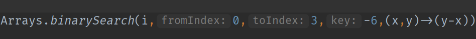
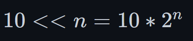
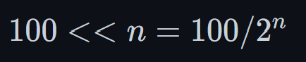

# Fix your imports
```java
import java.math.*;
import java.util.*;
import java.lang.*;
import java.util.regex.*;
import java.util.concurrent.*;
import java.util.concurrent.locks.*;
import java.util.stream.*;
import java.util.function.*;
```

# Java Math

- ```Integer x = Integer.MAX_VALUE;```
- ```Integer y = Integer.MIN_VALUE;```
- ```Math.max(x,y);```
- ```Math.min(x,y);```
- ```Math.abs(x);```
- ```Math.log(y);```
- ```Math.log10(x);```
##  Log Base 2 
  - $log_ab = log_{10}b / log_{10}a$
  - ```logBaseTwo =  (int)(Math.log(N) / Math.log(2));```

# To print for debugging in Java
- Override the toString.
- ### To print Arrays just use 
  ```java
  System.out.println(Arrays.toString(arry));
  ```
- Collections would have inbuilt implementation of toString so they will be printed as usual.

# Conversions
- Streams API can be very useful for conversions
  - All Collections have an instance method ```list.stream()``` to convert to stream
  - To convert arrays to streams, use ```Arrays.stream(arr)```
- Opposite of ```boxed()``` is ```mapToInt(i->i)```
- ### ```toArray()``` can be used to convert List/Stream to Array. The toArray List/Stream requires a generator Function when dealing with Objects like Integer ```(Integer[])arrayList2.toArray(Integer[]::new); It however doesn't require any generator for primitive types```
  - The Above method reference can also be replaced by a lambda ```size -> new Integer[size]```
- ```Arrays.asList(arr)``` can be Used to convert ArrayList to Object Array, but keep in mind you still need to call the constructor of ArrayList
## Convert from Primitive Arrays to ArrayList (IMPORTANT)
```java
ArrayList<Integer> arr = 
(ArrayList<Integer>)Arrays.stream(primitiveArray2).boxed().collect(Collectors.toList());
```

## Convert from Object Arrays to ArrayList (IMPORTANT)
```java
ArrayList<Integer> convArrayList2 = new ArrayList<>(Arrays.asList(objectArray2));
```
```java
ArrayList<Integer> convArrayList3 = 
(ArrayList<Integer>) Arrays.stream(objectArray2).collect(Collectors.toList());
```

## Convert from primitive Array to Integer Array
```java
Integer[] convIntegerArray = (Integer[])Arrays.stream(primitiveArray2)
                                        .boxed().toArray(Integer[]::new);
```

## Convert from Object Array to Primitive Array
```java
int[] convIntArray = (int[]) Arrays.stream(objectArray2).mapToInt(i->i).toArray();
```

## Convert from ArrayList to Integer Array
```java
Integer[] convIntegerArray = (Integer[])arrayList2.toArray(Integer[]::new);
```

## Convert from ArrayList to Primitive Array
```java
int[] convArrayListToIntArray = (int[]) arrayList2.stream().mapToInt(i->i).toArray();
```

## Convert String to String Builder
```java
StringBuilder sB = new StringBuilder(s);
```

## Convert String Builder to String
```java
stringBuilder.toString()
```

## Convert a String to char[]
```java
char[] charArray = s.toCharArray();
```

## Convert a Character Array to String
```java
String x = new String(charArray);
```

## Convert a primitive character[] to Character[] (IMPORTANT)
```java
Character[] charArrayBoxed = new String(primChar).chars().mapToObj(x->(char)x)
                                                          .toArray(Character[]::new);
```

## Convert a primitive character[] to String 
```java
new String(primChar)
```
## Convert a Character[] to String (IMPORTANT)
```java
Arrays.stream(boxedCharArr).map(c->String.valueOf(c)).collect(Collectors.joining()); \\or
Arrays.stream(boxedCharArr).map(x->x+"").collect(Collectors.joining());
```
## Convert a Character to String
```java
String.valueOf(charA); \\or
""+charA
```
## Convert a String to Character[]
```java
str.chars().mapToObj(x->(char)x).toArray(Character[]::new);
```
## Convert a char[] to stream (IMPORTANT)
- Arrays.stream() is not possible for char[]. (It is possible for int[], long[],double[] and T[])
```java
new String(charArr).chars();
```
- This probably is an IntStream

## Convert a Character[] to stream (IMPORTANT)
```java
Arrays.stream(boxedCharArr);
```

## Convert a String to stream
```java
str.chars().mapToObj(x->(char)x);
```

## Convert a char Stream to Character Stream
```java
charStream.mapToObj(x->(char)x)
```
## Convert a Character Stream to String (IMPORTANT)
```java
String s = charStream.map(c->String.valueOf(c)).collect(Collectors.joining());
```

## String to Integer
```Integer.valueOf("123")```;

## String to Int
```Integer.parseInt("123)```

# Sorting
## Sorting an Array
```java
int[] arrInt = {1,23,4,4,5,-1,63};
Arrays.sort(arrInt);
```

## Custom Sort an Array of primitives
- Convert to Boxed
- Then use Arrays.sort(arr,Comparator)
```java
Integer[] citations = Arrays.stream(cit).boxed().toArray(x->new Integer[x]);
Arrays.sort(citations, (x,y)->(y-x));
```

## Sorting a Collection
```java
List<Integer> list = new ArrayList<>(List.of(1,20,-124,24,1,2441,2,1,24,0));
Collections.sort(list);
```
# Reversing

## Reversing  a Collection
```Collections.reverse(list);```

# Searching

## Searching an Array
```java
int[] arr = {1,2,3,4,5,6,7,12,4,5352};
ArrayList<Integer> arrayList = (ArrayList<Integer>) Arrays.stream(arr).boxed()
                                                    .collect(Collectors.toList());
System.out.println(arrayList.indexOf(5));
```

## Searching a Sorted Array
- If the value is in the array, then the index of the value is returned.
```java
int[] arr1 = {1,2,3,4,5,6,124,1245,11241};
System.out.println(Arrays.binarySearch(arr1,11241));
```
- If the value is not in the array, a bitwise not of the insertion point is returned.
- Insertion Point is the index where the item would have been located if it was part of the sorted array.
```java
Integer[] arr = {0,1,2,3,5,6,7,8,9,10};
Integer bitWiseNotInsertionPoint = Arrays.binarySearch(arr,4); // returns -5
Integer insertionPoint = ~bitWiseNotInsertionPoint;// return 4
```
### Binary Search specifics

#### Custom Comparator
- Searching descending array. 
```java
Arrays.binarySearch(arr,key,(x,y)->(y-x));
```
#### Search only portion of array
```java
Arrays.binarySearch(arr,fromIndex,toIndex,key,Comparator<? super Integer>);
```
#### Example


## Searching a Collection
```java
ArrayList<Integer> arrayList2 = new ArrayList<>(List.of(1,2,341,12,4,124,24,2,31,1,1));
System.out.println(arrayList2.indexOf(341));
```

## Searching a Sorted Collection
- The same bitwiseInsertion point applies here.
```java
System.out.println(Collections.binarySearch(arrayList2,125));
```
- ### Collections doesn't support searching only portion of array. But it supports custom comparator.
```java
Collections.binarySearch(list,1,(x,y)->(y-x))
```


# Arrays
- length : ```arr.length``` (It's a property not a method)

## Wherever possible use Plain Arrays since they are easy to dereference, but you loose on printing and other convertion.

## Setting is simple
```java
int a[2] = 2;
```

## Removing at i index
- Create a new array and copy and don't copy ith element.
- Use Streams
```java
//Removing the item at i'th index from an Array
int[] arr = {1,2,3,4,5,6,7};
//Remove item at 3rd index i.e 4
ArrayList<Integer> arrayList = (ArrayList<Integer>) Arrays.stream(arr).boxed()
                                                      .collect(Collectors.toList());
arrayList.remove(3);
arr = arrayList.stream().mapToInt(i->i).toArray();
System.out.println(Arrays.toString(arr));
```

# ArrayList in Java
- Add at the end
  ```arr.add(Obj)```
- Add the beginning
  ```arr.add(0,Obj)```
- Add at idx
  ```arr.add(idx,Obj)```
- Get
  ```arr.get(idx)```
- Find
  ```arr.indexOf(Obj)```
  ```arr.contains(Obj)```
- SubList
  ```arr.subList(start_indx, end_idx_exclusive)```
- Update
  ```arr.set(idx,Obj)```
- Remove
  ```arr.remove(idx)``` (Remove idx)
  ### ```arr.remove(Integer.valueOf(1))``` (Remove first occurance of 1)
- ### Remove all Occurances
  ```arr.stream().filter(x->x!=1).collect(Collectors.toList())```

## To dereference a value in ArrayList
- Don't use []
```java
list.get(idx);
```

## Initialize an ArrayList with a specific size and default value
```java
List<Integer> list = new ArrayList<>(Collections.nCopies(num, default_val)); 
```

## Initialize an Array with a specific value
```java
Arrays.fill(dp,-1);
```

# LinkedList in JAVA
- Add at the end 
  - ```list.add(Obj)```
  - ```list.addLast(Obj)```
- Add at the beginning
  - ```list.add(0,Obj)```
  - ```list.addFirst(Obj)```
- Insert in middle
  - ```list.add(idx,Obj)```
- Pop at the front
  - ```list.remove(0)```
  - ```list.removeFirst()```
- Pop at the back
  - ```list.remove(list.size()-1)```
  - ```list.removeLast()```
- Remove from middle
  - ```list.remove(idx)```
- Remove an Object
  - ```list.remove(Obj)```
- Update at index
  - ```list.set(idx,1)```
- Get at first
  - ```list.getFirst()```
  - ```list.get(0)```
- Get at last
  - ```list.getLast()```
  - ```list.get(list.size()-1)```
- Get and remove first
  - ```list.pollFirst()```
- Get and remove last
  - ```list.pollLast()```

# HashMap in Java
- Check if a key exists
  ```map.containsKey(key)```
- Insert/Update a Key and Value
  ```map.put(Key, Value)```
- Remove a Key
  ```map.remove(Key)```
- Get a Key
  ```map.get(Key)```

## No need to check containsKey
- Use ```putIfAbsent(key,initVal);```
```java
  int key = 1;
  map.putIfAbsent(key,0);
  map.put(key,map.get(key)+1);
```

## equals, hashCode Contract
- To have a object as key for HashMap or HashSet you need to override the equals and hashCode Implementation as below
- Don't forget equals take an Object as the input.
```java
  @Override
  public boolean equals(Object o){
      Node other = (Node) o;
      return this.x == other.x && this.y == other.y;
  }

  @Override
  public int hashCode(){
      return x*10+y;
  }
```
    

# HashSet in Java
- Add in HashSet
  ```set.add(Obj)```
- Check if a Obj exists
  ```set.contains(Obj)```
- Remove from HashSet
  ```set.remove(Obj)```
- Intersection with another set
  ```set1.retainAll(set2)```
- Union with another set
  ```set1.addAll(set2)```
- Difference with another set
  ```set1.removeAll(set2)```

# Map.Entry
- Get Key
  ```entry.getKey()```
- Get Value
  ```entry.getValue()```
- Set Value
  ```entry.setValue(Obj)```

# TreeSet in JAVA (V.Imp methods)

## Custom comparator
```java
TreeSet<String> animals = new TreeSet<>((x,y)->(return y-x));
//Any functional interface implementing public int compare(T x, T y)
```
## Basic
- add
- remove
- size()
- clear()

## How to traverse
- Use ```set.first()``` to get the first item.
- Use ```set.last()``` to get the last item.
- Use for each loop for iterating.
- Use ```set.pollFirst()``` to get the first item and remove it.

## BST Methods
- contains() O(LogN)
- ### higher(element) Returns the lowest element among those elements that are greater than the specified element.
- ### lower(element) - Returns the greatest element among those elements that are less than the specified element.
- ### ceiling(element) - Returns the lowest element among those elements that are greater than the specified element. If the element passed exists in a tree set, it returns the element passed as an argument.
- ### floor(element) - Returns the greatest element among those elements that are less than the specified element. If the element passed exists in a tree set, it returns the element passed as an argument.
## Custom Comparator
- Look at Tree Map Below.

# TreeMap in JAVA (V.Imp Methods)
## Basic
- put()
- containsKey()
- size()
- clear()
- ### putIfAbsent() (V.Imp)
- get() : Returns the value associated with the specified key. Returns null if the key is not found.
- ### getOrDefault() : Returns the value associated with the specified key. Returns the specified default value if the key is not found.
- remove(key)
- ### replace(key, value) (V.Imp)
## Elements of treeMap
- entrySet() : returns a set of all the key/values mapping (entry) of a treemap
- keySet() : returns a set of all the keys of a tree map


## How to iterate
- Same as map using KeySet/EntrySet.
- Use ```map.pollFirstEntry()``` to get the first item and remove it.
- Use ```map.firstEntry()``` to get the first Entry in the order set by comparator.
- ### Don't use foreach loop to iterate the priority queue, you might get wrong answers
## Custom Comparator
- Simply provide a lambda function, since the TreeMap expects the Functional Interface i.e Comparator.
```java
TreeMap<Integer, String> map = new TreeMap<>((x,y)->y-x);
```
## LogN Methods
- ### higherKey() - Returns the lowest key among those keys that are greater than the specified key.
- ### lowerKey() - Returns the greatest key among all those keys that are less than the specified key.
- ### ceilingKey() - Returns the lowest key among those keys that are greater than the specified key. If the key passed as an argument is present in the map, it returns that key.
- ### floorKey() - Returns the greatest key among those keys that are less than the specified key. If the key passed as an argument is present, it returns that key.
- ### firstKey() - Smallest element.
- ### lastKey() - Largest element.

# Priority Queue in JAVA
- Add in Priority Queue
  ```pq.add(Obj)```
- See the top element
  ```pq.peek(Obj)```
- Remove the top and return it's value
  ```pq.poll(Obj)```
- Removes a single instance of specified instance from the queue
  ```pq.remove(Obj)```
- Decrease key operation
  - First remove the old Obj and insert the updated value.


# Deque in JAVA
## IT is important to note there is no such thing as pop or top or even push in Deque.
- Add in Deque last
  ```q.add(Obj)```, ```q.addLast(Obj)```
- Add first in Deque
  ```q.addFirst(Obj)```
- Remove First
  ```q.removeFirst()```
- Remove Last
  ```q.removeLast()```
- Remove
  ```q.remove(Obj)```
- Poll First (Remove and return)
  ```q.poll()```, ```q.pollFirst()```
- Poll Last
  ```q.pollLast()```
- Peek First
  ```q.peek()```, ```q.peekFirst()```
- Peek Last
  ```q.peekLast()```

# LinkedHashMap for LRU Cache
- Add an entry
  ```map.put(key,val)```  -> O(1)
- Remove an entry
  ```map.remove(key)```  -> O(1)
- Get first entry  -> O(1)
  ```java
  for(Integer k : map.keySet()){
    map.remove(k);
    break;
  }
  ```
- Get the val  -> O(1)
  ```map.get(key)```

# String
- ### Remove all occurrences of char from string
  ```s.replace('x','');```
- ### Length ```s.length()```
- Convert to char[] ```s.toCharArray()```
- ```"Java".compareToIgnoreCase("JAVA")```
- ```str.toUpperCase()```

## To dereference a character from string or string builder
- Don't use []
```java
char c = str.charAt(idx);
```

## Set a character in string
```java
//Convert to String Builder
StringBuilder sB = new StringBuilder(s);
sB.setCharAt(idx,val);
```

## Split for delimitting
- Will return a String[]
- ### take care of empty strings since they can be source of lot of bugs.
  ```java
  String str = "Hello";
  String regex = "l";
  str.split(regex); //["He", "", "o"]
  ```

## Regex Matching
  ```java
  "Java".matches("[a-zA-Z].v.");
  ```

## substring() 
-  is used to create a substring from this string.

  ```java
  str.substring(start_idx, end_idx_non_inclusive)
  ```

## Check if a string is substring
```java
str.contains(substring);
```

## Index Of
  - Return the first Index of character ```"Java".indexOf('a')```
  - Return the index of first occurance of substring ``` "Java".indexOf("av")```
  - Returns the index of first occurance of character after index idx ```"Java".indexOf('a', 2)```
  - Returns the index of first occurance of substring after index idx ```"Java".indexOf("av", 2)```


# String Builder
- setCharAt
- deleteCharAt
- charAt
# For Custom Objects
## Implement To String
```java
@Override
public String toString(){
  return "String Representation"
}
```

## HashCode
- Returns an int.
```java
@Override
public int hashCode() {
    return super.hashCode();
}
```

## Equals
- Remember equals takes an Object, you need to type cast inside.
```java
@Override
public boolean equals(Object o){
    Node other = (Node) o;
    return this.x == other.x && this.y == other.y;
}
```

## Implement the Comparable Interface
- Remember to implement the Comparable<T>, don't use raw types.
- Remember compareTo returns an int.
```java
public class Node implements Comparable<Node>{

@Override
public int compareTo(Node other){
  return this.x - other.x;
}

}
```


# Random in JAVA
```java
  Random rand = new Random(); //instance of random class
    int upperbound = 25;
      //generate random values from 0-24
    int int_random = rand.nextInt(upperbound); 
    double double_random=rand.nextDouble();
    float float_random=rand.nextFloat();
```

# Math in JAVA
- Be very careful when dealing with division in java
- Always use Doubles wherever possible to avoid issues
- say n=3, and doing Math.ceil(n/2) would give 1 since n/2 = 1 and ceil 1 is 1, so to make sure the inside value is a double use ```Math.ceil((double)n/2.0)``` 
-  Math.pow(2,Math.ceil(Math.log(arrlen)/Math.log(2)));

# Graph Problems in JAVA

# Binary Search in JAVA

# Bit Manipulation in JAVA
## Integer Range
- Integer is a 32 bit number.
- $-2^{31}$ to $2^{31}-1$.
- $-2^{31}$ to $-1$ and $1$ to $2^{31}-1$ and $0$.  
- **Negative number has one more number than the positive number.**
- A 4 bit 2's complement representation can go from 7 to -8.
- A 8 bit 2's complement can go from 127 to -128.

## Binary representation of Numbers
- Left most bit is the sign bit. This is also the MSB (Most significant bit).
- Right most bit is the least significant bit (LSB)
-  $10     =  00000000000000000000000000001010$
-  $-10    =  11111111111111111111111111110110$
```java
int ten = 0b1010
10 == ten

```
- $2^{31} = 01111111111111111111111111111111$
### Negative Numbers
- 2's complement i.e compute bitwise not and add a 1 to it. 
```java
(~10+1) == -10
``` 

### Convert to Binary String
```java
Integer.toBinaryString(10) // "1010"
Integer.toBinaryString(-8) //"11111111111111111111111111111000"
```
```java
Integer.MAX_VALUE == 0b01111111111111111111111111111111
Integer.MIN_VALUE == 0b10000000000000000000000000000000
-1                == 0b11111111111111111111111111111111
```

### Convert from Binary String to Integer
- The below doesn't work for negative 32 bit representations.
```java
int ten = Integer.parseInt("1010",2)
int minusone = Integer.parseInt("11111111111111111111111111111111")
 // Numberformatexception
```
- ## Use the following for both negative and positive conversion.
```java
String binaryString = Integer.toBinaryString(-1);
(int)Long.parseLong(binaryString,2); //-1
```
## Tips on binary manipulation

### Find the LSB
- ```10&1 == 0```

### Find the MSB (V.Imp)
- ```1<<(Integer.toBinaryString(xor).length()-1)```

### Left Shift Operator
- Multiply by 2 power n.
- 
```java
10<<5 == 10*32
```

### Right Shift Operator
- Divide by 2 power n
- 
```java
100>>5 == 100/32
```

### XOR Operator
- Xoring a number by itself is zero.
  - This is a useful tip to find the only number which is not repeated twice/four times...
- Xoring a number by negative of itself is all 1's
#### Misc questions
- Minimize XOR, sort the array and find the XOR value which is the minimum
  - Proof https://medium.com/codebrace/starred-problem-1-min-xor-value-7c996f9f77c8


### Find total Set bits in a number
- Brian Kerighan's Algorithm -> Subtraction of a number by 1 inverts all the bits(from right to left) till the rightmost set bit(including the rightmost set bit). So if we subtract a number by 1 and do a bitwise and with itself (n&(n-1)) we unset the rightmost bit. If we do n=(n&(n-1)) in a loop and count the number of times loop (till n == 0) executes it gives the number of set bits.
  ```java
    private int countBit(int n){
        int x=0;
        while(n!=0){
            n=n&(n-1);
            x++;
        }
        return x;
    }
  ```
- Below are some of it's application
#### Turn off last set bit
- ```S & (S-1)``` Brian Kernighan's algorithm

#### Set last unset bit
- ```S | (S+1)```, Similar logic as above.


### Find left most set bit
- ```S & (-S)```

### Set the jth Bit
- ```S = S | (1<<j)```

### Check if a bit is set
- Very Important
- ```S & (1<<j)```

### Clear a bit if set
- Very Important
```S & (~(1<<j))```

### Toggle a bit
- Very Important
```S ^ (1<<j)```

### turnOffLastConsecutiveBits
- ```((S) & (S+1))```

### turnOnLastConsecutiveZeroes
- ```((S) | (S-1))```

#### Find if a number is a power of 2
- If totalSetBits using above algorithm are 1, then it is a power of 2.
- Take log2 of the number if you get integer value it is power of 2.
- If a number is power of 2 (n&(n-1)) is 0. You however need to take care of 0 case. so return x&&(!(x&(x-1))).

## Check overflow in integer.
```java
boolean checkOverFlowAdd(int x, int y){
  if(x>0 && y>0){
    return (x>Integer.MAX_VALUE-y);
  }
  else if(x<0 && y<0){
    return (x<Integer.MIN_VALUE-y);
  }
  return false;
}

boolean checkOverflowMultiply(int x, int y){
  if(x==0 || y==0) return false;
  return Math.abs(y) > Integer.MAX_VALUE/Math.abs(x);
}
```


## Misc bit manipulation
### Binary Search and bitwise not
- When doing binary search in an array, if the element doesn't exist, a bitwise not of the insertion point is returned. i.e insertionPoint = ~returnValue

### Convert the truth table to logical circuit formulae.

- Say for instance we have to add 2 bits, with carry.
Truth Table Looks like.


- Let us find the logical circuit for Carry Out. You need to just consider the cases where C-Out is 1, i.e ```A*B*(!C) + A*(!B)*C + A*B*C + (!A)*B*C = A*B + (A^B)*C```. Similarly you can do for any truth table.

# Misc
- \n is a single character
- "+" is a meta character, has to be escaped when using split("\\+");
- ### "." is also a meta character, has to be escaped when using split("\\.");
