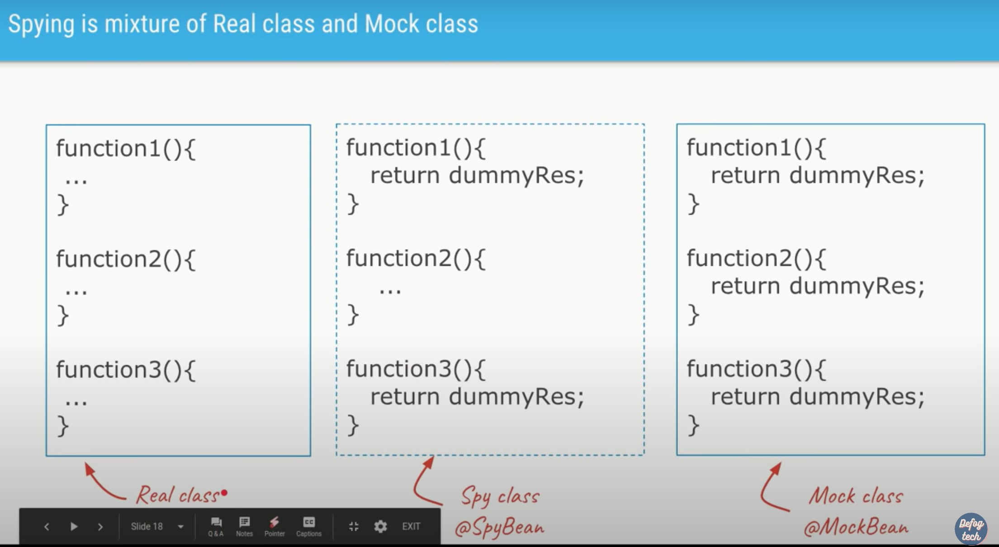
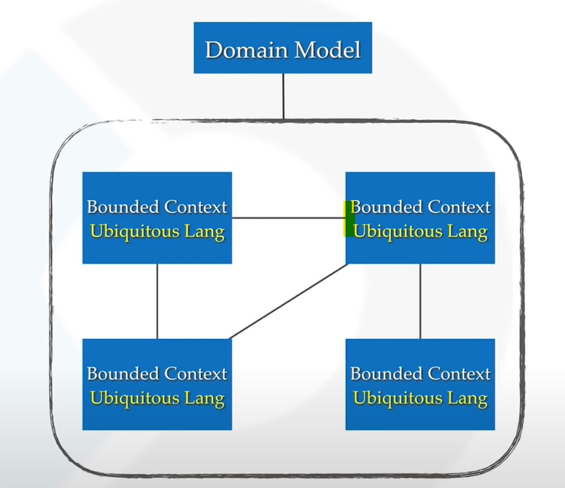
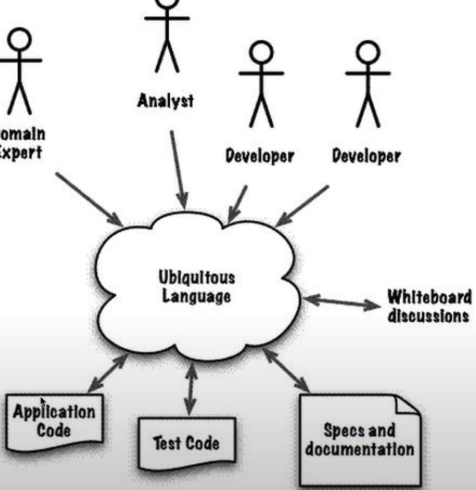
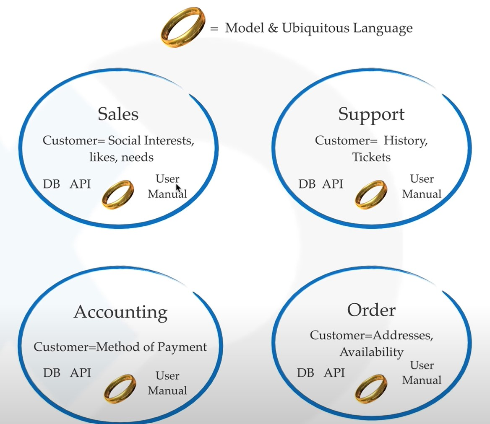
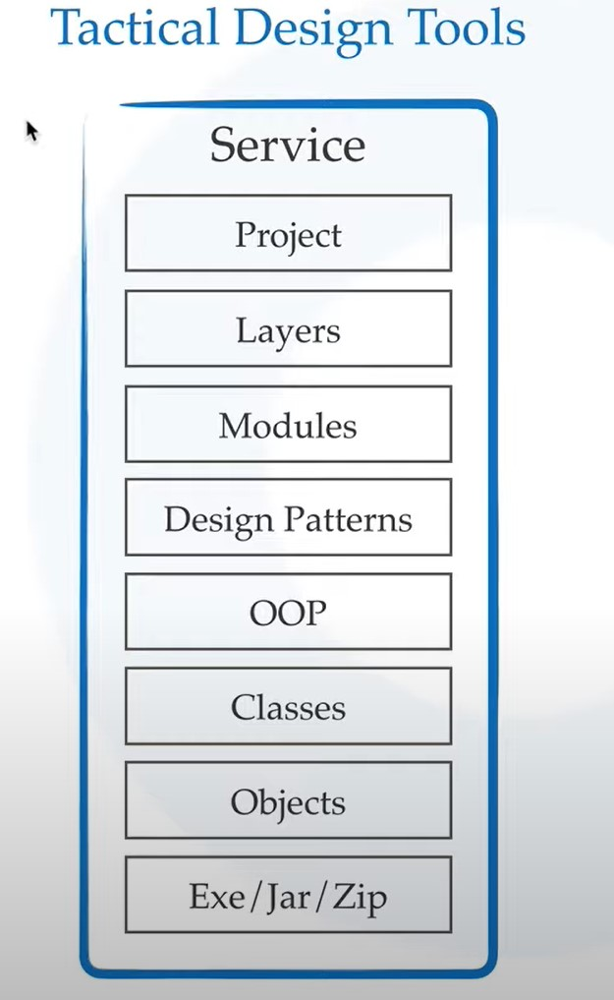
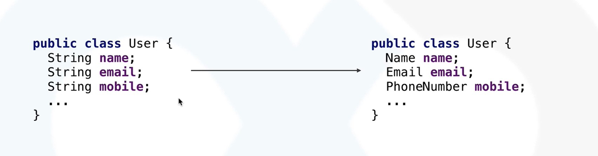
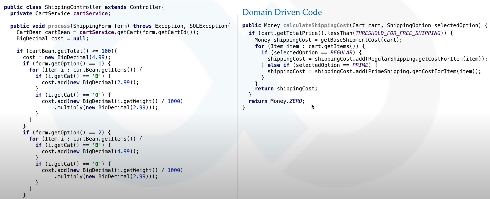

# Maven
- See some videos about maven pom file.

## POM File (Project Object Model)
### Parent
```xml
<parent>
    <groupId>mycompany.trade.com</groupId>
    <artifactId>mycompany.trade.</artifactId>
    <version>1.1.1.0-SNAPSHOT</version>
</parent>
```
- maven reads the parent POM from your local repository (or proxies like nexus) and creates an 'effective POM' by merging the information from parent and module POM.
-  reason to use a parent is that you have a central place to store information about versions of artifacts, compiler-settings etc. that should be used in all modules.
### Scope
- Affects if the dependency is added to final executable, say test scope is not included in final build.
```<scope>test</scope>```

### Surefire Pligin
- Maven will run the test at the end of the build

# Testing

## Test Driven Design
- Test driven code is writing testcase first and then write the code to pass those test cases.
- You stub a method and then you pass the actual use cases for each test and then you see the red bar.


## White,Black and Grey box Testing
### White Box
White Box Testing is software testing technique in which internal structure, design and coding of software are tested to verify flow of input-output and to improve design, usability and security.

### Black Box
Knowledge of internal working structure (Code) is not required for this type of testing. Only GUI (Graphical User Interface) is required for test cases.

### Grey Box
Partially Knowledge of the internal working structure is required.


## Cucumber
- Testing for BDD. Uses Gherkin
## Integration Testing
- It focuses mainly on the interfaces & flow of data/information between the modules. Here priority is to be given for the integrating links rather than the unit functions which are already tested.

### Approaches 
#### Big Bang Testing
- all the components or modules are integrated together at once and then tested as a unit.
#### Incremental Testing
- testing is done by integrating two or more modules that are logically related to each other and then tested for proper functioning of the application. 
#### Bottom-up Integration Testing
- Lower level modules are tested first then higher level modules

#### Top-down Integration Testing
- Opposite

#### Sandwitch Testing
- top level modules are tested with lower level modules at the same time lower modules are integrated with top modules and tested as a system.

## Unit Testing

## Smoke Testing
- Smoke Testing is a software testing process that determines whether the deployed software build is stable or not. Smoke testing is a confirmation for QA team to proceed with further software testing. It consists of a minimal set of tests run on each build to test software functionalities. Smoke testing is also known as "Build Verification Testing" or “Confidence Testing.”
## Performance Testing
### Load testing
- checks the application's ability to perform under anticipated user loads.

### Stress testing
-  involves testing an application under extreme workloads to see how it handles high traffic or data processing. 

### Endurance testing
- is done to make sure the software can handle the expected load over a long period of time.

### Spike testing
-  tests the software's reaction to sudden large spikes in the load generated by users.

### Scalability testing - 
- The objective of scalability testing is to determine the software application's effectiveness in "scaling up" to support an increase in user load.


## Squeeze Testing

## Mock vs Stub
### Stub
-  the biggest distinction is that a stub you have already written with predetermined behavior. So you would have a class that implements the dependency (abstract class or interface most likely) you are faking for testing purposes and the methods would just be stubbed out with set responses. They would not do anything fancy and you would have already written the stubbed code for it outside of your test.
-  a dummy piece of code that lets the test run, but you don't care what happens to it.

### Mock
- A mock is something that as part of your test you have to setup with your expectations. A mock is not setup in a predetermined way so you have code that does it in your test. Mocks in a way are determined at runtime since the code that sets the expectations has to run before they do anything.
- Stubs don't fail your tests, mock can.
- a dummy piece of code, that you VERIFY is called correctly as part of the test.

# JUnit 5

## Why we need testing framework?
- Runs the test (without the main)
- Verifies the result using lot of Assert and Verify methods
- Alerts the user if something is wrong
- JUnit can also act as a runner which runs using one test command. Not recommended a hack

## Why JUnit 5? What was wrong with JUnit 4
- More than 10 year olds
- Need to be updated for Java 8
- Need to be updated for new testing features.
- Monolithic Jar architecture.
- Bugs Piled up

## Junit Architecture

### Jupiter  (Jupiter API)
- Primary API used in JUnit5
- 5th Planet in solar system
### Platform (Jupiter Engine)
- Has the core functionality of JUnit5, the actual test engine.

### Vintage
- API used for older JUnit tests. To run the existing tests.

### Extension
- Provide your own extension and use the platform to run your test.

### Advantages of this architecture
- don't need all modules at once, if you only want to use new api just import jupiter and platform.

## @Test
- Used to tell JUnit the method is a test method and tells it to run it.
```java
@Test
public void sampleMethodTestSuccessful(){
System.out.println("Initializing Tests");
Mockito.when(simpleDependency.getNameById("2")).thenReturn("Manish");
Mockito.when(simpleDependency.getAddressForName("Manish")).thenReturn("MVV Ozone");
assertEquals(new User("anish","MVV Ozone"),sampleService.sampleMethod("2"),"The User fetched is wrong");
}
```

## @RepeatedTest
- Might be useful for race condition testing (intemittent issues).
- The test will be repeated mulitple times.
```@RepeatedTest(4)```
- when a test has some randomness.
- ping as a repeated test

## @Order
- This is antipattern
- The methods will run one after the other based on order.

### Steps
- Create an instance of the class, maybe using dependency injection
- Setup Inputs
- Run the code you want to test
- Verify that the result is expected.

## Assertion
- We don't want to use if and do System.out.println, instead we use JUnit's way of telling user something wrong has happened.
- The following are the methods used for this assertion
- In all the below methods, we can pass a string as an argument to tell the reason of failure.
### assertEquals
- Compares the expected value with the returned value
- ### It is good practise to add message with assertion
```java
assertEquals(new User("anish","MVV Ozone"),sampleService.sampleMethod("2"),
"The User fetched is wrong");

```

### assertArrayEquals
- Compares the value inside the array

### assertIterableEquals
- Compares the value that the iterable spits out.

### assertFalse
- Asserts if the condition is passed or not and takes a messages as a parameter

### assertTrue
- same as above for true.

### assertNotEquals

### assertNull

### assertNotNull

### fail
- Simply fails the test no matter what happens, if the execution reaches this line.
- You can use fail to fail the test where you don't want the execution path to reach.

### assertAll
- Runs a bunch of assertion at once.
- new to JUnit 5, because we can use Lambdas
```java
assertAll(
    ()->assertEquals(3,mathUtils.multiply(3,1)),
    ()->assertEquals(2,mathUtils.multiply(2,1)),
    ()->assertEquals(1,mathUtils.multiply(1,1)),
    ()->assertEquals(2,mathUtils.multiply(2,1)),
    ()->assertEquals(4,mathUtils.multiply(4,1)),
);
```
- Kind of like an OR for the Assert.

### assertThrows(ExceptionType, Executable)

## Test Life Cycle
- JUnit manages the lifecycle of the Test Classes.
- JUnit gives us hooks to run code before and after the test has run.
- JUnit creates a new class instance for each test run if initialized 
- ### JUnit 5 creates a new instance of the test class for every test method run. This makes each test independent of the order in which other tests ran (else other test would have modified the state).

### Hooks
#### @BeforeAll
- Runs before any test ran
- Method has to be static, since these methods run before any instance of Test class is created.
#### @AfterAll
- Runs after all test ran
- Method has to be static, same reason as above.
```java
@AfterEach
void cleanUp(){
    ...
}
```

#### @BeforeEach
- Runs before every test
```java
@BeforeEach
void init(){
    
}
```
#### @AfterEach
- Runs after every test

## Annotation for Scaling

### @DisplayName
- To have a plain english description of each test rather than identifying test by method name.
- Good coding convention
```@DisplayName("Sample Method Test")```

### @Disabled
- In Test Driven Development, your work in progress will fail so in order to build the project just disable the method.

## Conditional Execution
- Similar to disabled but only on certain environments.
### @EnabledOnOs(OS.LINUX)
### @EnabledOnJRE(JRE.JAVA_11)
### @EnabledIfEnvironmentVariable

## Nested Test Classes 
- Use @Nested Annotation
- Useful for grouping tests, within the Test class. 
```java
class MathTest{
    @Nested
    class AddTest{
        ...
    }
}
```
- You can use display name in combination with nested class to provide readable english sentences to say what the test describes
```java
@DisplayName("Math Utils Test")
class MathTest{
    
    @Nested
    @DisplayName("add method : ")
    class AddTest{
        
        @Test
        @DisplayName("when adding 2 positive number")
        void testAddPositive(){
            assertEquals(-2, mathUtils.add(-1,-1),"should return the right sum");
        }
    }
}
```

## Assumption
- Programmatic control for enabling and disabling tests
```java
@Test
public void sampleTest(){
    assumeTrue(isServerUp());
    //Won't run if the server is down.
}
```
## JUnit 5 Dependency Injection
### TestInfo
- Gives information about the test.
### TestReporter
- Lets you log the information into the test report

## Extras

### @Tag
- Lets the runner (Eclipse, Maven) to include the test with tags or exclude the test with tag.


# Mockito
- Useful when we want to mock the classes/methods we don't want to test.
- We create a dummy response for the mocked object

## @MockBean
- Let us define the bean as the dummy/ mocked bean
- It allows to add Mockito mocks in a Spring ApplicationContext.

## @SpyBean
- You can choose which methods give dummy response and which methods will give actual response
- Somewhere in between Mock and Autowired


## @InjectMocks
- creates an instance of the class and injects the mocks that are created with the @Mock (or @Spy) annotations into this instance.

## When thenReturn
- Let's us return dummy response
```java
Mockito.when(simpleDependency.getNameById("2"))
.thenReturn("Manish");
```

## Matching Arguments
### AdditionalMatchers
- Let us limit the returned dummy to specific arguments
- gt (greater than), find,not,lt, leq,geq etc,
```java
Mockito.when(service.someMethod(AdditionalMatchers.gt(4)))
.thenReturn("Some Return val");
```
### Mockito.anyString() and Mockito.any(Type.class)
```java
Mockito.when(service.someMethod(Mockito.any(Integer.clas)))
.thenReturn("Some Val");
``` 

## Verify 
- Allows us to verify if some interaction has been done or not and other use cases.
- The below code verifies if someDummyMethod has been called twice, else test fails
```java
Mockito.verify(someDummyClass, Mockito.times(2))
.someDummyMethod();
```

### Usecases
#### verify simple invocation on mock
```verify(mockedList).size();```
#### verify number of interactions with mock
```verify(mockedList, times(1)).size();```
#### verify no interaction with the whole mock occurred
```verifyZeroInteractions(mockedList);```
#### verify no interaction with a specific method occurred
```verify(mockedList, times(0)).size();```
#### verify order of interactions : Using InOrder
```java
InOrder inOrder = Mockito.inOrder(mockedList);
inOrder.verify(mockedList).size();
inOrder.verify(mockedList).add("a parameter");
inOrder.verify(mockedList).clear();
```
#### verify an interaction has occurred at least certain number of times
```verify(mockedList, atLeast(1)).clear();```
#### verify interaction with exact argument
```verify(mockedList).add("test");```
#### verify interaction with flexible/any argument
```verify(mockedList).add(anyString());```
- Can also use AdditionalMatcher here like in when.
#### verify interaction using argument capture
- ArgumentCaptor allows us to capture an argument passed to a method in order to inspect it. 
```java
ArgumentCaptor<List> argumentCaptor = ArgumentCaptor.forClass(List.class);
verify(mockedList).addAll(argumentCaptor.capture());
List<String> capturedArgument = argumentCaptor.<List<String>> getValue();
assertEquals(true, capturedArgument.hasItem("someElement"));
```

# Spring Test Framework

## @ContextConfiguration (GENERAL WAY)
- Don't load up the entire spring application(all the classes) in test run, just ones I require.
- You need @EnableWith(SpringExtention.class) annotation too.

```java
@ExtendWith(SpringExtension.class)
@ContextConfiguration(classes = {SampleService.class})
public class SampleServiceTest {

    @Autowired
    private SampleService sampleService;

    @MockBean
    private SimpleDependency simpleDependency;

    @Test
    @DisplayName("Sample Method Test")
    public void sampleMethodTestSuccessful(){
        System.out.println("Initializing Tests");
        Mockito.when(simpleDependency.getNameById("2")).thenReturn("Manish");
        Mockito.when(simpleDependency.getAddressForName("Manish")).thenReturn("AP");
        assertEquals(new User("Manish","AP"),sampleService.sampleMethod("2"),"The User fetched is wrong");
    }
    @Test
    public void divideByZeroTestException(){
        Mockito.when(simpleDependency.getNameById("2")).thenReturn("Manish");
        Mockito.when(simpleDependency.getAddressForName("Manish")).thenReturn("MVV Ozone");
        assertThrows(ArithmeticException.class,()->sampleService.divide(1,0), "Divide by zero didn't throw exception");
    }
}

```
## @SpringBootTest
- Will load up the entire spring application before running the test.
- Creates all the beans in the application
- Has @EnableWith(SpringExtention.class) inside it.

## @WebMvcTest
-  for testing the controller layer and you need to provide remaining dependencies required using Mock Objects.

# JDBC
- JDBC is a standard for connecting to a DB directly and running SQL against it 

# JPA
- Java Persistence API
- JPA is a standard for Object Relational Mapping. The most famous JPA provider is Hibernate. 
- JPA is an specification/interface and Hibernate is an implements of the JPA Specification

## Entity Manager
- Save the Entity to Database

## Persistence Context
- The persistence context is the first-level cache where all the entities are fetched from the database or saved to the database. It sits between our application and persistent storage.
- An EntityManager instance is associated with a persistence context.
- Flushing a Cache is the act of putting modified data back into the database.
- A PersistenceContext is essentially a Cache. It also tends to have it's own non-shared database connection.
### Persistence contexts are available in two types:
- The default persistence context type is PersistenceContextType.TRANSACTION. To tell the EntityManager to use the transaction persistence context, we simply annotate it with @PersistenceContext
#### Transaction-scoped persistence context
- The transaction persistence context is bound to the transaction. As soon as the transaction finishes, the entities present in the persistence context will be flushed into persistent storage.
####  Extended-Scoped Persistence Context
- An EntityManager using an extended persistence context maintains the same persistence context for its entire lifecycle. Whether inside a transaction or not, all entities returned from the EntityManager are managed, and the EntityManager never creates two entity instances to represent the same persistent identity. Entities only become detached when you finally close the EntityManager (or when they are serialized).


## Annotations

@Entitiy
- Store a Java bean to the table then declare the bean with the Entity Annotation.

@Id
- Declare primary key with Id Annotation

@GeneratedValue
- Declare the field decorated by this annotation to have generated value.

@Transactional
- Each method would be involved in a transaction if the class is declared with @Transactional annotation.
- It is used to combine more than one writes on a database as a single atomic operation.
- If you don't specify @Transactional, each DB call will be in a different transaction.
```java
@Repository
@Transactional
public class UserRepository {
    @PersistenceContext
    private EntityManager entityManager;

    public long insert(User user){
        entityManager.persist(user);
        return user.getId();
    }
}

```


@PersistenceContext


# Apache commons
- It has utility classes.

# JMS
- JAVA Messaging Service
## Message Types
- JMSObjectMessage
- JMSTextMessage
- JMSBytesMessage
- JMSStreamMessage
- JMSMapMessage

# Behavior Driven Design
- BDD focuses on defining user stories or scenarios. It is closely related to an incremental process, but it can also be viewed as static: it describes all the interactions between users and the finished system.
- Cucumber (language used is Gherkin) is used for BDD.

# Domain Driven Design
- Eric Evans
- We develop model of the domain/business problem and make our software conform to that.
- When designing our focus shouldn't be on the technology, but on the business or whatever activity we are trying to assist with the  software.
- It's not customer's job to know what they want. Even if architecture is fabulous but the end user decides if the system is good or not.
- Services, Entities, Domain Model, Repositories, Factories are made popular by domain driven design
- DDD focuses on defining the vocabulary in that language: actors, entities, operations, ... An important part of DDD is also that the ubiquitous language can be clearly seen in the code, too, not only in communication between the implementor and the domain expert. So an extreme view of DDD is quite static: it describes the finished system as a whole.


## 2 Types of tools

### Strategic Design Tools
- Everyone who is more experienced will give more importance to strategic design tools.
- Instead of thinking in terms of objects like in OOPs, we think in terms of context (setting in which a word/statement appears, determines it's meaning)
- When given a problem, you talk to domain expert and try to find the core values and motivation behind each feature.

- Shouldn't change during product development.
#### Domain Model
- Aspects chosen for implementation that constitute the model.
- Representation of Bounded Contexts, Domain Model is to Bounded Context, what classes are to objects.

#### Ubiquitous Language
- Developer, Domain Expert, Analyst, everyone and everything should use the same words for same concepts, any 2 people are talking to each other, everyone else should be able to follow. You need to name your classes, code, documentation that way. Don't become more technical that necessary.
- 
#### Bounded Context
- Things hold the same meaning within each bounded context.
- In the following figure, A Customer Concept is different to a Sales Person(Interests, likes, needs) and is different to Support(Purchase History, Tickets etc) and also different for Accounting(Method of Payement, Refunds etc). Each of these are a bounded contexts.
- **Each bounded context needs to have their own Domain Model and Bounded Context, Database, API, User Manual.**
- Design your microservice around bounded context.

#### Context Map
- Relationship between bounded context, API Contracts etc are context map.

#### Event Storming
- Brainstorming workshop between domain experts and developers aimed to attain a common understanding of the domain model and define bounded contexts etc.

### Technical Design Tools
- Concerned with the implementation
- Expected to change within product development.

#### Layered Architecture.
- The heirarchy of Request Handler, Controller to Service Layer and Finally to Repository Layer.
- Everything is organised and well design, reusable components.

#### Value Objects
- Don't use primitive in your code.
- Value enforces ubiqutous language.
- Easily Validate/Limits inside the value itself.
- Helps us avoid Magic Numbers and duplicated code.
- Immutable so thread safe.




#### Entity Object
- Uniquely Identified using ID
- Consists of value objects
- mutable
- represents a row in db.
- generally implements some business logic

