# Maven
- See some videos about maven pom file.

## POM File (Project Object Model)
### Parent
```xml
<parent>
    <groupId>mycompany.trade.com</groupId>
    <artifactId>mycompany.trade.</artifactId>
    <version>1.1.1.0-SNAPSHOT</version>
</parent>
```
- maven reads the parent POM from your local repository (or proxies like nexus) and creates an 'effective POM' by merging the information from parent and module POM.
-  reason to use a parent is that you have a central place to store information about versions of artifacts, compiler-settings etc. that should be used in all modules.
### Scope
- Affects if the dependency is added to final executable, say test scope is not included in final build.
```<scope>test</scope>```

### Surefire Pligin
- Maven will run the test at the end of the build

### JIB Plugin-
- Jib is a Maven plugin for building Docker and OCI images for your Java applications.

# Testing

## Test Driven Design
- Test driven code is writing testcase first and then write the code to pass those test cases.
- You stub a method and then you pass the actual use cases for each test and then you see the red bar.


## White,Black and Grey box Testing
### White Box
White Box Testing is software testing technique in which internal structure, design and coding of software are tested to verify flow of input-output and to improve design, usability and security.

### Black Box
Knowledge of internal working structure (Code) is not required for this type of testing. Only GUI (Graphical User Interface) is required for test cases.

### Grey Box
Partially Knowledge of the internal working structure is required.


## Cucumber
- Testing for BDD. Uses Gherkin
## Integration Testing
- It focuses mainly on the interfaces & flow of data/information between the modules. Here priority is to be given for the integrating links rather than the unit functions which are already tested.

## End to End Testing
- Use selenium, which automates browser.

### Approaches 
#### Big Bang Testing
- all the components or modules are integrated together at once and then tested as a unit.
#### Incremental Testing
- testing is done by integrating two or more modules that are logically related to each other and then tested for proper functioning of the application. 
#### Bottom-up Integration Testing
- Lower level modules are tested first then higher level modules

#### Top-down Integration Testing
- Opposite

#### Sandwitch Testing
- top level modules are tested with lower level modules at the same time lower modules are integrated with top modules and tested as a system.

## Unit Testing
- See JUnit 5

## Contract Testing
- Open source tool PACT is used for test API Contracts.

## Smoke Testing
- Smoke Testing is a software testing process that determines whether the deployed software build is stable or not. Smoke testing is a confirmation for QA team to proceed with further software testing. It consists of a minimal set of tests run on each build to test software functionalities. Smoke testing is also known as "Build Verification Testing" or “Confidence Testing.”
## Performance Testing
### Load testing
- checks the application's ability to perform under anticipated user loads.

### Stress testing
-  involves testing an application under extreme workloads to see how it handles high traffic or data processing. 

### Endurance testing
- is done to make sure the software can handle the expected load over a long period of time.

### Spike testing
-  tests the software's reaction to sudden large spikes in the load generated by users.

### Scalability testing - 
- The objective of scalability testing is to determine the software application's effectiveness in "scaling up" to support an increase in user load.


## Squeeze Testing

## Mock vs Stub
### Stub
-  the biggest distinction is that a stub you have already written with predetermined behavior. So you would have a class that implements the dependency (abstract class or interface most likely) you are faking for testing purposes and the methods would just be stubbed out with set responses. They would not do anything fancy and you would have already written the stubbed code for it outside of your test.
-  a dummy piece of code that lets the test run, but you don't care what happens to it.

### Mock
- A mock is something that as part of your test you have to setup with your expectations. A mock is not setup in a predetermined way so you have code that does it in your test. Mocks in a way are determined at runtime since the code that sets the expectations has to run before they do anything.
- Stubs don't fail your tests, mock can.
- a dummy piece of code, that you VERIFY is called correctly as part of the test.


## Integration Test
- Too many mocks go for integration tests
- Mocking hides bugs since the mock might not be in sync with real class
- Use H2 for unit testing with compatibility model
- Test containers in @Before All
### MockRestServiceServer
- Used to mock real server

# JUnit 5

## Why we need testing framework?
- Runs the test (without the main)
- Verifies the result using lot of Assert and Verify methods
- Alerts the user if something is wrong
- JUnit can also act as a runner which runs using one test command. Not recommended a hack

## Why JUnit 5? What was wrong with JUnit 4
- More than 10 year olds
- Need to be updated for Java 8
- Need to be updated for new testing features.
- Monolithic Jar architecture.
- Bugs Piled up

## Junit Architecture

### Jupiter  (Jupiter API)
- Primary API used in JUnit5
- 5th Planet in solar system
### Platform (Jupiter Engine)
- Has the core functionality of JUnit5, the actual test engine.

### Vintage
- API used for older JUnit tests. To run the existing tests.

### Extension
- Provide your own extension and use the platform to run your test.

### Advantages of this architecture
- don't need all modules at once, if you only want to use new api just import jupiter and platform.

## @Test
- Used to tell JUnit the method is a test method and tells it to run it.
```java
@Test
public void sampleMethodTestSuccessful(){
System.out.println("Initializing Tests");
Mockito.when(simpleDependency.getNameById("2")).thenReturn("Manish");
Mockito.when(simpleDependency.getAddressForName("Manish")).thenReturn("MVV Ozone");
assertEquals(new User("anish","MVV Ozone"),sampleService.sampleMethod("2"),"The User fetched is wrong");
}
```

## @RepeatedTest
- Might be useful for race condition testing (intemittent issues).
- The test will be repeated mulitple times.
```@RepeatedTest(4)```
- when a test has some randomness.
- ping as a repeated test

## @Order
- This is antipattern
- The methods will run one after the other based on order.

### Steps
- Create an instance of the class, maybe using dependency injection
- Setup Inputs
- Run the code you want to test
- Verify that the result is expected.

## Assertion
- We don't want to use if and do System.out.println, instead we use JUnit's way of telling user something wrong has happened.
- The following are the methods used for this assertion
- In all the below methods, we can pass a string as an argument to tell the reason of failure.
### assertEquals
- Compares the expected value with the returned value
- ### It is good practise to add message with assertion
```java
assertEquals(new User("anish","MVV Ozone"),sampleService.sampleMethod("2"),
"The User fetched is wrong");

```

### assertArrayEquals
- Compares the value inside the array

### assertIterableEquals
- Compares the value that the iterable spits out.

### assertFalse
- Asserts if the condition is passed or not and takes a messages as a parameter

### assertTrue
- same as above for true.

### assertNotEquals

### assertNull

### assertNotNull

### fail
- Simply fails the test no matter what happens, if the execution reaches this line.
- You can use fail to fail the test where you don't want the execution path to reach.

### assertAll
- Runs a bunch of assertion at once.
- new to JUnit 5, because we can use Lambdas
```java
assertAll(
    ()->assertEquals(3,mathUtils.multiply(3,1)),
    ()->assertEquals(2,mathUtils.multiply(2,1)),
    ()->assertEquals(1,mathUtils.multiply(1,1)),
    ()->assertEquals(2,mathUtils.multiply(2,1)),
    ()->assertEquals(4,mathUtils.multiply(4,1)),
);
```
- Kind of like an OR for the Assert.

### assertThrows(ExceptionType, Executable)

## Test Life Cycle
- JUnit manages the lifecycle of the Test Classes.
- JUnit gives us hooks to run code before and after the test has run.
- JUnit creates a new class instance for each test run if initialized 
- ### JUnit 5 creates a new instance of the test class for every test method run. This makes each test independent of the order in which other tests ran (else other test would have modified the state).

### Hooks
#### @BeforeAll
- Runs before any test ran
- Method has to be static, since these methods run before any instance of Test class is created.
#### @AfterAll
- Runs after all test ran
- Method has to be static, same reason as above.
```java
@AfterEach
void cleanUp(){
    ...
}
```

#### @BeforeEach
- Runs before every test
```java
@BeforeEach
void init(){
    
}
```
#### @AfterEach
- Runs after every test

## Annotation for Scaling

### @DisplayName
- To have a plain english description of each test rather than identifying test by method name.
- Good coding convention
```@DisplayName("Sample Method Test")```

### @Disabled
- In Test Driven Development, your work in progress will fail so in order to build the project just disable the method.

## Conditional Execution
- Similar to disabled but only on certain environments.
### @EnabledOnOs(OS.LINUX)
### @EnabledOnJRE(JRE.JAVA_11)
### @EnabledIfEnvironmentVariable

## Nested Test Classes 
- Use @Nested Annotation
- Useful for grouping tests, within the Test class. 
```java
class MathTest{
    @Nested
    class AddTest{
        ...
    }
}
```
- You can use display name in combination with nested class to provide readable english sentences to say what the test describes
```java
@DisplayName("Math Utils Test")
class MathTest{
    
    @Nested
    @DisplayName("add method : ")
    class AddTest{
        
        @Test
        @DisplayName("when adding 2 positive number")
        void testAddPositive(){
            assertEquals(-2, mathUtils.add(-1,-1),"should return the right sum");
        }
    }
}
```

## Assumption
- Programmatic control for enabling and disabling tests
```java
@Test
public void sampleTest(){
    assumeTrue(isServerUp());
    //Won't run if the server is down.
}
```
- Assumethat is useful in case of rate limited requests in api for integration test
## JUnit 5 Dependency Injection
### TestInfo
- Gives information about the test.
### TestReporter
- Lets you log the information into the test report

## Extras

### @Tag
- Lets the runner (Eclipse, Maven) to include the test with tags or exclude the test with tag.


# Mockito
- Useful when we want to mock the classes/methods we don't want to test.
- We create a dummy response for the mocked object

## @MockBean
- Let us define the bean as the dummy/ mocked bean
- It allows to add Mockito mocks in a Spring ApplicationContext.

## @SpyBean
- You can choose which methods give dummy response and which methods will give actual response
- Somewhere in between Mock and Autowired


## @InjectMocks
- creates an instance of the class and injects the mocks that are created with the @Mock (or @Spy) annotations into this instance.

## When thenReturn
- Let's us return dummy response
```java
Mockito.when(simpleDependency.getNameById("2"))
.thenReturn("Manish");
```

## Matching Arguments
### AdditionalMatchers
- Let us limit the returned dummy to specific arguments
- gt (greater than), find,not,lt, leq,geq etc,
```java
Mockito.when(service.someMethod(AdditionalMatchers.gt(4)))
.thenReturn("Some Return val");
```
### Mockito.anyString() and Mockito.any(Type.class)
```java
Mockito.when(service.someMethod(Mockito.any(Integer.clas)))
.thenReturn("Some Val");
``` 

## Verify 
- Allows us to verify if some interaction has been done or not and other use cases.
- The below code verifies if someDummyMethod has been called twice, else test fails
```java
Mockito.verify(someDummyClass, Mockito.times(2))
.someDummyMethod();
```

### Usecases
#### verify simple invocation on mock
```verify(mockedList).size();```
#### verify number of interactions with mock
```verify(mockedList, times(1)).size();```
#### verify no interaction with the whole mock occurred
```verifyZeroInteractions(mockedList);```
#### verify no interaction with a specific method occurred
```verify(mockedList, times(0)).size();```
#### verify order of interactions : Using InOrder
```java
InOrder inOrder = Mockito.inOrder(mockedList);
inOrder.verify(mockedList).size();
inOrder.verify(mockedList).add("a parameter");
inOrder.verify(mockedList).clear();
```
#### verify an interaction has occurred at least certain number of times
```verify(mockedList, atLeast(1)).clear();```
#### verify interaction with exact argument
```verify(mockedList).add("test");```
#### verify interaction with flexible/any argument
```verify(mockedList).add(anyString());```
- Can also use AdditionalMatcher here like in when.
#### verify interaction using argument capture
- ArgumentCaptor allows us to capture an argument passed to a method in order to inspect it. 
```java
ArgumentCaptor<List> argumentCaptor = ArgumentCaptor.forClass(List.class);
verify(mockedList).addAll(argumentCaptor.capture());
List<String> capturedArgument = argumentCaptor.<List<String>> getValue();
assertEquals(true, capturedArgument.hasItem("someElement"));
```

# Spring Test Framework

## @ContextConfiguration (GENERAL WAY)
- Don't load up the entire spring application(all the classes) in test run, just ones I require.
- You need @EnableWith(SpringExtention.class) annotation too.

```java
@ExtendWith(SpringExtension.class)
@ContextConfiguration(classes = {SampleService.class})
public class SampleServiceTest {

    @Autowired
    private SampleService sampleService;

    @MockBean
    private SimpleDependency simpleDependency;

    @Test
    @DisplayName("Sample Method Test")
    public void sampleMethodTestSuccessful(){
        System.out.println("Initializing Tests");
        Mockito.when(simpleDependency.getNameById("2")).thenReturn("Manish");
        Mockito.when(simpleDependency.getAddressForName("Manish")).thenReturn("AP");
        assertEquals(new User("Manish","AP"),sampleService.sampleMethod("2"),"The User fetched is wrong");
    }
    @Test
    public void divideByZeroTestException(){
        Mockito.when(simpleDependency.getNameById("2")).thenReturn("Manish");
        Mockito.when(simpleDependency.getAddressForName("Manish")).thenReturn("MVV Ozone");
        assertThrows(ArithmeticException.class,()->sampleService.divide(1,0), "Divide by zero didn't throw exception");
    }
}

```

## Context Caching
- Spring Test provides a mechanism to cache an already started application context and reuse it for subsequent tests. 
## @SpringBootTest
- Will load up the entire spring application before running the test.
- Creates all the beans in the application
- Has @EnableWith(SpringExtention.class) inside it.


## Testing Slice
- Spring Boot offers great support to test different slices (web, database, etc.) of your application.
- This allows you to write tests for specific parts of your application in isolation without bootstrapping the whole Spring Context. 
- Technically this is achieved by creating a Spring Context with only a subset of beans by applying only specific auto-configurations.

### @WebMvcTest
-  for testing the controller layer and you need to provide remaining dependencies required using Mock Objects.
-  @Controller, @ControllerAdvice, @JsonComponent, Converter, Filter, WebMvcConfigurer

### @DataJpaTest
-  you can test any JPA related parts of your application
-  @Repository, EntityManager, TestEntityManager, DataSource

### @JdbcTest
- JdbcTemplate, DataSource


# JDBC
- JDBC is a standard for connecting to a DB directly and running SQL against it 

# Hibernate
- It is an ORM Tool which implements JPA
- Minimizes the amount of SQL and JDBC code we have to write.
- Hibernate is another layer of abstraction on top of JDBC.

## Hibernate Properties to configure
- ```driver_class : com.mysql.cj.jdbc.Driver```
- ```url : jdbc:mysql://localhost:3306/...```
- ```pool_size : 1```
- ```dialect : org.hibernate.dialect.MySQLDialect```
- ```username : ```
- ```password : ```
- ```show_sql : true```
- ```current_session_context_class : thread```
## Session Factory
- Reads hibernate config file, and creates session objects.
- It is a heavy object, created only once.
## Session
- Wraps a JDBC Connection
- Created using session factory
- main object used to save and retrieve objects
- short lived
### save(Object)
- save into the database
### get(Class, primaryKey)
- Class : which class has to be fetched

### update in hibernate
- there is no explicit update, 
  - just begin transaction
  - fetch the required object using get
  - modify using setters
  - commit the transaction
```java
int studentId=1;
Student myStudent = session.get(Student.class,studentId);
myStudent.setFirstName("Scooby");
session.getTransaction().commit();
```
- If multiple updates are required, we can use the createQuery
```java
session.createQuery(
    "update Student set email='foo@gmail.com'")
    .executeUpdate();
```

### delete(Object)
```java
int studentId=1;
Student myStudent = session.get(Student.class,studentId);
session.delete(myStudent);
session.getTransaction().commit();
```
#### Using createQuery
- No need to fetch in this case. 
- Useful if heavy object
```java
session.createQuery("delete from Student where id=2").executeUpdate();
```

### createQuery(HQL)
- Returns a query object
#### HQL
- Similar to sql but deals with java objects and fields and also consice.
```java
List<Student> students = session.createQuery(
                            "from Student s where s.lastName='Doe'"+
                            " OR s.firstName='Daffy'")
                            .getResultList();
```

### beginTransaction
- Starts the DB transaction

### getTransaction
- Returns the transaction object

#### commit
- Commits the transaction

#### rollback
- Roll back the transaction


## Query Object
- Interface used to control query execution.
### Methods
#### getResultList()
- Execute a SELECT query and return the query results as an untyped List.
#### getSingleResult()
- Execute a SELECT query that returns a single untyped result.
#### executeUpdate()
- Execute an update or delete statement.

## Datasource

## Annotations
### @Entity
- Store a Java bean to the table then declare the bean with the Entity Annotation.
### @Table
- Maps the Java class to the database table
- If Java class name is same as the database table, we don't need an explicit name parameter, else ```@Table(name="student")```
### @Column
- Maps the Java field to the table column.
### @Id
- Current field represents primary key.  
#### Natural Key
- Columns which are unique due to business logic, like say networkId or say emailId in the Users Table.
- This column is a good candidate for primary_key
- We need to provide this value.

#### Surrogate Key
- If you don't have a field that can be natural primary key, we can just assign a surrogate key whose entire purpose is being a primary key with no business use.
- This value need not be provided, it can be generated.

### @GeneratedValue(strategy=GenerationType.IDENTITY)
- Default strategy for generating the primary key is Identity.
- Other generation strategies
  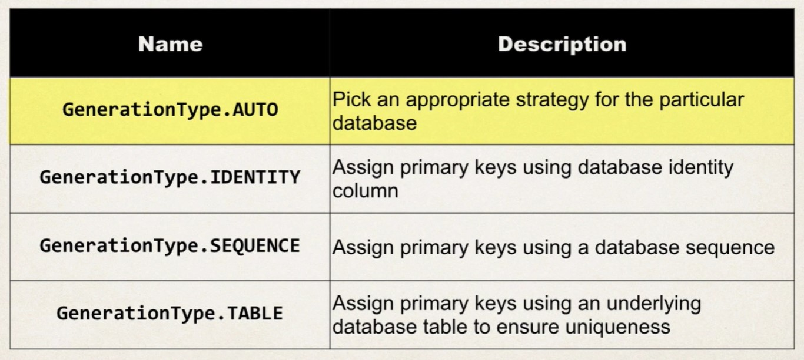
- Custom generation is also possible
  - Create an implementation of IdentifierGenerator Interface
  - Override the generate method
  - Make sure generator generates unique value in a multithreaded, multicontainer environment.
### @Temporal(TemporalType.DATE)  
- Annotation for storing dates
```java
@Column(name="date_of_birth")
@Temporal(TemporalType.DATE)
private Date dateOfBirth;
```

### @JoinColumn(name="foreign_key")
- For OneToOne Mapping and ManyToOne mapping, the foreign_key refers to source table's foreign key.
- For OneToMany Mapping, the foreign key refers to the target table's foreign key.
- [Link](https://www.udemy.com/course/spring-hibernate-tutorial/learn/lecture/8164036#overview) : Udemy Lecture : 244 for spring-hibernate-tutorial.
- In other words, the entity with the @JoinColumn attribute needs to have the foreign_key column in it's own table if the mapping is OneToOne or ManyToOne. If it is OneToMany the foreign_key column should be in the target table.

### @Transient
- Ignore the field.

### @Lob
- This is a large object, which cannot be fitted on a 255 char value.

```java
@Lob
private String journals;
```

## Entity LifeCycle
- There are 3 stages in hibernate lifecycle

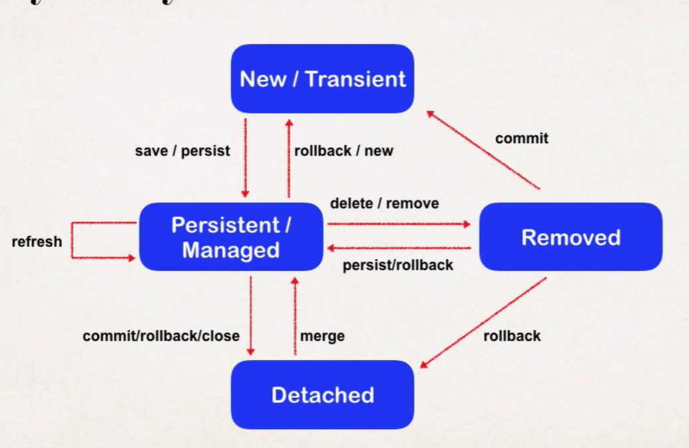
### Transient state
- The transient state is the initial state of an object.
- Here, an object is not associated with the Session. So, the transient state is not related to any database
- The transient objects exist in the heap memory. They are independent of Hibernate. 
```java
Employee e=new Employee(); 
//Here, object enters in the transient state.  
```
### Persistent State
- As soon as the object associated with the Session, it entered in the persistent state.
- Here, each object represents the row of the database table.
- So, modifications in the data make changes in the database.
- Following methods move object in persistent state
    ```java
    session.save(e);  
    session.persist(e);  
    session.update(e);  
    session.saveOrUpdate(e);  
    session.lock(e);  
    session.merge(e);  
    ```
### Detached State
- Once we either close the session or clear its cache, then the object entered into the detached state.
- As an object is no more associated with the Session, modifications in the data don't affect any changes in the database.
- However, the detached object still has a representation in the database. This is the distinction with transient state.
- To associate the detached object with the new hibernate session, use any of these methods - load(), merge(), refresh(), update() or save() on a new session with the reference of the detached object.
- To move an object to detached state use :
    ```java
    session.close();  
    session.clear();  
    session.detach(e);  
    session.evict(e);  
    ```

## Cascade Types
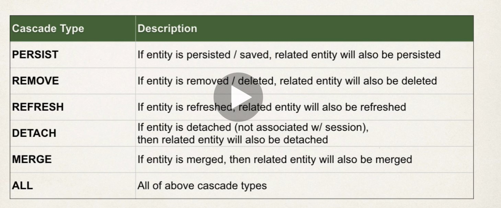

```java
@OneToOne(cascade={CascadeType.DETACH,
                    CascadeType.MERGE,
                    CascadeType.PERSIST})
```
- By default no operations are cascaded.

## Mappings in Hibernate
- Let us use the following example to define our relationship
  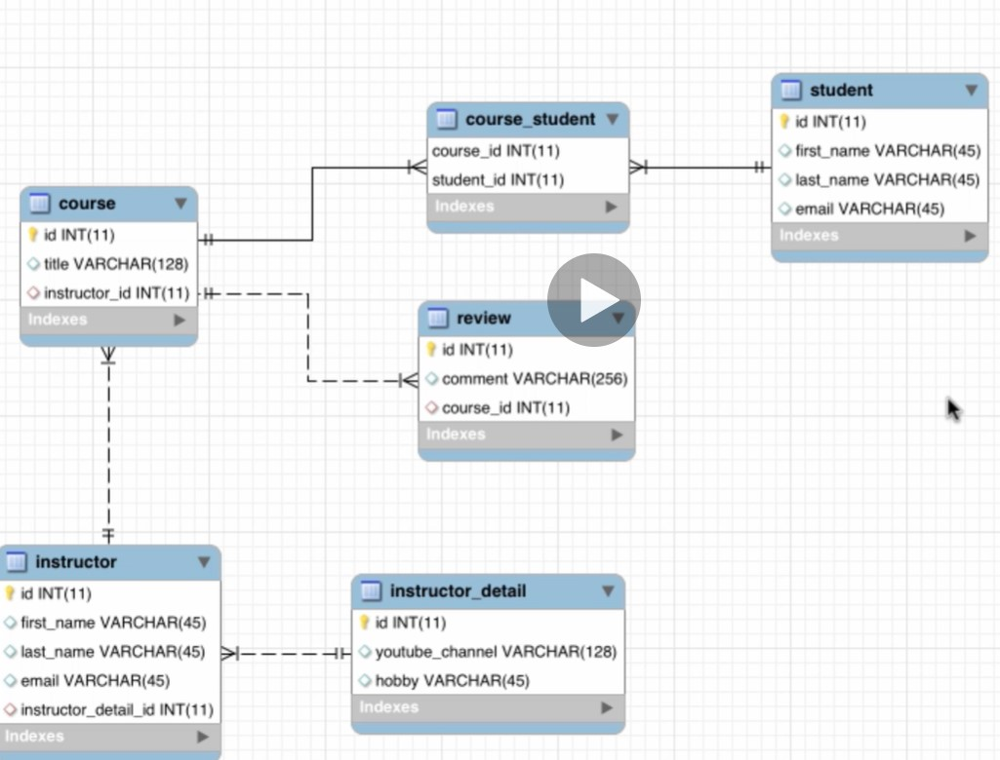
### One to One Mapping
- This relationship can be created using Primary key-Unique foreign key constraints. (Notice the Unique keyword).
#### Unidirectional
- Say there is a instructors entity and an instructor's details entity, there is a one to one unidirectional mapping between them i.e instructor knows about instructor detail's but not vice versa.
- We can use instructor_detail_id column of the instructors table to define a foreign key relationship in our table with the instructor_details table.
- To do the same in our Hibernate Model, we can define the @OneToOne Annotation as follows
- The @JoinColumn annotation combined with a @OneToOne mapping indicates that a given column in the instructor entity refers to a primary key in the instructorDetails entity:
```java
@Entity
@Table(name="instructor")
public class Instructor{
    ...
    ...
    @OneToOne(cascade=CascadeType.ALL)
    @JoinColumn(name="instructor_detail_id") //foreign key of the current table pointing to target table's row
    private InstructorDetail instructorDetail;
}
```
#### Bidirectional
- Say in above example, we need to fetch the instructor from instructor_details, we use a bidirectional mapping
  - First we need to add a new field Instructor in the InstructorDetails class and generate getters and setters.
  - Add the OneToOne annotation, and use mappedBy to denote the field in the instructor which is used to map the InstructorDetails Object
  - mappedBy tells the following
    - Look at the instructorDetails property in the Instructor class
    - In this field, use the @JoinColumn information to help find the associated instructor.
    - the value of mappedBy is the name of the association-mapping attribute on the owning side. 
  ```java
    @Entity
    @Table(name="instructor_details")
    public class InstructorDetails{
        ...
        ...
        //The mappedBy parameter denotes 
        //the name of the field in Instructor class
        // which is used to denote the InstructorDetails Object. 
        @OneToOneMapping(mappedBy="instructorDetails",
         cascade =CascadeType.ALL)
        private Instructor instructor;

        ...
    }
  ```
- In InstructorDetails class Cascade ALL signifies deleting instructorDetails should delete the instructor (Not what might be required in the usecase, but we only might want cascade in one direction).
- Note in case we delete instructor details and not delete instructor, then along with updating the CascadeType in instructorDetails to not be ALL, we also need to break the link between instructor object and the instructor details object, by explicitly making the instructorDetails field of the instructor object to null. Else there will be exception.  

### One to Many Mapping
- This type of relationship can be created using Primary key-Foreign key relationship in the database.

#### Bidirectional Mapping
- Say there is a Instructor class and a Course class and we need to get Instructor for a Course and all the Courses taught by the instructor, this is a use case for bidirectional OneToMany mapping (or ManyToOne for the course)
```java
@Entity
@Table(name="course")
public class Course{
    ...
    ...
@ManyToOne(cascade={CascadeType.DETACH,CascadeType.MERGE,CascadeType.PERSIST})
@JoinColumn("instructor_id") //foreign key of the current table pointing to target table's row
private Instructor instructor
}
```
```java
@Entity
@Table(name="instructor")
public class Instructor{
    ...
    ...
    @OneToMany(mappedBy="instructor",cascade={CascadeType.DETACH,CascadeType.MERGE,CascadeType.PERSIST})
    private List<Course> courses;
}
```
- We also need to on creation and deletion set and remove the fields of the Instructor and Course Objects in java code.
```java
instructor.addCourse(tempCourse);
tempCourse.setInstructor(instructor)
```

#### Unidirectional Mapping
- Say we have a oneToMany relationship between Course and reviews, reviews have course_id as a foreign key.
- Notice in the below case, the @JoinColumn points to the foreign key in the target table as opposed to the source table in case of the OneToOne Mapping and ManyToOne mapping
- 
```java
@Entity
@Table(name="course")
public class Course{
    ...
    ...
@ManyToOne(cascade=CascadeType.ALL,fetch=FetchType.LAZY)
@JoinColumn("course_id")//Foreign key of the target table pointing to current table's row
private List<Review> reviews
}
```


### Many to Many Mapping
- This kind of Relationship, allows a junction or bridging or join table as a connection for the two tables.
- The joining table has foreign keys for both the tables to define mapping relationship. The combination of these 2 keys will be the new primary key for the joining table.
- Say there is a many to many relationship between course and a student.
- @JoinTable annotation is used to tell hibernate how to use the joining table and what are the joinColumn and inverseJoinColumn to map the relationship between course and a student.
#### SQL for Joining Table
- Notice the course_id and student_id is a composite primary key.
- There are 2 foreign keys course_id and student_id.
```sql
CREATE TABLE `course_student` (
  `course_id` int(11) NOT NULL,
  `student_id` int(11) NOT NULL,
  
  PRIMARY KEY (`course_id`,`student_id`),
  
  KEY `FK_STUDENT_idx` (`student_id`),
  
  CONSTRAINT `FK_COURSE_05` FOREIGN KEY (`course_id`) 
  REFERENCES `course` (`id`) 
  ON DELETE NO ACTION ON UPDATE NO ACTION,
  
  CONSTRAINT `FK_STUDENT` FOREIGN KEY (`student_id`) 
  REFERENCES `student` (`id`) 
  ON DELETE NO ACTION ON UPDATE NO ACTION
) ENGINE=InnoDB DEFAULT CHARSET=latin1;
```

#### Code for Course Table
```java
@Entity
@Table(name="course")
public class Course{
    ...
    ...
@ManyToMany(cascade={ascadeType.DETACH,CascadeType.MERGE,CascadeType.PERSIST},fetch=FetchType.LAZY)
@JoinTable(
    name="course_student",//Name of the Joining table
    joinColumns=@JoinColumn(name="course_id"),//refers to the current entity's 
                                                //key in the joining table.
    inverseJoinColumns=@JoinColumn(name="student_id")//refers to the enttiy in
                                                    //the inverse of the relationship i.e the student.)
private List<Student> students;
}
```

#### Code for the Student Table
```java
@Entity
@Table(name="student")
public class Student{
    ...
    ...
@ManyToMany(cascade={CascadeType.DETACH,CascadeType.MERGE,CascadeType.PERSIST},fetch=FetchType.LAZY)
@JoinTable(
    name="course_student",
    joinColumns=@JoinColumn(name="student_id"),
    inverseJoinColumns=@JoinColumn(name="course_id")
)
private List<Course> courses;
}
```
## Advanced Mappings
### Value Types vs Entity Types
- Both these are used for composition, they are not primitives
- Entity types can exist independent of the object containing it's reference unlike Value type. Entity has a meaning on its own
- An entity has a table of it's own
- See below on Domain Driven Design for more reference.

### Mapping Entity Objects
- An entity has a table of it's own
- Use one of the mapping above.

### Mapping Value Objects in Hibernate

- Separate Columns for fields in Value objects in the original object's table.
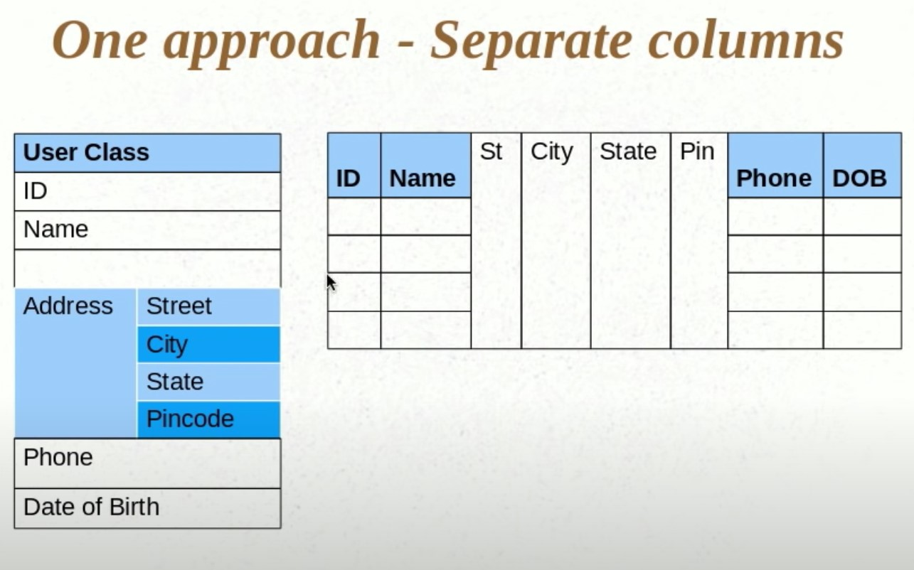
- We can do that using the @Embeddable annotation in the address class

    ```java
    @Embeddable
    public class Address{
        public String state;
        public String city;
        public String pincode;
        ///Getters and Setters and constr....
    }

    @Entity
    public class User{

        @Embedded //Optional annotation
        public Address address;
    }
    ```

#### If primary key is an embedded object(Composite Primary Key)
- You cannot use @Embedded or even @Id for such primary key.
- In such cases you use ```@EmbeddedId``` annotation instead of @Id or @Embeddable.

#### Custom names in embedded object
##### Add Column annotation in the embeddable object
```java
    @Embeddable
    public class Address{
        @Column(name="street_name")
        public String state;
        @Column(name="city_name")
        public String city;
        public String pincode;
        ///Getters and Setters and constr....
    }
```
##### Having multiple names in multiple contexts
- Say we need to have a home address and office address as part of UserDetails.
- The street_name, might cause conflict issues since there are 2 address objects. So we need to override the name in the UserDetails.
```java
    @Embeddable
    public class Address{
        @Column(name="street_name")
        public String street_name;
        @Column(name="city_name")
        public String city;
        @Column("pincode")
        public String pincode;
        ///Getters and Setters and constr....
    }

    @Entity
    public class UserDetails{

        @Embedded
        @AttributeOverrides({
            @AttributeOverride(name="street",column =@Column(name="HOME_STREET_ADDRESS")),
            @AttributeOverride(name="city",column =@Column(name="HOME_CITY")),
            @AttributeOverride(name="pincode",column =@Column(name="HOME_PINCODE")),
        })
        public Address homeAddress;

        @Embedded
        @AttributeOverrides({
            @AttributeOverride(name="street",column =@Column(name="OFFICE_STREET_ADDRESS")),
            @AttributeOverride(name="city",column =@Column(name="OFFICE_CITY")),
            @AttributeOverride(name="pincode",column =@Column(name="OFFICE_PINCODE")),
        })
        public Address officeAddress;
    }
```
- The @AttributeOverride says take the field called "name" in the Address object and the @Column annotation to it.

### Mapping Set
- 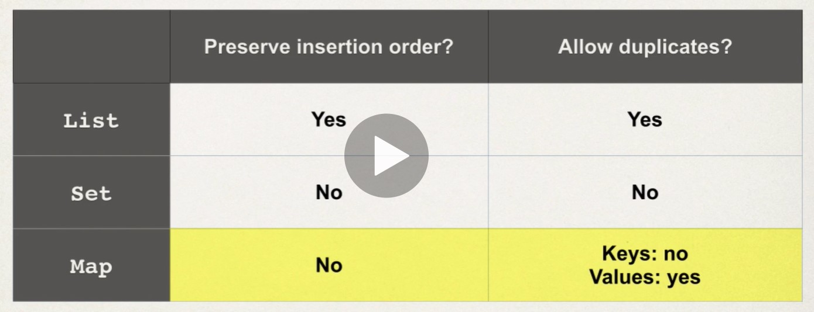
- @ElementCollection is used to tell the hibernate we are dealing with iterables.
- In this case a new table will be created with foreign key on the original table.
```java
public class UserDetails{
    @ElementCollection
    private Set<Address> listOfAddresses = new HashSet<>();
}
```
- This concept of new table and original table is similar to the oneToMany Mapping. So concepts like JoinTable and JoinColumn is valid here
- The @ElementCollection is different from @OneToMany in the following way, we cannot independently query objects in @ElementCollection since they are value objects (no id). We also cannot use Cascading strategies for elementcollection, they are always persisted, merged, deleted etc with the parent object. 

#### Tweaking the name of the JoinTable and JoinColumn for the Embedded Collection
```java
@ElementCollection
@JoinTable(name="user_address",
    joinColumns=@JoinColumn(name="user_id")
)
private Set<Address> listOfAddresses = new HashSet<>();
```
- This will name the new table defined for the collection and the name of the foreign key/joinColumn.
- We can also use @CollectionTable annotation instead of @JoinTable. 
- In case we are dealing with primitives we can do the following to change the name
- 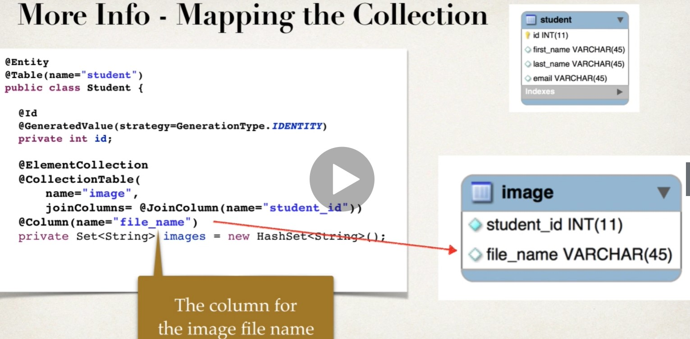
    ```java
    @ElementCollection
    @JoinTable(name="images",
        joinColumns=@JoinColumn(name="user_id")
    )
    @Column(name="file_name")
    private Set<String> images = new HashSet<>();
    ```

### Mapping a List
- Use case : When order/index is important, also queue datastructure.
- Retrieve or manipulate in order.
- Duplicates are okay.
- ```@OrderColumn``` is used to denote hibernate we are dealing with Indexed Collection.
```java
@Entity
@Table(name="student")
public class Student {
	@ElementCollection
	@OrderColumn(name="image_index")
	@JoinTable(name="image", //defaults to student_images
					joinColumns = @JoinColumn(name="student_id"))
	@Column(name="file_name") //defaults to images
	private List<String> images = new ArrayList<>();
}
```

### Mapping a Map
- Same as List, just instead of ```@OrderColumn``` there is a ```@MapKeyColumn```.
```java
	@ElementCollection
	@CollectionTable(name="imagedi")
	@MapKeyColumn(name="file_name")
	@Column(name="image_desc")//name of the value column.
	private Map<String, String> imagesDictionary = new HashMap<>();
```

### Mapping an Enum
- Just need to use the ```@Enumerated``` annotation which takes EnumType as a parameter, it can be either ```EnumType.String``` or ```EnumType.ordinal```.
 ```java
@Enumerated(EnumType.STRING)
@Column(name="status")
private StudentStatus studentStatus = StudentStatus.ACTIVE;
 ```

### Mapping a Sorted Sets
- ```@OrderBy("key_to_order_by ASC|DESC")```// Default is ASC

### Mapping a Sorted Map


## Eager Loading vs Lazy Loading
- Eager will load all the instructor and courses at once
- Lazy will load on request. This is the preferred practise. Load dependent entities on demand.

### Internals of Fetching
- Hibernate uses Proxy Objects for the original table(subclasses of original objects) to make sure the fetch is lazy in some cases, only when get is called on the proxy object then we use session object to make a call to db and lazyily fetch the value. The value is not fetched during the construction.
- 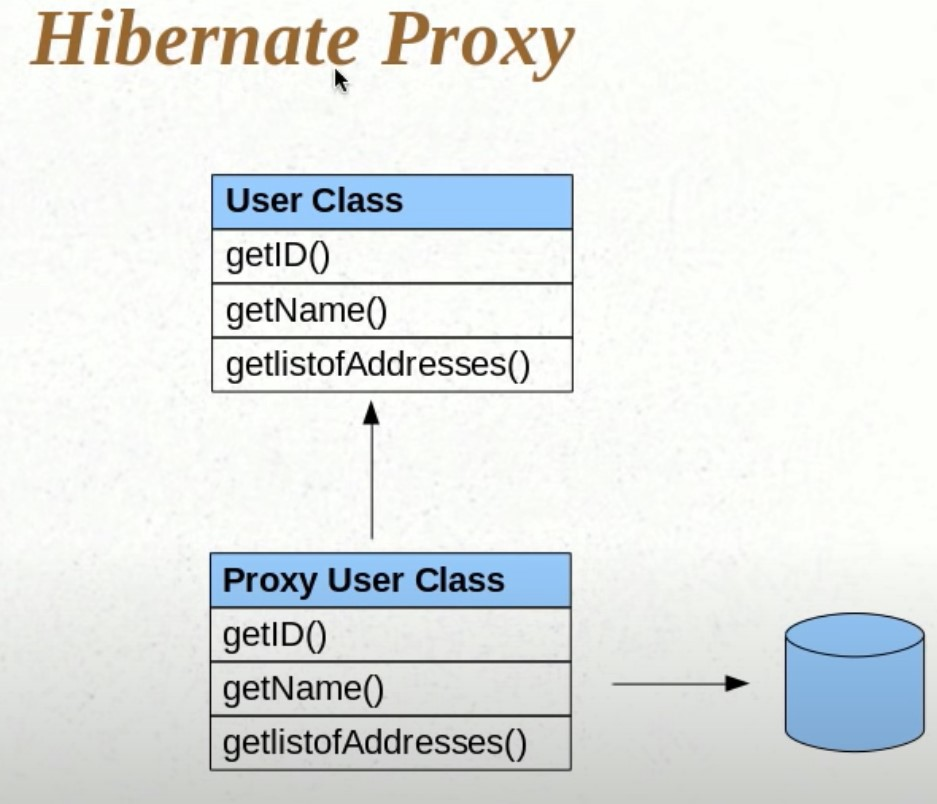

### Lazy Loading
- Lazy loading requires a hibernate session, if the session is closed, hibernate throws an error.
- Retrieve lazy data using session.get on original entity and call the getter methods on it.
- Or you can also use HQL to get the courses at a later time i.e Lazily load in another session.
#### HQL approach
```java
session = factory.getCurrentSession();
session.beginTransaction();
// get courses for a given instructor
Query<Course> query = session.createQuery(
            "select c from Course c" +
            "where c.instructor.id=:theInstructorId"
            ,Course.class);
            
query.setParameter("theInstructorId", theId);

List<Course> tempCourses = query.getResultList();

System.out.println("tempCourses: " + tempCourses);
```

### Default Fetch Types
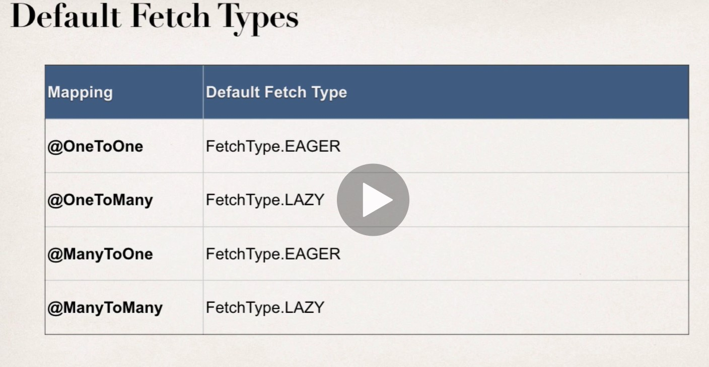
- Default fetch for Collections
- Default fetch for Embeddables
### Overiding default fetch types
```java
@ManyToOne(fetch=FetchType.LAZY)
```
### Extra lazy fetch collection.


## Inheritance 
- @Inheritance is used to tell hibernate to use a inheritance strategy to use to deal with inheritance. This annotation has to be decorated in the super class
    ```java
    @Entity
    @Table(name="vehicle")
    @Inheritance(strategy=InheritanceType.SINGLE_TABLE)
    public class Vehicle{
        ....
    }
    ```

### Single Table Strategy
- By default hibernate creates one common table if there is inheritance between objects and has a DTYPE column added to denote the subtype of the object.
- All the fields in all the subclasses (steeringwheel, steeringhandle) will be added to the same table.
- DTYPE is discriminator column.
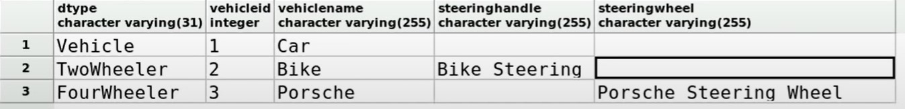
- The distriminator column is also configurable
    ```java
    @Inheritance
    @DiscriminatorColumn(
        name="VEHICLE_TYPE",//Custom name for DTYPE
    )
    ```
- The discriminator value is also configurable
    ```java
    @DistriminatorValue("Bike")
    public class TwoWheeler{
        ....
    }
    ```

### Table per class strategy
- In this strategy, hibernate will generate the columns of the parent class in the child tables.
- The annotation of the parent fields is also inherited in the child tables.
- This is normalized form. So more elegant way.
    ```java
    @Entity
    @Table(name="vehicle")
    @Inheritance(strategy=InheritanceType.TABLE_PER_CLASS)
    public class Vehicle{
        ....
    }
    ```

#### Problem with having 2 different tables to deal with subclasses without using @Inheritance
- You won't be able to use polymorphism. Say you have user class and vehicle class, you won't be at run time able to choose between 2 wheeler or 4 wheeler.
- Using @Inheritance however 

### Joined Strategy 
- Have specific properties in another table, and common fields in the same table.
- You can join the 2 tables to get all the information.

### MappedSuperclass Strategy
- Similar to table per class
- Inheritance doesn't exist in database
- No superclass table.
- In super class use @MappedSuperClass annotation
```java
@MappedSuperClass
public class User{
    ....
}

@Entity
public class Student extends User{
    //....
}

@Entity
public class Instructor extends User{
    //....
}
```

## HQL
- Use JPQL Instead

## Named Queries
- Simply a way to reuse queries
## Named Native Queries


## Criteria API
- The Criteria API is a predefined API used to define queries for entities. It is the alternative way of defining a JPQL query. These queries are type-safe, and portable and easy to modify by changing the syntax.
### Criteria
- Tell's Hibernate we are creating a criteria, kind of like a where clause.
### Restrictions
- Add restrictions to the criteria.
```java
Criteria criteria = session.createCriteria()
```
### Projections
- For aggregation functions
### Query By Example

## Caching
### First Level of Cache
- Session or entityManager is the first level cache.
- Multiple updates in one session will mostly lead to a single update call to db.
- Calling 2nd get in a session might be fetched from the first level cache itself.
### Second Level of Cache
- Anything that happens in session doesn't stay for a long time. So if the session is closed you need to go again to db.
- This is why we need a second level cache.
- We configure the second level cache in the configuration by providing the cache provider
```xml
<property name="cache.use_second_level_cache">true</property>
<property name="cache.provider_class">org.hibernate.cache.EhCacheProvider</property>
```

#### @Cachable
- Not all the entities by default are cached. The way we do that is by using the annotation ```@Cachable```
```java
@Entity
@Cachable
@Table(name="user_details")
public class UserDetails{
    ....
}
```
#### Caching Strategy
- Tells how to deal with the entity, if it is read only or it can be modified.
- READ_ONLY : The entity is read-only, no need to track the updates.
- READ_WRITE : The entity is mutable, need to update the cache on updating entity.
- NON_STRICT_READ_WRITE : Eventually Consistent
- TRANSACTIONAL : Cache is only valid in a transaction, strictest of all.
```java
@Entity
@Cachable
@Cache(usage=CacheConcurrencyStrategy.READ_ONLY)
@Table(name="user_details")
public class UserDetails{
    .....
}
```
#### Second Level Cache across sessions in one application

#### Second Level Cache across different application

#### Second Level Cache across clusters
### Query Cache
- results from Explicit HQL Queries aren't cached by the second level cache, we need a separate cache for queries known as the queryCache
```java
Query query = session.createQuery("from UserDetails user where user.userId = 1");
session.close();
....
session2.beginTransaction();
Query query = session2.createQuery("from UserDetails user where user.userId = 1");
//The above without query cache and only second level cache will generate 2 db calls.
```
- To create a query cache you need to enable it in the configuration. 
- Just like second level cache, query cache also needs a provider, we can use the same cache provider.
```java
<property name="cache.use_query_cache">true</property>
<property name="cache.provider_class">org.hibernate.cache.EhCacheProvider</property>
```
- Just like we needed to enable second level caching per entity, we also need to enable query caching per query.
```java
Query query = session.createQuery("from UserDetails user where user.userId = 1");
query.setCachable(true); // tells hibernate to store in query cache.

session.close();
....
session2.beginTransaction();
Query query2 = session2.createQuery("from UserDetails user where user.userId = 1");
query2.setCachable(true); // also tells hibernate to look for the result of this query in query cache.
```
- setCachable performs 2 roles. If the query cache doesn't have the value then go to db and store in cache, if there is value in cache just fetch from there.
## Migrations in Hibernate
When working with JPA and Hibernate, you have two options to manage the underlying database schema:

- You can encapsulate schema changes in migration scripts and use a tool, like Flyway, to apply the migration scripts upon starting the application.
- You can generate or update the database schema from the JPA and Hibernate entity mappings using the hbm2ddl.auto tool.

## Hibernate HBM2DDL
- Don't use in production, use liquibase or flyway and run actual sql scripts to modify database schema.
- Useful in dev and testing.
- We specify the auto configuration of database schema using the following property
```java
<property name=hibernate.hbm2ddl.auto>create-only</property>
```
### Other values
- create-drop is useful for unit testing.
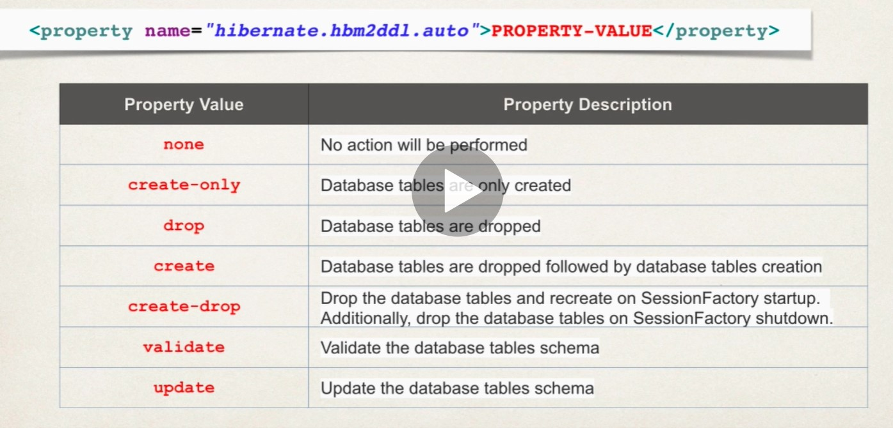

# JPA
- Java Persistence API
- JPA is a standard for Object Relational Mapping. The most famous JPA provider is Hibernate. 
- JPA is an specification/interface and Hibernate is an implements of the JPA Specification

## Entity Manager
- Save the Entity to Database
```java
 EntityManagerFactory emfactory = Persistence.createEntityManagerFactory( "Eclipselink_JPA" );
EntityManager entitymanager = emfactory.createEntityManager( );
entitymanager.getTransaction( ).begin( );
//
//entitymanager.remove( employee );

entitymanager.getTransaction( ).commit( );
```
- To get ```Employee employee = entitymanager.find( Employee.class, 1201 );```
- To post ```entitymanager.persist( employee );```
- To update, simply get and the use setters and the commit transaction.
- To delete ```entitymanager.remove( employee );```

## Persistence Context
- Within the persistence context, the entity instances and their lifecycle are managed.
- The persistence context is the first-level cache where all the entities are fetched from the database or saved to the database. It sits between our application and persistent storage.
- An EntityManager instance is associated with a persistence context.
- Flushing a Cache is the act of putting modified data back into the database.
- A PersistenceContext is essentially a Cache. It also tends to have it's own non-shared database connection.
### Persistence contexts are available in two types:
- The default persistence context type is PersistenceContextType.TRANSACTION. To tell the EntityManager to use the transaction persistence context, we simply annotate it with @PersistenceContext
#### Transaction-scoped persistence context
- ```java
    @PersistenceContext
    private EntityManager entityManager;
    ```
- The transaction persistence context is bound to the transaction. As soon as the transaction finishes, the entities present in the persistence context will be flushed into persistent storage.
####  Extended-Scoped Persistence Context
- ```@PersistenceContext(type = PersistenceContextType.EXTENDED)```
- An EntityManager using an extended persistence context maintains the same persistence context for its entire lifecycle. Whether inside a transaction or not, all entities returned from the EntityManager are managed, and the EntityManager never creates two entity instances to represent the same persistent identity. Entities only become detached when you finally close the EntityManager (or when they are serialized).

## JPQL 
- SQL for JAVA Objects
- ```Select UPPER(e.ename) from Employee e```
- ```Select e from Employee e where e.salary Between 30000 and 40000```
- ``` Query query = entitymanager.createQuery( "Select e " + "from Employee e " + "ORDER BY e.ename ASC" );```
- See Hibernate Notes on how we can use query object. (getResultList, getSingleResult)


## Annotations

@Entitiy
- Store a Java bean to the table then declare the bean with the Entity Annotation.

@Id
- Declare primary key with Id Annotation

@GeneratedValue
- Declare the field decorated by this annotation to have generated value.

@Transactional
- Each method would be involved in a transaction if the class is declared with @Transactional annotation.
- It is used to combine more than one writes on a database as a single atomic operation.
- If you don't specify @Transactional, each DB call will be in a different transaction.
```java
@Repository
@Transactional
public class UserRepository {
    @PersistenceContext
    private EntityManager entityManager;

    public long insert(User user){
        entityManager.persist(user);
        return user.getId();
    }
}

```


@PersistenceContext


# Apache commons
- It has utility classes.

# JMS
- JAVA Messaging Service
## Message Types
- JMSObjectMessage
- JMSTextMessage
- JMSBytesMessage
- JMSStreamMessage
- JMSMapMessage

# Behavior Driven Design
- BDD focuses on defining user stories or scenarios. It is closely related to an incremental process, but it can also be viewed as static: it describes all the interactions between users and the finished system.
- Cucumber (language used is Gherkin) is used for BDD.

# Domain Driven Design
- Eric Evans
- We develop model of the domain/business problem and make our software conform to that.
- When designing our focus shouldn't be on the technology, but on the business or whatever activity we are trying to assist with the  software.
- It's not customer's job to know what they want. Even if architecture is fabulous but the end user decides if the system is good or not.
- Services, Entities, Domain Model, Repositories, Factories are made popular by domain driven design
- DDD focuses on defining the vocabulary in that language: actors, entities, operations, ... An important part of DDD is also that the ubiquitous language can be clearly seen in the code, too, not only in communication between the implementor and the domain expert. So an extreme view of DDD is quite static: it describes the finished system as a whole.

# Consumer Driven Contract (CDC)
- Consumer defines the API Contracts

## 2 Types of tools

### Strategic Design Tools
- Everyone who is more experienced will give more importance to strategic design tools.
- Instead of thinking in terms of objects like in OOPs, we think in terms of context (setting in which a word/statement appears, determines it's meaning)
- When given a problem, you talk to domain expert and try to find the core values and motivation behind each feature.

- Shouldn't change during product development.
#### Domain Model
- Aspects chosen for implementation that constitute the model.
- Representation of Bounded Contexts, Domain Model is to Bounded Context, what classes are to objects.

#### Ubiquitous Language
- Developer, Domain Expert, Analyst, everyone and everything should use the same words for same concepts, any 2 people are talking to each other, everyone else should be able to follow. You need to name your classes, code, documentation that way. Don't become more technical that necessary.
- 
#### Bounded Context
- Things hold the same meaning within each bounded context.
- In the following figure, A Customer Concept is different to a Sales Person(Interests, likes, needs) and is different to Support(Purchase History, Tickets etc) and also different for Accounting(Method of Payement, Refunds etc). Each of these are a bounded contexts.
- **Each bounded context needs to have their own Domain Model and Bounded Context, Database, API, User Manual.**
- Design your microservice around bounded context.

#### Context Map
- Relationship between bounded context, API Contracts etc are context map.

#### Event Storming
- Brainstorming workshop between domain experts and developers aimed to attain a common understanding of the domain model and define bounded contexts etc.

### Technical Design Tools
- Concerned with the implementation
- Expected to change within product development.

#### Layered Architecture.
- The heirarchy of Request Handler, Controller to Service Layer and Finally to Repository Layer.
- Everything is organised and well design, reusable components.

#### Value Types
- Don't use primitive in your code.
- Value enforces ubiqutous language.
- Easily Validate/Limits inside the value itself.
- Helps us avoid Magic Numbers and duplicated code.
- Immutable so thread safe.


#### Entity Object
- Uniquely Identified using ID
- Consists of value objects
- mutable
- represents a row in db.
- generally implements some business logic

