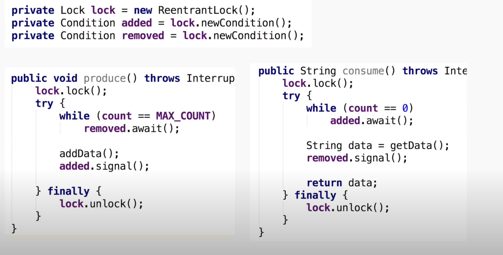
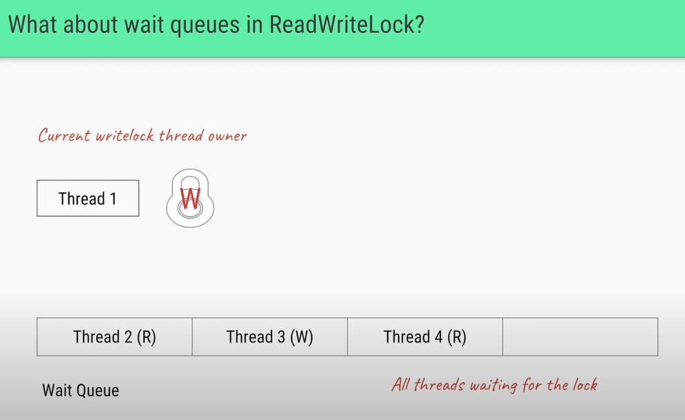
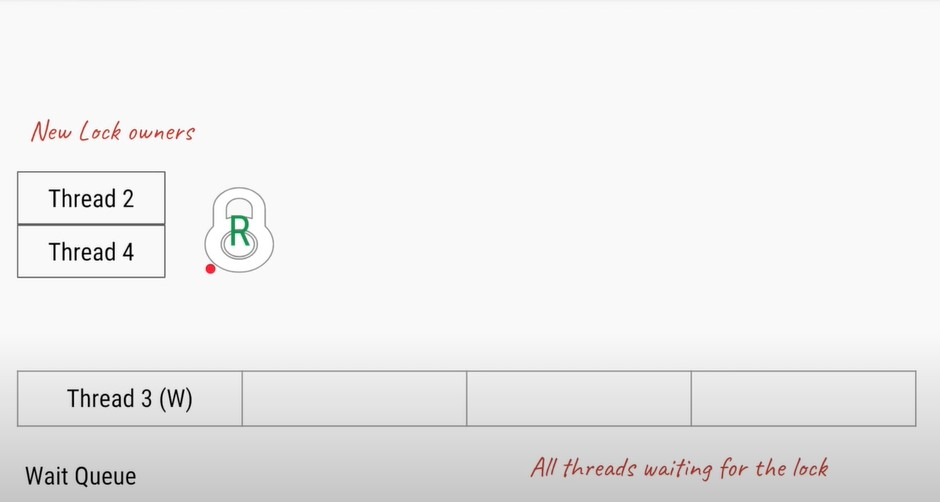
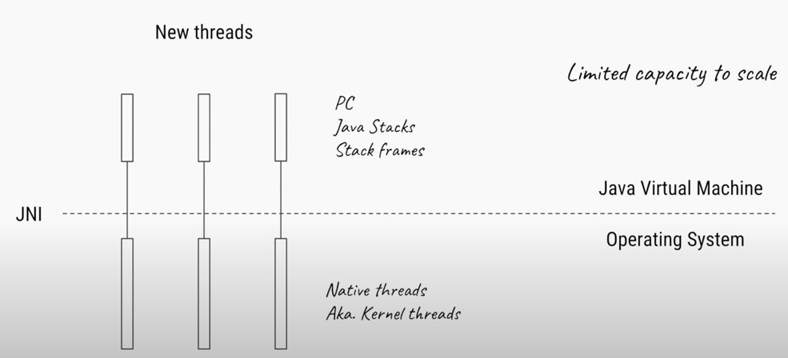
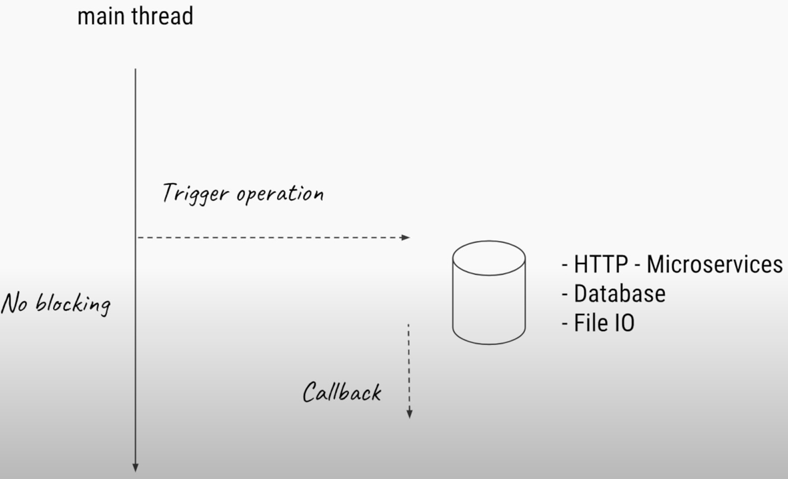

- To create a thread you need to create a class( can be anonymous ), inherit the Thread class and overwrite it's run method.
- you need to start the thread explicitly after initializing it. You cannot start the same thread more than once, you need to initialize another thread with same class if you want to run again.
    ```java
        Thread t = new Thread() {
            public void run(){
                System.out.println("Hello from the anonymous class");
            }
        };
    ```

# Threads
- Threads in java are Operating System threads/Native Threads/Kernel Threads.
- Each thread has thread stack, program counter, stack frames.
- Using too many threads decreases performance by context switching and flushing caches repeatedly for each context switch. Data Locality Issue
- There is also a scheduling overhead.
- Lot of IO Operations also result in a lot of blocking operations.
- These 2 problems


# Synchronous/Asynchronous Java API
- Using Completable futures
- Using callbacks and not wait.

# Java Memory Model


## Happens Before Guarantee

## Visibility Guarantee

# Volatile 


# Thread Local


# Blocking Queue


# CountDownLatch
 

# Rentrant Lock and Conditions

We can use any object as a lock in synchronised block and use wait and notify inside the synchronised block to communicate between threads and notify the threads.
```java
    public class ObjectLockExample {
        static Object lock = new Object();
        public static void main(String[] args) throws InterruptedException {
            ExecutorService service = Executors.newFixedThreadPool(2);
            service.submit(new Runnable(){
                @Override
                public void run() {
                    synchronized (lock) {
                        try {
                            System.out.println("Waits till enter is pressed");
                            lock.wait();
                        } catch (InterruptedException e) {
                            e.printStackTrace();
                        }
                    }
                }
            });

            service.submit(new Runnable(){
                @Override
                public void run() {
                    synchronized (lock) {
                        System.out.println("Press enter key to proceed");
                        new Scanner(System.in).nextLine();
                        lock.notify();
                        System.out.println("THis has to complete first");
                    }

                }
            });
            service.shutdown();
            service.awaitTermination(10000, TimeUnit.SECONDS);
        }
    }
```

We can also use specialized locks known as rentrant locks and Conditions class to do the exact same thing. Instead of calling wait and notify on the Object (Lock) itself, we call await and signal on Condition Object while using reentrant locks.

## While using rentrant locks remember to unlock in the finally block.
```java
public class ReentrantLockExample {

    static Lock lock = new ReentrantLock();
    static Condition cv = lock.newCondition();

    public static void main(String[] args) throws InterruptedException {
        ExecutorService service = Executors.newFixedThreadPool(2);
        service.submit(new Runnable(){
            @Override
            public void run() throws InterruptedException {
                lock.lock();
                try{             
                    System.out.println("Waits till enter is pressed");
                    cv.await();
                    System.out.println("Lock is acquired again");
                }
                finally{
                    lock.unlock();
                }
            }
        });

        service.submit(new Runnable(){
            @Override
            public void run() throws InterruptedException {
                lock.lock();
                try{
                    System.out.println("Press enter key to proceed");
                    new Scanner(System.in).nextLine();
                    cv.signal();
                    System.out.println("THis has to complete first");
                }
                finally{
                    lock.unlock;
                }
            }
        });
        service.shutdown();
        service.awaitTermination(10000, TimeUnit.SECONDS);
    }
}
```

- ### Rentrant Locks are called rentrant since they allow us to get a lock on the same lock object multiple times, you also need to call the unlock the same number of times. There is a method ```lock.getHeldCount()``` it will return the number of times the lock method was called. 

- Rentrant Locks(explicit lock) also allow locking and unlocking in any scopes in any order. Unlike using synchronised keyword(implicit lock)

## Conditions

- You can have multiple conditions for a single lock for multiple use-cases.
  ```java
  private Lock lock = new RentrantLock();
  private Condition cv1 = lock.newCondition();
  private Condition cv2 = lock.newCondition();
  ```

## DeadLock and tryLock

**Rentrant locks have a method called tryLock**, which can be used to elegantly deal with deadlock situations. Say 2 threads T1 and T2 want to acquire 2 locks l1 and l2. A dead lock occurs when they try to acquire locks in different order than the other thread. T1 acquires l1 first and then l2, T2 acquires l2 first then l1. In such situation if l1 is acquired by T1 and l2 by T2 then the program is in state of deadlock. We can deal with deadlock by trying to acquire both locks together, if not don't acquire any. We do that using the tryLock method of rentrant locks as follows.
### Look at the implementation of acquire locks, it is important. The While true part.

```java
    static Lock l1 = new ReentrantLock();
    static Lock l2 = new ReentrantLock();

    static void acquireLock(Lock l1, Lock l2){
        while(true){
            boolean l1IsLocked = false;
            boolean l2IsLocked = false;
            try{
                l1IsLocked =  l1.tryLock();
                l2IsLocked = l2.tryLock();
            }
            finally {
                if(l1IsLocked && l2IsLocked) return;
                else{
                    if(l1IsLocked) {
                        l1.unlock();
                    }
                    if(l2IsLocked){
                        l2.unlock();
                    }
                }
            }
        }
    }

    public static void main(String[] args) throws InterruptedException {
        Thread t1 = new Thread(new Runnable(){
            @Override
            public void run() {
                acquireLock(l1,l2);
                try {
                    System.out.println("Acquired Both Locks....");
                }
                finally {
                    l1.unlock();
                    l2.unlock();
                }
            }
        });
        Thread t2 = new Thread(new Runnable(){
            @Override
            public void run() {
                acquireLock(l2,l1);
                try {
                    System.out.println("Acquired Both Locks....");
                }
                finally {
                    l1.unlock();
                    l2.unlock();
                }
            }
        });
        t1.start();
        t2.start();
        t1.join();
        t2.join();
    }
```

- You can also use tryLock to not block the thread and try something else if the lock is not available.
```java
boolean lockAcquired = lock.tryLock();
//Not blocked if lock not acquired.
if(lockAcquired){
    try{
        //access resources
    }
    finally{
        lock.unlock
    }
}
else{
    do something else.
}
```
- tryLock doesn't honor fairness, even if fairness is enabled, it will barge-in and acquire the lock.
- You can use timeout parameter in try lock to wait till a specified time to acquire lock, if not acquired by that time continue returning false.
- You can use ```lock.isHeldByCurrentThread()``` to know if the current thread holds the lock.

## Lock Fairness
- by default the lock is unfair.
- When multiple threads try to access a lock, they are put into a wait queue.
- If fairness is enabled, then the lock is acquired based on first come first served basis, the first thread is poped from the queue and is assigned the lock. 
- ```Lock lock = new RentrantLock(true)``` you can enable fairness. Default value is false.
### Barge-in
- When the lock is released, if fairness is disabled(default value), a thread which has just tried to acquire the lock at this time might get the lock, even though threads arriving earlier are the queue so that **we can skip the pushing new thread into queue and popping old thread step** to gain some performance benifit. This however can lead to thread   starvation. 


# V.IMP Signal vs Signal All / notify vs notifyAll
- notify wakes (any) one thread in the wait set, notifyAll wakes all threads in the waiting set.

## notifyAll should be used most of the time. If you are not sure which to use, then use notifyAll, even if uselessly wakes up all the threads even though only one can execute at a time as lock is required for execution. Our while guard will protect us.
- Look at producer/consumer (assumption is a ProducerConsumer class with two methods). IT IS BROKEN (because it uses notify) - yes it MAY work - even most of the time, but it may also cause deadlock - we will see why:
  ```java
  public synchronized void put(Object o) {
    while (buf.size()==MAX_SIZE) {
        wait(); // called if the buffer is full (try/catch removed for brevity)
    }
    buf.add(o);
    notify(); // called in case there are any getters or putters waiting
    }

    public synchronized Object get() {
        // Y: this is where C2 tries to acquire the lock (i.e. at the beginning of the method)
        while (buf.size()==0) {
            wait(); // called if the buffer is empty (try/catch removed for brevity)
            // X: this is where C1 tries to re-acquire the lock (see below)
        }
        Object o = buf.remove(0);
        notify(); // called if there are any getters or putters waiting
        return o;
    }
  ```
## Reason for having while guards -> IMPORTANT
## Perform wait/await in the loop always.
- One problem that having loop solves is spurious wake ups, sometimes even if there was no notify/signal, the thread may wake up. That's why it is important to check the condition and put the thread in wait state again.
- We need a while loop in case we get this situation:
- Consumer 1 (C1) enter the synchronized block and the buffer is empty, so C1 is put in the wait set (via the wait call). Consumer 2 (C2) is about to enter the synchronized method (at point Y above), but Producer P1 puts an object in the buffer, and subsequently calls notify. The only waiting thread is C1, so it is woken and now attempts to re-acquire the object lock at point X (above).
- Now C1 and C2 are attempting to acquire the synchronization lock. One of them (nondeterministically) is chosen and enters the method, the other is blocked (not waiting - but blocked, trying to acquire the lock on the method). Let's say C2 gets the lock first. C1 is still blocking (trying to acquire the lock at X). C2 completes the method and releases the lock. Now, C1 acquires the lock. Guess what, lucky we have a while loop, because, C1 performs the loop check (guard) and is prevented from removing a non-existent element from the buffer (C2 already got it!). If we didn't have a while, we would get an IndexArrayOutOfBoundsException as C1 tries to remove the first element from the buffer!

## Reason for using notify ALL
In the producer/consumer example above it looks like we can get away with notify. It seems this way, because we can prove that the guards on the wait loops for producer and consumer are mutually exclusive. That is, it looks like we cannot have a thread waiting in the put method as well as the get method, because, for that to be true, then the following would have to be true:
```buf.size() == 0 AND buf.size() == MAX_SIZE (assume MAX_SIZE is not 0)```

HOWEVER, this is not good enough, we NEED to use notifyAll. Let's see why ...


Assume we have a buffer of size 1 (to make the example easy to follow). The following steps lead us to deadlock. Note that ANYTIME a thread is woken with notify, it can be non-deterministically selected by the JVM - that is any waiting thread can be woken. Also note that when multiple threads are blocking on entry to a method (i.e. trying to acquire a lock), the order of acquisition can be non-deterministic. Remember also that a thread can only be in one of the methods at any one time - the synchronized methods allow only one thread to be executing (i.e. holding the lock of) any (synchronized) methods in the class. If the following sequence of events occurs - deadlock results:

### Step - 1
- P1 puts 1 char into the buffer
### Step - 2
- P2 attempts put - checks wait loop - already a char - waits

### Step - 3
- P3 attempts put - checks wait loop - already a char - waits
  
### Step - 4
- C1 attempts to get 1 char
- C2 attempts to get 1 char - blocks on entry to the get method
- C3 attempts to get 1 char - blocks on entry to the get method


### Step - 5
- C1 is executing the get method - gets the char, calls notify, exits method
- The notify wakes up P2
- BUT, C2 enters method before P2 can (P2 must reacquire the lock), so P2 blocks on entry to the put method
- C2 checks wait loop, no more chars in buffer, so waits
- C3 enters method after C2, but before P2, checks wait loop, no more chars in buffer, so waits

### Step - 6
- NOW: there is P3, C2, and C3 waiting!
- Finally P2 acquires the lock, puts a char in the buffer, calls notify, exits method

### Step - 7
- P2's notification wakes P3 (remember any thread can be woken)
- P3 checks the wait loop condition, there is already a char in the buffer, so waits.
- NO MORE THREADS TO CALL NOTIFY and THREE THREADS PERMANENTLY SUSPENDED

SOLUTION: Replace notify with notifyAll in the producer/consumer code (above).
### To solve the problem above, you can also have 2 different kind of conditions one for added(added.await/signal) and one for remove(remove.await/signal). It is possible by using rentrant locks and conditions class.



## Additional Points
 
-  If multiple threads are waiting for the notification and we use signal() method then only one thread get the notification and the remaining thread have to wait for further notification. Which thread will get the notification we can’t expect because it totally depends upon the JVM. But when we use signalAll() method then multiple threads got the notification but execution of threads will be performed one by one because thread requires lock and only one lock is available for one object.
-  Condition.signal is fair and will wake up the thread that has been waiting the longest till now.
- In case of mutually exclusive locking, only one of the waiting threads can do something useful after being notified (in this case acquire the lock)


# ReadWriteLock
- We can use readwrite lock to allow multiple threads to read a resources, using rentrant lock will also block reads to the resource. Multiple reader threads and only one writer thread is required. 
- There is one caveat though even though multiple threads can acquire the read lock, while someone is accessing the readlock, no thread can access the write lock, even if they are separate locks. Only one among read/write lock can be acquried at a time.
- We can have either readlock acquired by n threads or a write lock acquired by 1 thread. But never at the same time.
- ## Only write lock can allow newConditions
## Wait Queue for lock in this read write lock.

In this case we have 2 types of thread, R and W. Once thread 1 releases lock, both Thread2 and Thread 4 gain access to the lock, since it is more performant to skip Thread 3.


While Thread 2 and 4 are still working on the read lock, if another thread 5 which is a read thread comes in, we can have 2 types of behavior.
  -  Thread 5 can acquire the read lock skipping thread 3 but if a lot of read threads comes, thread 3 can go into starvation.
  -  Thread 3 will acquire the lock, rentrant readwrite lock implements does this case, the thread 5 will wait for thread 3 to complete. 


# Executor Service

- For CPU intensive task, ideal pool size is CPU Core count.
- For IO Intensive task, you can have higher number of threadsm, based on number of IO Operations, and average wait time of thread.
- Too many threads slow down the system due to context switching and also consume a lot of memory

## Types of Pool
- All types uses ThreadPoolExecutor class and pass custom parameters to it.
    ```java
        ThreadPoolExecutor(int corePoolSize,
                       int maximumPoolSize,
                       long keepAliveTime,
                       TimeUnit unit,
                       BlockingQueue<Runnable> workQueue,
                       ThreadFactory threadFactory,
                       RejectedExecutionHandler handler)
    ```
- If your threadPool is at maxCapacity and the queue is also fixedSize task, then the executor service will reject the task, and will take action according to policy defined by  RejectedExecutionHandler.
  - AbortPolicy -> Throws Exceptin
  - DiscardPolicy -> Silently Discard
  - DiscardOldestPolicy -> Discard Oldest Task
  - Caller Runs Policy ->Tells the caller/main thread to execute the task.
    - This slow downs the main thread too.

### FixedThreadPool
- Internally uses LinkedBlockingQueue to keep track of all submitted tasks.
- It uses LinkedBlockingQueue and not ArrayBlockingQueue since the number of tasks are not fixed and can be a large value, linkedlist can add and remove at constant time, unlike array which needs has O(n) in worst case sceanrio.
- Remember thread size is fixed, not the task's size.
- will recreate the thread if thread exits due to exception

### CachedThreadPool
- Internally uses synchronous queue to hold only 1 task. Since number of threads are unbounded and can be till INT_MAX, no need to store the task, just create a new thread if no thread is available.
- If all threads are busy the service creates a new thread.
- if thread is idle for more than 60 seconds then it kills the thread


### ScheduledThreadPool
- Uses DelayedWorkQueue. return the task based on wheather the time has passed or not.
- You can schedule a task to run, create tasks at every fixedTimeInterval, or create task at fixedDelay between previous task.


```java
     ScheduledExecutorService service = Executors.newScheduledThreadPool(10);

        service.schedule(()->{
            System.out.println("This is scheduled");
        },2,TimeUnit.SECONDS);

        service.scheduleAtFixedRate(()->{
            System.out.println("This is fixed interval scheduled");
        },1,3,TimeUnit.SECONDS);

        service.scheduleWithFixedDelay(()->{
            System.out.println("This is fixed delay");
        }, 2,2,TimeUnit.SECONDS);
```

### SingleThreadedExecutor
- fixedThreadPool with 1 thread
- uses LinkedBlockingQueue
- will recreate the thread if thread exits due to exception

### CustomThread
- You can create custom executor using ThreadPoolExecutor
- You can use any blocking queue you want even arrayblockingqueue for fixedsize task, if a task is added after the queue is full, a new thread is created.
    ```java
    ExecutorService service = new ThreadPoolExecutor(10,10,1, TimeUnit.MINUTES, new ArrayBlockingQueue<Runnable>(10),new ThreadPoolExecutor.CallerRunsPolicy());
    ```

## Lifecycle Methods

### Shutdown
- It will just initiate the shutdown, not immediately shutdown, Any new task that is submitted to the service after shutdown are not accepted and will invoke rejectHandler, (Can discard or can abort or caller run), It will complete all the tasks present in queue and thread.
- ```service.isShutdown()``` will return true if shutdown is initiated.
- ```service.isTerminated``` will return true if service has completely shutdown.

### Await Termination
- Tells the main thread to block execution of main thread till all the task submitted are completed or it a certain timeout is exceeded which ever is lower.
  
### shutdownNow()
- Will let the threads currently running, but won't initiate/start any tasks in the queue. It will return all the task in queue in the form of list of runnables.
```List<Runnables> runnables = service.shutDownNow();```

# Callable
## Callable vs Runnable
- If you want to return a value from the thread, you cannot do that if you implement Runnable since it has ```void run()``` method which returns void.
- For this case we have Callable Interface
```java
    class Task implements Callable<Integer>{
        @Override
        public Integer call() throws Exception {
            return new Random().nextInt();
        }
    }
```
- Callable returns a Future

## Future
- Future holds the return value of a callable, it is a holder which will have the return value once the task is completed.
- Calling ```future.get()```  will return the return value of the task if the task is completed, or wait till the task return the value.
     
- ```future.get()``` is a blocking method and will block the caller thread till future is done.

- You need to be careful when processing multiple future in a list, since doing f.get() on first item/placeholder, the main thread will go into block state, even if we have futures which are completed in the list. You can use ```future.isDone()``` to check if an item is completed then try to get it. Another way to deal with it is use timeout in get method. ```future,get(1,TIMEUNIT.MINUTES) // throws TimeoutExeception```.

### Cancel Method
- It can cancel the task, if you call this method on the future, there is a catch though, if the cancel is called on a task which is in queue and is not processed by some thread then that task will be cancelled as expected, but a task that is being processed won't be cancelled. In that case you can use mayInterruptIfRunning flag to attempt to interrupt the thread ```future.cancel(true) //mayInterruptIfRunning : true```. Look at Interrupt in thread.

### Execution Exception

# Asynchronous Programming
## Problem
- Every thread in Java is a native OS thread/kernel thread
- This limits the number of threads you can have in your application.

- If too many threads then we also run into other problems, like flushing cache of old thread and push the data required by new thread, this context switching causes a lot of memory overhead. This is the datalocality issue.
- There is also a scheduling overhead since OS will be busy in scheduling many threads.
- IO operation will cause the thread to be blocked or in the wait state till the IO operation is complete, wasting all the memory to keep the thread alive. This limits the capacity to scale IO operation.

## Solution
- We need non blocking IO operation.
