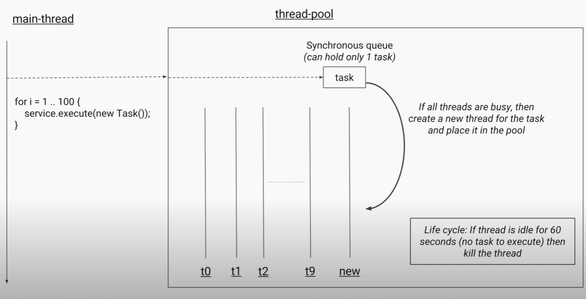
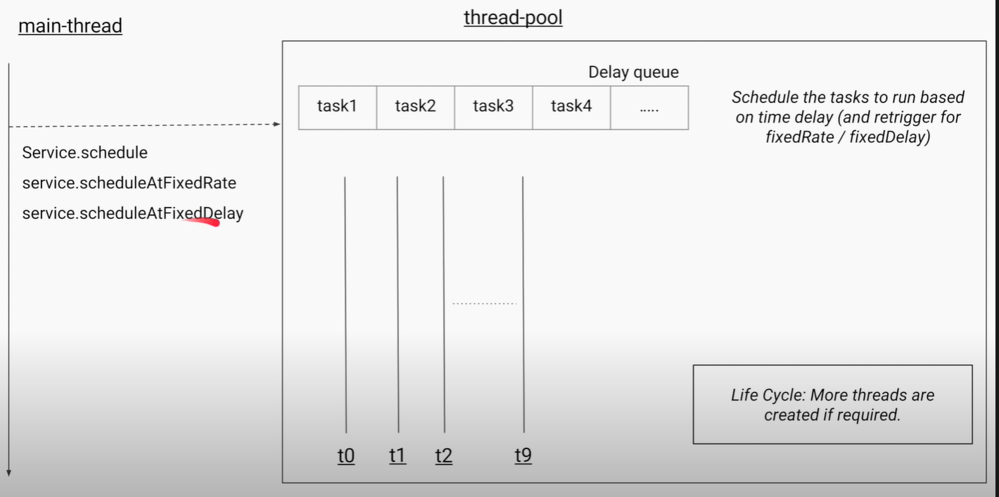
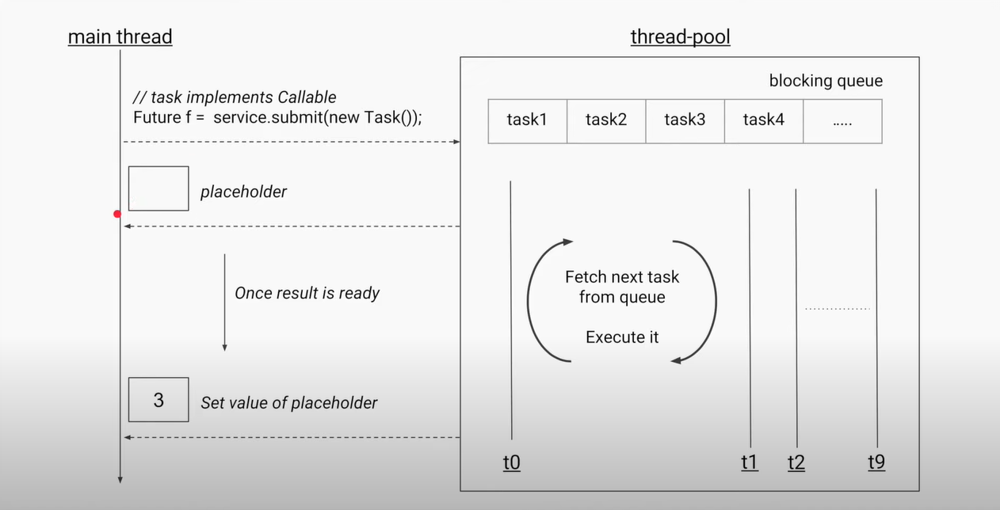

- To create a thread you need to create a class( can be anonymous ), inherit the Thread class and overwrite it's run method.
- you need to start the thread explicitly after initializing it. You cannot start the same thread more than once, you need to initialize another thread with same class if you want to run again.
    ```java
        Thread t = new Thread() {
            public void run(){
                System.out.println("Hello from the anonymous class");
            }
        };
    ```

# Threads
- Threads in java are Operating System threads/Native Threads/Kernel Threads.
- Each thread has thread stack, program counter, stack frames.
- Using too many threads decreases performance by context switching and flushing caches repeatedly for each context switch. Data Locality Issue
- There is also a scheduling overhead.
- Lot of IO Operations also result in a lot of blocking operations.
- These 2 problems


# Synchronous/Asynchronous Java API
- Using Completable futures
- Using callbacks and not wait.

# Java Memory Model


## Happens Before Guarantee

## Visibility Guarantee

# Volatile 


# Thread Local


# Executor Service

- For CPU intensive task, ideal pool size is CPU Core count.
- For IO Intensive task, you can have higher number of threadsm, based on number of IO Operations, and average wait time of thread.
- Too many threads slow down the system due to context switching and also consume a lot of memory

## Types of Pool
- All types uses ThreadPoolExecutor class and pass custom parameters to it.
    ```java
        ThreadPoolExecutor(int corePoolSize,
                       int maximumPoolSize,
                       long keepAliveTime,
                       TimeUnit unit,
                       BlockingQueue<Runnable> workQueue,
                       ThreadFactory threadFactory,
                       RejectedExecutionHandler handler)
    ```
- If your threadPool is at maxCapacity and the queue is also fixedSize task, then the executor service will reject the task, and will take action according to policy defined by  RejectedExecutionHandler.
  - AbortPolicy -> Throws Exceptin
  - DiscardPolicy -> Silently Discard
  - DiscardOldestPolicy -> Discard Oldest Task
  - Caller Runs Policy ->Tells the caller/main thread to execute the task.
    - This slow downs the main thread too.

### FixedThreadPool
- Internally uses LinkedBlockingQueue to keep track of all submitted tasks.
- It uses LinkedBlockingQueue and not ArrayBlockingQueue since the number of tasks are not fixed and can be a large value, linkedlist can add and remove at constant time, unlike array which needs has O(n) in worst case sceanrio.
- Remember thread size is fixed, not the task's size.
- will recreate the thread if thread exits due to exception

### CachedThreadPool
- Internally uses synchronous queue to hold only 1 task. Since number of threads are unbounded and can be till INT_MAX, no need to store the task, just create a new thread if no thread is available.
- If all threads are busy the service creates a new thread.
- if thread is idle for more than 60 seconds then it kills the thread



### ScheduledThreadPool
- Uses DelayedWorkQueue. return the task based on wheather the time has passed or not.
- You can schedule a task to run, create tasks at every fixedTimeInterval, or create task at fixedDelay between previous task.


```java
     ScheduledExecutorService service = Executors.newScheduledThreadPool(10);

        service.schedule(()->{
            System.out.println("This is scheduled");
        },2,TimeUnit.SECONDS);

        service.scheduleAtFixedRate(()->{
            System.out.println("This is fixed interval scheduled");
        },1,3,TimeUnit.SECONDS);

        service.scheduleWithFixedDelay(()->{
            System.out.println("This is fixed delay");
        }, 2,2,TimeUnit.SECONDS);
```

### SingleThreadedExecutor
- fixedThreadPool with 1 thread
- uses LinkedBlockingQueue
- will recreate the thread if thread exits due to exception

### CustomThread
- You can create custom executor using ThreadPoolExecutor
- You can use any blocking queue you want even arrayblockingqueue for fixedsize task, if a task is added after the queue is full, a new thread is created.
    ```java
    ExecutorService service = new ThreadPoolExecutor(10,10,1, TimeUnit.MINUTES, new ArrayBlockingQueue<Runnable>(10),new ThreadPoolExecutor.CallerRunsPolicy());
    ```

## Lifecycle Methods

### Shutdown
- It will just initiate the shutdown, not immediately shutdown, Any new task that is submitted to the service after shutdown are not accepted and will invoke rejectHandler, (Can discard or can abort or caller run), It will complete all the tasks present in queue and thread.
- ```service.isShutdown()``` will return true if shutdown is initiated.
- ```service.isTerminated``` will return true if service has completely shutdown.

### Await Termination
- Tells the main thread to block execution of main thread till all the task submitted are completed or it a certain timeout is exceeded which ever is lower.
  
### shutdownNow()
- Will let the threads currently running, but won't initiate/start any tasks in the queue. It will return all the task in queue in the form of list of runnables.
```List<Runnables> runnables = service.shutDownNow();```

# Callable
## Callable vs Runnable
- If you want to return a value from the thread, you cannot do that if you implement Runnable since it has ```void run()``` method which returns void.
- For this case we have Callable Interface
```java
    class Task implements Callable<Integer>{
        @Override
        public Integer call() throws Exception {
            return new Random().nextInt();
        }
    }
```
- Callable returns a Future

## Future
- Future holds the return value of a callable, it is a holder which will have the return value once the task is completed.
- Calling ```future.get()```  will return the return value of the task if the task is completed, or wait till the task return the value.
     
- ```future.get()``` is a blocking method and will block the caller thread till future is done.

- You need to be careful when processing multiple future in a list, since doing f.get() on first item/placeholder, the main thread will go into block state, even if we have futures which are completed in the list. You can use ```future.isDone()``` to check if an item is completed then try to get it. Another way to deal with it is use timeout in get method. ```future,get(1,TIMEUNIT.MINUTES) // throws TimeoutExeception```.

### Cancel Method
- It can cancel the task, if you call this method on the future, there is a catch though, if the cancel is called on a task which is in queue and is not processed by some thread then that task will be cancelled as expected, but a task that is being processed won't be cancelled. In that case you can use mayInterruptIfRunning flag to attempt to interrupt the thread ```future.cancel(true) //mayInterruptIfRunning : true```. Look at Interrupt in thread.

### Execution Exception

