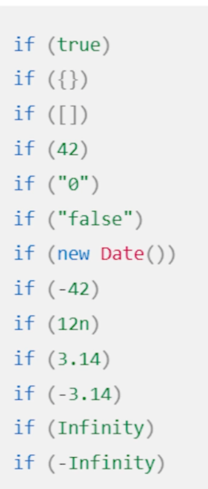

# Wierd Parts
- || and && doens't return true / false but the truish and falshish values
```js
0 || 'default' //Returns 'default'
'manish' && 'default' // Returns 'manish'
```
- Following is truthy values. 
- '', 0,false, undefined and null are falsy
- ?? operator only makes sure that null and undefined are the falsy values. Not even false.
- Function Declarations are hoisted (i.e can be used anywhere in code). Global. Function expression are only accessible after they are encountered in the code.(Local)
- Function expressions can be anonymous. Can be arguments to other functions without given them a name.
- 23 == '23' but 23 !== '23'. i.e 23 === '23' is false
- There is difference between expression and statement in javascript. https://www.joshwcomeau.com/javascript/statements-vs-expressions/

## Arrow function
```js
param => expression

(param) => expression

(param1, paramN) => expression

param => {
  statements
}

(param1, paramN) => {
  statements
}
```