# Tips

- To get faster run-time (in case of lots of i/o bound input) add ios_base::sync_with_stdio(false); cin.tie(null). [Read](https://stackoverflow.com/questions/31162367/significance-of-ios-basesync-with-stdiofalse-cin-tienull) on when to use;


- To get an idea of overflow solve - [link](https://leetcode.com/problems/reverse-integer/)

- c++ vector changes its address on reallocation so don't rely your algo on vector's pointer or iterator.

- #### If you want to implement a hashmap you can solve collision cases by using a tree for each node, in that case your get will be O(log(n)) in worst case instead of O(n) if you use linked list.

- greedy is a solution, where you never go back to improve and keep focussing on whatever is the present viable solution for each iteration.

- check overflow
  ```c++
  
  bool check_overflow_add(int x, int y) {
	//Case x is +ve y +ve
	if (x > 0 && y > 0){
		if (x > INT_MAX - y) return true;
	}
	else if (x < 0 && y < 0){
			if (x < INT_MIN - y) return true;
	}
	return false;
    }	


  bool check_overflow_multiply(int x, int y) {
      if (x < 0) x = -1 * x;
      if (y < 0) y = -1 * y;
      if(x == 0 ) return false;
      if (y > INT_MAX / x) return true;
      return false;
  }

  ```

- Questions like find the third max number (in 1,2,2,3) max is 3.
  - Use a set(bst) in c++ cause it is sorted and takes care of duplicates. [link](https://leetcode.com/problems/third-maximum-number/)]
    - ### It is important to note that, doing set.begin() returns the smallest item in the set and set.rbegin() returns the largest. This nature of sorted iterator traversal and fetch can be very useful when dealing with sorted and distinct numbers.
  - If duplicates are allowed use a priority queue. [link](https://leetcode.com/problems/kth-largest-element-in-an-array/) or refer to quick select below.

- Sometimes bruteforce is the best solution - [link](https://leetcode.com/problems/can-place-flowers/)

- max of 3 numbers is max(max(a,b),c);

- Sieve of Eratosthenes (To find all the prime numbers less than n). 
  - The definition of a prime number is a positive integer that has exactly two positive divisors. 
  - One is not prime, neither is zero
  - 2 is the smallest prime
  - In this method, you first set the prime value ofall numbers to be true.
  - If the current variable is marked not prime we skip the variable
  -  Then, for a variable i starting from 2 to the square root of limit(the number given), you set the value of prime of all the multiples of i to be false.
  -  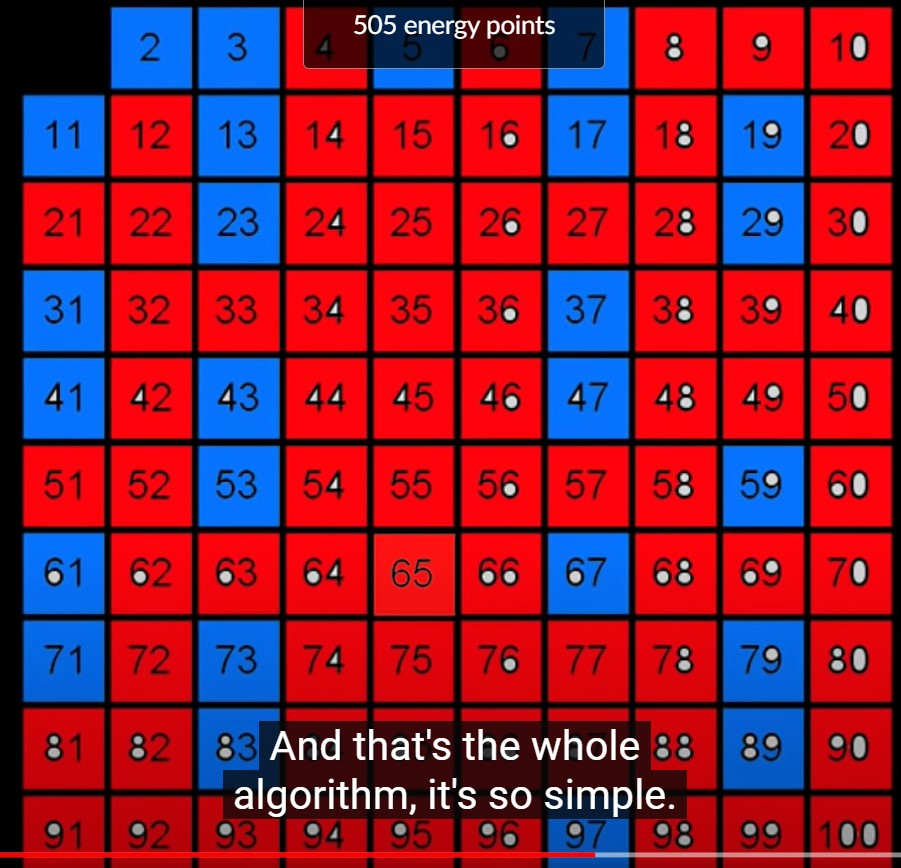
  -  See this video for details [Link](https://www.khanacademy.org/computing/computer-science/cryptography/comp-number-theory/v/sieve-of-eratosthenes-prime-adventure-part-4)

  - There are 2 optimizations here, 
    - you only need to traverse from i==2 to sqrt(n), because multiple of numbers more than sqrt(n) are more than n;
    - You can start from ```j == i*i``` because the multiples of i before i*i have already been marked by loops(```i==2 to i==i-1```).
  
    ```c++
    int countPrimes(int n) {
        if(n ==0) return 0;
        if(n == 1) return 0;
        if (n == 2) return 0;
        if (n == 3) return 1;
        vector<int> v(n+1,0);
        v[0] = 1;
        v[1] = 1;
        for(int i=2;i<sqrt(n);i++){
            for(int j=i*i;j<=n;j=i+j)
                v[j] = 1;
        }
        int count =0;
        for(int i=0;i<n;i++){
            if(v[i] == 0) count++;
        }
        return count;
        
    }
    ```

  - Now, all the numbers left whose prime value is true are prme numbers and can be displayed.


- Time complexity for a sqrt function is log(n);
  ```
  1) Start with ‘start’ = 0, end = ‘x’,
  2) Do following while ‘start’ is smaller than or equal to ‘end’.
      a) Compute ‘mid’ as (start + end)/2
      b) compare mid*mid with x.
      c) If x is equal to mid*mid, return mid.
      d) If x is greater, do binary search between mid+1 and end. In this case, we also update ans (Note that
       we need floor).
      e) If x is smaller, do binary search between start and mid
    Note: The Binary Search can be further optimized to start with ‘start’ = 0 and ‘end’ = x/2. 
    Floor of square root of x cannot be more than x/2 when x > 1.
  ```

- c++ strings are mutable.

- vector's iterator are bidirectional
- list's iterator can't move in it+2 or it-2, can only do it++,it--. You can use advance(it,4).
- unordered_map's iterator can't can't move in it+2 or it-2, can only do it++,it--. You can use advance(it,4).
- pair is very useful when you want a container for 2 data types without writing an additional class for it.
  - First element is stored as "first"
  - second as "second"
  - You can create one as {first_int, second_int} too;
- You can insert into a unordered_map<int,pair<int,int>> as
  ```c++
  umap[key] = {val1,val2};
  ```
- it is helpful to use _ before name for member variables.
- Use typedef for long names.

- Use vector instead of map in dealing with characters.
- Use vector instead of stack wherever possible.
  - vector.push_back (s.push())
  - vector.pop_back (s.pop())
  - vector.back() (s.top())
  - This trick is useful when dealing with string and you need to process them later. [Example](https://leetcode.com/problems/remove-k-digits/)

- ### Common mistake (If there are multiple conditions you want to satisfy, don't make below mistake)
  ```
  if(s!=1 || s!=2|| s!=3){
    
  }
  ```
  - The above condition is meaningless because say, s==1, then first condition fails but second condition passes, so the if is executed.
  - Use && in between remember

- ### IMPORTANT -> While sorting objects in c++
  - Remember to use the following constraint/requirement. The  compare requirement requires that If comp(a,b)==true then comp(b,a)==false. But if you write you  it returns true if b==a thus comp(b,a) == comp(a,b) which does not fulfil the requirement. 
    #### NOT CORRECT WAY
    ```c++
      //NOT CORRECT WAY
      if (da.x() > db.x())
          return false;
      else
        return true;
    ```

    #### CORRECT WAY
    ```c++
      //CORRECT WAY
      return da.x()<db.x();
    ```
    - Refer https://stackoverflow.com/questions/2627166/difference-between-const-reference-and-normal-parameter
    - https://en.cppreference.com/w/cpp/named_req/Compare


## Tokenizing a string in c++
###  Using stringstream
- remember ```getline(stringstream, token_to_store, character_to_delimit)```.
- Don't use string instead of character above.
  ```c++
    string s = "Hello how are you";
    stringstream ss(s);
    string token;
    while(getline(ss,token,' ')){
      cout<<token<<endl;
    }
    /*Prints->
      Hello
      how
      are
      you
    */
  ```
## Operator Precedence in c++
- ### Bit operator precedence is less than equality operator.
  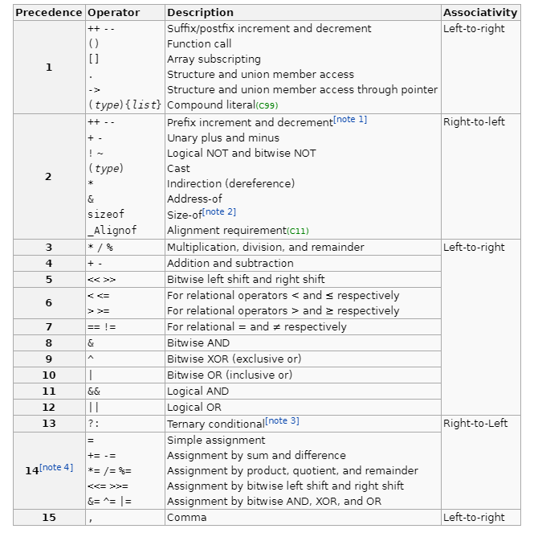


## Traverse While Deleting

### Vector/ String
- Use erase-remove idiom (Optimized)
  - Motivation behind this idiom is in vector/ string calling erase multiple times on the same container generates lots of overhead from moving the elements.
  - So a solution is to use remove/remove_if which do not remove elements from the container, but move all elements that don't fit the removal criteria to the back of the range, keeping the relative order of the elements. This is done in a single pass through the data range.  remove returns an iterator pointing to the first of these tail elements so that they can be deleted using a single call to erase.
  - Doing the same using only erase results in as many passes as there are elements to remove. For each of these passes, all elements after the erased element have to be moved, which is more time-consuming than shifting elements in a single pass.
  - Can't be used for set
  ```c++
  v.erase(std::remove_if(v.begin(), v.end(), IsOdd), v.end());
  ```
- Remove might expect the class to override the equality operator. Notice the equality operator returns an integer. You don't have this issue in case of remove_if. 
  ```c++
  class SampleClass {
      public:
          int x;
          int y;
          SampleClass(int samplex, int sampley) {
              x = samplex;
              y = sampley;
          }
          int operator==(SampleClass example) {
              if (example.x == x && example.y == y) return true;
              return false;
          }
  };
  ```
- Using just erase (Not optimized)
  ```c++

  while(it!=v.end()){
    if(toDelete(it)){
      it = v.erase(it);
    }
    else{
      it++;
    }
  }
  ```
### Set/List
- Using just erase (Not optimized)
  ```c++
  while(it!=s.end()){
    if(toDelete(it)){
      it = s.erase(it);
    }
    else{
      it++;
    }
  }

# Generate Random Number
- Seed first using srand
```c++
#include <stdio.h>
#include <stdlib.h>
#include <time.h>

int main ()
{
  srand ( time(NULL) );
  printf ("Random Number: %d\n", rand() %100);
  return 0;
}
```
- Rand returns an int, from 0 to RAND_MAX.
- To get random float ```(float)rand()/(float)RAND_MAX```

# Dynamic Programming
## Unique Path - 2
  - You can just create an additional row and column to deal with boundary case and that will simplify the implementation a lot.

## Look at the Boolean Parenthesis problem.
  - Similar Problems
  - Valid Parenthesis String
  - Matrix Multiplication
  - Burst Balloons 


## Essence of Knapsacks 
  - https://leetcode.com/problems/ones-and-zeroes/

### Space can be heavily optimized in case in dp solution the present state only depends on the previous state. You only have 2 arrays  and toggle between them using flag = flag^1. Sometimes you can just do it in one array, just overwrite the previous value using the  current value. Doing this however you loose the chance to backtrack to get the steps that produce the optimum solution.
  - https://www.youtube.com/watch?v=UFMOzkUFEW4
  - https://leetcode.com/problems/uncrossed-lines/


## Coin Change 2 vs Combination Sum IV - Loop Ordering Dilemma
  - Coin Change 2 -> Combinations
  - Combination Sum IV -> Permutations

  ### Coin Change 2
  ```c++
      int change(int amount, vector<int>& coins) {
        vector<int> dp(amount+1, 0);
        dp[0] = 1;
        for(int i=0;i<coins.size();i++){
            for(int j=1;j<=amount;j++){
                if(j>=coins[i]){
                    dp[j]+=dp[j-coins[i]];
                }
            }
          }
          return dp[amount];
      }
  ```


  ### Combination Sum IV
  ```c++
      int combinationSum4(vector<int>& nums, int target) {
        vector<int> dp(target+1,0);
        dp[0] = 1;
        //order of loop different from the coin change 2.
        //outer loop is over the target
        for(int i=1;i<=target;i++){
          //inner loop.
            for(int j=0;j<nums.size();j++){
                if(i>=nums[j]){
                    dp[i]+=dp[i-nums[j]];                   
                }
            }
          }
          return dp[target];
      }
  ```
  ### Loop Ordering matters?
  Well, the real reason why the answer changes because of loops is because of the change in dp definition when you try to reduce the space complexity.If we define dp[i][j] as "number of ways to get sum 'j' using 'first i' coins", then the answer doesn't change because of loop arrangement.


  So why does the answer change only when we try to reduce the space complexity?

  To get the correct answer, the correct dp definition should be dp[i][j]="number of ways to get sum 'j' using 'first i' coins". Now when we try to traverse the 2-d array row-wise by keeping only previous row array(to reduce space complexity), we preserve the above dp definition as dp[j]="number of ways to get sum 'j' using 'previous /first i coins' " but when we try to traverse the 2-d array column-wise by keeping only the previous column, the meaning of dp array changes to dp[j]=**"number of ways to get sum 'j' using 'all' coins", Which is what we for the Combination Question. 

  #### For Coin Change
  dp[j]="number of ways to get sum 'j' using first i coins"
  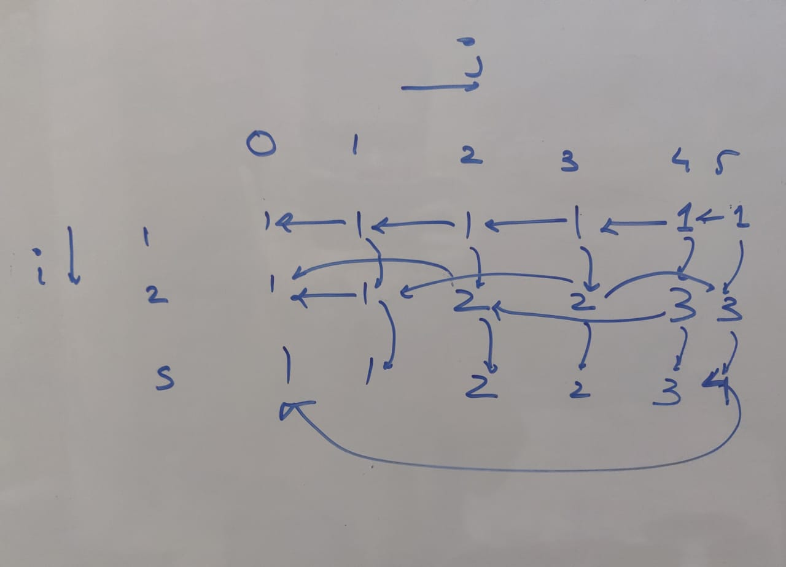
  
  #### For Combination Sum IV 
  dp[j]=**"number of ways to get sum 'j' using 'all' coins"
  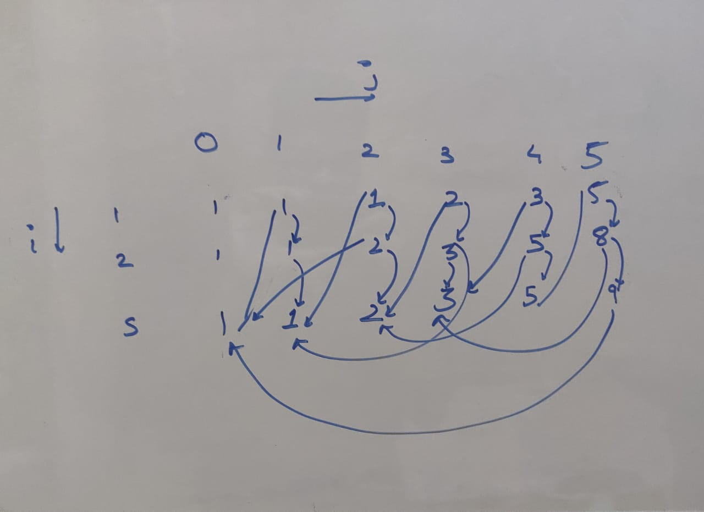

  #### Why does the above solution produce unique permutations.
  - First Assumption -> Say you are calculating for ith target value, and assume all answers/groups for target<i comprise of unique permutation of elements.
  - At each iteration we take a number for the given list of nums and add that to group denoted by dp[i-nums[j]] at the end. Since according to first assumption we have all unique elements in the i-nums[j] group, even the new group after adding the number (nums[j]) to dp[i-nums[j]] group will be unique.
  - Since nums[0], nums[1], nums[2] are different, so adding these numbers to the end of each group and combining all groups also produces a unique element group.

  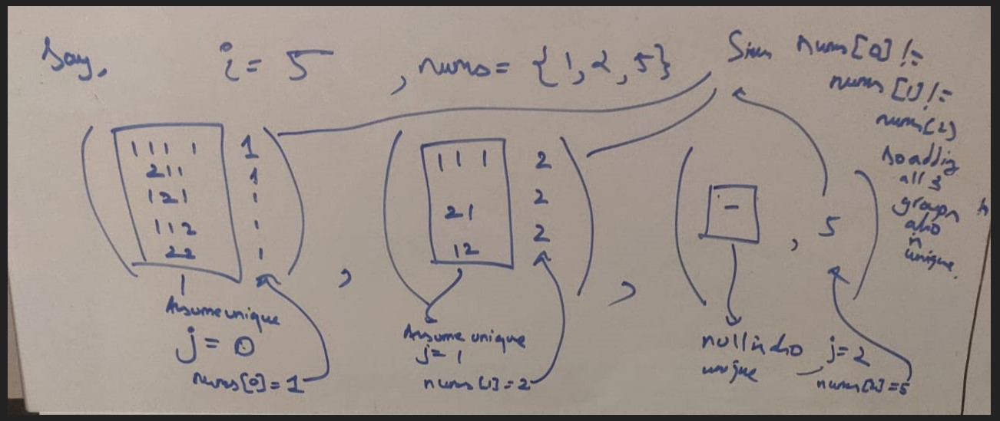

  
### Bottom up is not intuitive in this question. You need to implement Top down then go for bottom up. Since Top down gives TLE
```c++
class Solution {

    int helper(int target, vector<int> &nums, vector<int> &dp){
        
        if(target < 0) return 0;

        if(dp[target]!=-1){
            return dp[target];
        }
        
        int ans=0;
        for(int i=0;i<nums.size();i++){
            ans+=helper(target-nums[i], nums, dp);
        }
        
        return ans;
    }
    
public:
    int combinationSum4(vector<int>& nums, int target) {
        vector<int> dp(target+1,-1);
        dp[0] = 1;
        return helper(target, nums, dp);
    }
};
```

### Bottom up coin change (Non memoised)
```c++
class Solution {
    
    int helper(vector<int>&coins, int amount, int idx){
        if(amount == 0) return 1;
        int ans = 0;
        for(int i=idx;i<coins.size();i++)
        {
            if(amount-coins[i]>=0){
                ans+=helper(coins,amount-coins[i],i);
            }
        }
        return ans;
    }
public:
    int change(int amount, vector<int>& coins) {
        return helper(coins, amount, 0);
    }
};
```

- ## If you notice the difference is in for loop, in case of permutation you try out all the possibilities in each recursion, but in combinations you start from idx, and don't try out previously used values. ```int i=idx;i<coins.size();i++``` vs ```int i=0;i<nums.size();i++```

## For Questions involving counts
- Combination Sum IV 
- Knight Dialer 
- Dice Roll Simulation 
- Minimum swaps to make sequence increasing.

We can usually solve these problems easily using top-down approach. By recursive memoization.
Think simple working recursive solution, which satisfies all constraints of the problem. The recurse function will return the count of ways in a particular case and you need to combine all possible combinations and return the answer.
 To memoize, think of what defines the state of each recursive call and use it to make the dp table.m

  - https://leetcode.com/problems/minimum-swaps-to-make-sequences-increasing/
    - https://leetcode.com/problems/minimum-swaps-to-make-sequences-increasing/discuss/192341/Super-Intuitive-solution(recursive-%2B-memoization)
  - Pretty simple if you do bottom up approach.
  - This question was in the not apparent problem list.


## Not apparent problems

    


# STL

## Strings

#### Important Functions

- stoi -> Convert a string to integer
- stol -> Converts a string to long
- stoll -> Converts a string to long long
- atoi -> Convert a character to integer
- stod -> Converts a string to double
- stold -> Converts a string to long double
- to_string() -> Converts a datatype to string.

#### Conversions
- Character Array to String
  ```c++
  //notice the zero at the end.
  char c[] = { 'a', 'v','d','e','f',0 };

  //either can be used
  string s = c;
  string d(c);
  ```
- String to ```const char*```
  ```c++
  string s="dsgsg";
  const char* cc = s.c_str();
  ```
- String to Character array
  ```c++
    string s="dsgsg";
    //one more for null terminated character.
    char c[6];
    strcpy_s(c, s.c_str());
  ```


#### Iterators (Random Access Iterators)
- Iterator to the beginning ```s.begin()```
- Iterator to the past-the-end  ```s.end()```
- Iterator to the i index ```s.begin()+i```
- ### **You can perform addition in these iterators like it+3 because it is random access iterator** 

#### Get 
- Value from the index - O(1) ```s[1];```
- Iterator from index - O(1) ```s.begin()+i``` 
- Value from iterator ```(*it)```
- Size ```s.size()```'
- ### **Get iterator of a character in string ```std::find(s.begin(), s.end(), 'x')``` Remember it is a char not string.**

- ### String.find -> you can also use  string.find method to find by indices rather than iterators
  ```
  s.find(string_to_find, index_to_find_from);
  s.find(char_to_find, index_to_find_from);
  ```
- ### Substring (Important)
  - ### ```s.substr(firstIndex,length)``` returns substring for [pos, pos+len).
  - ### ```s.substr(index)``` returns substring for pos to end.

#### Add

Single element

- In middle using the iterator(before which to insert) ```s.insert(it,val)```
- There is no push front.

Multiple element
- ```c++
  string x = "Manish";
  string y = "sdf"
  x.insert( x.begin() + 2, y.begin(), y.end());
  ```

- Add at the end or beginning.
- Use + operator ```s+x```

#### Erase

- To clear all the elements ```s.clear()```
- To erase an element using iterator ```s.erase(it)```
- To erase a range of elements using iterator ```s.erase(it_first, it_last)```
-  ## Very Important erase-remove idiom.
-  Look at vector explaination.

#### Modify
 Single Element

- ```s[index] = character_element```
- **Using iterator ```(*it) = val;```**


## Iterators

- Iterators are used to step through the elements of collections of objects. Offer a common interface for all the container types.
- Just like template make algorithm independent of datatype, iterator make algorithm independent of container type.
- Iterator actually denote a certain position in a container.

### Common Operations in iterator
- ``*Iterator`` -> Returns element of current position.
- ``Iterator++`` -> Returns next iterator
- ``Iterator1 == Iterator2`` or ``Iterator1 != Iterator2`` -> If 2 iterators points to same location.
- ``Iterator =`` -> assigns an iterator to the position of element it refers to.

### Iterator vs Pointer
- Iterator are not same as pointer, they can be thought of a special pointer which is designed for a specific container and can iterate efficiently for that container. Their internal behaviour is defined by the container over which they iterate. In fact each container defines its iterator type as a nested class. 

### The logic behind the half open range of iterator i.e [begin(),end())
- We have a simple end criterion for loops that iterate over the elements: They simply march through until they meet end().
- It avoids special case handling for empty ranges, where begin() == end().

### Types of Iterators (Important)

#### Input iterator
- The term input is used from the viewpoint of a program. Information going from the container to the program is considered input
- An input iterator is one that a program can use to read values from a container.
-  It does not allow us to alter the value. So algorithms that require an input iterator are algorithms that don't modify values of the container elements.


#### Output iterator
- They are just like input iterator but not for accessing elements, but for being assigned elements.
- Single-pass and write-only iterator.

#### Forward Iterators
- They are higher in hierarachy than input and output iterators, and contain all the features present in these two iterators.
- They also can only move in forward direction and that too one step at a time.
- Unlike input and output iterators, however, it necessarily goes through a sequence of values in the same order each time we use it

#### Bidirectional Iterator
- they can move in both the directions, that is why their name is bidirectional.

#### Random Access Iterator
 - They are the most powerful iterators. They are not limited to moving sequentially, as their name suggests, they can randomly access any element inside the container. They are the ones whose functionality is same as pointers.

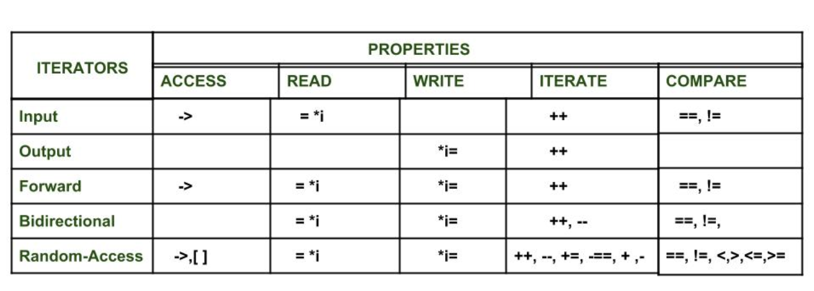

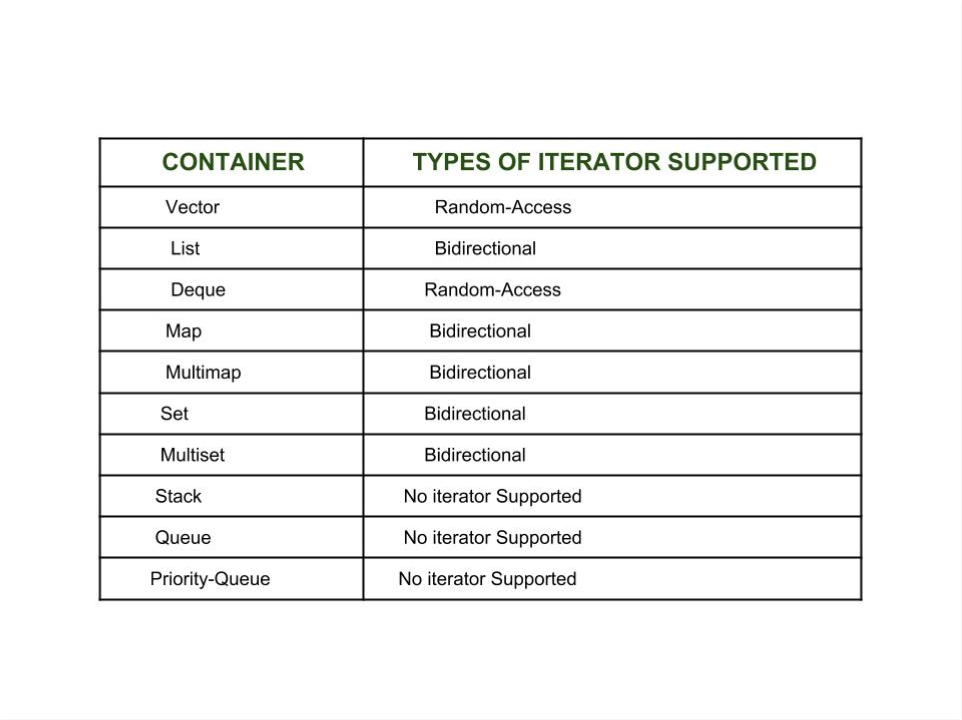


### Functions on iterators
- ``dist(Iterator1, Iterator2)``
- ``advance(Iterator1, count)``
- **``prev(Iterator, count=1) ``Used in prev(container.end())**
- ``next(Iterator, count=1)``


### Misc
- Sort and binary search algorithm requires a random access so it can swap 2 non adjacent elements. So linkedlist iterator cannot be used. (That's why linked list provides a sort method in itslef)
- Find needs a ++ operator, it doesnot need a write access but needs a read access.
- You cannot do advance(container.begin(),12);
- You need to first assign container.begin() to a iterator and then use that iterator to advance.

- Compare iterator with a null, it is not straight forward. You need to do ``it != container.end()``


## Tuple
  A tuple is an object that can hold a number of elements. The elements can be of different data types. The elements of tuples are initialized as arguments in order in which they will be accessed.
  ```c++
    tuple <int,char,float> tup1(20,'g',17.5); 
    tie(i_val,ch_val,f_val) = tup1; 
    cout << i_val << " " << ch_val << " " << f_val; 
  ```
  ### Use tuple instead of creating structs
  **Can also use ```make_tuple()``` is used to assign tuple with values.**

  ### tie can also be used to unpack pair<X,Y>;

  ### You can use ```get<n>(tuple_obj)``` to get the nth object in tuple.

## Priority Queue
  - Need to ```#include<queue>```
  - ## In C++ if the element is in the form of pairs/ tuple, then by default the priority of the elements is dependent upon the first element. Very useful to know.


## Containers

### Vector

#### Conversion
- Array to vector (Useful in some sites.)
  ```c++
  int a[] = { 1,2,3,4,5,6,7,7,10 };
  int n = sizeof(a) / sizeof(int);
  vector<int> v(a,a+n);
  ```
- Vector to an array.
  ```c++
  vector<int> v(10, 1);
  int a[10];
  copy(v.begin(), v.end(), a);
  ```

#### Iterators (Random Access Iterators)
- Iterator to the beginning ```v.begin()```
- Iterator to the past-the-end  ```v.end()```
- Iterator to the i index ```v.begin()+i```
- ### **You can perform addition in these iterators like it+3 because it is random access iterator** 


#### Get 
- Value from the index - O(1) ```v[1];```
- Iterator from index - O(1) ```v.begin()+i``` 
- Value from iterator ```(*it)```
- Size ```v.size()```'
- **Get item with a specific value** ```std::find(vec.begin(), vec.end(), item)```

#### Add

Single element

- ```v.push_back()```
- In middle using the iterator(before which to insert) ```v.insert(it,val)```
- There is no push front.

Multiple element
- ```c++
  int myarray [] = { 501,502,503 };
  myvector.insert (myvector.begin(), myarray, myarray+3);
  ```
  
#### Erase

- To clear all the elements ```v.clear()```
- To erase an element using iterator ```v.erase(it)```
- To erase a range of elements using iterator ```v.erase(it_first, it_last)```
- Remove from the end ```pop_back()```
- There is no pop front.
-  ## Very Important erase-remove idiom.
-  To erase multiple elements from an vector with a certain value, it is not recommended to use for loop and erase each element. Since this is a n^2 solution.
-  Instead we should use erase with stl's remove to get O(n) solution.
-   The way it works is first we call remove on the entire array. Remove doesn't erase the elements from array, it simply shifts the elements with the value to the end of the vector and returns the iterator to the tail of the remaining vector(non inclusive).
-   You can then call erase on the remaining part and erase by range.
-  ### ```v.erase(std::remove(v.begin(),v.end(),7), v.end())``` to erase all occurances of 7 from the vector. **This is called erase-remove idiom of c++**. It is also applicable for strings.

#### Modify
 Single Element

- ```v[index] = val```
- **Using iterator ```(*it) = val;```**

Multiple elements
- ```c++
  std::vector<int> first;
  first.assign (7,100); / 7 ints with a value of 100
  ```

#### Initialize

- Fill with a value ```vector<int> v(size,val)```
- Remember the order of size and val, since that is a source of lot of bugs.

### Unordered Map

## **IMP -> YOU CANNOT CREATE A MAP OF A MAP (Map as key) (Group Anagrams) by ```unordered_map<unordered_map<string,int>,int> umap();```** -> You can get around by using a string representation of the map. Also holds for unordered_set

## **IMP -> YOU CANNOT CREATE A MAP OF A Pair of T (pair<T,T> as key) by ```unordered_map<pair<int,int>,int> umap();```** -> You can get around by using a string representation of the pair. Also holds for unordered_set

## UMAP CAN TAKE POINTER AS KEY AND VALUE.

#### Iterator (Useful for looping through elements)

- **Notice that an unordered_map object makes no guarantees on which specific element is considered its first element.This is unlike map/set where iterator is ordered by default as the smallest.** 
- Iterator to the beginning ```v.begin()```
- Iterator to the past-the-end  ```v.end()```

#### Get

- Value from key - O(1) ```v[key]```
- Iterator from key - O(1) ```v.find(key)``` -> **Returns an iterator.**
- Value from iterator ```it->second``` or ```(*it).second``` since map contains Pair objects.
- Key from iterator ```it->first```  or ```(*it).first```

#### Add
- Add using umap[key] = value.
- ```umap.insert(make_pair(1,1))``` or ```umap.insert({1,1})```
- ## IMP DON'T DO ```umap.insert(1,1)``` (Since insert takes a pair as an input).

#### Erase
- To clear all the elements ```v.clear()```
- **To erase by key ```mymap.erase ("France");```**
- To erase an element using iterator  ```mymap.erase ( mymap.begin() );```
- To erase a range of elements using iterator ```mymap.erase ( mymap.find("China"), mymap.end() );```

#### Modify
- ```umap[key] = value```
- Using iterator ```it->second = value```


### List (Doubly linked list)

#### Iterator (Bidirectional Iterators)
- get the iterator to the head ```l.begin()```
- get the iterator to the back ```l.end()```
- ### **You cannot perform addition in these iterators like it+3 only it++ or it-- because it is bidirectional iterator.**

#### Get
- get the front element ```l.front()```
- get the back element ```l.back()```
- (*it)
- ### To get value at an index - Important
  ```c++
  auto it = l.begin();
  advance(it,index);
  (*it)
  ```
- ### **To find if an element exist's in a list ```std::find(listOfElements.begin(), listOfElements.end(), element);```**


#### Add
- To add at the front ```l.push_front(val)```
- To add at the back ```l.push_back(val)```
- ### To add in the middle ```l.insert(it,val)```

#### Erase
- To clear all the elements ```l.clear()```
- **To erase an element using iterator ```l.erase(it)```**
- To erase a range of elements using iterator ```l.erase(it_first, it_last)```
- To remove the last element ```l.pop_back()```
- To remove the first element ```l.pop_front()```
- **Removes from the container all the elements that compare equal to val. ```l.remove(val)```**
- ### The remove is O(N) but erase is O(1) so be careful when to use what. 
- remove if a condition is met ```l.remove_if(condition)```


#### Modify

Multiple Elements
- ```c++
  std::list first;
  first.assign(10,100);
  ```

#### Useful Function
The reason these algo are the part of this class and not stl algorithm is because the iterator in list is a bidirectional iterator and stl algo like sort and reverse don't work in them.
- ### ```l1.merge(l2)```
- ### ```l.reverse()```  -> Important
- ### ```l.sort()```  -> Important
- ### ```l.unique()``` -> Important (Removes duplicates).
### Priority Queue
#### **By default min queue. If you want max queue.**
```c++
std::priority_queue<int, std::vector<int>, std::greater<int> > q2;
```
#### Get
- top of the queue -> pq.top()
- size of the queue -> pq.size()
#### Add
- pq.push()

#### Erase
- pq.pop()

### Stack

#### Get

#### Add

#### Erase

#### Modify

### Map

#### Get
- The power of set/ map is the fact that doing set.begin() will return the smallest number/ defined by comparator i.e iteration will be inorder.
- The order at which the iterator iterate is guaranteed. *begin() gives you the smallest and *rbegin() the largest element, as determined by the comparison operator, and two key values a and b for which the expression !compare(a,b) && !compare(b,a) is true are considered equal. The default comparison function is std::less<K>.

#### Add

#### Erase

#### Modify


## Queue (Use List rather than this.)

## Misc
- Difference b/w queue, list and deque
  - queue can only add at the back. and remove at front.
  - deque (Double ended queue) can add and remove at front and back.
  - list can add and remove anywhere.
  - A list has to allocate memory every single time something is added, and deallocate it when it goes away.
  - A deque, on the other hand, allocates in chunks. It will allocate less often than a list. Think of it as a list, but each memory chunk can hold multiple nodes. 
- forward_list is a singly linked list. where as list is a doubly linked list.
- 1 and 7 are the only happy numbers.

## Note on find
- For list, vector and string, find is static function from algo libraty.
- For unordered_map, map it is a member function.

# Primer on Arithmetic and Geometric Progressions
## Geometric Progression
- A geometric sequence is a sequence in which the ratio consecutive terms is constant.

- Sum of elements in a geometric progression
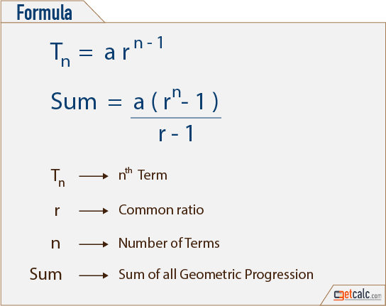
- Sum of infinite elements in geometric sequence if common ratio is less than 1 is 
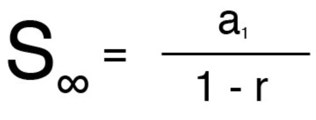
- Sum of infinite elements in a geometric sequence if common ratio is more than 1 is infinite.

## Arithmetic Progression
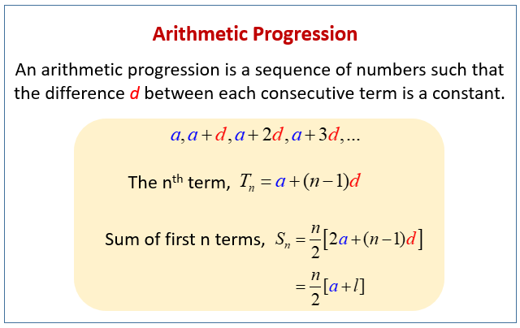

## Example
- $O(n) = O(n+n/2+n/4+...infinity))=O(2n)$. (Use infinite geomtric progression formulae).
- $O(n^2) =O(n+(n-1)+(n-2)+(n-3)+(n-4))$


# Primer on Permutation and Combinations
## PERMUTATION :
You have n items and want to find the number of ways k items can be ordered(Without Duplications):

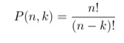

### Permutations with infinite repeatation.
The number of permutations of n different objects taken r at a time,
where repetition is allowed, is $n^r$

### Permutations with duplicates i.e Permutations when all the objects are not distinct objects 

Say, we have a list with duplicates [a,a,a,b,b,c], how many possible permutations of this list can we have.

Since a occurs 3 times,(we will have 3! duplicates which are essentially the same coming from a), and (2! duplicates coming from b) so we need to divide them from the total combinations if all were unique i.e (6!)

We get: 

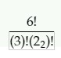

Formally,

The number of permutations of n objects, where $p_1$ objects are of one kind, $p_2$ objects are of second kind and ..... $p_k$ are of kth kind, and rest are of differnet kind but only occur once.

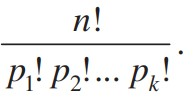


## COMBINATION : 
Find all the ways to pick k people from n :

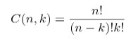

### Total number of subsets/combinations if all are unique is $2^n$

### Find total number of all possible unique subsets from a set with repeats.
- Imagine you have  a set {A, A, B, C}, how many possible combinations can you have of this set. You can have 9 combinations {{}, {A}, {B}, {A, B}, {A, A}, {B, B}, {A, B, B}, {A, A, B}, {A, A, B, B}}.

- The way to arrive at that 9 is consider their frequencies for A,B,C frequencies are 2,1,1.
- Now for A you have 3 possibilities for each selection {You can either not choose A, choose A only once, choose A twice}, similary for B{You can not choose B, choose B once}, and same for C.
- Thus total number of subsets = product of all the (frequencies + 1) giving (1+2)*(1+1)*(1+1) = 9.

### Combination is nothing but all subsets of a set.

## Code
- Permutations with duplicates : [Link](https://www.youtube.com/watch?v=nYFd7VHKyWQ)
- Solve coin change 2 and combination sum 4 top down/recursive.
- Combinations/ total subsets with repeats : [Link](https://www.youtube.com/watch?v=xTNFs5KRV_g)


## Important distinction between permutation and combinations in code.
in case of permutation you try out all the possibilities in each recursion, but in combinations you start from idx, and don't try out previously used values. ```int i=idx;i<coins.size();i++``` vs ```int i=0;i<nums.size();i++```.

In other words, in permutations we start from the left-most available options, but in combination we start from where we left last.

## References
- https://stackoverflow.com/questions/736494/how-do-you-calculate-the-total-number-of-all-possible-unique-subsets-from-a-set#:~:text=Merely%20count%20up%20the%20total,get%203*3%20%3D%209.

# Upper Bound, Lower Bound and Binary Search
  ## This article superseeds the below discussion [Link](https://leetcode.com/discuss/general-discussion/786126/python-powerful-ultimate-binary-search-template-solved-many-problems)

  #### For a simple binary search always use the below structure.
  ```c++
  int start = start_of_search_range;
  int end = end_of_search_range;
  while(start<=end){  //For normal binary search you need to use start<=end else it will be 
  //complicated.
    int mid = start + (end-start)/2; //To prevent overflow
    if(x==mid) return mid; 
    else if(x>mid) start = mid+1; //Answer is atleast bigger than mid;
    else end = mid -1;  //Answer is atleast smaller than mid;
  }
  return -1; //Can't find x
  ```

  #### To make sure we adhere to the template in the article
  ```c++
  int start = start_of_search_range;
  int end = end_of_search_range;
  while(start<end){
    int mid = start + (end-start)/2;
    if(condition()){
      end = mid;
    }
    else{
      start = mid+1;
    }
  }
  return start == mid ? start : -1;
  ```

  #### For Lower Bound (First element greater or equal to the given element).
  ```c++
  int start = start_of_search_range;
  int end = end_of_search_range + 1 //### Important cause we also need to take care of case 
  //where the required answer is more than last item in the array.
  while(start<end) // You can use start<= end but then you need to write condition
  // for the return value.
  {
    int mid = start + (end-start)/2;
    if(A[mid]>=target){
      end = mid;//If mid is equal or greater than target, then elements to right of mid are 
      //not the first since, mid is already greater or equal.  But mid can be the lower bound.
    }
    else{
      start=mid+1;//If target is greater than mid. The search space cannot include mid
      // and is higher than mid.
    }
  }
  return start; //Takes care of case where lower bound isn't even present in array/
  ```


  #### For upper Bound (First element greater than the given element)
  ```c++
  int start = start_of_search_range;
  int end = end_of_search_range + 1 //### Important cause we also need to take care of
  // case where the required answer is more than last item in the array.
  while(start<end) // You can use start<= end but then you need to 
  //write condition for the return value.
  {
    int mid = start + (end-start)/2;
    if(A[mid] > target){
      end = mid; //If mid is greater than x, then elements to right of mid are not 
      //the first since, mid is already greater than x. But mid can be the upper bound.
    }
    else{
      start = mid+1;//If x is greater than or equal to mid. The search space cannot include 
      //mid and is higher than mid. 
    }

  }
  return start; //Takes care of case where upper bound isn't even present in array

  ```

  ### Note: In both Upper and lower bounds, the high index is set to end_of_search_range+1 instead of end_of_search_range. These functions can return an index which is one beyond the bounds of the array. I.e., it will return the size of the array if the search key is not found and it is greater than all the array elements.

# Floyd's Tortoise and Hare (Cycle Detection)

- Used to detect a cycle in linked list.

## Theorem -> If you have a hare and tortoise both starting at first node in the linked list. hare moving at 2(node unit) times the speed of tortoise. They both eventually meet.

### Physical Proof

  For showing that they eventually must meet, consider the first step at which the tortoise enters the loop. If the hare is on that node, that is a meeting and we are done. If the hare is not on that node, note that on each subsequent step the distance the hare is ahead of the tortoise increases by one, which means that since they are on a loop the distance that the hare is BEHIND the tortoise decreases by one. Hence, at some point the distance the hare is behind the tortoise becomes zero and the meet.

### Mathematical Proof

  Let's assume T is the length of the tail part of the linked list, and C is the length of cycle.
  If we use division algorithm, T = Q*C + r (Q->Quotient and r is remainder). After T time units, the tortoise is at the start of the cycle and hare is at r (Since T=Q*C +r and the first QC didn't amount to anything and it made hare come back to start of loop, the remaining r is it's position). 
  
  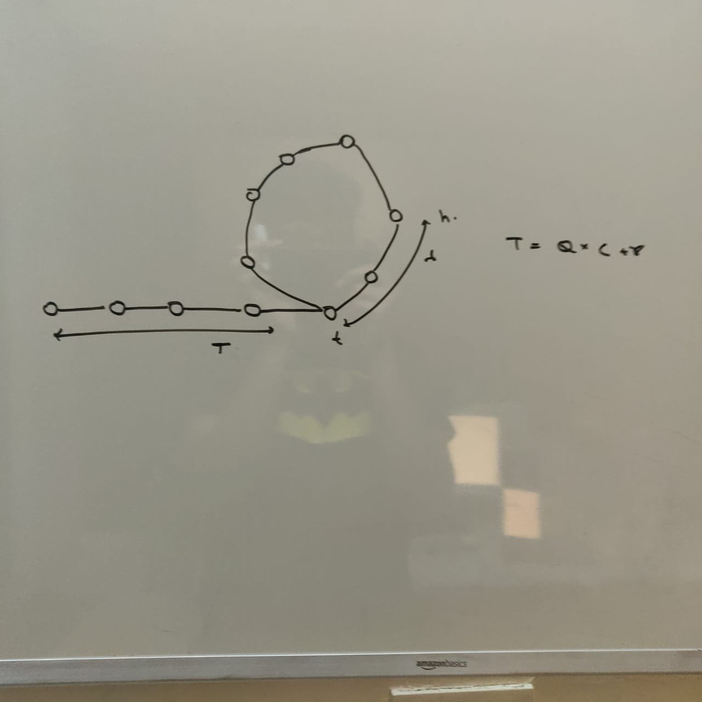
  
  
  Now at this position, you can infer hare is r ahead of the tortoise, but **since it is a loop, tortoise is C-r nodes ahead of hare, Now since the distance between hare and tortoise decrease by 1 in each time step, they will eventually meet**, after C-r time steps. In the mean while the tortoise would have travelled C-r steps. Thus they both meet at C-r'th node from the start of loop.  

  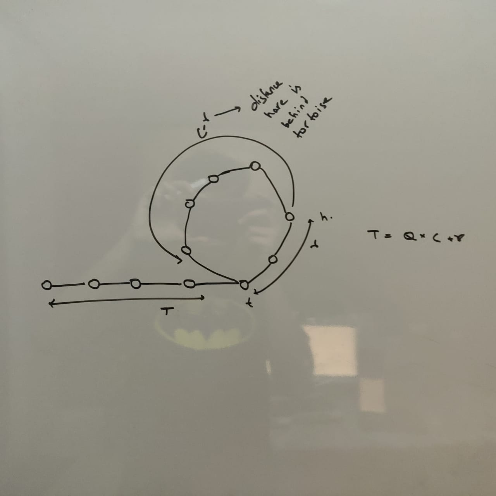

  


## Theorem -> If from the point they meet, another tortoise starts from the first node, the old and new tortoise meet at the start of the loop. 

### Mathematical Proof.

  Now, let's say we are at the time hare and tortoise meet, from that point the remaining distance to get the start of the loop would be r for the old tortoise.(It is at point C-r and advancing r steps brings it to the start of the loop). **So r is the distance required by the old tortoise to reach the start of the loop.**
  
  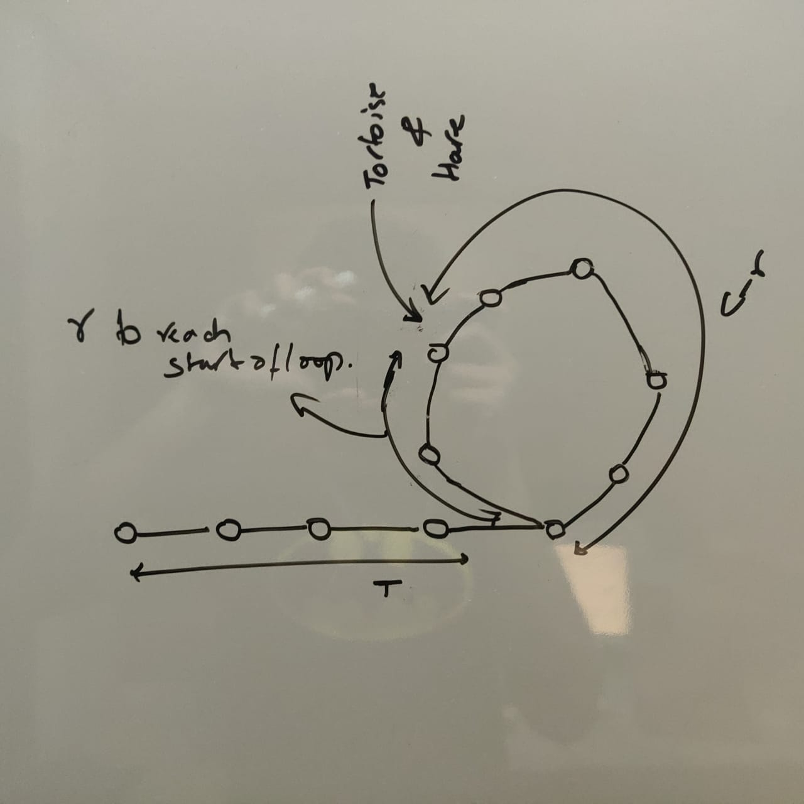
  
   Now let's say the new tortoise travelled T distance from start of linked list to start of loop. Now since both are tortoise, even the old tortoise must have travelled T distance. **T can also be represented as Q*C +r. But the Q*C part doesn't amount to anything as the old tortoise just reaches the same point it already is. So in essense the old tortoise travelled r distance along the cycle**, while the new tortoise travelled T distance to come to start of loop. But r is exactly the same amount of distance the old tortoise needed to reach the start of the loop. **So when they eventually reach at the same point it is at the start of the loop**. 

## References
- https://math.stackexchange.com/questions/913499/proof-of-floyd-cycle-chasing-tortoise-and-hare

# Brian Kernighan's Counting Algorithm
- It is used to detect the number of set bits in an integer.
- If we had an operator which can unset the right most bit on each iteration. We can count the number of set bit as follows
  ```c++
  int ans =0;
  while(n){
    n=operator(n);
    ans++;
  }
  return ans;
  ```
- If we think about it, subtracting one from a number, unsets the rightmost bit and toggles/set every other bit to right of the this bit. If we can modify this operation such that the toggling effect is gone, we have our desired operator. If we AND the subtraction with the original number itself, we have that desired effect.
  ```c++
  int ans =0;
  while(n){
    n&=n-1;
    ans++;
  }
  return ans;
  ```
### - If one is using c++ they can also use __builtin_popcount(n) to return the number of set bits.


# For Bit questions it can be useful to know how to convert the truth table to logical circuit.

Say for instance we have to add 2 bits, with carry.
Truth Table Looks like.
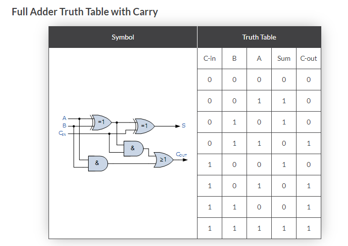

Let us find the logical circuit for Carry Out. You need to just consider the cases where C-Out is 1, i.e A*B*(!C) + A*(!B)*C + A*B*C + (!A)*B*C = A*B + (A^B)*C 

Similarly you can do for any truth table.


# Find the kth Largest or Smallest Element.
##  Quick select algorithm.
- Order Average $O(n) = O(n+n/2+n/4+...infinity))=O(2n)$. This is valid since on average after the first step, you end up discarding half of the elements. Half on every step gives rise to above complexity.
- If you are unlucky, you won't be discarding much of the elements and worst case you will be discarding only the pivot and worst case time complexity will be $O(n^2) =O(n+(n-1)+(n-2)+(n-3)+(n-4))$
- Choosing the pivot is critical for O(n) timecomplexity.


### C++ : Can find the median of sorted array in O(n) average time.

```c++
std::nth_element(v.begin(), v.begin() + v.size() / 2, v.end());
return *(v.begin() + v.size() / 2);
```

nth_element doesn't return anything, but places the nth elemnt in the sorted place in the array.

### C++ : Find the Kth largest element in the array, (not kth distinct element).
```nth_element(nums.begin(),nums.begin() + (n-k) ,nums.end());```


## You can also use heap for this problem to get O(nlogk) solution which is pretty fast for small k.

### partial_sort
- it returns the k smallest or k largest elements of the array using heap at the backend.
- Useful for finding kth smallest or kth largest.
- ``` void partial_sort (RandomAccessIterator first, RandomAccessIterator middle,                    RandomAccessIterator last, Compare comp);```

### C++ : Find the Kth largest element in the array, (not kth distinct element). Using partial sort.
```partial_sort(nums.begin(), nums.begin()+(n-k+1), nums.end());```


## Median of Medians

### For Quick Select, If you can guarantee that the number of elements that you are discarding on each step is a ratio of current elements you can guarantee O(n) time complexity

$(n+n/r+n/r^2+n/r^3....infinity) = O(n/1-r) = O(n)$

This is exactly what median of medians algorithm does, essentially to find optimal pivot,
- you keep dividing your entire array into chunks of size 5(or 7/9) and choose median of these elements,
- after this considering this median as an array repeat dividing these median arrays again into 5 chunks and choose median of them, till only 1 median is left in array.
- This will be your pivot element. Use this pivot for your quick select algorithm.
- It can be proved that choosing this pivot you eliminate n/4 elements on each iteration of quick select.
- The overhead for finding pivot for all levels will be around o(n).
- [Link](https://www.youtube.com/watch?v=fcf56RTbkHc&t=161s)


# Greater or Lesser and Functors vs Functions.
- Default behavior of priority_queue is max_heap
  - If you want min heap ```priority_queue<int,vector<int>,greater<int>> pq();```
  - Here greater<int> is part of the type angular bracket(you thus don't create a functor in this case).

- Default sort behavior is ascending
  - You can get descending by ```sort(a.begin(),a.end(),greater<int>());```
  - Here greater<int>() is part of the function argument which expects a function, calling greater<int>() will return a function whose () overloaded method can be used to compare.

- Default comparision is bst
  - You can do reverse bst by ```set<int, greater<int>> s1```
  - Here greater<int> is part of the type angular bracket(you thus don't create a functor in this case).

## The thing about using functor vs plain function is calling ```functor()``` returns you a function
- So you can directly call ```sort(v.begin(),v.end(),func);```
- But you need to use () for functor ```sort(v.begin(),v.end(),functor())```
- Calling functor() is nothing but creating an object of type functor. The property of this object is that it's () operator is overloaded and thus can behave as a function.

- same for accumulate ``` accumulate(v.begin(), v.end(), 1, functor())``` vs ```accumulate(v.begin(), v.end(), 1, func)``` 

## Reference
- https://stackoverflow.com/questions/356950/what-are-c-functors-and-their-uses
- https://stackoverflow.com/questions/44240996/difference-between-stdgreaterint-and-stdgreaterint

# Binary Tree
- A tree with n vertices will have n-1 edges. (Think every node has only one edge to parent except the root.)

# Binary Heap
- Can be implemented using an array.
- It’s a complete tree (All levels are completely filled except possibly the last level and the last level has all keys as left as possible). This property of Binary Heap makes them suitable to be stored in an array.
- To get the parent using ```(childindex-1)/2```
- To get the child nodes use ```(2*parentindex +1 , 2*parentindex+2)```
- All inserts, delete, update must take care of preserving both structure and order property of the binary heap.

## Inserting a node in binary heap (Min)
- Insert at the end of the array(to preserve structure), and then heapify up. 
- Check parent and see if parent is less than child, if yes then swap(swap operation doesn't change the structure so safe), keep doing till parent is less than child.
- 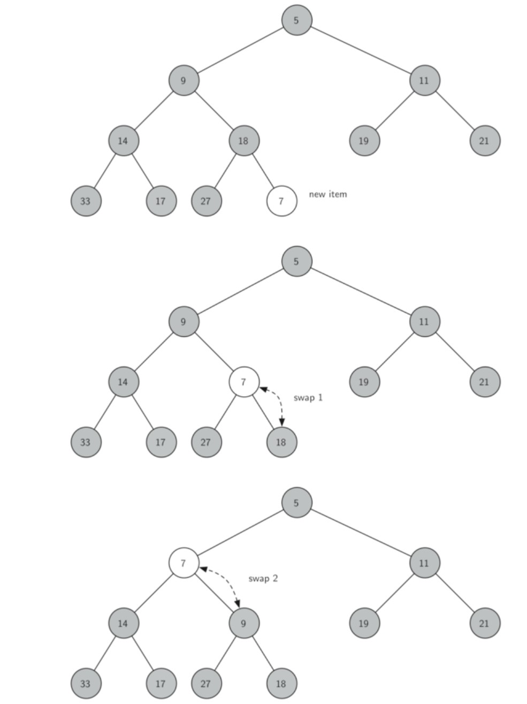

## Deleting the min/root node in binary heap (Min)
- Here also we need to ensure heap structure and heap order properties after the root has been removed.
- we will restore the root item by taking the last item in the list and moving it to the root position. (This maintains our heap structure property)
- we will restore the heap order property by pushing the new root node down the tree to its proper position, by heapify down.
- 

# Binary Search Tree
## Node to be deleted is leaf
- Simply remove from the tree.

## Node to be deleted has only one child
- Copy the child to the node and delete the child 

## Deletion a node with 2 children
- Find inorder successor of the node. Copy contents of the inorder successor to the node and delete the inorder successor.
- The inorder successor can itself have atmost one node and thus deleting it will fall in one of the above 2 cases.


# Trie (Prefix Trees)
```c++
class TrieNode{
    public:
        TrieNode* children[26];
        bool endNode = false;
        TrieNode(){
            for(int i=0;i<26;i++){
              children[i] = 0;
            }
        }
};
```
- Remember to use public

# Suffix Trie
- Trie made from all the suffixes of a string.

# Suffix Tree (Compressed Suffix Trie)
- A Suffix Tree is a compressed tree containing all the suffixes of the given text as their keys and positions in the text as their values. Suffix Tree provides a particularly fast implementation for many important string operations.
- Path Label - concatenation of edge label(s)
- Edge label - label of edge connecting to leaf node.
-  Each leaf vertex is a suffix and the integer value written inside the leaf vertex is the suffix number.
-  Suffix number -> For T = STEVEN, suffix 2 is EVEN (0 based indexing).
- In order to ensure that every suffix of the input string T ends in a leaf vertex, we enforce that string T ends with a special terminating symbol '$' that is not used in the original string T.
- In worst case(All characters are same) total number of internal vertex will be n, and in all cases total number of leaf vertex = n = number of possible suffixes = length of String T. So total vertices = 2n-1.

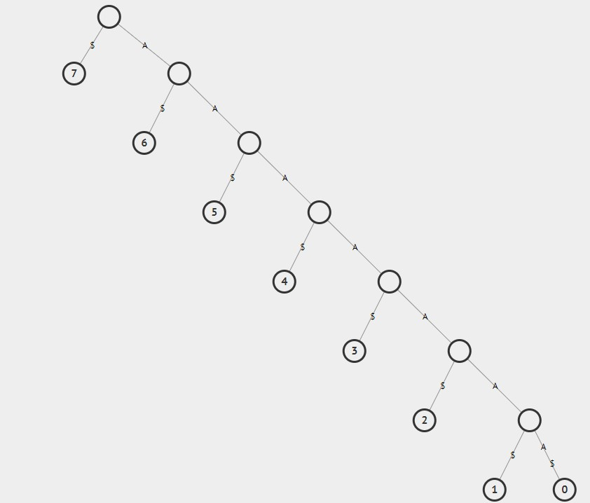

- If all characters are distinct will lead to a much smaller suffix tree n+1;


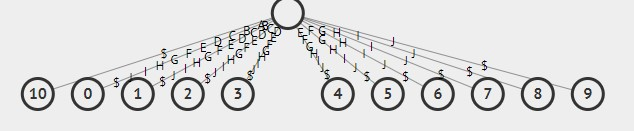

## Applications of suffix Tree
### String Matching
- (Find all the places where a pattern occurs) (Just like KMP).
- Time complexity: O(m+occ) where occ is the total number of occurrences. Where m is the length of the pattern and occ is the number of times it occurs.


### Longest Repeating SubString
- (atleast twice repeating)
-  (Find the deepest path label). Since it is path label, it will be repeating atleast twice.
-  O(n) with a simple tree traversal.
### Longest Common Subsequence
-  (Better than dp solution O(n*n))
-  (Since this is O(N) solution if build takes O(N))
-   Make a single suffix tree using 2 strings and Mark the internal nodes containing leaf nodes from both strings something distinct, return path to the deepest marked internal node. 
- Example, For T1=GATAGACA$, and T2 = CATA# (Notice the appended $ and # for ease of operation). The Yellow internal nodes are the marked node, whihc have children from both strings, and ATA path is the LCS.
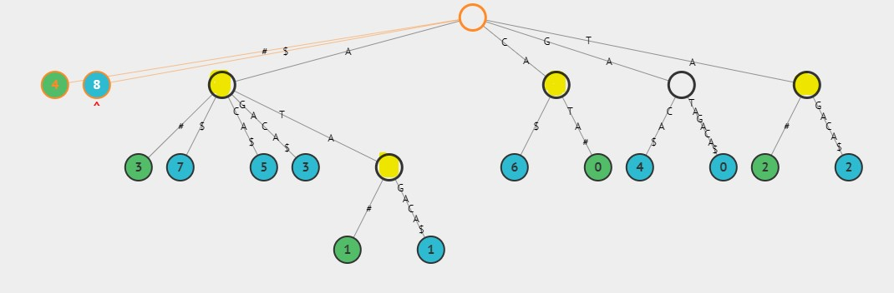

#### Algorithm for LCS
```
ans = ""
findLCS(current vertex cur):
  if (cur is a leaf) return
  if (cur is not a marked_candidate) return
  if (cur.label.length >= ans.length) update ans
  findLCS(cur's children)
```

# Prefix Sum Array
Given an array arr[] of size n, its prefix sum array is another array prefixSum[] of same size such that the value of prefixSum[i] is arr[0] + arr[1] + arr[2] … arr[i].

Ex : ```{10, 20, 10, -5, 15}``` then prefix Sum array becomes : ``` {10,30,40,35, 50}

## Application of Prefix Sum Array
- Range queries like: lots of queries to increment items between index L and R and finally print out result.
- Find if there is a subarray with 0 sum.
- Equilibrium index of an array 
- Find the prime numbers which can written as sum of most consecutive primes 
- Longest Span with same Sum in two Binary arrays 
- Maximum subarray sum modulo m
- Maximum subarray size, such that all subarrays of that size have sum less than k
- Maximum occurred integer in n ranges 
- Minimum cost for acquiring all coins with k extra coins allowed with every coin 
- Random number generator in arbitrary probability distribution fashion
- [Link](https://www.geeksforgeeks.org/prefix-sum-array-implementation-applications-competitive-programming/)

# Index manipulation techniques to solve questions like:
- See if you can use array indexes to find the missing number.
- By marking presence of an element x, we change the value at the index x to negative.
- swapping the number according to their indexes (Bucketing).

## Applications
- Find the smallest positive number missing from an unsorted array (Duplicate and non negative numbers exist in the array) [Link](https://leetcode.com/problems/first-missing-positive/)

# Union-Find Disjoint Sets
- Used to model disjoint sets 
  - with the ability to in (near constant time) determine which sets an item belongs to(or if they belong to same set) : **FIND**
  -  and unite two sets into one larger set. : **UNION**
- ## Used to find connected components in an undirected graph.

## Working
- You choose a representative parent item to represent an entire set.
- Disjoint set creates a tree like structure where the disjoint sets form a forest of trees. Each tree corresponding to a tree in a forest.
- The representative set identifier for an item can be obtained simply by following the chain of parents to the root of the tree.
### Thus the basic interface of this data structure consists of only two operations:
- ```union_sets(a, b)``` - merges the two specified sets (the set in which the element a is located, and the set in which the element b is located)
- ```find_set(v)``` - returns the representative (also called leader) of the set that contains the element v. This representative is an element of its corresponding set. It is selected in each set by the data structure itself (and can change over time, namely after union_sets calls). This representative can be used to check if two elements are part of the same set of not. a and b are exactly in the same set, if find_set(a) == find_set(b). Otherwise they are in different sets.
- As described in more detail later, the data structure allows you to do each of these operations in almost O(1) time on average.

### Representation
- We can use unordered_map to represent each item,  the key in the unordered_map is the node in consideration and the value is the parent of the node( can also store another value to indicate the size if the current node is a parent).
- If the items are all positive and inside a range, we can also use an array to represent and array value can indicate the parent if positive, if the array value is negative, then this node is that of parent and value then it indicates the rank of the set.
 

### Union by size / rank
The problem if we attach the second tree always to first can lead to long chains of length O(n), to solve this we can use 2 approaches  In the first approach we use the size of the trees as rank, and in the second one we use the depth of the tree. The tree with higher rank becomes the rank. Both optimizations are equivalent in terms of time and space complexity.

### Path compression optimization/ Collapsing find.
- This optimization is designed for speeding up find_set.
- Whenever we find a representative item/root of the disjoint set by following chain of parent links from a given item, we can set the parent of all items traversed to the point directly to the root. Any subsequent calls to find_set, only one link will be traversed.


## Code
### Find (Path Compression)
```
int find_set(int v) {
    if (v == parent[v])
        return v;
    return parent[v] = find_set(parent[v]);
}
```

### Union
#### Rank as size
```
void make_set(int v) {
    parent[v] = v;
    size[v] = 1;
}

void union_sets(int a, int b) {
    a = find_set(a);
    b = find_set(b);
    if (a != b) {
        if (size[a] < size[b])
            swap(a, b);
        parent[b] = a;
        size[a] += size[b];
    }
}
```
#### Rank as depth
```
void make_set(int v) {
    parent[v] = v;
    rank[v] = 0;
}

void union_sets(int a, int b) {
    a = find_set(a);
    b = find_set(b);
    if (a != b) {
        if (rank[a] < rank[b])
            swap(a, b);
        parent[b] = a;
        if (rank[a] == rank[b])
            rank[a]++;
    }
}
```

## Time Complexity
- If we combine both optimizations - path compression with union by size / rank - we will reach nearly constant time queries. It turns out, that the final amortized time complexity is O(α(n)), where α(n) is the inverse Ackermann function, which grows very slowly. In fact it grows so slowly, that it doesn't exceed 4 for all reasonable n. 
- Also, it's worth mentioning that DSU with union by size / rank, but without path compression works in O(logn) time per query.

## Application
- Used to find connected components in an undirected graph.
- Minimum Spanning Trees and Finding a cycle in a undirected graph : Kruskal Algorithm.
- https://leetcode.com/problems/longest-consecutive-sequence/submissions/

# Segment Trees
- A Segment Tree is a data structure that allows answering range queries over an array effectively, while still being flexible enough to allow modifying the array.

## Structure
- we start with the segment a[0…n−1], split the current segment in half (if it has not yet become a segment containing a single element), and then calling the same procedure for both halves. For each such segment we store the sum of the numbers on it. The above procedure forms a binary tree. 
- We also ensure that the length of the array is made the power of 2, by appending empty nodes in it. The defination of empty nodes depends on the problem.
- The above constraint makes sure segment trees form complete binary trees.
- Let's take a = [1,3,-2,8,7] as an example
- 
- In most implementation tree is not constructed explicitly.
- The height of the Segment Tree is O(logn), because when going down from the root to the leaves the size of the segments decreases approximately by half.
- Value of leaf vertex would be equal to the (corresponding) element a[i], in most cases.

## Construct
- Assign values to leaf node using the array values.
- You start from the root node, and recurse till you reach the leaf node.
- The leaf node then returns the value inside it. and the parent node combines the value recieved from both the nodes using merge operation.
- The time complexity of this construction is O(n), assuming that the merge operation is constant time 

## Implementation
- ### Fill the current array, till it's size becomes equal to the next power of 2.
  - To find the next power of 2 after x, we need to find log(x), which will give a double and we take the ceil of that and raise 2 to the power of the ceil result to find the next power of 2. 
- Create another array segment Tree whose size is twice of that of the above modified array.
### Creation of the segmentTree
- Ensure at each node, you have the following information
  - Array Index of the segment Tree Array, which the current node corresponds to.
  - The left and right bounds of the current node.
- If left and right bounds are equal we are at the leaf node and you can directly assign the value from array.
- Else find the middle bound between left and right bound and perform build on the children 2 node, then combine the value to get current Nodes's value.

### Sum range
- Ensure you have following information
  - Array Index of the segment Tree Array, which the current node corresponds to.
  - The left and right bounds of the current node.
  - The left and right indices which signifies the range of the query.
- Now test if the range falls beyond the bounds, then return 0.
- If it completely engulfs the bound, return the value stored at this node in segment Tree.
- Else, compute mid node and  return the result of recursive call to left and right nodes.

### Update node
- We assume that the position i which is to be updated, falls within the left and right bounds.
- Ensure you have following information
  - Array Index of the segment Tree Array, which the current node corresponds to.
  - The left and right bounds of the current node.
- If left and right bounds are same then you are at the leaf node, use the above array index to update the segment Tree using the new value.
- Else, compute the mid value and check if position i, falls below mid or above mid, and recurse accordingly.
  - Also you need to update the current node's value after the child node's recursion is complete.
```c++
class NumArray {
    vector<int> segmentTree;
    
    int findNextPowTwo(int x){
        double currentPowTwo = log2(x);
        double currentPowTwoCeil = ceil(currentPowTwo);
        return pow(2, currentPowTwoCeil);
    }

    void build(vector<int> nums, int l, int r, int v){
        if(l==r){
            segmentTree[v] = nums[l];
        }
        else{
            int mid = (l+r)/2;
            build(nums,l,mid,2*v+1);
            build(nums,mid+1,r,2*v+2);
            segmentTree[v] = segmentTree[2*v+1] + segmentTree[2*v+2];
        }
    }
    
    int helperSum(int i, int j, int l, int r, int v){
        if(i<=l && j>=r){
            return segmentTree[v];
        }
        else if(j<l || i>r){
            return 0;
        }
        int m = (l+r)/2;
        return helperSum(i,j,l,m,2*v+1) + helperSum(i,j,m+1,r,2*v+2);
    }
    
    void helperUpdate(int i, int new_val, int v, int l, int r){
        if(l==r){
            segmentTree[v] = new_val;
        }
        else{
            int m = (l+r)/2;
            if(i<=m){
                helperUpdate(i,new_val,2*v+1,l,m);
            }
            else{
                helperUpdate(i,new_val,2*v+2,m+1,r);
            }
            segmentTree[v] = segmentTree[2*v+1] +  segmentTree[2*v+2];
        }
    }
    
public:
    NumArray(vector<int>& nums) {
        if(nums.size()==0) return;
        int nextPowTwo = findNextPowTwo(nums.size());
        for(int i=nums.size();i<nextPowTwo;i++){
            nums.push_back(0);
        }
        segmentTree.assign(2*nums.size(),0);
        build(nums,0,nextPowTwo-1,0);
    }
    
    void update(int i, int val) {
        helperUpdate(i, val, 0, 0, segmentTree.size()/2-1);
    }
    
    int sumRange(int i, int j) {
        return helperSum(i, j, 0, segmentTree.size()/2-1, 0);
    }
};
```

## Complexity
### Space
- One important property of Segment Trees is, that they require only a linear amount of memory. The standard Segment Tree requires 4n vertices for working on an array of size n.
- The number of vertices in the worst case can be estimated by the sum $1+2+4+⋯+2⌈log2n⌉=2⌈log2n⌉+1<4n$.


## Lazy Propagation (Useful in range updates)
- We begin by considering problems of the simplest form: the modification query should add a number x to all numbers in the segment a[l…r]. The second query, that we are supposed to answer, asked simply for the value of a[i].
- To make the addition query efficient, we store at each vertex in the Segment Tree how many we should add to all numbers in the corresponding segment. 
  - For example, if the query "add 3 to the whole array a[0…n−1]" comes, then we place the number 3 in the root of the tree. 
- Thus we don't have to change all O(n) values, but only O(logn) many.
- If now there comes a query that asks the current value of a particular array entry, it is enough to go down the tree and add up all values found along the way.


## Applications
- finding the sum of consecutive array elements provided the range O(logn)
- finding the minimum element in a such a range  O(logn), instead of sum store max each node.

# Comparision between Segment Trees, Prefix Array and Naive algorithm for the range Sum Query

## Segment Tree
- Range Query (Log(n))
- Update (Log(n))
- Update Range(Log(n)), using Lazy propagation

## Prefix Array
- Range Query O(1)
- Update O(n)
- Update Range O(n)

## Naive Approach (Modify the array itself)
- Range Query O(n)
- Update O(1)
- Update O(n)

# String

## KMP

### TIP -> MOST IMPORTANT STEP TO REMEMBER IN LPS AND KMP BOTH is the case where the iterator 1 and iterator 2 are not equal and also the iterator2's value is also not 0, then you perform the following operation ```iterator2 = LPS[iterator2-1]``` i.e reset iterator2's value to the appropriate position.

### Longest Prefix Which is also a suffix. (LPS) Array

To find the longest prefix which is also a suffix we need to follow the below rules.

We form an array in which the values at each index denote the length of the longest prefix which is also a suffix and is not the same as the string itself. i.e for string abcabc ->length of prefix which is also a suffix is 3 (not 6 cause it can't be the string itself).

- We need to use 2 iterators i and len.
- Initialize len=0;i=1 and LCS[0]=0;
- At each iteration we check if A[len] == A[i].
- If True we increment both i and len. Also we update the LPS[i] = len+1;
- If False
    - If len is zero then LPS[i]=0 and i++;
    - If len is not zero then len = LPS[len-1];

Reason
- First index of LPS Array should have value of zero cause no prefix exist which is not the string(A[0] is a character) itself.

- len tells the max length of the prefix and also a suffix for substring 0 to i-1.

- Thus if A[len]==A[i] it means to find the length of largest suffix which is also prefix for string 0 to i just take the value of "len"(length of largest prefix which is also a suffix for string 0 to i-1) and add 1 to it i.e LPS[i] = len + 1; (Can't we write LPS[i] = LPS[i-1]+1?)

- If len is zero and A[i] doesn't match the first character(A[len=0]) the Longest Prefix that is a suffix is zero as there is nothing less than len(which is also the last index of maximum prefix of string 0 to i-1) to be compared with anything less than i and also since A[i] and A[0] not same so LPS[i]=0;

- If len is not zero then there can be something in the already matched prefix which can match with the suffix when we add the character at A[i]. **So we cannot do LPS[i]=0 and move ahead**. We need to analyse. We were analysing the strings below index len-1 but unfortunately the character at index len did not match with i. But what if the same pattern till index len-1 exist before in the prefix that starts from 0. i.e considering string ending with len-1 as suffix does there exist a prefix starting at 0. to know that we see LPS[len-1] and we don't yet increment i, we see if the character at index=LPS[len-1] matches with character at i. if yeah then great we just continue with our algorithm else we continue to find the pattern as deep as it goes.

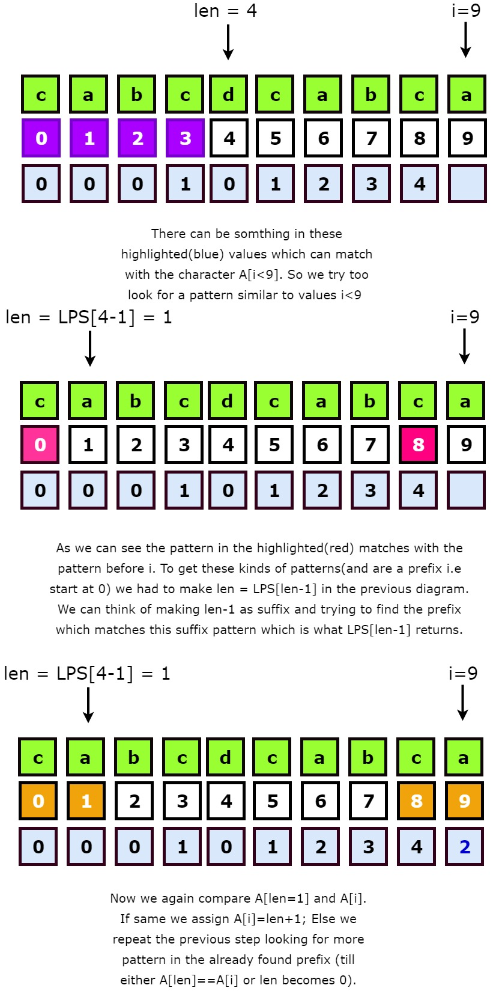


### Main Algorithm
- The reason brute force approach is bad, is because everytime we detect a difference between main and substring, we reset the iterator of the main string back to last_position + 1, because there can be something in the main_string[i+1,:] that matches with the substring, if we can somehow cache this pattern, we can get a optimized solution.
- KMP's main motivation is  the main_string's iterator should not go back from it's position ever, only the substring's iterator resets it's position. The substring iterator is resetted according to the lps_array's value ```j=lps[j-1]``` if ```j!=0```, else if ```j==0``` the main_string's iterator(i) is incremented.
- It is somewhat similar to formation of LPS Array above.

```c
class Solution {
    
     void lps(vector<int> &arr, string str){
         int len = 0;
         int i = 1;//lps[0] == 0, see above
         while(i<str.length()){
             if(str[i] == str[len]){
                 len++;
                 arr[i] = len;
                 i++;
             }
             else{
                 if(len == 0){
                    arr[i] = 0;
                    i++;
                 }
                 else{
                   //IMPORTANT STEP
                     len = arr[len-1];
                 }
             }
         }
     }
    
public:
    int strStr(string haystack, string needle) {
        
        if(needle.size()==0) return 0;
        vector<int> l(needle.length(),0);
        lps(l, needle);
        int i=0;
        int j=0;
        while(i<haystack.length()){
            if(needle[j] == haystack[i]){
              //if match then increment both iterator.
                i++;
                j++;
            }
            else{
                if(j==0) i++;
                else{
                    j=l[j-1]; //in the already matched part i.e 0:j-1,
                    // see the length of the largest prefix which is also a suffix.
                }
            }
            if(j == needle.length()){//if end is reached return
                return i-j;
            }
        }
        return -1;
        
    }
};
```
### Time Complexity (V.IMPORTANT)
- The time complexity is O(n), since i is never decremented and is always incremented. Now if we observe carefully each decrement of j is actually mapped to one increment of j, and if we observe carefully j and i are always incremented together, so there can be at max (n: size of the big string) decrements. so total time complexity is O(n+n) = O(n).

## Rabin Karp Algorithm (Rolling Hash Function)
- Used to find occurance of a string in another string, same as KMP.
- Easier to implement, but less stable than KMP, in case if hash function chosen has lot of collision.
- We first compute hash of the smaller string(say add all the character of the small string)
- Then we essentially also compute the hash of the all the contiguous substrings of the text of length m.
- To efficiently compute the hash of all contiguous substrings, we need a hash function with the following property : ash at the next shift must be efficiently computable from the current hash value and next character in text i.e rehash must be O(1) operation.
- Also hash function shouldn't compute value that overflows the datatype.
- One decent hash function is say $P$ is the pattern and n is the length of the pattern, r can be any number( usually taken total types of character i.e 26) : $hash(P) = P[0]*r^{n-1}+P[1]*r^{n-2}+P[2]*r^{n-3} + ....$ [Link](https://youtu.be/qQ8vS2btsxI?t=755)
- Good performing hash is bernstein hash.

### Time Complexity
- Worst Case is O(mn)
- The average and best-case running time of the Rabin-Karp algorithm is O(n+m)


## String divisibility Problems
### Find the smallest, substring which when repeated forms the original string.
- https://www.geeksforgeeks.org/find-given-string-can-represented-substring-iterating-substring-n-times/
- https://stackoverflow.com/questions/6021274/finding-shortest-repeating-cycle-in-word
- Find the length of the largest proper prefix which is also a suffix (but not the entire string) (LPS) for the given string, say the value is x.
- Now subtract length of the string with x.
- Check if n%(len-x) == 0, if yes such a string is possible and it's value is ```string[0:len-x-1]```;
  ```c++
  int findSmallestUnit(string str){
      vector<int> lps(str.length(),0);
      int i=1;
      int len=0;
      while(i<str.length()){
          if(str[i] == str[len]){
              len++;
              lps[i] = len;
              i++;
          }
          else{
              if(len == 0) i++;
              else{
                  len = lps[len-1];
              }
          }
      }
      int n=str.length();
      int x = lps[n-1];
      if(n%(n-x) == 0){
          return n-x;    
      }
      return n;
  }
  ```

- If you don't remember this solution, simply perform a $O(n^2)$ approach to this problem, where you start from the start of the string and check if the substring which starts from the start of a string to i can be repeated to form the whole string. (Use mod of the smaller string iterator while comparing to avoid forming new string).
  ```c++
  int findSmallestUnit(string str){
      for(int i=1;i<str.length();i++){
          int j=0;
          for(;j<str.length();j++){
              if(str[j%i] != str[j]){
                  break;
              }
          }
          if(j==str.length()) return i;
      }
      return str.length();
  }
  ```


### Given 2 substring find if they are divisible.
- Check the length of 2 string, and see if the lenght are divisible.
- If yes then check content (Use mod of the smaller string iterator while comparing to avoid forming new string).

### Given 2 string, find the largest common substring of these 2 strings which when repeated forms both the strings. (Also check first if it possible to do that)
- To prove that such a substring exists, find the smallest substring of the 2 strings which when divided forms the larger string. If the smallest substring returned by both are same then it is possible
- Now find the gcd of the lengths of the both strings, the GCD gives the length of the largest number which when repeated can form both the numbers. That is what the defination of GCD is. Now just return the substring from 0 to gcd.
[Personal Solution](https://leetcode.com/problems/greatest-common-divisor-of-strings/submissions/)

### If S1 is a rotation of S2, then S2 is a substring of S1+S1.

# Important Questions


- LRU Cache
  
- https://leetcode.com/problems/jump-game/solution/
  - Read this article after solving the jump game question.

- https://leetcode.com/problems/binary-tree-maximum-path-sum/
  - Solution is elegant few lines.

- https://leetcode.com/problems/unique-email-addresses/submissions/
  - Solve this to get clarity of strings erase-remove idiom.

- https://leetcode.com/problems/majority-element/
  - Teaches the Boyer-Moore Voting Algorithm
  - ### Boyer-Moore Voting Algorithm
    - Explaination https://leetcode.com/problems/majority-element/solution/
    - For Diagram

- https://leetcode.com/problems/find-the-town-judge/
  - Teaches importance of

- https://leetcode.com/problems/cinema-seat-allocation/
  - Importance of looking at constraints and also bit masking

- https://leetcode.com/problems/cousins-in-binary-tree/
  - Important in knowing the tips for trees
  - https://leetcode.com/problems/cousins-in-binary-tree/discuss/238624/C%2B%2B-level-order-traversal

- Boolean Parenthesis DP.
  - Different way of thinking bottom up.(Diagonal)

- https://leetcode.com/problems/flood-fill/
  - You don't need visited set.

- #### IMPORTANT https://leetcode.com/problems/maximum-sum-circular-subarray/
  - Tricky Question (Simple if you know solution).

- https://leetcode.com/problems/valid-parenthesis-string/
  - 3 Solution approaches
  
- https://leetcode.com/problems/remove-k-digits/

- https://leetcode.com/problems/bulb-switcher-iii/
  - Beautiful solution. Simple straight.

- https://leetcode.com/problems/online-stock-span/
  - Couldn't solve
  - Simple solution

- https://leetcode.com/problems/best-time-to-buy-and-sell-stock/
  - Beautiful Simple solution

- https://leetcode.com/problems/contiguous-array/submissions/
  - Couldn't Solve.

- https://leetcode.com/problems/counting-bits/
  - Very beautiful solution.

- https://leetcode.com/problems/k-closest-points-to-origin/

- https://leetcode.com/problems/two-city-scheduling/
  - Took too much time
  - easy solution.

- If we have a stream of strings and we need to check if it is a subsequence of a particular string.
  - Followup of https://leetcode.com/problems/is-subsequence/

- https://leetcode.com/problems/find-the-duplicate-number/
  - Could not solve
  - Good concepts.
  - https://leetcode.com/problems/find-the-duplicate-number/discuss/72844/Two-Solutions-(with-explanation)%3A-O(nlog(n))-and-O(n)-time-O(1)-space-without-changing-the-input-array
  - Look at his comment -> StefanPochmann

- https://leetcode.com/problems/word-search-ii/
  - Time Limit Exceeded
  - Great solution
  - https://leetcode.com/explore/challenge/card/june-leetcoding-challenge/543/week-5-june-29th-june-30th/3376/discuss/59841/My-AC-very-clean-C++-code


- https://leetcode.com/problems/prison-cells-after-n-days/
  - Was able to solve
  - But the answer is bit tricky, I was able to solve with a very nice approach to problem.
  - See personal submission.

- https://leetcode.com/problems/subsets/
  - Was able to solve using backtracking.
  - Good concepts.

- https://leetcode.com/problems/maximum-width-of-binary-tree/

- https://leetcode.com/problems/3sum/
  - Important Question in interviews
  - Was able to solve with TLE.

- https://leetcode.com/problems/reverse-words-in-a-string/
  - Couldn't solve the inplace solution
  - https://leetcode.com/problems/reverse-words-in-a-string/discuss/47840/C%2B%2B-solution-in-place%3A-runtime-O(n)-memory-O(1)


- https://leetcode.com/problems/single-number-iii/
  - Couldn't solve, constant space

- https://leetcode.com/problems/find-minimum-in-rotated-sorted-array-ii/
  - Solved but too many submissions
  - corner cases a lot.

- https://leetcode.com/problems/soup-servings/
  - Couldn't Solve
  - Very Important Question

- https://leetcode.com/problems/find-the-duplicate-number/

- https://leetcode.com/problems/maximum-xor-of-two-numbers-in-an-array/
  - Good question, took a long time.

- https://leetcode.com/problems/prefix-and-suffix-search/
  - Smart trick to solve

- https://leetcode.com/problems/longest-substring-without-repeating-characters/
  - Was able to solve efficiently, but still a good question so see.

- https://leetcode.com/problems/first-missing-positive/
  - Was able to solve efficiently, but still a good question.

- https://leetcode.com/problems/maximum-product-subarray/
  - Was able to solve efficiently, but still a good questions to see.

- https://leetcode.com/problems/word-break/
  - Very nice concepts
  - Was able to solve

# Important Questions with hints

- LRU Cache
  -  Use a hash<int,pair<int,list<int>>> and a queue(i.e a list).
  -  Use touch function to rearrange cache when necessary.
  
- https://leetcode.com/problems/jump-game/solution/
  - Read this article after solving the jump game question.

- https://leetcode.com/problems/binary-tree-maximum-path-sum/
  - Solution is elegant few lines.

- https://leetcode.com/problems/unique-email-addresses/submissions/
  - Solve this to get clarity of strings erase-remove idiom.

- https://leetcode.com/problems/majority-element/
  - Teaches the Boyer-Moore Voting Algorithm
  - ### Boyer-Moore Voting Algorithm
    - Explaination https://leetcode.com/problems/majority-element/solution/
    - For Diagram

- https://leetcode.com/problems/find-the-town-judge/
  - Teaches importance of

- https://leetcode.com/problems/cinema-seat-allocation/
  - Importance of looking at constraints and also bit masking

- https://leetcode.com/problems/cousins-in-binary-tree/
  - Important in knowing the tips for trees
  - https://leetcode.com/problems/cousins-in-binary-tree/discuss/238624/C%2B%2B-level-order-traversal
  - Tip - 1 -> Using nullptr to separate siblings from cousins.
  - Using 2 queues to keep track of levels.

- Boolean Parenthesis DP.
  - Different way of thinking bottom up.(Diagonal)

- https://leetcode.com/problems/flood-fill/
  - You don't need visited set.

- #### IMPORTANT https://leetcode.com/problems/maximum-sum-circular-subarray/
  - Tricky Question (Simple if you know solution).

- https://leetcode.com/problems/valid-parenthesis-string/
  - 3 Solution approaches
    - **2 Stack (best to think and implement). [Link](https://www.youtube.com/watch?v=KuE_Cn3xhxI)**
    - DP (Bad timecomplexity but good to know approach similar to boolean parenthesis). [Link](https://leetcode.com/problems/valid-parenthesis-string/solution/)
    -  **Simple solution (most efficient, hard to think like this) [Link](https://leetcode.com/problems/valid-parenthesis-string/discuss/107570/JavaC%2B%2BPython-One-Pass-Count-the-Open-Parenthesis)** 

- https://leetcode.com/problems/remove-k-digits/
  - Teaches efficient processing of strings.
  - trimming zeros and all.
  - Use vector instead of stack.

- https://leetcode.com/problems/bulb-switcher-iii/
  - Beautiful solution. Simple straight.

- https://leetcode.com/problems/online-stock-span/
  - Couldn't solve
  - Simple solution

- https://leetcode.com/problems/best-time-to-buy-and-sell-stock/
  - Beautiful Simple solution

- https://leetcode.com/problems/contiguous-array/submissions/
  - Couldn't Solve.

- https://leetcode.com/problems/counting-bits/
  - Very beautiful solution.
  - https://leetcode.com/problems/counting-bits/discuss/656474/C%2B%2B-simple-in-3-liner.... **There is a meaning behind the solution, not just pattern matching.** 

- https://leetcode.com/problems/k-closest-points-to-origin/
  - Teaches the power of stl.
  - Important concept in sorting.
  - https://leetcode.com/problems/k-closest-points-to-origin/discuss/220235/Java-Three-solutions-to-this-classical-K-th-problem. **IMPORTANT CONCEPT WHAT IF ONLINE DATA**

- https://leetcode.com/problems/two-city-scheduling/
  - Took too much time
  - easy solution.

- If we have a stream of strings and we need to check if it is a subsequence of a particular string.
  - Followup of https://leetcode.com/problems/is-subsequence/

- https://leetcode.com/problems/find-the-duplicate-number/
  - Could not solve
  - Good concepts.
  - https://leetcode.com/problems/find-the-duplicate-number/discuss/72844/Two-Solutions-(with-explanation)%3A-O(nlog(n))-and-O(n)-time-O(1)-space-without-changing-the-input-array
  - Look at his comment -> StefanPochmann

- https://leetcode.com/problems/word-search-ii/
  - Time Limit Exceeded
  - Great solution
  - https://leetcode.com/explore/challenge/card/june-leetcoding-challenge/543/week-5-june-29th-june-30th/3376/discuss/59841/My-AC-very-clean-C++-code


- https://leetcode.com/problems/prison-cells-after-n-days/
  - Was able to solve
  - But the answer is bit tricky, I was able to solve with a very nice approach to problem.
  - See personal submission.

- https://leetcode.com/problems/subsets/
  - Was able to solve using backtracking.
  - Good concepts.
  - Elegant bit manipulation solution -> https://leetcode.com/problems/subsets/discuss/27278/C%2B%2B-RecursiveIterativeBit-Manipulation

- https://leetcode.com/problems/maximum-width-of-binary-tree/
  - One test case was failing due to overflow.
  - Could not solve using dfs, use bfs. https://www.youtube.com/watch?v=le-ZZSQRebw
  - To circumvent the overflow error, at each level you should know the leftmost index, which is not straightforward with dfs.

- https://leetcode.com/problems/3sum/
  - Important Question in interviews
  - Was able to solve with TLE.
  - 2 Approaches, convert to 2Sum(Works) or use hash map(TLE).
  - https://www.youtube.com/watch?v=Ca7k53qcTic&t=1043s
  - Everyone of the iterator should be incremented if same.

- https://leetcode.com/problems/reverse-words-in-a-string/
  - Couldn't solve the inplace solution
  - https://leetcode.com/problems/reverse-words-in-a-string/discuss/47840/C%2B%2B-solution-in-place%3A-runtime-O(n)-memory-O(1)
  - Teaches the good use of stringstream of non-inplace solution


- https://leetcode.com/problems/single-number-iii/
  - Couldn't solve, constant space
  - Remember bit's order precidence is less than equality.

- https://leetcode.com/problems/find-minimum-in-rotated-sorted-array-ii/
  - Solved but too many submissions
  - corner cases a lot.

- https://leetcode.com/problems/soup-servings/
  - Couldn't Solve
  - Very Important Question
  - ### Will teach you about conditional probability
    - You can't simply use (aEndCount)/(totalCount) + (abEndCount)/(totalCount)*1/2;
    - There is a probability attached with each soup serving.
    - There is a probability attached with each soup serving. So conditional probability rules applies. Say a person serves using 1st operation, no more soup to feed so probability of this operation is .25, now he does 3rd operation and then 1st operation probability of this happening is 0.25(For 3rd Operation)*(0.25)(For the 1st Operation) = .0625. According to your logic both these states of a becoming empty first will have equal probability which is not true.
  - ### Also there is another concept, since it is unfeasible to maintain a dp table that huge, it is important to notice once N>very large answer is the same i.e 1.

- https://leetcode.com/problems/find-the-duplicate-number/
  - Solve using floyd's cycle detection algorithm
  - Remember the flow in which to traverse the linked list. It is from index to value to index to value....

- https://leetcode.com/problems/maximum-xor-of-two-numbers-in-an-array/
  - Good question, took a long time.
  - Using a good datastructure
  - Things you learn is when you are using a recursive function, you need to reset the values back to the original values, like in back propagation.

- https://leetcode.com/problems/prefix-and-suffix-search/
  - Smart trick to solve insert(all_combination_suffix+"#"+prefix) in trie.
  - Search suffix+"#"+prefix.

- https://leetcode.com/problems/longest-substring-without-repeating-characters/
  - Was able to solve efficiently, but still a good question so see.
  - You need to reset the elements(from start to new start) state when updating the start.

- https://leetcode.com/problems/first-missing-positive/
  - Was able to solve efficiently, but still a good question.
  - Teaches advanced techniques of array manipulation.

- https://leetcode.com/problems/maximum-product-subarray/
  - Was able to solve efficiently, but still a good questions to see.
  - Need to store both max and min product for each index.

- https://leetcode.com/problems/copy-list-with-random-pointer/
  - Couldn't solve with O(1) space.
  - Tricky question to do in O(1) space.
  - You need to have the nodes in the following way A->A'->B->B'->C->C'->D->D'->0.
  - This way you don't need the hashmap for storing the pointers and random pointer can be filled by just finding random of original node and going next on it.

- https://leetcode.com/problems/word-break/
  - Very nice concepts
  - Was able to solve
  - Use of trie and dp.

- https://leetcode.com/problems/search-a-2d-matrix-ii/
  - Was able to solve
  - See how to divide the search space, important.
  - but need to see the time complexity

- https://leetcode.com/problems/divide-two-integers/
  - Super headache question, seems simple.
  - Have to use long throughout.

- https://leetcode.com/problems/construct-binary-tree-from-preorder-and-inorder-traversal/
  - The first item in preorder is the root, find the root in inorder, stuff in left is left of the root and stuff in right is right of root. Use recursion to solve.
  - Same logic can be used for postorder and inorder
  - You cannot construct a binary tree using just postorder and preorder (Unless the binary tree is a full binary tree).
  - If you know the binary tree is a bst then you just need a postorder to construct.
  

# Interview Preparation

## Day : 1 
- For questions like : Rearrange such that adjacent characters are not same, The concept of odd even filling, first sort the numbers by their frequency (priority_queue) and then start filling the odd first then start filling even
  - https://leetcode.com/problems/distant-barcodes/
  - https://leetcode.com/problems/reorganize-string/
### Couldn't Solve
- https://leetcode.com/problems/distant-barcodes/
- **https://leetcode.com/problems/critical-connections-in-a-network/**

## Day : 2
- Carefully choose BFS or DFS, if it is related to shortest path, it is probably bfs.
  - https://leetcode.com/problems/01-matrix/ is BFS, since nearest distance is asked.
  - You tried dfs and were trapped, so be careful
  - The above question also required putting all the zeroes first in the queue then start the bfs once, rather than calling bfs for each zero.
  - Similar question https://www.lintcode.com/problem/walls-and-gates/description

- Use stable_sort in c++, if the order of the original elements have to be preserved in case sort_key is equal.

### Concept of Sliding Window with subarray question
- **Various type of subarray questions which deal with the various different values like find subarrays with no repeating integers, with k distinct integers, with atmost k distinct characters etc can be solved in the same way as below.**
    - By using a sliding window approach by incrementing j on each iteration and checking if the condition holds true, if not increment i.
    - Each iteration checks, does a subarray which ends on j, pass the conditon, if not increment i till it passes the condition
    - Most sliding window questions deal with some kind of aggregate atMost k different characters, largest substring, min substring with k etc. Or they can be converted to aggregate like all substrings with exactly k different characters or a contiguous subarray with exactly k odd numbers.
    - Questions like find subarrays with atmost k distinct or find all subarrays with all distinct integers, all the subarrays of i to j also hold the condition true. The count of those subarrays between i and j can be found using the length logic below see below.
- Concept of grouping the subarrays based on it's length
  - ```[1,2,3,4,5,6]``` the total subarrays which end with 6 is equal to the length of the subarray namely ```[1,2,3,4,5,6]``` , ```[2,3,4,5,6]```, ```[3,4,5,6]```, ```[4,5,6]```, ```[5,6]```, ```[6]```
  - This is because total values that i can take is 6 from 0 to 5.
  - With this knowledge we can solve the subarrays with exactly k different integers problem.
  - **```SubArrays with exactly k different integer = subarrays with atmost k different integers - subarrays with atmost k-1 different integers.```**
  - **```SubArrays with exactly k odd integer = subarrays with atmost k odd integers - subarrays with atmost k-1 odd integers.```**
  - **```Number of Substrings Containing Atleast Three Characters : total number of all substrings - Substrings which contain atmost 2 character```**

#### Total subarrays for a array of length x is
- ```1 + 2 + 3 +4 + 5 +6....x```
- Imagine a subarray is represented by i and j bounds, for a given j, the possible values of i are 1,2,3,4...till j and j goes from 1 to size of the string, total combinations of i for a given value of j is equal to the value of j. And value of j goes from 1 to size of array thus. We have the above formuale.

#### Time complexity of sliding windows is usuall O(NK)
- Where we make N iterations of incrementing j and on worst case our i has to increment on each iteration and that too K times.
- K is dependent on the question.
```c++
class Solution {
    
    int subArraysWithAtMostKDistinct(vector<int> &A, int K){
        //Intialization Part
        int i=0;
        int j=0;
        int ans=0;
        //The umap to efficiently check for condition
        unordered_map<int,int> umap;
        int k=0;
        
        //Iterate on j.
        for(int j=0;j<A.size();j++){
            //Adding j to the umap
            if(umap.find(A[j])==umap.end()){
                umap[A[j]]=0;
            }
            umap[A[j]]++;

            //Check for the condition and increment i if condition fails.
            if(umap[A[j]]==1){
                k++;
            }
            while(k>K){
                umap[A[i]]--;
                if(umap[A[i]]==0){
                    k--;  
                } 
                i++;
            }

            //compute the ans. (Look at the length logic above)
            ans += j-i+1;
        }
        return ans;
    }
    
public:
    int subarraysWithKDistinct(vector<int>& A, int K) {
        return subArraysWithAtMostKDistinct(A,K) - subArraysWithAtMostKDistinct(A,K-1);
    }
};
```

#### Similar Questions
- https://leetcode.com/problems/subarrays-with-k-different-integers/
- https://leetcode.com/problems/count-number-of-nice-subarrays/
- https://leetcode.com/problems/longest-substring-without-repeating-characters/
- https://leetcode.com/problems/longest-substring-with-at-most-two-distinct-characters/
- https://leetcode.com/problems/longest-substring-with-at-most-k-distinct-characters/
- https://leetcode.com/problems/number-of-substrings-containing-all-three-characters/
- Other questions : https://leetcode.com/problems/subarrays-with-k-different-integers/discuss/523136/JavaC%2B%2BPython-Sliding-Window

### Couldn't Solve
- https://leetcode.com/problems/01-matrix/
- https://leetcode.com/problems/subarrays-with-k-different-integers/


## Day 3
- To solve twoSum problem, and find all the possible solutions to 2 sum efficiently, you need to use hashmap. Also don't precompute hashmap, that will lead to duplicate solution, say [0,1,3,1] is there and you need to find the sum = 1, if you precompute hashmap, that means on encountering 0 you will say 2 solutions, then again on encountering each ones, you will say 1 solution leading to total of 4, but there are only 2 solution, so be careful.
- Also for count-good-meals, instead of looping through powers of 2 first then looping through arr, loop through array and inside the first loop, try out all possible values of powers of 2.
- As can be seen in Day 2's https://leetcode.com/problems/01-matrix/  and https://leetcode.com/problems/count-good-meals, the order of doing things can impact the speed of execution, try to optimize whereever you can.

### TLE
- https://leetcode.com/problems/count-good-meals/submissions/

## Day 4
- For some questions java is simply better choice.
  -[ Design In-Memory File System](https://leetcode.com/problems/design-in-memory-file-system/)
- Hard Question but solvable using DP
  - https://leetcode.com/problems/minimum-difficulty-of-a-job-schedule/
### Java Specifics
- The object can simply implement the compareTo method and you don't need to pass the comparator to treemap/hashmap.
- To split a string in java using a delimitter
  ```java
    String s[] = originalString.split("/");
  ```
- Custom Compare in Java
  -  make sure you implement Comparable Interface and make the compareTo method public.
  -  Also make sure you implement Comparable<T> not raw types.
  -  ```java
      @Override
      public int compareTo(FileInstance r){
          return this.name.compareTo(r.name); 
      }
      ```
-  To deal with null values in map, check if the string contains the value using 
    ```java
    if(root.files.containsKey(name)){
        return root.files.get(name);    
    }
    ```

## Day 5
- Spring Boot Tutorial

## To-Do
- Trajan's Algorithm for **https://leetcode.com/problems/critical-connections-in-a-network/**

# Similar Questions

## Find a number
- https://leetcode.com/problems/first-missing-positive/
- https://leetcode.com/problems/maximum-xor-of-two-numbers-in-an-array/
- https://leetcode.com/problems/find-the-duplicate-number/
- https://leetcode.com/problems/single-number-iii/
- https://leetcode.com/problems/single-number-ii/
- https://leetcode.com/problems/single-number/
- https://leetcode.com/problems/single-element-in-a-sorted-array/

## Largest/Longest/Largest Sum Subsequence or Substring
- https://leetcode.com/problems/maximum-product-subarray/
- Longest Common Subsequence
- https://leetcode.com/problems/maximum-subarray/
- Longest Increasing Subsequence
- *Longest Duplicate Substring


# To-Do


## Backlog


  - Buy and sell stocks part 2
  - Kth Smallest Element in a BST followup.
  - Largest Divisible Set
  - Cheapest Flights within K stops followup with tutorial on topcoder
  - Longest Duplicate Substring
  - Count Square Submatrices with All Ones O(n*m) solution.
  - Dungeon Game
  - Single Number and similar questions discussion.
  - Subset II
  - Last Stone Weight II
  - Lucky Horse Prefix Sum
  - To find the time complexity in backtracking problems like Subset.


## Monotone Queue
  - https://medium.com/@gregsh9.5/monotonic-queue-notes-980a019d5793
  -  Minimum Cost Tree From Leaf Values
  -  Sum of Subarray Minimums 907
  -  Online Stock Span 901
  -  Score of Parentheses 856
  -  Next Greater Element II 503
  -  Next Greater Element I 496
  -  Largest Rectangle in Histogram 84
  -  Trapping Rain Water 42
  -  Daily Temperatures 739

## Graph Questions 


## Dynamic Programming Problems

## Trees
  -  Construct Binary Search Tree from Preorder Traversal (Check O(N)) Solutions

## Interview Questions
  - Min(Subset) + Max(subset) == k or < k
    - https://leetcode.com/discuss/interview-experience/637356/amazon-apple-facebook-l5-ict4-e5-seattle-april-2020-may-2020-offer-offer-offer
    - https://leetcode.com/discuss/interview-question/268604/Google-interview-Number-of-subsets
    - https://leetcode.com/discuss/interview-question/275785/facebook-phone-screen-count-subsets
    - https://leetcode.com/discuss/interview-question/747879/de-shaw-online-assessment-questions-2020

  - Is Split Possible in an array
    - https://leetcode.com/discuss/interview-experience/637356/amazon-apple-facebook-l5-ict4-e5-seattle-april-2020-may-2020-offer-offer-offer
    - no constraints
    - splitted array has to be equal in size.
    - geek for geek variations.

  - Merge K Sorted Arrays


## Lists
 - https://docs.google.com/document/d/1wUCqhVHydWiDk6FJdFLSMpgigNrGcs4OFZg0Wa7JGEw/edit#
 - https://leetcode.com/discuss/general-discussion/691825/binary-search-for-beginners-problems-patterns-sample-solutions
 - https://leetcode.com/discuss/general-discussion/458695/Dynamic-Programming-Patterns
 - https://leetcode.com/discuss/general-discussion/655708/graph-problems-for-beginners-practice-problems-and-sample-solutions
 - https://leetcode.com/problems/subsets/discuss/27281/A-general-approach-to-backtracking-questions-in-Java-(Subsets-Permutations-Combination-Sum-Palindrome-Partitioning)
 - https://leetcode.com/discuss/general-discussion/786126/python-powerful-ultimate-binary-search-template-solved-many-problems


# Concepts
- https://stackoverflow.com/questions/28138188/why-pass-by-value-and-not-by-const-reference
- https://medium.com/@gregsh9.5/monotonic-queue-notes-980a019d5793
- https://en.wikipedia.org/wiki/
- Pigeonhole_principle
  - https://leetcode.com/problems/find-the-duplicate-number/discuss/72844/Two-Solutions-(with-explanation)%3A-O(nlog(n))-and-O(n)-time-O(1)-space-without-changing-the-input-array
  - Look at his comment -> StefanPochmann
- Boyer-Moore Voting Algorithm
- Brian Kerighan's Counting Algorithm
- Floyd's Tortoise and Hare (Cycle Detection)
  - https://www.quora.com/How-does-Floyds-cycle-finding-algorithm-work-How-does-moving-the-tortoise-to-the-beginning-of-the-linked-list-while-keeping-the-hare-at-the-meeting-place-followed-by-moving-both-one-step-at-a-time-make-them-meet-at-starting-point-of-the-cycle/answer/Brian-Quanz?ch=3&share=75229003&srid=bQkw