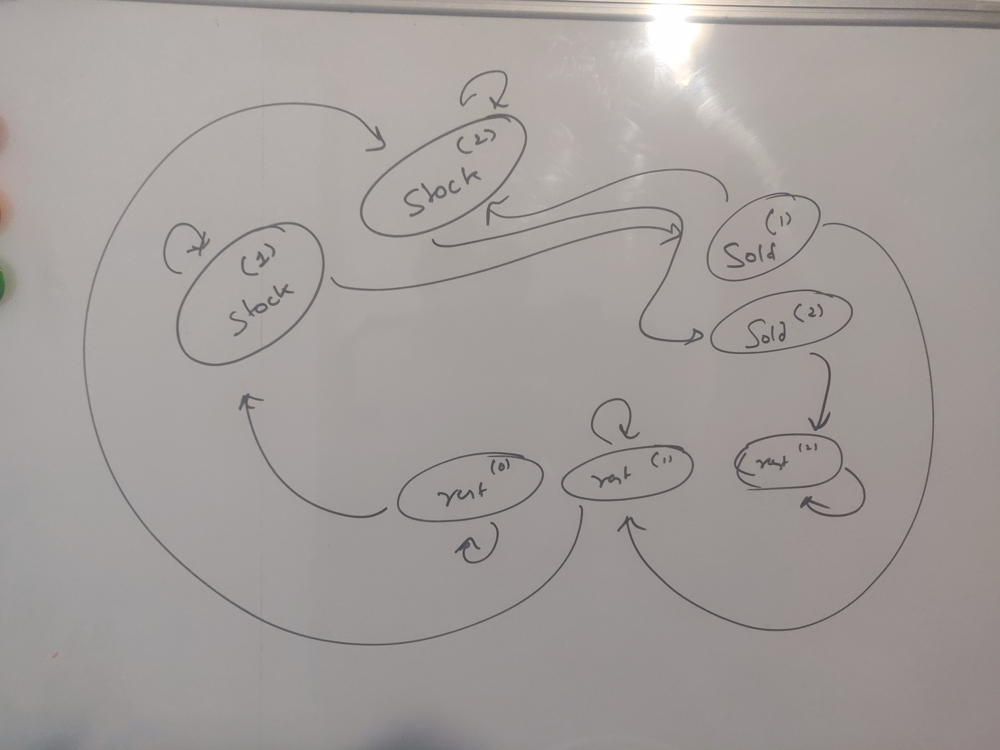
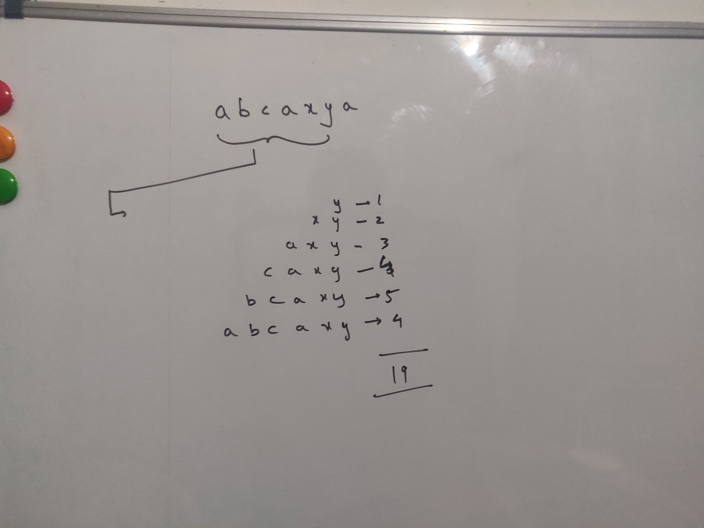
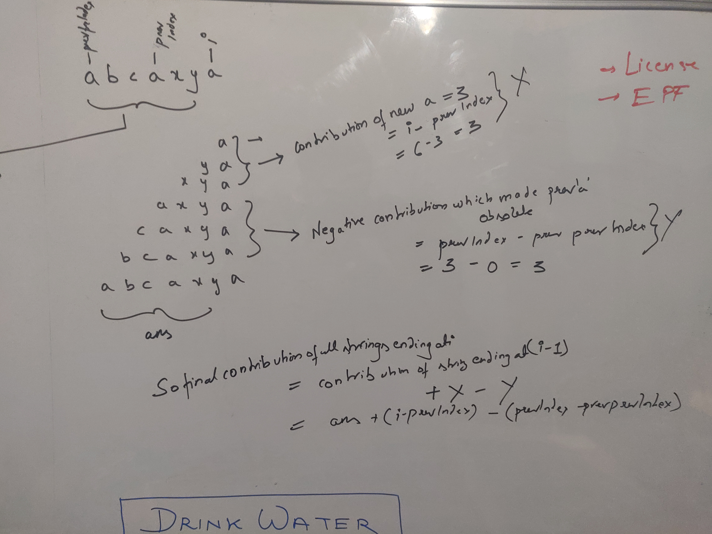
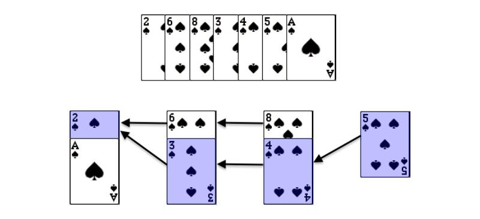

# 29.08.22
### LRU Cache in JAVA (Remember to touch if the key already exists in both get and put)
  - For get
    - Check if the key exists
    - Get the key's value in memory
    - Touch (i.e Remove the key and put the key and value)
    - Return the value;

  - For put
    - Check if the map contains the key, if yes touch and return.
    - If the map doesn't contain the key, then check if the size is equal to capacity, if yes, remove the key
    - Insert the key and value.
  - Can use LinkedHashMap for easy implementations

    ```java
    class LRUCache {
    
      LinkedHashMap<Integer, Integer> map;
      int capacity;

      public LRUCache(int capacity) {
          map = new LinkedHashMap<>();
          this.capacity = capacity;
      }
      
      public int get(int key) {
          if(!map.containsKey(key)) {
              return -1;
          }
          Integer val = map.get(key);
          map.remove(key);
          map.put(key,val);
          return val;
      }
      
      public void put(int key, int value) {
        if(map.containsKey(key)){
              map.remove(key);
              map.put(key,value);
              return;
          }
          if(capacity == map.size()){
              for(Integer k : map.keySet()){
                  map.remove(k);
                  break;
              }
          }
          map.put(key,value);
      }
    }
    ```

# 31.08.22
### LRU Cache
- To implement linked hashmap on, own
  - Node (value,key,next,prev)
  - root, end tracking
  - HashMap<Key, Node>
  - Corner cases need to be handled (if end==root, root=null=end)

### LFU Cache (Important)
- To implement LFU Cache, we need 2 Maps.
  - ## One is a HashMap of (Key : (Value, Count))
  - ## Second is a HashMap of (Count : LinkedHashSet<Key>)
- The Second HashMap is used to keep track of the order of insertion of the keys, so that if there are multiple keys with same frequency the oldest of all is fetched in O(1) time.
- Also using LinkedHashSet enables us to remove a key in O(1) time when we touch a key.
- We also need to keep track of a leastCount frequency state, and update it whereever necessary
  - Just in one place i.e during touch : only if the current key has the frequency == leastCount and the size of Linked Hash Set for that key is 0.
- Touch operation :
  - Update the count value in the First HashMap.
  - Remove the key from the previous count's HashSet and insert into the new HashSet and update leastCount if necessary.
- GET Operation:
  - Get the value, Touch and return the value.
- PUT Operation:
  - See if the key already exists, then simply update and touch.
  - Else, check the capacity == size, then evict
    - Fetch LinkedHashSet corresponding to the leastCount (this is where that state is used) and remove the first item from the LinkedHashSet as well as the First HashMap.
    - ### No need to update leastCount here, since we will make leastCount=1 in the next step.
  - Add the value to both hashMap and make leastCount =1.
```java
class LFUCache {
    
    HashMap<Integer, Integer> keyMap = new HashMap<>();
    HashMap<Integer, Integer> keyCountMap = new HashMap<>();
    HashMap<Integer, LinkedHashSet<Integer>> countMap = new HashMap<>();
    int capacity;
    int leastCount;

    public LFUCache(int capacity) {
        this.capacity = capacity;
    }

    
    private void touch(int key){
        int count = keyCountMap.get(key);
        keyCountMap.put(key,count+1);
        LinkedHashSet<Integer> oldSet = countMap.get(count);
        oldSet.remove(key); //This is why hashset.
        if(count==leastCount && oldSet.size()==0){
            leastCount++;
        }
        countMap.putIfAbsent(count+1, new LinkedHashSet<>());
        LinkedHashSet<Integer> newSet = countMap.get(count+1);
        newSet.add(key);
    }
    
    public int get(int key) {
        if(!keyMap.containsKey(key)) return -1;
        int value = keyMap.get(key);
        touch(key);
        return value;
    }
    
    private void removeLeast(){
        LinkedHashSet<Integer> leastCountSet = countMap.get(leastCount);
        Integer keyToRemove=-1;
        for(Integer key : leastCountSet){
            keyToRemove = key;
            break;
        }
        leastCountSet.remove(keyToRemove);
        keyMap.remove(keyToRemove);
        keyCountMap.remove(keyToRemove);
    }
    
    public void put(int key, int value) {
        if(capacity == 0) return;
        if(keyMap.containsKey(key)){
            touch(key);
        }
        else{
            if(capacity==keyMap.size()){
                removeLeast();
            }
            keyCountMap.put(key,1);
            countMap.putIfAbsent(1,new LinkedHashSet<>());
            leastCount=1;
            LinkedHashSet<Integer> countSet = countMap.get(1);
            countSet.add(key);
        }
        keyMap.put(key,value);
    }
}
```

### KMP 
- See notes in leetcode.md
- Don't write lps[i] = lps[i-1]+1;
- LPS calculation also involves an optimization of kmp itself.
```java
class Solution {
    void lpsArray(int[] lps, String needle){
        lps[0]=0; //First index of LPS Array should have value of zero cause no prefix exist which is not the string(A[0] is a character) itself.
        int j=0;
        int i=1; //
        while(i<needle.length()){
            if(needle.charAt(i)==needle.charAt(j)){
                lps[i]=j+1; //(don't write lps[i] = lps[i-1]+1 eg : aabaaac)
                j++;
                i++;
            }
            else{
                if(j==0){
                    lps[i]=0;
                    i++;
                }
                else{
                    j=lps[j-1];
                }
            }
        }
    }
    
    public int strStr(String haystack, String needle) {
        int[] lps = new int[needle.length()];
        lpsArray(lps,needle);
        int i=0;
        int j=0;
        while(i<haystack.length()){
            if(needle.charAt(j) == haystack.charAt(i)){
                if(j==needle.length()-1){
                    return i-j;
                }
                i++;
                j++;
            }
            else{
                if(j==0){
                    i++;
                }
                else{
                    j=lps[j-1];
                }
            }
        }
        return -1;
    }
}
```

# 02.09.22
### Stock DP Problems


#### Buy and sell Stock with cooldown
- One approach is found in leetcode.md
- State machine approach is mentioned here. 
- There can be 3 states
 - haveStock : You have the stock at the end of the day(You either had it yesterday or bought it today)
 - soldStock : You sold the stock today (You had the stock yesterday)
 - restWithoutAnyStock : You didn't do anything and also didn't hold any stocks. (You either didn't do anything yesterday as well or you sold yesterday the stock you had).

- Based on these 3 states we can easily write the code as follows
```java
public int maxProfit(int[] prices) {
    int haveStock=Integer.MIN_VALUE; int soldStock = Integer.MIN_VALUE; int restWithNoStock = 0;
    for(int i=0;i<prices.length;i++){
        //This is simply because we are modifying the values in the next step
        int preSold = soldStock;
        int preHaveStock = haveStock;
        int preRestWithNoStock = restWithNoStock;
        
        haveStock = Math.max(preHaveStock,preRestWithNoStock-prices[i]);
        restWithNoStock = Math.max(preRestWithNoStock, preSold);
        soldStock = prices[i]+preHaveStock;
    }
    return Math.max(restWithNoStock,soldStock);
}
```

#### Buy and sell stock with transaction
- Same logic as cooldown
```java
public int maxProfit(int[] prices, int fee){
    int haveStock=Integer.MIN_VALUE/2;
    int soldStock = Integer.MIN_VALUE/2;
    int restWithNoStock = 0;
    for(int i=0;i<prices.length;i++){
        //This is simply because we are modifying the values in the next step
        int preSold = soldStock;
        int preHaveStock = haveStock;
        int preRestWithNoStock = restWithNoStock;
        
        haveStock = Math.max(preHaveStock,Math.max(preRestWithNoStock-prices[i],preSold-prices[i]));
        restWithNoStock = Math.max(preRestWithNoStock, preSold);
        soldStock = prices[i]+preHaveStock-fee;
    }
    return Math.max(restWithNoStock,soldStock);
}
```

#### Buy and sell stock III


--- Same logic statemachine
```java
public int maxProfit(int[] prices) {
    int rest0 = 0;
    int rest1 = Integer.MIN_VALUE/2;
    int rest2 = Integer.MIN_VALUE/2;
    int stock1 = Integer.MIN_VALUE/2;
    int stock2 = Integer.MIN_VALUE/2;
    int sold1 = Integer.MIN_VALUE/2;
    int sold2 = Integer.MIN_VALUE/2;
    
    for(int i=0;i<prices.length;i++){
        int prest0=rest0;
        int prest1=rest1;
        int prest2=rest2;
        int pstock1=stock1;
        int pstock2=stock2;
        int psold1=sold1;
        int psold2=sold2;
        
        
        stock1=Math.max(prest0-prices[i], pstock1);
        sold1= pstock1+prices[i];
        rest1=Math.max(prest1, psold1);
        stock2=Math.max(pstock2,Math.max(prest1-prices[i],psold1-prices[i]));
        sold2 = pstock2+prices[i];
        rest2=Math.max(prest2,psold2);            
    }
    
    int maxSold = Math.max(sold2,sold1);
    int maxRest = Math.max(Math.max(rest1,rest2),rest0);
    return Math.max(maxSold,maxRest);
}
```


# 03.09.22 (IMPORTANT For Amazon)
#### Total appeal of a string (A duplicate will be considered in the answer)
```java
class Solution {
    public long appealSum(String s) {
        int[] prevArr = new int[26];
        Arrays.fill(prevArr,-1);
        long total_ans=0;
        long ans=0;
        for(int i=0;i<s.length();i++){
            int prevIndex = prevArr[s.charAt(i)-'a'];
            ans=ans+(i-prevIndex);//The contribution of all the substrings ending at i = contribution of all substrings ending at i-1 + (contribution of the i'th character, will only contribute till a prev duplicate is observed)
            prevArr[s.charAt(i)-'a']=i;
            total_ans+=ans;
        }
        return total_ans;
    }
}
```
#### Count Unique Characters of All Substrings of a Given String (A duplicate won't be considered in the answer) (Similar to above question)

- Consider Contribution of all substrings ending at i-1.


- Now the contribution of all substrings ending at i = (Contribution of all substrings ending at i-1) + (Contribution of new a) - (negative contribution which made prev a obsolete)
- If there was no uniqueness constraint addition of a character would have contributed (prevContribution + indexofcharacter). This should make things more inituitive if you visualize this part.

```java
class Solution {
    public int uniqueLetterString(String s) {
        int[] prevArr = new int[26];
        Arrays.fill(prevArr,-1);
        
        int[] prevPrevArr = new int[26];
        Arrays.fill(prevPrevArr,-1);

        int ans=0;
        int total_ans=0;
        
        for(int i=0;i<s.length();i++){
            int prevIndex = prevArr[s.charAt(i)-'A'];
            int prevPrevIndex = prevPrevArr[s.charAt(i)-'A'];
            ans= ans+(i-prevIndex) - (prevIndex-prevPrevIndex); //The contribution of all the substrings ending at i = contribution of all substrings ending at i-1 + (contribution of the i'th character, will only contribute till a prev duplicate is observed) - (contribution of previous duplicate, will only contribute till a prevprev duplicate comes)
            prevPrevArr[s.charAt(i)-'A'] = prevIndex;
            prevArr[s.charAt(i)-'A'] = i;
            total_ans+=ans;
        }
        return total_ans;
    }
}
```

## 6.09.22
- ### TreeMap solution of Calender man I (Very Important)
```java
Integer floorKey = calendar.floorKey(start);
if (floorKey != null && calendar.get(floorKey) > start) return false;
Integer ceilingKey = calendar.ceilingKey(start);
if (ceilingKey != null && ceilingKey < end) return false;

calendar.put(start, end);
return true;
```
- 2Sum problem seems simple, but be careful of duplicates like [3,3]. One pass solution.
```java
int[] result = new int[2];
Map<Integer, Integer> map = new HashMap<Integer, Integer>();
for (int i = 0; i < numbers.length; i++) {
    if (map.containsKey(target - numbers[i])) {
        result[1] = i;
        result[0] = map.get(target - numbers[i]);
        return result;
    }
    map.put(numbers[i], i);
}
return result;
```
- Sorted 2Sum question is two-pointer approach. O(n) time, O(1) space
- 3Sum question is sorting + 2Sum for each i (nsquare time complexity).
To avoid duplicates we have to make sure we increment i,start and end if the next i,start or duplicate is same value.
```java
    public List<List<Integer>> threeSum(int[] nums) {
        Arrays.sort(nums);
        List<List<Integer>> answer = new ArrayList<>();
        for(int i=0;i<nums.length-2;i++){
            int search = -nums[i];
            int start = i+1;
            int end= nums.length-1;
            while(start<end){
                int currSum = nums[start]+nums[end];
                if(currSum==search){
                    List<Integer> entry = new ArrayList<>();
                    entry.add(nums[i]);
                    entry.add(nums[start]);
                    entry.add(nums[end]);
                    answer.add(entry);
                    while(start<end && nums[start]==nums[start+1]) start++;
                    while(start<end && nums[end]==nums[end-1]) end--;
                    start++;
                }
                else if(currSum>search){
                  end--;
                }
                else{
                   start++;
                }
            }
            while(i<nums.length-2 && nums[i] == nums[i+1]) i++;
        }
        return answer;
    }
```

# 7.9.22
## https://leetcode.com/problems/logger-rate-limiter/ (Important from system design perspective)
- Simple code implementation (Use LinkedHashMap). Not the best.
- At each message, clean up all the messages which are older than timestamp-10 secs.
- If a duplicate message comes, remove it from linkedhashmap and add it to front of the list. See below implementation
### Concurrency
- If concurrency is important, then few implications. The message may arrive late because it has been delayed scavenging from hashmap policy might need to be changed.
- For each message, we might have to establish locks so parellel threads don't conflict our message result.
- Might use concurrent hashmap for optimized segment wise locking.
- For multi-pod concurrency, can use sharding. Although it has availability concerns.
- Also if a message is in the map and timestamp is less than 10 sec then we can simply return false, without locking.
- If the above optimization is used, we need to perform double check lock, in case the map was modified by the time we got the lock.

```java
//Concurrent solution, multithread approach.
class Logger {
    
    LinkedHashMap<String,Integer> map = new LinkedHashMap<>();
    Object lock = new Object();
    public Logger() {
        
    }
    
    private void gc(Integer timestamp){
        map.entrySet().removeIf(entry-> entry.getValue() <=timestamp-10);
    }
    
    public boolean shouldPrintMessage(int timestamp, String message) {
        Integer ts = map.get(message);
        if(ts!=null &&ts+10>timestamp) return false; //No lock needed;
        
        synchronized(lock){
            ts = map.get(message); //double check, by the time you got the lock, other threads might have added messages;
            if(ts!=null && ts+10>timestamp) return false;
            gc(timestamp);
            map.put(message,timestamp);
            return true;
        }
    }
}
```
### Corner case of too many unique messages in the 10 sec interval (2 Set approach is the best approach.)
- say millions in 10 sec interval.
- If too many messages come in the same 10 sec interval, the thread will spend a lot of time trying to cleanup the queue.
- A 2 Set Swap algorithm can be used, which can simply rely of java garbage collector to remove the unused object, Instead of clearing the oldSet we can simply make a new HashSet, so current thread remains free. it's just a swap between old and new maps by reference.
- The timecomplexity of cleanup will still be O(n), where n is the number of unique messages in the last 10 seconds, but that will be taken care by the garbage collector thread.

```java
HashMap<String, Integer> newMap = new HashMap<>();
HashMap<String, Integer> oldMap = new HashMap<>();
Integer oldestEntryInNewMap=Integer.MIN_VALUE;
public Logger() {
    
}


public boolean shouldPrintMessage(int timestamp, String message) {

    if(timestamp>=oldestEntryInNewMap+10){
        oldMap = newMap;
        newMap = new HashMap<>();
        oldestEntryInNewMap = timestamp;
    }
    
    if(newMap.containsKey(message)) return false;

    if(oldMap.containsKey(message)){
        int ts = oldMap.get(message);
        if(ts+10>timestamp) return false;
    }

    newMap.put(message, timestamp);
    return true;
}
```

## Gaurav Sen (draft logic)
- https://www.youtube.com/watch?v=FKA2KgkkcqY&t=4s
- Use a concurrenthashmap to store (id->startTime). when start is called.
- When end is called use a minheap (sorted by startTime). After fetching the processId and starttime from the concurrentHashMap (and then removing it from the map). Also call a conditional variable at this point to signal listening poll messages. Adding to the heap also requires a lock.
- When poll is called simply wait on the poll thread if the heap is empty else, take a lock and remove from the heap the first entry.

# 13.9.22

## LIS 
- Basic DP Solution is O(N*2)
```java
public int lengthOfLIS(int[] nums) {
    int[] lis = new int[nums.length];
    Arrays.fill(lis,-1);
    lis[0]=1;
    int maxlis=1;
    for(int i=1;i<nums.length;i++){
        for(int j=i-1;j>=0;j--){
            if(nums[i]>nums[j]){
                lis[i]=Math.max(lis[j]+1,lis[i]);
                
            }
        }
        if(lis[i]==-1){
            lis[i]=1;
        }
        maxlis = Math.max(maxlis,lis[i]);
    }
    return maxlis;
}
```
- The solution can be optimized to (Still to O(N*N)). 
- https://leetcode.com/problems/longest-increasing-subsequence/discuss/1326308/C%2B%2BPython-DP-Binary-Search-BIT-Solutions-Picture-explain-O(NlogN)
- For each element num, if num is greater than the largest element in our subsequence, then add it to the subsequence. Otherwise, perform a linear scan through the subsequence starting from the smallest element and replace the first element that is greater than or equal to num with num. This opens the door for elements that are greater than num but less than the element replaced to be included in the sequence.
- Basically we keep extending the sequence long as we keep finding increasing elements. Soon as we find a smaller element, we replace it, emphasis on the word REPLACE . Replacing doesnt change the length, meaning that our longest length is kept intact, but the order of the elements get changed. Hence, we get the correct length, but not to correct LIS.

- The above algorithm can be improved to O(NLogN) by replacing the search with Binary Search.
- If you also want to print the path, the following code will help.
```java
    public int binarySearch(List<Integer> arr, int key){
        int start = 0;
        int end = arr.size()-1;
        while(start<=end){
            int mid = start  +(end-start)/2;
            if(arr.get(mid)>=key && (mid-1<0 || arr.get(mid-1) <key)){
                return mid;
            } 
            else if(arr.get(mid)>=key){
                end = mid-1;
            }
            else{
                start=mid+1;
            }
        }
        return -1;
    }
    
    public int lengthOfLIS(int[] nums) {
        List<Integer> seq = new ArrayList<>();//Dynamic array so amortised O(1) insertion.
        List<Integer> seqIdx = new ArrayList<>();
        List<Integer> path = new ArrayList<>();
        seq.add(nums[0]);
        seqIdx.add(0);
        for(int i=0;i<nums.length;i++){
            Integer hNumber = seq.get(seq.size()-1);
            if(hNumber<nums[i]){
                if(i==0){
                    path.add(-1);
                }
                else{
                    Integer indexOfPrevEntryInSeq = seqIdx.get(seqIdx.size()-1);
                    path.add(indexOfPrevEntryInSeq);
                }
                seq.add(nums[i]);
                seqIdx.add(i);
            }
            else{
                Integer index= binarySearch(seq,nums[i]);
                if(index==0){
                    path.add(-1);
                }
                else{
                    Integer indexOfPrevEntryInSeq = seqIdx.get(index-1);
                    path.add(indexOfPrevEntryInSeq);                
                }
                seq.set(index,nums[i]);
                seqIdx.set(index,i);
            }

        }

        int idx = seqIdx.get(seqIdx.size()-1);
        while(idx!=-1){
            System.out.println(nums[idx]);
            idx=path.get(idx);
        }
        return seq.size();
    }
```


# 14.0.22
## (IMP) Find the celebrity (https://leetcode.com/problems/find-the-celebrity/solution/)
- Since everyone must know the celebrity, start from a random number as celebrity, and check if the this candidate knows the subsequent number(No need to look at older indexes since everyone knows the celebrity and celebrity knows no one) so a single loop is enough. The first pass is to pick out the candidate. If candidate knows i, then switch candidate. The second pass is to check whether the candidate is real.

```java
public int findCelebrity(int n) {
        int candidate = 0;
        for(int i = 1; i < n; i++){
            if(knows(candidate, i))         //If there is celebrity, then for him this swap won't happen. He will be the only one withou this swap.
                candidate = i;
        }

        for(int i = 0; i < n; i++){
            if(i != candidate && (knows(candidate, i) || !knows(i, candidate))) return -1;
        }
        return candidate;
    }
```

## (IMP) 2D LIS (https://leetcode.com/problems/russian-doll-envelopes/)
- Sort asc by width, if width is same, sort descending by height.
- LIS of the height values of the resultant ordered array.
- O(NLOGN) 

## Strobogrammatic Number II
- base case for one is {0,1,8}, two is {00,11,88,69,96}.
- Have another map {0:0,1:1,8:8,6:9,9:6}.
- For i=3 to n : Add (x + sb(i-2) + map(x)) to the list and put in map
- At the end don't forget to remove the one's starting with zero (Except for one's case.)
```java
    public List<String> findStrobogrammatic(int n) {
        HashMap<Character,Character> smap = new HashMap<>();
        smap.put('6','9');
        smap.put('9','6');
        smap.put('8','8');
        smap.put('1','1');
        smap.put('0','0');

        HashMap<Integer,List<String>> map = new HashMap<>();
        ArrayList<String> one = new ArrayList<>(List.of("1","0","8"));
        if(n==1) return one;
        ArrayList<String> two = new ArrayList<>(List.of("11","00","88","69","96"));
        map.put(1,one);
        map.put(2,two);
        for(int i=3;i<=n;i++){
            List<String> arr = new ArrayList<>();
            for(Character x : smap.keySet()){
                for(String y : map.get(i-2)){
                    arr.add(x.toString()+y+smap.get(x).toString());
                }
            }
            map.put(i,arr);
        }
        List<String> ans =  map.get(n);
        
        return ans.stream().filter(x->x.charAt(0)!='0').collect(Collectors.toList());
    }
```
## Strobogrammatic Number III
- Find all sb numebers from the previous approach and only select low and upper bound.

# 16.09.22

## https://leetcode.com/problems/robot-room-cleaner/solution/
- Simple DFS Solution
- This is the sort of question, where you need to trust the algorithm, backtracking.
```java
class Solution {
    
    HashSet<String> set = new HashSet<>();
    
    int valueX(int x, int orient){
        if(orient == 0){
            return x;
        }
        if(orient == 1){
            return x+1;
        }
        if(orient == 2){
            return x;
        }
        if(orient == 3){
            return x-1;
        }
        return x;
    }
    
    int valueY(int y, int orient){
        if(orient == 0){
            return y+1;
        }
        if(orient == 1){
            return y;
        }
        if(orient == 2){
            return y-1;
        }
        if(orient == 3){
            return y;
        }
        return y;
    }
    
    void tryMove(Robot robot, int x, int y, int orient){
        if(!set.contains(valueX(x,orient)+":"+valueY(y,orient))){
            if(robot.move()){
                helper(robot,valueX(x,orient),valueY(y,orient),orient);
            }
        }
    }
    
    public void helper(Robot robot, int x, int y, int orient){
        robot.clean();
        set.add(x+":"+y);
        //Move left
        robot.turnLeft();
        orient=(orient+1)%4;
        tryMove(robot,x,y,orient);
        
        robot.turnLeft();
        orient=(orient+1)%4;
        tryMove(robot,x,y,orient);

        robot.turnLeft();
        orient=(orient+1)%4;
        tryMove(robot,x,y,orient);

        robot.turnLeft();
        orient=(orient+1)%4;
        tryMove(robot,x,y,orient);

        //Go back.
        robot.turnLeft();
        robot.turnLeft();
        robot.move();
        robot.turnLeft();
        robot.turnLeft();
        return;
    }
    public void cleanRoom(Robot robot) {
        helper(robot,0,0,0);
    }
}
```


## Confusing Number
- A number is confusing, if it is only has 1,0,8,6,9 characters and also it is not Strobogrammatic Number.

# 17.9.22
- https://leetcode.com/problems/unique-word-abbreviation/
- https://leetcode.com/problems/expressive-words/

# 19.9.22
## Couldn't solve simple problem https://leetcode.com/problems/minimum-area-rectangle/solution/
- Iterate over 2 points, taking them as diagonal. O(N*N)

# 22.9.22
## Couldn't solve crack the safe. Important question.
### de Brujin Sequence
A de Bruijn sequence of order n on a size-k alphabet A is a cyclic sequence in which every possible length-n string on A occurs exactly once as a substring. It has length k^n, which is also the number of distinct substrings of length n on a size-k alphabet; **de Bruijn sequences are therefore optimally short.**
- Explaination [Link](https://leetcode.com/problems/cracking-the-safe/discuss/153039/DFS-with-Explanations)
```java
class Solution {
    
    private boolean helper(StringBuilder sb, Set<String> visited, int n, int k){
        //Base case, found a string where all the possible combinations i.e pow(k,n) occurs only once.
        if(visited.size()==Math.pow(k,n)){
            return true;
        }
        
        for(int i=0;i<k;i++){
            int lenSb = sb.length();
            String newString = sb.substring(lenSb-n+1,lenSb)+((char)('0'+i));
            if(!visited.contains(newString)){
                //If this is a never before seen string add it. Else ignore it.
                visited.add(newString);
                sb.append((char)('0'+i)+"");
                if(helper(sb,visited,n,k)){
                    return true;
                }
                //If helper returned false, the above string wasn't part of the answer. Test with the next k.
                sb.deleteCharAt(lenSb);
                visited.remove(newString);
            }
        }
        return false;
    }
    
    public String crackSafe(int n, int k) {
        //There exists a sequence where all permutations of size n with 0 to k-1 exists only once in the sequence.
        StringBuilder sb = new StringBuilder();
        Set<String> visited = new HashSet<>();
        //Start with the first combination i.e string of n 0's
        for(int i=0;i<n;i++){
            sb.append("0");
        }
        visited.add(new String(sb));
        //You can also visit other combinations if helper returns null here, but 0 seems to work always. 
        helper(sb,visited,n,k);        
        return new String(sb);
    }
}
```

## 23.6.22
### https://leetcode.com/problems/cheapest-flights-within-k-stops/
- TLE need to solve again
### Algoexpert Airport connections
- Was able to think in the same way.


## 1.10.22
### Couldn't solve properly https://leetcode.com/problems/minimum-window-substring/ 
- Lots of testcases
- 2 Pointer approach
```java
    private boolean condition(HashMap<Character,Integer> map, HashMap<Character,Integer> tmap){
        for(Character c : tmap.keySet()){
            if(!map.containsKey(c)) return false;
            if(map.get(c)<tmap.get(c)){
                return false;
            }
        }
        return true;
    }
    
    public String minWindow(String s, String t) {
        HashMap<Character,Integer> tmap = new HashMap<>();
        for(Character c : t.toCharArray()){
            tmap.putIfAbsent(c,0);
            tmap.put(c,tmap.get(c)+1);
        }
        HashMap<Character,Integer> map = new HashMap<>();
        int start=0;
        int end=-1;
        int ansstart=0;
        int ansend=Integer.MAX_VALUE;
        while(end<s.length()){
            if(condition(map,tmap)){
                if(ansend-ansstart > end-start){
                    ansend = end;
                    ansstart= start;
                }
                Character c=s.charAt(start);
                start++;
                map.put(c,map.get(c)-1);
            }
            else{
                end++;
                if(end<s.length()){
                    Character c=s.charAt(end);
                    map.putIfAbsent(c,0);
                    map.put(c,map.get(c)+1);
                }
            }
        }
        if(ansend == Integer.MAX_VALUE) return "";
        return s.substring(ansstart, ansend+1);
        
    }
```
### https://leetcode.com/problems/sliding-window-maximum/
- Important question
- Solved using the concept of monotonic queue.
- Not all the entries are important, say for instance, if a higher number comes to the window, all the numbers lesser than that number becomes invalid and can be removed.
- The deque window only has decreasing elements. That way, the leftmost element is always the largest.
```java
    public int[] maxSlidingWindow(int[] nums, int k) {
        List<Integer> ans = new ArrayList<>();
        Deque<Integer> dq = new LinkedList<>();
        for(int i=0;i<nums.length;i++){
            while(!dq.isEmpty() && dq.peekLast()<nums[i]){
                dq.pollLast();
            }
            dq.addLast(nums[i]);
            if(i>=k){
                if(nums[i-k] == dq.peekFirst()){
                    dq.pollFirst();
                }
            }
            if(i>=k-1){
                ans.add(dq.peekFirst());
            }
        }
        return ans.stream().mapToInt(x->x).toArray();
    }
```

###  https://leetcode.com/problems/smallest-range-covering-elements-from-k-lists/
- Sort all lists (if not already sorted).
- Take the smallest number out of all the lists.
- Calculate range and see if it is min.
- Remove the smallest number and add the next number in the same list as that of the smallest number. repeat.

```java
    public int[] smallestRange(List<List<Integer>> nums) {
        TreeMap<Integer,List<Integer>> rangeMap = new TreeMap<>();
        for(int i=0;i<nums.size();i++){
            rangeMap.putIfAbsent(nums.get(i).get(0),new ArrayList<>());
            rangeMap.get(nums.get(i).get(0)).add(i);
        }
        
        int ansStart=0;
        int ansEnd=Integer.MAX_VALUE;
        while(true){
            int currentEnd = rangeMap.lastKey();
            int currentStart = rangeMap.firstKey();
            if(ansEnd-ansStart >currentEnd-currentStart){
                ansEnd = currentEnd;
                ansStart = currentStart;
            }
            List<Integer> smallestElemRangeList = rangeMap.get(currentStart);
            Integer listIdx =smallestElemRangeList.get(0);
            List<Integer> smallestElemList = nums.get(listIdx);
            smallestElemRangeList.remove(0);
            if(smallestElemRangeList.isEmpty()){
                rangeMap.remove(currentStart);
            }
            smallestElemList.remove(0);
            if(smallestElemList.isEmpty()){
                return new int[]{ansStart,ansEnd};
            }
            Integer nextElem = smallestElemList.get(0);
            rangeMap.putIfAbsent(nextElem, new ArrayList<>());
            rangeMap.get(nextElem).add(listIdx);
        }
    }
```

## 12.10.22


### Amazon To-Do
- Basic DP Questions
    - LCS
    - LIS
    - Edit Distance
    - Kadane
    - Knapsacks
    - Rod Cutting
    - Coin Change
    - Egg Drop
- Basic Graph Questions
    - Cycle detection
    - Coloring Problem
    - [x] Dijkstra
    - [x] Topological Sorting
    - [x] Minimum Spanning Tree
        - No Cycle in tree
- Union Find Disjoint Sets
- Quick Select
    https://leetcode.com/problems/top-k-frequent-elements/
- Binary Number Questions
- Trie
- Sliding Window
- Monotonic Queues, Stack
- Previous Amazon Questions recent.
- https://www.principle.cards/
- https://liuzhenglaichn.gitbook.io/algorithm/mono-deque


## 13.10.22

### https://leetcode.com/problems/substring-with-largest-variance/
- enumerate all [a,b] combinations and do kadane algorithm. 
- It is feasible because max all combinations would still be around 325.
### https://leetcode.com/problems/next-greater-element-i/
- Very important question
- Use monotonic stack for this question.
- We use a stack to keep a decreasing sub-sequence, whenever we see a number x greater than stack.peek() we pop all elements less than x and for all the popped ones, their next greater element is x.
### https://leetcode.com/problems/sum-of-total-strength-of-wizards/
- Very tough question
- https://leetcode.com/problems/sum-of-total-strength-of-wizards/discuss/2062017/C%2B%2B-prefix-%2B-monotonic-stack-O(N)-solution-with-thought-process
### https://leetcode.com/problems/largest-rectangle-in-histogram/
- Very Important
- Similar to the above, infact part of the above is this question. Find the max subarray where the current element is the minimum.
- For each bar calculate the prevSmaller Index and nextSmaller Index using monotonic Stack and we get the max width with the current height.
- O(n)
### https://leetcode.com/problems/next-greater-element-ii/
- Loop twice or assume array is duplicated 2*n length and i = i%n;
- Store index rather than actual value in stack to deal with duplicates.


## 14.10.22
### https://leetcode.com/problems/word-break/
- Same as below explaination
- https://leetcode.com/problems/word-break/discuss/1455100/Python-3-solutions%3A-Top-down-DP-Bottom-up-DP-then-Optimised-with-Trie-Clean-and-Concise
### https://leetcode.com/problems/word-break-ii/
- Given a string s, say the first i characters form a word (We can either use a HashSet to search in the dictionary or use a trie to search in constant time because the max length of s is 20), we can simply find all the strings formed by i+1 to end of the string s and append to the 0 to i of the string, once we do this for all possible i we have our answer.
- We can use hashMap use memoization since all possible strings from i+1 to end remains the same we can save this value in the hashMap, and use that for other recursion iterations too.
```java
class Solution {
    private class Node{
        private Character ch;
        private Node[] children;
        private Boolean isEnd;
        
        Node(Character ch){
            this.ch=ch;
            children= new Node[26];
            isEnd=false;
        }
    }
    
    private List<String> dp(String s,int index, Node root, HashMap<Integer,List<String>> map){
        if(map.containsKey(index)){
            return map.get(index);
        }
         List<String> ans = new ArrayList<>();
         for(int i=index;i<s.length();i++){
            String currentString = s.substring(index,i+1);
            if(trieContains(root,currentString)){
                if(i+1==s.length()){
                    ans.add(currentString);
                    map.putIfAbsent(index,ans);
                    return ans;
                }
                List<String> lst = dp(s,i+1,root,map);
                for(String exString : lst){
                    ans.add(currentString+" "+exString);
                }
            }
        }
        map.putIfAbsent(index,ans);
        return ans;
    }
    
    private boolean trieContains(Node root, String st){
        Node node = root;
        for(int i=0;i<st.length();i++){
            if(node.children[st.charAt(i)-'a']==null) return false;
            node = node.children[st.charAt(i)-'a'];
        }
        return node.isEnd;
    }
    
    private void buildTrie(Node root, String st){
        Node node = root;
        for(int i=0;i<st.length();i++){
            if(node.children[st.charAt(i)-'a']==null){
                node.children[st.charAt(i)-'a'] = new Node(st.charAt(i));
            }
            node = node.children[st.charAt(i)-'a'];
        }
        node.isEnd=true;
    }
    
    public List<String> wordBreak(String s, List<String> wordDict) {
        HashMap<Integer, List<String>> map = new HashMap<>();
        List<String> ans = new ArrayList<>();
        Node root = new Node(null);
        for(String st:wordDict){
            buildTrie(root,st);
        }
        
        return dp(s,0,root,map);
    }
}
```
###  https://leetcode.com/problems/concatenated-words/
- Sort the words according to shortest length since short ones form long words
- For each word, see if forms wordbreak, if yes, no need to add to the trie, else add to trie.


### https://leetcode.com/problems/minimum-number-of-moves-to-make-palindrome/
- Very tough
- 2 Pointer approach
- Use greedy. Start from start(p), and for the end(q), if the character matches then continue, else find the character to the left of the end and swap till start and end character matches. and decrease the pointer for end and increase for start. Do this till you reach middle.
- In case of odd number, if there is no value found to the right of p, note down this index(z) and increment q. At the end simply swap the z to the center.
- https://leetcode.com/problems/minimum-number-of-moves-to-make-palindrome/discuss/1847011/c%2B%2B-2-pointers-with-detail-proof-and-explanation 

### https://leetcode.com/problems/integer-to-english-words/
- Lot's of edgecases
- 0, 20, 30, 100, 1000, 101, 1001

### https://leetcode.com/problems/word-ladder/
- BFS


## 15.10.22
### https://leetcode.com/problems/robot-bounded-in-circle/
- Robot is stuck, if it comes back to the initial position after the instruction or faces a direction different from original direction.

### https://leetcode.com/problems/pairs-of-songs-with-total-durations-divisible-by-60/
- Calculate the time % 60 then it will be exactly same as two sum problem.
- we want to know that, for each t, how many x satisfy (t + x) % 60 = 0.
- The straight forward idea is to take x % 60 = 60 - t % 60, But if t % 60 = 0, x % 60 = 0 instead of 60.
- One solution is to use x % 60 = (60 - t % 60) % 60,


### https://cybergeeksquad.co/2021/06/five-star-seller-maximum-average-pass-ratio-amazon-oa.html
- add the delta's into a priority queue. 
- Delta as in how much increase in percentage from adding one person to pass list. Greedily take the delta with highest value from pq.


### https://cybergeeksquad.co/2021/06/split-string-into-unique-primes-solution-amazon-oa.html
- Use dp

### https://leetcode.com/problems/minimum-difficulty-of-a-job-schedule/
- Use dp dfs help find the the minimum difficulty if start work at ith job with d days left.
- If d = 1, only one day left, we have to do all jobs, return the maximum difficulty of jobs.
```java
class Solution {
    
    private int dp(int[] jobDifficulty, int index ,int d, HashMap<String, Integer> map){
        String key = index+" : "+d;
        if(map.containsKey(key)){
            return map.get(key);
        }
        
        int ans=Integer.MAX_VALUE;
        int difficulty =-1;
        if(d-1>0){
            for(int i=index;i<jobDifficulty.length-d+1;i++){
                difficulty =Math.max(difficulty,jobDifficulty[i] ) ;
                ans = Math.min(ans, difficulty+dp(jobDifficulty,i+1,d-1,map));            
            }
        }
        else{
            for(int i=index;i<jobDifficulty.length;i++){
                difficulty =Math.max(difficulty,jobDifficulty[i] ) ;
                ans = difficulty;
            }
        }
        map.putIfAbsent(key, ans);
        return ans;
    }
    
    public int minDifficulty(int[] jobDifficulty, int d) {
        if(d>jobDifficulty.length) return -1;
        HashMap<String, Integer> map = new HashMap<>();
        return dp(jobDifficulty, 0,d,map);
    }
}
```

### https://leetcode.com/discuss/interview-question/373202/amazon-oa-2019-optimal-utilization
- Important Question for 2 pointer approach.

```java
private List<int[]> getPairs(List<int[]> a, List<int[]> b, int target) {
        Collections.sort(a, (i,j) -> i[1] - j[1]);
        Collections.sort(b, (i,j) -> i[1] - j[1]);
        List<int[]> result = new ArrayList<>();
        int max = Integer.MIN_VALUE;
        int m = a.size();
        int n = b.size();
        int i =0;
        int j =n-1;
        while(i<m && j >= 0) {
            int sum = a.get(i)[1] + b.get(j)[1];
            if(sum > target) {
                 --j;
            } else {
                if(max <= sum) {
                    if(max < sum) {
                        max = sum;
                        result.clear();
                    }
                    result.add(new int[]{a.get(i)[0], b.get(j)[0]});
                    int index = j-1;
                    while(index >=0 && b.get(index)[1] == b.get(index+1)[1]) {
                         result.add(new int[]{a.get(i)[0], b.get(index--)[0]});
                    }
                }
                ++i;
            }
        }
        return result;
    } 
```

### Shopping Options 4 Sum <=n 
- https://leetcode.com/discuss/interview-question/1031663/Amazon-OA
- Iterate through the first 2 arrays and count the frequency of all possible sums of pairs
- Iterate through the other 2 arrays and sum up the frequency of -(c + d) where c and d are all possible pairs in these 2 arrays. -(c + d) should be equal to a + b for a valid solution.
- The number of such matches is the required result
```java
def shoppingOptions(pairOfJeans, pairOfShoes, pairOfSkirts, pairOfTops, dollars):
    """
    :type pairOfJeans: List[int]
    :type pairOfShoes: List[int]
    :type pairOfSkirts: List[int]
    :type pairOfTops: List[int]
    :type dollars: int
    :rtype: int
    """
    
    hash_map = {}
    count = 0
    
    for a in pairOfJeans:
        for b in pairOfShoes:
            curr_sum = a+b
            if curr_sum in hash_map:
                hash_map[curr_sum] += 1
            else:
                hash_map[curr_sum] = 1
            
    for c in pairOfSkirts:
        for d in pairOfTops:
            curr_val = dollars - (c + d)
            li_keys = [k for k in hash_map if k <= curr_val]
            values = [hash_map.get(k) for k in li_keys]
            count += sum(values)
            
    return count

print(shoppingOptions([2], [3, 4], [2, 5], [4, 6], 12)) # Ans 2
print(shoppingOptions([2], [2, 2], [2], [2], 9)) # Ans 2
print(shoppingOptions([4, 7], [6, 6], [1, 3, 5], [5, 7, 12], 20)) # Ans 12
```

### https://leetcode.com/problems/minimum-degree-of-a-connected-trio-in-a-graph/
- Read question carefully
- For each pair, check if they have a common neighbor and calculate their degree.
- t1 > t2 > t3, so we do not check the same triplet twice.
- degree = edges[t1] + edges[t2] + edges[t3] - 6
- https://leetcode.com/problems/minimum-degree-of-a-connected-trio-in-a-graph/discuss/1064557/C%2B%2B-O(n-3)-Adjacency-List-vs.-Matrix


### https://leetcode.com/problems/top-k-frequent-elements/
- Do it later too
- Quick Select can be used to find the top k in O(N) time

### https://leetcode.com/problems/count-binary-substrings/
- Group into zeros and ones, like say 1100011110000 -> (2,3,4,4)
- Then the answer is (min(2,3) + min(3,4)+min(4,4))

### https://cybergeeksquad.co/2022/10/decode-string-frequency-amazon-oa.html
- Parse from the end.


## 16.10.22
- https://leetcode.com/discuss/interview-question/1171979/a-good-question-of-amazon-sde
- https://leetcode.com/problems/maximize-score-after-n-operations/
- https://leetcode.com/problems/sum-of-subarray-ranges/
- https://cybergeeksquad.co/amazon-oa-online-assessment-2021-questions.html


# To-Do
- https://leetcode.com/problems/best-time-to-buy-and-sell-stock-iv/
- https://leetcode.com/problems/string-transforms-into-another-string/
- https://leetcode.com/problems/sentence-screen-fitting/
- https://leetcode.com/problems/range-sum-query-2d-mutable/(Use segment tree solution) (Find the time complexity)
- https://leetcode.com/problems/my-calendar-i/ (V.Imp TreeMap solution)
- Solve 3Sum without sorting.
- https://leetcode.com/problems/logger-rate-limiter/ (2 Set approach)
- Time complexity of Strobogrammatic Number II
- Confusing Number II
- https://leetcode.com/problems/cheapest-flights-within-k-stops/
- https://leetcode.com/problems/minimum-window-subsequence/
# Later
- Binary heap
- Monotonic Queues questions.
- Monotonic Stack questions.
    - https://leetcode.com/problems/sum-of-total-strength-of-wizards/discuss/2061985/JavaC%2B%2BPython-One-Pass-Solution
- Kadane algorithm, LIS, LCS other basic dp
- String divisibility Problems
- AVL Trees
- Floyd hair and tortoise
- Segment Trees 
    - (Lazy propagation)
    - Higher dimensions
    - subarrays in each vertex.
    - https://cp-algorithms.com/data_structures/segment_tree.html#addition-on-segments
- Union-Find Disjoint Sets
- Trie
- Rabin Karp
- suffix tree
- Trajan's Algorithm
- Dijkstra
- DP Problems
- Kth smallest largest
- Prefix Sum Array
- Brian Kernighan's Counting Algorithm
- Upperbound, lowerbound and binary search
- Quick Sort
- Sieve of erastensis
- generate random number
- String tokenization
- AP & GP, P & Combination
- https://leetcode.com/discuss/study-guide/458695/Dynamic-Programming-Patterns
- https://leetcode.com/discuss/study-guide/786126/Python-Powerful-Ultimate-Binary-Search-Template.-Solved-many-problems
- https://leetcode.com/discuss/study-guide/655708/Graph-For-Beginners-Problems-or-Pattern-or-Sample-Solutions
- https://leetcode.com/tag/segment-tree/
- https://cp-algorithms.com/data_structures/segment_tree.html#addition-on-segments

# Techniques
### Sorting
### Hashing
### BinarySearch
### Binary Tree 
### Heaps
### Monotonic Queue
- https://leetcode.com/problems/sliding-window-maximum/
### MonoStack
- https://leetcode.com/problems/next-greater-element-i/

### 2Pointer
- https://leetcode.com/problems/minimum-window-substring/
### Graph (DFS, BFS)
### Trie
### DP
### Segment Trees
### KMP
### Floyd hair tortoise
### Increment the indices until a condition is met
- Example 3Sum without duplicate entries
```java
while (lo < hi && num[lo] == num[lo+1]) lo++;
while (lo < hi && num[hi] == num[hi-1]) hi--;
```
- Technique to push the answer to the end in a single loop. 
    - Celebrity Problem