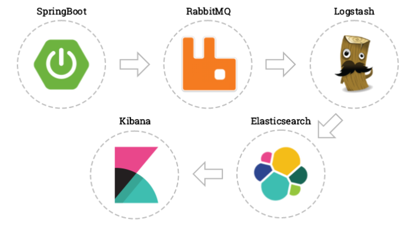
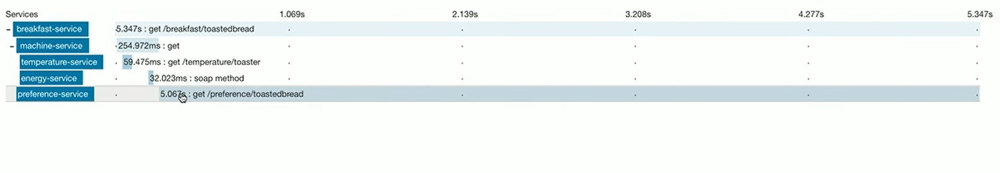
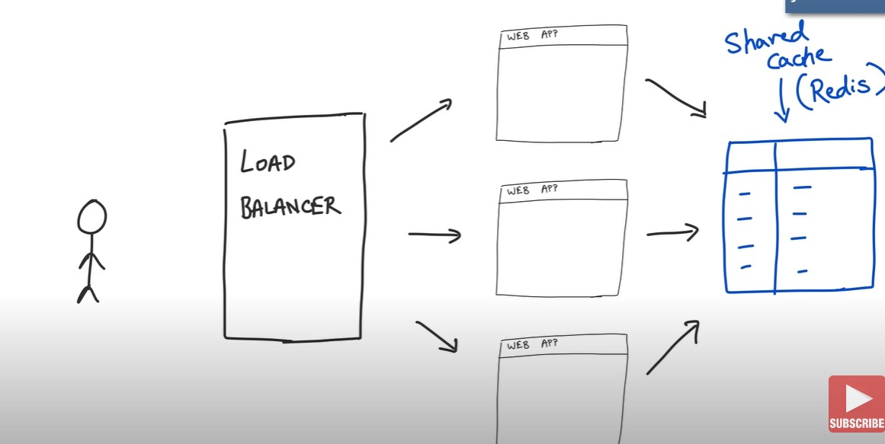
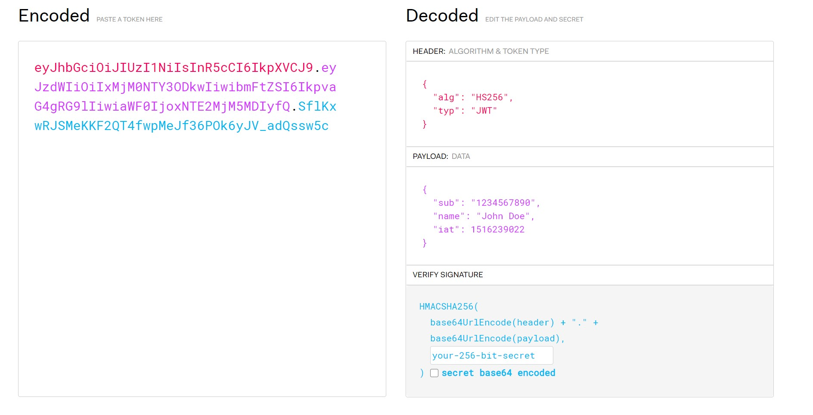
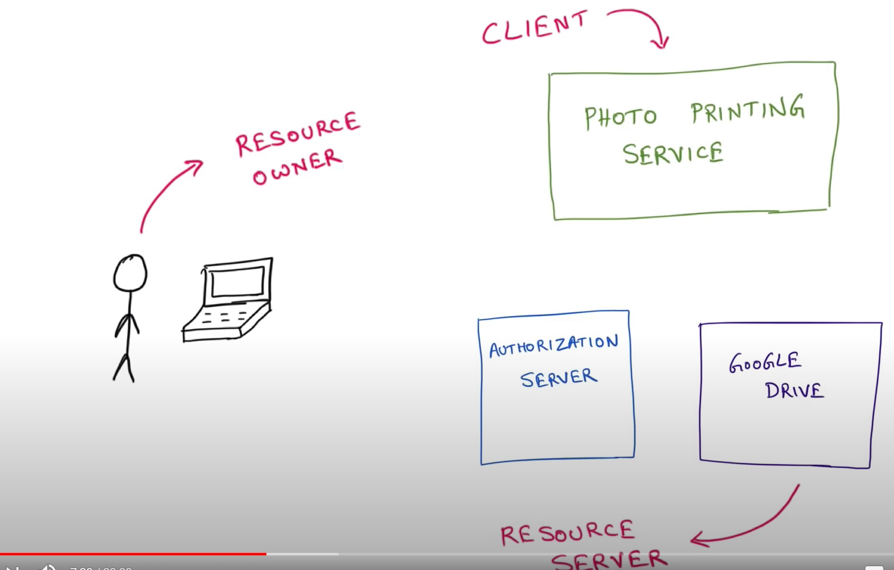

# Spring
-  powerful open source, application framework created to reduce the complexity of enterprise application development.
- pring framework is also called the framework of frameworks
# Spring Advantages
- Spring is just a dependency injection framework.
  - Makes classes free from headache of managing dependency
  - Helps writing testcases easier
- Additionally Spring focuses on the "plumbing" of enterprise applications so that teams can focus on application-level business logic, without unnecessary ties to specific deployment environments.
  - Reduce plumbing code of JDBC, JMS
  - Good integration with popular frameworks hibernate etc.

# Spring Boot Advantages
- Spring had a lot of configurations
  - Beans
  - Dispatcher Service, View Resolver, Error Handling etc.
- Shift to microservices, so quickly start developing applications
  - Spring boots makes it easy to create production grade application and deploy quickly.
  - It is spring with default configuration
  - It tries to auto configure a lot of stuff.
- Provides embedded server, health checks, security metrics etc.

# Inversion of Control In Spring
- One of the main features of the Spring framework is the IoC (Inversion of Control) container. The Spring IoC container is responsible for managing the objects of an application. It uses dependency injection to achieve inversion of control.
- The interfaces BeanFactory and ApplicationContext represent the Spring IoC container. Here, BeanFactory is the root interface for accessing the Spring container. It provides basic functionalities for managing beans.

## Auto Wiring
- Mechanism to perform dependency injection
- Spring resolve collaborators for your bean automatically by inspecting the contents of the BeanFactory.
### Modes of Auto Wiring
- no: This is default setting which means no autowiring.
- byName: It injects the object dependency according to name of the bean.
- byType: It injects the object dependency according to type.
- constructor: It injects the dependency by calling the constructor of the class.
- autodetect: First the container tries to wire using autowire by constructor, if it can’t then it tries to autowire by byType.

## Spring Container
- The Spring container is responsible for instantiating, lifecycle, configuring, and assembling the Spring beans.

### Types of IOC Containers in Spring
- BeanFactory and ApplicationContext and WebApplicationContext
#### Bean Factory
- This is the root interface for accessing the Spring container.
- Usually, the implementations use lazy loading, which means that beans are only instantiating when we directly calling them through the getBean() method.
- BeanFactory loads beans on-demand, while ApplicationContext loads all beans at startup. Thus, BeanFactory is lightweight as compared to ApplicationContext.
- Limited bean scopes only singleton and prototype
#### Application Context
- The ApplicationContext is the central interface within a Spring application that is used for providing configuration information to the application.
- It implements the BeanFactory interface. Hence, the ApplicationContext includes all functionality of the BeanFactory and much more! Its main function is to support the creation of big business applications.
- It uses eager loading
- It supports internationalization, annotation based dependency
#####  Responsibilities:
- Bean instantiation/wiring
- Managing Bean Lifecycle
  - Automatic BeanPostProcessor registration
    - ?
  - Automatic BeanFactoryPostProcessor registration
    - ?
- ApplicationEvent publication
  - ?
- Convenient MessageSource access
    - ?

#### Application Context Types
- AnnotationConfigApplicationContext
  - It can take classes annotated with @Configuration, @Component, and JSR-330 metadata as input.
- AnnotationConfigWebApplicationContext
  -  similar to AnnotationConfigApplicationContext, the only difference is it is build for web application. Spring by default calls XmlWebApplicationContext.
- XmlWebApplicationContext
    - loads context definition from an XML file contained within a web application.
- FileSystemXMLApplicationContext
  - loads context definition from an XML file in the filesystem.
- ClassPathXmlApplicationContext
  - loads context definition from an XML file located in the classpath

- Don't use any of these use spring boot which figures by itself.

## Library vs Framework
- The technical difference between a framework and library lies in a term called inversion of control.
- When you use a library, you are in charge of the flow of the application. You are choosing when and where to call the library. When you use a framework, the framework is in charge of the flow.

## DI vs IOC vs Service Locator
### IOC
- Inversion of Control is a principle in software engineering by which the control of objects or portions of a program is transferred to a container or framework.
- IoC is much more than object creation: a Spring Context or a Servlet Container not only create objects, but manage their entire lifecycle. That includes creating objects, destroying them, and invoking certain methods of the object at different stages of its lifecycle. These methods are often described as callbacks.
### DI 
- Dependency injection is a pattern through which to implement IoC, where the control being inverted is the setting of object's dependencies.
- DI is a form of IoC, where implementations are passed into an object through constructors/setters/service lookups, which the object will 'depend' on in order to behave correctly.
- Very useful for implmenting Unit Test cases.
- This helps you to follow SOLID’s dependency inversion and single responsibility principles.

## Types of DI
### Constructor Injection

#### Readability
- Constructors visually stand separate from methods.
#### Immutability (State cannot be modified after creation)
- Supports immutability.
#### State Safety ()
- In most cases all the injections are state safe since spring handles their creation, but if the object is created using new say, in a test framework there will be problems in other forms of injection
- Constructor Injection is state safe i.e The object is instantiated to a full state or is not instantiated at all.
-  You do not need any mocking library or a Spring context in unit tests. You can create an object that you want to test with the new keyword. Such tests are always faster because they not rely on the reflection mechanism.
#### Too Many Instance Fields (Actually an Advantage)
- People are more reluctant to add more dependencies to a constructor than via fields. 
#### Circulary Dependency
- Higher chance to have circular dependencies, so-called chicken-and-egg scenario.
#### Usage
```java
@Autowired
public DependentService(Service1 service1, 
            Service2 service2){
    this.service1 = service1;
    this.service2 = service2;
}
```
### Property Injection/ Field Injection
- Avoid field injection in most cases
#### Readability
- Less boilerplate code. Focus is on business logic.
- Easy to use, no constructors or setters required

#### Immutablity
- No immutability — the same as for setter injection.
#### State Safety
-  There is no valid way to set state of the object. Only option is to use Reflection to set the private fields. (for example in unit tests)
- You need the DI container to instantiate them, which makes your tests more like integration tests harder
- Your real dependencies are hidden from the outside and are not reflected in your interface (either constructors or methods)
#### Too Many Instance Fields 
- It is really easy to have like ten dependencies. If you were using constructor injection, you would have a constructor with ten arguments, which would signal that something is fishy. But you can add injected fields using field injection indefinitely. Having too many dependencies is a red flag that the class usually does more than one thing, and that it may violate the Single Responsibility Principle.
#### Usage
```java
@Autowired
private Service1 service1;
```
### Method Injection/ Setter Injection
- For optional or changeable dependencies, use setter injection
#### Readability
- Worst for readability, Takes away focus form business methods.
#### Immutability
- No immutability.
#### State Safety
- Consumer uses no-argument constructor. And possibility miss calling one of the setters or call same setter twice with different value (copy-paste bugs)
- Null checks are required, because dependencies may not be set at the moment.
#### Circular Dependency Problem (Not there)
- Flexibility in dependency resolution or object reconfiguration, it can be done anytime. Plus, this freedom solves the circular dependency issue of constructor injection.


```java
@Autowired
public void setService2(Service2 service2) {
    this.service2 = service2;
}
```
### Interface Injection
- Spring does not support it
# Modules of Spring
- There are around 20 modules


## Modules of Spring Core
### Spring Core
-  a key module that provides fundamental parts of the framework, like IoC or DI

### Spring Bean
### Spring Expression Language
### Spring Context 

## Data Access 
### JDBC
- this module enables a JDBC-abstraction layer that removes the need to do JDBC coding for specific vendor databases
### ORM
- provides integration layers for popular object-relational mapping APIs, such as JPA, JDO, and Hibernate
### OXM (Object XML Mapping)
### JMS (Java Messaging Service)
### Transactions

## Web
### Web
### Web MVC
- a web module implementing the Model View Controller design pattern
### Web Socket
### Web Portlet

## Aspect Oriented Programming
- Aspect Oriented Programming (AOP)
- Instrumentation
- Test
  - JUnit etc.

## Miscellaneous
- Messaging
- Aspects

# Configuration Spring Container

## XML-Based configuration
- Configure and defining beans using xml
```xml
<beans> 
    <bean id="hw" class="beans.HelloWorld" 
      init-method="init" destroy-method="destroy"/> 
</beans> 
```
```java
ClassPathXMLApplicationContext context = new ClassPathXMLApplicationContext("applicationContext.xml");
```

## Annotation-Based configuration
- Reduce the XML configuration
- You configure spring beans using annotation, but still use xml for defining beans.

## Java-based configuration
- No requirement for XML, use JAVA for configuring the container
- @Configuration annotated classes and @Bean annotated methods. 
```java
//In main
AnnotationConfigApplicationContext context = new AnnotationConfigApplicationContext(SportsConfiguration.class);

//Config file is Java File
//SportsConfig.java
@Configuration
@ComponentScan("com.manish.springtut")
public class SportConfig{

//This says the below method returns a bean
  @Bean
  public Coach swimCoach(){
      SwimCoach mySwimCoach = new SwimCoach();
      return mySwimCoach;
  }
   
}

```

# Annotations

## Spring Annotation

### @Autowired
- The @Autowired annotation provides more accurate control over where and how autowiring should be done.
- By default, it is a type driven injection

### @Qualifier
- NoUniqueBeanDefinitionException is thrown when more than one bean is there
- When you create more than one bean of the same type and want to wire only one of them with a property  you can use the @Qualifier annotation along with @Autowired to remove the ambiguity by specifying which exact bean should be wired.

  ```java
  @Component
  @Qualifier("fooFormatter")
  public class FooFormatter implements Formatter {
      //...
  }

  @Component
  @Qualifier("barFormatter")
  public class BarFormatter implements Formatter {
      //...
  }

  public class FooService {
      
      @Autowired
      @Qualifier("fooFormatter")
      private Formatter formatter;
  }
  ```
- Alternatively we can also perform the following
  ```java
  @Component("fooFormatter")
  public class FooFormatter implements Formatter {
      //...
  }

  @Component("barFormatter")
  public class BarFormatter implements Formatter{
    //....
  }

  @Component
  public class FooService{

    private Formatter formatter;

    @Autowired
    public FooService(@Qualifier("fooFormatter") Formatter formatter){

    }

  }

  ```

#### Autowiring by Name
Another way to decide between multiple beans when autowiring is by using the name of the field to inject. This is the default in case there are no other hints for Spring.
  ```java
  public class FooService {
      
      @Autowired
      private Formatter fooFormatter;
  }
  ```

### @Primary
- To deal with which bean to be injected, a primary annotation can also be used, to denote the primary bean which has to be injected in case of collision.
- It has less preference that the @Qualifier.

### @Configuration 
- indicates that the class is a source of bean definitions. 
- The class with @Configuration becomes the configuration class.
- Sample spring configuration class
- Configuration class has methods which contains how to create beans.
```java
@Configuration
public class SwaggerConfig {
    //Return a Bean of type Docket
    @Bean
    Docket getDocket(){
        return new Docket(DocumentationType.SWAGGER_2);
    }
}
```

### @Bean
- The method will return a bean.
- If we don't specify a custom name, the bean name will default to the method name.

### @ComponentScan
- While developing an application, we need to tell the Spring framework to look for Spring-managed components. @ComponentScan enables Spring to scan for things like configurations, controllers, services, and other components we define
- If no package is specified, then it considers the package of the class declaring the @ComponentScan annotation as the starting package
- the @ComponentScan annotation can also scan, detect, and register beans for classes annotated with @Component, @Controller, @Service, and @Repository.
-  Additionally, Component Scan searches the specified packages or classes annotated with @Configuration. Additionally, the Configuration classes can contain @Bean annotations, which register the methods as beans in the Spring application context.

### @EnableAutoConfiguration
- @EnableAutoConfiguration is used for auto-configuring beans present in the classpath in Spring Boot applications. it is different from component scan which scans the package.
-  it automatically creates and registers beans based on both the included jar files in the classpath and the beans defined by us.

### @Component
- This marks a java class as a bean. It is a generic stereotype for any Spring-managed component. The component-scanning mechanism of spring now can pick it up and pull it into the application context.

#### @Component vs @Bean
- It is perfectly valid to have Java configuration and annotated component scans in the same project because they server different purposes.
- @Component (@Service,@Repository etc) are used to auto-detect and auto-configure beans.
- @Bean annotation is used to explicitly declare a single bean, instead of letting Spring do it automatically.
- You can do the following with @Bean. But, this is not possible with @Component
  ```java
  @Bean
  public MyService myService(boolean someCondition) {
      if(someCondition) {
        return new MyServiceImpl1();
      }else{
          return new MyServiceImpl2();
      }
  }
  ```

### @Controller 
- This marks a class as a Spring Web MVC controller. 
- Doesn't have responseBody in it.
- Controller is also a Component.

### @Service

### @Repository
- This annotation is a specialization of the @Component annotation with similar use and functionality. It provides additional benefits specifically for DAOs.
- Component which interacts with DB.

### @RestController
  - Tell Spring the current class is a rest controller
  - It has ResponseBody annotation in it so the response will be directly sent back to browser and not to view resolver.

### @RequestMapping
- Specify the url and method which will trigger the below method
- Can specify the common path using @RequestMapping
```java
@RestController
@RequestMapping("/user")
public class UserController{
  @GetMapping("/{id}/name")
  ....
}
```

### @GetMapping
- Specify the url which will trigger the below method

### @PathVariable
- Retrieves values straight from he URI
```java
//http://localhost:8080/book/9783827319333
@RequestMapping(value="/book/{ISBN}", method= RequestMethod.GET)
public String showBookDetails(@PathVariable String ISBN)
```

### @RequestParameter
- Retrieves value corresponding to query parameter
```java
// Request will be like http://localhost:8080/eportal/orders?id=1001
@RequestMapping("/orders")
public String showOrderDetails(@RequestParam("id") String orderId)
```
- Optional parameters required, defaultValue
```java
// Request will be like http://localhost:8080/eportal/orders?id=1001
@RequestMapping("/orders")
public String showOrderDetails(@RequestParam("id") String orderId,
                                @RequestParam(required=false, defaultValue="day") String time)
```
### @RequestBody


### @ResponseBody
- the response will be directly sent back to browser and not to view resolver.

### @Response Status

### @ControllerAdvice

### @Import 

### @JsonIgnore

### @Resource
- @Resource means get me a known resource by name. 
- Sort of like @Qualifier + @Autowired
- Part of JSR, useful if you want to use something else in future.

### @Injection
- Similar to @Autowired 
- Part of JSR

### @ConfigurationProperties

### @Required

### @Import

### @ImportResource

### @Profile

## Spring Boot Annotations

### @SpringBootApplication
- Decorates the main class of the Spring Boot Application
- It is a combination of @Configuration, @EnableAutoConfiguration, and @ComponentScan with their default attributes:
```java
@SpringBootApplication
public class CurrencyExchangeServiceApplication {
	public static void main(String[] args) {
		SpringApplication.run(CurrencyExchangeServiceApplication.class, args);
	}
}
```

## JPA Annotations
- See java_microservies.md

# Spring Beans

## Bean vs Servlet vs POJO

### POJO
- A POJO has no naming convention for our properties and methods.
- But, we aren't following any real convention for constructing, accessing, or modifying the class's state.
- This class can be used by any Java program as it's not tied to any framework

### Bean
- Spring beans are Java objects that are managed by the Spring container.
- All JavaBeans are POJOs but not all POJOs are JavaBeans.
- A JavaBean is basically a Java class which satisfies a few simple rules
  - Serializable i.e. they should implement Serializable interface. Still, some POJOs who don’t implement Serializable interface are called POJOs because Serializable is a marker interface and therefore not of much burden.
  - Fields should be private. This is to provide the complete control on fields. Since if the field is not private anyone can change it to invalid value.
  - Fields should have getters or setters or both.
  - ### A no-arg constructor should be there in a bean.
  - Fields are accessed only by constructor or getter setters.
  - Getters and Setters have some special names depending on field name. For example, if field name is someProperty then its getter preferably will be ```getSomeProperty()```
  - If you don't have getters and setters in the Bean you will face a response.

### Servlet
- a servlet specifically subclasses javax.servlet.Servlet and/or javax.servlet.http.HttpServlet and implements one or more of the doXXX methods.

## Bean Scope
- Default Scope is Singleton

### @Scope
```java
@Component
//This statement is redundant - singleton is default scope
@Scope("singleton")  //This statement is redundant
public class BeanClass {
}

//Can also decorate the @Bean methods
@Bean
@Scope(value="prototype")
  public MyBean myBean() {
  return new MyBean();
}

```

### @RequestScope
- Alternative to @Scope("request")

### Additional Scopes


### Request vs Session Scope
- if the bean scope is request and, a user makes more than one request for a web page in his user session, then on every request a new bean would be created.

## Bean Lifecycle Methods/Hooks

### Steps
- Within IoC container, a spring bean is created using class constructor.
- Now the dependency injection is performed using setter method.
- Now the IoC container calls BeanPostProcessor.postProcessBeforeInitialization on the bean.
- Now the method annotated with @PostConstruct is called.
- After @PostConstruct, the method InitializingBean.afterPropertiesSet() is called
- Now the method specified by init-method attribute of bean in XML configuration is called.
- And then BeanPostProcessor.postProcessAfterInitialization() is called. It can also be used to apply wrapper on original bean.
- Now the bean instance is ready to be used. Perform the task using the bean.
- Now when the ApplicationContext shuts down such as by using registerShutdownHook() then the method annotated with @PreDestroy is called.
- After that DisposableBean.destroy() method is called on the bean.
- Now the method specified by destroy-method attribute of bean in XML configuration is called.
- Before garbage collection, finalize() method of Object is called.

- The custom method can not accept any arguments. The method should be no-arg.
- For "prototype" scoped beans, Spring does not call the destroy method.

### BeanPostProcessor (Before and After Initialization)
- Will be defined for all the registered beans, not just a specific bean, for every type of bean.
- Not part of the bean itself, another class
- Useful to implement AOP/Transaction etc.
- Take the bean and name of the bean as input
- Spring expects you to return the object back 
```java
@Component
public class CustomBeanPostProcessor implements BeanPostProcessor 
{
    public Object postProcessBeforeInitialization(Object bean, String beanName) throws BeansException 
    {
        System.out.println("Called postProcessBeforeInitialization() for :" + beanName);
        return bean;
    }
     
    public Object postProcessAfterInitialization(Object bean, String beanName) throws BeansException 
    {
        System.out.println("Called postProcessAfterInitialization() for :" + beanName);
        return bean;
    }
}
```

### PreConstruct and PreDestroy
```java
public class DemoBean 
{
    @PostConstruct
    public void customInit() 
    {
        System.out.println("Method customInit() invoked...");
    }
     
    @PreDestroy
    public void customDestroy() 
    {
        System.out.println("Method customDestroy() invoked...");
    }
}
```

### DisposableBean and InitializingBean Interfaces
- Not recommended, use @PreDestroy and @PreConstruct Instead
- we need to implement our bean with two interfaces namely InitializingBean, DisposableBean
- will have to override afterPropertiesSet() and destroy() method.
```java
// Java program to create a bean 
// in the spring framework 
package beans; 
  
import org.springframework 
    .beans.factory.DisposableBean; 
  
import org.springframework 
    .beans.factory.InitializingBean; 
  
// HelloWorld class which implements the 
// interfaces 
public class HelloWorld 
    implements InitializingBean, 
 DisposableBean { 
  
    @Override
    // It is the init() method 
    // of our bean and it gets 
    // invoked on bean instantiation 
    public void afterPropertiesSet()  
throws Exception 
    { 
        System.out.println( 
            "Bean HelloWorld has been "
            + "instantiated and I'm the "
            + "init() method"); 
    } 
  
    @Override
    // This method is invoked 
    // just after the container 
    // is closed 
    public void destroy() throws Exception 
    { 
        System.out.println( 
            "Conatiner has been closed "
            + "and I'm the destroy() method"); 
    } 
} 
```
## Lazy initialization in Spring
- By default in Spring, all the defined beans, and their dependencies, are created when the application context is created.
- @RestControllerIn contrast, when we configure a bean with lazy initialization, the bean will only be created, and its dependencies injected, once they're needed.
- Lazy initialization may reduce the number of beans created when the application is starting – therefore, we can improve the startup time of the application
### Over Configuration Class
- When we put @Lazy annotation over the @Configuration class, it indicates that all the methods with @Bean annotation should be loaded lazily.
```java
@Lazy
@Configuration
public class AppConfig{

}
```

### With @Autowired
- To lazily autowire a bean, we need to both decorate the bean and it's reference as lazy.
- the @Lazy is mandatory in both places.
- the City bean is initialized only when we call the getCityInstance() method.
  ```java
  @Lazy
  @Component
  public class City {
      public City() {
          System.out.println("City bean initialized");
      }
  }

  public class Region {

      @Lazy
      @Autowired
      private City city;

      public Region() {
          System.out.println("Region bean initialized");
      }

      public City getCityInstance() {
          return city;
      }
  }
  ```


# MVC
- The MVC pattern helps in separating the different aspects of the application like input logic, business logic and UI logic, while providing a loose coupling between all these elements.

## Controller
- Accepts input and converts it to commands for the model or view.
- A controller determines what response to send back to a user when a user makes a browser request, which services to call and also validation logic.
-  the controller invokes a business class to process business-related tasks, and then redirects the client to a logical view name, which is resolved by Spring's dispatcher servlet in order to render results or output.

## Dispatcher Servlet
- It is the front controller
- Looks at the url and sends to the right controller and method.
- Also sends the response to view resolver if required if there is no response body.
- Handles all the requests

## View Resolver
- The View Resolver class resolves the view component to be invoked for the request.

## Dispatcher Servlet vs Request Dispatcher

# Aspected Oriented Programming
- Aspects enable the modularization of cross-cutting concerns such as transaction management that span multiple types and objects by adding extra behavior to already existing code without modifying affected classes.
- For isolating cross cutting concerns into separated classes say Logging, Transactions, Security etc.

## Steps to perform AOP
- Write Aspects
- Configure where aspects have to work

## Aspect
- Aspect is just a class with additional annotations
- Aspect has multiple Advices
- The Aspect should be configured as a bean, say using @Component

## Advice
- Advice are configured to run before or after a method run.
- Advice is not called when spring calls the getter and setter initially.
### Advice Types
- Before
- After
- AfterReturning
- AfterThrowing
- Around

## Before
- Standard AOP Annotation that is used to make advice method run before target
- It is applied on advice method and contains parameter for the target method.

```java
@Aspect
@Component
public class LoggingAspect{
//Logging Advice will run before the execution of getName().
  @Before("execution(public String getName())")
  public void loggingAdvice(){
    System.out.println("Advice ran, GET Method Called");
  }
}
```
- The above advice will run on getName() of any class, so we need to provide information of class  to restrict it. To do that we need to provide the package and class information inside the parameter so Spring can distinguish it from other classes.
```  @Before("execution(public String org.manish.aop.model.Circle.getName())")```


## PointCut
- Pointcut is expression language of Spring AOP.

### PointCut Expression
#### Execution
- Expression represents a method
- ```"execution(public String getName())"```
  - Executed before the execution of getName(). 
- ```execution(* * org.manish.aop.model.Circle.*(..))```
  - Executed for all methods of Circle class
#### Within
- Expression represents a class
- ```within(org.manish.aop.model.Circle)```
  - Same as above
  - More readable than above
- ```within(org.manish.aop.model..*)```
  - Applies to all the classes in root package or subpackage
#### Args
- Represents method arguments, catch methods which has these argument types.
  ```args(String)```
  - Applies to all methods which take a single string argument.

#### Target

#### Annotation
- Applies the advice to all the methods which has the annotation
- You can define custom annotation and mark the method wherever you want the advice to run.
- You don't need strict naming convention if you choose this approach
```java
public @interface Loggable{}

public class ShapeService{
  @Loggable
  public Circle getCircle(){
    return circle;
  }
}

//In Aspect
@Around("@annotation(org.manish.aop.Loggable)")
public Object myAroundAdvice(ProceedingJoinPoint pJP){
  ....
}

```

### WildCards
- Applying one advice across different methods or points
- In the above case the first example, the single advice was applied to different methods.
- Let us take some examples
#### Apply Advice to all Getters irrespective of return type.
- Apply the advice to all methods no matter the return type and which starts with get and doesn't take any parameter.
```  @Before("execution(public * get*())")```
- Apply the advice to all methods no matter the return type and which starts with get and takes an argument.
```  @Before("execution(public * get*(*))")```
- Apply the advice to all methods no matter the return type and which starts with get and irrespective of arguments.
```  @Before("execution(public * get*(..))")```
- ```*``` is for one or more 
- ```..``` is for zero or more


### @PointCut
- If multiple advices uses the same expression you can just specify the expression as pointcut annotation and then use it everywhere else.
- It needs a dummy method, which holds the pointcut expression
- Helps in keeping the code DRY.
  ```java
  @PointCut("execution(* get*(..))")
  public void allGetters(){}


  @Before("allGetters()")
  public void loggingAdvice(){
    System.out.println("Advice ran, GET Method Called");
  }

  @Before("allGetters()")
  public void secondAdvice(){
    System.out.println("Second Advice ran, GET Method Called");
  }
  ``` 

#### Combining Point Cut Expression
- Saw we need all getters inside Circle Class
  ```java
    @Before("allGetters() && allCircleMethods()")
    public void loggingAdvice(){
      System.out.println("Advice ran, GET Method Called");
    }

    @PointCut("within(org.manish.aop.model.Circle)")
    public void allCircleMethods(){}

    @PointCut("execution(* get*(..))")
    public void allGetters(){}
  ``` 

## JOIN POINT
- Get the information about which method triggered the advice.
- JoinPoint is any point in your program such as field access, method execution, exception handling which triggers the Advice.
- All places in your code which can trigger an Advice
  - In Spring only methods are Join Points
  - But in Aspectj we can have multiple other types of join points(such as field access, method execution, exception handling etc), say we want an advice to trigger everytime a member variable changes even without using setter.
  ```java
  @Before("allCircleMethods()")
  public void loggingAdvice(JoinPoint joinPoint){
    System.out.println("Advice ran, GET Method on " + joinPoint.getTarget());
  }
  ```

## Advice Arguments
- Say we have an advice which runs when a method with single String argument runs, and we want to log that specific argument
- We not only tell spring that we want the same argument that was passed to the target method, but also we tell it is of type String. 
```java
@Before("args(name)")
public void stringArgumentMethodAdvice(String name){
  System.out.println(name);
}
```

### getTarget
- Very powerful, returns the object which triggered the advice, in the above case return the circle object which triggered the method call.

## After
- Runs after the target method, no matter if the execution completes or not.

## AfterReturning
- Runs after the target method returns successfully, not run if there is an exception.
### Get the return object
```java
@AfterReturning(pointcut="args(String)", returning ="returnVal")
public void stringArgumentAdvice(String returnVal){
  System.out.println("The returned string is " + returnVal);
}
```

## AfterThrowing
- Runs after the target method throws an exception.
```java
@AfterReturning(pointcut="args(String)", throwing ="ex")
public void stringArgumentAdvice(RunTimeException ex){
  System.out.println("The exception is " + ex);
}
```

## Around
- Need a Compulsory Argument, ProceedingJoinPoint
- We can control the execution of target method, by say checking a boolean value.
- In case the target methods returns a value, we also need to return in the advice.
- We can also modify the return value.
```java
@Around("allGetters()")
public Object myAroundAdviceForGetters(ProceedingJoinPoint pJP){
  Object returnVal = null;
  try{
    System.out.println("Before execution");
    returnVal = pJP.proceed();// This is where the target method execution takes place.
    System.out.println("After Returning");

  }
  catch(ex){
    System.out.println("After Throwing");
  }
  return returnVal;
}
```
## interceptor
- Interceptor is a class like aspect that contains one advice only.

## Weaving
- weaving is a process that links aspects with other application types or objects to create an advised object. This can be done at compile time, load time, or at runtime. Spring AOP, like other pure Java AOP frameworks, performs weaving at runtime.

## AOP Proxy
- an object created by the AOP framework in order to implement the aspect contracts (advise method executions and so on). In the Spring Framework, an AOP proxy will be a JDK dynamic proxy or a CGLIB proxy.
- Spring AOP actually manages the beans's proxy i.e SomeComponentSecond bean actually gets enhanced to Proxy Object : SomeComponentSecond$$EnhancerBySpringCGLIB.
- It is using this Proxy, spring implements the Before Advice, After and Around Advice.
- A Proxy object is an object which inherits the target Object and adds functionality to it by overriding it's methods. [Link for reference](https://www.youtube.com/watch?v=yiinKulgm4U&list=PLE37064DE302862F8&index=12)

# Design Patterns in Spring
- Singleton Pattern: Singleton-scoped beans
- Factory Pattern: Bean Factory classes
- Prototype Pattern: Prototype-scoped beans
- Adapter Pattern: Spring Web and Spring MVC
- Proxy Pattern: Spring Aspect Oriented Programming support
- Template Method Pattern: JdbcTemplate, HibernateTemplate, etc.
- Front Controller: Spring MVC DispatcherServlet
- Data Access Object: Spring DAO support
- Model View Controller: Spring MVC


# AutoConfiguration
- Looks at the classes and jar in class path and configures different classes, like JacksonObjectMapper(Json to object and vice versa), error configuration, dispatcher servlet. 

# REST USING SPRING BOOT

## Response Entitiy Object
- ResponseEntity represents the whole HTTP response: status code, headers, and body
- we specify the response status programmatically
- we can set HTTP headers
- provides two nested builder interfaces: HeadersBuilder and its subinterface, BodyBuilder. Therefore, we can access their capabilities through the static methods of ResponseEntity.

## Return a JSON Object
- Automatically handled by jackson json
- ### The returned Object has to be a valid Spring Bean, i.e with public setters and getters else there will be exception

## Submit Url Parameters in Spring Boot
- You need to use ```@PathVariable``` annotation.
- Your route should also have the variable with same name, else you will get error in the response.
```java
  @GetMapping(path = "/hello-world-bean/user/{yourName}")
  public HelloWorldBean helloWorldBeanPathVariableExample(@PathVariable String yourName){
      return new HelloWorldBean("Hello World Bean" + yourName);
  }
```

## Throw Exception in Spring Boot
- You should implement the RuntimeException which is an unchecked exception.
- Also to get 404 Error Code Add the ResponseStatus Annotion in the Exception
```java

@ResponseStatus(HttpStatus.NOT_FOUND)
public class UserNotFoundException extends RuntimeException {
    public UserNotFoundException(String s) {
        super(s);
    }
}

@GetMapping("/users/{id}")
public User getUser(@PathVariable Integer id){
    User user = userService.findUser(id);
    if(user == null){
        throw new UserNotFoundException("id : " + id);
    }
    return user;
}
```

### Consistent Exception Format across all services.
- For Proper exception Handling we need to ensure
  - We have proper custom exceptions per error (which extend the runtime exception) with proper response code
  - We have consistent structure for each exception
  - We have a global exception handler class/controller which is shared across the controllers.
#### First Step : Defining consistent Exception Structure
- Create a class with all the information you want say timestamp, details and exception title.
- This class will be the standard for all the exception across all the services.
- This structure should also be independent of the language used.
```java
public class ExceptionResponse {
    private Date timestamp;
    private String message;
    private String details;

    public ExceptionResponse(Date timestamp, String message, String details) {
        this.timestamp = timestamp;
        this.message = message;
        this.details = details;
    }

    public Date getTimestamp() {
        return timestamp;
    }

    public String getMessage() {
        return message;
    }

    public String getDetails() {
        return details;
    }
}
```
#### Second Step : Defining the Handler
##### @ControllerAdvice
- Applies the Class that is exposed to all the controllers.
- Specialization of @Component for classes that declare @ExceptionHandler, @InitBinder, or @ModelAttribute methods to be shared across multiple @Controller classes.
##### ResponseEntityExceptionHandler

- A convenient base class for @ControllerAdvice classes that wish to provide centralized exception handling across all @RequestMapping methods through @ExceptionHandler methods.
- Have custom Handler methods per exception for proper response status 400, 403,404, 500 etc.
```java
@ControllerAdvice
@RestController
public class CustomizedResponseEntityExceptionHandler
    extends ResponseEntityExceptionHandler {

    //The below annotation means apply for all the exceptions
    @ExceptionHandler(Exception.class)
    public ResponseEntity<Object> handleAllException(Exception ex, WebRequest request) throws Exception {
        //Takes an exception and returns the instance of our specific bean i.e Exception Response defined above
        ExceptionResponse exceptionResponse = new ExceptionResponse(new Date(), ex.getMessage(),request.getDescription(false));
        return new ResponseEntity(exceptionResponse, HttpStatus.INTERNAL_SERVER_ERROR);
    }

    //Customize the response per exception
    @ExceptionHandler(UserNotFoundException.class)
    public ResponseEntity<Object> handleUserNotFoundException(Exception ex, WebRequest request) throws Exception {
        //Takes an exception and returns the instance of our specific bean i.e Exception Response defined above
        ExceptionResponse exceptionResponse = new ExceptionResponse(new Date(), ex.getMessage(),request.getDescription(false));
        return new ResponseEntity(exceptionResponse, HttpStatus.NOT_FOUND);
    }
}
```


## Validation in Spring Boot
- Use @Valid annotation
```java
public ResponseEntity createUser(@Valid @RequestBody User user)
```
 with following constraints
```java
@Size(min=2)
private String name;

@Past
private Date birthDate;

@NotEmpty(message = "email must not be empty")
@Email(message = "email should be a valid email")
private String email;

```
- Following are the various constraints


## Create a object with Spring Boot
- You need to use ```@RequestBody``` annotation
- It is best practise to return the URI of the created resource, no need to send all the information related to created user since that just wastes the bandwidth.
- To just send the URI of the created resource, we can send the URI in the location portion of the header.
- To perform this you need to return the location information in the ResponseEntity Object. It has a created method which expects a URI, you can create the URI using the ServletUriComponentBuilder;
```java
@PostMapping("/users")
public ResponseEntity createUser(@RequestBody User user){
    User savedUser = userService.save(user);

    URI location = ServletUriComponentsBuilder.fromCurrentRequest()
            .path("/{id}")
            .buildAndExpand(savedUser.getId()).toUri();

    return ResponseEntity.created(location).build();
}
```

## Monitoring APIs
- Using Spring Actuator and HAL Explorer
- Lots of useful metrics and properties about the Spring Application
  - All the created Beans
  - health checks
  - Postive and Negative match on condition for Auto Configuration
  - Environment
  - Heap Dump
  - Thread Dump
  - Metrics
    - Amount of memory used etc.
    - CPU Usage
    - JDBC Connections Active
    - GC Information

## Swagger API Documentations
- You can document the API for the consumers in a very structured way using swagger.
- It also enables you to document the constraints on the properties expected by each API.
- Document the request type which are accepted (json/xml) and also the response type (json/xml)


## Hypermedia as the engine of application state (HATEOS)


## Content Negotiation is the ability to send both xml and json responses
  - Use jackson xml

## Filter the attributes to be sent in the response
### Static Filtering
- You can decorate some fields as ```@JsonIgnore``` so they won't be sent in the response as a JSON Object, like say a password field
- Be careful there are multiple implementation of JsonIgnore, use fasterxml.jackson
```java
import com.fasterxml.jackson.annotation.JsonIgnore;
public class SomeBean {
    private String one;

    @JsonIgnore
    private String three;

    public SomeBean(String value1, String value3) {
        one = value1;
        three = value3;
    }

    public String getOne() {
        return one;
    }

    public void setOne(String one) {
        this.one = one;
    }

    @JsonIgnore
    public String getThree() {
        return three;
    }

    public void setThree(String three) {
        this.three = three;
    }
}
```
### Dynamic Filtering based on the request.


## Versioning

### URL Based Versioning
- Polluting URL Space
- Documentation is easier
#### URI Based Versioning
```java
@GetMapping("/v1/person")
PersonV1 getPersonVersion1(){
    return new PersonV1("Manish Madugula");
}

@GetMapping("/v2/person")
PersonV2 getPersonVersion2(){
    return new PersonV2(new Name("Manish","Madugula"));
}
```
#### Parameter Based Versioning
```java
@GetMapping(value = "/person", params = "version=v1")
PersonV1 getPersonVersion1Param(){
    return new PersonV1("Manish Madugula");
}

@GetMapping(value="/person", params = "version=v2")
PersonV2 getPersonVersion2Param(){
    return new PersonV2(new Name("Manish","Madugula"));
}
```


### Header Based Versioning
- Misuse of HTTP Header
- Caching is not straightforward, since we also need to look at header and do complicated stuff with it, not simply see if URL are same
- Cannot execute directly in browser, need POSTMAN etc.
#### X-API-VERSION
```java
@GetMapping(value = "/person", headers = "X-API-VERSION=v1")
PersonV1 getPersonVersion1XAPI(){
    return new PersonV1("Manish Madugula");
}

@GetMapping(value="/person", headers = "X-API-VERSION=v2")
PersonV2 getPersonVersion2XAPI(){
    return new PersonV2(new Name("Manish","Madugula"));
}
```
#### Accept Header/Produces Param/MIME Type Versioning/Media type Versioning/Content Negotaition
```java
@GetMapping(value = "/person", produces = "application/com.madmanish.restfulwebservices-v1+json")
PersonV1 getPersonVersion1ContentNegotation(){
    return new PersonV1("Manish Madugula");
}

@GetMapping(value="/person",  produces = "application/com.madmanish.restfulwebservices-v2+json")
PersonV2 getPersonVersion2ContentNegotation(){
    return new PersonV2(new Name("Manish","Madugula"));
}
```

## Logging
- Use SLF4J as a Facade so your library can be independent of any actual library which is used.
- Logback is slightly more popular
- But Log4J2 has better features like Lazy loading messages with lamdas and Async logging.
- Proper logging framework lets you assign categories to logs, decide where the log goes(file, console, database, mail etc) so they are better than System.out.println
- Spring Boot uses LogBack.
- Lets you add additional patterns before and after the log like timing information etc.
### SF4J
- Default loglevel is info, any thing below info doesn't show by default
- The logging levels used are ERROR, WARN, INFO, DEBUG, TRACE
- LoggerFactory to get the actual Logger.
#### Parameterized logging
- You can use placeholder as below
  ```java
  Logger logger = LoggerFactory.getLogger(SomeRandomClass.class)

  //we can then call logger as follows
  logger.info("At the age of {} ramu got his first job as a {} at {}", age, designation, company);
  ```

# Spring CLOUD
- Provides a range of solution for configuration management, service discovery, circuit breakers, intelligent routing, control bus, one time token, global locks, leader election, distributed sessions, cluster state, microproxy and other cross cutting concerns. 

## Microservices
- RESTFUL
- Small well chosen deployable units with well defined bounded contexts.
- Cloud Enabled, scale well
- Decoupled so can swap various components and not affect the entire system if contracts are respected.
- Adaption of new technologies easily
- Dynamic Scaling and cost efficiency
- Faster Release Cycles

### Challenges
- Choosing Bounded Contexts
- Service Discovery (Eureka)
- Configuration Management (Spring Cloud Configuration Server)
  - We have multiple microservices and multiple instances in each environments and multiple environments, so lots of configurations
- Dynamic Scale up and scale down. (Ribbon Load Balancing)
- Visibility 
  - Monitoring the microservices (Netflix API Gateway)
  - Centralized logging (Zipkin Distributed Tracing)
  - Debugging
- Cascading Failures/ Fault Tolerance (Hystrix and Resilence4j)

## Good practises
### Configuration-
- setup application name and server.port

## Dynamic Port in the response
- Spring provides Environment Bean, which can extract environment variables.

## Configuration
- Use Spring Cloud Configuration Server
- Spring Cloud Configuration Client in all the microservices and there is one Spring Cloud Configuration Server

### Spring Cloud Configuration Server
- Spring Cloud Configuration Server has the location of a git repository with all the configurations : service.properties, service-dev.properties, service-qa.properties etc for each environment.
- It also has @EnableConfigServer annotation along with maven dependency


### Spring Cloud Configuration Client
- There is a Spring Component in each microservice which holds all the configuraiton information it gets from the config server.
- Sample Configuration File in Client
  ```java
    import org.springframework.boot.context.properties.ConfigurationProperties;
    import org.springframework.stereotype.Component;

    @Component
    @ConfigurationProperties("limits-service")
    public class Configuration {
      private int minimum;
      private int maximum;

      public int getMinimum() {
        return minimum;
      }

      public void setMinimum(int minimum) {
        this.minimum = minimum;
      }

      public int getMaximum() {
        return maximum;
      }

      public void setMaximum(int maximum) {
        this.maximum = maximum;
      }

    }
  ```
- This component is then injected wherever the configuration has to be used.
## Cloud Bus
- Using cloud bus you can push configuration changes to the system without restart. 
- Spring Cloud Bus links nodes of a distributed system with a lightweight message broker. This can then be used to broadcast state changes (e.g. configuration changes) or other management instructions.

## Run multiple instances of the same service in intelliJ/Eclipse
- Add a duplicate configuration and in the VM Properties provide ```-Dserver.port=some_custom_port``` and so on.


## Call another microservice from inside one microservice REST

### Using RestTemplate
- The RestTemplate class is designed on the same principles as the many other Spring Template classes (e.g., JdbcTemplate, JmsTemplate ), providing a simplified approach with default behaviors for performing complex tasks.
```java
private static void getEmployees()
{
    final String uri = "http://localhost:8080/springrestexample/employees";
    //TODO: Autowire the RestTemplate in all the examples
    RestTemplate restTemplate = new RestTemplate();
    String result = restTemplate.getForObject(uri, String.class);
    System.out.println(result);
}
```

#### GET
- getForObject() : returns the representation found in the response as given class type.
- getForEntity() : returns the response as ResponseEntity. (See post example)
```java
private static void getEmployeeById()
{
    final String uri = "http://localhost:8080/springrestexample/employees/{id}";
    RestTemplate restTemplate = new RestTemplate();
    Map<String, String> params = new HashMap<String, String>();
    params.put("id", "1");
    EmployeeVO result = restTemplate.getForObject(uri, EmployeeVO.class, params);
    //Use the result
}
```

#### POST 
- postForObject(url, request, classType)
- postForEntity(url, request, responseType) 
- postForLocation(url, request, responseType) (returns the value of the Location header.)
```java
private static void createEmployee()
{
    final String uri = "http://localhost:8080/springrestexample/employees";
    RestTemplate restTemplate = new RestTemplate();
    EmployeeVO newEmployee = new EmployeeVO(-1, "Adam", "Gilly", "test@email.com");
    EmployeeVO result = restTemplate.postForObject( uri, newEmployee, EmployeeVO.class);
    System.out.println(result);
}
```

#### PUT API
- put(url, request, params)

#### DELETE API
- delete(url, params)


### Feign Client (Preferred Way)
- Declarative rest client
- Feign is a declarative web service client. It makes writing web service clients easier. To use Feign create an interface and annotate it. 
#### Steps to include
- Add @EnableFeignClients in the main application which annotates @SpringBootApplication
- Implement the FeignRestClient Interface
  ```java
  @FeignClient(name="stores", url="/stores") // Name is used to create a Ribbon load Balancer
  public interface StoreClient {
      @RequestMapping(method = RequestMethod.GET, value = "/stores")
      List<Store> getStores();

      @RequestMapping(method = RequestMethod.POST, value = "/stores/{storeId}", consumes = "application/json")
      Store update(@PathVariable("storeId") Long storeId, Store store);
  }
  ```
### WebClient 
- Asynchronous Alternative to RestTemplate

## Using Spring Kafka
- We can use spring kafka to produce and consume messages to the topic
### Producer
#### Configuration
- The below configuration is used to tell kafka that our topic will be a string and the message will be of type JSON.
- To be a producer, we need to configure the ProducerFactory.
- We need to provide configuration to topic type, message type and the kafka broker server url.
```java
@Configuration
public class KakfaConfiguration {
    @Bean
    public ProducerFactory<String, User> producerFactory() {
        Map<String, Object> config = new HashMap<>();
        config.put(ProducerConfig.BOOTSTRAP_SERVERS_CONFIG, "127.0.0.1:9092");
        config.put(ProducerConfig.KEY_SERIALIZER_CLASS_CONFIG, StringSerializer.class);
        config.put(ProducerConfig.VALUE_SERIALIZER_CLASS_CONFIG, JsonSerializer.class);
        return new DefaultKafkaProducerFactory<>(config);
    }
    @Bean
    public KafkaTemplate<String, User> kafkaTemplate() {
        return new KafkaTemplate<>(producerFactory());
    }
}
```
#### KafkaTemplate
- Then once the kafka Template is configured, we can use it in the controller class, by autowiring kafkaTemplate.
  ```java
  kafkaTemplate.send(TOPIC, new User(name, "Technology", 12000L));
  ```
### Consumer
#### Configuration
- Similar to Producer example, we need to configure the ConsumerFactory in case of Consumer Example. One difference is we also have to tell the KafkaConsumerFactory what object to deserialize key and message to. (String.class and User.class)
- Instead of KafkaTemplate in case of Producer, here we use ConcurrentKafkaListenerContainerFactory to consume the event handler.
- This ContainerFactory will produce the Listeners wherever they are required to be injected.
- We also need to use @EnableKafka annotation to tell spring to look for KafkaListeners.
```java
@EnableKafka
@Configuration
public class KafkaConfiguration {
   @Bean
    public ConsumerFactory<String, User> userConsumerFactory() {
        Map<String, Object> config = new HashMap<>();

        config.put(ConsumerConfig.BOOTSTRAP_SERVERS_CONFIG, "127.0.0.1:9092");
        config.put(ConsumerConfig.GROUP_ID_CONFIG, "group_json");
        config.put(ConsumerConfig.KEY_DESERIALIZER_CLASS_CONFIG, StringDeserializer.class);
        config.put(ConsumerConfig.VALUE_DESERIALIZER_CLASS_CONFIG, JsonDeserializer.class);
        return new DefaultKafkaConsumerFactory<>(config, new StringDeserializer(),
                new JsonDeserializer<>(User.class));
    }

    @Bean
    public ConcurrentKafkaListenerContainerFactory<String, User> userKafkaListenerFactory() {
        ConcurrentKafkaListenerContainerFactory<String, User> factory = new ConcurrentKafkaListenerContainerFactory<>();
        factory.setConsumerFactory(userConsumerFactory());
        return factory;
    }
}
```
#### Kafka Listeners / Event Handlers
- Here we can configure our listener and provide our own custom listener in the containerFactory parameter of @KafkaListener annotation.
- We also provide the groupId and topicId.
- The consumer configuration ensures we directly get the deserialized object in our listener method.
- We can have multiple listeners on the same topic using multiple group_id and also multiple listeners on multiple topics with different containerFactory.
```java
@Service
public class KafkaConsumer {

    @KafkaListener(topics = "Kafka_Example_json", group = "group_json",
            containerFactory = "userKafkaListenerFactory")
    public void consumeJson(User user) {
        System.out.println("Consumed JSON Message: " + user);
    }
}
```


## Distributed Logging

### Elastic Search
- Elasticsearch is an open-source, RESTful, distributed search and analytics engine built on Apache Lucene.

### LogStash
- Logstash is an open-source data ingestion tool that allows you to collect data from a variety of sources, transform it, and send it to your desired destination.
- Process logs from logstash and move to elastic search, it is a dataprocessing pipeline. 

### Kibana
- Kibana is an open-source data visualization and exploration tool for reviewing logs and events.
- Dashboard and log visualization
- Can be also integrated with Zipkin for tracing requests.
- Similar to Datadog

## Distributed Tracing
### Sleuth
- Sleuth is used to provide a unique trace id which can be traced across multiple microservice for a single request.
- SpanId and ParentId also are generated to find out the calling tree in one trace
### Zipkin
- User interface to look at the data (traceid,spanid,parentid) generated by the sleuth/zipkinclient
- It allows us to visualize and trace the request through various microservices like a tree and see how much time each microservice took, something that is not that apparent with Kibana
- 
- We use Zipkin Server to push all the tracing information to a database and also analyze the logs.
- Every microservice has a zipkin-client which pushes information to zipkin server. (spring-cloud-sleuth-zipkin)
- A rabbit MQ can exisit between microservices and zipkin server, in case zipkin server goes down. 


## Distributed Metrics
### Monitoring Spring Boot Apps with Micrometer, Prometheus, and Grafana
- we will use Micrometer to reformat the metrics data provided by Spring Boot Actuator and expose it in a new endpoint. This data will then be regularly pulled and stored by Prometheus, which is a time-series database. Ultimately, we will use Grafana to visualize this information with a user-friendly dashboard.
#### Micrometer
- Exposes the metrics from our application
- Like SLF4J for Metrics i.e a vendor-neutral data provider

#### Prometheus
- Stores our metric data
- It is a time-series database that stores our metric data by pulling it (using a built-in data scraper) periodically over HTTP. 
- Prometheus has its own query language called PromQL.

#### Grafana
- Visualizes our data in graphs
- While Prometheus does provide some crude visualization, Grafana offers a rich UI where you can build up custom graphs quickly and create a dashboard out of many graphs in no time. 

## Service Registry
- All the microservices will register themselves with the Naming Server or the Service Registry.
- We use Eureka Server and Client for Service Discovery

### Eureka Server
- Add @EnableEurekaServer

### Eureka Client
- Just add Eureka Client Dependency and configure the naming server url.

## Loadbalancing from various microservices

### Client Side Load Balancing
- Feign Client has integration with Eureka so it will just start working and perform load balancing.
- Previously ribbon was being used, but now feign uses spring cloud load balancer to implement client side load balancing.

### Server Side Load Balancing
- Use API Gateway.

## API Gateway
- To perform cross cutting concerns like:
  - Server Load Balancing
  - Security
  - Monitoring/Metrics
  - Resilency
  - Authentication
  - Authorization
  - Logging
  - Rate Limiting

- Recommended version for API Gateway is now Spring Cloud API Gateway
- In older version of Spring cloud, Zuul was being used

### Spring Cloud API Gateway
- Uses Eureka to discover services and register eureka server url in application.properties file.
- You can then call the Cloud API Gateway directly and get access to the internal microservices
- Used on top of Spring Web Flux.
- ```www.dev.apps.company.com/name_of_service/rest_of_url```
  - Here ```www.dev.apps.company.com``` can point to the api gateway and the route to target server can be calculated by API Gateway using the Eureka Server.
  - Make sure the name_of_service is same as the application name registered in Eureka Server.
#### Routing
- Custom Route Mapping can also be configured in the API Gateway, and the header and security information can be added before moving the request forward.
- You can match request based on any request attribute, header, pathvariable, query parameters etc.
- This is done using the RouteLocatorBuilder.
```java
@Configuration
public class ApiGatewayConfiguration {
	
	@Bean
	public RouteLocator gatewayRouter(RouteLocatorBuilder builder) {
		return builder.routes()
				.route(p -> p.path("/get")
						.filters(f -> f
								.addRequestHeader("MyHeader", "MyURI")
								.addRequestParameter("Param", "MyValue"))
						.uri("http://httpbin.org:80"))
				.route(p -> p.path("/currency-exchange/**")
						.uri("lb://currency-exchange"))
				.route(p -> p.path("/currency-conversion/**")
						.uri("lb://currency-conversion"))
				.route(p -> p.path("/currency-conversion-feign/**")
						.uri("lb://currency-conversion"))
				.route(p -> p.path("/currency-conversion-new/**")
						.filters(f -> f.rewritePath(
								"/currency-conversion-new/(?<segment>.*)", 
								"/currency-conversion-feign/${segment}"))
						.uri("lb://currency-conversion"))
				.build();
	}
```
- As you can see ```.uri("lb://currency-exchange"))``` lb stands for talk to eureka server and load balance on the servers returned.

#### Filters
- You can add logging using filter and chaining filters.
- Also authentication can be implemented using the filters.
- You can also add filters on the response which is recieved.

## Resilency in Microservices
- How to deal with cascading failures.
### resilience4j
- Inspired by Hystrix
- Supports Java 8 unlike Hystrix 

### Retry Response
#### @Retry
- It is added in the REST API, incase the current controller API fails then retry.

#### Fallback Response
- In case of even after the retry, we can return a fallback response
- Fallback method should take one Exception argument.

#### Exponential Backoff
- We can configure the interval before retry which increases each time.


### Circuit Breaker Pattern
- If lot of api calls fail you can return the response without even calling the controller method.
- The circuit breaker has 3 states
  - Open (Service is down Reject all requests)
  - Closed (Service is up so all services are accepted)
  - Half Open (Test if a service is up, some services are accepted)
- The circuit breaker opens if failure rate is above a certain percentage
- Any call above a specific time is treated as slow, if a certain percentage of requests are slow then also the circuit opens.
- If the Circuit is open, circuit breaker will wait a certain time and go to half open state.

```java
@RestController
public class CircuitBreakerController {
	
	private Logger logger = 
				LoggerFactory.getLogger(CircuitBreakerController.class);
	
	@GetMapping("/sample-api")
	@Retry(name = "sample-api", fallbackMethod = "hardcodedResponse")
	@CircuitBreaker(name = "default", fallbackMethod = "hardcodedResponse")
	public String sampleApi() {
		return "sample-api";
	}
	
	public String hardcodedResponse(Exception ex) {
		return "fallback-response";
	}
}
```


### Rate Limiting
- Only allow a specific amount of calls to this API at a certain period of time(Refresh period) ```@RateLimiter(name="default")```
- Configure the properties of Rate Limiting in application.properties.

### Bulkhead Pattern
- Max Concurrent Calls to the API is configured using BulkHead Annotation, specific limits per API can also be configured.


# Spring Security

## JWT Token
### Problem it solves
- In http apis, the servers are stateless, no interaction regarding the previous API calls is saved.
- So now say a user logs in with his username and password, for every request after the login, the client has to send the authentication information to the server. This is tedious if the user has to login for every request. So there are 2 approaches to solve this problem.
### Session Token approach (REFERENCE TOKEN)
- On logging in, send a session token back to the user. 
- **This token acts as a reference token.** It is used to refer to data stored in server (REDIS CACHE) about the user information.
- The cache contains the information related to the user and also a session id corresponding to each user data.
- Client then saves this token in cookie.
- On each API Call the client sends the session id to the server, which checks the cache to get the data for the user corresponding to this session.
- These are secure because all the user data is with the server itself.
- 
#### Problem with session token
- Redis becomes single point of failure.
### JWT Token approach (VALUE TOKEN)
- Unlike the session token, JWT Token is the value token.
- All the information related to the user is stored in the token itself.
- On authentication of user(say by password), the JWT is calculated on the server and sent back to the client/user for further interaction with the server without the need of logging in.
- JWT comes into picture only when authentication is complete and is used while we try to authorize the user.
- The JWT is passed on header ```Authorization : Bearer JWT```
- Also to prevent malicious data, the Token is signed by the server. So also secure.
- The server doesn't have to remember anything.
- JWT can also be stored in the cookie and sent on every request.
- The value in JWT is not encrypted, but the authenticity of the value is valid. Just like certificates.
- JWT Token shouldn't contain anything sensitive, just enough information to tell the server who the client is.
- If someone gets hold of JWT, then they can use the JWT to impersonate you, so always use HTTPs connection.
- Need to add expiration time to payload, since if someone gets hold of JWT, the JWT should expire after some time. This is one of the disadvatages of JWT, unlike Session Token which expire on logout. JWT invalidation need to be handled.
- A much robust way to handle stolen JWT, is just have a invalid JWT list.
#### Disadvantges
- Hard to invalidate if stolen.
- All the data in payload is public.
### JWT Structure
- The JWT has 3 different parts separated by period.
- All these different parts are encoded by base64 (For convinience).
- 
#### Header
- Algorithm with which the token was signed.
#### Payload
- The actual value which is stored in JWT
#### Signature
- Used to make sure that the payload is not meddled with.
- The way this value is calculated is by using the algorithm(specified in header) to sign.
- When someone authenticates, the payload and header is calculated and a private key is appended to this header and payload. This entire concatenated string is hashed with the algorithm.
- ```signature = Base64Encode(SHA256(base64Encode(header)+base64Encode(payload)+256bit_private_key))```
- Modifying the payload, makes the signature different, which is calculated in the server.
- As long as the private_key is secure no one can successfully meddle the payload and be undetected. 

# OAuth2 (Open Authorization)
- OAuth is used to grant authorization. It is a step after authentication.

## Terminology
### Resource
- The information that needs to be accessed. This is protected. The OAuth is used to allow access to that resource.
### Resource Owner
- An entity capable of granting access to the protected Resource.
### Resource Server
- The server hosting the protected resources

### Authorization Server
- Coupled with resource server, (can be separate or the one and same with resource server), which is responsible for granting authorization to the client.
- The server issuing access tokens to the client, which identifies all the permissions client has access to.
### Client
- The application which needs access to the protected resource, with resource owner's authorization.
- This terminology is somewhat confusing.

## OAuth Flows

### Authorization Code Flow

### Implicit Flow
- For javascript apps where security isn't the main concern.
### Client Credentials Flow
- For authorization between microservices

# OpenId
- OAuth for Authentication.

# Important Jars
- spring-boot-starter-web
  - Starter for building web, including RESTful, applications using Spring MVC. Uses Tomcat as the default embedded container
- spring-boot-starter-data-jpa
- spring-boot-starter-security
  - Handles Spring Security OAuth, Basic Validation etc.
- spring-boot-starter-validation
  - Handles Constraints on the Request Body and Parameters by setting up validation logic.
- spring-boot-starter-actuator
  - Monitoring spring application
- spring-data-rest-hal-explorer
  - UI tool too see the monitoring data
- spring-boot-devtools
  - Live Load
- spring-boot-starter-test
  - Test framework for spring
- springfox-swagger2
  - API Documentation in JSON
- springfox-swagger-ui
  - API Documentation Visualize in UI

# In 28 Minutes
- Service Defination
  - Contract between both the services.
  - Request, Response Format and Structure and endpoint.
  - Example: Swagger

- Jackson
  - Converts to JSON and Back
- ServletUriComponentBUILDER
- ResponseEntity
- ResponseEntityExceptionHandler
- Delayed Writing
- Persistent Context
- Lazy Loading with and without transaction
- Keep SQL Log Open
- Criteria RP
- Spring DATA JPA
  - Ease of CRUD
  - Query Derivation
  - Annotated Query
  - Paging Pagetable
  - Slice vs Page
  - Projections
  - Proxy being returned
  - Query By example
  - Example Interface


# To Read
- Hibernate/JPA
  - JPA Interceptor
  - Propagation Level in transaction
- Important Spring Annotations
  - Resource
  - Injection
- Datasource

# Old Notes
- Lifecycle hooks vs constructor
- For prototype scope, spring doesn't call the destroy-method hook (In contrast to the other scopes, Spring does not manage the complete lifecycle of a prototype bean:), however you can create your own custom bean processor to call destroy even for prototype scopes.
- Read about BeanPostProcessors
- You can use any method for setter injection while using component scanning via annotations.
- Autowired annotation should only be used on a single constructor, the one which spring will use to create the instance.
- Autowired annotation can be used with multiple setter methods/ random methods name.
- Qualifier annotation can be used to tell spring which implementation to inject, in case of multiple injections, it should be applied to individual fields/parameters not as a whole to constructor.
- **If the annotation's value doesn't indicate a bean name, an appropriate name will be built based on the short name of the class (with the first letter lower-cased). Except for the special case of when BOTH the first and second characters of the class name are upper case, then the name is NOT converted. Example For the case of RESTFortuneService, it is not converted to rESTFortuneService, you need to explicitly name it.**
- So think of the @Bean annotation was a wrapper / adapter for third-party classes. You want to make the third-party classes available to your Spring framework application context. Unlike the XML Application Context which requires you to specify @Component in your class, using @Beans you don't need to modify the class that you want to include in your IOC container/Application context. You can use @Bean to make an existing third-party class available to your Spring framework application context.
- In spring the front controller(Created by spring dev team) is called DispatcherServlet and it will delegate the request to the controller.
- View template common are JSP(Java Server Pages and JSTL)
- Look at spring config files again for mvc.
- When performing Spring MVC validation, the location of the BindingResult parameter is very important. In the method signature, the BindingResult parameter must appear immediately after the model attribute. 
- @Valid performs the validation on the model attribute, and stores it in BindingResult.