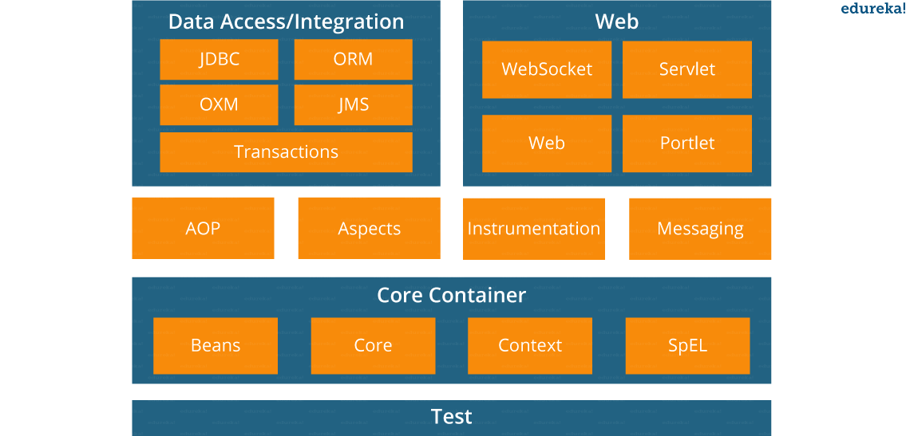
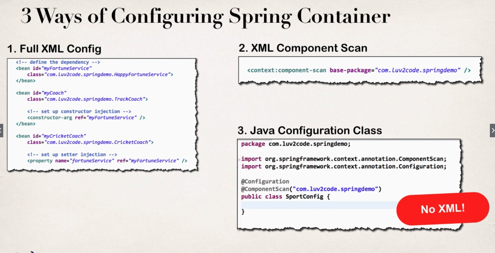
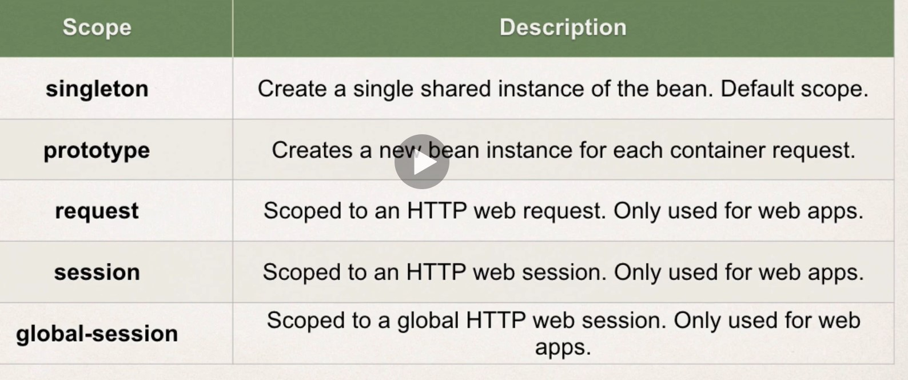
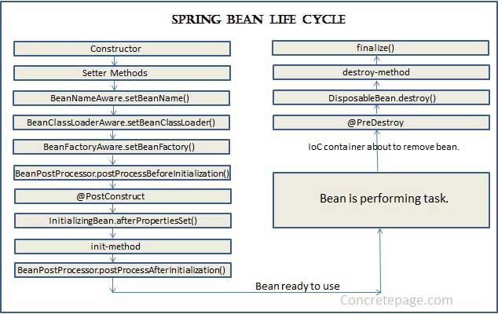
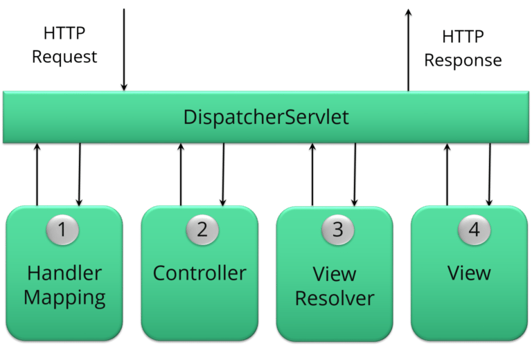
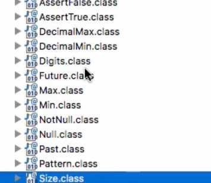

# Spring
-  powerful open source, application framework created to reduce the complexity of enterprise application development.
- pring framework is also called the framework of frameworks
# Spring Advantages
- Spring is just a dependency injection framework.
  - Makes classes free from headache of managing dependency
  - Helps writing testcases easier
- Additionally Spring focuses on the "plumbing" of enterprise applications so that teams can focus on application-level business logic, without unnecessary ties to specific deployment environments.
  - Reduce plumbing code of JDBC, JMS
  - Good integration with popular frameworks hibernate etc.

# Spring Boot Advantages
- Spring had a lot of configurations
  - Beans
  - Dispatcher Service, View Resolver, Error Handling etc.
- Shift to microservices, so quickly start developing applications
  - Spring boots makes it easy to create production grade application and deploy quickly.
  - It is spring with default configuration
  - It tries to auto configure a lot of stuff.
- Provides embedded server, health checks, security metrics etc.

# Inversion of Control In Spring
- One of the main features of the Spring framework is the IoC (Inversion of Control) container. The Spring IoC container is responsible for managing the objects of an application. It uses dependency injection to achieve inversion of control.
- The interfaces BeanFactory and ApplicationContext represent the Spring IoC container. Here, BeanFactory is the root interface for accessing the Spring container. It provides basic functionalities for managing beans.

## Auto Wiring
- Mechanism to perform dependency injection
- Spring resolve collaborators for your bean automatically by inspecting the contents of the BeanFactory.
### Modes of Auto Wiring
- no: This is default setting which means no autowiring.
- byName: It injects the object dependency according to name of the bean.
- byType: It injects the object dependency according to type.
- constructor: It injects the dependency by calling the constructor of the class.
- autodetect: First the container tries to wire using autowire by constructor, if it can’t then it tries to autowire by byType.

## Spring Container
- The Spring container is responsible for instantiating, lifecycle, configuring, and assembling the Spring beans.

### Types of IOC Containers in Spring
- BeanFactory and ApplicationContext and WebApplicationContext
#### Bean Factory
- This is the root interface for accessing the Spring container.
- Usually, the implementations use lazy loading, which means that beans are only instantiating when we directly calling them through the getBean() method.
- BeanFactory loads beans on-demand, while ApplicationContext loads all beans at startup. Thus, BeanFactory is lightweight as compared to ApplicationContext.
- Limited bean scopes only singleton and prototype
#### Application Context
- The ApplicationContext is the central interface within a Spring application that is used for providing configuration information to the application.
- It implements the BeanFactory interface. Hence, the ApplicationContext includes all functionality of the BeanFactory and much more! Its main function is to support the creation of big business applications.
- It uses eager loading
- It supports internationalization, annotation based dependency
#####  Responsibilities:
- Bean instantiation/wiring
- Managing Bean Lifecycle
  - Automatic BeanPostProcessor registration
    - ?
  - Automatic BeanFactoryPostProcessor registration
    - ?
- ApplicationEvent publication
  - ?
- Convenient MessageSource access
    - ?

#### Application Context Types
- AnnotationConfigApplicationContext
  - It can take classes annotated with @Configuration, @Component, and JSR-330 metadata as input.
- AnnotationConfigWebApplicationContext
  -  similar to AnnotationConfigApplicationContext, the only difference is it is build for web application. Spring by default calls XmlWebApplicationContext.
- XmlWebApplicationContext
    - loads context definition from an XML file contained within a web application.
- FileSystemXMLApplicationContext
  - loads context definition from an XML file in the filesystem.
- ClassPathXmlApplicationContext
  - loads context definition from an XML file located in the classpath

- Don't use any of these use spring boot which figures by itself.

## Library vs Framework
- The technical difference between a framework and library lies in a term called inversion of control.
- When you use a library, you are in charge of the flow of the application. You are choosing when and where to call the library. When you use a framework, the framework is in charge of the flow.

## DI vs IOC vs Service Locator
### IOC
- Inversion of Control is a principle in software engineering by which the control of objects or portions of a program is transferred to a container or framework.
- IoC is much more than object creation: a Spring Context or a Servlet Container not only create objects, but manage their entire lifecycle. That includes creating objects, destroying them, and invoking certain methods of the object at different stages of its lifecycle. These methods are often described as callbacks.
### DI 
- Dependency injection is a pattern through which to implement IoC, where the control being inverted is the setting of object's dependencies.
- DI is a form of IoC, where implementations are passed into an object through constructors/setters/service lookups, which the object will 'depend' on in order to behave correctly.
- Very useful for implmenting Unit Test cases.
- This helps you to follow SOLID’s dependency inversion and single responsibility principles.

## Types of DI
### Constructor Injection
- Constructed object is immutable and returned to the client in a fully initialized state. Once the dependencies are set they cannot be changed.
- For mandatory dependencies or when aiming for immutability, use constructor injection
-  You do not need any mocking library or a Spring context in unit tests. You can create an object that you want to test with the new keyword. Such tests are always faster because they not rely on the reflection mechanism.
- People are more reluctant to add more dependencies to a constructor than via fields. 
- Higher chance to have circular dependencies, so-called chicken-and-egg scenario.
```java
@Autowired
public DependentService(Service1 service1, 
            Service2 service2){
    this.service1 = service1;
    this.service2 = service2;
}
```
### Property Injection/ Field Injection
- Easy to use, no constructors or setters required
- No immutability — the same as for setter injection.
- Avoid field injection in most cases
- Works through reflection
- Your classes cannot be instantiated (for example in unit tests) without reflection. You need the DI container to instantiate them, which makes your tests more like integration tests
- Your real dependencies are hidden from the outside and are not reflected in your interface (either constructors or methods)
- It is really easy to have like ten dependencies. If you were using constructor injection, you would have a constructor with ten arguments, which would signal that something is fishy. But you can add injected fields using field injection indefinitely. Having too many dependencies is a red flag that the class usually does more than one thing, and that it may violate the Single Responsibility Principle.
```java
@Autowired
private Service1 service1;
```
### Method Injection/ Setter Injection
- Flexibility in dependency resolution or object reconfiguration, it can be done anytime. Plus, this freedom solves the circular dependency issue of constructor injection.
- Null checks are required, because dependencies may not be set at the moment.
- For optional or changeable dependencies, use setter injection

```java
@Autowired
public void setService2(Service2 service2) {
    this.service2 = service2;
}
```
### Interface Injection
- Spring does not support it
# Modules of Spring
- There are around 20 modules


## Modules of Spring Core
### Spring Core
-  a key module that provides fundamental parts of the framework, like IoC or DI

### Spring Bean
### Spring Expression Language
### Spring Context 

## Data Access 
### JDBC
- this module enables a JDBC-abstraction layer that removes the need to do JDBC coding for specific vendor databases
### ORM
- provides integration layers for popular object-relational mapping APIs, such as JPA, JDO, and Hibernate
### OXM (Object XML Mapping)
### JMS (Java Messaging Service)
### Transactions

## Web
### Web
### Web MVC
- a web module implementing the Model View Controller design pattern
### Web Socket
### Web Portlet

## Aspect Oriented Programming
- Aspect Oriented Programming (AOP)
- Instrumentation
- Test
  - JUnit etc.

## Miscellaneous
- Messaging
- Aspects

# Configuration Spring Container

## XML-Based configuration
- Configure and defining beans using xml
```xml
<beans> 
    <bean id="hw" class="beans.HelloWorld" 
      init-method="init" destroy-method="destroy"/> 
</beans> 
```
```java
ClassPathXMLApplicationContext context = new ClassPathXMLApplicationContext("applicationContext.xml");
```

## Annotation-Based configuration
- Reduce the XML configuration
- You configure spring beans using annotation, but still use xml for defining beans.

## Java-based configuration
- No requirement for XML, use JAVA for configuring the container
- @Configuration annotated classes and @Bean annotated methods. 
```java
//In main
AnnotationConfigApplicationContext context = new AnnotationConfigApplicationContext(SportsConfiguration.class);

//Config file is Java File
//SportsConfig.java
@Configuration
@ComponentScan("com.manish.springtut")
public class SportConfig{

//This says the below method returns a bean
  @Bean
  public Coach swimCoach(){
      SwimCoach mySwimCoach = new SwimCoach();
      return mySwimCoach;
  }
   
}

```

# Annotations

## Spring Annotation

### @Autowired
- The @Autowired annotation provides more accurate control over where and how autowiring should be done.
- By default, it is a type driven injection

### @Qualifier
- NoUniqueBeanDefinitionException is thrown when more than one bean is there
- When you create more than one bean of the same type and want to wire only one of them with a property  you can use the @Qualifier annotation along with @Autowired to remove the ambiguity by specifying which exact bean should be wired.

  ```java
  @Component
  @Qualifier("fooFormatter")
  public class FooFormatter implements Formatter {
      //...
  }

  @Component
  @Qualifier("barFormatter")
  public class BarFormatter implements Formatter {
      //...
  }

  public class FooService {
      
      @Autowired
      @Qualifier("fooFormatter")
      private Formatter formatter;
  }
  ```
- Alternatively we can also perform the following
  ```java
  @Component("fooFormatter")
  public class FooFormatter implements Formatter {
      //...
  }

  @Component("barFormatter")
  public class BarFormatter implements Formatter{
    //....
  }

  @Component
  public class FooService{

    private Formatter formatter;

    @Autowired
    public FooService(@Qualifier("fooFormatter") Formatter formatter){

    }

  }

  ```

#### Autowiring by Name
Another way to decide between multiple beans when autowiring is by using the name of the field to inject. This is the default in case there are no other hints for Spring.
  ```java
  public class FooService {
      
      @Autowired
      private Formatter fooFormatter;
  }
  ```

### @Primary
- To deal with which bean to be injected, a primary annotation can also be used, to denote the primary bean which has to be injected in case of collision.
- It has less preference that the @Qualifier.

### @Configuration 
- indicates that the class is a source of bean definitions. 
- The class with @Configuration becomes the configuration class.
- Sample spring configuration class
- Configuration class has methods which contains how to create beans.
```java
@Configuration
public class SwaggerConfig {
    //Return a Bean of type Docket
    @Bean
    Docket getDocket(){
        return new Docket(DocumentationType.SWAGGER_2);
    }
}
```

### @Bean
- The method will return a bean.
- If we don't specify a custom name, the bean name will default to the method name.

### @ComponentScan
- While developing an application, we need to tell the Spring framework to look for Spring-managed components. @ComponentScan enables Spring to scan for things like configurations, controllers, services, and other components we define
- If no package is specified, then it considers the package of the class declaring the @ComponentScan annotation as the starting package
- the @ComponentScan annotation can also scan, detect, and register beans for classes annotated with @Component, @Controller, @Service, and @Repository.
-  Additionally, Component Scan searches the specified packages or classes annotated with @Configuration. Additionally, the Configuration classes can contain @Bean annotations, which register the methods as beans in the Spring application context.

### @EnableAutoConfiguration
- @EnableAutoConfiguration is used for auto-configuring beans present in the classpath in Spring Boot applications. it is different from component scan which scans the package.
-  it automatically creates and registers beans based on both the included jar files in the classpath and the beans defined by us.

### @Component
- This marks a java class as a bean. It is a generic stereotype for any Spring-managed component. The component-scanning mechanism of spring now can pick it up and pull it into the application context.

#### @Component vs @Bean
- It is perfectly valid to have Java configuration and annotated component scans in the same project because they server different purposes.
- @Component (@Service,@Repository etc) are used to auto-detect and auto-configure beans.
- @Bean annotation is used to explicitly declare a single bean, instead of letting Spring do it automatically.
- You can do the following with @Bean. But, this is not possible with @Component
  ```java
  @Bean
  public MyService myService(boolean someCondition) {
      if(someCondition) {
        return new MyServiceImpl1();
      }else{
          return new MyServiceImpl2();
      }
  }
  ```

### @Controller 
- This marks a class as a Spring Web MVC controller. 
- Doesn't have responseBody in it.
- Controller is also a Component.

### @Service

### @Repository
- This annotation is a specialization of the @Component annotation with similar use and functionality. It provides additional benefits specifically for DAOs.
- Component which interacts with DB.

### @RestController
  - Tell Spring the current class is a rest controller
  - It has ResponseBody annotation in it so the response will be directly sent back to browser and not to view resolver.

### @RequestMapping
- Specify the url and method which will trigger the below method
- Can specify the common path using @RequestMapping
```java
@RestController
@RequestMapping("/user")
public class UserController{
  @GetMapping("/{id}/name")
  ....
}
```

### @GetMapping
- Specify the url which will trigger the below method

### @PathVariable
- Retrieves values straight from he URI
```java
//http://localhost:8080/book/9783827319333
@RequestMapping(value="/book/{ISBN}", method= RequestMethod.GET)
public String showBookDetails(@PathVariable String ISBN)
```

### @RequestParameter
- Retrieves value corresponding to query parameter
```java
// Request will be like http://localhost:8080/eportal/orders?id=1001
@RequestMapping("/orders")
public String showOrderDetails(@RequestParam("id") String orderId)
```
- Optional parameters required, defaultValue
```java
// Request will be like http://localhost:8080/eportal/orders?id=1001
@RequestMapping("/orders")
public String showOrderDetails(@RequestParam("id") String orderId,
                                @RequestParam(required=false, defaultValue="day") String time)
```
### @RequestBody


### @ResponseBody
- the response will be directly sent back to browser and not to view resolver.

### @Response Status

### @ControllerAdvice

### @Import 

### @JsonIgnore

### @Resource

### @Injection

### @ConfigurationProperties

### @Required

### @Import

### @ImportResource

### @Profile

## Spring Boot Annotations

### @SpringBootApplication
- Decorates the main class of the Spring Boot Application
- It is a combination of @Configuration, @EnableAutoConfiguration, and @ComponentScan with their default attributes:
```java
@SpringBootApplication
public class CurrencyExchangeServiceApplication {
	public static void main(String[] args) {
		SpringApplication.run(CurrencyExchangeServiceApplication.class, args);
	}
}
```

## JPA Annotations
- See java_microservies.md

# Spring Beans

## Bean vs Servlet vs POJO

### POJO
- A POJO has no naming convention for our properties and methods.
- But, we aren't following any real convention for constructing, accessing, or modifying the class's state.
- This class can be used by any Java program as it's not tied to any framework

### Bean
- Spring beans are Java objects that are managed by the Spring container.
- All JavaBeans are POJOs but not all POJOs are JavaBeans.
- A JavaBean is basically a Java class which satisfies a few simple rules
  - Serializable i.e. they should implement Serializable interface. Still, some POJOs who don’t implement Serializable interface are called POJOs because Serializable is a marker interface and therefore not of much burden.
  - Fields should be private. This is to provide the complete control on fields. Since if the field is not private anyone can change it to invalid value.
  - Fields should have getters or setters or both.
  - ### A no-arg constructor should be there in a bean.
  - Fields are accessed only by constructor or getter setters.
  - Getters and Setters have some special names depending on field name. For example, if field name is someProperty then its getter preferably will be ```getSomeProperty()```
  - If you don't have getters and setters in the Bean you will face a response.

### Servlet
- a servlet specifically subclasses javax.servlet.Servlet and/or javax.servlet.http.HttpServlet and implements one or more of the doXXX methods.

## Bean Scope
- Default Scope is Singleton

### @Scope
```java
@Component
//This statement is redundant - singleton is default scope
@Scope("singleton")  //This statement is redundant
public class BeanClass {
}

//Can also decorate the @Bean methods
@Bean
@Scope(value="prototype")
  public MyBean myBean() {
  return new MyBean();
}

```

### @RequestScope
- Alternative to @Scope("request")

### Additional Scopes


### Request vs Session Scope
- if the bean scope is request and, a user makes more than one request for a web page in his user session, then on every request a new bean would be created.

## Bean Lifecycle Methods/Hooks

- The custom method can not accept any arguments. The method should be no-arg.
- For "prototype" scoped beans, Spring does not call the destroy method.

### Programmatic Approach
- we need to implement our bean with two interfaces namely InitializingBean, DisposableBean
- will have to override afterPropertiesSet() and destroy() method.
```java
// Java program to create a bean 
// in the spring framework 
package beans; 
  
import org.springframework 
    .beans.factory.DisposableBean; 
  
import org.springframework 
    .beans.factory.InitializingBean; 
  
// HelloWorld class which implements the 
// interfaces 
public class HelloWorld 
    implements InitializingBean, 
 DisposableBean { 
  
    @Override
    // It is the init() method 
    // of our bean and it gets 
    // invoked on bean instantiation 
    public void afterPropertiesSet()  
throws Exception 
    { 
        System.out.println( 
            "Bean HelloWorld has been "
            + "instantiated and I'm the "
            + "init() method"); 
    } 
  
    @Override
    // This method is invoked 
    // just after the container 
    // is closed 
    public void destroy() throws Exception 
    { 
        System.out.println( 
            "Conatiner has been closed "
            + "and I'm the destroy() method"); 
    } 
} 
```
## Lazy initialization in Spring
- By default in Spring, all the defined beans, and their dependencies, are created when the application context is created.
- @RestControllerIn contrast, when we configure a bean with lazy initialization, the bean will only be created, and its dependencies injected, once they're needed.
- Lazy initialization may reduce the number of beans created when the application is starting – therefore, we can improve the startup time of the application
### Over Configuration Class
- When we put @Lazy annotation over the @Configuration class, it indicates that all the methods with @Bean annotation should be loaded lazily.
```java
@Lazy
@Configuration
public class AppConfig{

}
```

### With @Autowired
- To lazily autowire a bean, we need to both decorate the bean and it's reference as lazy.
- the @Lazy is mandatory in both places.
- the City bean is initialized only when we call the getCityInstance() method.
  ```java
  @Lazy
  @Component
  public class City {
      public City() {
          System.out.println("City bean initialized");
      }
  }

  public class Region {

      @Lazy
      @Autowired
      private City city;

      public Region() {
          System.out.println("Region bean initialized");
      }

      public City getCityInstance() {
          return city;
      }
  }
  ```


# MVC
- The MVC pattern helps in separating the different aspects of the application like input logic, business logic and UI logic, while providing a loose coupling between all these elements.

## Controller
- Accepts input and converts it to commands for the model or view.
- A controller determines what response to send back to a user when a user makes a browser request, which services to call and also validation logic.
-  the controller invokes a business class to process business-related tasks, and then redirects the client to a logical view name, which is resolved by Spring's dispatcher servlet in order to render results or output.

## Dispatcher Servlet
- It is the front controller
- Looks at the url and sends to the right controller and method.
- Also sends the response to view resolver if required if there is no response body.
- Handles all the requests

## View Resolver
- The View Resolver class resolves the view component to be invoked for the request.

## Dispatcher Servlet vs Request Dispatcher

# Aspected Oriented Programming
- Aspects enable the modularization of cross-cutting concerns such as transaction management that span multiple types and objects by adding extra behavior to already existing code without modifying affected classes.
- For isolating cross cutting concerns into separated classes say Logging, Transactions, Security etc.

## Steps to perform AOP
- Write Aspects
- Configure where aspects have to work

## Aspect
- Aspect is just a class with additional annotations
- Aspect has multiple Advices
- The Aspect should be configured as a bean, say using @Component

## Advice
- Advice are configured to run before or after a method run.
- Advice is not called when spring calls the getter and setter initially.
### Advice Types
- Before
- After
- AfterReturning
- AfterThrowing
- Around

## Before
- Standard AOP Annotation that is used to make advice method run before target
- It is applied on advice method and contains parameter for the target method.

```java
@Aspect
@Component
public class LoggingAspect{
//Logging Advice will run before the execution of getName().
  @Before("execution(public String getName())")
  public void loggingAdvice(){
    System.out.println("Advice ran, GET Method Called");
  }
}
```
- The above advice will run on getName() of any class, so we need to provide information of class  to restrict it. To do that we need to provide the package and class information inside the parameter so Spring can distinguish it from other classes.
```  @Before("execution(public String org.manish.aop.model.Circle.getName())")```


## PointCut
- Pointcut is expression language of Spring AOP.

### PointCut Expression
#### Execution
- Expression represents a method
- ```"execution(public String getName())"```
  - Executed before the execution of getName(). 
- ```execution(* * org.manish.aop.model.Circle.*(..))```
  - Executed for all methods of Circle class
#### Within
- Expression represents a class
- ```within(org.manish.aop.model.Circle)```
  - Same as above
  - More readable than above
- ```within(org.manish.aop.model..*)```
  - Applies to all the classes in root package or subpackage
#### Args
- Represents method arguments, catch methods which has these argument types.
  ```args(String)```
  - Applies to all methods which take a single string argument.

#### Target

#### Annotation
- Applies the advice to all the methods which has the annotation
- You can define custom annotation and mark the method wherever you want the advice to run.
- You don't need strict naming convention if you choose this approach
```java
public @interface Loggable{}

public class ShapeService{
  @Loggable
  public Circle getCircle(){
    return circle;
  }
}

//In Aspect
@Around("@annotation(org.manish.aop.Loggable)")
public Object myAroundAdvice(ProceedingJoinPoint pJP){
  ....
}

```

### WildCards
- Applying one advice across different methods or points
- In the above case the first example, the single advice was applied to different methods.
- Let us take some examples
#### Apply Advice to all Getters irrespective of return type.
- Apply the advice to all methods no matter the return type and which starts with get and doesn't take any parameter.
```  @Before("execution(public * get*())")```
- Apply the advice to all methods no matter the return type and which starts with get and takes an argument.
```  @Before("execution(public * get*(*))")```
- Apply the advice to all methods no matter the return type and which starts with get and irrespective of arguments.
```  @Before("execution(public * get*(..))")```
- ```*``` is for one or more 
- ```..``` is for zero or more


### @PointCut
- If multiple advices uses the same expression you can just specify the expression as pointcut annotation and then use it everywhere else.
- It needs a dummy method, which holds the pointcut expression
- Helps in keeping the code DRY.
  ```java
  @PointCut("execution(* get*(..))")
  public void allGetters(){}


  @Before("allGetters()")
  public void loggingAdvice(){
    System.out.println("Advice ran, GET Method Called");
  }

  @Before("allGetters()")
  public void secondAdvice(){
    System.out.println("Second Advice ran, GET Method Called");
  }
  ``` 

#### Combining Point Cut Expression
- Saw we need all getters inside Circle Class
  ```java
    @Before("allGetters() && allCircleMethods()")
    public void loggingAdvice(){
      System.out.println("Advice ran, GET Method Called");
    }

    @PointCut("within(org.manish.aop.model.Circle)")
    public void allCircleMethods(){}

    @PointCut("execution(* get*(..))")
    public void allGetters(){}
  ``` 

## JOIN POINT
- Get the information about which method triggered the advice.
- JoinPoint is any point in your program such as field access, method execution, exception handling which triggers the Advice.
- All places in your code which can trigger an Advice
  - In Spring only methods are Join Points
  - But in Aspectj we can have multiple other types of join points(such as field access, method execution, exception handling etc), say we want an advice to trigger everytime a member variable changes even without using setter.
  ```java
  @Before("allCircleMethods()")
  public void loggingAdvice(JoinPoint joinPoint){
    System.out.println("Advice ran, GET Method on " + joinPoint.getTarget());
  }
  ```

## Advice Arguments
- Say we have an advice which runs when a method with single String argument runs, and we want to log that specific argument
- We not only tell spring that we want the same argument that was passed to the target method, but also we tell it is of type String. 
```java
@Before("args(name)")
public void stringArgumentMethodAdvice(String name){
  System.out.println(name);
}
```

### getTarget
- Very powerful, returns the object which triggered the advice, in the above case return the circle object which triggered the method call.

## After
- Runs after the target method, no matter if the execution completes or not.

## AfterReturning
- Runs after the target method returns successfully, not run if there is an exception.
### Get the return object
```java
@AfterReturning(pointcut="args(String)", returning ="returnVal")
public void stringArgumentAdvice(String returnVal){
  System.out.println("The returned string is " + returnVal);
}
```

## AfterThrowing
- Runs after the target method throws an exception.
```java
@AfterReturning(pointcut="args(String)", throwing ="ex")
public void stringArgumentAdvice(RunTimeException ex){
  System.out.println("The exception is " + ex);
}
```

## Around
- Need a Compulsory Argument, ProceedingJoinPoint
- We can control the execution of target method, by say checking a boolean value.
- In case the target methods returns a value, we also need to return in the advice.
- We can also modify the return value.
```java
@Around("allGetters()")
public Object myAroundAdviceForGetters(ProceedingJoinPoint pJP){
  Object returnVal = null;
  try{
    System.out.println("Before execution");
    returnVal = pJP.proceed();// This is where the target method execution takes place.
    System.out.println("After Returning");

  }
  catch(ex){
    System.out.println("After Throwing");
  }
  return returnVal;
}
```
## interceptor
- Interceptor is a class like aspect that contains one advice only.

## Weaving
- weaving is a process that links aspects with other application types or objects to create an advised object. This can be done at compile time, load time, or at runtime. Spring AOP, like other pure Java AOP frameworks, performs weaving at runtime.

## AOP Proxy
- an object created by the AOP framework in order to implement the aspect contracts (advise method executions and so on). In the Spring Framework, an AOP proxy will be a JDK dynamic proxy or a CGLIB proxy.
- Spring AOP actually manages the beans's proxy i.e SomeComponentSecond bean actually gets enhanced to Proxy Object : SomeComponentSecond$$EnhancerBySpringCGLIB.
- It is using this Proxy, spring implements the Before Advice, After and Around Advice.
- A Proxy object is an object which inherits the target Object and adds functionality to it by overriding it's methods. [Link for reference](https://www.youtube.com/watch?v=yiinKulgm4U&list=PLE37064DE302862F8&index=12)

# Design Patterns in Spring
- Singleton Pattern: Singleton-scoped beans
- Factory Pattern: Bean Factory classes
- Prototype Pattern: Prototype-scoped beans
- Adapter Pattern: Spring Web and Spring MVC
- Proxy Pattern: Spring Aspect Oriented Programming support
- Template Method Pattern: JdbcTemplate, HibernateTemplate, etc.
- Front Controller: Spring MVC DispatcherServlet
- Data Access Object: Spring DAO support
- Model View Controller: Spring MVC


# AutoConfiguration
- Looks at the classes and jar in class path and configures different classes, like JacksonObjectMapper(Json to object and vice versa), error configuration, dispatcher servlet. 

# REST USING SPRING BOOT

## Return a JSON Object
- Automatically handled by jackson json
- ### The returned Object has to be a valid Spring Bean, i.e with public setters and getters else there will be exception

## Submit Query Parameters in Spring Boot
- You need to use ```@PathVariable``` annotation.
- Your route should also have the variable with same name, else you will get error in the response.
```java
  @GetMapping(path = "/hello-world-bean/user/{yourName}")
  public HelloWorldBean helloWorldBeanPathVariableExample(@PathVariable String yourName){
      return new HelloWorldBean("Hello World Bean" + yourName);
  }
```

## Throw Exception in Spring Boot
- You should implement the RuntimeException which is an unchecked exception.
- Also to get 404 Error Code Add the ResponseStatus Annotion in the Exception
```java

@ResponseStatus(HttpStatus.NOT_FOUND)
public class UserNotFoundException extends RuntimeException {
    public UserNotFoundException(String s) {
        super(s);
    }
}

@GetMapping("/users/{id}")
public User getUser(@PathVariable Integer id){
    User user = userService.findUser(id);
    if(user == null){
        throw new UserNotFoundException("id : " + id);
    }
    return user;
}
```

## Validation in Spring Boot
- Use @Valid annotation
```java
public ResponseEntity createUser(@Valid @RequestBody User user)
```
 with following constraints
```java
@Size(min=2)
private String name;

@Past
private Date birthDate;
```
- Following are the various constraints




## Create a object with Spring Boot
- You need to use ```@RequestBody``` annotation
- It is best practise to return the URI of the created resource, no need to send all the information related to created user since that just wastes the bandwidth.
- To just send the URI of the created resource, we can send the URI in the location portion of the header.
- To perform this you need to return the location information in the ResponseEntity Object. It has a created method which expects a URI, you can create the URI using the ServletUriComponentBuilder;
```java
@PostMapping("/users")
public ResponseEntity createUser(@RequestBody User user){
    User savedUser = userService.save(user);

    URI location = ServletUriComponentsBuilder.fromCurrentRequest()
            .path("/{id}")
            .buildAndExpand(savedUser.getId()).toUri();

    return ResponseEntity.created(location).build();
}
```

## Monitoring APIs
- Using Spring Actuator and HAL Explorer
- Lots of useful metrics and properties about the Spring Application
  - All the created Beans
  - health checks
  - Postive and Negative match on condition for Auto Configuration
  - Environment
  - Heap Dump
  - Thread Dump
  - Metrics
    - Amount of memory used etc.
    - CPU Usage
    - JDBC Connections Active
    - GC Information

## Swagger API Documentations
- You can document the API for the consumers in a very structured way using swagger.
- It also enables you to document the constraints on the properties expected by each API.
- Document the request type which are accepted (json/xml) and also the response type (json/xml)


## Hypermedia as the engine of application state (HATEOS)


## Content Negotiation is the ability to send both xml and json responses
  - Use jackson xml

## Filter the attributes to be sent in the response
### Static Filtering
- You can decorate some fields as ```@JsonIgnore``` so they won't be sent in the response as a JSON Object, like say a password field
- Be careful there are multiple implementation of JsonIgnore, use fasterxml.jackson
```java
import com.fasterxml.jackson.annotation.JsonIgnore;
public class SomeBean {
    private String one;

    @JsonIgnore
    private String three;

    public SomeBean(String value1, String value3) {
        one = value1;
        three = value3;
    }

    public String getOne() {
        return one;
    }

    public void setOne(String one) {
        this.one = one;
    }

    @JsonIgnore
    public String getThree() {
        return three;
    }

    public void setThree(String three) {
        this.three = three;
    }
}
```
### Dynamic Filtering based on the request.


## Versioning

### URL Based Versioning
- Polluting URL Space
- Documentation is easier
#### URI Based Versioning
```java
@GetMapping("/v1/person")
PersonV1 getPersonVersion1(){
    return new PersonV1("Manish Madugula");
}

@GetMapping("/v2/person")
PersonV2 getPersonVersion2(){
    return new PersonV2(new Name("Manish","Madugula"));
}
```
#### Parameter Based Versioning
```java
@GetMapping(value = "/person", params = "version=v1")
PersonV1 getPersonVersion1Param(){
    return new PersonV1("Manish Madugula");
}

@GetMapping(value="/person", params = "version=v2")
PersonV2 getPersonVersion2Param(){
    return new PersonV2(new Name("Manish","Madugula"));
}
```


### Header Based Versioning
- Misuse of HTTP Header
- Caching is not straightforward, since we also need to look at header and do complicated stuff with it, not simply see if URL are same
- Cannot execute directly in browser, need POSTMAN etc.
#### X-API-VERSION
```java
@GetMapping(value = "/person", headers = "X-API-VERSION=v1")
PersonV1 getPersonVersion1XAPI(){
    return new PersonV1("Manish Madugula");
}

@GetMapping(value="/person", headers = "X-API-VERSION=v2")
PersonV2 getPersonVersion2XAPI(){
    return new PersonV2(new Name("Manish","Madugula"));
}
```
#### Accept Header/Produces Param/MIME Type Versioning/Media type Versioning/Content Negotaition
```java
@GetMapping(value = "/person", produces = "application/com.madmanish.restfulwebservices-v1+json")
PersonV1 getPersonVersion1ContentNegotation(){
    return new PersonV1("Manish Madugula");
}

@GetMapping(value="/person",  produces = "application/com.madmanish.restfulwebservices-v2+json")
PersonV2 getPersonVersion2ContentNegotation(){
    return new PersonV2(new Name("Manish","Madugula"));
}
```

# Spring CLOUD
- Provides a range of solution for configuration management, service discovery, circuit breakers, intelligent routing, control bus, one time token, global locks, leader election, distributed sessions, cluster state, microproxy.

## Microservices
- RESTFUL
- Small well chosen deployable units with well defined bounded contexts.
- Cloud Enabled, scale well
- Decoupled so can swap various components and not affect the entire system if contracts are respected.
- Adaption of new technologies easily
- Dynamic Scaling and cost efficiency
- Faster Release Cycles

### Challenges
- Choosing Bounded Contexts
- Service Discovery (Eureka)
- Configuration Management (Spring Cloud Configuration Server)
  - We have multiple microservices and multiple instances in each environments and multiple environments, so lots of configurations
- Dynamic Scale up and scale down. (Ribbon Load Balancing)
- Visibility 
  - Monitoring the microservices (Netflix API Gateway)
  - Centralized logging (Zipkin Distributed Tracing)
  - Debugging
- Cascading Failures/ Fault Tolerance (Hystrix and Resilence4j)

## Dynamic Port in the response
- Spring provides Environment Bean, which can extract environment variables.

## Run multiple instances of the same service in intelliJ/Eclipse
- Add a duplicate configuration and in the VM Properties provide ```-Dserver.port=some_custom_port``` and so on.


## Call another microservice from inside one microservice
- REST Template.

# Important Jars
- spring-boot-starter-web
  - Starter for building web, including RESTful, applications using Spring MVC. Uses Tomcat as the default embedded container
- spring-boot-starter-data-jpa
- spring-boot-starter-security
  - Handles Spring Security OAuth, Basic Validation etc.
- spring-boot-starter-validation
  - Handles Constraints on the Request Body and Parameters by setting up validation logic.
- spring-boot-starter-actuator
  - Monitoring spring application
- spring-data-rest-hal-explorer
  - UI tool too see the monitoring data
- spring-boot-devtools
  - Live Load
- spring-boot-starter-test
  - Test framework for spring
- springfox-swagger2
  - API Documentation in JSON
- springfox-swagger-ui
  - API Documentation Visualize in UI

# In 28 Minutes
- Service Defination
  - Contract between both the services.
  - Request, Response Format and Structure and endpoint.
  - Example: Swagger

- Jackson
  - Converts to JSON and Back
- ServletUriComponentBUILDER
- ResponseEntity
- ResponseEntityExceptionHandler
- ControllerAdvice
- Delayed Writing
- Persistent Context
- Lazy Loading with and without transaction
- Keep SQL Log Open
- Criteria RP
- Spring DATA JPA
  - Ease of CRUD
  - Query Derivation
  - Annotated Query
  - Paging Pagetable
  - Slice vs Page
  - Projections
  - Proxy being returned
  - Query By example
  - Example Interface


# To Read
- Hibernate/JPA
  - JPA Interceptor
  - Propagation Level in transaction
- AOP
- Important Spring Annotations
  - Resource
  - RequestParam
  - Injection
- Datasource
- Exception Handling in Spring
- Design Patterns used in Spring

# Old Notes
- Lifecycle hooks vs constructor
- For prototype scope, spring doesn't call the destroy-method hook (In contrast to the other scopes, Spring does not manage the complete lifecycle of a prototype bean:), however you can create your own custom bean processor to call destroy even for prototype scopes.
- Read about BeanPostProcessors
- You can use any method for setter injection while using component scanning via annotations.
- Autowired annotation should only be used on a single constructor, the one which spring will use to create the instance.
- Autowired annotation can be used with multiple setter methods/ random methods name.
- Qualifier annotation can be used to tell spring which implementation to inject, in case of multiple injections, it should be applied to individual fields/parameters not as a whole to constructor.
- **If the annotation's value doesn't indicate a bean name, an appropriate name will be built based on the short name of the class (with the first letter lower-cased). Except for the special case of when BOTH the first and second characters of the class name are upper case, then the name is NOT converted. Example For the case of RESTFortuneService, it is not converted to rESTFortuneService, you need to explicitly name it.**
- So think of the @Bean annotation was a wrapper / adapter for third-party classes. You want to make the third-party classes available to your Spring framework application context. Unlike the XML Application Context which requires you to specify @Component in your class, using @Beans you don't need to modify the class that you want to include in your IOC container/Application context. You can use @Bean to make an existing third-party class available to your Spring framework application context.
- In spring the front controller(Created by spring dev team) is called DispatcherServlet and it will delegate the request to the controller.
- View template common are JSP(Java Server Pages and JSTL)
- Look at spring config files again for mvc.
- When performing Spring MVC validation, the location of the BindingResult parameter is very important. In the method signature, the BindingResult parameter must appear immediately after the model attribute. 
- @Valid performs the validation on the model attribute, and stores it in BindingResult.