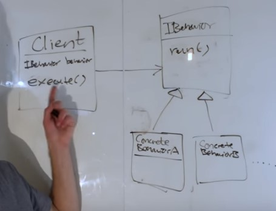

# UML
##  Connector types in UML
- 

# Design Patterns
## Strategy Pattern
- Defines a family of algorithms, encapsulates each one and makes them interchangable.
- It lets the algorithm vary independently from the client that use it.
- You have algorithms A, B, C used by some client class. With this strategy pattern you can plug and play it. Sometimes use A, B, C.
- Decoupled the algorithm from one using the algorithm(client).
- **Composition should be favored over inheritance as inheritance excepts each subclass to implements its own version of the methods and these subclasses can share the method implementation among themselves but if inheritance is used even if implementation is same we need to write duplicate code for each subclass thus inheritance is bad.**
- Mostly used to reduce the duplicacy as in above example.
- **Example** - If a list has a sorting algorithm built into it, you can never change the sorting algorithm. But if you use strategy pattern and inject a sorting algorithm you can use any sorting algorithm you want.

- If A knows how to use B because A knows the I interface that B implements then A can swap out B for C so long as C also implements I.

    A--(I)-->B can be easily changed to A--(I)-->C
     
The strategy pattern is about being able to change from one to the other at run time.

- **Duck Example** and each duck type can have different fly methods and quack and display method. Instead of creating new subclasses you can perform dependency injection by passing the concrete implementation of Strategy Interfaces at runtime. Instead of hard coding these concrete implementation for each class.
  - **Before Using Strategy Pattern**
  - **After Using Strategy Pattern**
  - **Dependency Injection Code**

- **General Strategy UML** 

## Observer Pattern

## Builder Pattern
[Link](https://medium.com/@ajinkyabadve/builder-design-patterns-in-java-1ffb12648850)

# Anti Design Pattern

##  Class Explosion
- Class explosion is when due to too many customization the number of classes you create for each customization becomes very huge.[Link](https://www.brevitaz.com/class-explosion-design-anti-pattern/)

## Telescoping Constructor
- The multiple constructor with combination of multiple parameters variation is called the telescoping constructor. Use builder pattern.