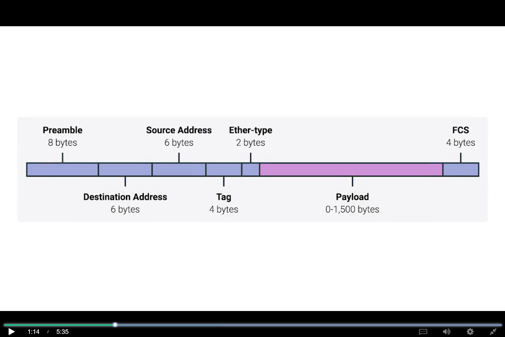
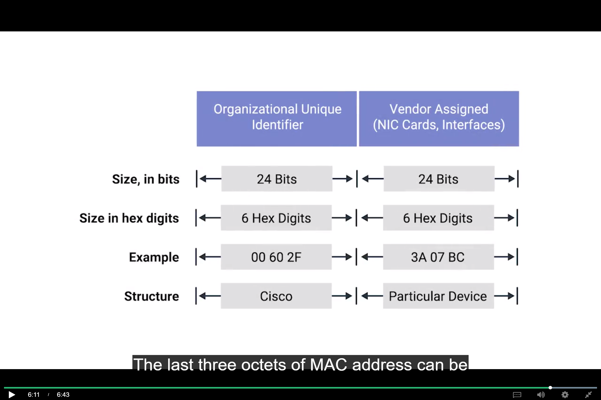
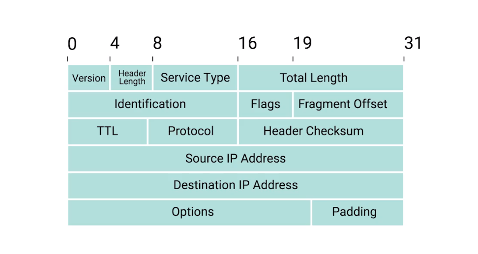
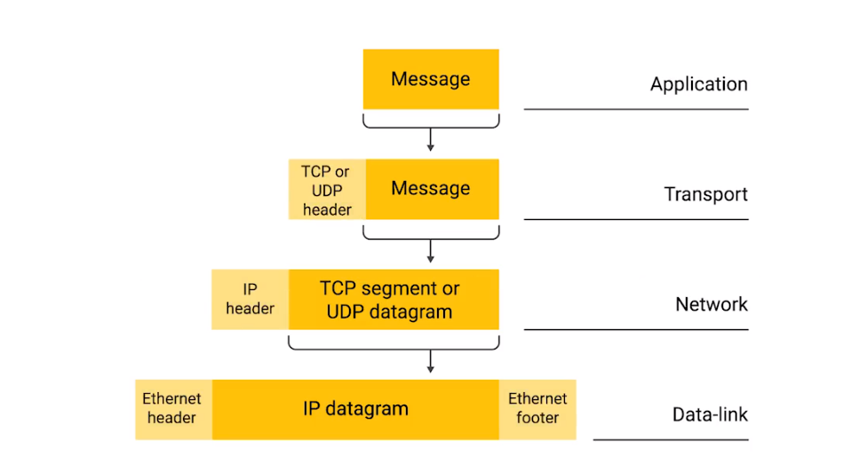

# Networking Notes

## FIVE LAYERED NETWORKING MODEL

## THE DATALINK LAYER

* ### Collision Domain problem in early networks due to absence of switches.

* ### CMSA/CD

    >**Carrier Sense Mutliple Access with collision detection was used by Ethernet to determine when the communication channels were in use so data is only transmitted when channels were clear. If 2 networks try to send data at the same time, computers detect this collision and stop sending the data and then again start sending the data after random interval time, this randomness prevents further collisions from taking place.**

* ### MAC ADDRESS (MEDIA ACCESS CONTROL ADDRESS)
       
    *  ####  Globally unqiue identifier attached to an individual network interface.
    
    *  ####  Its is a 48 bit number represented by a 6 groupings of 2 hexadecimal numbers eg - A2 32 E2 76 21 7A.
    
    *  ####  First 3 octets(8 bits i.e byte -> 2 hexadecimal digit) are organisationally unique identifier(OUI) given by IEEE it means we can identify manufacturer by first 3 octets of mac address.
    
    *  ####  Last 3 octets can be assigned any way manufacturer wants but they must be unique for each device.

    > **Ethernet uses mac address to ensure the data it sends has both an address for the machine that sent the transmission as well the address for which the message was intended for.**

* ### UNICAST
    > **UNICAST transmission is always meant for one recieving address. This is done by ethernet by looking at a special bit in the destination mac address, if the least significant bit in the first octet of a destination address is set to zero, it means that ethernet frame is indended only for destination address.**

* ### MULTICAST
    > **If the least significant digit in the first octet of destination address is set to one, then we are dealing with multicast frame. The address which processes the frame is determined by criteria apart from just the device mac address.**

* ### BROADCAST

    > **Sent to all the devices connected by the LAN. This is accomplished by a special destination known as the broadcast address which is FF:FF:FF:FF:FF:FF, this is used so that devices know all the other devices connected to the network.**

* ### DATAPACKET
    > **Any single set of binary data sent across a network link.

* ### ETHERNET FRAMES (Datapacket at ethernet level)
    > **Highly structured collection of information presented in a specific order. This is necessary so network interfaces at physical layer can convert a stream of bits into meaningful data.**

    * #### PREAMBLE 8 bytes alternate zeros and ones

    * #### START FRAME DELIMITER -> Last byte in the PREAMBLE which is signals that preamble is over and actual information in the frame will follow.

    * #### DESTINATION MAC ADDRESS ->recepient's mac address 6bytes.

    * #### SOURCE MAC ADDRESS ->source's mac address 6bytes.

    * #### ETHERTYPE FIELD -> 2 bytes and used to describe protocol of the contents of the frame.
    
    * #### VLAN HEADER/TAG -> Indicated the frame is a VLAN frame.

    * #### PAYLOAD -> actual data being transmitted, 0 - 1500 bytes.

    * #### FCS ->4 byte, represents a checksum value for the entire frame, this checksum value is computed by doing a cyclical redundancy check(CRC) against the frame. CRC is an important for data integrity. It helps the reciever to know whether it recieved uncorrupted data or not.

    > **Ethernet is concerned with data integrity not with data recovery, it is upto higher layers to decide the action once corrupted data is thrown out whether to ask for data again.**

* ### VIRTUAL LAN
     > **A technique that lets mutiple logical lan connected to the same physical equipment. It is used to segreagate different types of traffic.**

---

## NETWORK LAYER

* ### NEED FOR IP ADDRESS    
     > **Why MAC ADDRESS can't be used for internet routing, since they are not ordered in a unique way it is not possible to know where in the planet a device with a particular mac address is located for proper routing.**

* ### IP ADDRESS
    * #### IP ADDRESS is 32 bits i.e 4 bytes/octet
    * #### Follows dotted decimal notation. 
    * #### IP address are distributed in large sections to various organisations and companies            instead of being determined by hardware vendors.
    * #### IP address are heirarchical and easier to store data about than physical address.
    * #### IP address belong to networks not the devices that belong to that network.
    * #### IP address assigned using DHCP is Dynamic IP address.
    * #### Static IP is reserved for servers and network devices and dynamic for clients.
    * #### It can be split into 2 sections, network ID and the host ID depending on the ADDRESS CLASS     SYSTEM
    
* ### ADDRESS CLASS SYSTEM
    * #### Defines how global IP space is split up.
    * ####  CLASS - A 1st octet is used for network ID, and rest 3 octet for the host ID.
    * ####  CLASS - B 1st and 2nd octet is used for the network and rest 2 for host ID.
    * ####  CLASS - C 1st, 2nd and the 3rd is used for the network ID and last for the host ID.
    * ####  Each address class represents a network of vastly different size For example, since a class A network has a total of 24 bits of host ID space, this comes out to two to the twenty-fourth, or 16,777,216 individual addresses.
    * ####  If the very 1st bit of the IP address is 0, it is class A, if first 2 bits are 10 it is class B network and if the first 3 bits are 110 it is class C network. in other words 1st octet is 0 -126 is class A, 127-191 is class B and 192-224 is class C.
    * ####  There are 2 other IP address classes but they are not as important. Class D is used for multicasting, i.e how single IP Datagram can be sent to entire datagram at once. 223- 239.
    * ####  Class E are unassigned and are used for testing purposes.
    * ####  Class system is mostly being replaced by a system named CIDR.

* ### DYNAMIC HOST CONFIGURATION PROTOCOL (DHCP)
    * #### you can connect a new device to a network and a IP address will be assigned to it automatically using this protocol.

* ### IP DATAGRAM (Datapacket at network layer) and encapsulation
    [Coursera Link](https://www.coursera.org/learn/computer-networking/lecture/C8EJ0/ip-datagrams-and-encapsulation)
    
* ### ADDRESS RESOLUTION PROTOCOL
    [Coursera link](https://www.coursera.org/learn/computer-networking/lecture/1NBYG/address-resolution-protocol)

* ### CORE ROUTERS

* ### GATEWAY ROUTER
    >**Serves as a entry and exit point to a network.**
    
* ### Subnets
    

## PACKETS OF EACH LAYER

* ### ETHERNET FRAME

* ### MAC ADDRESS

* ### IP DATAGRAM

* ### TCP SEGMENT

* ### ENCAPSULATION OF DATAPACKET

