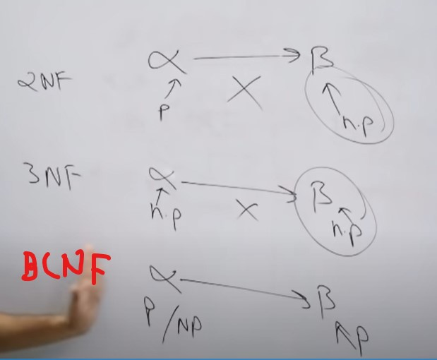

# Database Structure

- **In the relational model the term relation is used to refer to a table, while the term tuple is used to refer to a row. Similarly, the term attribute refers to a column of a table.**
- **For each attribute of a relation, there is a set of permitted values, called the domain of that attribute.**
- **We require that,for all relations r,the domains of all attributes of r be atomic. A domain is atomic if elements of the domain are considered to be indivisible units.**
- **Schema ->Logical design of database. It consists of list of attributes, and their **corresponding** domains.**
- **A superkey is a set of one or more attributes that,takencollectively,allowus to identify uniquely a tuple in the relation.**
- **Any superset of superkey is also a superkey. Minimal superkey are called candidate key.  Any super key whose proper subset is not a super key is a Candidate Key. (A relation could have more than one candidate keys)**
- **Primary key is the key chosen by database engineer to uniquely identify a tuple in a relation. Any candidate key (may or may not be minimal) which is being chosen by the database designer to identify record is a Primary Key. (A relation can have only one primary key/(composite primary key: primary key that is made up of more than one columns))**
- **A relation, say r1, may include among its attributes the primary key of anotherrelation,sayr2.This attribute is called a foreignkey from r1, referencing r2.**
-  **Schema Diagram**
-  **Three Schema Architechure -> External, Conceptual and Physical**
-  **Primary Key cannot be null and cannot be duplicate.**
- **Prime Attributes or Key attribute**.  An attribute that is present in any of the candidate keys is a prime attribute.
-  **The referencing table cannot have any foreign key not present in referenced table/base table.**

-  **[Referential Integrity](https://www.youtube.com/watch?v=DM2lAomoDrg&list=PLxCzCOWd7aiFAN6I8CuViBuCdJgiOkT2Y&index=10)**

   -  **Referenced Table**
      -  Insert in base/referenced table won't cause any violation.
      -  Deletion in base/referenced table may cause problems in referencing table. You need to perform (On Delete Casacade) or (On delete set null -> Beware in cases where Foreign key itself is primary key, in such cases it can't be set to null).
      -  Updation in base/referenced table may cause problem unless the key is changed in all the places it is referenced (On Update Casacade) or (On Update set null).

   - **Referencing Table**
     - Insert may cause problem if the key doesn't has any value in base table.
     - Deletion won't cause violation.
     - Update may cause problem if the updated key is not present in base table.

    >Even Tables describing relationship can have attributes known as descriptive attributes.

# ER MODEL
- **Entity Relationship Model vs Relational Model(Table)**
 
- Types of relationship one to one, one to many, many to one, many to many

    - **One to One**
        - You can have only 2 tables. No need for relationship table.
        - Also both foreign key has to be unique in both tables.

    - **One to Many**
        - The primary key of relationship table can be the foreign key of the many table. Example order no in customer and order table relationship.
        - You can have only 2 tables. No need for relationship table.
        - Same for Many to One.

    - **Many to Many**
        -The primary key of relationship table can be the combination of foreign key of both the tables.
        -You need all 3 tables i.e relationship table is required.

# Normalization

-   **First Normal Form**
    -   Attribute cannot contain multiple values i.e should be atomic.

-   **Second Normal Form**
    -   Should be in First Normal Form.
    -   All non - prime attributes must be fully functionally dependent on candidate key not dependent on the part or subset of candidate key.
    -  A non prime attribute can be dependent on another non prime attribute and still be in 2NF.
    -  There should be no partial dependency in the table.
  
       -  **[Check if a table is in second normal form](https://www.youtube.com/watch?v=tkbAA--wKOc&list=PLxCzCOWd7aiFAN6I8CuViBuCdJgiOkT2Y&index=23)**
          -  Find all the candidate keys by closure method.
          -  Find all prime attributes and Non prime attributes.
          -  Now  Check functional dependency of all subsets of candidate key to determine if they can determine fully a non-prime attribute.

-   **Third Normal Form**
    -   Table should be in 2nd Normal Form
    -   There should be no transitive dependency in table.
    -   non prime attribute should not determine another non prime attribute.
    -   A relation is in third normal form if it holds atleast one of the following conditions for every non-trivial function dependency X → Y.

        - X is a super key.
        - Y is a prime attribute, i.e., each element of Y is part of some candidate key.

-   **Boyce Codd normal form (BCNF)**
    -   Table shoud be in 3rd Normal Form. OR For every functional dependency X → Y, X is the super key of the table.

-   **[Closure Method (Determine all candidate keys in a table)](https://www.youtube.com/watch?v=bSdvM_0hzgc&list=PLxCzCOWd7aiFAN6I8CuViBuCdJgiOkT2Y&index=21 ) and [Second Normal Form](https://www.youtube.com/watch?v=tkbAA--wKOc&list=PLxCzCOWd7aiFAN6I8CuViBuCdJgiOkT2Y&index=23)**

    -   Write down all the attributes on the right side of the relation, the remaining ones has to be in the candidate key.
    -   Now form the candidate key by adding attributes till its closure has all the attributes.
    -   Search for the components of candidate key if they are in right side. If yes you can replace it by determinant(key on left) to form new candidate key.
    -   Watch Second Normal Form video to get clarity. 

## Trick
- First Normal Form (All values should be atomic)
- Say A->B is a functional dependency.
- Second Normal Form (A->B) (Don't allow if A is prime attribute not complete candidate key) and B is non prime.
- Third Normal Form: Has to be in 2nd NF and (A->B) (Don't Allow if A is non prime and B is non prime).
- BCNF (A->B) Just check if A is super key.

## **Functional Dependency -> Inference Rules**
    -   Reflexive
    -   Augumentation
    -   Transitive
    -   Union
    -   Decomposition
    -   Psedotransitivity
    -   Composition

-    Lossy decomposition. and spurious tuples
-    **To prevent lossy decomposition, Common attribute b/w 2 tables should be Candidate key or super key of either R1 or R2 or Both. R1 union R2 = R and R1 intersection R2 not equal empty.**

# Transaction
