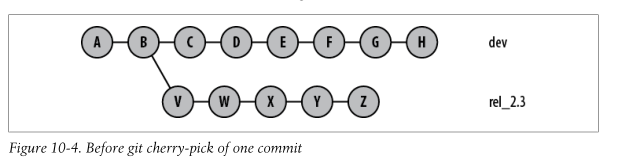
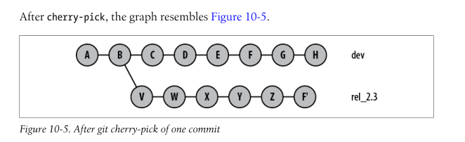

# Git Fundamentals


## View Changes

- git show HEAD~1 or git show commithash

## Branch

- View local branches `git branch`
- View remote branches `git branch -r`
- View tag `git tag`

## Logging

- Use `git log --oneline` for a condensed form of logs
- Use `git log --graph --online` to get a visual interpretation of the entire repository where branching took place and where the merging took place.
- Total commits `git log --oneline | wc -l`

#### Author informations
- `git shortlog`
- `git shortlog -sne`(summary numbersort email)


## Undo

### Undoing Changes in the single working copy.

- use git checkout (by default takes the one from the head commit)
```
git checkout filename
```

### Undo to the last commit 

- git reset --hard

### Undo the last commit and put changes in the staging area

- git reset --soft HEAD~1

### Undo the last commit completely

- git reset --hard HEAD~1 

## Important Points

- To add a removed file to staging area use `git add -u`


# GIT

### Git Working Tree/ Directory
Place where all your files exist. This a single checkout of one of the project's version.

The working tree represents files that have been created, updated or modified and diverge from the contents of the most recent commit.

- 2 Type of files exist in working tree
  - Untracked files -> git doesn't know about the file's existence and can't be included in a commit.
  
  - Tracked files -> git will take this file into account when calculating what is to be commited. Tracked files are represented in Git based on different Statuses
    
    -  Unmodified -> File is unmodified from last commit.
    
    -  Modified -> File is changed in the working tree and tracked but the changes is not yet staged for commit.
    
    -  Staged -> Files have been staged by "git add file_name". This place lets you decide what changes you want to include in your commit. Staging Area is also called index.


    - Commit -> Staged Files have been committed by calling "git commit". this also changed the HEAD pointer.This safely stores the changes in repository. These become unmodified files in next commit.
    
    - To check status use
        
          git status

### Git Commit

- To commit staged files
  
      git commit -m "My Commit message"

- To commit all the changes even unstaged

      git commit -a -m "My Commit Message"

### Git Stash

Saves all the uncommited files i.e staged and unstaged tracked files in a special stash. It allows to go to new branch without committing the changes in current version.

- To push the changes in the git stash
          
       git stash

- To see all the stash use
  
       git stash list

- To apply stashed changes back
  
       git stash apply

- To apply then drop

       git stash drop
### Git Branch

- Using git branch command you can create, edit and rename and remove branches.

- Create a new branch
  
        git branch my-branch

- Delete a branch
  - Unmerge changes will stop this.
  
        git branch -d my-branch 

  - Force changes
  
        git branch -D my-branch

- rename a branch
  
        git branch -m new-branch-name

- to change the branch you are currently in
  
        git checkout my-branch

### Git Diff

- See changes between unstaged(working tree) and staged area(index).

        git diff

- See changes between staging area(index) and HEAD.

        git diff --staged or git diff --cached

- See changes between unstaged(working tree) and HEAD.

        git diff HEAD


### Git Cherry Pick
- Consider following scenario. You have two branches.

  - a) release1 - This branch is going to your customer, but there are still some bugs to be fixed.

  - b) master - Classic master branch, where you can for example add functionality for release2.

- NOW: You fix something in release1. Of course you need this fix also in master. And that is a typical use-case for cherry picking. So cherry pick in this scenario means that you take a commit from release1 branch and include it into the master branch.





### Tag
- Tag is a pointer to a specific commit which uniquely identifies a repository version. 
- Tags are used to easily revert to old versions when in need.


### HEAD

- HEAD is a reference to the last commit in the currently check-out branch. When you switch branches with git checkout, the HEAD revision changes to point to the tip of the new branch.

- You can see what HEAD points to by doing:
  
        cat .git/HEAD

- It is possible for HEAD to refer to a specific revision that is not associated with a branch name. This situation is called a detached HEAD.

### Facts

- **to see git config**
        git config --list

- A revision is a different version of a repository.

- To see information related to previous commits/ i.e contents of commit object
        
        git log

- **Checksum -> SHA-1 Hash 40 character string.**

### MISC

- **Commit template**


