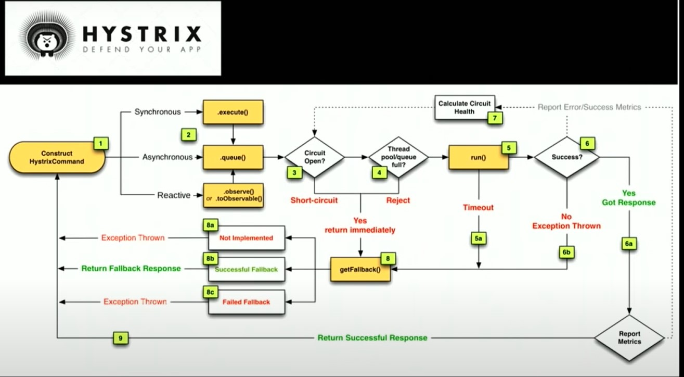
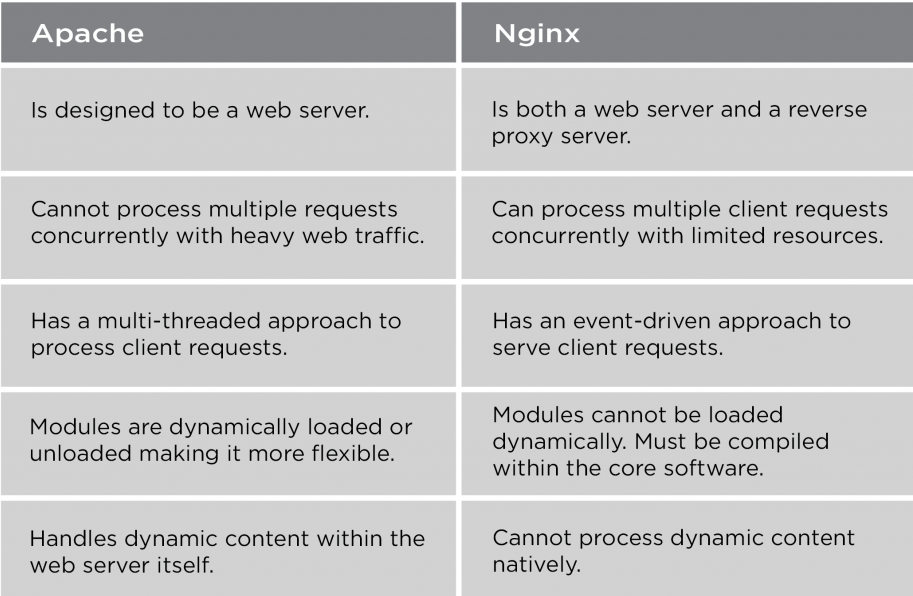
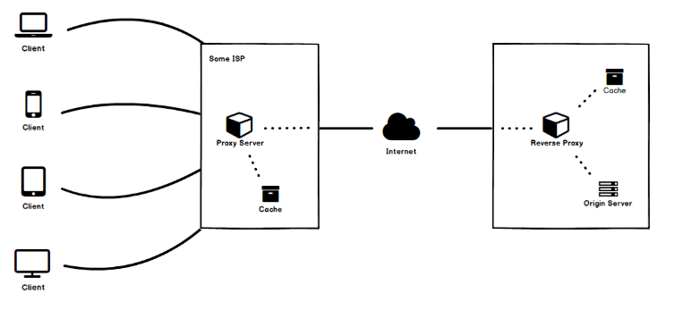
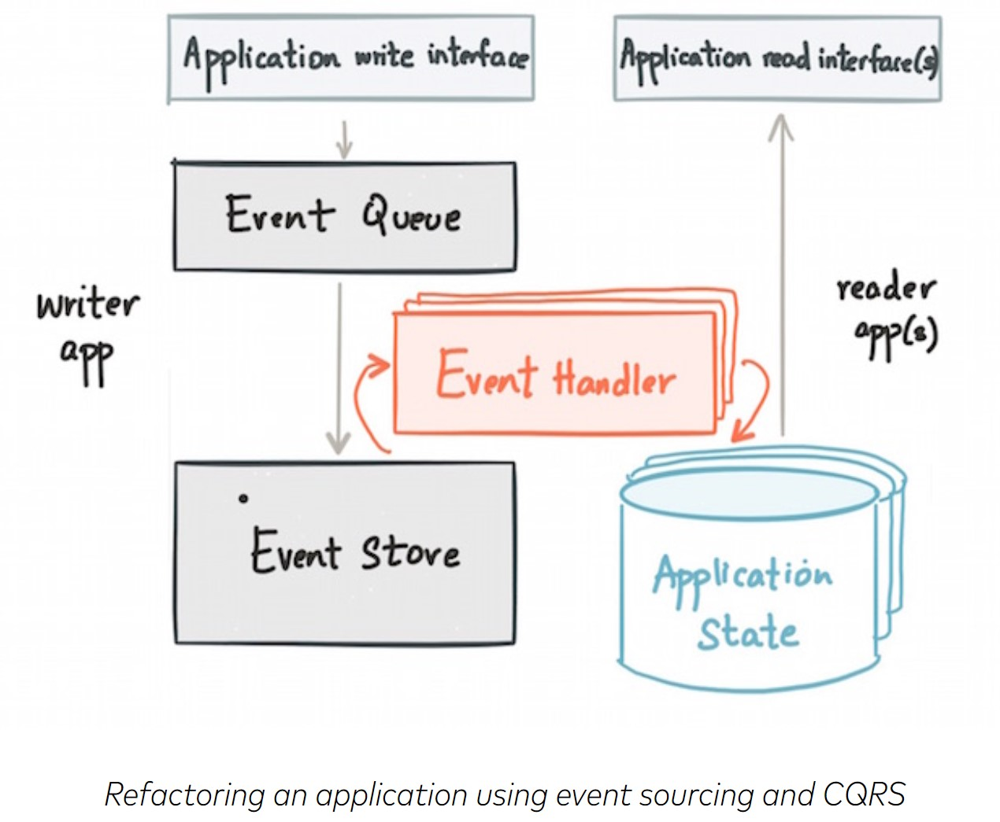
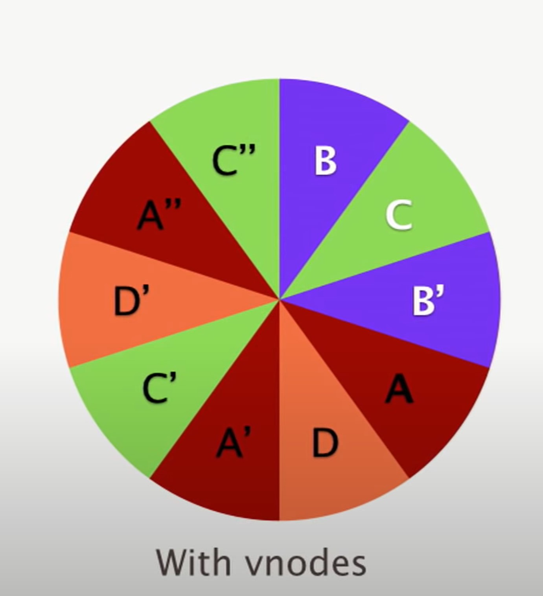

# Notes


# Netflix Talk on Microservices
## Advantages
  - Separation of concerns
  - Horizontal Scaling
  - Workload Partitioning
  - Automated operations
  - On demand provisioning
  - Context bound and data separation


## Challenges - Dependency
### Intra Service communications
- Network Latency
- Network Congestion
- Network Failure
- Logical or Scaling Failure
- Even if a single service has 99.99 availability, all services as a whole will have a lot less. Say 10 services =~ 99.9 Availability.
- ### Cascading Failures, one service fails and as a result a lot more services are failed.
  - Use hystrix to give out a fallback response so the client doesn't have to recieve an error but is given some default response.
    - 
  - Testing using fault injection in production(FIT)
    - Throughout the call path.
    - Mock live traffic.
  - Identify critical services and isolate them, make sure the application functions if everything is down.


### Persistence
#### CAP Theorem
- In the presense of network partition you must choose between consistency and availability.
- Good Explaination : [Link](https://stackoverflow.com/questions/12346326/cap-theorem-availability-and-partition-tolerance)
#### Consistency vs Availability in Cassandra
- Using Quorum, you can choose level of consistency and trade of with availability in your system.

### Infrastructure
- Infrastructure can fail
- So better to have a multi region architecture


### Solutions
- Circuit breakers, fallbacks, chaos testing
- Simple clients
- Eventual Consistency
- Multi-region failover

## Challenges - Scale

### For Stateless Service

#### Defination of stateless
- Not a cache/database.
- Frequently accessed meta data.
- No instance affinity of client.
- Loss of a node is a non event.

#### Solution for Scale for stateless service
- Autoscaling Group helps scaling very easily, nodes get replaced easily
  - Helps absorb, DDOS Attacks, performance hits etc.
  - Test using chaos testing.


### For Stateful Service

#### Defination of stateful service
- Databases and cache
- Avoid storing business logic and state in one application.
- Loss of a node is a notable event, it may take hours to replace a node.

#### Solution for Scale for stateful service

- Dedicated Shards (Single Point of Failure) ANTI PATTERN
- Redundancy using EVCache (Wrapper around Memcached, sharded but multiple copies are written to multiple nodes and different AZs).
  - Reads are local.
- EXCESSIVE LOAD IN SINGLE CACHE CLUSTER
  - IF CACHE CLUSTER GOES DOWN, THE ENTIRE load will be on the service and database, which will then fail due to so much requests.
    - Have different systems for batch processing and realtime processing
    - Chaos testing
    - Request level caching??


## Challenges - Variance/ Variaty in your architecture
### Operational drift
- Unintentional, happens naturally.
- Overtime throughput changes
- Untuned timeouts and retries and fallback. 
#### Solutions
- #### CONTINUOS LEARNING AND AUTOMATION
  - Incident review and remediation and analysis of the pattern.
  - And then automate and drive adoption.
  - Squeeze testing to make sure throughput is same
  - Tune the timouts, retries and fallback etc.
  - Alerts
  - Proper configuration of apache and tomcat
  - automated canary analysis
  - autoscaling
  - chaos testing
  - ELB Configs
  - Healthchecks
  - Immutable machine images/AMI
  - Stages, red/black deployments
  - Staging deployment so you don't deploy bad code to all the places simultaneously.


### Polyglot & Containers 
- Introduce new technologies.

#### Solutions
- Raise awareness of cost beforehand.
- Constrain centralized support.
- Prioritize by impact.
- Use GRPC type code generation for multiple client libraries.

## How to get velocity in development with confidence
Use integrated and automated pipelines (spinnaker)
- Conformity Checks
- Red/Black Pipeline
- Automated Canaries
- Staged Deployment to multiple regions
- Squeeze tests


## CONWAY'S LAW
- Any piece of software reflects the organizational structure that produced it. If you have 4 teams working on compiler, you will end up with 4 pass compiler.
- It should be solution's first, team second.
- Reconfigure teams to best support your architecture.

# Source -> Gaurav-Sen

* ## XMPP -> peer to peer protocol. Extensible Messaging and Presence Protocol 

* ## Websockets

* ## XMPP vs Websockets

* ## Distributed Caching
    * ### Uses
        * Speeds up responses
            1. Save network calls.
            2. Avoiding computations by storing computations in cache.
        * Reduce database load.

    * ### Cache should have relevant information
        * When to load data and erase in cache (cache policies)
            1. Least Recently Used entry (LRU).
            2. Least Frequently Used (LFU).
    
    * ### Things that can go wrong
        * poor policy leads to more cache misses.
        * thrashing, you populate cache with data but before using it you delete it.
        * consistency

    * ### where to place cache
        * Closer to server (Simple and fast response)
            *  easier to implement
            *  low network calls.
            *  memory is shared between server and cache so they will compete

    * ### Distributed global cache (Redis) (Used in real life scenarios).
        * avoiding queries and memory and computations on database.
        * no single point of failure.
        * Scales independently of server.
        
    * ### consistency of cache.
        * Write through -> make all the updates go through cache first then write to database.
            * Problems
                * performance on write.
                * consistently update the data on all caches and entities.

        * Write Back -> hit database directly and then you make sure you either delete or update the entity in cache.
            * Expensive. as once you write to database you need to write back to all the cache in the server of distributed network. this is unnecessary in case of not so important data.
        
        * Hybrid Model ->for not so important data.
            * write on cache of one server, without caring about consistency on other servers, after some time take entries in bulk and persist inthe database.


* ## API Design
    * Good names
    * Parameters
    * No side effects i.e an api function saying setadmins should not also add members if they aren't part of group instead should return an error.
    * Multiple Operations is bad *  don't pass big objects to api.
    * Atomicity is important for some conditions.
    * Relevant error messages.
    * Break response in pieces so small response 
    * Pagination (just get first ten or ten from an offset).
    * Fragmentation (Break response into multiple pieces and give it to next service using packet numbers).
        
    * To cache or not to cache 
        * Perfect consistency 
        * slow, else caching 
        * fast
    
* ## SQL or NoSQL
        


# Indexing -
  
  - https://medium.com/hackernoon/fundamentals-of-system-design-part-3-8da61773a631
  
  - https://stackoverflow.com/questions/7306316/b-tree-vs-hash-table
  
  - https://www.youtube.com/watch?v=aZjYr87r1b8

            
# Apache vs NGINX
- Apache is process driven and create a new thread for each request.
- NGINX is event driven and handles multiple requests within one thread.




# Concept of Encryption at motion and encryption at rest
-   Data can be exposed to risks both in transit and at rest and requires protection in both states. As such, there are multiple different approaches to protecting data in transit and at rest. Encryption plays a major role in data protection and is a popular tool for securing data both in transit and at rest. For protecting data in transit, enterprises often choose to encrypt sensitive data prior to moving and/or use encrypted connections (HTTPS, SSL, TLS, FTPS, etc) to protect the contents of data in transit. For protecting data at rest, enterprises can simply encrypt sensitive files prior to storing them and/or choose to encrypt the storage drive itself.

# Connection Pooling
In software engineering, a connection pool is a cache of database connections maintained so that the connections can be reused when future requests to the database are required. Connection pools are used to enhance the performance of executing commands on a database.

# Dynamo DB vs Elastic Cache for Session Storage


# Semaphore vs lock vs Mutex
- A lock allows only one thread to enter the part that's locked and the lock is not shared with any other processes.

- A mutex is the same as a lock but it can be system wide (shared by multiple processes).

- A semaphore does the same as a mutex but allows x number of threads to enter, this can be used for example to limit the number of cpu, io or ram intensive tasks running at the same time. Ex-> Chrome limits only 6 connections per hostname at a time.

- You also have read/write locks that allows either unlimited number of readers or 1 writer at any given time.


# Optimistic Lock vs Pessimistic Lock

## Pessimistic Lock
- This approach assumes that conflicting operations happen more frequently (that's why it's called pessimistic). Since the conflicts are common, this approach makes use of locks to prevent conflicting operations from executing, assuming that there is no significant overhead from their usage.
- Usual file locking mechanism, where if one thread/process acquires the lock, no one is allowed to update the locked file till the process with the lock/mutex releases the lock
- Used in db and log read write.
- It holds on to resources, no other concurrent actors can modify.
- Useful when more conflicts are there.
- Suceptible to deadlocks.
- Read Lock/Shared Lock -> Concurrent Process can read but can't write
- Write Lock/Exclusive Lock -> Concurrent Process can't read not write.
- Widely known algo for pessimestic lock is 2 Phase Locking (Not to be confused with 2 Phase Commit in Distributed Transaction).


## Optimistic Lock
- It is lock based on version number. The process/thread/person first reads both data and version number, he does processing on data and when he goes back to write the updated information, he checks if the version number is same as the time he read the data, if yes he writes the data and increments the version number, else someone else already updated the original data after it has been first read by the process. 
- It is used in wiki pedia, one person can read the data, meanwhile others are also allowed to read and write back before the first person wrote it back, this ensures other users are not blocked till the first user updated the article. 
- Also used in git version control, if someone else already updated before original person wrote back, we get merge conflicts and need to resolve.
- More performant since, optimistic lock won't hold on to resource.
- Useful when few conflicts are there.

## Optimistic Lock Vs MVCC
- I think they are sometimes used interchangeably, and if the transaction only involves one object then they are essentially the same, but MVCC is an extension of optimistic concurrency (or a version of it) that provides guarantees when more than one object is involved. Say that you have two objects, A and B, which must maintain some invariant between them, e.g. they are two numbers whose sum is constant. Now, a transaction T1 subtracts 10 from A and adds it to B, while, concurrently, another transaction T2 is reading the two numbers. Even if you optimistically update A and B independently (CAS them), T2 could get an inconsistent view of the two numbers (say, if it reads A before it's modified but reads B after it's been modified). MVCC would ensure T2 reads a consistent view of A and B by possibly returning their old values, i.e., it must save the old versions.

- To sum up, optimistic locking (or optimistic concurrency control), is a general principle for synchronization w/o locks. MVCC is an optimistic technique which allows isolated transactions which span multiple objects.


# Distributed Transaction/Data Consistency
- 2 Phase Commit
  - Bad since co-ordinator is single point of failure.
- Sagas
  - You have a sub transaction (POST Payment and return ID) and a corresponding compensating transaction (Delete By Payment ID)
  - https://www.youtube.com/watch?v=xDuwrtwYHu8
  - You need an SEC, Stateless co-ordinator
  - You need a commit log/ kafka message bus to keep track of all the events happened
  - You need your comensating transaction to be idempotent.
  - You need your sub transaction to be idempotent too if you are going for forward recovery.
- ACID
  - Atomicity
    - Atomicity requires rolling back to previous state if the transaction wasn't successful.
    - You either have a succesful transaction(unit of work), or you roll back to previous state, there is no intermediate state.
  - Consistency
    - Different meaning than that of the CAP theorem's C.
    - Here it means all the data constraints are valid.
    - In CAP what C means if we are in a master slave architecture, the data should update in slave as soon as it updates in master.  
  - Isolation
    - We can't assume serializability cause concurrent process can also try to access the same resource. Interleaving concurrent transaction should execute as if they came in a serial way, once after the other. You need to use some sort of concurrency control.

    - You can avoid using 2 Phase Locking/ Pessimistic Locks
      - Acquire lock, process then commit/roll back the release the lock.
      - Locking is costly,
    - You can detech using Multi Version Concurrency control.

  - Durability
    - Once we commit, all the changes should be persisted, i.e they shouldnt go away once the power shuts off. Some databases delay the sync between memory and disk since that would lead to a lot of IO operation on disk, and they only write to disk at checkpoints. A solution to this is to use an append only logs, any time there is a write, you write to a commit log along with memory. Commit log append is fast and if the system shuts down with data in memory but not synced with disk, commit log can be used to recover the data.


# Amazon Locking System
- You can discuss 2 concepts, 
  - KD-Tree 
    -  All the lockers can be put in a data structure like (K_dimension tree), to effectively search lockers, based on k dimensions 
    - Implement ```find_Locker(item_id,size_requested,customer_latitude,customer_longitude)```
  - Distributed Transaction 
    -  Locker should only be booked when the payment's service is succeded. This will involve a distributed transaction like SAGAS.

# North South, East West Traffic
North/South traffic is the traffic heading in and out of your network. East/West traffic is the traffic from one server to another inside your network.


# Cache 
Read -> https://roadmap.sh/guides/http-caching



## Cache Control

### private
Setting the cache to private means that the content will not be cached in any of the proxies and it will only be cached by the client (i.e. browser)

### public
If set to public, apart from being cached by the client, it can also be cached by the proxies; serving many other users

### no-store
no-store specifies that the content is not to be cached by any of the caches

### no-cache
no-cache indicates that the cache can be maintained but the cached content is to be re-validated (using ETag for example) from the server before being served. That is, there is still a request to server but for validation and not to download the cached content.
```Cache-Control: max-age=3600, no-cache, public```

# Dead Letter Queue
- In case of asynchronous communication, if we want to tell failure cases to the calling service/ publishing service, we can write the failure to the dead letter queue and the publishing service can be subscriber of this queue.

# UDP Usecases
- For videos and real time gaming, it doesn't make sense to resend the lost packet, since on recieving it you will see things back in time so udp is a good protocol.[Link](https://www.youtube.com/watch?v=oIRkXulqJA4&list=PLIhvC56v63IJVXv0GJcl9vO5Z6znCVb1P&index=6)

# Forward and Reverse Proxy
https://roadmap.sh/guides/proxy-servers

# Using Heterogenous Job Processing Workflow
- For messages in SQS, a lambda can be written which sees if a demanding task is in queue and increase the resources in consumer.

# micro and macro service decisions


# Chrome's Multiprocess architecture
- Chrome identifies three different types of processes: browser, renderers, and plug-ins.

- The browser process is responsible for managing the user interface aswell as disk and network I/O. A new browser process is created when Chrome is started. Only one browser process is created.
- Renderer processes contain logic for rendering web pages. Thus, they contain the logic for handling HTML, Javascript, images, and so forth. As a general rule, a new renderer process is created for each website opened in a new tab, and so several renderer processes may be active at the same
time.

- A plug-in process is created for each type of plug-in (such as Flash or QuickTime) in use. Plug-in processes contain the code for the plug-in as well as additional code that enables the plug-in to communicate with associated renderer processes and the browser process.
- The advantage of the multiprocess approach is that websites run in isolation from one another. If one website crashes, only its renderer process is affected; all other processes remain unharmed.

# NoSQL vs SQL
### Why does NoSQL scale better?
It's not about NoSQL vs SQL, it's about BASE vs ACID.

Scalable has to be broken down into its constituents:

Read scaling = handle higher volumes of read operations
Write scaling = handle higher volumes of write operations
ACID-compliant databases (like traditional RDBMS's) can scale reads. They are not inherently less efficient than NoSQL databases because the (possible) performance bottlenecks are introduced by things NoSQL (sometimes) lacks (like joins and where restrictions) which you can opt not to use. Clustered SQL RDBMS's can scale reads by introducing additional nodes in the cluster. There are constraints to how far read operations can be scaled, but these are imposed by the difficulty of scaling up writes as you introduce more nodes into the cluster.

Write scaling is where things get hairy. There are various constraints imposed by the ACID principle which you do not see in eventually-consistent (BASE) architectures:

Atomicity means that transactions must complete or fail as a whole, so a lot of bookkeeping must be done behind the scenes to guarantee this.
Consistency constraints mean that all nodes in the cluster must be identical. If you write to one node, this write must be copied to all other nodes before returning a response to the client. This makes a traditional RDBMS cluster hard to scale.
Durability constraints mean that in order to never lose a write you must ensure that before a response is returned to the client, the write has been flushed to disk.
To scale up write operations or the number of nodes in a cluster beyond a certain point you have to be able to relax some of the ACID requirements:

Dropping Atomicity lets you shorten the duration for which tables (sets of data) are locked. Example: MongoDB, CouchDB.
Dropping Consistency lets you scale up writes across cluster nodes. Examples: riak, cassandra.
Dropping Durability lets you respond to write commands without flushing to disk. Examples: memcache, redis.
NoSQL databases typically follow the BASE model instead of the ACID model. They give up the A, C and/or D requirements, and in return they improve scalability. Some, like Cassandra, let you opt into ACID's guarantees when you need them. However, not all NoSQL databases are more scalable all the time.

The SQL API lacks a mechanism to describe queries where ACID's requirements are relaxed. This is why the BASE databases are all NoSQL.

Personal note: one final point I'd like to make is that most cases where NoSQL is currently being used to improve performance, a solution would be possible on a proper RDBMS by using a correctly normalized schema with proper indexes. As proven by this very site (powered by MS SQL Server) RDBMS's can scale to high workloads, if you use them appropriately. People who don't understand how to optimize RDBMS's should stay away from NoSQL, because they don't understand what risks they are taking with their data.

The landscape of databases has evolved since posting this answer. While there is still the dichotomy between the RDBMS ACID world and the NoSQL BASE world, the line has become fuzzier. The NoSQL databases have been adding features from the RDBMS world like SQL API's and transaction support. There are now even databases which promise SQL, ACID and write scaling, like Google Cloud Spanner, YugabyteDB or CockroachDB. Typically the devil is in the details, but for most purposes these are "ACID enough". For a deeper dive into database technology and how it has evolved you can take a look at this slide deck (the slide notes have the accompanying explanation).

# Stream Processing and Event Sourcing

## Stream Processing
Two options for storing data: (a) raw events, or (b) aggregated summaries.

### Raw Events
- the raw events are the form in which it’s ideal to write the data: all the information in the database write is contained in a single blob. You don’t need to go and update five different tables if you’re storing raw events — you only need to append the event to the end of a log. That’s the simplest and fastest possible way of writing to a database.

### Aggregated Summaries
the aggregated data is the form in which it’s ideal to read data from the database. If a customer is looking at the contents of their shopping cart, they are not interested in the entire history of modifications that led to the current state — they only want to know what’s in the cart right now. So when you’re reading, you can get the best performance if the history of changes has already been squashed together into a single object representing the current state.
#### OLAP Cube : 
imagine a multi-dimensional cube, where one dimension is the URL, another dimension is the time of the event, another dimension is the browser, and so on. For each event, you just need to increment the counters for that particular URL, that particular time, etc.

With an OLAP cube, when you want to find the number of page views for a particular URL on a particular day, you just need to read the counter for that combination of URL and date. You don’t have to scan over a long list of events; it’s just a matter of reading a single value.


## Event Sourcing
And this is really the essence of event sourcing: rather than performing destructive state mutation on a database when writing to it, we should record every write as a “command”, as an immutable event.

- This is what storing raw events in stream processing example tells, gives history of what happened, unlike storing the aggregated data, which store only the end state.

### Advantages
- Event sourcing enables building a forward-compatible application architecture — the ability to add more applications in the future that need to process the same event but create a different materialized view.
- t provides a complete log of every state change ever made to an object; so troubleshooting is easier. By expressing the user intent as an ordered log of immutable events, event sourcing gives the business an audit and compliance log which also has the added benefit of providing data provenance. It enables resilient applications; rolling back applications amounts to rewinding the event log and reprocessing data. It has better performance characteristics; writes and reads can be scaled independently. It enables a loosely coupled application architecture; one that makes it easier to move towards a microservices-based architecture.

## Command Query Responsibility Segregation (CQRS)
- the event sourcing and CQRS application architecture patterns are also related. Command Query Responsibility Segregation (CQRS) is an application architecture pattern most commonly used with event sourcing. CQRS involves splitting an application into two parts internally — the command side ordering the system to update state and the query side that gets information without changing state. CQRS provides separation of concerns – The command or write side is all about the business; it does not care about the queries, different materialized views over the data, optimal storage of the materialized views for performance and so on. On the other hand, the query or read side is all about the read access; its main purpose is making queries fast and efficient.



The way event sourcing works with CQRS is to have part of the application that models updates as writes to an event log or Kafka topic. This is paired with an event handler that subscribes to the Kafka topic, transforms the event (as required) and writes the materialized view to a read store. Finally, the read part of the application issues queries against the read store.

### Advantages
- It decouples the load from writes and reads allowing each to be scaled independently; the various read paths themselves can be scaled independently.
- the read store can be optimized for the query pattern of the application; a graph application can use Neo4j as its read store, a search application can use Lucene indexes and a simple content serving webapp can use an embedded cache.
- , you can decouple the teams responsible for the business logic of the write and read paths.

## References
- https://www.confluent.io/blog/making-sense-of-stream-processing/
- https://www.confluent.io/blog/event-sourcing-cqrs-stream-processing-apache-kafka-whats-connection/#:~:text=Event%20sourcing%20involves%20modeling%20the,or%20%E2%80%9Clog%E2%80%9D%20of%20events.&text=Event%20sourcing%20involves%20changing%20the,log%2C%20like%20a%20Kafka%20topic.


# Things I wish Developer's Knew About Databases - Jaana Dogan
## Network Issues can be a problem

## ACID has different meanings for different databases
- Databases might advertise themselves as ACID but might still have different interpretation in edge cases or how they handle “unlikely” events.

## Each database has different consistency and isolation capabilities.
- See isolation Levels in Hussain's Notes
### Refer
- https://jepsen.io/consistency
- https://github.com/ept/hermitage

## Optimistic Locking for low contention systems
- Optimistic locking is a method when you read a row, you take note of a version number, last modified timestamps or its checksum. Then you can check the version hasn’t changed atomically before you mutate the record.

## There are anomalies other than dirty reads and data loss.
### Write Skews
- Generally causes data integrity issues as the logical constraints is compromised.
- Caused when 2 different transaction perform disjoint writes and are sucessful.
- Serializable isolation, schema design or database constraints can be helpful to eliminate write skews. 

## My database and I don’t always agree on ordering.
```
result1 = T1() // results are actually promises
result2 = T2()
```
Since promises are non blocking, A DB may recieve T1 and T2 at the same time or worse recieve T2 before T1, If atomicity is required (to either fully commit or abort all operations) and the sequence matter, the operations in T1 and T2 should run in a single database transaction.

## Application-level sharding can live outside the application.
- Some database may not support sharding, so it is possible to move the sharding/partition logic outside of database, something known as application level sharding.
- But the application level sharding can be offered outside of your application, infront of the database to decouple application and shard server. 
- Depending on data growth and schema iterations, sharding requirements might get complicated. Being able to iterate on some strategies without having to redeploy application servers may be useful.
### Vitess
- One such example of an application-level sharding system is **Vitess**. Vitess provides horizontal sharding for MySQL and allows clients to connect to it via the MySQL protocol and it shards the data on various MySQL nodes that don’t know about each other.

## AUTOINCREMENT’ing can be harmful.
- Way to generate primary keys. Databases are used as ID generators
- In distributed database systems, A global lock would be needed to be able to generate an ID. If you can generate a UUID instead, it would not require any collaboration between database nodes. Autoincrementing can thus lead to degraded performance.
- Some databases have partitioning algorithms based on primary keys. Sequential IDs may cause unpredictable hotspots and may overwhelm some partitions while others stay idle.
- The fastest way to access to a row in a database is by its primary key. If you have better ways to identify records, sequential IDs may make the most significant column in tables a meaningless value. Please pick a globally unique natural primary key (e.g. a username) where possible.

## Stale data can be useful and lock-free.
- MVCC to allow each transaction to see a snapshot, an older version of the database. Transactions against snapshots still can be serializable for consistency. When reading from an old snapshot, you read stale data.
- would allow read-only transactions to to be lock-free.

### Vacuuming
- Databases sweep the old versions automatically and in some cases, they allow you to do that on demand. For example, Postgres allows users to VACUUM on demand as well as automatically vacuuming once a while

## Clock skews happen between any clock sources.
- all time APIs lie.

### Google's True Time
- TrueTime uses two different sources: GPS and atomic clocks. These clocks have different fail modes, hence using both of them is increasing the reliability.

## Latency has many meanings.
client_latency = database_latency + network_latency

## Evaluate performance requirements per transaction/Query.
- Instead of a general view of latency or throughput of a database, determine what is the latency/throughtput of the particular usecase Say,:
- Latency when querying the friends of friends of a user when average number of friends is 500.
- Latency of retrieving the top 100 records for the user timeline when user is subscribed to 500 accounts which has X entries per hour.

### Distributed Tracing
- Distributed tracing, sometimes called distributed request tracing, is a method to monitor applications built on a microservices architecture. This allows them to pinpoint bottlenecks, bugs, and other issues that impact the application’s performance.
- AWS X-Ray

### How to debug for latency
- https://rakyll.medium.com/want-to-debug-latency-7aa48ecbe8f7

## Transactions shouldn’t maintain application state.
- In other words, transactions should be idempotent, to not be affected by retries.

## Query planners can tell about databases.

- Query planner’s role is to determine which strategy is the best option. Say Full table scan/ Index Scan.

## Online migrations are complex but possible.
- Online, realtime or live migrations mean migrating from one database to another without downtime and compromising data correctness.

### 4 step dual writing pattern
- Before beginning, it is important to note the performance impact, it will be to copy to 2 database models.
- What this 4 phase model will allow you to do, is that you can revert back to the old schema, if you find any inconsistency.

#### Dual writing to the existing and new tables to keep them in sync.
- At this stage, all reads are directed to old table.
- We begin by creating newly created data in both tables, while the older data is only in the older table. writing data to the old store and then copying them to the new store:
- Then, We’ll start copying over existing subscriptions in a lazy fashion: whenever objects are updated, they will automatically be copied over to the new table. 
- Finally, we’ll backfill any remaining tables.

#### Changing all read paths in our codebase to read from the new table.
- At this point both old and new database are in sync.
- Use, GitHub’s Scientist lets us run experiments that read from both tables and compare the results.
- After we verified that everything matched up, we started reading from the new table.

#### Changing all write paths in our codebase to only write to the new table.
- Up until now, we’ve been writing data to the old store and then copying them to the new store.
- We now want to reverse the order: write data to the new store and then archive it in the old store. 

####  Removing old data that relies on the outdated data model.

### Reference
- https://stripe.com/blog/online-migrations

## Significant database growth introduces unpredictability.

# Donnemartin

## Weak vs Eventual Consistency
- After a write reads may not see it. Video chat, multiplayer gaming, VoIP.
- After a write, read will eventually see it.

## CAP Theorem
- https://stackoverflow.com/questions/12346326/cap-theorem-availability-and-partition-tolerance

## Availability Patterns

### Failover
#### Active Passive Failover
- heart beats sent between active and passive server, if active server doesn't respond then passive server takes over active's IP and resumes service.
- There is potential for dataloss if there is time lag between passive's takeover. It should be hot standby not cold standby.

#### Active Active
- Both servers are managing traffic.
- DNS/application logic needs to know the IP of both servers.

### Replication
- Master Slave replication
- Master Master replication

### Availability in Sequence vs Parallel
- Service's overall ability depends on whether the components are in sequence or in parallel
#### Sequence
- ```Total Availability = Availability(Foo)*Availability(Bar)```
#### Parallel
- ```1- Total Availability = (1-Availability(Foo))*(1-Availability(Bar))```

## DNS Records
- NS record (name server) - Specifies the DNS servers for your domain/subdomain.
- A record (address) - Points a name to an IP address.
- CNAME (canonical) - Points a name to another name or CNAME (example.com to www.example.com) or to an A record.

## Benifits of load balancing
- SSL Termination : Decrypt incoming requests and encrypt server responses so backend servers do not have to perform these potentially expensive operations.
- Session persistence : Issue cookies and route a specific client's requests to same instance if the web apps do not keep track of sessions


## Federation
- Federation (or functional partitioning) splits up databases by function. For example, instead of a single, monolithic database, you could have three databases: forums, users, and products, resulting in less read and write traffic to each database and therefore less replication lag.
- Similar to sharding

## Ways to speed up database
- Indexing
- SQL Tuning/Optimzation (See Mosh Notes)
- Caching
- Denormalization
  - Denormalization attempts to improve read performance at the expense of some write performance. Redundant copies of the data are written in multiple tables to avoid expensive joins.
  - Denormalization might circumvent the need for such complex joins in sharded dbs.
  - Useful in most cases since reads dominate writes.
- Using materialized views (When latest data isn't required. See Below)
- Logical Partitioning
- Federation
- Physical Sharding


## Caching
- Client caching (OS/Browser level)
- CDN (For static content)
- Reverse Proxy Caching
- DB Caching (Caching in DB Server Itself)
- Application Caching (Redis /Memcached)
### What is cached?
- Row level
- Query level
  - Hard to delete a cached result with complex queries
  - If one piece of data changes such as a table cell, you need to delete all cached queries that might include the changed cell
- Fully formed serialized objects
- Static content like HTML

### Suggestions on what to cache
- User Sessions
- Fully rendered web pages
- Activity streams

### When to update
#### Cache Aside
  - Look for entry in cache, resulting in a cache miss
  - Load entry from the database
  - Add entry to cache
  - Return entry
  - Each cache miss results in three trips, which can cause a noticeable delay.
  - Data can be stale, need a good TTL.

#### Write-through
  - Application adds/updates entry in cache
  - Cache **synchronously** writes entry to data store
  - Return
  - Slow writes.
  - Most data written might never be read, which can be minimized with a TTL.

#### Write-behind (write-back)
  - Add/update entry in cache
  - Asynchronously write entry to the data store, improving write performance.
  - There could be data loss if the cache goes down prior to its contents hitting the data store.

## Asynchronous Processing

### Back Pressure
- If queues start to grow significantly, the queue size can become larger than memory, resulting in cache misses, disk reads, and even slower performance. Back pressure can help by limiting the queue size, thereby maintaining a high throughput rate and good response times for jobs already in the queue. Once the queue fills up, clients get a server busy or HTTP 503 status code to try again later. Clients can retry the request at a later time, perhaps with exponential backoff.


# Views vs Materialized Views
## Views
- They evaluate the data in the tables underlying the view definition at the time the view is queried. It is a logical view of your tables, with no data stored anywhere else.
- Views are virtual only and run the query definition each time they are accessed.
- The upside of a view is that it will always return the latest data to you. The downside of a view is that its performance depends on how good a select statement the view is based on. If the select statement used by the view joins many tables, or uses joins based on non-indexed columns, the view could perform poorly.

## Materialized Views
- Materialized views are disk based and are updated periodically based upon the query definition.
- When you need performance on data that don't need to be up to date to the very second, materialized views are better, but your data will be older than in a standard view. 
- They are similar to regular views, in that they are a logical view of your data (based on a select statement), however, the underlying query result set has been saved to a table. The upside of this is that when you query a materialized view, you are querying a table, which may also be indexed.
- In addition, because all the joins have been resolved at materialized view refresh time, you pay the price of the join once (or as often as you refresh your materialized view), rather than each time you select from the materialized view. 
- Materialized views can be set to refresh manually, on a set schedule, or based on the database detecting a change in data from one of the underlying tables. 
- Materialized views are primarily used to increase application performance when it isn't feasible or desirable to use a standard view with indexes applied to it. Materialized views can be updated on a regular basis either through triggers or by using the ON COMMIT REFRESH option.


# Cassandra
- Fast because data on write is written in memory and a commit log(very fast even on disk, since it is append only write important for durability in case the cassandra node fails before the data is written to the disk).
- Also periodically the data from mem-table is written to ss-table which is also fast because of sequential IO and not random IO.
- The write to SS-Table is immutable, unlike in MySQL where due to random IO thrashing(more time spent on pagining than useful work) occurs.
- ### LWW :Cassandra looks for newer time stamp, that is the last write wins, and periodically it performs compaction.
- Compaction : Looks at SS Table, performs a merge sort, pick the one with latest time stamp and then writes out to another SS Table. (One big Sequential Read to Memory, and then one big sequential write).
- Unlike in MySQL which frontloads the IO, Cassandra defers random IO to later time, and making it efficient sequential bulk IO.
- Cassandra is peer to peer, there is no leader election, there is no master slave, everything  is active-active.
- Uses Consistent Hashing and virtual nodes to deal with skewed nodes.
- Each nodes also has a replication factor say, 3 (we have a primary node which is responsible for a range, we also have 2 replicas which is chosen among the other fellow nodes, based on load).
  
- We can decommision the nodes and add nodes without skewed distribution and scale linearly.
## Reads
- Client can ask any node, what is my data, it is the responisibility of the node(coordinator) to figure out who has the data and if data is not same how to solve for what is the correct data? Client is aware of the token ring and it finds the data.
- Reads are slower, since to get the Latest write, you need to scan the entire ss tables, assuming compaction didn't occur.
- Cassandra stores timestamp with every column value inserted, updated and deleted. To serve read request, Cassandra combines data from multiple datafiles and create a consistent image of data based on last write wins principal. As every read involves reading from multiple files, read performance can be slower if Cassandra is not maintained well.
- One expcerpt from Discord's : [How discord stores billion's of messages](https://blog.discord.com/how-discord-stores-billions-of-messages-7fa6ec7ee4c7):
  - We noticed Cassandra was running 10 second “stop-the-world” GC constantly but we had no idea why. We started digging and found a Discord channel that was taking 20 seconds to load. The Puzzles & Dragons Subreddit public Discord server was the culprit. Since it was public we joined it to take a look. To our surprise, the channel had only 1 message in it. It was at that moment that it became obvious they deleted millions of messages using our API, leaving only 1 message in the channel.
  - When a user loaded this channel, even though there was only 1 message, Cassandra had to effectively scan millions of message tombstones (generating garbage faster than the JVM could collect it). 
  - Deleting can also be a pain because records aren't deleted, rather a tombstone is placed ontop of the record so that eventually when tables reach a certain size, they're merged and then tombstoned rows are deleted.

## Consistency Level (Tunable Consistency in Cassandra)
- Set with every read/write
- Say consistency level is ONE, just ping a certain node containing the data and return the fetched data, no coordination/conflict resolution, it is very fast.
- QUORUM, 51 or greater nodes are answering the same data.
- LOCAL QUORUM : 51 or greater nodes answering the same data in local Data Center.
- LOCAL ONE : Read repair only in local DC.
- TWO :
- ALL : All replicas acknowledge, Full consistency.
- Paxos : For lightweight transaction. ( IF NOT EXISTS)

## Paxos
- Family of distributed algorithms used to reach consensus.
- Consensus is required in leader-slave basics when the leader fails and a new leader has to be elected. Consensus is required in peer to peer in case of the peer-to-peer all the time for any action to guarantee consistency.
- Paxos defines 3 roles : proposer, acceptors and learners.
- Paxos nodes can take all these roles.
- Paxos nodes must be persistent.(Atleast in vanilla Paxos)
- A Paxos runs at aiming a single consensus.
- If a majority of  acceptors promise IDp, no ID less than IDp can make it through.
- If a majority of acceptors accept (IDp, value) consensus is reached. (Consensus is and always will be on value not on IDp : IDp is internal to Paxos logic).
- If a proposer or learner gets majority of accept for a specific IDp, they know that consensus is reached on value.

### Practical Case:
[Link](https://youtu.be/d7nAGI_NZPk?t=1239)

### Reference
- https://www.youtube.com/watch?v=d7nAGI_NZPk

## INSERTS
- Insert will always overwrite, unless you specify (IF NOT EXISTS : Paxos will run).

## Features of CQL
- Reverse the order of clustering (Great for timestamp), you don't need to hop over already written rows.
```WITH CLUSTERING ORDER BY (interaction_time DESC);``` 
- TTLs : Helpful for user sessions on web. (Be careful with it).

## Cassandra vs RDBMs
Major reason behind Cassandra’s extremely faster writes is its storage engine. Cassandra uses  Log-structured merge trees, whereas traditional RDBMS uses B+ Trees as underlying data structure.
Consider an update statement,
```UPDATE Department SET DeptName = 'Sales' WHERE DEPTID = 100;```
### Oracle's Behavior
Following operations occur:
- Server process will check if respective block is present in database buffer Cache/RAM
- If block is not available in buffer Cache, server process will scan respective datafile and copy block to memory.
- Copied block will be modified in Memory.
- Respective redo and undo entries will be created.
- Once committed, database will write block again to respective datafile.
- Both scanning the datafile and copying in memory and writing it again to disk is expensive work.

### Cassandra's Behavior
- Log redo entry in commit log (Cassandra’s own redo log)
- Write update entry in memtable (memtable is table in database's RAM)
- Occassionally flush data from the memtable to SSTable and perform compaction occasionally.
- ### Cassandra doesn’t care about existing value of column which is being modified, it skips read part completely and create a record in memory including column and updated value. 
- It then groups inserts and updates in memory, and at intervals, sequentially writes the data to disk in append mode. With each flush, data is written in immutable files and is never overwritten. As a result, as it skips scanning of long data files and again adding data to same long datafiles, writes take significantly less time in Cassandra.
- 

## Cassandra Usecases:
### Chat application
- Your search path will be based on who is talking to who then grabbing the last x messages. Which for Cassandra you'd use a compound partitioning key of user uuid with the uuid of the group / user they are talking to. Add a clustering key with time and return the last x results.
### Twitter Tweets/ Timeline Caching.
- Use user
## Reference 
- https://www.youtube.com/watch?v=B_HTdrTgGNs
- https://blog.discord.com/how-discord-stores-billions-of-messages-7fa6ec7ee4c7
- https://www.linkedin.com/pulse/why-cassandra-writes-faster-than-traditional-rdbms-vishal-kharjul/
# Check these algorithms
- Count Min Sketch
- Consistent Hashing
- Bloom Filter
- LRU Cache
- B-Tree
- K-D Tree
- Merkel Trees
- Fenwick Tree
- Geohash / S2 Geometry
- Quadtree / Rtree
- Reverse index
- Distributed Rate Limiting
- HyperLogLog 
- Leaky bucket / Token bucket
- Trie algorithm
- Data lake
- Scale Cube Concept
- Twelve-Factor App
- Event-Sourcing (ES)
- Command Query Separation
- Command and Query Responsibility Segregation (CQRS) 
- Polyglot Persistence (PP)
- Domain Driven Design (DDD)
- Bounded Context (BC)

- Rsync algorithm
- Frugal Streaming
- Loosy Counting
- Operational transformation
- Ray casting
- Alon Matias Szegedy
- Hierarchical Timing Wheels

Ref -> https://leetcode.com/discuss/interview-question/547669/Algorithm-you-should-know-before-system-design.


# Misc
- Browser is sometimes called as **user-agent**.
- **User agent** flag in http request lets server knows from where the request came from operating system browser etc.
- HDFS -> Distributed File System.
- Transaction is a unit of work. And needs to be completed as a whole. The work should only be completed if all instructions inside the work are successful, else if there is some error in one of the instruction, the system should go back to previous state.
- Each transaction should aquire a lock on the db resource which is only to be released when the entire transaction is completed, to prevent concurrent access.
- Most databases implement transaction using a Write Ahead Lock ->


# Blogs to read
- https://medium.com/@Alibaba_Cloud/redis-vs-memcached-in-memory-data-storage-systems-3395279b0941#:~:text=Memcached%20has%20a%20higher%20memory,while%20Memcached%20utilizes%20multiple%20cores.
- https://gist.github.com/vasanthk/485d1c25737e8e72759f
- https://www.evernote.com/shard/s576/client/snv?noteGuid=75fbe53c-baed-47ca-9f58-a44038c63468&noteKey=05d51df458ea2cff&sn=https%3A%2F%2Fwww.evernote.com%2Fshard%2Fs576%2Fsh%2F75fbe53c-baed-47ca-9f58-a44038c63468%2F05d51df458ea2cff&title=2.%2BSystem%2BDesign%2BInterviews%2B-%2BWHERE%252C%2BWHAT%252C%2BHOW
- https://martin.kleppmann.com/2016/02/08/how-to-do-distributed-locking.html