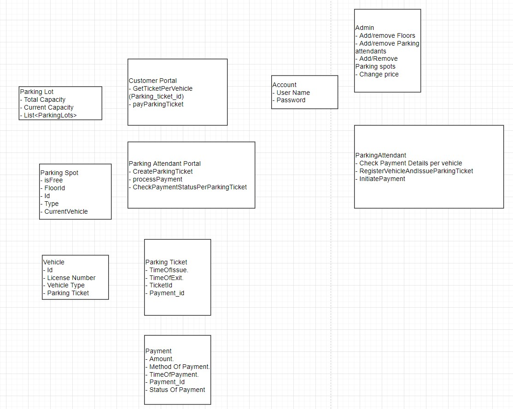
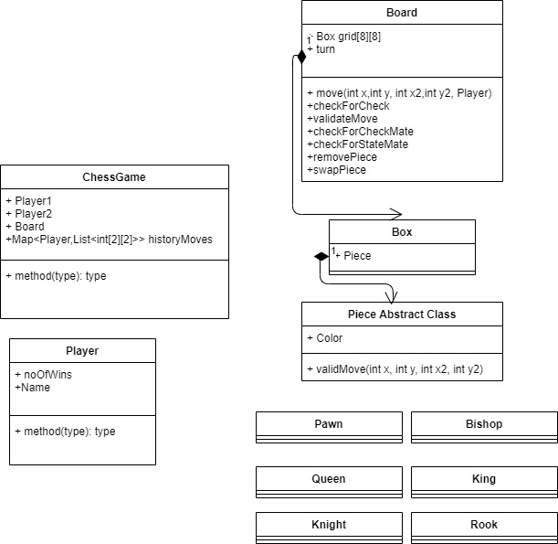
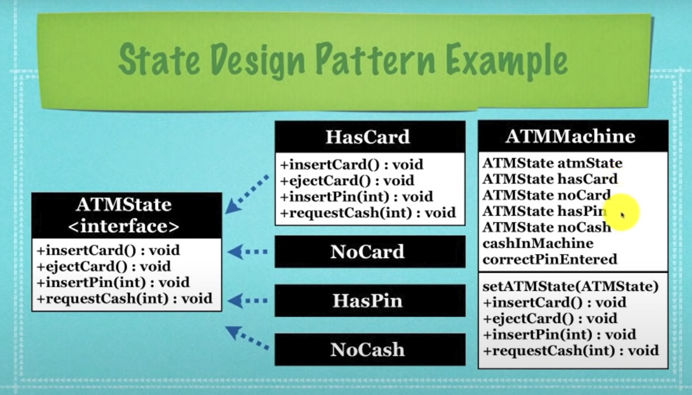

# Basic Tips
- Remember to add unique_identifiers to entities.
- Clarifying requirements is very importants.
- Singleton for the entire system
- Add monitoring like logs for almost all systems.
- Identify useless classes, like vehicles in parking lot and person in elevator system design.(We are trying to control system not simulate it).
- There is probably going to be a strategy pattern in all the problems just mention it.
- Enumeration violates open-closed principle, so use enumeration only when you know no other types would be used in future.
- Add analytics module for every design.
- Add admin to make changes which normal user can't do
# Parking Lot

## System Requirements
- general design, should be used for code reusability.
### Architecture
- Multiple floors
- Multiple entry and exits.
- Collect the ticket at entry
- If max capacity is reached, system should not allow more cars.
### Payment
- Pay at exit
- Pay using cash and credit card/paytm
- payment should be based on per hour parking fees.(customers have to pay $4 for the first hour, $3.5 for the second and third hours, and $2.5 for all the remaining hours.)
### Parking spots
- Many parking slots per floor
- Types of parking spots compact, large, handicapped, motorcycles
- System should show free parking spot for each type.

## Actors/Classes
//- Admin (adding/removing floors, parking spots, parking attendents)
//- Parking attendent (assigning a ticket with parking spot, take cash payment)
//- Customer (Get a parking ticket and pay for it)
//- System (Display the info on the panel, assign and remove a vehicle from the spot)

- ParkingLot(Singleton)
- Terminal (Abstract, Id)
  - Entry Terminal (getTicket, Printers)
  - Exit Terminal (acceptTicket(Ticket), Printers, Payment Processor)
- Payment Spot(Abstract Class, Id, isReserved)
  - Motorcycle Parking Spot
  - Large Parking SPot
  - Compact Parking SPot
- ParkingAssignmentStrategy (getParkingSpot(Terminal), releaseParkingSpot(ParkingSpot), Interface)
  - ParkingSpotNearestAssignmentStrategy (Minheaps equal to number of entrances, for each entry terminal there will be a min heap, 2 sets one for available and other for reserved parking spot)
- Ticket
- PaymentStrategyService
  - CreditCardPaymentProcessor
  - CashPaymentProcessor
- TarrifCalculator (Abstract Class)
  - WeekdayTarrifCalculator
  - WeekendTarrifCalculator
- Monitor System (Observer Design Pattern)
- Database

- Configuration Object as an input, which will instantiate the objects in parking lot and persist in database.
## Use Cases
- Take Ticket
- Pay Ticket
- Assign/ Unassign the car to parking spot (nearest).

//- Add/remove floors
//- Add/remove parking spots
//- Add/remove the parking attendant

## Design patterns and algorithms to use
- Singleton for parking lot.
- Strategy pattern to find the nearest free parking spot. 
  - Min heap approach/shortest path algorithm.
  - Also would require concurrency in case of multiple entrances/exit scenario.
- AOP for monitoring/logging (subscribing to events).


## Diagram



# Elevator System
- Multiple floors, and elevators
## Actors
- Dispatcher Service
  - To optimize waiting time or throughtput or power etc. (Use strategy pattern here)
  - FCFS.
- Floor
- Lift
- Button
  - Elevator Buttons (goUp/goDown will do very different things)
  - Hall Buttons
- Door
- Monitoring System
## Use Cases
- Calling the elevator
- Move/ Stop the elevator.
- Indicate the elevator positiion.
- Emergency breaks.
- Emergency calls.

## Dispatcher/Scheduler
- Similar to OS.
- There is request queue.
### Algorithms
- Make sure there is no starvation
- Start going in the direction of the first button pressed, keep track of which direction we're going.
- When a floor is reached and that button was pressed, stop and open the doors, mark the buttons for this floor as not pressed anymore.
  - If there are still more floors that we need to visit that are in the same direction, keep going in that direction.
  - If not and there are still floors we need to visit, move in that direction.
  - If not then we're done and will start at 1 when a button is pressed again.
#### FCFS
- State of Elevator Car can be
  - Idle
  - Moving in direction towards the passenger and same as the direction passenger wants to go. (Might also be in opposite direction as passenger initially then become idle before coming into contact with passenger)
  - Moving in the direction towards the passenger and opposite to the direction passenger wants to go.
  - Going away from passenger.
- Disadvantage of this approach
  - All the other user will be blocked till the first user is served.
  - Useless elevator motion up and down

#### Look Ahead algorithm.
- Use a tree to see if there are any request to the top or down.

#### StackOverflow
"Efficiency" is not the most important feature, the most important is to make sure every order is followed, that there is no starvation. If someone presses 100 and people keep pressing 1 and 2 it may be efficient to keep going between those floors, but it'd be nice for 100 to be visited at some point.

I think (from personal observation when I was interested in figuring out) that most of them do:

Start going in the direction of the first button pressed, keep track of which direction we're going
When a floor is reached and that button was pressed, stop and open the doors, mark the buttons for this floor as not pressed anymore.
If there are still more floors that we need to visit that are in the same direction, keep going in that direction.
If not and there are still floors we need to visit, move in that direction.
If not then we're done and will start at 1 when a button is pressed again.
Note that many elevators have buttons "I want to go up" and "I want to go down" next to the doors instead of a single button. The algorithm only needs a small change: in 2, if the only button pressed for that floor is one of the buttons next to the door, only stop and open the doors if we are going in that direction. Possibly keep the button pressed if the doors open because of a button pressed inside the elevator and it is going in the wrong direction.

You never have to figure out an entire path, just in which direction to go next.

# Online Shopping System


# Chess

## Actors
- Driver Class
- Board
- Player
- Pieces

## Constraints
- Piece makes legal move according to its own move rules.
- If the player was previous under check and the move does not remove the check, it must be undone.
- In addition to purely move-based rules, there's also capture logic, so a bishop cannot move from a1-h8 if there's a piece sitting on c3.
- If the move exposes check, it must be undone / disallowed.
- If player captures a piece, remove the piece (including en passant!)
- If the piece is a pawn reaching the back rank, promote it.
- If the move results in a stalemate or checkmate, the game is over.
- If the move is a castling, set the new position of the rook accordingly. But a king and rook can only castle if they haven't moved, so you need to keep track of that. And if the king moves through a check to castle, that's disallowed, too.

## Process
- Piece will not have an enum, it will be a interface.
- Board is a 2D Matrix of Pieces. Which will initialize the Pieces on start.
- Game.move(currentSpot, NewSpot, Player)
  - Player's validity will be checked according to the turn and the currentSpot.
  - Piece will be fetched from the currentSpot, and valid will be called on it.
    - Valid will first check if the currentPlayer is in checked State.
    - If Yes, then the move should remove the check.
    - Else it will see the start and end location and decide the move.
  - If it is valid, and there is a piece, then remove the piece.
  - Move the piece to the board location.
  - If Piece is pawn, promote him.
  - Check if game is over (CheckMate/ StaleMate).



# ATM
- Use state design pattern
- Have a bankClient to validate the Card, the Pin.
- Possible States are noCard, hasCard, hasCorrectPin, atmOutOfMoney
- Actions possible in each state is insertCard, ejectCard, insertPin, requestMoney.
- Each state has a reference to the ATMMachine so that on occurance of an action, the state of the machine can be changed.
- Also the ATM Machine has all the possible states objects, and also the current State (atmState).
- http://www.newthinktank.com/2012/10/state-design-pattern-tutorial/
```java
public interface ATMState {
	// Different states expected
	// HasCard, NoCard, HasPin, NoCash
	void insertCard();
	void ejectCard();
	void insertPin(int pinEntered);
	void requestCash(int cashToWithdraw);
}

public class ATMMachine {
	ATMState hasCard;     
	ATMState noCard;
	ATMState hasCorrectPin;
	ATMState atmOutOfMoney;

	ATMState atmState;
	
	int cashInMachine = 2000;
	boolean correctPinEntered = false;
	
	public ATMMachine(){
		hasCard = new HasCard(this);
		noCard = new NoCard(this);
		hasCorrectPin = new HasPin(this);
		atmOutOfMoney = new NoCash(this);
		atmState = noCard;
		if(cashInMachine < 0){
			atmState = atmOutOfMoney;
		}
	}
	
	void setATMState(ATMState newATMState){
		atmState = newATMState;
	}
	
	public void setCashInMachine(int newCashInMachine){
		cashInMachine = newCashInMachine;
	}
	
	public void insertCard() {
		atmState.insertCard();
	}

	public void ejectCard() {
		atmState.ejectCard();
	}

	public void requestCash(int cashToWithdraw) {
		atmState.requestCash(cashToWithdraw);
	}

	public void insertPin(int pinEntered){
		atmState.insertPin(pinEntered);
	}
	
	public ATMState getYesCardState() { return hasCard; }
	public ATMState getNoCardState() { return noCard; }
	public ATMState getHasPin() { return hasCorrectPin; }
	public ATMState getNoCashState() { return atmOutOfMoney; }
}

public class HasCard implements ATMState {
	ATMMachine atmMachine;
	public HasCard(ATMMachine newATMMachine){
		atmMachine = newATMMachine;
	}
	public void insertCard() {
		System.out.println("You can only insert one card at a time");
	}

	public void ejectCard() {
		System.out.println("Your card is ejected");
		atmMachine.setATMState(atmMachine.getNoCardState());
	}

	public void requestCash(int cashToWithdraw) {
		System.out.println("You have not entered your PIN");
	}

	public void insertPin(int pinEntered) {
		if(pinEntered == 1234){
			System.out.println("You entered the correct PIN");
			atmMachine.correctPinEntered = true;
			atmMachine.setATMState(atmMachine.getHasPin());
		} else {
			System.out.println("You entered the wrong PIN");
			atmMachine.correctPinEntered = false;
			System.out.println("Your card is ejected");
			atmMachine.setATMState(atmMachine.getNoCardState());
		}	
	}	
}

public class NoCard implements ATMState {
	ATMMachine atmMachine;
	public NoCard(ATMMachine newATMMachine){
		atmMachine = newATMMachine;
	}
	public void insertCard() {
		System.out.println("Please enter your pin");
		atmMachine.setATMState(atmMachine.getYesCardState());
	}

	public void ejectCard() {
		System.out.println("You didn't enter a card");
	}

	public void requestCash(int cashToWithdraw) {
		System.out.println("You have not entered your card");
	}

	public void insertPin(int pinEntered) {
		System.out.println("You have not entered your card");
	}
}

.. And so on for other states too.
``` 



# Role Based Access Control

## Actors 
- Resources (Things that users can manipulate. Like contracts, users, contract drafts, etc. )
- Role (Adminstrator, etc...)
- Operations (Things that users can do with the resources. Like create, read, update or delete.)
  - Can Add
  - Can view
  - Can edit
  - Can delete
- I don't think users directly manipulate resources; roles do
- user -> user role -> role -> operation -> resource
- Users (People who will use the system. Here I have usernames and passwords.)
- a permissions table/entity with these columns/attributes: Role ID, Operation ID, ResourceID.
- Many To Many relationship between User and Role.

# Code Diff Viewer
- Longest Common Subsequence.

# Payment Application
- Use strategy pattern to support various payment options.

- Payment (transaction_id, type, amount, createdOn,status)
## Payment Status
- Pending
- Unpaid
- Completed
- Failed
- Refunded
- Cancelled

# Book My Show

## Actors
- Admin (Can add movies and their shows,cancel any movies)
- Guest (Can view shows)
- Customer (Can view shows, book and cancel the tickets)
- System (send notification to customer for new movies etc).

## Use case
- ### Search Movies
  - It should be able to list the cities where affiliate cinemas are located.
  - Each cinema can have multiple halls and each hall can run one movie show at a time.
  - Each Movie will have multiple shows.
  - Customers should be able to search movies by their title, language, genre, release date, and city name.
  - Once the customer selects a movie, the service should display the cinemas running that movie and its available shows.
- ### Create/Modify/View Bookings
  - The customer should be able to select a show at a particular cinema and book their tickets.
- ### Assign Seat
  - The service should show the customer the seating arrangement of the cinema hall. The customer should be able to select multiple seats according to their preference. The customer should be able to distinguish between available seats and booked ones.
  - The system should ensure that no two customers can reserve the same seat.
- ### Make Payment/Refund payment
  - Customers of our system should be able to pay with credit cards or cash. Should be able to provide discount coupons.

## Main Classes
- Account, can be admin/guest/customer (id, password, status)
- City (address, name, zipcode, state)
- Cinema (multiple cinemahall, name, location)
- CinemaHall (seats, shows, name, shows)
- CinemaHallSeat (row, column, type)
- Movie (title,language, genre, release date, country, description, durationInMins, shows)
- Show (Each movie can have many shows, showId, startTime, endTime, hall, Movie)
- ShowSeat (seatNumber, isReserved, price)
- Booking (Booking against a show, unique_booking_id, status, showseats, createdOn, show,makePayment, cancel)
- Payment (id, type, amount, createdOn,status)

## Enums

### Payment Status
- Look at the payment application example

### Booking Status
- Pending
- Confirmed
- Checked_In
- Cancelled

## Concurrency
- To make sure no 2 users are able to book the same seat, we can use serializable isolation level. ‘Serializable’ is the highest isolation level and guarantees safety from Dirty, Nonrepeatable, and Phantoms reads.

```sql
SET TRANSACTION ISOLATION LEVEL SERIALIZABLE;
BEGIN TRANSACTION;
    -- Suppose we intend to reserve three seats (IDs: 54, 55, 56) for ShowID=99 
    Select * From ShowSeat where ShowID=99 && ShowSeatID in (54, 55, 56) && isReserved=0 
    -- if the number of rows returned by the above statement is NOT three, we can return failure to the user.
    update ShowSeat table...
    update Booking table ...
COMMIT TRANSACTION;
```


# Design Amazon

## Actors
- Account (username,passwordHash,name, email, phone, address)
- Guest (No account, registerAccountMethod)
- Member
- Admin
- Product (Category, current_price, id)
  - Books
  - Clothes
  - Electronics
- Order_Items(order_id, Price-can-be-different, quantity, product_id)
- Orders (id, Status,order_date)
- Shipment(order_id,shipment_date,status)
- ShoppingCart
- Review(product_id, rating, description)
- PaymentService
  - CreditCardPayment
  - CashPayment

## Enums
- OrderStatus : UNSHIPPED, PAYMENT_PENDING, SHIPPED, CANCELLED, COMPLETED, REFUNDED
- ShipmentStatus : Pending, shipped, cancelled, delivered
- 