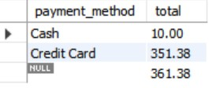
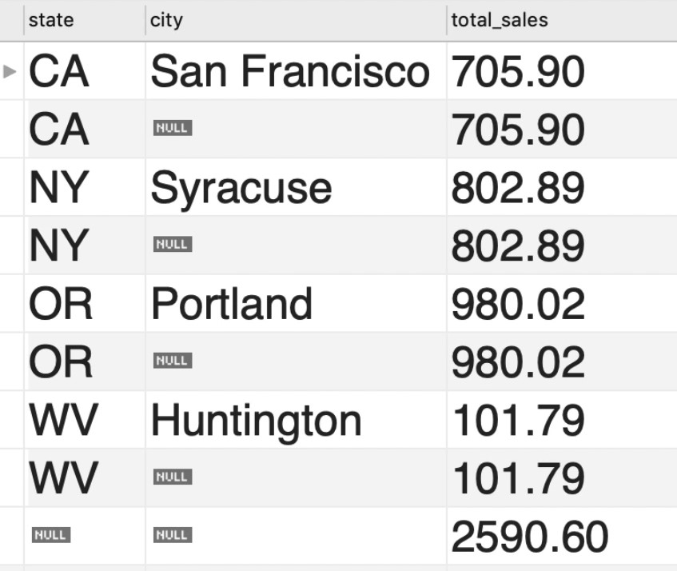

# Datatypes

## Numeric

### BOOL/BOOLEAN :
- Zero is considered as false, nonzero values are considered as true.
### SMALLINT :
- A small integer. Signed range is from -32768 to 32767. Unsigned range is from 0 to 65535
### MEDIUMINT
- A medium integer. Signed range is from -8388608 to 8388607. Unsigned range is from 0 to 16777215.

### INT(size)/INTEGER(size)
- A medium integer. Signed range is from -2147483648 to 2147483647. Unsigned range is from 0 to 4294967295. 
- The size parameter specifies the maximum display width (which is 255)

### BIGINT
- A large integer. Signed range is from -9223372036854775808 to 9223372036854775807. Unsigned range is from 0 to 18446744073709551615.  

- The size parameter specifies the maximum display width (which is 255)

### DOUBLE (size,d)
- A normal-size floating point number. The total number of digits is specified in size. The number of digits after the decimal point is specified in the d parameter

### DECIMAL(size, d)
- Similar to DOUBLE, but it is an exact fixed-point number. 

## String

### CHAR(Size)
- A FIXED length string.
- Waste of space.

### VARCHAR(Size)
- A VARIABLE length string (can contain letters, numbers, and special characters). The size parameter specifies the maximum column length in characters - can be from 0 to 65535
- can be part of an index

### Text(Size)
- cannot be part of an index
- fixed max size of 65535 characters (you cannot limit the max size)

### BLOB(size)
- For BLOBs (Binary Large OBjects). Holds up to 65,535 bytes of data

## Date

### DATE
- A date. Format: YYYY-MM-DD. The supported range is from '1000-01-01' to '9999-12-31'

## Column Attributes

### Primary Key
- Values of a key uniquely defines the row.

### Auto Increment Key
- Often used with primary keys.
- Every time we insert a new item, we get a new id based on the last id.
- While inserting a new row, if you use DEFAULT keyword, mysql will generate the id by incrementing.
```sql
INSERT INTO customers
VALUES (DEFAULT,  -- Auto increment field.
		'Manish', 
        'Smith', 
        NULL,
        NULL, -- Can also use DEFAULT HERE
        'Greenwood',
        'Gurgaon',
        "HA",
        DEFAULT);
```

### Non NULL Key
- Cannot be null

# SELECT Statement
- Order of the sql statements matter, say, SELECT then FROM then WHERE then ORDER BY then LIMIT else you may exceptions.

- SELECT Operator can do mathematical operation on the query
  ```sql
  SELECT last_name, first_name, points, points*100 +10 
  FROM customers;
  ```

  - Order of operators in the above is defined by BODMAS Rule.
  - O is for expnentation in the above rule.
  - Or use brackets

- You can change the name of a column by using ```AS``` Keyword alias
  ```sql
    SELECT last_name, first_name, points,
    points*100 +10 AS discount_factor 
    FROM customers
    ```
  - Space can be added in the alias by using quotes ```'discount factor'```

## SELECT DISTINCT
- Can be used to have only unique results in the output. 

# WHERE
Filters the data using the comparator operator
- Both != and <> are the not equal to operator
- = is a equality operator (not ==)
- All the strings should be enclosed in single/double quotes.
- Where is case insensitive.
- Dates are also comparable and enclosed in quotes 'yyyy-mm-dd' ('1990-31-1')
- You can also have mathematical operations inside the where clause.

# AND OR NOT 
- Combine Conditions in WHERE Clause.
- Order of operators is important to keep in mind (AND is evaluated first then OR)
- Just use paranthesis to make order clear.
- Not operator can be used to negate a condition
  ```sql
  SELECT *
  FROM customer
  WHERE NOT (birth_data > '1990-01-01' AND points<=1000)
  ```

# IN Operator 
- Alterative to OR.
- is true if the attribute is IN a list of values.
  ```sql
  SELECT * FROM customers WHERE state IN ('VA', 'FL', 'GA')
  ```
- You can also use NOT operator with IN operator.

# BETWEEN Operator
- Alternative to () AND ().
```sql
SELECT *
FROM invoices 
WHERE invoice_date 
BETWEEN '2019-01-01' AND '2019-07-01'
```

# Like Operator
- Rows, which match a specific pattern
- % can be used to denote any number of character.
  - '%b' : the field start with anything followed by b.
- _(underscore) matches a single character.
  - '_y' : the field's first character can be anything but the second character needs to be y.
- Case insensitive.
- Use regex instead.
- Does an entire table scan

# Regexp (Regular Expression)

```sql
SELECT * FROM customers WHERE last_name REGEXP '[a-h]e';
```


# IS NULL
- Select all customers where field is NULL.
```sql
SELECT * FROM customers WHERE phone IS NULL;
```
- You cannot do ```phone = NULL```

# ORDER BY
- Used to sort the data.
- Default sort column is primary key column.
- You can use order by to sort according to a field
 
  ```sql
  SELECT first_name FROM customers ORDER BY first_name
  ```
- Default sorting order is ascending, but it can be changed by using the DESC keyword
  
  ```sql
  SELECT first_name FROM customers ORDER BY first_name DESC
  ```

## Sort by multiple columns
Just add the additional fields to sort by at the end of first field.
  ```sql
  SELECT first_name FROM customers ORDER BY state, first_name DESC
  ```
- Will be ordered first by state then by first_name.
- We can also order according to an alias. 

# LIMIT
- Limit clause should always come at the end.
## Offset
- Used for pagination.
- Skip first 6 records and show the next 3

  ```sql
  SELECT * FROM customers LIMIT 6,3
  ``` 

# JOIN Types

Used to join 2 tables on a common field

# INNER JOIN/JOIN
- This query will return all of the records in the left table (table A) that have a matching record in the right table (table B).


- INNER Keyword is optional.
  ```sql
  SELECT order_id, o.product_id, name, quantity, p.unit_price 
  FROM order_items o
  INNER JOIN products p ON p.product_id = o.product_id;
  ```
- In the above example o is used as an alias for orders and p for products, in MySQL you need to make sure if alias is defined, you use it everywhere.
- ## Inner join is a symmetrical and bi-directional relationship, which means A JOIN B produces the same result as B JOIN A. Look at the figure on top.


## Implicit Join Syntax
- Not recommended since, forgetting the where clause can result in a cross join.

  ```sql
  SELECT order_id, o.product_id, name, quantity, p.unit_price
  FROM order_items o, products p
  WHERE p.product_id = o.product_id;
  ```

## Joining across multiple database.
- You need to prefix the table with the name of the database (the database which is not currently in use)
- Say current database has a table order_items and we need to join it to a table products in a different database sql_inventory, in other words **you only need to prefix the table which is not in the current database.**

  ```sql
  SELECT order_id, o.product_id, name, quantity, p.unit_price 
  FROM order_items o
  INNER JOIN sql_inventory.products p 
  ON p.product_id = o.product_id;
  ```

## SELF JOIN
- Can be used to join a row in a table with another row in the same table.
- Say for example, in a table of employees there can be a manager_id which points to another row of the same table.
- A self join uses the inner join or left join clause. Because the query that uses self join references the same table, the table alias is used to assign different names to the same table within the query. Note that referencing the same table more than one in a query without using table aliases will result in an error.
- ### You need to use aliases in self join.
  ```sql
  SELECT e.employee_id, e.first_name,
  m.first_name AS manager 
  FROM employees e
  INNER JOIN employees m
  ON e.reports_to = m.employee_id; 
  ```

## Compound INNER JOIN
- JOIN Multiple tables
- Just append the next join
  ```sql
  SELECT order_id, o.customer_id, 
  order_date, c.first_name, c.last_name, os.name
  FROM orders o
  INNER JOIN customers c
  ON o.customer_id = c.customer_id
  INNER JOIN order_statuses os
  ON o.status = os.order_status_id;
  ```

# OUTER JOIN
## For most use cases you only use LEFT JOIN.

## LEFT JOIN/LEFT OUTER JOIN
- This query will return all of the records in the left table (table A) regardless if any of those records have a match in the right table (table B). It will also return any **matching** records from the right table. It won't return non matching records from table B.

```sql
SELECT <select_list>
FROM Table_A A
LEFT JOIN Table_B B
ON A.Key = B.Key
```

### LEFT Excluding JOIN
This query will return all of the records in the left table (table A) that do not match any records in the right table (table B).


```sql
SELECT <select_list> 
FROM Table_A A
LEFT JOIN Table_B B
ON A.Key = B.Key
WHERE B.Key IS NULL;
```

## RIGHT JOIN/RIGHT OUTER JOIN
- This query will return all of the records in the right table (table B) regardless if any of those records have a match in the left table (table A). It will also return any matching records from the left table. 
- Avoid Right Joins since you can achieve the same using the left join and swapping the order.

```sql
SELECT <select_list>
FROM Table_A A
RIGHT JOIN Table_B B
ON A.Key = B.Key;
```

### RIGHT Excluding JOIN
This query will return all of the records in the right table (table B) that do not match any records in the left table (table A).


```sql
SELECT <select_list>
FROM Table_A A
RIGHT JOIN Table_B B
ON A.Key = B.Key
WHERE A.Key IS NULL;
```

## FULL OUTER JOIN
- This Join can also be referred to as a FULL OUTER JOIN or a FULL JOIN. This query will return all of the records from both tables, joining records from the left table (table A) that match records from the right table (table B). 

```sql
SELECT <select_list>
FROM Table_A A
FULL OUTER JOIN Table_B B
ON A.Key = B.Key;
```
- The above query doesn't work in mysql you need to use UNION to achieve it.
```sql
SELECT * FROM t1
LEFT JOIN t2 ON t1.id = t2.id
UNION ALL
SELECT * FROM t1
RIGHT JOIN t2 ON t1.id = t2.id
WHERE t1.id IS NULL
```
- See above we UNION a LEFT JOIN with a right excluding join. Also we use UNION ALL instead of UNION since the UNION might remove some duplicates which already exist in the first or second table.
- REFERENCE : https://stackoverflow.com/questions/4796872/how-to-do-a-full-outer-join-in-mysql


### OUTER Excluding JOIN
This query will return all of the records in the left table (table A) and all of the records in the right table (table B) that do not match.

- The below query doesn't work in mysql you need to use UNION to achieve it.
```sql
SELECT <select_list>
FROM Table_A A
FULL OUTER JOIN Table_B B
ON A.Key = B.Key
WHERE A.Key IS NULL OR B.Key IS NULL
```


## Compound OUTER JOINS
- You can concatenate JOINS on multiple Table just like in inner joins.
- Use LEFT JOIN or INNER JOIN only, to keep things simple.
```sql
SELECT o.order_date,
 o.order_id,
 c.first_name,
 sh.name AS shipper,
 os.name AS status
FROM orders o
JOIN customers c
ON o.customer_id = c.customer_id
LEFT JOIN shippers sh
ON sh.shipper_id = o.shipper_id
LEFT JOIN order_statuses os
ON os.order_status_id = o.status
ORDER BY order_id;
```

## SELF OUTER JOIN
- Similar to self INNER JOIN, but also return if the right set is null.
```sql
SELECT e.employee_id, e.first_name, m.first_name AS manager
FROM employees e
LEFT JOIN employees m
ON e.reports_to = m.employee_id;
```
Will return all the entries even for the manager himself, whose reports_to is NULL.

## USING Clause
- If the mapping field has the same exact name in both the SETS involved in JOINS, we can alternatively use USING keyword instead of the ON Keyword to simplify the query.

```sql
SELECT order_id, o.product_id, name, quantity, p.unit_price 
FROM order_items o
INNER JOIN products p 
-- ON p.product_id = o.product_id;
USING (product_id);
```

## JOINING ON multiple columns
- sometimes used in case of composite primary key.
- Say in order_items table primary key is a combination of order_id and product_id
- 

- Say there is another table order_item_notes, which has note_id as the primary key and has notes mapped to order_id and product_id.
  
-  To join such a table we can combine the logical condition using AND. Or also use the USING clause as seen in the comment.

  ```sql
  SELECT * 
  FROM order_items oi
  LEFT JOIN order_item_notes oin
  ON oi.order_id = oin.order_id AND oi.product_id = oin.product_id;
  -- USING (order_id, product_id)
  ```
- Think what would happen if you only map it to order_id (not product_id)
  - Say ignoring product_id, you have 3 entries for order_id = 1 in order_items table, and 2 notes for order_id = 1 in order_items_notes then you will end up with 6 entries (most of them being invalid since we didn't consider the product_id), if we considered the product_id we would only get 2(one for each note since combination of order_id and product_id is unique in order_items table).

## Natural JOIN
- Not recommended way.
- DB Engine will guess how to join, may produce unexpected results
```sql
SELECT order_id, first_name
FROM orders
NATURAL JOIN customers;
```

## CROSS JOIN
- Every record in the first table will be combined with every record in the second table.
- Example : Combine Table of sizes(Small, medium, large) and another table with colors (red, blue, gree) etc.
  ```sql
  SELECT order_id, first_name
  FROM orders
  CROSS JOIN customers;
  ```
- Produces x*y entries where x is the number of entries in 1st table, and y is the number of entries in 2nd Table.

### IMPLICIT syntax
- Not recommended
```sql
SELECT * 
FROM customers, orders;
```

## UNION
- The UNION operator is used to combine the result-set of two or more SELECT statements.
  - Each SELECT statement within UNION must have the same number of columns
  - The columns must also have similar data types
  - The columns in each SELECT statement must also be in the same order
- Name of the column depends on the first query.
- Can be used to implement FULL OUTER JOIN in mysql

```sql
SELECT 'Customer' AS Type, ContactName, City, Country
FROM Customers
UNION
SELECT 'Supplier', ContactName, City, Country
FROM Suppliers;
```

### UNION ALL
- The UNION operator selects only distinct values by default. To allow duplicate values, use UNION ALL.


## MISC 
- One confusion about JOIN is what happens when there are 2 rows corresponding to one column in LEFT Set, in that case the final result will have 2 rows(where the information related to SET A will be the same)

The above is a result of joining the order_items with the order_item notes from the query

  ```sql
  SELECT * 
  FROM order_items oi
  LEFT JOIN order_item_notes oin
  ON oi.order_id = oin.order_id AND oi.product_id = oin.product_id;
  -- USING (order_id, product_id)
  ```

  The one row in order_items had 2 notes related to it, thus resulted in 2 rows.

# INSERT INTO
```sql
INSERT INTO customers
VALUES (DEFAULT,  -- Auto increment field.
		'Manish', 
        'Smith', 
        NULL,
        NULL, -- Can also use DEFAULT HERE
        'Greenwood',
        'Gurgaon',
        "HA",
        DEFAULT);
```
Can also explicitly define the columns we are inserting.
```sql
INSERT INTO customers 
(first_name, 
last_name, 
address, 
city, 
state)
VALUES 
('Manish', 
'Smith', 
'Greenwood',
'Gurgaon',
"HA");
```

## Insert Multiple Rows
```sql
INSERT INTO shippers (name)
VALUES 
('Shipper1'),
('Shipper2'),
('Shipper3');
```

## Insert Heirarchical rows (spanning multiple rows)
- Say 1 row in orders table will have multiple rows in order_items table (one for each type of product ordered)

```sql
INSERT INTO orders (customer_id, order_date, status)
VALUES 
('11',
'2019-01-02', 
1);

INSERT INTO order_items
VALUES (LAST_INSERT_ID(),4,1,2.95),
	   (LAST_INSERT_ID(),2,2,24.95);
```
- Not sure how good approach is this since concurrency might affect this.

## INSERT using Subqueries
```sql
INSERT INTO orders_archived
SELECT * FROM orders
WHERE order_data <'2018-01-01';
```

## Copy A Table using AS Clause
```sql
CREATE TABLE orders_archived AS
SELECT * FROM orders;
```
- This technique doesn't set the column attributes like primary key and auto increment etc.

### Create new table from a query
- We can combine the above technique and use subqueries to create custom table using queries like
```sql
SELECT invoice_id,
 number,name,
 payment_total,
 invoice_date, 
 due_date,
 payment_date  
FROM invoices i 
JOIN clients c 
ON i.client_id = c.client_id 
WHERE payment_date IS NOT NULL;
```

# UPDATE
- You can use UPDATE, SET keywords to update a single row, 
- You can also have expressions in SET statement as shown below.
```sql
UPDATE invoices
SET 
  payment_total = invoice_total*.5,
  payment_date = '2019-01-03'
WHERE invoice_id = 1;
```
## Update multiple rows using IN
- You can use where clause with IN operator 

```sql
UPDATE customers
SET points = points + 50
WHERE customer_id IN (1,4,5);
```

## Update using subqueries
```sql
UPDATE orders
SET comments = "Gold Customer"
WHERE customer_id IN
(
SELECT 
customer_id
FROM customers
WHERE state IN ('CA','NY')
);
```
- In MySQL, you can't modify the same table which you use in the SELECT part.


# DELETE FROM

```sql
DELETE FROM order_item_notes
WHERE order_Id IN (
	SELECT order_id FROM orders
    WHERE customer_id = 7
);
```

- IMPORTANT : you cannot delete a row, if that row is referenced by some other table's foreign key. I.e cannot delete customer if there is an order_id related to that customer.

# Aggregate Functions
- We can also write expression inside aggregate functions.
## COUNT
- Return count of non-null values
```sql
SELECT COUNT(payment_date) FROM invoices
```
The above query might not return all the rows in invoices, since some rows might not have payment date in them.COUNT(*) returns count of all the rows.

- If you want count of distinct rows then use 
```sql
SELECT COUNT(DISTINCT client_id) FROM invoices;
```

## MAX

## MIN

## AVG

## SUM
```sql
SELECT MAX(invoice_total) AS highest,
SUM(invoice_total) AS total
FROM invoices
WHERE invoice_date >'2019-01-01';
```

# GROUP BY
- Always after FROM and WHERE clause and before Orderby Clause.
```sql
SELECT client_id, SUM(invoice_total) FROM invoices 
GROUP BY client_id;
```
## GROUP BY multiple columns
- One record for each combination
```sql
SELECT date, name AS payment_method, SUM(amount)  FROM payments p
JOIN payment_methods pm
ON p.payment_method= pm.payment_method_id
GROUP BY date, name;
```

# HAVING
- Filter the data after we Group our rows.
- WHERE clause filters the data before the rows are grouped.
- HAVING Clause needs to filter the data based on columns which are part of SELECT Clause, in contrast WHERE can filter according to any column.
```sql
SELECT c.customer_id, first_name, order_id,state, SUM(unit_price*quantity) AS total_price FROM orders o
JOIN customers c USING (customer_id)
JOIN order_items oi USING (order_id)
WHERE state = 'VA'
GROUP BY customer_id
HAVING total_price>100 ;
```

# WITH ROLLUP
- Shows another row for the total of the GROUP BY
```sql
SELECT pm.name AS payment_method, SUM(amount) as total FROM payments p
JOIN payment_methods pm
ON p.payment_method = pm.payment_method_id
GROUP BY pm.name WITH ROLLUP;
```

generates one more column for total of both Cash and Credit Card.



- If you use roll up, you cannot use column alias, but need actual name of column.

## WITH ROLLUP for GROUP BY multiple columns
- it will generate an additional row for each group.
- It generates row for all cities inside CA, NY, OR, WV individually and combined.


# Subqueries
- Inside the parenthesis
- Example of Subquery returnining a single value.
  ```sql
  SELECT * 
  FROM  products
  WHERE unit_price > (
    SELECT unit_price 
    FROM products
    WHERE name LIKE 'LETTUCE%'
  );
  ```

## Subquery using IN Operator
- Example of subquery returning a sequence of values
```sql
SELECT * 
FROM clients
WHERE client_id 
NOT IN (
  SELECT DISTINCT client_id
   FROM invoices
);
```

## Subquery using ALL Operator
- Example of subquery returining a sequence of values (just like IN Operator, but instead of equal to we are checking for greater or less)
```sql
SELECT *
FROM invoices
WHERE invoice_total > ALL (
  SELECT invoice_total FROM invoices
  WHERE client_id = 3;
)
```
- The above query can also be implemented using ```MAX``` or ```MIN``` clause. They are interchangable.

## Subquery vs JOINs
- JOINS can also be used in place of subqueries, like in above case
```sql
SELECT * FROM clients c
LEFT JOIN invoices i
USING (client_id)
WHERE i.client_id IS NULL;
```

- If performance is similar, you should choose the approach which is more readable.

# Transaction

- An SQL Transaction is ACID Compliant
- If server crashes before all the data is commited, all the changes get's rollbacked, thus ensuring atomicity and consistency.
- For Mysql it is START TRANSACTION not BEGIN TRANSACTION.

```sql
USE sql_store;

START TRANSACTION;

	INSERT INTO orders (customer_id, order_date, status) 
	VALUES (1, '2019-01-01',1);

	INSERT INTO order_items 
	VALUES (LAST_INSERT_ID(), 1, 1, 1);

COMMIT;
```
- You can also manually rollback on response to some logic
```sql
USE sql_store;

START TRANSACTION;

INSERT INTO orders (customer_id, order_date, status)
VALUES (2, '2020-12-1',1);

INSERT INTO order_items 
VALUES (LAST_INSERT_ID(), 1, 1, 1);

ROLLBACK;
```
- Every single statement (INSERT, UPDATE, DELETE) that mysql runs, is run inside a transaction itself.
(autocommit = ON)

# CONCURRENCY AND ISOLATION
- By default, mySQL holds lock on row which is being modified by some other transaction.
- See hussain's notes for isolation level.

# SHOW VARIABLES
- Used to show the settings of the database.

```sql
SHOW VARIABLES LIKE 'autocommit';
```
# Views
- They are like virtual tables.
- Help to abstract away non used columns and also makes changes to database easier process, queries changes will only involve changing the view's sql.


# Stored Procedures
- Useful to have query logic to move outside of application code.
- No need to recompile all the application code, in case of changes to sql query.
# Functions

## Default Functions

### Numeric
- ROUND()
- TRUNCATE(n, numofdigits_to_truncate)
- CIELING()
- FLOOR()
- ABS()
- **RAND()**

### String
- LENGTH()
- UPPER()
- LOWER()
- TRIM()
- SUBSTRING(string, start, length)
- LOCATE(substring, string)
- REPLACE(string, string_to_replace, string_replace_with)
- CONCAT(first,last)

### IFNULL
- Will return Not assigned, if shipper_id is null.
```sql
IFNULL(shipper_id, 'Not Assigned')
```

### COALESE
- Will return first non null value

```sql
COALESE(shipper_id, comment, 'Not Assigned');
```

### IF (IMPORTANT)
- TEST a condition and return a value based on the condition is true or not.
- ```IF(condition, true_value, false_value)```
```sql
SELECT 
	order_id,
    order_date,
    IF(YEAR(order_date) = YEAR(NOW()), 'Active', 'Archive') as state
FROM orders;
```

### CASE 
- Similar to IF

## Custom Functions

# Triggers
- SQL that runs when another SQL UPDATE/DELETE/INSERT occurs in some table.
- Can be useful for Journalling/Auditing purposes.
- And also keep data consistent across table.

# Events
- A task/ block of sql code, that get's executed on specified intervals.
- Kind of CRON Jobs
- Need to turn on event_scheduler.

# Database Design
- Primary keys shouldn't be updated. 
- Don't try to model the universe, think mostly about the use case.
- Reverse Engineer Option is useful to convert a database to a ER Diagram to better understand the design, change those designs and create the script to make the changes.

## Conceptual Model
- First step is to identify the entities, say we are implementing a online course site like udemy. Our Entities can be student and course with a many to many relationship between them.
## Logical Model
- Sometimes it is also necessary to have the relationship itself as an entity, i.e enrollment entity with fields like date of enrollment, price paid(since that can change in future) etc. These tables are sometimes called link tables.

## Physical Model
- It is useful to use the already existing ERR diagram in databases like mysql to design the database schema and constraints.

## Foreign Key
- The relationship is always parent child relationship. the one with foreign key is the child.
- Foreign Key can also be the primary key or combination of foreign key can be primary key.

## Composite Key
- Benifits of having composite key approach is that you ensure your data can be consistent.
- But everywhere where the table is related to some other table, more than a single column needs to be the foreign key.

## Foreign Key Constraints
- What to do if the parent table i.e the students table's id is updated or student is deleted, do we restrict this action or do we casade and delete the child too. This is what can be controlled in the foreign key constraints.

## Normalization
- Prevents data duplication, so that data is consistent
- Normalization improves write speed, but decreases read speed due to joins.
- ### Take these normal forms with a grain of salt, In real worlds just try to minimize duplication of data as per your usecase.
### First Normal Form
- Each cell should have single value and we should not have repeated columns.
- Relational DBs doesn't have many to many relationship, we need to have an intermediate table and have one to many relationship between the original tables and this intermediate table. These intermediate tables are called link tables.

### Second Normal Form
- First Normal Form
- All non-prime attributes (attributes not part of candidate key) should be fully dependent on the candidate key, not part of the candidate key. In simple words, every table should represent one entity and all column in that table should represent that entity only.

### Third Normal Form
- Non prime attributes shouldn't derive non prime attributes.


# To see
- COLLATE
- FULL JOIN