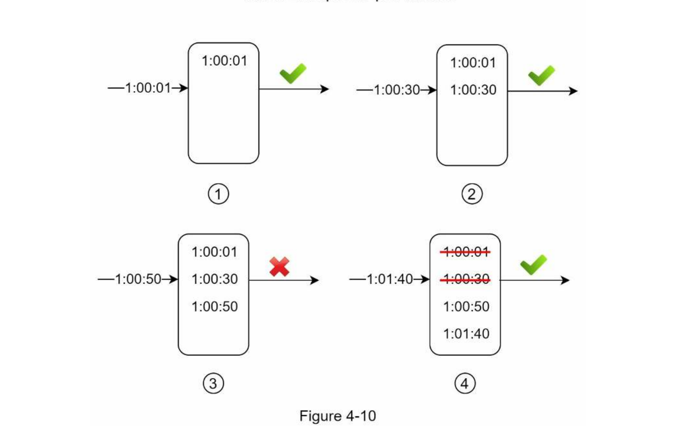
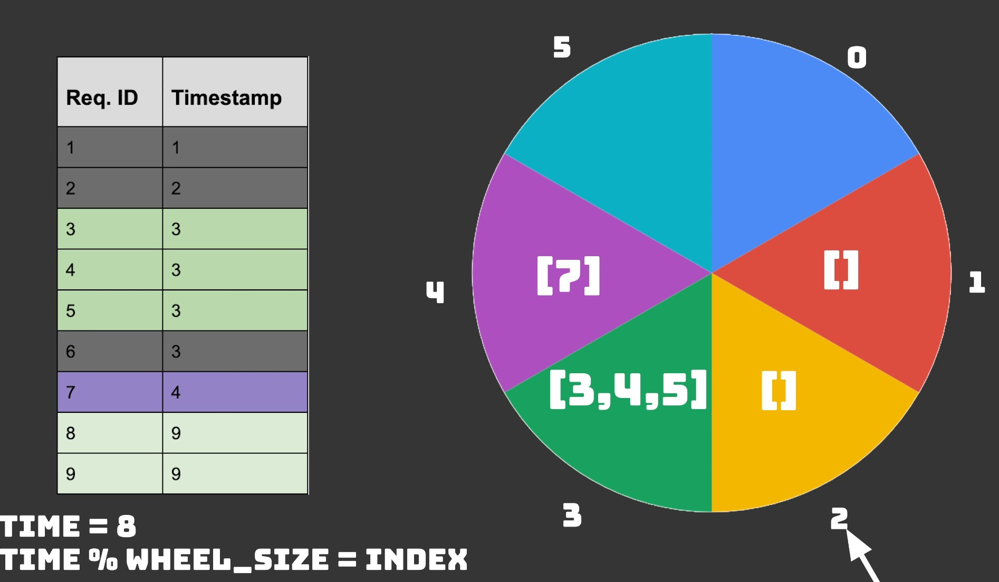
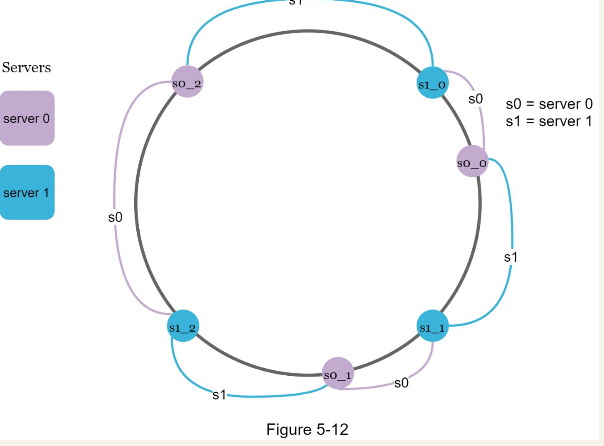
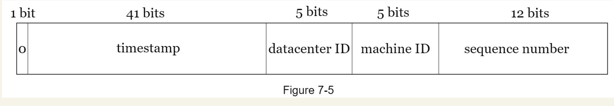
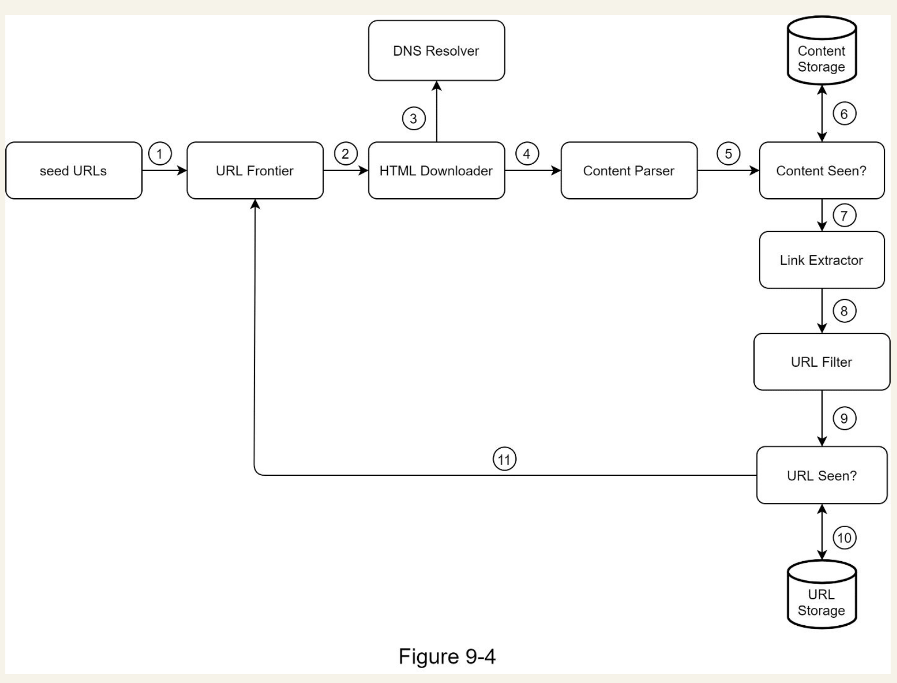
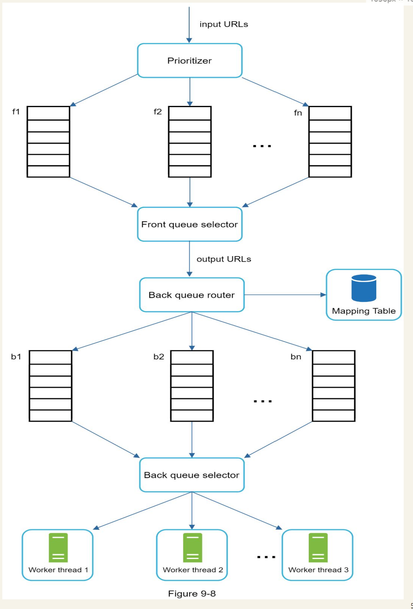
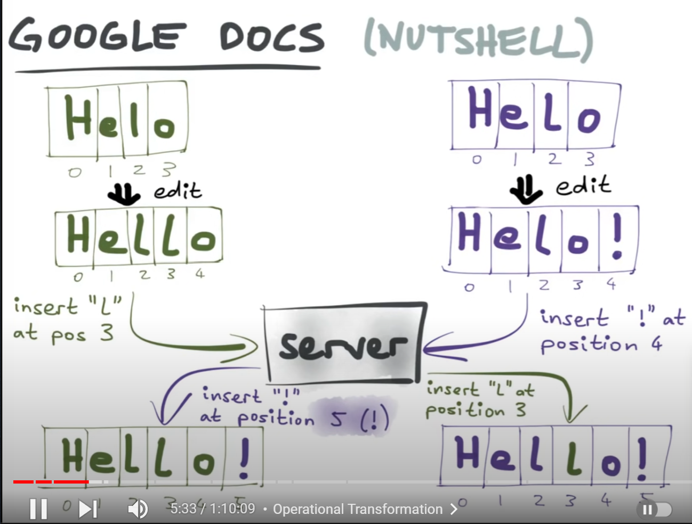
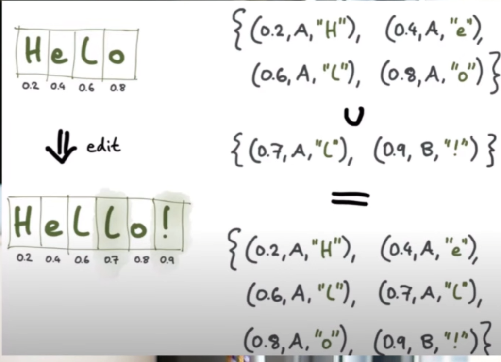
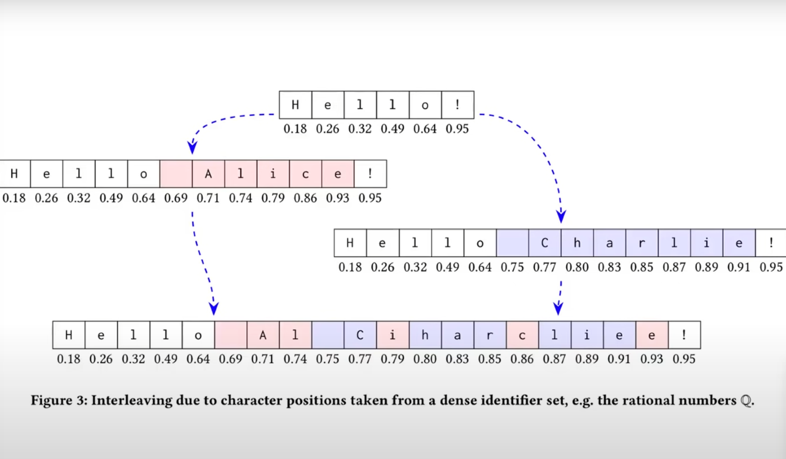

# Rate Limiter

## Clarifications
- Does the rate limiter throttle API requests based on IP, the user ID, or other properties?
- Do we need to throttle internal requests too?
- Do we also need to implement timeout?
- Is the rate limiter a separate service or should it be implemented in application code?
- Is the rate limiter per global or microservice level?

## Requirements
- Accurately limit excessive requests.
- ### Low latency. The rate limiter should not slow down HTTP response time.
- Use as little memory as possible.
- ### Distributed rate limiting. The rate limiter can be shared across multiple servers or processes.
- ### Exception handling. Show clear exceptions to users when their requests are throttled.
- High fault tolerance. If there are any problems with the rate limiter (for example, a cache server goes offline), it does not affect the entire system.
- Configurable Rate limiting algorithm.

## High Level Design

### Algorithm used for external rate-limiting
#### Token Bucket Algorithm
Look at the insider guide
- For every user/IP there needs to be one bucket, and the total buckets can shoot up, and adding the token to them is going to consume time. CRON job has to be run. some process needs to keep refilling the buckets. With several million users, and each refill operation requiring a write, this would be an unsustainable load on our Redis instance. 
- Also if we set a maximum of 10 message per minute, we didn’t want a user to be able to receive 10 messages at 0:59 and 10 more messages at 1:01. Token bucket doesn't solve this.
- A hefty request can be made to require more than one token too.

#### Modified Token Bucket to solve cron job problem
- Have 2 entries per user in Cache, one is the token bucket and the other is a timestamp it was last filled. If current time stamp - last filled is less than interval, the token bucket wasn't filled and you can simply decrement the token bucket, else token bucket was refilled to the max, so update the timestamp now. [link](https://engineering.classdojo.com/blog/2015/02/06/rolling-rate-limiter/)

#### Leaky Bucket Algorithm (Used by java itself)
Look at the insider guide
- This notion of buffer capacity (but not necessarily the use of leaky buckets) also applies to components adjacent to your service, such as load balancers and disk I/O buffers

#### Fixed window
Fixed-window limits—such as 3,000 requests per hour or 10 requests per day—are easy to state, but they are subject to spikes at the edges of the window, as available quota resets. Consider, for example, a limit of 3,000 requests per hour, which still allows for a spike of all 3,000 requests to be made in the first minute of the hour, which might overwhelm the service.

#### Sliding window
- Sliding windows have the benefits of a fixed window, but the rolling window of time smooths out bursts. Systems such as Redis facilitate this technique with expiring keys. So each user has a sorted set, and on each request, remove all the outdated timestamps. Outdated timestamps are defined as those older than the start of the current time window.

- • It smooths out spikes in traffic because the rate is based on the average rate of the previous window

#### Timer Wheel (Also has timeout capability)
- Might be useful for global rate limiting more.
- The wheel has buckets and each bucket can only store limited request.
- When a request arrives we compute, taskArrivalTime mod bucketSize.
- The timer wheel is of size = timeout in seconds.
- When you enter a section of wheel, you kick all the requests in that section (they timed out).
- Also each section of wheel corresponds to a seconds and has a queue = rate-limiting say=3 per second. Then size of linkedlist = 3.
- You get both ratelimiting and timeout capability in this approach.

### Persistent or In Memory storage.
Using the database is not a good idea due to slowness of disk
access. In-memory cache is chosen because it is fast and supports time-based expiration strategy
#### Redis
- INCR :  It increases the stored counter by 1 atomically.
- EXPIRE : It sets a timeout for the counter. If the timeout expires, the counter is automatically deleted.

- #### So for each user there can be a counter with expiration of 1 second, if the counter reaches a value within the expiration the subsequent requests are dropped. This is the fixed window algorithm.

### How to handle internal rate-limiting
- Rate-limiting in service as well. Based on average-response-rate, length of dead letter queue, CPU Usage, Memory Usage.
- Implement patterns like Circuit breaker and Bulk head patterns to prevent cascading failures.

#### Deal with bad actors
- Request queue(Array Blocking Queue) for each server can be partitioned to serve request ID per Hash, each internal server will have unique ID, and the parition for the bad actor will be only blocked, rest of the paritions will be safe.

### How to configure the rate limiting algorithm.
-  Rules are generally written in configuration files and saved on disk.

### What to do with the dropped requests
- Dead letter queue. Notify the subscriber if length is too high, used to monitoring and analysis.
- We can also enqueue these requests to be processed later. If some orders are rate limited due to system overload, we may keep those orders to be processed later.

#### Client side ratelimiting
- Will help with unintentional D-DOS
- Have the client retry with exponential backoff.
- Also have errors divided as retriable and non-retriable errors, so non retriable errors don't bomb the server. 
- The rate limiter can return the following HTTP headers to clients:
    - X-Ratelimit-Remaining
    - X-Ratelimit-Limit
    - X-Ratelimit-Retry-After
- Use client cache to avoid making frequent API calls

#### Exception Handling
-  The HTTP 429 response status code indicates a user has sent too many requests.
- Client's should not retry only on retriable errors.

### Scaling rate-limiting.
- Multiple requests to redis, need thread safety (against race conditions and synchronization issues). So use a single master redis server (maybe do sharding what happens on failure of shard), and also sorted set in redis helps with race condition without locking.

## Questions
- In the sliding window log algorithm, Cons it is mentioned The algorithm consumes a lot of memory because even if a request is rejected, its timestamp might still be stored in memory. Why store the timestamp if it is rejected.
- How does token bucket allow burst traffic, but leaky queue prevent it.

## Misc
- Cascading Failures
- Circuit Breaker
- Request Collapsing
- Bulk Head pattern
- Intelligent Routing.
- Layer 4 rate-limiting using IP Tables.

# Design Consistent Hashing
- Ring 0 to Limit of the hashfunction(0 to 2^160 - 1 for SHA-1).
- Servers and requests mapped to this ring, using the above hashfunction.
- Virtual nodes can be used to make sure the servers have uniform load and in the event of server adding or removing only k/n keys needs to be moved, where k is the total keys and n is the total real nodes.

- In the above images s0_0, s0_1, s0_2 are the virtual nodes for 0th server, s1_0, s1_1, s1_2 are for 1st server.
- Once a request/key is mapped to the ring, move clockwise and the first virtual node encountered is the server which should serve the request or the cache with the value corresponding to the key.
- Consistent hashing can be used for load balancing of application servers, sharding of cache and db servers.
- Consistent hashing is widely used in real-world systems, including some notable ones:
    - Partitioning component of Amazon’s Dynamo database
    - Data partitioning across the cluster in Apache Cassandra
    - Discord chat application
    - Akamai content delivery network
    - Maglev network load balancer

# Design Key Value store

## Clarifications
- If the key-value store should be in-memory or persistent?
- Is it distributed and we need to think of concurrency?
- What about availability? On failure what should happen? What happens on network failure during syncing?
- Requests per second.
- Read to write ratio
- What happens in the event of failure and the server comes back up.
- What is the size of value to be stored.

## Requirements
- Horizontal Autoscaling (HAS)
- Tunable Consistency
- Low latency
- size of key-value is 10KB
- Ability to store huge data.

## High level design

### To store huge data
- Data compression
- Store most used in memory and rest in disk
- A distributed key-value store is required to support big data.

### Scalability
- Sharding
- Consistent Hashing
- Horizontal Auto Scaling
- Heterogeneity: Total virtual nodes of a server are proportional to server capacity.

### Consistency
- Quorum, Tunable consistency parameters, Consistency models (Strong vs Eventually consistent), CAP Theorem
- Versioning, Vector clocks, client conflict resolution

### Availability
- Replication
- Cross data-center replication too.

#### Failure Handling
- Detection: Gossip protocol vs Phi Accrual Failure Detection
- Temporary Failure Handling : Sloppy Quorum, Hinted Handoff
- Permanent Failure Handling : Read Repair/Merkle Trees for optimized synching. (When is this used vs when is sloppy quorum used?) Anti-entropy protocol?

### In memory db consideration

#### Durability
- Segmented Write ahead log (Commit log)
- High water mark

#### Low Latency
##### Write Latency
- In memory (memTable)
- SSTable (Sequential Writes)
- Compaction

##### Read latency
- In memory read
- Bloom filters (Why not using hashtable for indexing?)

## Questions
- When is Sloppy Quorum with hinted handoff used vs when is merkle trees used?

# Unique ID Generator

## Clarifications
- Do ID only contain numerical values or alphanumneric?
- What should be the length of the unique ID generated.
- Scalable system.
- Do Ids need to be sortable?
- How many Ids per second?
- Does the Ids need to be strictly sorted i.e a user who came 2 mins earlier should have Id lesser than current user.

## Requirements
- Scalable
    - Concurrency safe
    - High throughput
- Highly Available
- Low latency
- No conflicting ID.
- Ids should increment by time, not necessarily by 1.
- 10000 Ids per second.
- 64 bit length

## High Level Design

### UUID Approach
#### Pros
- No syncronization needed, very low probability of duplicate
- Scalable solution, ideal production solution for ids of tables.
#### Cons 
- 128 bit length
- IDs don't go up with time.
- IDs can be non numeric.

### Ticket Server
- Single ticket server to give the uuids to webservers.
#### Cons
- Single point of failure.

### Twitter snowflake approach
-  Instead of generating an ID directly, we divide an ID into different sections.

- Signbit : not in use apparently by twitter
- Timestamp : Epoch time in milliseconds. (Max is 2^41 ~ valid for 69 years more)
- datacenterId : Id of the datacenter. (32 datacenter limit)
- machineId : 32 machines from cluster.
- Sequence numbers : For every Id generated the Id in the machine increases by 1. This field is 0 unless more than one ID is generated in a millisecond on the same server. In theory, a machine can support a maximum of 4096 new IDs per millisecond.
-  fewer sequence numbers but more timestamp bits are effective for low concurrency and long-term applications.
### NTP for clock synchronisation
- The Network Time Protocol (NTP) is a networking protocol for clock synchronization between computer systems over packet-switched, variable-latency data networks.
- NTP servers have access to highly precise atomic clocks and GPU clocks.
- NTP is a protocol that works over the application layer, it uses a hierarchical system of time resources and provides synchronization within the stratum servers

# Web Crawler
## Uses
- Search Engine Indexing
- Archiving
- Data mining
- Web Monitoring

## Clarifications/ Requirement Gathering
- What is the motivation, is it indexing, mining or something else?
    - Search Engine Indexing
- How many web pages need to be scraped?
    - 1 Billion per month.
- Content type?
    - HTML
- Storage time?
    - 5 years
    - In order to return the result of search the search engine need to store the content of the html.
- Duplicate content
    - Should be ignored
- What is the scope of the crawling, single websites, or a list of websites, or the entire internet needs to be scraped?
- Is it just a one time scrap, or continuously building up the index?
    - New added or edited need to be continuosly updated?
- Does the system need to be distributed?
 - Yes it should be scalable.

## Non functional Requirements
 - Scalable (Web is too large so needs to be scalable with parallelization)
 - Robust (Avoid traps, unresponsive servers, crashes, malicious links etc).
 - Polite (Shouldn't make too many requests at once).

## Back of the envelope 
- Assume 1 billion web pages are downloaded every month.
- QPS: 1,000,000,000 / 30 days / 24 hours / 3600 seconds = ~400 pages per second.
- Assume the average web page size is 500k.
- Assuming data are stored for five years, 500 TB * 12 months * 5 years = 30 PB. A 30 PB storage is needed to store five-year content.

## High level design

### URL Seeds
- A good seed URL serves as a good starting point that a crawler can utilize to traverse as many links as possible.
- The first proposed approach is based on locality as different countries may have different popular websites. Another way is to choose seed URLs based on topics; for example, we can divide URL space into shopping, sports, healthcare, etc. 

### URL Frontier
#### DFS vs BFS
- Some websites can be too deep, so use BFS.

#### Problems with simple bfs
- Most links are linked back to the same host. So a simple fifo based bfs will bombared the site if webpages are crawled parallely. This is considered impolite.
- No way to enforce priority in simple fifo queue.

#### Multilevel multiqueue solution.

- 2 Level queue, first for priority and second for politeness can be implemented.
- Front queues: manage prioritization
- Back queues: manage politeness
##### Politeness
- To enforce politeness we can ensure all the links for a particular host go to the same worker node and we can add a delay between each task to this worker.
- We would need a map which has information about which downloader thread is crawling which host urls.
- One queue per host, Same as kafka.

##### Priority
- Different sites has different priority based on pagerank, web traffic, update frequency etc.
- A prioritizer can take url as input and compute priority and based on priority can assign to the required queue based on priority.
- Queues can be chosen at random with bias towards high priority queue, or simply number of high priority queues can be more than low priority, say in the above diagram the front queue selector has 200 threads, 150 can be dedicated to take up tasks from high priority and other 50 from low priority.

#### Freshness
- The crawler should recrawl important urls more often to retain freshness.

#### Robustness of the queue
- Can use kafka for managing the queues, producers and consumers.
- Get high durability thanks to commit-log and replication.

### HTML Downloader
#### Robots.txt
- Robots Exclusion Protocol, is a standard used by websites to communicate with crawlers. It specifies what pages crawlers are allowed to download.
- To avoid repeated downloads, we can cache the robots.txt file for a host.
#### DNS Resolver
- To avoid bottleneck due to dns resolver, we need to cache the dns result.
#### Distributed Crawl
- We can have multiple crawl mutliple hosts parallely.
#### Robustness
- Have timeouts for unresponsive sites.
- The crawler must handle exceptions gracefully without crashing the system.
#### Server Side Rendering or dynamic rendering
- Render the site on the server before downloading, rather than download .html file, since a lot of sites are doing server side rendering. If we download and parse web pages directly, we will not be able to retrieve dynamically generated links.
### Content Parser
- Checks if the pages are malformed.
- Encode before parsing to prevent RCE attacks.
#### Duplicate Content
- Even if url is same sometimes content is exactly same, we can use checksums/hash values to reject already saved contents.
#### Content Storage
- Both disk and memory are used.
- Most of the content is stored on disk because the data set is too big to fit in memory.
- Popular content is kept in memory to reduce latency.
- Techniques like replication and sharding are used to improve the data layer availability, scalability, and reliability.
### Url Parser
- URL Extractor parses and extracts links from HTML pages.
- Excludes blacklisted sites.
- Might also choose to blacklist sites without proper Certificate Authority.
- Avoid Spider traps (Infinite loop urls.) (Might have a length parameter as a cutoff) www.spidertrapexample.com/foo/bar/foo/bar/foo/bar/…
- Checks for duplicate urls using hashtable.
- Adblock dns can be used to skip sites which have advertisements, spam etc.
#### Url Storage
- Stores visited urls with their hashvalue.

# Chat System

## Clarifications/ Requirement Gathering
- What are the DAU?
    - 50 Million
- Is it a simple one to one chat or group chat?
    - Both
- Mobile desktop or webapp?
    - Both
- Max Group number limit
    - 100 People in a group
- Do we need last seen/online indicator?
    - Yes
- Is only text supported or images, videos,files etc too?
    - Text
- Message size limit?
    - 1,00,000 character long
- Is it required to be end to end encrypted?
- If the user is not using the app, do we need to support notification as well?
- Are we required to store the chats in the server or just app(with google drive backups).
    - Store chat history forever.
- Do we need to support profile pic and status of the user?
- How many max friends can a user have?

## Non Functional requirements
- Low latency.

## For the design
- Refer to Whismical [Link](https://whimsical.com/UzfAwKNebfaZw9qVqsgBov)

# Youtube
## Design, Requirements etc.
- Refer to Whimsical [Link](https://whimsical.com/youtube-7GxH77hWSBR52fpZghUbv8)
## Streaming Protocol
- MPEG–DASH. MPEG stands for “Moving Picture Experts Group” and DASH stands for "Dynamic Adaptive Streaming over HTTP".

- Apple HLS. HLS stands for “HTTP Live Streaming”.

- Microsoft Smooth Streaming.

- Adobe HTTP Dynamic Streaming (HDS).

- 

- Web Real-Time Communication

- different streaming protocols support different video encodings and playback players. 

### Basics
- Standardized method of delivering different types of media over internet
- Sends “chunks” of content from one device to another and defines protocol for reassembling.
- Both client and server needs to support the streaming protocol.
- Codec means encoding and decoding i.e using compression. This process happens in real-time when it comes to live streaming. Eg : H.264, HEVC/H.265, MPEG-4
- Container format : MP4, avi, mov etc.
- Common transport formats or containers for streaming video include MP4 (fragments) and MPEG-TS.
- There is a difference between inject and delivery streaming protocol

### HTTP Live Streaming (HLS)
- developed by Apple to work with an HTML5 video player.
- HLS is an adaptive bitrate protocol and also uses HTTP servers.
- A bit higher latency, however there is a Low-Latency HLS.
- Compatible across just about any device and operating system. 
- HLS is currently the best protocol for most video streaming use-cases. 

### MPEG-DASH, Dynamic Adaptive Streaming over HTTP
- This is one of the newest streaming protocols, and it is beginning to see broader adoption.
- Dynamic Adaptive Streaming over HTTP (DASH) which is also known as MPEG-DASH, uses standard HTTP web servers. This reduces the cost and technical difficulty of implementation when compared to legacy methods of streaming like RTP.
- MPEG-DASH is also an adaptive bitrate (ABR) protocol. This means it will automatically detect changes in the internet connection speed of the viewer and serve the best available quality video at any given time. ABR streaming reduces buffering and enhances the viewers’ experience. 
- iOS and Safari don’t yet support it and might never support it. 
- Native support on Android devices

### Real-Time Messaging Protocol 
- RTMP was developed by Macromedia with the primary use case of working with Adobe Flash player.
- RTMP is now used for ingestion from the encoder to the online video platform.
- When paired with HLS delivery, RTMP ingest produces a low-latency stream.
- RTMP ingest is currently the most popular protocol for ingesting has to do with compatibility. HLS ingest, for example, is still not widely supported by streaming services.

### WebRTC
- new protocol used to web conferencing in microsoft teams and all.
- also adaptive bit rate.

### Microsoft Smooth Streaming (MSS)
- Old protocol.

# Google Drive

## Cursor
- This can help with the conflicts a lot. Websockets can be used.

## Audit log
- Might be useful to see what others are doing.

## Operational Transform
- Server keeps track of older operations that was performed, and it transform the request from the client based on those previous operations. Say first both client1 and client2 had DOG, client2 removed 'O' to get DG, client1 added S to the end to get DOGS, if the client2's request is processed first delete('1') (0 indexed), server remembers this operations so when client1's insert('S',3) arrives it transforms it to insert('S',2) so that it has a consistent view at the backend i.e DGS and propagates this to every client.
- All operations has to go through the server, peer to peer is not allowed.
- Server uses a queue.

## Conflict Free Replicated Data Types (CRDT)
- CRDT's are data structures designed to provide data types that will always converge, as long as they see the same set of operations (in any order).
- The CRDT data structures were based on the recognition that data structures expressible as semilattices are convergent. 
- OT didn't achieve convergence in all cases.
- CRDTs satisfy strong eventual consistency which leads to convergence.
- Automerge is an implementation of this concept.
- Datastructure which is commutative and idempotent. i.e it doesn't matter what order the changes arrive and doesn't matter how many times the same changes arrive.
- We can have positional indexes which don't affect other indexes, we can do that by using fractions. And also add a bit of randomness. Fractional Indicies.
- For CRDTs
    - All characters are globally unique. (Site Id, Site Counter)
    - All characters are globally ordered
- Instead of numbers, we can also use trees
- For deleting a character, we delete by siteId.

- https://www.youtube.com/watch?v=hy0ePbpna5Y
- Even if CRDTs lead to convergence they might not lead to expected results. 
### Consensus vs Collaboration
- Keep only one changes.
- Keep all changes and merge them.

## Storage
- Cassandra can be used, if we are storing CRDTs. Write heavy.
- Formatting, Rich text/Markdown.
