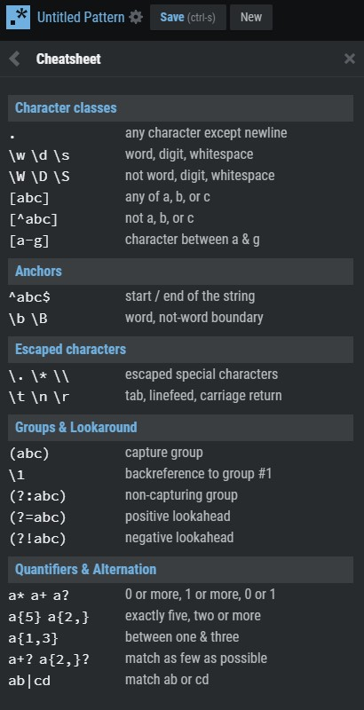
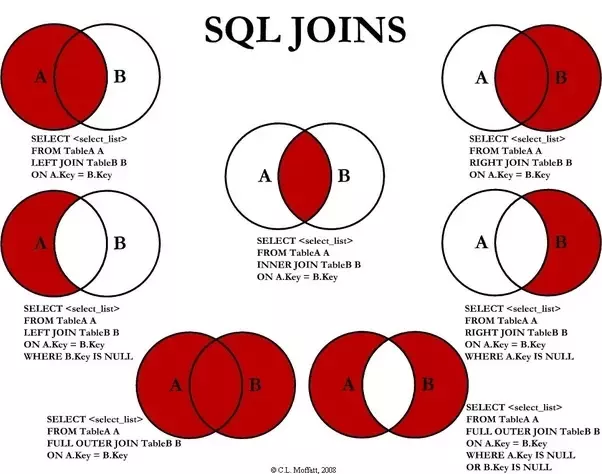
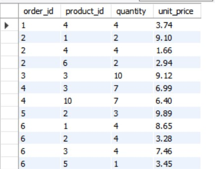
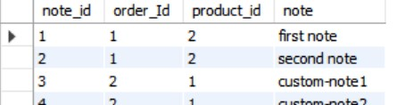
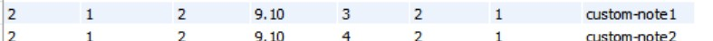

# SELECT Statement
- Order of the sql statements matter, say, SELECT then FROM then WHERE then ORDER BY then LIMIT else you may exceptions.

- SELECT Operator can do mathematical operation on the query
  ```sql
  SELECT last_name, first_name, points, points*100 +10 
  FROM customers;
  ```

  - Order of operators in the above is defined by BODMAS Rule.
  - O is for expnentation in the above rule.
  - Or use brackets

- You can change the name of a column by using ```AS``` Keyword alias
  ```sql
    SELECT last_name, first_name, points,
    points*100 +10 AS discount_factor 
    FROM customers
    ```
  - Space can be added in the alias by using quotes ```'discount factor'```

## SELECT DISTINCT
- Can be used to have only unique results in the output. 

# WHERE
Filters the data using the comparator operator
- Both != and <> are the not equal to operator
- = is a equality operator (not ==)
- All the strings should be enclosed in single/double quotes.
- Where is case insensitive.
- Dates are also comparable and enclosed in quotes 'yyyy-mm-dd' ('1990-31-1')
- You can also have mathematical operations inside the where clause.

# AND OR NOT 
- Combine Conditions in WHERE Clause.
- Order of operators is important to keep in mind (AND is evaluated first then OR)
- Just use paranthesis to make order clear.
- Not operator can be used to negate a condition
  ```sql
  SELECT *
  FROM customer
  WHERE NOT (birth_data > '1990-01-01' AND points<=1000)
  ```

# IN Operator 
- Alterative to OR.
- is true if the attribute is IN a list of values.
  ```sql
  SELECT * FROM customers WHERE state IN ('VA', 'FL', 'GA')
  ```
- You can also use NOT operator with IN operator.

# BETWEEN Operator
- Alternative to () AND ().


# Like Operator
- Rows, which match a specific pattern
- % can be used to denote any number of character.
  - '%b' : the field start with anything followed by b.
- _(underscore) matches a single character.
  - '_y' : the field's first character can be anything but the second character needs to be y.
- Case insensitive.
- Use regex instead.
- Does an entire table scan

# Regexp (Regular Expression)

```sql
SELECT * FROM customers WHERE last_name REGEXP '[a-h]e';
```



# IS NULL
- Select all customers where field is NULL.
```sql
SELECT * FROM customers WHERE phone IS NULL;
```

# ORDER BY
- Used to sort the data.
- Default sort column is primary key column.
- You can use order by to sort according to a field
 
  ```sql
  SELECT first_name FROM customers ORDER BY first_name
  ```
- Default sorting order is ascending, but it can be changed by using the DESC keyword
  
  ```sql
  SELECT first_name FROM customers ORDER BY first_name DESC
  ```

## Sort by multiple columns
Just add the additional fields to sort by at the end of first field.
  ```sql
  SELECT first_name FROM customers ORDER BY state, first_name DESC
  ```
- Will be ordered first by state then by first_name.
- We can also order according to an alias. 

# LIMIT
- Limit clause should always come at the end.
## Offset
- Used for pagination.
- Skip first 6 records and show the next 3

  ```sql
  SELECT * FROM customers LIMIT 6,3
  ``` 

# JOIN Types

Used to join 2 tables on a common field

# INNER JOIN/JOIN
- This query will return all of the records in the left table (table A) that have a matching record in the right table (table B).


- INNER Keyword is optional.
  ```sql
  SELECT order_id, o.product_id, name, quantity, p.unit_price 
  FROM order_items o
  INNER JOIN products p ON p.product_id = o.product_id;
  ```
- In the above example o is used as an alias for orders and p for products, in MySQL you need to make sure if alias is defined, you use it everywhere.
- ## Inner join is a symmetrical and bi-directional relationship, which means A JOIN B produces the same result as B JOIN A. Look at the figure on top.


## Implicit Join Syntax
- Not recommended since, forgetting the where clause can result in a cross join.

  ```sql
  SELECT order_id, o.product_id, name, quantity, p.unit_price
  FROM order_items o, products p
  WHERE p.product_id = o.product_id;
  ```

## Joining across multiple database.
- You need to prefix the table with the name of the database (the database which is not currently in use)
- Say current database has a table order_items and we need to join it to a table products in a different database sql_inventory, in other words **you only need to prefix the table which is not in the current database.**

  ```sql
  SELECT order_id, o.product_id, name, quantity, p.unit_price 
  FROM order_items o
  INNER JOIN sql_inventory.products p 
  ON p.product_id = o.product_id;
  ```

## SELF JOIN
- Can be used to join a row in a table with another row in the same table.
- Say for example, in a table of employees there can be a manager_id which points to another row of the same table.
- A self join uses the inner join or left join clause. Because the query that uses self join references the same table, the table alias is used to assign different names to the same table within the query. Note that referencing the same table more than one in a query without using table aliases will result in an error.
- ### You need to use aliases in self join.
  ```sql
  SELECT e.employee_id, e.first_name,
  m.first_name AS manager 
  FROM employees e
  INNER JOIN employees m
  ON e.reports_to = m.employee_id; 
  ```

## Compound INNER JOIN
- JOIN Multiple tables
- Just append the next join
  ```sql
  SELECT order_id, o.customer_id, 
  order_date, c.first_name, c.last_name, os.name
  FROM orders o
  INNER JOIN customers c
  ON o.customer_id = c.customer_id
  INNER JOIN order_statuses os
  ON o.status = os.order_status_id;
  ```

# OUTER JOIN
## For most use cases you only use LEFT JOIN.

## LEFT JOIN/LEFT OUTER JOIN
- This query will return all of the records in the left table (table A) regardless if any of those records have a match in the right table (table B). It will also return any **matching** records from the right table. It won't return non matching records from table B.

```sql
SELECT <select_list>
FROM Table_A A
LEFT JOIN Table_B B
ON A.Key = B.Key
```

### LEFT Excluding JOIN
This query will return all of the records in the left table (table A) that do not match any records in the right table (table B).


```sql
SELECT <select_list> 
FROM Table_A A
LEFT JOIN Table_B B
ON A.Key = B.Key
WHERE B.Key IS NULL;
```

## RIGHT JOIN/RIGHT OUTER JOIN
- This query will return all of the records in the right table (table B) regardless if any of those records have a match in the left table (table A). It will also return any matching records from the left table. 
- Avoid Right Joins since you can achieve the same using the left join and swapping the order.

```sql
SELECT <select_list>
FROM Table_A A
RIGHT JOIN Table_B B
ON A.Key = B.Key;
```

### RIGHT Excluding JOIN
This query will return all of the records in the right table (table B) that do not match any records in the left table (table A).


```sql
SELECT <select_list>
FROM Table_A A
RIGHT JOIN Table_B B
ON A.Key = B.Key
WHERE A.Key IS NULL;
```

## FULL OUTER JOIN
- This Join can also be referred to as a FULL OUTER JOIN or a FULL JOIN. This query will return all of the records from both tables, joining records from the left table (table A) that match records from the right table (table B). 

```sql
SELECT <select_list>
FROM Table_A A
FULL OUTER JOIN Table_B B
ON A.Key = B.Key;
```
- The above query doesn't work in mysql you need to use UNION to achieve it.
```sql
SELECT * FROM t1
LEFT JOIN t2 ON t1.id = t2.id
UNION ALL
SELECT * FROM t1
RIGHT JOIN t2 ON t1.id = t2.id
WHERE t1.id IS NULL
```
- See above we UNION a LEFT JOIN with a right excluding join. Also we use UNION ALL instead of UNION since the UNION might remove some duplicates which already exist in the first or second table.
- REFERENCE : https://stackoverflow.com/questions/4796872/how-to-do-a-full-outer-join-in-mysql


### OUTER Excluding JOIN
This query will return all of the records in the left table (table A) and all of the records in the right table (table B) that do not match.

- The below query doesn't work in mysql you need to use UNION to achieve it.
```sql
SELECT <select_list>
FROM Table_A A
FULL OUTER JOIN Table_B B
ON A.Key = B.Key
WHERE A.Key IS NULL OR B.Key IS NULL
```


## Compound OUTER JOINS
- You can concatenate JOINS on multiple Table just like in inner joins.
- Use LEFT JOIN or INNER JOIN only, to keep things simple.
```sql
SELECT o.order_date,
 o.order_id,
 c.first_name,
 sh.name AS shipper,
 os.name AS status
FROM orders o
JOIN customers c
ON o.customer_id = c.customer_id
LEFT JOIN shippers sh
ON sh.shipper_id = o.shipper_id
LEFT JOIN order_statuses os
ON os.order_status_id = o.status
ORDER BY order_id;
```

## SELF OUTER JOIN
- Similar to self INNER JOIN, but also return if the right set is null.
```sql
SELECT e.employee_id, e.first_name, m.first_name AS manager
FROM employees e
LEFT JOIN employees m
ON e.reports_to = m.employee_id;
```
Will return all the entries even for the manager himself, whose reports_to is NULL.

## USING Clause
- If the mapping field has the same exact name in both the SETS involved in JOINS, we can alternatively use USING keyword instead of the ON Keyword to simplify the query.

```sql
SELECT order_id, o.product_id, name, quantity, p.unit_price 
FROM order_items o
INNER JOIN products p 
-- ON p.product_id = o.product_id;
USING (product_id);
```

## JOINING ON multiple columns
- sometimes used in case of composite primary key.
- Say in order_items table primary key is a combination of order_id and product_id
- 

- Say there is another table order_item_notes, which has note_id as the primary key and has notes mapped to order_id and product_id.
  
-  To join such a table we can combine the logical condition using AND. Or also use the USING clause as seen in the comment.

  ```sql
  SELECT * 
  FROM order_items oi
  LEFT JOIN order_item_notes oin
  ON oi.order_id = oin.order_id AND oi.product_id = oin.product_id;
  -- USING (order_id, product_id)
  ```
- Think what would happen if you only map it to order_id (not product_id)
  - Say ignoring product_id, you have 3 entries for order_id = 1 in order_items table, and 2 notes for order_id = 1 in order_items_notes then you will end up with 6 entries (most of them being invalid since we didn't consider the product_id), if we considered the product_id we would only get 2(one for each note since combination of order_id and product_id is unique in order_items table).

## Natural JOIN
- Not recommended way.
- DB Engine will guess how to join, may produce unexpected results
```sql
SELECT order_id, first_name
FROM orders
NATURAL JOIN customers;
```

## CROSS JOIN
- Every record in the first table will be combined with every record in the second table.
- Example : Combine Table of sizes(Small, medium, large) and another table with colors (red, blue, gree) etc.
  ```sql
  SELECT order_id, first_name
  FROM orders
  CROSS JOIN customers;
  ```
- Produces x*y entries where x is the number of entries in 1st table, and y is the number of entries in 2nd Table.

### IMPLICIT syntax
- Not recommended
```sql
SELECT * 
FROM customers, orders;
```

## UNION
- The UNION operator is used to combine the result-set of two or more SELECT statements.
  - Each SELECT statement within UNION must have the same number of columns
  - The columns must also have similar data types
  - The columns in each SELECT statement must also be in the same order
- Name of the column depends on the first query.
- Can be used to implement FULL OUTER JOIN in mysql

```sql
SELECT 'Customer' AS Type, ContactName, City, Country
FROM Customers
UNION
SELECT 'Supplier', ContactName, City, Country
FROM Suppliers;
```

### UNION ALL
- The UNION operator selects only distinct values by default. To allow duplicate values, use UNION ALL.


## MISC 
- One confusion about JOIN is what happens when there are 2 rows corresponding to one column in LEFT Set, in that case the final result will have 2 rows(where the information related to SET A will be the same)

The above is a result of joining the order_items with the order_item notes from the query

  ```sql
  SELECT * 
  FROM order_items oi
  LEFT JOIN order_item_notes oin
  ON oi.order_id = oin.order_id AND oi.product_id = oin.product_id;
  -- USING (order_id, product_id)
  ```

  The one row in order_items had 2 notes related to it, thus resulted in 2 rows.

# Normalization improves write speed, but decreases read speed due to joins.
# To see
- COLLATE
- FULL JOIN