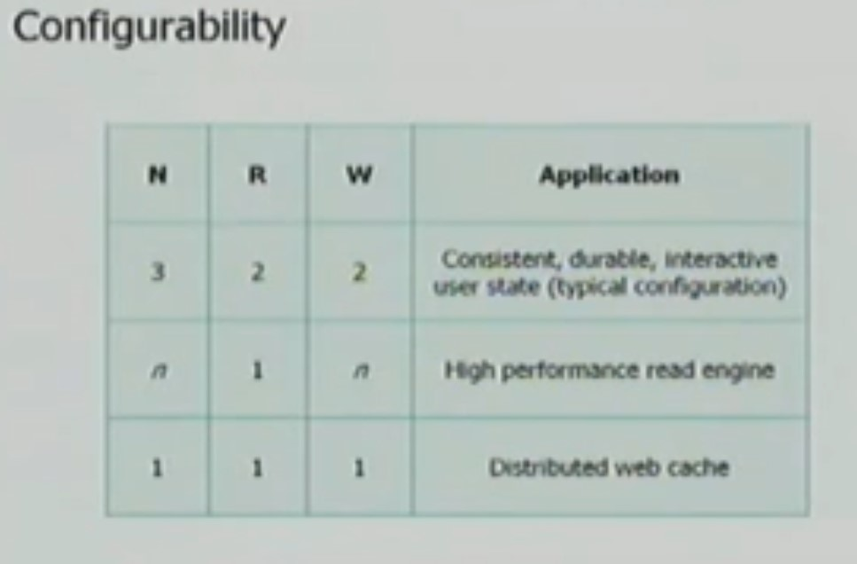
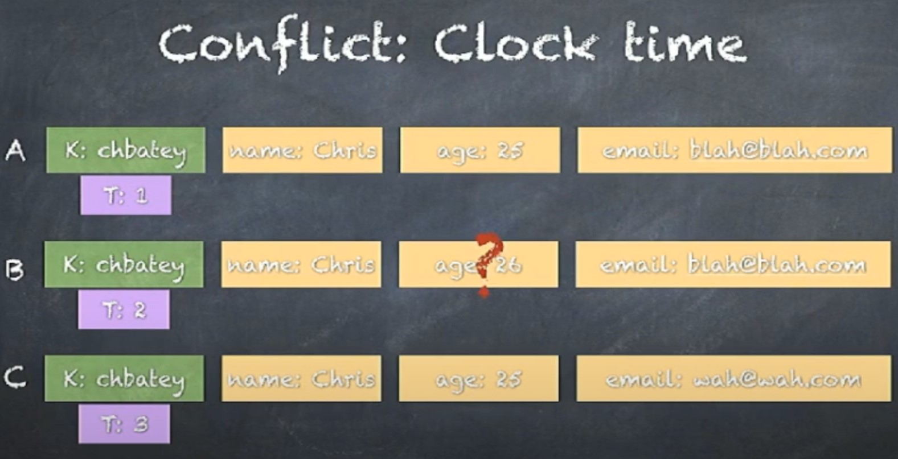
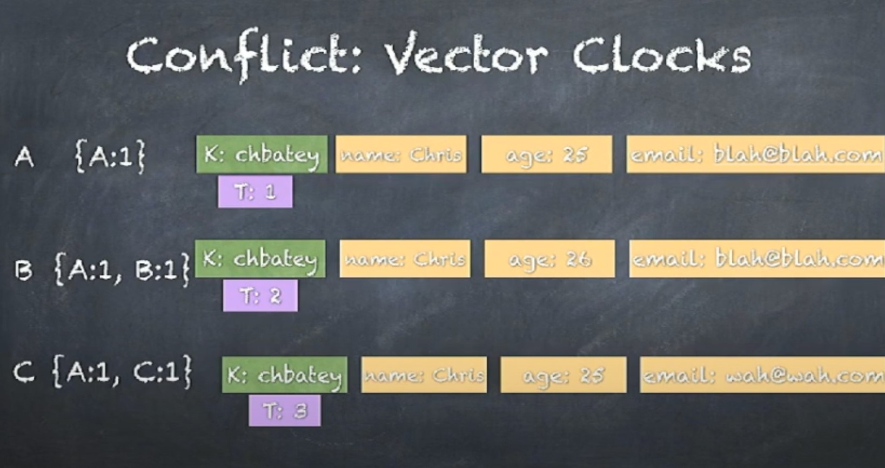
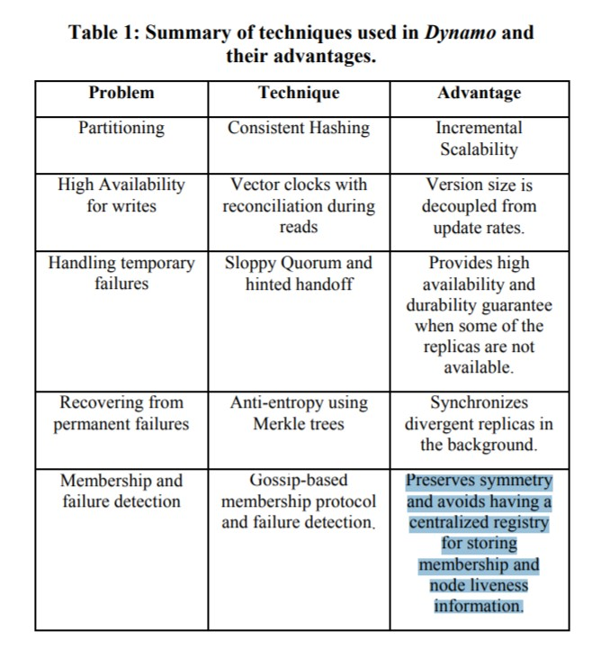

# Row vs Columnar DB

# Replication
Replication allows us to achieve scalability, performance and fault tolerance. Afraid of loss of availability or reduced performance? Replicate the data to avoid a bottleneck or single point of failure. Slow computation? Replicate the computation on multiple systems. Slow I/O? Replicate the data to a local cache to reduce latency or onto multiple machines to increase throughput.

Replication is also the source of many of the problems, since there are now independent copies of the data that has to be kept in sync on multiple machines - this means ensuring that the replication follows a consistency model.

# OSI model of computer networking

# Distributed System Model

## Programs in distributed systems.
- run concurrently on independent nodes.
- are connected by a network that may introduce nondeterminism and message loss ...
- have no shared memory or shared clock.
- knowledge is local: nodes have fast access only to their local state, and any information about global state is potentially out of date
- nodes can fail and recover from failure independently
- messages can be delayed or lost (independent of node failure; it is not easy to distinguish network failure and node failure)
- and clocks are not synchronized across nodes (local timestamps do not correspond to the global real time order, which cannot be easily observed)

## Nodes in distributed systems have,
- the ability to execute a program
- the ability to store data into volatile memory (which can be lost upon failure) and into stable state (which can be read after a failure)
- a clock (which may or may not be assumed to be accurate)

## Communication links in a dis sys

### Network Partition
A network partition occurs when the network fails while the nodes themselves remain operational. When this occurs, messages may be lost or delayed until the network partition is repaired. Partitioned nodes may be accessible by some clients, and so must be treated differently from crashed nodes.

## Time and order assumption
- information can only travel at the speed of light. If nodes are at different distances from each other, then any messages sent from one node to the others will arrive at a different time and potentially in a different order at the other nodes.

### Synchronous vs Asynchronous model assumption
The synchronous system model imposes many constraints on time and order. It essentially assumes that the nodes have the same experience: that messages that are sent are always received within a particular maximum transmission delay, and that processes execute in lock-step. This is convenient, because it allows you as the system designer to make assumptions about time and order, while the asynchronous system model doesn't. Asynchronicity is a non-assumption: it just assumes that you can't rely on timing

## Consensus Problem
- Several computers (or nodes) achieve consensus if they all agree on some value.
  - Agreement: Every correct process must agree on the same value.
  - Integrity: Every correct process decides at most one value, and if it decides some value, then it must have been proposed by some process.
  - Termination: All processes eventually reach a decision.
  - Validity: If all correct processes propose the same value V, then all correct processes decide V.
- Problem is the disagreements / divergence between nodes.
- #### solving the consensus problem makes it possible to solve several related, more advanced problems such as atomic broadcast and atomic commit.

# FLP
- In a fully asynchronous message-passing distributed system, in which at least one process may have a crash failure, it has been proven in the famous FLP impossibility result that a deterministic algorithm for achieving consensus is impossible.

- This impossibility result is important because it highlights that assuming the asynchronous system model leads to a tradeoff: algorithms that solve the consensus problem must either give up safety or liveness when the guarantees regarding bounds on message delivery do not hold.
# CAP
The theorem states that of these three properties:
- Consistency: all nodes see the same data at the same time.
- Availability: node failures do not prevent survivors from continuing to operate.
- Partition tolerance: the system continues to operate despite message loss due to network and/or node failure
only two can be satisfied simultaneously.

## Then we get three different system types:
- CA (consistency + availability). Examples include full strict quorum protocols, such as two-phase commit.
  - A CA system does not distinguish between node failures and network failures, and hence must stop accepting writes everywhere to avoid introducing divergence (multiple copies).
  - are historically more common: they often use the two-phase commit algorithm and are common in traditional distributed relational databases.
- CP (consistency + partition tolerance). Examples include majority quorum protocols in which minority partitions are unavailable such as Paxos.
  - A CP system prevents divergence (e.g. maintains single-copy consistency) by forcing asymmetric behavior on the two sides of the partition. It only keeps the majority partition around, and requires the minority partition to become unavailable (e.g. stop accepting writes), which retains a degree of availability (the majority partition) and still ensures single-copy consistency.
  - it can tolerate the failure of a minority f of the nodes as long as majority f+1 stays up.
  - distinguish between a majority partition and a minority partition using an algorithm like Paxos
- AP (availability + partition tolerance). Examples include protocols using conflict resolution, such as Dynamo.

## Key take aways from CAP
- there is a tension between strong consistency and high availability during network partitions. 
-  there is a tension between strong consistency and performance in normal operation.
-  if we do not want to give up availability during a network partition, then we need to explore whether consistency models other than strong consistency are workable for our purposes.

## Strong Consistency
 -Strong consistency models guarantee that the apparent order and visibility of updates is equivalent to a non-replicated system. 

## Eventual Consistency
- eventually last-writer-wins, and read-the-latest-observed-value in the meantime

# Order
In a system consisting of one node, a total order emerges by necessity: instructions are executed and messages are processed in a specific, observable order in a single program. We've come to rely on this total order - it makes executions of programs predictable. This order can be maintained on a distributed system, but at a cost: communication is expensive, and time synchronization is difficult and fragile.

# Time
- Time is a source of order.
- we can attach timestamps to unordered events to order them i.e we can use the value of a timestamp to determine whether something happened chronologically before something else.
- By their nature, the components of distributed systems do not behave in a predictable manner. They do not guarantee any specific order, rate of advance, or lack of delay. Each node does have some local order - as execution is (roughly) sequential - but these local orders are independent of each other.
- Imposing (or assuming) order is one way to reduce the space of possible executions and possible occurrences. Humans have a hard time reasoning about things when things can happen in any order - there just are too many permutations to consider.

## What is the benefit of time?

- Time can define order across a system (without communication)
- Time can define boundary conditions for algorithms
- order can be used as a tie breaker when resource contention occurs, for example if there are two orders for a widget, fulfill the first and cancel the second one
- Time can also be used to define boundary conditions for algorithms - specifically, to distinguish between "high latency" and "server or network link is down". See failure detectors down.

# Clock
the synchronous system model has a global clock, the partially synchronous model has a local clock, and in the asynchronous system model one cannot use clocks at all

## Global Clock
-The global clock is basically a source of total order (exact order of every operation on all nodes even if those nodes have never communicated).
- In reality, clock synchronization is only possible to a limited degree of accuracy. This is limited by the lack of accuracy of clocks in commodity computers, by latency if a clock synchronization protocol such as NTP is used and fundamentally by the nature of spacetime.
- There are many different scenarios where a simple failure - such as a user accidentally changing the local time on a machine, or an out-of-date machine joining a cluster, or synchronized clocks drifting at slightly different rates and so on that can cause hard-to-trace anomalies.
- It's a nice assumption because you can use timestamps freely to determine a global total order
- Facebook's Cassandra is an example of a system that assumes clocks are synchronized. It uses timestamps to resolve conflicts between writes - the write with the newer timestamp wins. This means that if clocks drift, new data may be ignored or overwritten by old data

## Local Clock
-  you cannot meaningfully compare timestamps from two different machines.
-  events on each system are ordered but events cannot be ordered across systems by only using a clock.
-  you can use timeouts on a single machine as long as you are careful not to allow the clock to jump around.

## No Clock Assumption
- In these systems, we can use counters and communication to determine whether something happened before, after or concurrently with something else
- This way, we can determine the order of events between different machines, but cannot say anything about intervals and cannot use timeouts.
- ordering events across systems requires a message exchange
- Vector clocks, a generalization of that concept (which I will cover in more detail), are a way to track causality without using clocks. Cassandra's cousins Riak (Basho) and Voldemort (Linkedin) use vector clocks rather than assuming that nodes have access to a global clock of perfect accuracy. This allows those systems to avoid the clock accuracy issues mentioned earlier.
- When clocks are not used, the maximum precision at which events can be ordered across distant machines is bound by communication latency.

## Lamport Clock
- A Lamport clock is simple. Each process maintains a counter using the following rules:

    - Whenever a process does work, increment the counter
    - Whenever a process sends a message, include the counter
    - When a message is received, set the counter to max(local_counter, received_counter) + 1

- comparing Lamport timestamps from systems that never communicate with each other may cause concurrent events to appear to be ordered when they are not.
- For all events in each independent system, if a happened before b, then ts(a) < ts(b); but if you take two events from the different independent systems (e.g. events that are not causally related) then you cannot say anything meaningful about their relative order. While each part of the system has assigned timestamps to events, those timestamps have no relation to each other. Two events may appear to be ordered even though they are unrelated.
- However - and this is still a useful property - from the perspective of a single machine, any message sent with ts(a) will receive a response with ts(b) which is > ts(a).

## Vector Clock
A vector clock is an extension of Lamport clock, which maintains an array [ t1, t2, ... ] of N logical clocks - one per each node. Rather than incrementing a common counter, each node increments its own logical clock in the vector by one on each internal event. Hence the update rules are:

  - Whenever a process does work, increment the logical clock value of the node in the vector
  - Whenever a process sends a message, include the full vector of logical clocks
- When a message is received
    - update each element in the vector to be max(local, received)
    - increment the logical clock value representing the current node in the vector

# Failure Detectors
- The problem at hand is to identify if a node is merely experiencing high latency or is there a crash in the node.
- That distinction is important for any system that aims for single-copy consistency: failed nodes can be ignored because they cannot cause divergence, but partitioned nodes cannot be safely ignored.
- Avoiding incorrectly suspecting non-faulty processes is hard unless you are able to assume that there is a hard maximum on the message delay. That assumption can be made in a synchronous system model - and hence failure detectors can be strongly accurate in such a system. Under system models that do not impose hard bounds on message delay, failure detection can at best be eventually accurate.
- Ideally, we'd prefer the failure detector to be able to adjust to changing network conditions and to avoid hardcoding timeout values into it. For example, Cassandra uses an accrual failure detector, which is a failure detector that outputs a suspicion level (a value between 0 and 1) rather than a binary "up" or "down" judgment. This allows the application using the failure detector to make its own decisions about the tradeoff between accurate detection and early detection.

# Problems in Distributed Systems
- Replication
- Leader election
- Failure detection
- Mutual Exclusion
- Consensus
- Global Snapshots
- Atomic broadcast

# Replication
## Synchronous Writes
- This is a write N - of - N approach: before a response is returned, it has to be seen and acknowledged by every server in the system.
-  the system cannot tolerate the loss of any servers. When a server is lost, the system can no longer write to all the nodes, and so it cannot proceed.
-  This arrangement can provide very strong durability guarantees.

## Async Writes
- This is a write 1 - of - N approach: a response is returned immediately and update propagation occurs sometime later.
- The system is also more tolerant of network latency, since fluctuations in internal latency do not cause additional waiting on the client side.
- This arrangement can only provide weak, or probabilistic durability guarantees.
- If the only server containing the data is lost before this can take place, the data is permanently lost.
- The system can remain available as long as at least one node is up
-  there are no guarantees that you can read back what you wrote if any faults occur.
-  If you accept writes at multiple locations and do not require that those nodes synchronously agree, then you will run the risk of divergence
-  reads may return different results from different locations (particularly after nodes fail and recover), and global constraints (which require communicating with everyone) cannot be enforced.

## Strong Consistency Models

### Primary/Backup ("1PC")
- Can be synchronous(update+acknowledge receipt) or async (update only)
-  However even with synchronous variant we can face issues:
   -  the primary receives a write and sends it to the backup
   - the backup persists and ACKs the write
   - and then primary fails before sending ACK to the client.
   - The client assumes the commit failed but the backup committed it; if the backup is promoted to primary, it will be incorrect.
- there is no step for rolling back an operation that has failed on some nodes and succeeded on others, and hence the replicas could diverge.
- To prevent inopportune failures from causing consistency guarantees to be violated; we need to add another round of messaging, which gets us the two phase commit protocol (2PC).

### 2 Phase Commit
- In the first phase (voting), the coordinator sends the update to all the participants. Each participant processes the update and votes whether to commit or abort. When voting to commit, the participants store the update onto a temporary area (the write-ahead log). Until the second phase completes, the update is considered temporary.
- In the second phase (decision), the coordinator decides the outcome and informs every participant about it. If all participants voted to commit, then the update is taken from the temporary area and made permanent.
- 2PC is a CA - it is not partition tolerant. 
- the prescribed way to recover from a node failure is to wait until the network partition heals. There is no safe way to promote a new coordinator if one fails; rather a manual intervention is required.
- 2PC is also fairly latency-sensitive, since it is a write N-of-N approach in which writes cannot proceed until the slowest node acknowledges them.

### Paxos
- Majority vote
- Dynamic master
- Robust to n/2-1 simultaneous failures as part of protocol
- Less sensitive to tail latency
- according to the FLP impossibility result, this is the best we can do: algorithms that solve the consensus problem must either give up safety or liveness when the guarantees regarding bounds on message delivery do not hold. Paxos gives up liveness: it may have to delay decisions indefinitely until a point in time where there are no competing leaders, and a majority of nodes accept a proposal. This is preferable to violating the safety guarantees.

## Weak Consistency Models

## semi synchronous writes
## chain replication
## replication log

# Dynamo Paper
- peer to peer system
- need a 100 percent available system
- Always available.
- Every node is same node.
- Dynamo is an eventually consistent, highly available key-value store. 
- replicas may diverge from each other when values are written; when a key is read, there is a read reconciliation phase that attempts to reconcile differences between replicas before returning the value back to the client.
- Watch this for clarification https://dl.acm.org/doi/abs/10.1145/1323293.1294281
## Replication/ Quorum
- Trade off between latency and consistency.
- R(consult R servers before reading) + W(receive ack from W Servers before writing) > N(No of servers where data is replicated)
  - This is guaranteed to have atleast one overlap.
  - Furthermore, Dynamo doesn't handle partitions in the manner that a system enforcing a strong consistency model would: namely, writes are allowed on both sides of a partition, which means that for at least some time the system does not act as a single copy. So calling R + W > N "strongly consistent" is misleading; the guarantee is merely probabilistic - which is not what strong consistency refers to.
- R , W, N are configurable
- 

### Sloppy Quorums
- Gives always writable property. Even if some nodes are down writes are always accepted by introducing new nodes to quorum.
- Hinted Handoff.
- Will write to a separate server till the server which is responsible for the data comes up and it updates it in the responsible server.
- If you lock yourself out of your house, you may knock on the neighbor’s door and ask whether you may stay on their couch temporarily.
- Once the network interruption is fixed, any writes that one node temporarily accepted on behalf of another node are sent to the appropriate “home” nodes. This is called hinted handoff.
  
## Consistent hashing
- Virtual Nodes

## Conflict Resolution and Application Level Semantic Reconciliation.
- What if 2 clients are trying to update the same data/key but go to different nodes.
- Conflicts in dynamo are resolved during read.
- You can loose data.
- (conflict detection and read repair via vector clocks and)
- Dynamo DB(column store) is not completely based on Dynamo paper (Key value)
- Key Value store can have lost writes if we follow last write wins
    
  - This is because since each column doesn't have a timer/order associated with it, we can loose the data as above.
  - Solution is using column family store. For a key, each column is an own entity and can be updated separately, each has their own time stamp.
- Another solution to above problem is using vector clocks when using key value store.
  - Vector clocks, help figuring out conflicts and tell the application developer a conflict has arose and merge it.
  - 
  - There is no order relation between B and C's vector clock, so they are treated a concurrent and thus a confict has arose.
  - Vector clocks require reads before every write and the clocks can become larger than the data that need to be stored with more and more nodes.
  -  If there is only one unique vector clock + value pair, it returns that. If there are multiple vector clock + value pairs that have been edited concurrently (e.g. are not comparable), then all of those values are returned to client.
  -  As is obvious from the above, read repair may return multiple values. This means that the client / application developer must occasionally handle these cases by picking a value based on some use-case specific criterion. For example in case of shopping cart both the items are merged to a unified cart. This is the process that is called application level semantic reconciliation.

- Another solution which cassandra uses, is instead of having a mutable structure, it has an immutable log.  
- Dynamo won't help you avoid the conflicting writes, the conficts are only resolved in reads, so the write does happen.

## gossip for replica synchronization
- Replica synchronization is used to bring nodes up to date after a failure, and for periodically synchronizing replicas with each other.
- Gossip is a probabilistic technique for synchronizing replicas. The pattern of communication (e.g. which node contacts which node) is not determined in advance. Instead, nodes have some probability p of attempting to synchronize with each other. Every t seconds, each node picks a node to communicate with. This provides an additional mechanism beyond the synchronous task (e.g. the partial quorum writes) which brings the replicas up to date.
- In order to make the information exchange during replica synchronization efficient, Dynamo uses a technique called Merkle trees

### Merkel Trees
- The key idea is that a data store can be hashed at multiple different levels of granularity: a hash representing the whole content, half the keys, a quarter of the keys and so on.
- We can see which all hash has changed in the both nodes and only copy parts of the data which are changed. Once the nodes have identified which keys have different values, they exchange the necessary information to bring the replicas up to date.
- Tells you exactly where the changes are and tells you which nodes need to be copied and which nodes can be skipped in the reconsilation phase.
- Reduces a lot of data migration.

## Summary

- consistent hashing to determine key placement
- partial quorums for reading and writing
- conflict detection and read repair via vector clocks and
- gossip for replica synchronization

## Fix Arched Strategy 
- Changed Consistent Hashing

# Algorithms for Convergence

## Operational Transform

## Conflict Free Replicated Data Types (CRDT)
- CRDT's are data structures designed to provide data types that will always converge, as long as they see the same set of operations (in any order).
- The CRDT data structures were based on the recognition that data structures expressible as semilattices are convergent. 
- OT didn't achieve convergence in all cases.
- CRDTs satisfy strong eventual consistency which leads to convergence.
- Automerge is an implementation of this concept.
- Datastructure which is commutative and idempotent. i.e it doesn't matter what order the changes arrive and doesn't matter how many times the same changes arrive.

### Consensus vs Collaboration
- Keep only one changes.
- Keep all changes and merge them.