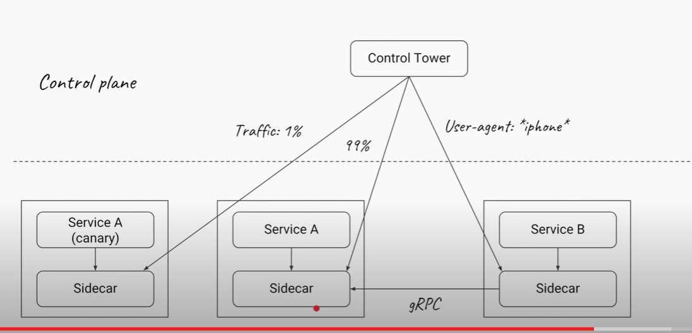
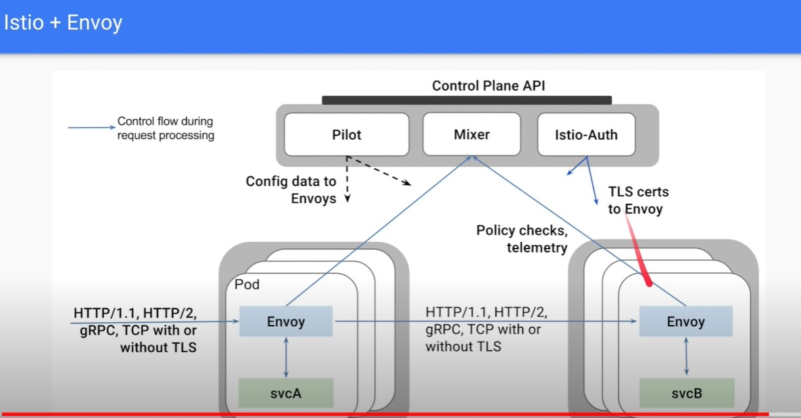
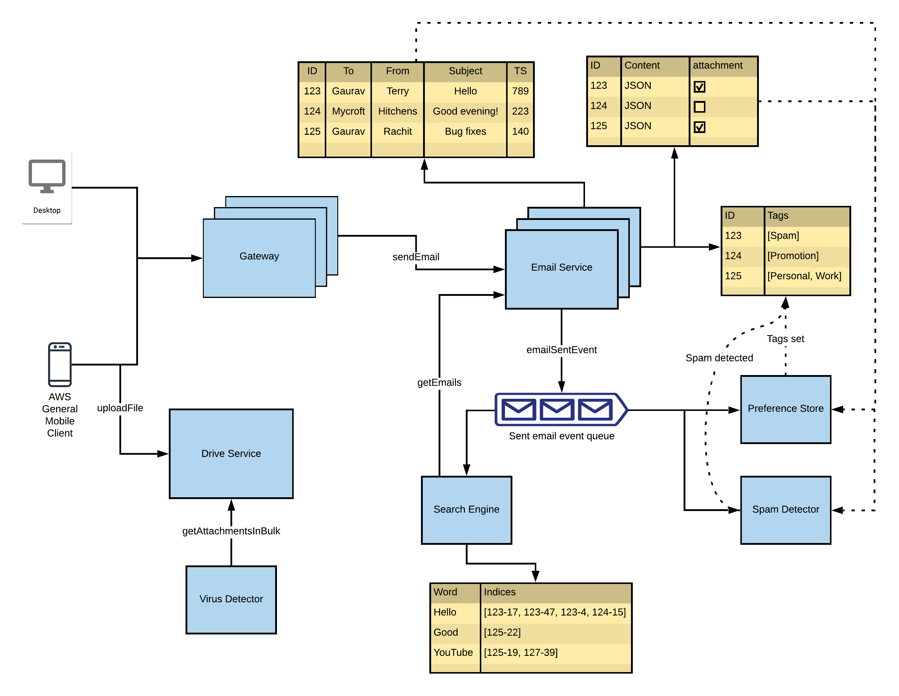
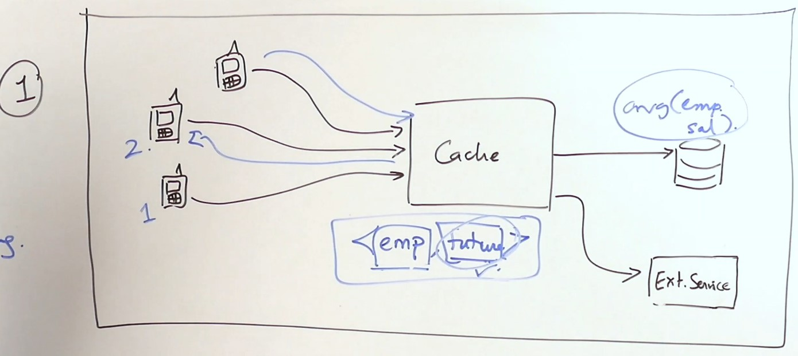
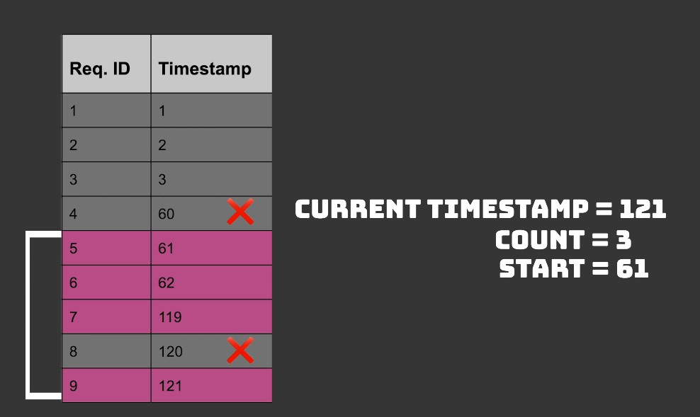

# Defog Tech
- Circuit Breaker (resilence4j)
- Bulkhead pattern
- Side Car Pattern (Envoy/Istio)

## Benifits of Microservices
- Faster Delivery, frequent releases with less risk
- If designed properly a single microservice cannot crash entire systems
- Scaling independently
- Well defined teams and responsibilities
- Polygot services, with own persisitence.

## What are responsibilities of Reverse Proxy/ Service Mesh (Side Car Pattern)
- Distributed Tracing/Logging
- Load Balancing
- Heart Beat Sensing
- Auto Scaling
- Telemetrics
- Service Discovery
- API Rate Limiting (Per IP and also in general)
  - External Requests
  - Internal Requests
- IP Blacklisting
- Certificates, Policies Updating (Rolling certificates update each interval)
- API Contracts

## Service Mesh
- Removes all the infrastructure and devops related logic into another process in the same container.

- If service A wants to connect to service B, service A will talk to side car and all the infra/communication related decisions and actions are handled by side car.
- Control Tower can be a state application which manages these side car.
- Service registry Single Point of failure, so service mesh is a better alternative.
- Can easily perform rolling deployment/ canary deployment
- distributed tracing
- Security, updates certificates, policies
- Change communication from HTTP to gRPC etc, without changes to application/business logic.

### Istio/ Envoy

## What all are the causes of cascading failures.
- Using REST Synchronous calls.
- In a system if one of the service's load is exceeded and there is no rate limiting, it crashes, which can lead to all the requests served by that service to be distributed into some other bunch of servers(without rate limiting), one of which might not have the capacity for additional load and will crash and similarly all other servers crash and the entire system is down, because there was no rate limiting. 
- In case of non async IO, if one of the server B is slow in processing one type of request of server A, eventually all the threads in thread pool of the server A will be waiting for that same slow request, and any subsequent call to the service A from say client will fail. So a failure in Service B has caused failure in Service A, and in case we have a lot of microservices in a tightly coupled manner, cascading failures will result.
  

## How to deal with slow server/ unresponding server
### Circuit Breaker
#### Immediate Failure
- If a service is down, and 10 requests to the service have failed/returned exception, it doesn't make sense to try to make the 11th request without waiting for service to get up.
#### Timeout Failure
- Instead of exception, the thread is not freed and is waiting for the IO request, in such cases we can use an interceptor/ side car to maintain count of waiting threads per service, and stop subsequent requests if percentage of failure is increasing for that service.

resilience4j uses decorator pattern to implement Circuit Breaker in Java, Hystrix is another library which also does circuit breaking written by Netflix.

### Bulkhead Pattern
- We can instead also set a max limit of threads for each REST Call to another service. Say max threads serving Payment Service can only be 3.

## How to deal with bad actors/ spamming servers
### Partitioning the Request Queue of the server
- Request queue(Array Blocking Queue) for each server can be partitioned to serve request ID per Hash, each internal server will have unique ID, and the parition for the bad actor will be only blocked, rest of the paritions will be safe. 

# GMail
## Gateway
- Caches data from Service Discovery and Auth Service(relevant tokens) (Updated via async messages/Side Car Pattern/ Global Cache)
- Checks the token on every request
## Service Discovery/Registry (Eureka Server/Client)
  - Load Balancing on this level
  - Alternative is side car pattern.

## Auth Service
- Uses SMS Service for OTP etc.

## Upload files to S3
- Has virus checker

## Kafka Message Queue
- There are subscribers to email recieve event, Spam Filter, Preference Store/Tagging Service.
- There are subscribers to email processed event i.e Elastic Search/Lucene DB, Contacts Manager

# API Ratelimiter

## How to handle requests efficiently if too much load
- Vertical Scaling
  - Needs money
- Good messaging protocol, with less overhead.
  - HTTP 2/ GRPC
    - Multiplexing
- Compress the messages
- Reduce the number of client connections, if possible
  - Use websockets/ Server Side Push/Long Polling etc for realtime communications
- Pull/Push Mechanism for celebrity to avoid crazy fan out.
- Graceful Degradation
  - Say in new year you can ignore updating delivery reciepts and read reciepts to handle increased load.
- API Rate Limiting
- Intelligent Routing, based on server capacity
- Caching the responses
- ### Request Collapsing
  - Incase of cache miss, For general query request, you can store the future of the repository call in a cache of somesort. Any subsequent request for the same query can be mapped to the same future, and when the future is fulfilled all the request will automatically get the response and we hit db only once. This avoids each of the request being cache miss and sending individual request to the db server.
  
- Request condensing
  - Batch fetch all the request from the same db request.
- Rate limiting on client side with exponential backoff.

## External Rate Limiting
- Uses oracle to decide if we should drop the request/ serve the request.
- Every time a service comes up, you can register capacity of server to the oracle. i.e the number of requests a service can take.
- Internal Logic of Oracle can be implemented using :
### Sliding Window Approach

#### Issues
- Memory Footprint to store all the requests
- Garbage Collection, lot of.
### Timer Wheel/ Token Bucket Approach
- The wheel has buckets and each bucket can only store limited request. 
- When a request arrives we compute, taskArrivalTime mod bucketSize.
- Size of wheel/number of buckers is same as the timeout of the incoming request. After this much time the request is timed out by server/gateway.
- On each increment of time unit, we increase the pointer to next bucket. When we visit a bucket, we kick out all the previous requests in the bucket.
- We also have a counter to keep track of the total current serving request in the queue. If the requests exceed the max serving requests, we reject the new request. And using this timer wheel we remove all the requests automatically which are invalid.

#### Heirarchical Timer Wheel
- If task is long running and the timeout is long with lot of granularity, this leads to sparse timers, so we need heirarchical timer wheels for that purpose. 

## Internal Request
- It is not feasible to ping Oracle for every internal request

### Identify Rate Limiting Problem.
- Look at the metrics/ usage of the service.
- Look at the age of messages in the request queue for the service.
- Look at the size of dead letter queue (request which fail will be dropped into this queue and be pulled by relevant subscribers).

### Deal with bad actors
- Request queue(Array Blocking Queue) for each server can be partitioned to serve request ID per Hash, each internal server will have unique ID, and the parition for the bad actor will be only blocked, rest of the paritions will be safe. 