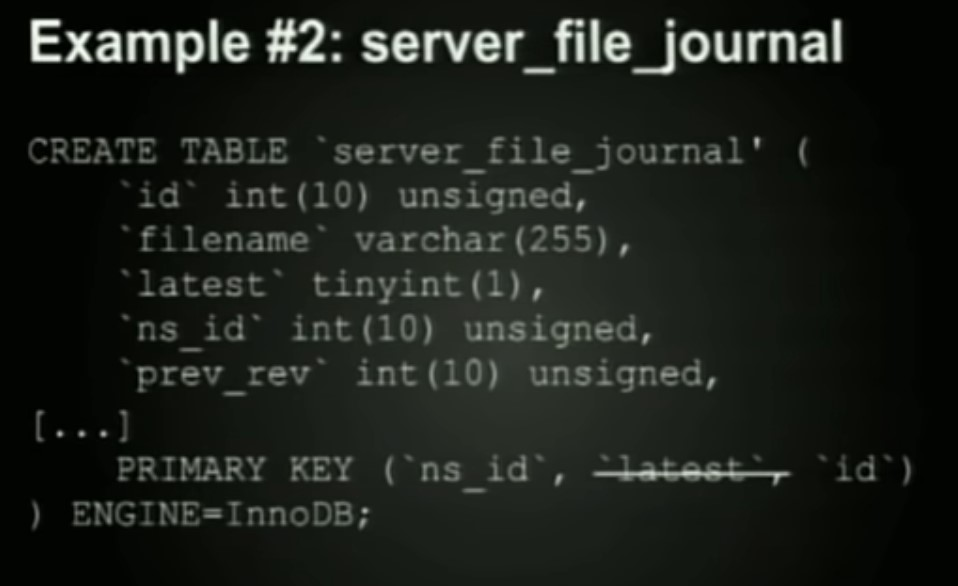
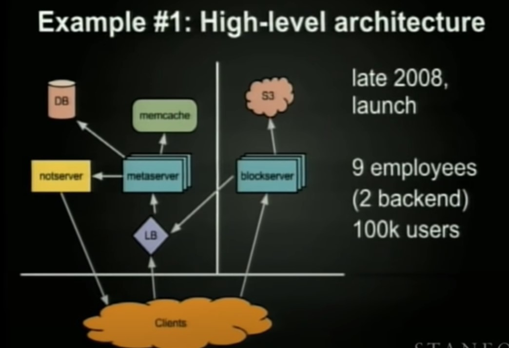

# Chapter 1-3
## Unique Key Generation either for sharding key/ unique url etc.

### Use separate Key Generation Service
- We can have a standalone Key Generation Service (KGS) that generates random six letter strings beforehand and stores them in a database.  we won’t have to worry about duplications or collisions. KGS will make sure all the keys inserted into key-DB are unique.

#### Concurrency Issues Solution
- KGS's database can use two tables to store keys: one for keys that are not used yet, and one for all the used keys. As soon as KGS gives keys to one of the servers, it can move them to the used keys table. 
- When KGS's application server starts, it can load some keys into the memory from database and mark them as used in the database, this ensures all the KGS's application servers get a unique key (however when the service restarts we loose all the prefetched keys, shouldn't be a problem since we have usually billions of keys).
- Also within the same KGS's application server we might need some kind of a mutex lock on the keystoring in-memory datastructure, so not 2 request to the same KGS server gets the same key. 
- KGS can have multiple application servers to avoid single point of failure

### Use auto-increment key option
- becomes difficult to scale and synchronise between various database servers.
- Overflow can be an issue.
- One solution to synchronization can be, have 2 database, one for generating only even keys and one for odd keys to avoid single point of failure : Approach followed by Flicker.

### Append date or other useful data to the unique key, useful to be used as a sharding key. Approach by Instagram
- Use several thousands of logical shards which are mapped to few physical shards, this will help in scale in future.
- Instagram combines 3 values to generate the unique key, custom epoch time in milliseconds (41 bits - for 41 years) + user_id%logical_shard_id (13 bits) + auto_increment_value%1024(10 bits, 1024 unique values per millisecond per shard). [Link](https://instagram-engineering.com/sharding-ids-at-instagram-1cf5a71e5a5c)
- By combining shard_id, we don't have to worry about synchronization issues

# Chapter - 4
## Drop Box (From [Video](https://www.youtube.com/watch?v=PE4gwstWhmc))
- Write heavy, almost 1:1.
- ACID Requirements
- S3 was where the data was stored and mysql had metadata.
- They separated upload, download functionality (moved to AWS) and the synching and webhosting functionality i.e metadata (onprem). 
- Moved from polling to notification servers, so that server is not bombed by the incoming polling requests for the updated data. Using long polling.
- Redundancy in servers.
- To make sure there are less db calls from block servers to mysql db (since repeated db calls across such large distances is really expensive), they did a simple REST call to the meta servers, which had the internal logic to do all those repeated db calls (faster since meta server is closer to mysql db than blockserver) (They could have also used stored procedures in mysql).
- Realised it is easier to use memcache that to implement complicated database sharding to scale dbs.
- Because of high consistency requirements, they had to deal with lots of issues in memcache and DBs.
- used standby load balancers for relaibility
- Block level deduplication, if 2 users upload same file the datastore should know they are the same.
  - Each file is divided into chunks and a hash of the chunk is calculated and if it is already the same as some other chunk, then it get's mapped to the same chunk/block in s3.
- Sharding based on user id, seems like a good choice but shared folders makes it hard.

### Metadata/Journalling
- Store all the changes related to the file in meta data, allows for versioning.
- Making journal_id as the primary key they were able to append to the journal table pretty fast, since they were appending based on incrementing journal_id.
- MySQL stores a varchar of length less than 255, better than the one of length more than 255.
- Declaring all fields as not null also reduces the space consumed.

### Primary Key
- They used a combination of namespace_id(identifies user/shared user space), latest(bool to denote if this is the latest version) and an incrementing jornal_id (for fast append based on ID order).
- latest field makes reads faster since we don't have to move over deleted or older versions of files to get the latest one for a namespace, but it makes writes slower, since writing things in dropbox led to shuffling things a while, since the older version file has to be moved over to the older portion of the index, so they later removed the latest field from primary key to optimize for writes since their read : write ratio was 1:1 almost.
- This simple change of primary key from just id to ns_id and id was able to do a massive improvement in performace.
- id is per namespace, so there is no issue of overflow.


### Sync
- If a file is modified to a small extent, only the delta's are kind of sent to the block server from the client using rsync.
### GIL Lock
- You can run, only 1 python thread, even with multiple cores.
### Distributed Database and Challenges
- Challenges include, how to perform distributed transaction?
### Scaling Notification Server
- Millions of clients connected to each Notification Servers.
- They added 2 level hierarchy to distribute connections to notification servers.





# Facebook Messenger

## From Internet
- Use Cassandra for faster writes. Make the (from-user, to-user) the partition key and the timestamp (DESC order by) your clustering key.
```sql
CREATE TABLE chat_messages (
    message_id uuid,
    from_user text,
    to_user text,
    body text,
    class text,
    time timeuuid,
    PRIMARY KEY ((from_user, to_user), time)
) WITH CLUSTERING ORDER BY (time ASC);
```
- The above approach however doesn't allow the user to delete the message, since delete in one user's view will delete it in other's view too. You can have flags to deal with this issue. ```visible_one and visible_two```

# Google Docs
- Use a queue to make sure the changes from various users come one after the other, each change to the server has a version number.
- Based one the version in the PUT request and the version of the doc in the server, you can perform operational transform. 
- All operations are either insert and delete.
- All user's cursor should be communicated using websockets. Version history, error messages.
- An append only change log, can be used to go back to versions.
- Markdown to persist the formatted text in the database. 
- Data is denormalized, document based storage.

# Google Search
## Crawler
## Page Rank
## Index

# TikTok
- CDN, News feed(Same with instagram push pull)
- S3, Meta data use SQL


# To Read
- https://instagram-engineering.com/handling-growth-with-postgres-5-tips-from-instagram-d5d7e7ffdfcb
- https://instagram-engineering.com/search-architecture-eeb34a936d3a