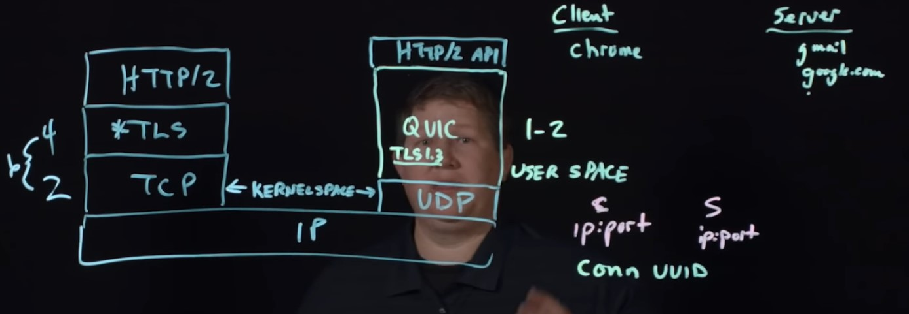

# There is a limit on how many connection can be made to an application
- Theoritically a backend server alone listening on a single port can have unlimited connections, but a tier 2 architecture like using reverse proxy limits total connection to be made since you need a unique client port-server port relation for the tcp connection and there are limited client port in reverse proxy so you have a limit.
- Due to limited ports on the reverse proxy which acts a client for the backend.
- One way to get around is to increase backend servers
- Other way Listen on more than one port in the backend server
- One more way is to use multiplexing on same connection like using http2.

# Head of line blocking problem with HTTP 1.1
Head of Line blocking (in HTTP/1.1 terms) is often referring to the fact that each client has a limited number of TCP connections to a server (usually 6 connections per hostname) and doing a new request over one of those connections has to wait for the previous request on the same connection to complete before the client can make a new request.

# HTTP2 vs HTTP3
- HTTP2 Solves head of line blocking issue at layer 7 by introducing the concept of streams/multiplexing over the same TCP connection multiple request each request with unique stream id. So a client can make multiple requests to a server without having to wait for the previous ones to complete as the responses can arrive in any order
- HTTP2 doesn't solve the head of line blockin issue for Layer 4 TCP protocol due to TCP's congestion control, one lost packet in the TCP stream makes all streams wait until that package is re-transmitted and received. This is because the server has no idea which packet corresponds to what stream at a TCP Level, so it cannot start processing completed requests till all are reached.
## HTTP3
  - HTTP3/QUIC Protocol takes all the good aspects of TCP(Congestion feedback, Loss control), TLS 1.3 and streams from HTTP2 and combines it with UDP.
  -  Unlike TCP and UDP, QUIC is implemented in User Space. Applications can implement QUIC in client application like Google chrome.
  - HTTP2 over TLS has 6 handshakes(4 for TLS and 2 for TCP handshake)
  - QUIC has only 1-2 Handshake.
  - If you loose packets in QUIC, only the stream which lost the packet will be blocked unlike in HTTP2 since UDP doesn't care about order.
  - Unlike in usual protocols with connection ID recognized using ip:port, QUIC has an indepenent connection UUID, so when you switch wifi to mobile network in your cellphones, you can use the same connection.
  - 

# VPN vs Proxy
## VPN
- Makes you part of the VPN Network.
- VPN gives you access to VPN Network's resource.
### Pros
- VPN is layer 2 protocol
- Very slow since multiple hops (you connect to vpn then vpn connects to the destination server).
### Cons
- Double Encryption
- No Caching
- VPN Network's Servers are in same network as you. So they can access your shared resources.

## Proxy
- Protocol Specific
### Pros
- Cachable
- Works at Layer 4 and Layer 7
- Look at the request and tell you and useful for development and debugging
- Used for Load Balancing
  - Service Mesh
  - Varnish HTTP Accelerator

### Cons
- Can see your data.
- They change X-Forwarded For and to, VIA chain header so not anonymous.
- Application can bypass proxy
- Protocol Specific
- Public HTTPs **Terminate TLS Connections** can look at all your HTTPs traffic since they serve you their certificates instead.

# TLS - 1.2 vs 1.3

## TLS 1.2
- Gives option to choose rsa/diffie-helman/eliptical etc..
- You have this 4 http steps before actual sending a single byte.
  - Client Hello (supported algo)
  - Server Hello (use this algo)
  - Change cipher(client-generated-shared-key+encrypted by server's public key)
  - Server fin
- Bad 

## TLS 1.3
- Always communicate keyexchange over diffie-helman.
- Only 2 http steps is required
  - Client hello + send (public key client + public key server + private key client).
  - Server hello + send (public key client + public key server + private key server) 
- Less steps because negotiation for keyexchange protocol is not required.
- TLS 1.3 is more secure because RSA implementations doesn't guarantee perfect forward secrecy or provide with very low encryption grade, thus TLS 1.3 has changed to Diffie Helman.
- Forward secrecy protects past sessions against future compromises of keys or passwords. By generating a unique session key for every session a user initiates, the compromise of a single session key will not affect any data other than that exchanged in the specific session protected by that particular key.

# Synchronous vs Asynchronous vs Multithreading vs Multiprocessing

- Multiprocessing example in morderm times is containerization
- Asynchronous is just non-blocking using callback/async-await. A single thread can be asycnhronous.
- Multithreaded application can be synchronous.

# MQTT vs message Queues
- In message queue a single message is only consumed by one consumer. The load is distributed between all consumers for a queue.
- In MQTT the behavior is quite the opposite: every subscriber that subscribes to the topic gets the message
- A queue is far more rigid than a topic. Before a queue can be used, the queue must be created explicitly with a separate command.
- In contrast, MQTT topics are extremely flexible and can be created on the fly.
- MQTT supports Last-Value-Queue which allows new consumers to quick the old messages and only get latest ones.
- , it is troublesome to use MQTT for the classical long-lived messaging queues. On the other hand, RabbitMQ supports almost all the messaging forms like pub-sub, round-robin, message-queues, etc. It also supports message grouping and idempotent messages. It supports a lot of fine-grain control in terms of accessing queues. 
- MQTT doesn’t support transactions and allows some basic acknowledgments.
- Both RabbitMQ and MQTT are popular and widely used in the industry. You would prefer RabbitMQ when there is a requirement for complex routing, but you would prefer MQTT if you are building an IOT application. 

# Kafka vs Messages Queue
## Pros
- One important distinction is Kafka is based on Long Polling and Message Queue is based on Push, usually long polling is better than pushing because the producer produce at a rate far greater than consumers consume, so it is always good for consumers to pull, long polling is essentially consumer saying, hey if you have some messages please push, else I will wait and keep the connection alive for some time.
- Kafka is Event Driven(microservices with Kafka), Queue(all consumers in one consumer group), PubSub(different consumer groups).
- Fast because it is append only, and offset is like array indices so fast, scales very well zookeeper will just pick up another broker.
- Parallel processing because of partitioning.
- Request is Idempotent.

## Cons
- zookeeper is a single point of failure.
- Whenever kafka rebalances partitions over brokers it becomes unavailable (CAP Theorem).
- Head of line blocking if a particular message is expensive and the entire partition is blocked. 

# We want retries but the request that is retried should be idempotent.
POST requests are the most dangerous in this regard. If I may suggest something, clients should not dictate the primary key such as OrderId. That should be left to the server implementation on how to generate the primary keys for a given entity (it may use sequence, uuids or something else). What clients can do is pass a unique identifier to identify the request, which the server can then use to identify duplicate requests/retries. Stripe uses something called as Idempotency-Key in the request header..
PUT requests benefit from the checksum of the request to avoid the extra network call of update (since, you generally do a GET before a PUT to verify that the row wit the given key exists) and you can verify the checksum after the GET. Flow.io CTO has a very nice presentation of some of these elements - https://www.youtube.com/watch?v=j6ow-UemzBc