# Chapter - 1
## Interrupts
- Hardware may trigger an interrupt at any time by sending a signal to the CPU, usually by way of the system bus.
- When the CPU is interrupted, it stops what it is doing and immediately transfers execution to a fixed location. The fixed location usually contains the starting address where the service routine for the interrupt is located.
- Generally, the table of pointers is stored in low memory (the first hundred or so locations). These locations hold the addresses of the interrupt service routines for the various devices.
- Interrupt handlers run asynchronously, and must respond to time-critical inputs quickly. Therefore, interrupt handler is divided into top half and bottom half. First half was executed by the kernel immediately after a hardware interrupt, whereas bottom half are the tasks that can be deferred to execute later

## CPU Protection Rings
- Typically in x86 architecture, there are 4 rings of protection. Ring 0 (kernel mode), Ring 1 (may be used by virtual machine hypervisors or drivers), Ring 2 (may be used by drivers, I am not so sure about that though). Ring 3 is what typical applications run under. It is the least privileged ring, and applications running on it have access to a subset of the processor's instructions. Ring 0 (kernel space) is the most privileged ring, and has access to all of the machine's instructions. For example to this, a "plain" application (like a browser) can not use x86 assembly instructions lgdt to load the global descriptor table or hlt to halt a processor.
- The multiple mode of operation provides us with the means for protecting the operating system from errant users—and errant users from one another.

## Data Structures used in OS
### Lists, Stacks, and Queues
- Queues are also quite common in operating systems—jobs
that are sent to a printer are typically printed in the order in which they were submitted. Tasks that are waiting to be run on an available CPU are often organized in queues.
- Linux uses a balanced binary search tree (known as a red-black tree) as part its CPU-scheduling algorithm.
- A medium-sized disk drive might be divided into several thousand individual units, called disk blocks. A bitmap can be used to indicate the availability of each disk block.


# Chapter - 2


## High memory vs Low Memory
- On a 32-bit architecture, the address space range for addressing RAM is  (4 GB):
- The linux kernel splits that up 3/1 into user space (high memory) and kernel space (low memory) respectively.
- User processes are generally untrusted and therefore are forbidden to access the kernel space. Further, they are considered non-urgent, as a general rule, the kernel tries to defer the allocation of memory to those processes.
- Processes spawned in kernel space are trusted, urgent and assumed error-free, the memory request gets processed instantaneously.
- Every kernel process can also access the user space range if it wishes to. And to achieve this, the kernel maps an address from the user space to its kernel space.
- However, many operating systems (including Linux and Windows) place the operating system in high memory

## Linkers and Loaders
- Have a look at this section
### Symbol Resolution
Symbol resolution, the process of searching files and libraries to replace symbolic references or names of libraries with actual usable addresses in memory before running a program

## Relocation
- Relocation is the process of assigning load addresses for position-dependent code and data of a program and adjusting the code and data to reflect the assigned addresses.
- Relocation is typically done by the linker at link time, but it can also be done at load time by a relocating loader, or at run time by the running program itself. 
## Base and Limit Register
- used so that each process has a separate memory space.
- For every memory access
  - Base address is added to the address
  - Result is compared to the limit register.
## Object Files
### Relocatable object file
- They are “relocatable” because the functions and variables are not bound to any specific address. Instead, the addresses are still symbols.
- This file contains binary code and data that can be combined with other relocatable object files at compile time to create an executable object file.
- math.o is a relocatable file.
- Relocatable object files are linked together during compile time. 

### Executable Object Files
- an executable object file is simply a relocatable object file with the addresses assigned so that it can be placed into memory for execution.

### Shared Object Files
- shared object files are linked into programs during runtime. This is also known as dynamic linking.

## How to run applications on multiple os
- Use interpreter like Ruby or Python (slower than native)
- Use a VM based language, like Java (slower than native)
- Application programmer has to build binaries manually and test for all os. (lot of work for programmer).

## Application Binary Interface
- Each hardware architecture(ARM/x86) specifies certain standards at hardware level, including address width, methods of passing parameters to system calls etc.

## Kernel
- The kernel provides the file system, CPU scheduling, memory management, and other operating system functions through system calls.
- Applications typically use the glibc standard C library when communicating with the system call interface to the kernel.

## Types of kernel design
### Monolithic
### Layered 
  - (Only a higher layer can call lower layer).
  -  (Bad performance)
  -  Each layer has it's own defined and protected interface for debugging.
### Microkernel based.
  - Stripped off monolithic kernel 
  - certain components are moved from kernel space to user space. 
  - Bad performance.
### LKM Modules (LOADABLE KERNEL MODULES)
  - LKMs allow a dynamic and modular kernel, while maintaining the performance benefits of a monolithic system.
  - Here, the kernel has a set of core components and can link in additional services via modules, either at boot time or during run time.
  - Resembles layered since, each module has it's own protected interface but unliked layered any module can call any other module.
  - Also is similar to microkernels, in that the primary module has only core functions, but unlike microkernels, more efficient since the modules don't need to invoke message passing in order to communicate.
  - Linux uses loadable kernel modules, primarily for supporting device drivers and file systems.If the Linux kernel does not have the necessary driver, it can be dynamically loaded.

### Hybrid
  - Linux is monolithic, because having the operating system in a single address space provides very efficient performance. However, it also modular, so that new functionality can be dynamically added to the kernel.

## System boot
- The process of starting a computer by loading the kernel is
known as booting the system. 
###  Steps
- Power ON
- BIOS/UEFI
- MBR (First sector of Hard Disk) (Not in UEFI)
- A small piece of code known as the bootstrap program or boot loader(GRUB) locates the kernel.
- The kernel is loaded into memory and started.
- Intial RAM Disk - initramfs is loaded.
  - The kernel initializes hardware.
  - The root file system is mounted.
- /sbin/init or systemmd is spawned.
- Command shell using getty (Get tty)
- Bash opens up/ GUI (X Windows Server)

### Types of boot process
#### BIOS : Multistage boot process (BIOS based boot process) BIOS : Basic Input/Output system
- the Basic Input/Output System (BIOS) initializes the hardware, including the screen and keyboard, and tests the main memory. This process is also called POST (Power On Self Test).
- The BIOS software is stored on a ROM chip on the motherboard. After this, the remainder of the boot process is completely controlled by the operating system.
- Typically located in ROM/EPROM known as firmware.
- BIOS is not a bootloader, bootloader is a software, BIOS is firmware.

#### UEFI (Unified Extensible Firmware Interface)
- UEFI is a single, complete boot manager and therefore is faster than the multistage BIOS boot process.
- Better multiprocessor support.

### Bootloader

#### First Stage boot loader
- The first stage of PC boot loaders (FSBL, first-stage boot loader) located on fixed disks and removable drives must fit into the first 446 bytes of the Master Boot Record.
- Installed to MBR/master boot block/record or  first sector of the hard disk.
- It just initializes the second stage boot process
- Examples of first-stage bootloaders include coreboot, Libreboot and Das U-Boot.

#### Second Stage Boot loader 
- Example GRUB, Windows's BOOTMGR
- The second stage boot loader resides under /boot.
- Most Linux boot loaders can present a user interface for choosing alternative options for booting Linux,
- Loads file containing the kernel program. 
- run diagnostics to determine state of machine.
- provide booting into recovery mode or single-user mode for diagnosing hardware issues, fixing corrupt file systems, and even reinstalling the operating system.

#### GRUB (second stage boot loader)
- Open source bootstrap program.
- GRUB is flexible and allows changes to be made at boot time, including modifying kernel parameters and even selecting among different kernels that can be booted.


### Boot Loader working.
- Kernels are almost always compressed, so it's first job is to uncompress itself. 
-  During the boot process, the boot loader typically creates a temporary RAM file system, known as **initramfs**.
- This file system contains necessary drivers and kernel modules that must be installed to support the real root file system (which is not in main memory).
- Once the kernel has started and the necessary drivers are installed, the kernel switches the root file system from the temporary RAM location to the appropriate root file system location. 
-  Linux creates the systemd process, the initial process in the system, and then starts other services (for example, a web server and/or database). Most other processes on the system trace their origin ultimately to systemd; the exceptions are kernel processes, started by the kernel directly for managing internal operating system details.
-  Finally user is presented with login screen.


## Core dump
- a capture of the memory of the process—and store it in a file for later analysis, at event of failure.

## Proc in linux
- /proc is a “pseudo” file system that exists only in kernel memory and is used primarily for querying various per-process as well as kernel statistics. 
- the directory entry /proc/2155 would contain per-process statistics for the process with an ID of 2155.


# Chapter - 3

## Program vs Process
- A program becomes a process when an executable file
is loaded into memory

## The process memory layout


Although the stack and heap sections grow toward
one another, the operating system must ensure they do not overlap one another.

### Text section
- the executable code
- Fixed Size.

### Data section
- global variables
- Fixed Size

### Heap section
  - memory that is dynamically allocated during program run time.
### Stack section
  - temporary data storage when invoking functions (such as function parameters, return addresses, and local variables).
#### Activation Record
  - Each time a function is called, an activation record containing function parameters, local variables, and the return address is pushed onto the stack. when control is returned from the function, the activation record is popped from the stack.

## Build Process for various languages
- Machine code is binary (1's and 0's) code that can be executed directly by the CPU. If you were to open a machine code file in a text editor you would see garbage, including unprintable characters (no, not those unprintable characters ;) ). Machine code is pure hexadecimal code: ```5F 3A E3 F1```
- Object code is a portion of machine code not yet linked into a complete program. It's the machine code for one particular library or module that will make up the completed product. It may also contain placeholders or offsets not found in the machine code of a completed program. The linker will use these placeholders and offsets to connect everything together.
- Assembly code is plain-text and (somewhat) human read-able source code that mostly has a direct 1:1 analog with machine instructions. This is accomplished using mnemonics for the actual instructions, registers, or other resources. Examples include JMP and MULT for the CPU's jump and multiplication instructions. Unlike machine code, the CPU does not understand assembly code. You convert assembly code to machine code with the use of an assembler or a compiler, though we usually think of compilers in association with high-level programming language that are abstracted further from the CPU instructions. Assembly code : ```mov eax, 77```

### Compiled Languages
- Building a complete program involves writing source code for the program in either assembly or a higher level language like C++. The source code is assembled (for assembly code) or compiled (for higher level languages) to object code, and individual modules are linked together to become the machine code for the final program. In most cases, a complicated make script or solution file may be used to tell the environment how to build the final application.

### Interpreted Languages
- Interpreted languages rely on the machine code of a special interpreter program. At the basic level, an interpreter parses the source code and immediately converts the commands to new machine code and executes them. Modern interpreters are now much more complicated: evaluating whole sections of source code at a time, caching and optimizing where possible, and handling complex memory management tasks.

### Virtual machine
- In this situation, a program is first pre-compiled to a lower-level intermediate language or byte code. The byte code is then loaded by the virtual machine, which interprets/compiles(compilation is a optimization ste p for repeated parts of code) it to native code. The advantage here is the virtual machine can take advantage of optimizations available at the time the program runs. A compiler belongs to the developer, and therefore must produce relatively generic (less-optimized) machine code that could run in many places. The runtime environment or virtual machine, however, is located on the end user's computer, and therefore can take advantage of all the features provided in that environment.

## Memory Layout for c program


- GNU ```size``` command can be used to determine the size in bytes of the above section.
- The global data section is divided into different sections for (a) initialized data and (b) uninitialized data.
- A separate section is provided for the argc and argv parameters passed to the main() function.

## Build Process for c program


## Process state
It is important to realize that only one process can be running on any processor core at any instant.


## Process control block Components
- You can get some of this data from ```cat /proc/process_id/status```
- PCB must be kept in an area of memory protected from normal process access. In some operating systems the PCB is placed at the beginning of the kernel stack of the process.
- On systems that support threads, the PCB is expanded to include information for each thread.
- The process control block in the Linux operating system is represented by the C structure task struct, which is found in the <include/linux/sched.h>

### Process State
### Program Counter
### CPU registers
- They include accumulators, index registers, stack pointers, and general-purpose registers, plus any condition-code information. Along with the program counter, this state information must be saved when an interrupt occurs, to allow the process to be continued correctly afterward when it is rescheduled to run. The CPU uses these values to fill it's own register on each context switch.

### Memory-management information.
-  may include such items as the value of the base and limit registers and the page tables, or the segment tables

### I/O status information.
-  This information includes the list of I/O devices allocated to the process, a list of open files, and so on.

### CPU-scheduling information. 
- This information includes a process priority, pointers to scheduling queues, and any other scheduling parameters.

### Memory management information
This information may include such items as the value of the base and limit registers and the page tables, or the segment tables, depending on the memory system used by the operating
system.

### Accounting information.
This information includes the amount of CPU and real time used, time limits, account numbers, job or process numbers.

### I/O status information.
This information includes the list of I/O devices allocated to the process, a list of open files, and so on.


## Scheduling Queues
- As processes enter the system, they are put into a ready queue, where they are ready and waiting to execute on a CPU’s core This queue is generally stored as a linked list; a ready-queue header contains pointers to the first PCB in the list, and each PCB includes a pointer field that points to the next PCB in the ready queue.


- Context-switch times are highly dependent on hardware support. For instance, some processors provide multiple sets of registers.

## Process Creation.

-  A child process may be able to obtain its resources directly from
the operating system, or it may be constrained to a subset of the resources
of the parent process, like open files, pipes etc.

- Restricting a child process to a subset of
the parent’s resources prevents any process from overloading the system by
creating too many child processes.

- When a process terminates, its resources are deallocated by the operating system. However, its entry in the process table must remain there until the parent calls wait(), because the process table contains the process’s exit status.

- A process that has terminated, but whose parent has not yet called wait(), is known as a zombie process.

- Now consider what would happen if a parent did not invoke wait() and instead terminated, thereby leaving its child processes as orphans. Traditional UNIX systems addressed this scenario by assigning the init process as the new parent to orphan processes. The init process periodically invokes wait(), thereby allowing the exit status of any orphaned process to be collected and releasing the orphan’s process identifier and process-table entry.

### Fork and Exec
- Fork is an operation whereby a process creates a copy of itself.
- When a process calls fork, it is deemed the parent process and the newly created process is its child. After the fork, both processes not only run the same program, but they resume execution as though both had called the system call. They can then inspect the call's return value to determine their status, child or parent, and act accordingly. (return value is pid of child process for parent and zero for child).
- A child process uses the same pc(program counter), same CPU registers, same open files which use in the parent process.
- The fork operation creates a separate address space for the child. The child process has an exact copy of all the memory segments of the parent process. In modern UNIX variants that follow the virtual memory model from SunOS-4.0, copy-on-write semantics are implemented and the physical memory need not be actually copied. Instead, virtual memory pages in both processes may refer to the same pages of physical memory until one of them writes to such a page: then it is copied. This optimization is important in the common case where fork is used in conjunction with exec to execute a new program: typically, the child process performs only a small set of actions before it ceases execution of its program in favour of the program to be started, and it requires very few, if any, of its parent's data structures.
- Then, the copy, called the "child process", calls the exec system call to overlay itself with the other program: it ceases execution of its former program in favor of the other.
- Some UNIX systems have chosen to have two versions of fork(), one that duplicates all threads and another that duplicates only the thread that invoked the fork() system call.
- Which of the two versions of fork() to use depends on the application.
If exec() is called immediately after forking, then duplicating all threads is unnecessary, as the program specified in the parameters to exec() will replace the process. In this instance, duplicating only the calling thread is appropriate. If, however, the separate process does not call exec() after forking, the separate process should duplicate all threads.
## IPC
- There are two fundamental models of interprocess communication: shared memory and message passing.
- Chrome's multiprocess architecture, . If one website crashes, only its renderer process is affected; all other processes remain unharmed.
- Message passing is useful for exchanging smaller amounts of data, because no conflicts need be avoided. Message passing is also easier to implement in a distributed system than shared memory.
- Shared memory can be faster than message passing, since message-passing systems are typically implemented using system
calls and thus require the more time-consuming task of kernel intervention. In shared-memory systems, system calls are required only to establish sharedmemory regions. Once shared memory is established, all accesses are treated as routine memory accesses, and no assistance from the kernel is required.

### Shared Memory
- Interprocess communication using shared memory requires communicating processes to establish a region of shared memory. Typically, a shared-memory region resides in the address space of the process creating the shared-memory
segment.
-  Other processes that wish to communicate using this shared-memory segment must attach it to their address space.
-  They can then exchange information by reading and writing
data in the shared areas. The form of the data and the location are determined by these processes and are not under the operating system’s control. I.e They are responsible for data synchronization.

#### Memory mapped files
- POSIX shared memory is organized using memory-mapped files, which associate the region of shared memory with a file.
-  the mmap() function establishes a memory-mapped file containing
the shared-memory object. It also returns a pointer to the memory-mapped file
that is used for accessing the shared-memory object.

### Message Passing
- A message-passing facility provides at least two operations:
  - send(message)
  - receive(message)
  
- If processes P and Q want to communicate, they must send messages to and receive messages from each other: a communication link must exist between them.
#### Buffering in message systems
Whether communication is direct or indirect, messages exchanged by communicating processes reside in a temporary queue. Basically, such queues can be
implemented in three ways:
- Zero capacity. The queue has a maximum length of zero; thus, the link
cannot have any messages waiting in it. In this case, the sender must block
until the recipient receives the message.
- Bounded capacity. The queue has finite length n; thus, at most n messages
can reside in it. If the queue is not full when a new message is sent, else sender waits.
- Unbounded capacity. The queue’s length is potentially infinite.

### Windows IPC
- The message-passing facility in Windows is called the advanced local procedure call (ALPC) facility. It is used for communication between two processes
on the same machine.
- Windows uses a port object to establish and maintain a connection between two
processes. Windows uses two types of ports: connection ports and communication ports.
- When a client wants services from a subsystem, it opens a handle to the
server’s connection-port object and sends a connection request to that port.
The server then creates a channel and returns a handle to the client.
- The channel consists of a pair of private communication ports: one for client–server
messages, the other for server–client messages.
- Larger messages must be passed through a section object, which is a
region of shared memory associated with the channel.
- It is important to note that the ALPC facility in Windows is not part of the
Windows API and hence is not visible to the application programmer. Rather,
applications using the Windows API invoke standard remote procedure calls.
When the RPC is being invoked on a process on the same system, the RPC is
handled indirectly through an ALPC procedure call. Additionally, many kernel
services use ALPC to communicate with client processes.


### Pipes

- Example : ```ls | less``` 

#### Ordinary Pipes
- They are unidirectional and
employ parent–child relationships between the communicating processes.
- If two-way communication is required, two pipes must be used, with each pipe sending data in a different direction. 
-  Typically, a parent process creates a pipe and uses it to communicate with
a child process that it creates via fork().
-  a child process inherits open files from its parent. Since a pipe is a special type of file, the child inherits the pipe from its parent process.

- On UNIX systems, ordinary pipes are constructed using the function
```pipe(int fd[])``` This function creates a pipe that is accessed through the int fd[] file descriptors: fd[0] is the read end of the pipe, and fd[1] is the write end. UNIX treats a pipe as a special type of file. 
- Thus, pipes can be accessed using ordinary read() and write() system calls.
- once the processes have finished communicating and have terminated, the ordinary
pipe ceases to exist.

#### Named Pipes
- Named pipes provide a much more powerful communication tool.
- Communication can be bidirectional, and no parent–child relationship is required.
- Once a named pipe is established, several processes can use it for communication. In fact, in a typical scenario, a named pipe has several writers.
- Named pipes are referred to as FIFOs in UNIX systems.


## RPC
- RPC is the service and protocol offered by the operating system to allow code to be triggered for running by a remote application. It has a defined protocol by which procedures or objects can be accessed by another device over a network. An implementation of RPC can be done over basically any network transport (e.g. TCP, UDP).

- Similar to IPC, but because we are dealing with an environment in which the processes are executing on separate systems, we must use a message-based communication scheme to provide remote service. We can't use shared memory communication.
- In contrast to IPC messages, the messages exchanged in RPC communication are well structured and are thus no longer just packets of data.
-  Each message is addressed to an RPC daemon listening to a port on the remote system, and each contains an identifier specifying the function to execute and the parameters to pass to that function. 
- Parameter marshaling addresses the issue concerning differences in data representation(big endian/little) on the client and server machines. . To resolve differences like this, many RPC systems define a machine-independent representation of data. One such representation is known as **external data representation (XDR)**.
- Request handling should be Atmost once i.e, Idempotent.
- The client can know the port to communicate beforehand or can ask a rendezvous (also called a **matchmaker**) daemon on a fixed RPC port.


## Socket
- The socket is just a programming abstraction such that the application can send and receive data with another device through a particular network transport. You implement protocols (such as RPC) on top of a transport (such as TCP) with a socket.
- sockets packetize communication using IPv4 or IPv6

### Sockets vs Pipes
- pipes only exist within a specific host, and they refer to buffering between virtual files, or connecting the output / input of processes within that host. There are no concepts of packets within pipes.
- sockets packetize communication using IPv4 or IPv6; that communication can extend beyond localhost. Note that different endpoints of a socket can share the same IP address; however, they must listen on different TCP / UDP ports to do so.


# Chapter 4

- It comprises a thread ID, a program counter (PC), a register set, and a stack.
-  It shares with other threads belonging to the same process its code section, data section, and other operating-system resources, such as open files and signals. Also heap area.
- Context switching a process is slower than context switching a thread belong to same process. Thus threads are called Light Weight Processes.

## Advantages
- Responsive UI
- Resource sharing is easy, don't have to use IPC.
- Thread creation is easier than process creation.
- Greatly helps in case of multiprocessor architecture.

## Concurrency vs Parallelism
- A concurrent system supports more than one task by allowing all the tasks to make progress. By using time multiplexing. This doesn't need multicore architecture.

-  a parallel system can perform more than one task
simultaneously. In a multicore architecture. 

## Amdahl's Law
- Amdahl’s Law is a formula that identifies potential performance gains from adding additional computing cores to an application that has both serial (nonparallel) and parallel components. 
- If S is the portion of the application
that must be performed serially on a system with N processing cores, the formula appears as follows :


- One interesting fact about Amdahl’s Law is that as N approaches infinity, the speedup converges to 1/S. You can never go beyond 1/S, no matter the number of cores you add.

## Multithreading Modes
- Support for threads may be provided either at the user level, for user threads, or by the kernel, for kernel threads.
- User threads are supported above the kernel and are managed without kernel support, whereas kernel threads are supported and managed directly by the operating system.
- It is kernel threads that the operating system schedules to run on physical processors.
- Ifk Kernel Thread Blocks(Waiting for an IO Operation) the underlying user thread also blocks.
- See The below section for Scheduler Activations for internal workings.
-  A relationship must exist between user threads and kernel
threads.

### Many-to-One Model
- The many-to-one model maps many user-level threads to one kernel thread.
- The entire process will block if a thread makes a blocking system call. Since only 1 kernel thread is given to a process and that thread is busy in making the system call.
- multiple threads are unable to run in parallel on multicore systems.
- No one uses this nowadays.

### One to One Model
- maps each user thread to a kernel thread.
- It provides more concurrency than the many-to-one model by allowing another thread to run when a thread makes a blocking system call.
- Creating a user thread requires creating the corresponding kernel thread, and a large number of kernel threads may burden the performance of a system.
- Linux, along with the family of Windows operating systems, implement the one-to-one model.

### Many to Many Model
-  Multiplexes many user-level threads to a smaller or equal number of kernel threads.
-  The number of kernel threads may be specific to either a particular application or a particular machine (an application may be allocated more kernel threads on a system with eight
processing cores than a system with four cores).
-  Developers can create as many user threads as necessary, and
the corresponding kernel threads can run in parallel on a multiprocessor. Also, when a thread performs a blocking system call, the kernel can schedule another thread for execution.
- In practice it is difficult to implement.

### Two Level Model
-  still multiplexes many userlevel threads to a smaller or equal number of kernel threads but also allows a user-level thread to be bound to a kernel thread.


## Threading Libraries
- Pthreads, may be provided as either a user-level or a kernel-level library.
- The Windows thread library is a kernel-level library available on Windows systems. Invoking a function in the API for the library typically results in a system call to the kernel.
- Java thread API is generally implemented using a thread library available on the host system. This means that on Windows systems, Java threads are typically implemented using the Windows API; UNIX, Linux, and macOS systems typically use Pthreads.

### Two Types of Thread Creation
- Asynchronous : Once the parent creates a child thread, the parent resumes its execution, example UI app. 
- Synchronous :  Only after all of the children have joined can the parent resume execution, example  the
parent thread may combine the results calculated by its various children.

## Implicit Threading
- These strategies generally require application developers to
identify tasks—not threads— that can run in parallel.
- A task is usually written as a function, which the run-time library then maps to a separate thread.
-  developers only need to identify parallel tasks, and the
libraries determine the specific details of thread creation and management.

### Thread Pool
- The general idea behind a thread pool is to create a number of threads at
start-up and place them into a pool, where they sit and wait for work.
-  If the pool contains no available thread, the task is queued until
one becomes free. 
- Once a thread completes its service, it returns to the pool
and awaits more work.
-  Thread pools work well when the tasks submitted to
the pool can be executed asynchronously.

#### Advantages
- Servicing a request with an existing thread is often faster than waiting to
create a thread.
- Limits threads to a certain limit.
- Allows for task to be executed after time delay or execute periodically, since we separated the logic of creation and exectution.

### Fork Join
- look at fork join in java.

## Threading Design Consideration

### Fork and Exec
- Whether fork copies all threads or not, depends on the application.
If exec() is called immediately after forking, then duplicating all threads is unnecessary. e. If, however, the separate process does not call exec() after forking, the separate process should duplicate all threads.

### Signals
- A signal is used in UNIX systems to notify a process that a particular event has occurred.
- A signal may be received either synchronously or asynchronously.
- Examples of synchronous signals include illegal memory access and division by 0.  Synchronous signals are delivered to the same process that performed
the operation that caused the signal.
- When a signal is generated by an event external to a running process, that
process receives the signal asynchronously. Examples of such signals include
terminating a process with specific keystrokes (such as <control><C>), completion of an IO event.
- Once delivered, the signal must be handled.
  - A default signal handler
  - A user-defined signal handler
- Delivering signals is more complicated in multithreaded programs
  - synchronous signals need to be delivered to the thread causing
the signal and not to other threads in the process.
  - some async signals like terminate, should be sent to all threads.

#### APC (Asynchronous Procedure Calls)
- The APC facility enables a user thread to specify a function that is to be called when the user thread receives notification of a particular event.

### Thread Cancellation
- Two Types of cancellation
#### Async Cancellation
-  One thread immediately terminates the target thread. No chance to clean itself.
- canceling a thread asynchronously may not free a necessary system-wide resource.
#### Deferred Cancellation
- The target thread periodically checks whether it
      should terminate, allowing it an opportunity to terminate itself in an
      orderly fashion.
- cancellation occurs only after the target thread has checked a flag to determine whether or not it should be canceled. When a thread reaches a **cancellation point**.

### Thread Local 
- See Java Multithreading notes

### Scheduler Activations
- #### Only valid for many to many or many to one model.
- There is an intermediate datastructure known as LWP (Light Weight Process) between user thread and kernel thread.
- For User thread library, LWP appears to be a virtual processor on which the application can schedule a user thread to run.
- Each LWP is attached to a kernel thread, and it is kernel threads that the operating system schedules to run on physical processors.
- There is a one-to-one correspondence between LWPs and kernel threads.
- If a kernel thread blocks (such as while waiting for an I/O operation to complete), the LWP blocks as well, as a result the user thread blocks.
  
#### Number of LWPs
- For CPU Bound Application, LWP == No of processors
- IO Bound Application, can require multiple LWP to process. Typically, an LWP is required for each concurrent blocking system call. For example, that five different file-read requests occur simultaneously. Five LWPs are needed, because all could be waiting for I/O completion in the kernel. If a process has only four LWPs, then the fifth request must wait for one of the LWPs to return from the kernel.
#### Working of LWPs
- One scheme of communication between user level thread and kernel thread is scheduler activation : 
- The kernel provides an application with a set of virtual processors (LWPs), and the application can schedule user threads onto an available virtual processor.
- Furthermore, the kernel must inform an application about certain events. This is known as **upcall**. Upcalls are handled by the thread library with an upcall handler, and upcall handlers must run on a virtual processor.
- When a User thread is about to block, the kernel makes an upcall to the application thread library, and the thread library, saves the state of the current blocked thread, and schedules another thread to run on LWP.
- Once the blocking event is fulfilled, the kernel makes another upcall, (which is handled on another LWP) which may allocate a new LWP or may prempt an exisiting user thread. 

### Upcall
- An upcall is a mechanism that allows the kernel to execute a function. in userspace.
- Opposite of system call.

## Threads in Windows
### Components of thread
- A thread ID uniquely identifying the thread
- A register set representing the status of the processor
- A program counter
- A user stack, employed when the thread is running in user mode, and a kernel stack, employed when the thread is running in kernel mode.
- A private storage area used by various run-time libraries and dynamic link libraries.
- The register set, stacks, and private storage area are known as the context of the thread.

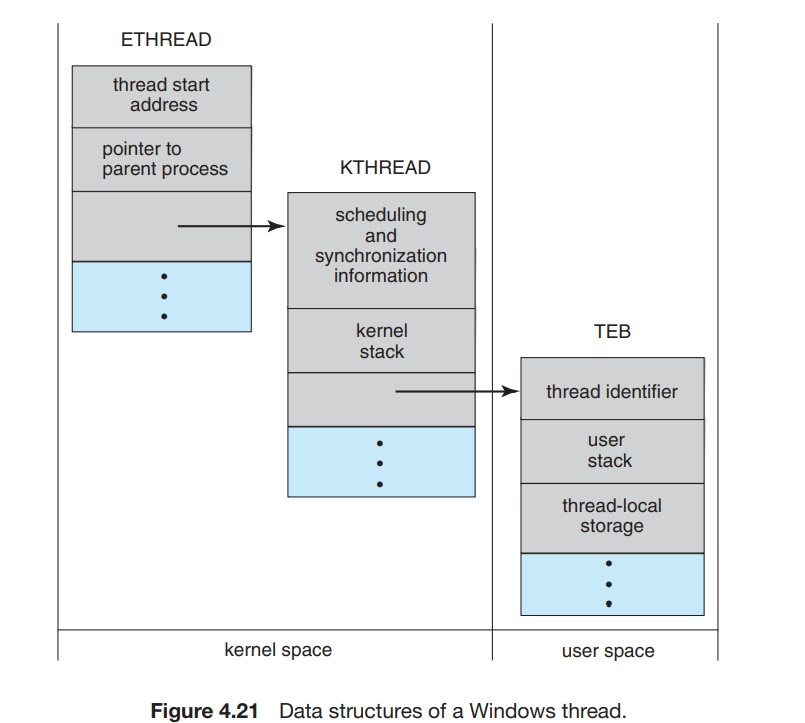
- The ETHREAD and the KTHREAD exist entirely in kernel space; this means
that only the kernel can access them. 

## Linux Threads
- ### Linux does not distinguish between processes and threads. Linux uses the term task rather than process or thread when referring to a flow of control within a program.
- Just like fork is used to create a process in Linux, Linux also provides **clone()** to create a thread.
- When clone() is invoked, it is passed a set of flags that determine how much sharing is to take place between the parent and child tasks.
- Based on flags passed to clone, the task can behave as a process/ a thread.
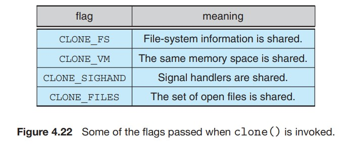
- For example, suppose that clone() is passed the flags CLONE FS, CLONE VM, CLONE SIGHAND, and CLONE FILES. This is equivalent to creating a thread. If none are passed, it is equivalent to calling a fork.
- ### task_struct
  - The varying level of sharing is possible because of the way a task is represented in the Linux kernel.  A unique kernel data structure (specifically, struct task struct) exists for each task in the system.
  - This data structure, instead of storing data for the task, contains pointers to other data structures where these data are stored. For example, data structures that represent the list of open files, signal-handling information, and virtual memory.
  -  The flexibility of the clone() system call can be extended to the concept of **containers** (allows creating multiple Linux systems (containers) under a single Linux kernel).

# Chapter - 5

## CPU Burst
- CPU Bound : few Long CPU Bursts 
- IO Bound : many short CPU Bursts  

## CPU Scheduler
-, a ready queue can be implemented as a FIFO queue, a priority queue, a tree, or simply an unordered linked list. 
- The records in the queues are generally process control blocks (PCBs) of the processes.

## Preemptive vs Non Premptive Schedulers
- CPU Scheduling Decision can take place in 4 circumstances : 
  1. When a process switches from the running state to the waiting state. Example : IO Request.
  2. When a process switches from the running state to the ready state. (Interrupt).
  3. When a process switches from the waiting state to the ready state (Completion of IO Request).
  4. When a process terminates
- Non Premptive : When Scheduling takes place only in case of 1 and 4. Otherwise it is Preemptive.
- Most modern os are completely premptive.

### Challenges in Preemptive
- preemptive scheduling can result in race conditions when
data are shared among several processes.
- #### Preemption also affects the design of the operating-system kernel. During the processing of a system call, the kernel may be busy with an activity on behalf of a process. Say updating a kernel datastructure. When the process is prempted during this change there can be 2 behavior.
  - Kernel can be non-premptive i.e will wait for a system call to complete before doing a context switch. This kernel-execution model is a poor one for supporting real-time computing
  - A preemptive kernel requires mechanisms such as mutex locks to prevent race conditions when accessing shared kernel data structures.
  - Most mordern os have premptive kernels.


## Dispatcher
- The dispatcher is the module that gives control of the CPU’s core to the process selected by the CPU scheduler. 
  - Switching context from one process to another, involves reseting CPU registers program counters etc.
  - Switch from kernel to User mode.
  - Jumping to the proper location in the user program to resume that location.
- The time it takes for the dispatcher to stop one process and start another running is known as the dispatch latency

### Scheduler vs dispatcher
- Procedure of selecting a process among various processes is done by the scheduler.
- Once the scheduler has selected a process from the queue, the dispatcher comes into the picture, and it is the dispatcher who takes that process from the ready queue and moves it into the running state. 

### Useful information for context switches
- vmstat
- cat /proc/{{pid}}/status
  - Can see voluntary context switches to get idea of number of IO performed.

## Scheduling Algorithms

### First Come First Served
- Non premptive
- There is a convoy effect as all the other processes wait for the one big process to get off the CPU.
- This effect results in lower CPU and device utilization than might be possible if the shorter processes were allowed to go first.
-  The FCFS algorithm is thus particularly troublesome for interactive systems.

### Shortest Job First Scheduling (Better name : shortest-next-CPU-burst)
- Should be called : Shortest-next-CPU-burst : Scheduling depends on the length of the next CPU burst of
a process, rather than its total length.
- Gives minimum average waiting time for a given set of processes.
- ### Although the SJF algorithm is optimal, it cannot be implemented at the level of CPU scheduling, as there is no way to know the length of the next CPU burst.
- We can approximate, We expect that the next CPU burst will be similar (exponential average) in length to the previous ones.
- We use the following formulae, where τ(n) is the prediction of nth process and t(n) is the actual time taken by nth process and alpha controls the weight that τ has.
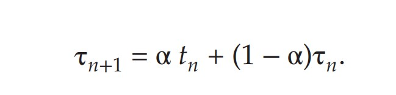
- In above equation P(n) and P(n+1) are grouped as similar process based on maybe size, or type etc.
- It can be premptive and non premptive.
- It may cause starvation if shorter processes keep coming. This problem can be solved using the concept of ageing
- Preemptive SJF scheduling is sometimes called shortest-remainingtime-first scheduling.
#### Shortest Remaining time algorithm
- When a new process is added the algorithm only needs to compare the currently executing process with the new process, ignoring all other processes currently waiting to execute. So little overhead.
-  Short processes are handled very quickly.

### Round Robin Scheduling
- Basically a premptive version of FCFS.
- The performance metrics i.e waiting and turn around time depends heavily on the time quantum after which context switch happens.
- If it is too less more context switch will degrade.
- If too less then it is same as FCFS.

### Priority Scheduling
- Example is SJF
- Priorities can be defined either internally or externally.
  - Internal : time limits, memory requirements, the number of open files, and the ratio of average I/O burst to average CPU burst have been used in computing priorities.
  - External : The importance of the process, the type and amount of funds being paid for computer use.
- A major problem with priority scheduling algorithms is indefinit blocking, or **starvation**.
  - A priority scheduling algorithm can leave some lowpriority processes waiting indefinitely.
  - Solution can be **aging** :  gradually increasing the priority of processes that wait in the system for a long time.
  - Another option is to combine round-robin and priority scheduling in such a way that the system executes the highest-priority process and runs processes with the same priority using round-robin scheduling.

### Multi-Level Scheduling
- Instead of a single queue, it is
often easier to have separate queues for each distinct priority, and priority
scheduling simply schedules the process in the highest-priority queue
- You don't have to search for higher priority task O(n) time.
- each queue might have its own scheduling algorithm. The foreground queue might be scheduled by an RR algorithm, for example, while the background queue is scheduled by an FCFS algorithm.
- A process that arrives for queue 1 will preempt a process in queue 2. A process in queue 1 will in turn be preempted by a process arriving for queue 0.
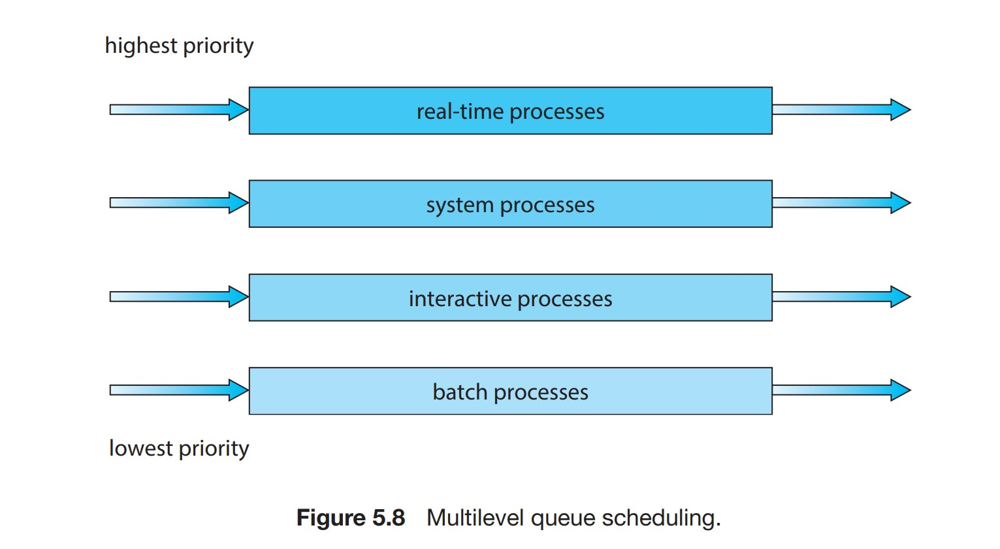
- Each queue has absolute priority over lower-priority queues.
  - No process can run unless the above queue is empty.
  - Or there can be time slicing within queues based on prioirty (80 for foreground, 20 for background).
- Multilevel queue aren't flexible, a process can't change it's queue. So aging can't be implemented to prevent starvation.


### Multi-Level Feedback Queue
- The multilevel feedback queue scheduling algorithm, in contrast, allows a process to move between queues. The idea is to separate processes according to the characteristics of their CPU bursts.
  - If a process uses too much CPU time,
it will be moved to a lower-priority queue. 
  - Aging can be implemented to avoid starvation
- the most general CPU-scheduling algorithm
#### Parameters
- The number of queues
- The scheduling algorithm for each queue
- The method used to determine when to upgrade a process to a higherpriority queue
- The method used to determine when to demote a process to a lowerpriority queue.
- The method used to determine which queue a process will enter when that process needs service.


## Thread Scheduling Schemes

### Process Contention Scope (Scheduling User Thread to LWP)
- For many to many and many to one models, the thread library is responsible for scheduling user level threads onto available LWPs, this doesn't mean the threads are actually running in the CPU as it is the operating system's responsibility to schedule the LWP(Kernel threads) to the actual CPU. This scheme is known as Process Contention Scope.
- It is user thread library that is scheduling these thread.
- It is important to note that PCS will typically preempt the thread currently running in favor of a higher-priority thread.
- Priority is set by the developer.
- The thread competes for resources with all other threads in the same process that were also created with the PTHREAD_SCOPE_PROCESS contention scope

### System Contention Scope
- To decide which LWP/Kernel Thread to run onto CPU, The kernel uses System Contention scope.
- It is the kernel scheduling these threads.
- Systems using the one-to-one model, such as Windows and Linux schedule threads using only SCS.
- The thread competes for resources with all other threads in all processes on the system that are in the same scheduling allocation domain. 

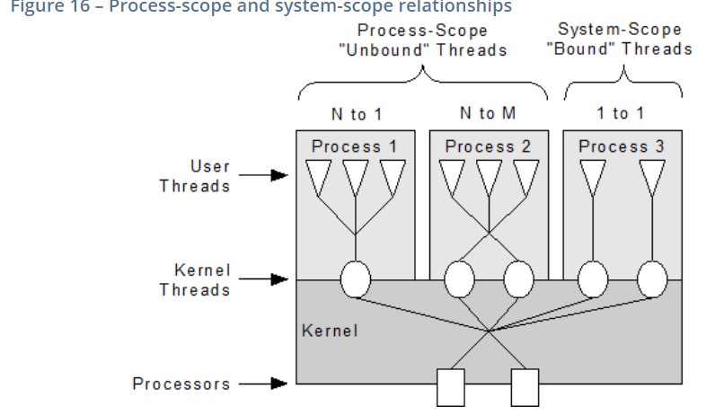

### Pthreads Set Scope
- The pthread_attr_setscope(pthread_attr_t *attr, int scope) function sets the contention scope attribute of the thread attributes object referred to by attr to the value specified in scope.


## Multi-Processor Scheduling
2 approaches to multi-processor scheduling

- Asymmetric : System activities like scheduling, io processing etc handled by one and the rest handle user tasks
  - System data structures are not shared by all CPUs.
  - master server becomes the bottleneck.


- Symmetric Multiprocessing (SMP)
  - Followed the most.
  - There can be 2 stategies for organizing threads.
    - Shared Queue
      - Problems like no datalocality and synchronization issues
      - Load Balancer not required.
    - Each processor with separate queue.
      - Most followed.
      - Load Balancing is necessary to avoided skewed distribution.

## Chip Multithreading/ Hyper threading/ Simultaneous Multithreading

- when a processor accesses memory, it spends a significant amount of time waiting for the data to become available. This situation, known as a memory stall. Because the mordern processors operate at much faster speeds than the memory clocks. Memory Stall can also occur due to cache miss.

- To optimize this useless time, most chips have capability of utilizing hardware level threading, if one hardware thread stall then other one can execute.

- The resources of the physical core (such as caches and pipelines) must be shared among its hardware threads, and therefore a
processing core can only execute one hardware thread at a time.

### Two ways to implement hardware threading

#### Coarse Grained
- Only switches when a long latency event occurs, the core switches to another hardware level thread.
- Cost of switching is high since the instruction pipeline has to be flushed and filled with other thread.

#### Fine Grained
- Issues instructions for different threads after every cycle,
- Fine-grained (or interleaved) multithreading switches between threads at a much finer level of granularity— typically at the boundary of an instruction. Cost of switching is small.

### Scheduling in hyperthreaded cores
- There are now 2 levels of scheduling, on that is made by the operating system, other at CPU Level(Can be FIFO, or priority based).
- **It is important to note that for mordern systems os are aware of hyperthreading and therefore can optimize the scheduling by not scheduling the threads on the same hardware core, i.e onto logical processors that do not share resources.**

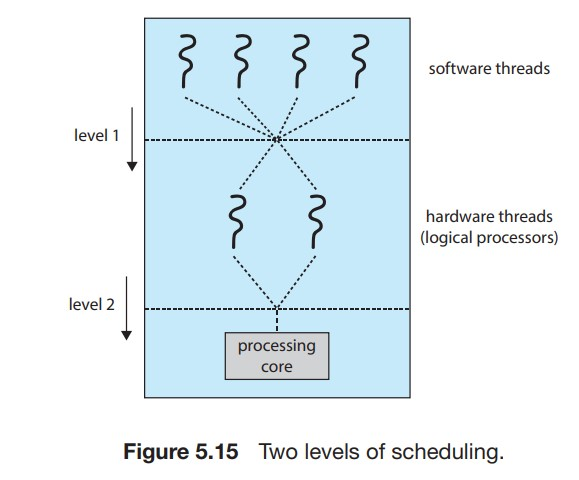

## Load Balancing
- Push Migration : A separate task pushes task to the idle processor from a busy processor
- Pull Migration : An idle processor, pulls the tasks from a busy processor.
- The balanced load, can be number of threads/ priority of each thread etc.

## Processor Affinity/ Data Locality
- The cache of a processor contains the information most required by the thread executed by a particular core.
- If process migration occurs due to load balancing, the cache information is invalidated and has to be moved to another processor, thus incurring an overhead. 
- Thus most os avoid migrating thread to another processor to take advantage of warm cache, this is processor affinity.
- Also use of shared thread queue eliminates advantages of data locality similarly, with private queue, threads are always assigned to same queue so can benifit from warm cache.
-  Load balancing often counteracts the benefits of processor affinity.

### Two types of processor affinity
- Soft affinity : os will attempt to keep thread in same core, but may migrate during load balancing.
- Hard affinity : allow a processor to be only limited to specific CPUs on which they can run.
- Linux is soft by default, but also allows hard using a system call. 

## NUMA
- Non uniform memory access
- harness large numbers of processors in a single system
- Although CPU in NUMA share common address space, the cost to access memory attached to same CPU is less than to different CPU, there also processor affinity kick in.


## Heterogenous Multiprocessing /big.LITTLE architecture.
- Not same as asymmetric multiprocessing, since user task can run on all processor.
- This is particularly useful in mobile systems where battery has to be conserved.
- Use variety of CPU based on their performance.
- For long running, background type task use a slower power efficienct processor.
- For demand and interactive apps use faster power hungry processor.
- In battery saving mode, disable power hungry processor.

## Real Time CPU Scheduling

### Soft real time
- Soft real-time systems provide no guarantee as to when a critical real-time process will be scheduled. They guarantee only that the process will be given preference over noncritical processes.

### Hard real time
- A task must be serviced by its deadline; service after the deadline has expired is the same as no service at all.

### Event Latency
The amount of time that elapses from when an event occurs to when it is serviced.

#### Interrupt Latency
- Period of time from the arrival of an interrupt at the CPU to the start of the routine that services the interrupt.

#### Dispatch Latency
??


### Priority Based Scheduling

#### Admission Control
- For real time systems, the scheduler does one of two
things. It either admits the process, guaranteeing that the process will complete on time, or rejects the request as impossible if it cannot guarantee that the task will be serviced by its deadline.

### Rate Monotonic Scheduling (IMPORTANT)
- The rate-monotonic scheduling algorithm schedules periodic tasks using a static priority policy with preemption.
- each periodic task is assigned a priority inversely based on its period, i.e to assign a higher priority to tasks that require the CPU more often. 
- priorities are fixed.
- ### Rate-monotonic scheduling is considered optimal in that if a set of processes cannot be scheduled by this algorithm, it cannot be scheduled by any other algorithm that assigns static priorities.
- Rate-monotonic scheduling has a limitation:
CPU utilization is bounded, and it is not always possible to maximize CPU resources fully. The worst-case CPU utilization for scheduling N processes is

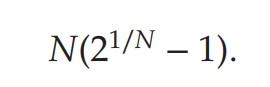

- For more information, see 2 examples on page 232.

### Earliest DeadLine First (IMPORTANT)
- assigns priorities dynamically according to deadline. 
- when a process becomes runnable, it must announce its deadline requirements to the system.
- Priorities may have to be adjusted to reflect the deadline of the newly runnable process, unlike rate monotonic scheduling, where it was fixed.
- Unlike the rate-monotonic algorithm, EDF scheduling does not require that processes be periodic
- Look at the example where EDF was better than RMS, by utilizing dynamic priorities.
- For 2 process P1 & P2, period1=50, timetaken1=25, period2=80,timetaken=35. Using RMS fails but EDF succeeds. since in RMS priority is always P1>P2, but in EDF, priority changes at one point P2>P1.

### Proportional Share Scheduling (IMPORTANT)
- Used in linux
- Proportional share schedulers operate by allocating T shares among all applications. An application can receive N shares of time, thus ensuring that the
application will have N∕T of the total processor time.
- Proportional share schedulers must work in conjunction with an admission-control policy to guarantee that an application receives its allocated
shares of time.

## Linux Scheduler
- Uses Completely Fair Scheduler and Real Time Scheduler.
- Based on scheduling classes, each class is assigned a priority.
- To decide the next task to run, the scheduler selects the highest-priority task belonging to the highest-priority scheduling class.
- Standard Linux kernels implement
two scheduling classes
  - Default CFS
  - Real Time Scheduling

### CFS Scheduler
- The CFS scheduler assigns a proportion of CPU processing time to each task.
- This proportion is based on the task's nice value.(numerically lower nice value indicates a higher relative priority).
- nice value is between -20 to +19.

#### Load balancing
- Supports Load Balancing
- Load is determined as a combination of priority of thread and average rate of CPU Usage.

#### NUMA Aware
- To minimize thread migration, Linux identifies a hierarchical system of scheduling domains.
- ### A scheduling domain is a set of CPU cores that can be balanced against one another.
- In most multicore processors, There is a heirarchy of cache, L1, L2, L3. 
- The cores in each scheduling
domain are grouped according to how they share these caches.
- ### Cores sharing L2 cache are organized into separate domains and the cores sharing L3 cache are organized into processor level domain (also known as NUMA NODE).
- CFS balances loads within domains, beginning at the lowest level of the hierarchy.
 

#### Target Latency 
- CFS doesn’t use discrete values of time slices and instead identifies a targeted latency, which is an interval of time during which every runnable task should run at least once.
- Proportions of CPU time are allocated
from the value of targeted latency. Targeted latency can increase if the number of active tasks in the system grows beyond a certain threshold.

#### Virtual Run Time
- Insteading of using a numerical priority, the CFS maintains a vruntime(virtual runtime) per each task. lower vruntime higher priority. 
- The virtual run time is associated with a decay factor based on the priority of a task, the vruntime is a combination of cpu burst and nice value. So IO bound operation have low vruntime thus higher priority.
- For tasks at normal priority (nice values
of 0), virtual run time is identical to actual physical run time. 
- To decide which task to run next, the scheduler simply selects the task that has
the smallest vruntime value.

#### Red Black Trees in CFS
- Balanced binary tree (Red Black Tree) is used to keep track of which task to run next.
- key is based on the value of vruntime.
- A task in ready queue is added to this tree.
- O(logn) to determine which is next job to run.
- Leftmost i.e next job is cached for efficiency purpose.


### Real Time Scheduling
- Any task scheduled using either the SCHED FIFO or the SCHED RR real-time policy runs at a higher priority than normal 

### Global Priority.

- Linux uses 2 different priority values/nice value ranges, one for real time and one for normal task(CFS)
- Global priority values range from 0 to 139, Realtime task are assigned (0 to 99)
- CSF Task/ normal tasks are assigned 100-139. 100 mapping to nice value of -20 and 139 to 19.

## Windows
- Uses a 32 level priority scheme
- 

# Chapter 6 (Synchronization Tools)

## Non Atomic Operation
- Instructions like count++ and count--, may seem like a single operation, but are infact a combination of operation
- count++, (reg=count,reg=reg+1,count=reg)
- In these cases if another thread is also modifying count's values, inconsistent count values can result due to race conditions.
- Thus these operations require synchronization protection tools like mutexes.

## Atomic Operation
- Indivisible process
- Typically Won't require mutex, but may require if multiple atomic operation are required to be atomic as a whole(like in pub sub).

## Critical Section
- The critical section is a code segment where the shared variables can be accessed
- Any process can context switch any other process, regardless of it being in critical section.

## Critical Section Problem Criteria (IMPORTANT)
- MUTUAL EXCLUSION : If process Pi is executing in its critical section, then no other processes can be executing in their critical sections.
- PROGRESS : If a process is not using the critical section, then it should not stop any other process from accessing it. Only those processes are competing to go to critical section who wants to. 
- BOUNDED WAITING : There exists a bound, or limit, on the number of times that other processes are allowed to enter their critical sections after a process has made a request to enter its critical section and before that request is granted, so the process has to wait a bounded amount of time.

## Peterson Solution
- Useful for 2 process.
- There are 2 shared variables, flag (bool array) and turn (boolean) 
For Process 0
```c++
  flag[0] = T
  turn = 1;
  //Trap
  while(turn!=0 && flag[1]==T);
  //Critical Section
  flag[0] = F
  //Remaining Sectin
```

and 

```c++
  flag[1] = T
  turn = 0;
  //Trap
  while(turn!=1 && flag[0]==T);
  //Critical Section
  flag[1] = F
  //Remaining Sectin
```
- The variable turn indicates whose turn it is to enter its critical section. See it is imporant to notice that once flag is set to T for 0, turn is given to 1.
- This is done to ensure both process won't be trapped at the same time (deadlock), If both processes try to enter at the same
time, turn will be set to both i and j at roughly the same time.
- [See this to be clear](https://www.youtube.com/watch?v=XAsAAJSotA4&list=PLmXKhU9FNesSFvj6gASuWmQd23Ul5omtD&index=74)

### Peterson Solution won't work in modern machines
- Because of instruction reordering optimizations, (If turn is set to 1 before flag[0] is set to True), there is a chance when both the process enter critical section at the same time.
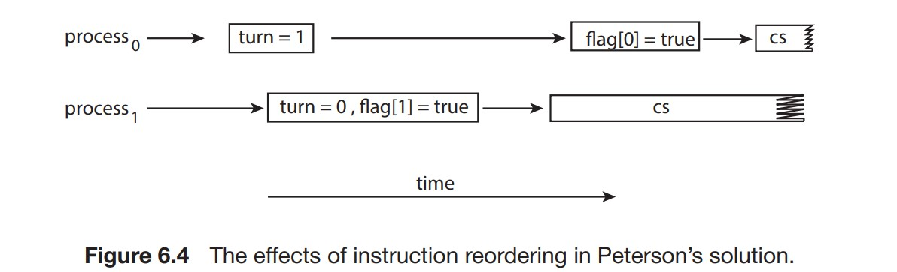

## Hardware Support for Synchronization
- We saw we can't simply use software based solution because of instruction reordering.

### Memory Barriers/ Memory Fences
- How a computer architecture determines what memory guarantees it will provide to an application program is known as its
memory model. Computer architectures
provide instructions that can force any changes in memory to be propagated to
all other processors, thereby ensuring that memory modifications are visible to threads running on other processors. Such instructions are known as memory
barriers.
- ### Similar to volatile/Synchronized visibility guarantee in JAVA

#### Solving Instruction Reordering Issue in case of peterson Solution
- If we introduce a memory barrier between setting of flag and turn value assignment, we can guarantee value of flag is stored before the value of turn, thus preventing instruction reordering.

### Hardware Instructions
- These Instructions are atomic and form building blocks of concepts like atomic variables mutex etc.

#### Test and Set (PESSIMESTIC LOCKING)
- If target is true, it returns true and waits, if target is false(lock is unlocked), then test_and_set returns false and exits the trap.
```c++
//Similar function implemented at hardware level.
bool test_and_set(bool *target){
  bool temp = *target;
  *target = true;
  return temp
}

//Function showing use harware level atomic test_and_set.
void func(){
  while(test_and_set(&lock));
  //critical_section
  lock=false;
}
  ``` 

#### Compare And Swap (OPTIMISTIC LOCKING)
- ### a variable is only updated if it still has the same value as at the time we had fetched the value of the variable from the main memory.
- This operation is used to implement synchronization primitives like semaphores and mutexes.
- This is atomic operation supported by hardware.
- **sets to a new_value if current value is same as expected**.
- Does one more compare operation than test_and_set.
```c++
  int compare_and_swap(int *value, int expected, int new_value){
    int temp = *value;
    if(*value==expected)
      *value = new_value;
    return temp;
  }

  //trap or wait
  while(compare_and_swap(&lock,0,1)!=0);
  //critical_section
  lock=0;
  //remainder section
```

#### Compare and swap in Java
- Instead of using synchronised keyword, we can leverage CPU instruction compareAndSwap to write multithreaded code.
- Write this,
  ```java
  public static class MyLock {
      private AtomicBoolean locked = new AtomicBoolean(false);
      public boolean lock() {
          return locked.compareAndSet(false, true);
      }
  }
  ```
  Instead of
  ```java
    class MyLock {
      private boolean locked = false;
      public synchronized boolean lock() {
          if(!locked) {
              locked = true;
              return true;
          }
          return false;
      }
  }
  ```


### Atomic Variables
- Formed using or compare_and_swap hardware instructions.
- They don't entire solve race conditions in all cases.
- Consider a situation in which
the buffer is currently empty and two consumers are looping while waiting for count > 0. 
- If a producer entered one item in the buffer, both consumers could exit their while loops (as count would no longer be equal to 0) and proceed to
consume, even though the value of count was only set to 1.
- atomic integers are much lighter weight than traditional locks, and are generally more appropriate than mutex locks or semaphores for single updates to shared variables such as counters.
- For simple cases, Don't require overhead of locking, since they use mordern cpu instructions.


## Mutexes (Typically refers to locks which puts to suspended state)
- higher level apis to implement synchronization by application developer.
- Calls to either acquire() or release() must be performed atomically. Thus, mutex locks can be implemented using the compare and swap operation.
- alternative to spin lock.
- no busy waiting.

##  Spin locks/using busy waiting
- Type of locks where there is a while trap to see if mutex is unlocked yet.
- Called **SPIN LOCK** since, Process spins while having to wait for the lock, thus consuming useful CPU time. It requires **busy waiting**.
- Useful for systems where locks are held for short time, since there is no context switch(heavy operation) required when a process must wait on a lock.
- Useful for low contention scenarios
-  use a spinlock if the lock will be
held for a duration of less than two context switches.
  ```c++
  //lock
  void acquire(){
    while(!available);
    available = false;
  }

  //unlock
  void release(){
    available = true;
  }
  ```
- alternative to spin lock is suspending the process and waking it up once the lock is available.


## Lock Contention
- A lock is considered contended
if a thread blocks while trying to acquire the lock.
- If a lock is available when
a thread attempts to acquire it, the lock is considered uncontended.
- highly contended locks(a relatively large number of threads attempting to acquire the lock) tend to decrease overall performance of concurrent applications.

## Semaphores (IMPORTANT)
- Nothing but integer values
- 2 Types
  - Binary Semaphores 
    - Can only take 0 or 1, similar to mutexes/spin locks, but not the same.
  - Counting Semaphores
    - Unbounded

### Defination (default busy waiting)
- wait and signal have to be atomic operation.
#### wait / ENTRY SECTION
- Also known as P, Down.
- S is semaphore
```
void wait(S){
  //trap
  while(S<=0);
  S--;
}
```

#### Signal / EXIT SECTION 
- Also known as V, Up, Post, Release.
```
void signal(S){
  S++;
}
```

### Defination (suspended sleep)
- Since the busy waiting takes cpu cycles in wait trap. We try to define a semaphore where threads/processes are put into sleep state and are woken up by the threads exiting from the critical section. The process is then placed in the ready queue.
- To implement semaphores under this definition, we define a semaphore as follows:
  ```c++
    typedef struct {
      int value;
      struct process *list;
    } semaphore;
  ```
- It is a combination of integer value and a list(of process waiting for this semaphore).
- Here value of S can be negative.
- Negative value of S signifies the number of Processes in suspended state.
- SMP systems must provide techniques—such as compare and swap() or spinlocks — to ensure that wait() and signal() are performed atomically.
#### wait/ Entry Section 
- If block says:
  - You go inside if block if critical section is full, and can't have any more process go inside them.
  - Notice there is no equal to here.

```c++
wait(semaphore* S){
  S->value--;
  if(S->value<0){
    S->list->push(P1);
    sleep();
  }
}
```


#### signal/Exit section 

- If block says:
  - If processes are in suspended list, wake them up. 
  - There will only be processes in suspended list if S<=0 . 
  - (notice equal to) Equal to one because you are incrementing S by 1 (so before increment operation, the value of S was negative i.e processes in suspended list).

```c++
signal(S){
  S->value++;
  if(S->value<=0){
    P = S->list->pop();
    wakeup(P);
  }
}
```
- When process wakes up they go to critical section.  They don't again ```wait()```.
### Applications
#### Solve critical Section problem
- Using binary semaphores i.e S=1.

#### As a Conditional Variable.
- Say if you want S1 statement to only execute after S2 statement.
- You can use sempahores, by making semaphore = 0.
```
\\\process 1
S2
signal(semaphore)

\\\process 2
wait(semaphore)
S1
```
- For ordering multiple processes, you can use multiple semaphores.

#### Resource Management
- Say if your browser(chrome), should only have max 6 tcp connections in a single tab. You can set semaphore = 6, such that each request to tcp will call signal(semaphore), which decrements its value after checking for trap. This way only 6 connections are possible.

## Condition Variables
- a way to wait for another thread to do something (e.g., wait for a item to be added to the queue for processing).
- ## Each condition variable is tied to a lock. The thread calling signal/wait must be in the possession of the lock. look at the defination of wait and signal below, it is tied to lock.
- Just like semaphores, each condition variable has an associated queue.
- Condition Variables have 3 methods, wait, signal and signalAll/broadcast.

### wait
- ### wait(condition, lock): release lock. .
- thread is put in a wait set/queue for the condition.
- put thread to sleep until condition is signaled; 
- ### when thread wakes up again, re-acquire lock before returning.

### signal
- signal(condition, lock): if any threads are waiting on condition, wake up one of them.
- ### Caller must hold the lock, which must be the same that was used in the wait call.
- ### after signal, signaling thread keeps lock, waking thread goes on the queue waiting for the lock.
- In java there are 2 queues, wait queue and entry queue(calling signal/notify remove the thread from wait queue and puts it in entry queue(queue waiting to acquire lock)).

### Broadcast
-  same as signal but, wakes up all waiting threads.

### Important Point
- ## when a thread wakes up after cond_wait there is no guarantee that the desired condition still exists: another thread might have snuck in. 
- ## Since on signal, the waiting thread is put into ready queue of scheduler(not in CPU directly), and another process may be ahead in ready queue, which can change the condition. So you must do a while on the condition.
```c++

// Example : Infinite Queue Pub Sub
Lock lock;
Condition cv;
Queue q;

void producer(){
  lock.acquire();
  q.push(item);
  cv.signal(&lock);
  //after signal, lock is still with producer, so relase is necessary.
  lock.release();
}

void consumer(){
  lock.acquire();
  //Notice the while.
  while(q.isEmpty()){
    //it releases the lock on wait.
    cv.wait(&lock)
    //acquires it after wait.
  }
  item. = q.pop();
  lock.release();
}


```


## Mutex vs Binary semaphores
- They are not the same. a mutex is a locking mechanism, Semaphore is signaling mechanism.
- mutex locks are simpler and require less overhead than semaphores .
- A mutex can be released only by the thread that had acquired it. That is mutex has a principle of ownership.
- A binary semaphore can be signaled by any thread (or process).
- so semaphores are more suitable for some synchronization problems like producer-consumer. You can also use mutex with condition variable for this purpose.

## Mutex vs Spinlocks
- spinlocks -> busy waiting. (Useful if mutex is locked for very short time).
- mutex -> puts in wait queue. (Useful if time mutex is locked is very long compared to overhead of context switch, in that case spinlocks will waste cpu cycles).

## Hybrid mutex/critical section object (Windows)
- A hybrid mutex behaves like a spinlock at first on a multi-core system. If a thread cannot lock the mutex, it won't be put to sleep immediately, since the mutex might get unlocked pretty soon, so instead the mutex will first behave exactly like a spinlock. Only if the lock has still not been obtained after a certain amount of time (or retries or any other measuring factor), the thread is really put to sleep. If the same code runs on a system with only a single core, the mutex will not spinlock, though

## Monitors
- Just like synchronised block in java.
- The monitor construct ensures that only one process at a time is active within the monitor. Just like calling sychronised on the class's methods means no other thread can access other methods of the same instance of this class.
- In most implementations monitors along with mutex functionality, also have functionality to signal or wait on a condition variable.
- In the Java virtual machine, every object and class is logically associated with a monitor.


## Liveliness
- Liveness refers to a set of properties that a system must satisfy to ensure that processes make progress during their execution life cycle.

### Challenges to Liveliness

#### Deadlock
- Discussed Later

#### Priority Inversion
- Say if 3 processes have priority L<M<H.
- Say H requires a lock currently held by L. Ideally H will wait till L releases lock, but say M having higher priority process than L is currently executing. As a result, a lower priority process(M) is indirectly able to stop higher priority thread(H) from executing.
- **This can be avoided by priority inheritance, say if L is hold resource needed by H, L's priority is increased to H, till the resource is released.**

## Evaluation

### CAS Based (OPTIMISTIC LOCKING vs Traditional Pessimestic Locking)
- There has been a recent focus
on using the CAS instruction to construct lock-free algorithms that provide protection from race conditions without requiring the overhead of locking.
- CAS(Compare and swap) based approaches are considered an optimistic approach—you  optimistically first update a variable and then use collision detection to see if another thread is updating the variable concurrently.
- Mutual exclusion locking(MUTEX and Semaphores), in contrast, is considered a pessimistic strategy; you assume another thread is concurrently updating the variable, so you pessimistically acquire the lock before making any updates.
- CAS based are good for low and moderate contention loads, while mutex are good for heavy contention loads.

# Chapter 7

## Classical Problems

### The bounded buffer problem

### The reader writer problem

### The dining philosopher's problem

## Synchronization in Kernel


## Java Synchronization
- Refer Java Multithreading notes

## Latest Research in Synchronization

### Transactional Memory
- Similar to database transaction, either a set of instructions (read and write) go throw or it doesn't, i.e the set of instructions are atomic.
- transactional memory system—not the developer—is responsible for guaranteeing atomicity
- Can be implemented using hardware support.
- Software transactional memory is also possible but require the same low level locks.

### Functional Languages
- They don't act on state like imperative languages, i.e they deal with immutable values, so they don't need to be concerned with race conditions and dead locks.


# Chapter 8

## Deadlock
- Sometimes, a waiting thread can never again change state, because the resources it has requested are held by other waiting threads. This situation is called a deadlock.

## Livelock
- Livelock is another form of liveness failure.
- Whereas deadlock occurs when every thread in a set is blocked waiting for an event that can be caused only by another thread in the set, livelock occurs when a thread continuously attempts an action that fails. 
- Like a try-lock example where a process tries to acquire a set resource and if can't acquire all locks it will release all acquired locks, but if both the process tries to acquire locks together at the same time, they will stuck in infinite loop acquiring and releasing locks, this example livelock can be avoided by waiting a random amount of time before trying to acquire the next set of locks.
- This is precisely the approach taken by Ethernet networks when a network collision occurs. Rather than trying to retransmit a packet immediately after a collision occurs, a host involved in a collision will backoff a random period of time before attempting to transmit again.

## Conditions for deadlock (all are necessary)
### Mutual exclusion.
At least one resource must be held in a nonsharable mode; that is, only one thread at a time can use the resource. 
### Hold and wait
A thread must be holding at least one resource and waiting to acquire additional resources that are currently being held by other threads.

### No preemption.
Resources cannot be preempted; that is, a resource can be released only voluntarily by the thread holding it, after that thread has completed its task.

### Circular wait
T0 waiting for T1 waiting for T2....Tn waiting for T0.

## Resource allocation graph (Find if deadlock exists)
- if a resource-allocation graph does not have a cycle, then the system is not in a deadlocked state. 
- If there is a cycle, then the system may or may not be in a deadlocked state. If each resource type has exactly one instance, then a cycle implies that a deadlock has occurred. If each resource type has several instances, then a cycle does not necessarily imply that a deadlock has occurred. 

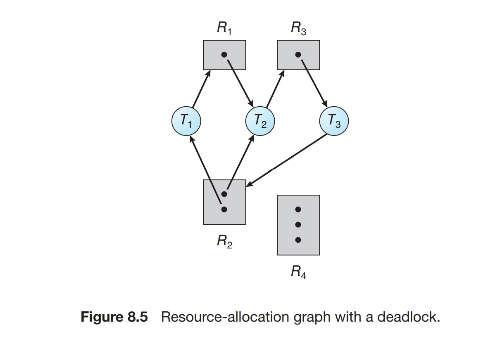

## Handle Deadlock

- Ignore the deadlock: Linux and Windows Kernel (More performant)
- Avoid the deadlock : developers have to ensure
- Detect and recover : Databases

## Deadlock Prevention
- Make sure atleast one of the condition for deadlock doesn't hold.  By ensuring that at least one of these conditions
cannot hold, we can prevent the occurrence of a deadlock.

### Mutual Exclution
Remove the dependency of any non sharable data(sharable data : readonly files which don't require mutex).

### Hold and wait
- To ensure that the hold-and-wait condition never occurs in the system, we must guarantee that, whenever a thread requests a resource, it does not hold any other resources.
- This would either require thread to get all resources at once before execution, or before acquiring a new resource release all the ones it has.
- Both these have disadvantage 
  - Can lead to starvation because popular resources are always in use.
  - Can lead to resource underutilization

### No premption
- Kind of like using trylock for deadlock handling
- If a thread is not able to get the resource it is requesting, it should prempt the resource it is already holding if some other thread is asking for it and wait till all the resources are available including the new resource.

### Circular Condiiton
- Practical unlike the rest.
- Requires all the threads to acquire the resources in the same order.
-  Java developers have adopted the strategy of using the method ```System.identityHashCode(Object)``` for 
 ordering lock acquisition. It returns an integer. Here unlike hashCode identity of the object matters, not just the value.


## Deadlock Avoidance Algorithms
- OS needs to have additional information about the resources a thread may need and use this information to decide for each request if a thread should wait or not. 
- Each request requires that in making this decision the system consider the resources currently available, the resources currently allocated to each thread, and the future requests and releases of each thread.

### Safe State
- A state is safe if the system can allocate resources to each thread (up to its maximum) in some order and still avoid a deadlock.
- Not all unsafe states are deadlocks 

### Resource-Allocation-Graph Algorithm
- If we have a resource-allocation system with only one instance of each resource type, we can use a variant of the resource-allocation graph.
- Basically a O(n^2) cycle detection algorithm.
- The resource-allocation-graph algorithm is not applicable to a resource allocation system with multiple instances of each resource type.
-  we introduce a new type of edge, called a claim edge. A claim edge Ti → Rj indicates that thread Ti may request resource Rj at some time in the future.
- When thread Ti requests resource Rj , the claim edge Ti → Rj is converted to a request edge. 
-  The request can be granted only if converting the request edge Ti → Rj to an assignment edge Rj → Ti does not result in the formation of a cycle in the resource-allocation graph.
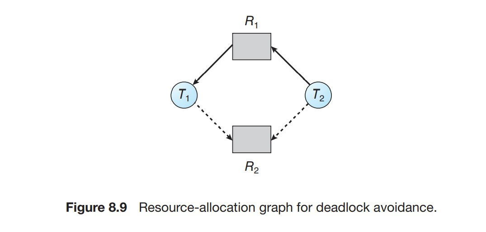

### Banker's Algorithm
- The resource-allocation-graph algorithm is not applicable to a resourceallocation system with multiple instances of each resource type. But Banker's algorithm is applicable to such systems, it is less efficient though O(m*n^2) m is total threads, and n is total type of resources.
- There are 2 algorithms here, one to determine if a system is in safe state(based on the currently allocated resources, the max number of resources a thread might need in future and currently available resources).
- Second to determine, if a request to set of resources can be granted, for this we try to check if it is even possible to allocate based on number of number of available resources and check if after allocating resources the system might be in safe state or not. If it is going to be in safe state, resources are allocated, else they are not.

## Detecting Deadlocks

### Wait Graph
- Mostly used in Java(In DUMPs) and databases like MySQL
- Useful only in situations, where only a single instance of each resource kind exist.
- Similar to resource allocation graph, edges signifies whether a Thread i is waiting for Thread j to release a resources.
- If there is a cycle in the resource allocation graph, then there exists a deadlock.
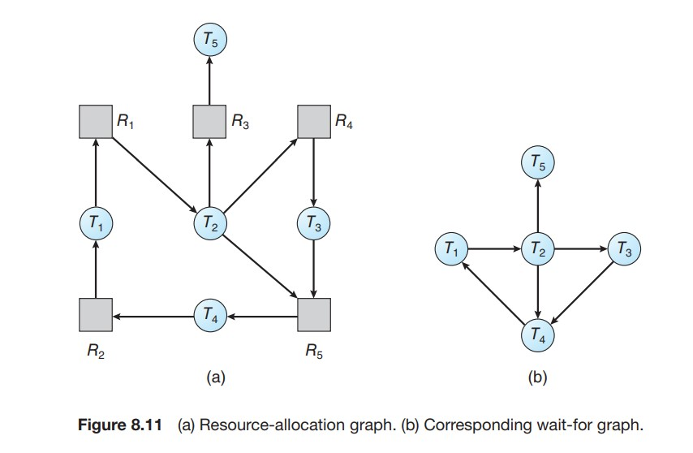

## Variant of Banker's Algoritm
- Useful in case of multiple instances of each resource type.
- Similar to the safe state detection.

## Deadlock Recovery

### Kill the process/ thread causing deadlock (to break the circular wait)

#### Abort all deadlocked processs/threads
- partial computations would be discarded.

#### Abort process one at a time, till deadlock is eliminated
- High overhead, since we need to check if deadlock is there or not after each kill

### Resource Premption
- we successively preempt some resources from processes and give these resources to other processes until the deadlock cycle is broken.
- This has challenges like which victim to prempt resources from, and since the process can't continue normal execution how can we roll back etc.


# Chapter 9

## Relocatable Code
- Relocatable code is software whose execution address can be changed. A relocatable program might run at address 0 in one instance, and at 10000 in another. It has to be binded into physically address before execution.

## Address Binding

- Classically, the binding of instructions and data to memory addresses can
be done at any step along the way:
### Compile Time Binding
- Useful in Embedded Systems
- If you know at compile time where the process will reside in memory, then absolute code can be generated.
- If, at some later time, the starting location changes, then it will be necessary to recompile this code.

### Load Time Binding
- If it is not known at compile time where the process will reside in memory, then the compiler must generate relocatable code.
- In this case, final binding is delayed until load time.
- If starting address changes, you only need to load the program again.(No need to compile)

### Execution Time Binding
- In this binding the logical and physical address differs.
- In this binding, the CPU will only see the logical address i.e the relocatable code. It will be the responsibility of the MMU to resolve it to physical address at run-time.
- Most modern os follow this binding.
- Mapping can be done using simple logic in which base/relocation register's value is added to all logical address to get physical address
  - This requires the physical memory to be allocated in contiguos fashion
  - Also causes fragmentation
- Another more popular way to map is Paging.

## Dynamic Loading
- A routine is not loaded by an executable unless it is called, all routines are stored in disk in relocatable load format.
- When a routine is called, the relocatable linker loader is called to load the desired routine in memory and update the program's address table.
- Dynamic loading does not require special support from the operating system. 
- it's the program's job to open that library.

## Dynamic Linking and Shared Libraries (.so and .dll)
- Dynamic linking, in contrast, is similar to dynamic loading. Here, though, linking, rather than loading, is postponed until execution time.
- Unlike dynamic loading, dynamic linking and shared libraries generally require help from the operating system.
- When your program starts it's the system's job to open these libraries, which can be listed using the ldd command.
### Advantages
- Helps to reduce the size of the executable and also in turn the main memory.
- These can be shared by various processes, so if it is already in memory, it doesn't need to be loaded again.
- Any change in dll, doesn't require the executable to be compiled again.

## Contiguous Memory Allocation
-  In contiguous memory allocation, each process is contained in a single section of memory

### Protect Processes from each other in case of Contiguous Memory Allocation
- We first need to make sure that each process has a separate memory space.
- To separate memory spaces, we need the ability to determine the
range of legal addresses that the process may access and to ensure that the process can access only these legal addresses.

#### Base(Relocation) and Limit Registers
- We can provide this protection by using two registers, usually a base and a limit.
- The base register holds the smallest legal physical memory address.
- the limit register specifies the size of the range.
- Any attempt by a program executing in user mode to access memory address that doesn't fall in this limit causes a fatal error.
- only the operating system can load the base and limit registers, it operates on kernel mode.
- On a context switch the os stores the register contents of the currently executing process in memory and loads the register contents of the new process from the memory.

### Memory Allocation in Contiguous Memory
- first-fit 
  - Allocate the first hole that is big enough.
- best-fit 
  - Allocate the smallest hole that is big enough.
  - Need to search the entire list of free holes
- worst-fit 
  - Allocate the largest hole
  - Need to search the entire list of free holes

Both first fit and best fit are better than worst fit in terms of decreasing time and storage utilization.
### Wait queue for memory allocation
- When there isn't enough memory, processes can be put into wait queue.
- When memory is later released, the operating system checks the wait queue to determine if it will satisfy the memory demands of a waiting process.

### Fragmentation in Contiguous Memory Allocations
#### Internal Fragmentation
- unused memory that is internal to a partition.
- Say, a hole is 1002Bytes, and your process is 1001 Bytes, so the overhead of tracking this one byte is way more than one byte, in this case the entire 1002 is allocated thus leading to fragmentation of 1Byte.
- Paging also suffers from this.

#### External Fragmentation
- External fragmentation exists when there is enough total memory space to satisfy a request but the available spaces are not contiguous.
- Solution to solve this is Paging or run compaction on regular intervals.
- It is a general problem that occurs when we have to manage blocks of data, be it in RAM or Harddisk or SSD.

## Paging (Non Contiguous Memory Allocation)
- Permits a process’s physical address space to be noncontiguous.

### Working
- breaking physical memory into fixed-sized blocks called **frames**, and breaking logical memory into blocks of the **same size** called **pages**.
- ### It is important to note Pages are the same size as frames
- The page number is used as an index into a per-process page table.
- The page table contains the mapping of base address of each frame in physical memory to the corresponding page in logical memory.
- Logical address has 2 parts the Virtual Page Number and the offset. Similarly physical address has Physical Frame Number and the same offset.
- the offset is the location in the frame/page being referenced, i.e amount of bytes after the frame.
- #### offset does not change on translation since the size of frame == size of pages.
- Thus, the base address of the frame is combined with the page offset to define the physical memory address.
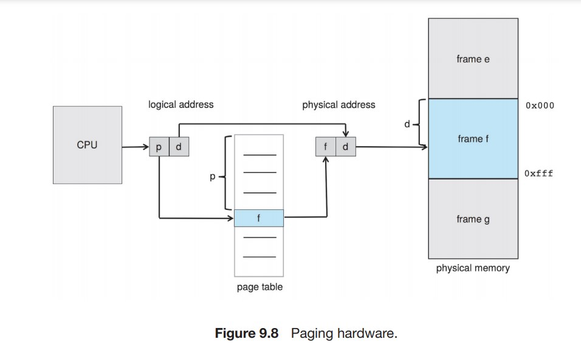


### Page Size
- Typically power of 2, varying between 4 KB to 1 GB
- The selection of a power of 2 as a page size makes the translation of a logical address into a page number and page offset particularly easy.
- If the size of the logical address space is 2^m, and a
page size is 2^n bytes.
  - Total number of pages are (2^(m-n)) so total bits to represent frame number or page number is m-n.
  - And n bits are required to represent the offset (since offset can go from 0 to size_of_page -1).

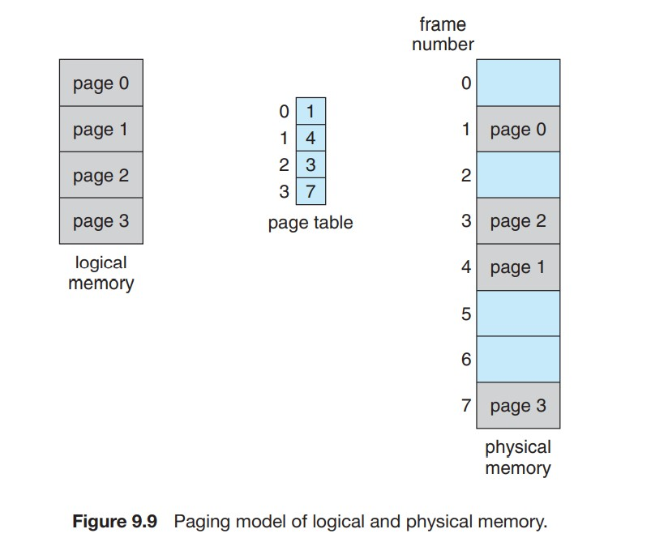
- Small pages reduces internal fragmentation, but have overhead in the number of entries in page table.
- Large pages have high internal fragmentation, but the page table overhead is low, also disk I/O is efficient when amount of data being transferred is large. Good for Databases.
- Some CPUs and OS support multiple page sizes.

- ```getconf PAGESIZE``` to get the page table size in linux.


### Frame table
- The operating system is managing physical memory, it must be aware of the allocation details of physical memory—which frames are allocated, which frames are available, how many total frames there are, and so on. This information is generally kept in a single, system-wide data structure called a frame table.
- The frame table has one entry for each physical page frame

### Advantages of Paging
- Paging avoids external fragmentation and the associated need for compaction. (we may have some internal fragmentation. Notice that frames are allocated as units.)
- a process can have a logical 64-bit address space even though the system has less than 2^64 bytes of physical memory.
- Allows to share pages.

### Paging and Context Switch
- The operating system maintains a copy of the page table for each process, just as it maintains a copy of the instruction counter and register contents.
-  It is also used by the CPU dispatcher to define the hardware page table when a process is to be allocated the CPU. Paging therefore increases the context-switch time.


### Protection in Paging
- Page table has bits for memory protection.
- These bits define if the given page is a read only/read-write.
- In case page table has entire physical address space, an additional bit(valid bit) is kept to see if the current page is infact a part of process's logical address page and is legal to access. 
- Some systems provide hardware, in the form of a page-table length register (PTLR), to indicate the size of the page table. This value is checked against every logical address to verify that the address is in the valid range for the process. This concept is similar to base and limit register.

### Shared Pages
- Pages containing the same information and is reentrant(non self modifying) can be shared across multiple process, like there can only be one libc copy in memory and the same copy can be shared across multiple processes by having different page table mappings for each processes.
- compilers, window systems, database systems, and so on can also be shared.
- Some operating systems implement shared memory using shared pages.


## Hardware Support for Paging

### Hardware support for page tables

#### dedicated hardware registers
- It is useful when the size of page table is small. Since access time is really fast
- But this approach increases context switch times.

#### PAGE TABLE BASE REGISTER : In memory page tables
- most cpus support large page tables, which is not possible using hardware registers
- Instead, the page table is kept in memory and a pointer to page table, i.e a page table base register points to the page table location in memory.
- this pointer is stored in the process control block of each process.
- Context switch times are considerably high, and also TLB reduces the time for address resolution.

### Translation Look Aside Buffer
- #### By keeping page table in memory, we increase the time required to access the memory 2 times, (one to fetch the page table entry and then final physical address).
- To reduce this time we can use a hardware cache TLB. (Can be LRU Cache).
- a TLB lookup in modern hardware is part of the instruction pipeline, essentially adding no performance penalty.
-  Some CPUs implement separate instruction and data address TLBs. And also multi-layer TLB (just like multi-layer cache).
-  Some kernel entries can be **wired down** in TLB, meaning they can't be removed.

#### ASIDs : Protection in TLB (IMPORTANT)
- Apart from just containing mapping between logical and physical address, TLB has additional data (address-space identifier) regarding what the current entry's process is. 
- When the TLB attempts to resolve virtual page numbers, it ensures that the ASID for the currently running process matches the ASID associated with the virtual page. 
- If TLB doesn't support ASID, then the entire TLB would have to be flushed on context switch.

## Types of Page Tables

### Hierarchical Page Tables
- A simple page table would be too large for address space in range (2^32 to 2^64)
- For 32 bit architecture, page size : 4KB(2^12), total page size entries are (2^(32-12) = 2^20). Assuming each page table entry is 4 bytes, This means we need 4MB of physical memory just to store page table for each process.
- One solution is to use 2 level paging table, in which page table is also paged in itself. 
- A logical address is divided into a virtual page number (20 Bits) and an offset, by paging the page table we end up with two 10 Bit page number(one for outer page table, one for inner) and an offset.
- Because address translation works from the outer page table inward, this scheme is also known as a forward-mapped page table.
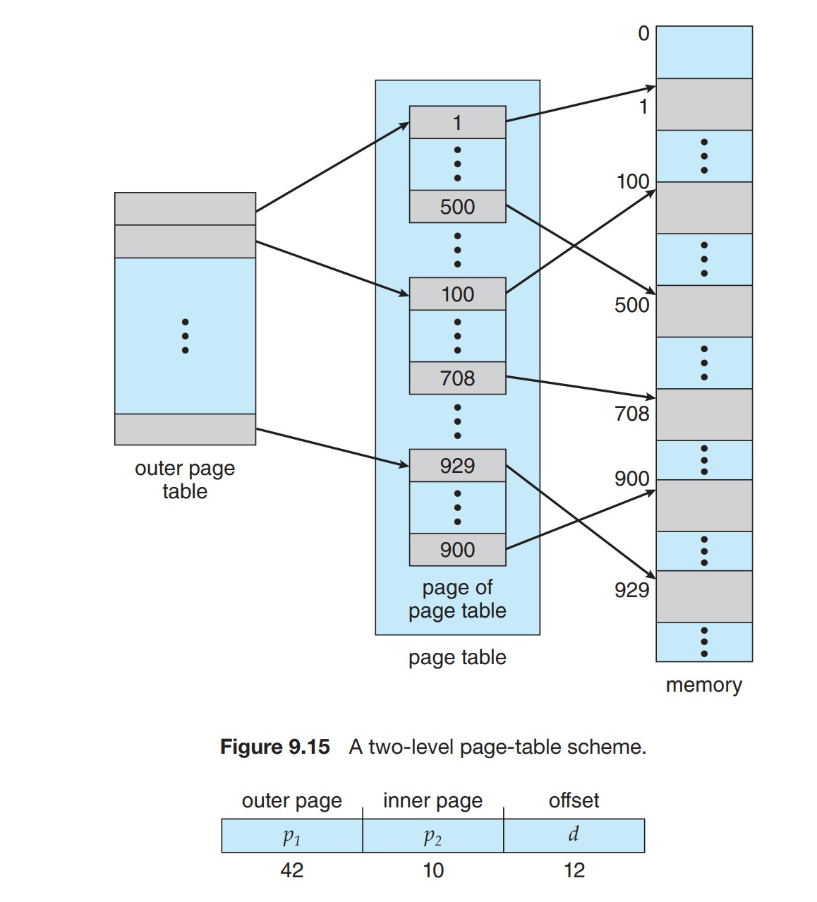

- For a system with a 64-bit logical address space, a two-level paging scheme is no longer appropriate. In such cases 7 level page table might be required which increases memory access time(Thus heirarchical page tables are not very suitable for 64Bit Architecture).

### Hashed Page Tables
- For address spaces larger than 32 bit, we can use hashed page tables.
- The logical address is hashed to a key in the hash table, where every key corresponds to a linkedlist of values(to handle collision).
- Each element in linked list has the following values, the virtual page number(p), the page frame number(r) and the pointer to the next element in linkedlist.
- If there is no match, subsequent entries in the linked list are searched for a matching virtual page number

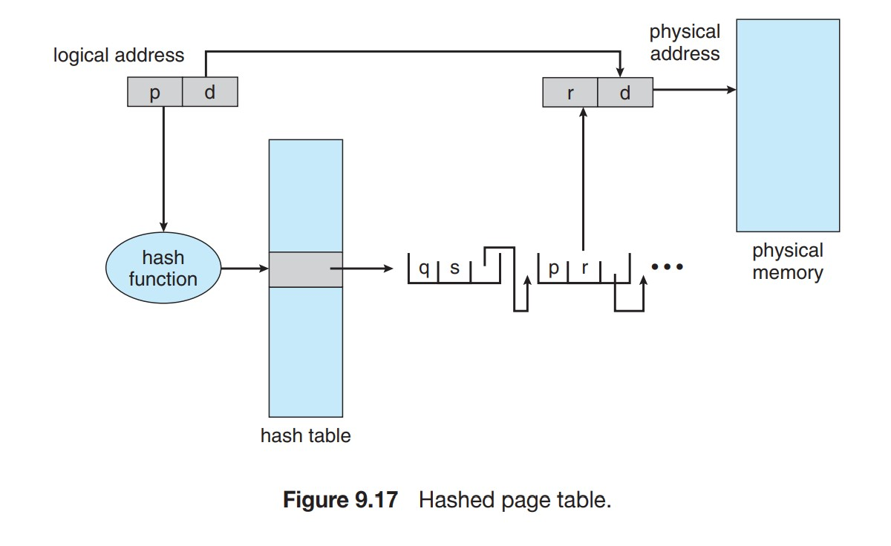

#### Clustered Page Tables
- Similar to hashed page tables, but each entry in linked list refers to several page frames.
- Useful in sparse address spaces


### Inverted Page Tables
- An inverted page table has one entry for each real page (or frame) of memory.
- only one page table is in the system, and it has only one entry for each page of physical memory.
- Each entry in the singleton page table has page frame number, virtual page number and also process identifier (which acts as a Address space identifier for security, since there is one page table for system, not one for process).
- This method decreases the amount of memory required to store page table, but increases the time to search for an entry, worst case entire page table might have to be searched before we find an entry(linear).
- We can use hashtable to limit the search to one or few(collision handling). However this approach requires 2 memory access, one for hash-table entry and one for page table.
- Also we can utilize features like shared memory, because one physical page cannot have 2 virtual address.

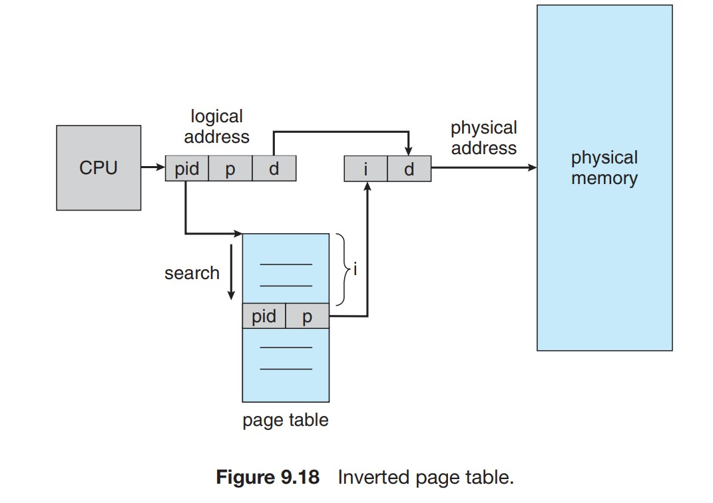

## Swapping
- Swapping makes it possible for the total physical address space of all processes to exceed the real physical memory of the system, thus increasing the degree of multiprogramming in a system.

### Standard Swapping
- Moving entire process between main memory and a backing store(swap space).
- All per-thread data structures must be swapped as well and heap too.
- If a process is idle for long, it can be swapped.

### Swapping with Paging (Demand Paging?)
- It takes a lot of time to perform standard swapping.
- Most modern systems swap individual pages in and out of memory rather than entire processes.
- A page out operation moves a page from memory to the backing store; the reverse process is known as a page in.

### Swapping in mobile systems
- Mobile systems don't support swapping, because of space constraint and limited number of writes in flash memory.
- If memory becomes too low, the os will ask process to voluntarily free up read-only data(such as code, since it can be read back from flash memory). Modified data like stack aren't removed. 
- If any app fails to free up memory, it may be terminated.


## Segmentation and Paging in Intel Architecture
- In Intel memory management unit is divided into 2 components segmentation and paging.
- Logical address from CPU is fed to segmentation unit, which generated linear address, which inturn is fed to paging unit to be converted into physical address.

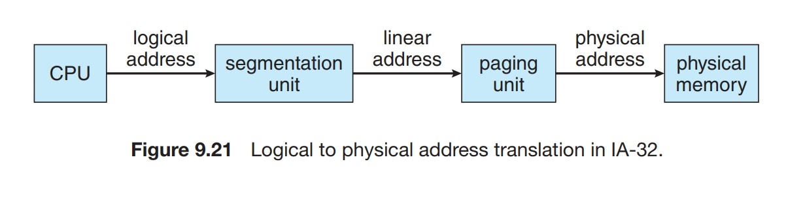

### Segmentation in IA-32
- Segmentation is a memory management technique in which each job is divided into several segments of different sizes, one for each module.
- The logical address has 2 parts (each of 8K segments).
- Information about First part is stored in  Local Descriptor Table and second in Global Descriptor Table.
- Each entry in descriptor table has information about particular segment and base location of that segments which is used to generate the linear address and check for validation using limit location.

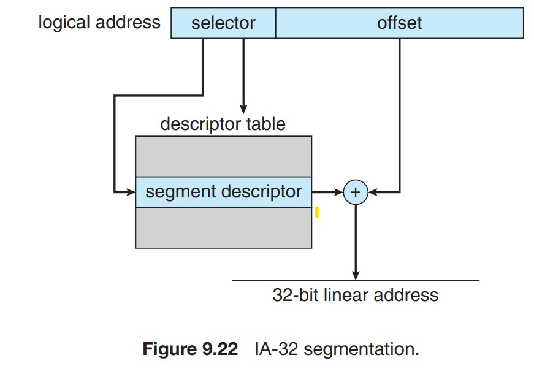

### Paging in Intel
- Using page tables (2 layer in 32 bit) and 4 layer in 64 bit.
- The x86-64 architecture currently provides a 48-bit virtual address with support for page sizes of 4 KB, 2 MB, or 1 GB using four levels of paging hierarchy.
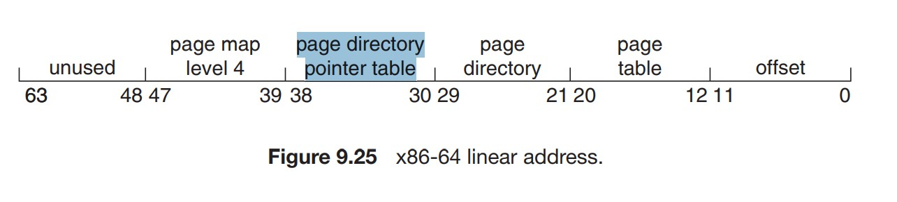

- ARM also uses 4 layer of page tables.

# Chapter 10

## Advantages of virtual memory
- Virtual memory is a technique that allows the execution of processes that are not completely in memory.
  - Not all parts of code is necessary, like error condition handling etc.
  - Even if needed, they may not be needed at same time.
-  Users would be able to write programs for an extremely large virtual address space, simplifying the programming task.
- Virtual memory also allows processes to share files and libraries, and to implement shared memory.
  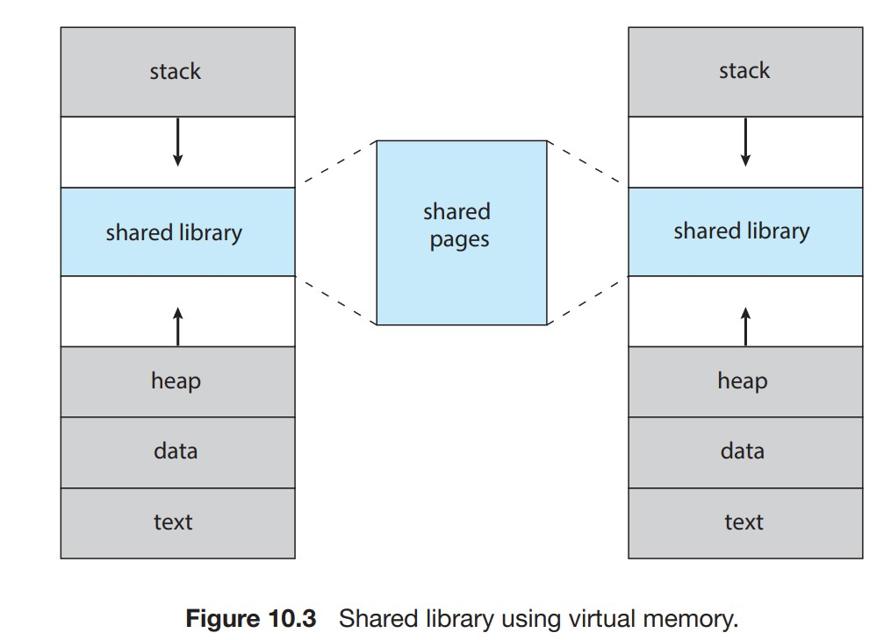
- Because each program could take less physical memory, more programs could be run at the same time.

## Virtual Address Space of a process
- Logical view of how process is stored in memory.
- It is contiguous memory.
- we allow the heap to grow upward in memory as it is used for dynamic memory allocation. Similarly, we allow for the stack to grow downward in memory through successive function calls. 
- The large blank space (or hole) between the heap and the stack is part of the virtual address space but will require actual physical pages only if the heap or stack grows.

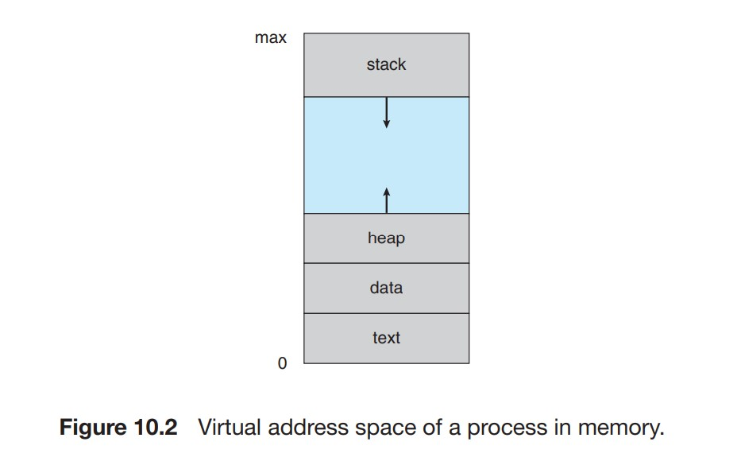
- A detailed view is in notes for Chapter - 2 

## Demand Paging
- Pages are loaded only when they are demanded during program execution.
- Pages that are never accessed are thus never loaded into physical memory.

### Valid-Invalid Bit in Page Table
- This bit is used to identify if the requested page is in memory or in disk.
- #### The valid-invalid bit serves 2 purposes, it is used to denote if a page is legal or not i.e not in the address space of process, and also it is used if the page is not currently in memory.
- Access to a page marked invalid causes a page fault, a trap is raised which then has to be handled by os.
- It is the duty of os to check if the access was legal or not using an internal table (usually kept with the process control block). If not legal terminate the application.
- If legal fetch the page from disk.

### Free Frame List
- To resolve page faults, most operating systems maintain a free-frame list, a pool of free frames for satisfying allocation request for the page in disk.
- Free frames must also be allocated when the stack or heap segments from a process expand.
- When a system starts up, all available memory is placed on the free-frame list and the list shrinks as memory is allocated through say, demand paging.
- Once the list becomes empty or reaches a threshold, it has to be repopulated by analysing free frames in memory and zeroing them out.

#### Zero-Fill-On-Demand 
- Zero-fillon-demand frames are “zeroed-out” before being allocated, thus erasing their
previous contents.
- This is necessary for security reasons.

### Steps in handling page fault.

- Page fault causes trap to the operating system.
- Save the register and process state(PCB). 
- Determine the interrupt was a page fault.
- Check if the reference was legal (using an internal table usually kept with the process control block) or not, if illegal terminate the process.
- If legal, determine the location of the frame in secondary storage.
- Issue a read operation from the disk for the free frame
  - Wait in wait-queue until read IO is complete.
  - This includes device seeks and latency time between memory and secondary storage.
  - Begin transfer of page to a free physical frame.
- Scheduler might allocate CPU core to some other process while waiting for above IO.
- Once IO is complete, find the free frame
  - If there is a free frame, and the threshold of buffer is still not triggered use it and go to next step.
  - If using free frame triggers the threshold(of minimum number of pages in free frame buffer), complete the frame request, then parallely choose a victim frame using any of the page replacement algorithm.
  - Write victim frame to the secondary storage(if needed or keep it in modify list) and zero out the values, update the page tables accordingly. 
- Once the free frame is assigned and filled, an interrupt is raised, which os handles by updating the page table and other tables to show the requested frame is not in memory.
- Move the original process(where page fault occured) from wait queue to ready queue and wait till CPU core is assigned to the original process again.
- Restore the registers, process state, and new page table, and then resume the interrupted instruction.
 

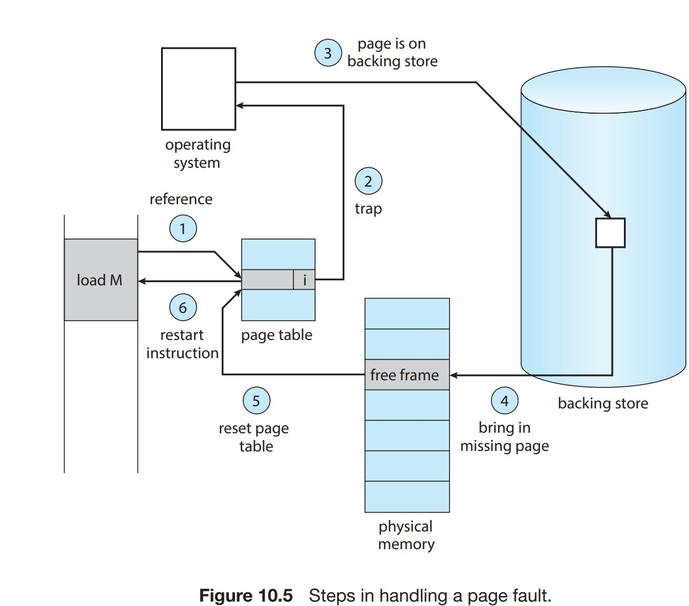

### Pure Demand Paging
- pure demand paging: never bring a page into memory until it is required.
- we can start executing a process with no pages in memory.

### Hardware support for Demand Paging
- Page Table
- Secondary Memory 
  - It is known as the swap device, and the section of storage used for this purpose is known as swap space. It is not in file system and is usually faster to read and write than file system.

### Restart after Page Fault.
- A crucial requirement for demand paging is the ability to restart any instruction after a page fault.
- This is achieved by saving the state (registers, condition code, instruction counter) of the interrupted process.
- If page fault occurs in instruction fetch(from memory), we can restart by fetching the instrution again from memory (this time it will be there i.e after page fault interrupt resumes).
- If page fault occurs while fetching operand, we have to fetch and decode the instruction again from memory and then fetch the operand. This case isn't a big concern though.
#### Idempotency in restart.
- Major difficulty arises when an instruction modifies several different location, like a move instruction from source to destination. If source or destination straddles in page boundary, page fault will occur. And if source and destination overlaps, the instruction can't be simply restarted since source might have been partially modified.
-  In one solution, the microcode computes and attempts to access both ends of both blocks. If a page fault is going to occur, it will happen at this step, before anything is modified.
- The other solution uses temporary registers to hold the values of overwritten locations. If there is a page fault, all the old values are written back into memory before the trap occurs.

### Performance of Demand Paging
```effective access time = (1 − p) × ma + p × page fault time.```

- Major portion of servicing a page fault is latency in hard disk (3 ms) and average seek of (5 ms). Thus time for page fault is 8ms.
- Time for memory access time is in order of 200 nano seconds.
- To make sure the performance impact of demand paging is less than 10 percent, probability of page fault should be one out of 4,00,000 memory accesses.

### Demand from file System vs Swap Space (also known as swapping).

- I/O to swap space is generally faster than that to the file system. It is faster because swap space is allocated in much larger blocks, and file lookups and indirect allocation methods are not used.

#### Approaches to demand Paging
- One approach is to copy the entire process into swap space before starting every process (since demand paging from swap space is faster), but the disadvantage is the copy to swap space can significantly slow down startup of a process.
- More popular approach is to demand page from file system at the start, but on page replacement we write to the swap space. This approach will ensure that only needed pages are read from the file system but that all subsequent paging is done from swap space.
- If access to swap space is limited, the read-only part say the code is discarded on page replacement and if their access is required in future they are read directly from file system since they are not modified i.e the file system itself serves as backing store. However here the anonymous memory (modified memory) i.e heap and stack must still use swap space as they are not associated with a file.
- In mobile system, since swapping is disabled (no swap space), so the mobile system demand-page from the file system itself. This implies the anonymous memory is never reclaimed, while the process is running (since there is no swap space).

#### Confusion regarding Demand Paging vs Swapping
- Demand Paging can be achieved by either moving memory to and from swap space (referred as swapping) or directly from file system(swapping is not used to refer to this). 
- It is the above term swapping i.e existence of swap space that is not supported by mobile systems.

## Copy On Write
- the fork() system call creates a child process that is a duplicate
of its parent.
- considering that many child processes invoke the exec() system call
immediately after creation, the copying of the parent’s address space may be
unnecessary. copy-on-write, allows the parent and child processes initially to share the same pages.
- These shared pages are marked as copy-on-write pages, meaning that if either process writes to a shared page, a copy of the shared page is created.
-  only pages that can be modified need be marked as copy-on-write. Pages that cannot be modified (pages containing executable code) can be shared by the parent and child.

### vfork
- vfork() does not use copy-on-write
- vfork() is intended to be used when the child process calls exec() immediately after creation. Because no copying of pages takes place, vfork() is an extremely efficient method of process creation and is sometimes used to
implement UNIX command-line shell interfaces.

## Page Replacement
- When there are no frames in free frames list, an os can either terminate a process (demand paging needs to be user agnostic, so not good idea). It can swap out an entire process(high overhead) or use swap pages of processes by using page replacement.


## Page Replacement Algorithms

### FIFO
-  When a page must be replaced, the oldest page is chosen. When a page is brought into memory, we insert it at the tail of the queue.
- However, its performance is not always good, the page that was bought early might be heavily used, this will cause page fault for the heavily used page just after it was swapped to disk/discarded and another victim will have to be chosen
- Suffers from Belady's Anomaly.

### Optimal Page Replacement Algorithm

- Replace the page that will not be used for the longest period of time.
- Lowest page fault rate of any page replacement algorithm. 
- Doesn't suffer from Belady's Anomaly, since it is a stack algorithm.
- Is not possible in real life, since it need's future information. Similar to SJF CPU-scheduling algorithm (Think about relationship among both these problems).
- Used for benchmarking

### Least Recently Used Algorithm
- Approximation of Optimal Algorithm ( the optimal page-replacement algorithm looking backward in time, rather than forward)
- Doesn't suffer from Belady's Anomaly, since it is a stack algorithm.
- If we use the recent past as an approximation of the near future, then we can replace the page that has not been used for the longest period of time. This approach is the least recently used (LRU) algorithm.
- The actual LRU Algorithm can be implemented using a hash function and linked list(see leetcode question).
- But to implement it efficiently requires hardware support, since the hash function and linked list needs to be updated in every memory reference.

### LRU Approximation Algorithms
- Below algorithms use a reference bit in each entry of page tables, which is set when a page is referenced. 
- We can see which entries are used and which entries are not used, by looking at the reference bit, but we can't determine the order


#### Additional-Reference-Bit algorithm
- We can keep additional ordering by tracking reference bit at regular intervals. 
- We keep a 8 bit entry for each page in memory and at regular intervals(100ms), we shift this bit right and add the reference bit to the most significant bit.
- the page with the lowest number is the LRU page, and it can be replaced. 

#### Second Chance Algorithm
- We only use the reference bit. This is just a FIFO Algorithm with second chance.
- Implemented using circular queue (clock algorithm).
- When a page is selected(A pointer indicates which page is to be selected), we examine it's reference bit, if it is set to zero, we replace it. If it is set to 1, we give it second chance, and set it's reference bit to zero and move to the next item in the FIFO Queue.
- The page for which the reference bit was set from 1 to zero, might again be referenced and it's reference bit will be set to 1 again. This way most used pages are always in memory.
- , in the worst case, when all bits are set, the pointer cycles through the whole queue, giving each page a second chance. It clears all the reference bits before selecting the next page for replacement. Second-chance replacement degenerates to FIFO replacement if all bits are set.
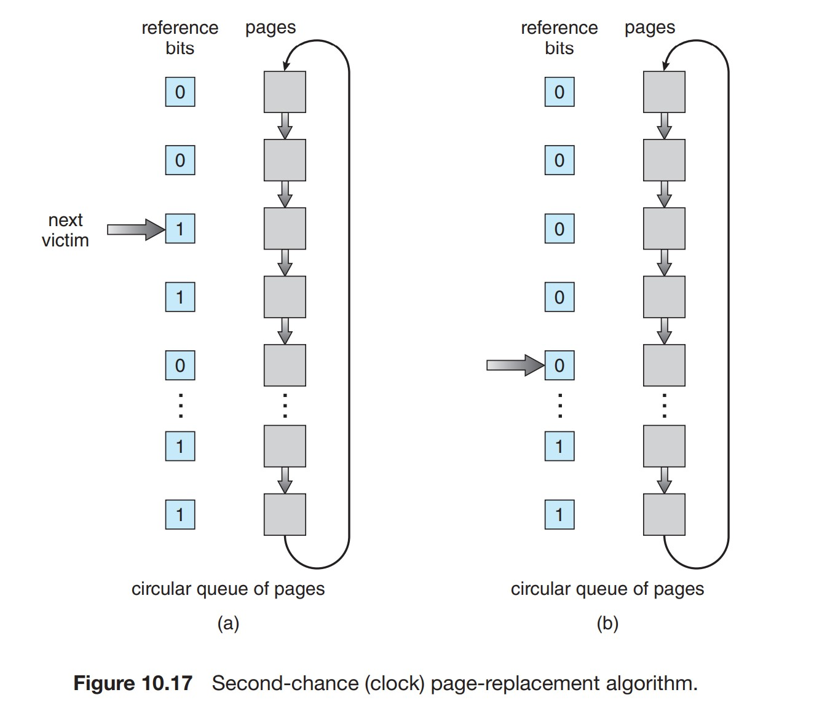

#### Enhanced Second Chance Algorithm
- Similar to above.
- We use both reference bit and modify bit in this case.
- This algorithm gives another chance to the pages which are modified so as to reduce the IO calls.
- We have 4 possible cases:
  - 0, 0 (Not recently used, nor modified) : Best page to replace.
  - 0, 1 (Not recently used, but modified) : Need to perform extra page out operation.
  - 1, 0 (Used but not modified) : Probably will be used again
  - 1, 1 (Used and modified) : Probably will be used again and also will incur a page out overhead.
- This algorithm searches the page table in a circular fashion ( in as many as four passes ), looking for the first page it can find in the lowest numbered category. I.e. it first makes a pass looking for a ( 0, 0 ), and then if it can't find one, it makes another pass looking for a ( 0, 1 ), etc.
- we may have to scan the circular queue several times before we find a page to be replaced.

### Counting Based Page Replacement
-  they do not approximate OPT replacement well.
#### Least Frequently Used
- actively used page should have a large reference count.
- Problem is a page might be used a lot at the start, but then never used again, we can use an exponentially decaying average usage count to tackle this problem.
#### Most Frequently Used
- the argument that the page with the smallest count was probably just brought in and has yet to be used.

### Belady’s anomaly
- For some page replacement algorithms, page fault might increase if number of frames increases. This is seen in FIFO algorithm
- In stack based algorithm like Optimal and LRU Algorithm, this anomaly doesn't exist.

### Stack Algorithm
- A stack algorithm is an algorithm for which it can be shown that the set of pages in memory for n frames is a subset of set of pages in memory for n+1 frames. 

### Custom Page Replacement Algorithm 
- A general algorithm might not be suitable for all applications, say in data warehouses which frequently perform massive reads followed by computations and writes, LRU might not be good, since it will be removing old pages, while the application would be needing them in future more likely than new pages. Here, MFU would actually be more efficient than LRU.

### Major vs Minor Page Fault
- A major page fault occurs when a page is referenced and the page is not in memory. Servicing a major page fault requires reading the desired page from the backing store into a free frame and updating the page table.
- Minor page fault occur when a process does not have a logical mapping to a page, yet that page is in memory.
  -  a process may reference a shared library that is in memory, but the process does not have a mapping to it in its page table
  -  A second cause of minor faults occurs when a page is reclaimed from a process and placed on the free-frame list, but the page has not yet been zeroed out and allocated to another process. When this kind of fault occurs, the frame is removed from the free-frame list and reassigned to the process. (Optimized Free Frame List See below)

## Page Replacement Optimization

- Using modify/ dirty bit to make sure only if a frame is modified we write back to backing store, else(read only part) we can just discard it since it can be read back into the memory. If page doesn't have to be written back we decrease the page swap time to half.
- As the number of frames available increases, the number
of page faults decreases. Adding physical memory increases the number of frames.

### Page Buffering Optimizations
#### Free Frame List
- Os has a pool of free frames, on page replacement, the new frame is assigned before the victim is written out. This allows a process to restart, without waiting for victim frame to be written off.
- While the page swap is taking place, a replacement can be selected, if the number of free frames are below a certain threshold.

#### Reapers and Out of Memory Killers

- rather than waiting for the list to drop to zero before we begin selecting pages for replacement, we trigger page replacement when the list falls below a certain threshold.
- When the free frame list falls below a threshold, **kernel routine called reapers** is triggered that begins reclaiming pages till the number of free frames reaches a maximum threshold.
- when the amount of free memory falls to very low levels, a routine known as the **out-of-memory (OOM) killer** selects a process to terminate(based on it's OOM Score), thereby freeing its memory.
- Process with higher percentage of memory utilization has higher OOM Score.
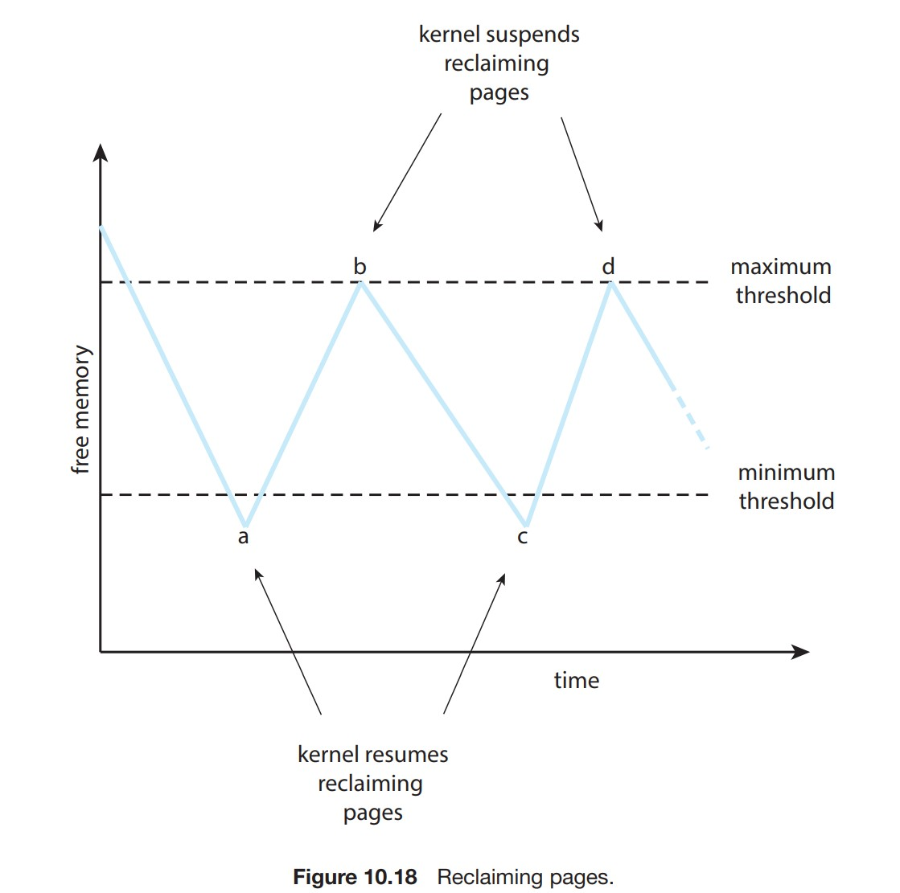

#### Optimized Free Frame List
- Instead of zeroing out every frame in free frame list, we can still remember, which page is in which frame in the free frame list.
- On page fault, first this list can be searched if the desired page is in this list, only if it is not, we will fetch from the IO.
- Helps to reduce the penalty if a wrong page is selected for replacement.

#### Modified List
- Similar to pool of free frames, we can have a pool of modified pages(ones whose dirty/modify bit is set and they will need to be written off to disk)
- When paging device is idle, it can pick up pages from modify list and update their value in disk and then reset the modify bit. This way if in future the page is selected for replacement, it doesn't have to be written off to disk.


## Allocation of Frames
- Minimum number of frames is defined by a cpu architecture, and max is defined by the amount of free memory available.
### Minium Number Of Frames
- as the number of frames allocated to each process decreases, the page-fault rate increases, slowing process execution.
- **IMPORTANT :when a page fault occurs before an executing instruction is complete, the instruction must be restarted.**
- Thus, we must have enough frames to hold all the different pages that any single instruction can reference.
- Say a load instruction with one level of indirect addressing (for example, a load instruction on
frame 16 can refer to an address on frame 0, which is an indirect reference to frame 23), might required 3 frames( one for instruction and 2 for data).
- We cannot give a process 2 frames and expect it to fulfil the request, it will stuck in a deadlock kind of situation.
- The minimum number of frames is defined by the computer architecture.
- Fortunately, the move instruction for Intel 32- and 64-bit architectures allows data to move only from register to register and between registers and memory; it does not allow direct memory to-memory movement, thereby limiting the required minimum number of frames for a process/instruction.

### Frame Allocation Algorithms

#### Equal Allocation
- The easiest way to split m frames among n processes is to give everyone an equal share, m/n frames
- Not very good use of resources, a small size process, might not even use all the frames allocated to it.

#### Proportional Algorithms
- allocate available memory to each process according to its size or priority or both.
- Make sure the allocated frames are more than minimum required for the architecture.

### Global vs Local Allocation
- Global replacement allows a process to select a replacement frame from the set of all frames, even if that frame is currently allocated to some other process; that is, one process can take a frame
from another.
- Local replacement requires that each process select from only its own set of allocated frames.
- One problem with a global replacement algorithm is that the set of pages in memory for a process depends not only on the paging behavior of that process. Local replacement might hinder a process, however, by not making available to it other, less used pages of memory. Thus, global replacement generally results in greater system throughput. It is therefore the more commonly used method.
- Local replacement reduces the chances of **thrashing**. (See below)

### NUMA Systems
- Memory allocation in NUMA Systems : Non Uniform Memory Access (System with multiple CPUs each with it's own local memory).
- In these systems, a given CPU can access some sections of main memory(closer to it) faster than it can access others.
- Managing which page frames are stored at which locations can significantly affect performance in NUMA systems. Frame is allocated to a process which is closest(least latency) to the CPU running the process. Using scheduling domains.


## Thrashing
- A process is thrashing if it is spending more time paging than executing. Involves High paging activity leading to severe performance problems.


### Causes
- Now suppose that a process enters a new phase in its execution and needs more frames. It starts faulting and taking frames away from other processes.
- These processes need those pages, so they also fault, taking pages from some other processes.
- All these processes use paging device to swap pages in and out and they queue up for the paging device.
- This queueing will reduce CPU Utilization, OS will see decreased CPU Utilization and will increase the number of processes, which will cause even more page faults and more processes in wait queue, and decrease CPU Utilization.  Cycle continues. Thrashing has occurred, and system throughput plunges.

### Degree of Multiprogramming and CPU Utilization (IMPORTANT)
-  As the degree of multiprogramming increases, CPU utilization also increases, although more slowly,
until a maximum is reached.
- If the degree of multiprogramming is increased further, thrashing sets in, and CPU utilization drops sharply. At this point, to increase CPU utilization and stop thrashing, we must decrease the degree of
multiprogramming.
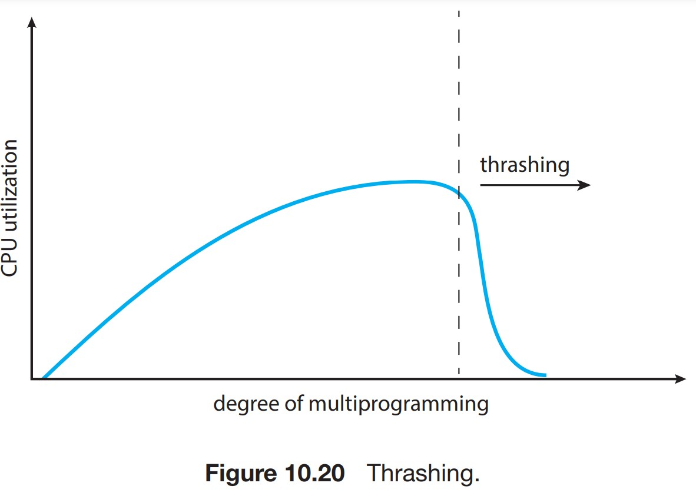

### Prevent Thrashing
- As a process executes, it moves from locality to locality. A locality is a set of pages that are actively used together. For example, when a function is called, it defines a new locality When we exit the function, the process leaves this locality, since the local variables and instructions of the
function are no longer in active use. We may return to this locality later
- To prevent thrashing, we allocate enough frames to a process to accommodate its current locality. It will fault for the pages in its locality until all these pages are in memory; then, it will not fault again until it changes localities.

#### Working Set Model
- The working-set model is based on the assumption of locality.
- This model uses a parameter Δ, to define the working set window, The idea is to examine the last Δ page references. The set of pages in the most recent Δ page references is the **working set**.
- If a page is in active use, it will be in the working set. If it is no longer being used, it will drop from the working set Δ time units after its last reference. 
- Say Δ=10, For the below page reference string : 
 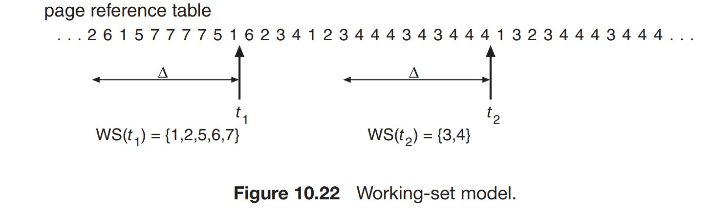
- The accuracy of the working set depends on the selection of Δ. If Δ is too small, it will not encompass the entire locality; if Δ is too large, it may overlap several localities.
- If we can compute the size of working set for each process, os just needs to ensure that size is met, if working set size is more than the allocated, we can just assign more frames to the process.
- If sum of working set size for all process is more than available frames, thrashing results and the os needs to choose victim process to terminate.
- Since the working set windows is a moving window, it might need to be updated on every memory reference, we can use some approximation algorithms to optimize this.
- A peak in the page-fault rate occurs when we begin demand-paging a new locality. However, once the working set of this new locality is in memory, the page-fault rate falls.
  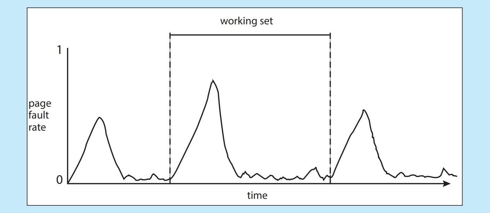

#### Page Fault Frequency
- Working Set model is too clumsy.
- We can keep track of frequency of page fault per process.
- If the actual page-fault rate exceeds the upper limit, we allocate the process another frame. If the page-fault rate falls below the lower limit, we remove a frame from the process

## Memory Compression
- It can be used as an alternative to swapping, especially in mobile system which don't support swapping.
- The idea is when a set of frames are selected for replacement, instead of writing them to disk, we compress these frames (say 3) to a single frame and make the remaining frames available to the free frame list.
- If one of these 3 pages, faults, the frame is decompressed and all the pages return to the main memory.
- Performance tests indicate that memory compression is faster than paging even to SSD secondary storage on laptop and desktop macOS systems.


## Kernel Memory Allocation/Contiguous Memory Allocation
- Kernel memory is often allocated from a free-memory pool different from the list used to satisfy ordinary user-mode processes.
- The kernel requests memory for data structures of varying sizes, some of which are less than a page in size. As a result, the kernel must use memory conservatively and attempt to minimize waste due to internal fragmentation. Thus most os don't use paging for kernel memory allocation.
- Also certain hardware  devices interact directly with physical memory(Direct Memory access) without intervention by CPU, they require the memory to be allocated in a contiguous manner.

### Buddy System
- Memory is allocated from this segment using a power-of-2 allocator, which satisfies requests in units sized as a power of 2.
- A request in units not appropriately sized is rounded up to the next highest power of 2. Thus still suffers from internal fragmentation.
- An advantage of the buddy system is how quickly adjacent buddies can be combined to form larger segments using a technique known as **coalescing**


### Slab Allocation
- A slab is made up of one or more physically contiguous pages.
- There is a single cache for each unique kernel data structure— for example, a separate cache for the data structure representing process descriptors, a separate cache for file objects, a separate cache for semaphores, and so forth. 
- The slab allocator first attempts to satisfy the request with a free object in a partial slab. If none exists, a free object is assigned from an empty slab. If no empty slabs are available, a new slab is allocated from contiguous physical pages and assigned to a cache
- Recent distributions of Linux include two other kernel memory allocators— the SLOB and SLUB allocators.

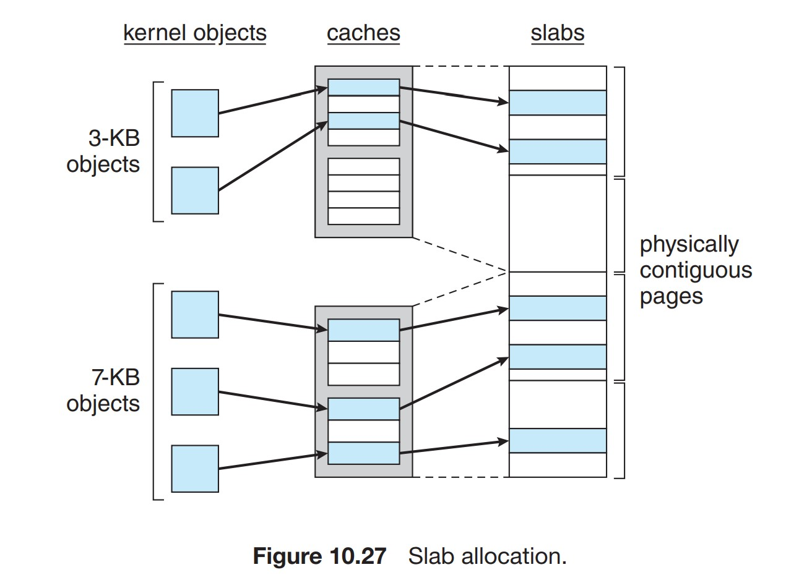
#### Advantages
- No memory is wasted due to fragmentation. Fragmentation is not an issue because each unique kernel data structure has an associated cache.
- Memory requests can be satisfied quickly. The slab allocation scheme is thus particularly effective for managing memory when objects are frequently allocated and deallocated.


## Prepaging
- Prepaging is an attempt to prevent this high level of initial paging. The strategy is to bring some—or all—of the pages that will be needed into memory at one time.
- Prepaging a file may be more predictable, since files are often accessed sequentially. Prepaging an executable program may be difficult, as it
may be unclear exactly what pages should be brought in.
- Linux's readahead() system call prefetches the contents of a file into memory so that subsequent accesses to the file will take place in main memory

## Page Size
### Increase Page Size Advantages
- decreasing the page size increases the number of pages and hence the size of the page table.
- #### IMPORTANT : Larger page size decreases I/O time.
  - I/O time consists of latency, seek and transfer. The latency and seek dwarfs the transfer time, so it is faster to read a page of 1024 bytes than it is to read two 512 bytes pages
- To minimize the number of page faults, we need to have a large page size.
  - A process of 200 KB that used only half of that memory would generate only one page fault with a page size of 200 KB but 102,400 page faults with a page size of 1 byte.

- If we increase the page size—say, from 4 KB to 16 KB—we quadruple the TLB reach.
### Decrease Page Size
- Memory is better utilized with smaller pages, decreases internal fragmentation.
- Smaller pages increases locality and thus reduces the total I/O required.

## TLB reach
- The TLB reach refers to the amount of memory accessible from the TLB and is simply the number of entries multiplied by the page size.
- Ideally, the working set for a process is stored in the TLB. If it is not, the process will spend a considerable amount of time resolving memory references in the page table rather than the TLB.
- Increase the entries in TLB or increasing page size, increases the TLB reach and improves performance.

## Considerations for Inverted Page Tables

- Demand Paging cannot be directly implemented for Inverted Page Tables, since the inverted page table
no longer contains complete information about the logical address space of a process, and that information is required if a referenced page is not currently in memory.
- Demand paging requires this information to process page faults. For the information to be available, an external page table (one per process) must be kept.
- These external page tables, are only accesed when page fault occurs so they don't need to be available in memory at all times and can be paged in and out.

## Considerations for Program Structure
- Sometimes it helps if the user/developer is aware of the existence of paged nature of memory.
- Consider the following example
  - (Remember the array is stored row major i.e data[0][0], data[0][1], ..... data[0][n] then data[1][0])
  - The following code runs slower 
  ```c++
  int i,j;
  int data[n][n];
  for(int i=0;i<n;i++){
    for(int j=0;j<n;j++){
      data[j][i] = 0; //difference
    }
  }
  ```
  Than
    ```c++
  int i,j;
  int data[n][n];
  for(int i=0;i<n;i++){
    for(int j=0;j<n;j++){
      data[i][j] = 0;
    }
  }
  ```
  - The first code zeros one word in each page, then another word in each page, and so on, where as the latter zeros all the words on the first page then moves to the second page.

- It is important to keep idea data locality when choosing datastructures, a stack has better locality than a hashmap.

### Compiler and Loader Optimizations
- the compiler and loader can have a significant effect on paging. Separating code and data and generating reentrant code means that code pages can be read-only and hence will never be modified. Clean pages do not have to be paged out to be replaced.
- The loader can avoid placing routines across page boundaries, keeping each routine completely in one page. Routines that call each other many times can be packed into the same page.

## I/O Interlock and Page Locking/ Pinning
- We sometimes need to put lock on pages so that they are not replaced by the page replacement algorithm.
- Consider the example : 
  - A process issues an I/O request and is put in a queue for that I/O device. Meanwhile, the CPU is given to other processes. These processes cause page faults, and one of them, using a global replacement algorithm, replaces the page containing the memory buffer for the waiting process.
  - The pages are paged out. Some time later, when the I/O request advances to the head of the device queue, the I/O occurs to the specified address. However, this frame is now being used for a different page belonging to another process.

- Other cases:
  - Many operating systems cannot tolerate a page fault caused by the kernel or by a specific kernel module, including the one performing memory management.
  -  A database process may want to manage a chunk of memory, for example, moving blocks between secondary storage memory itself because it has the best knowledge of how it is going to use its data.

- Using a lock bit can be dangerous: the lock bit may get turned on but never turned off.


# IO

## Communication between CPU and IO

### Memory Mapped IO
- the device can support memory-mapped I/O. In this case, the device-control registers are mapped into the address space of the processor. The CPU executes I/O requests using the standard datatransfer instructions to read and write the device-control registers at their mapped locations in physical memory.
- writing millions of bytes to the graphics memory is faster than issuing millions of I/O instructions.
### Dedicated CPU Instruction for IO load and store
- slower than memory mapped IO

## For Transfer Notification

- Polling
- Interrupts
-  Interrupt-driven I/O is now much more common than polling, with polling being used for high-throughput I/O. Sometimes the two are used together. 

## Interrupts
- The CPU hardware has a wire called the interrupt-request line that the CPU senses after executing every instruction.
- a signal on the interrupt-request line, the CPU performs a state save and jumps to the interrupt-handler routine at a fixed address in memory. The interrupt handler determines the cause of the interrupt, performs the necessary processing, performs a state restore, and executes a return from interrupt instruction to return the CPU to the execution state prior to the interrupt.
- the device controller raises an interrupt by asserting a signal on the interrupt request line, the CPU catches the interrupt and dispatches it to the interrupt handler, and the handler clears the interrupt by servicing the device. 
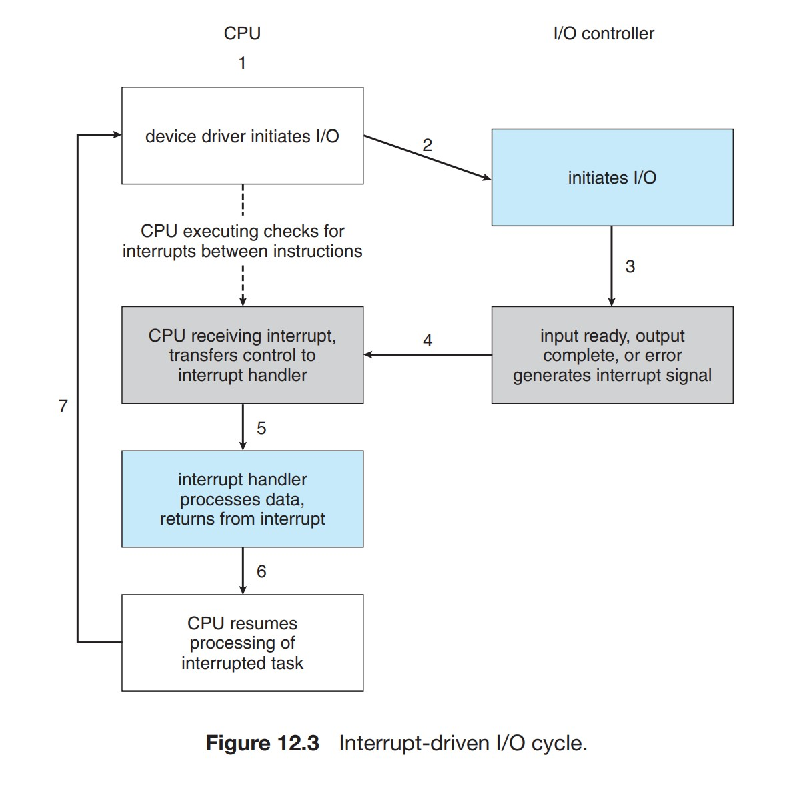

### Application of interrupts
- During I/O, the various device controllers raise interrupts when they are ready for service. These interrupts signify that output has completed, or that input data are available, or that a failure has been detected.
- The interrupt mechanism is also used to handle a wide variety of exceptions, such as dividing by zero, accessing a protected or nonexistent memory address.
- A page fault is an exception that raises an interrupt.
- the implementation of system calls via traps

### Interrupt Handlers
- The events that trigger interrupts have a common property: they are occurrences that induce the operating system to execute an urgent, selfcontained routine, called interrupt Handlers/Interrupt Service Routine
#### 2 Level Interrupt Handler
- A first-leve interrupt handler performs the context switch, state storage,
and queuing of a handling operation.
-  the separately scheduled SLIH performs the handling of the requested operation.

### Trap
-  A trap is a software-generated interrupt. 
- The trap is given a relatively low interrupt priority compared with those assigned to device interrupts.
- Used to implement system calls.
  -  When a process executes the trap instruction, the interrupt hardware saves the state of the user code, switches to kernel mode, and dispatches to the kernel routine or thread that implements the requested service

### interrupt-controller hardware functions
- the ability to defer interrupt handling during critical processing.
- an efficient way to dispatch to the proper interrupt handler for
a device without first polling all the devices to see which one raised the
interrupt
-  multilevel interrupts, so that the operating system can distinguish between high- and low-priority interrupts and can respond withthe appropriate degree of urgency when there are multiple concurrent interrupts.
- a way for an instruction to get the operating system’s attention directly (separately from I/O requests), for activities such as page
faults and errors such as division by zero. As we shall see, this task is
accomplished by “traps.”

### maskable vs non maskable
- nonmaskable interrupt, which is reserved for events such as unrecoverable memory errors.
- The second interrupt line is maskable: it can be turned off by the CPU before the execution of critical instruction sequences that must not be interrupted.

### Interrupt Vector
- To avoid a single interrupt handler for all interrupts, each interrupt is associated with an address, which is an offset in a table called interrupt vector.
- This vector contains the memory addresses of specialized interrupt handlers. The purpose of a vectored interrupt mechanism is to reduce the need for a single interrupt handler to search all possible sources of interrupts to determine which one needs service.
- At boot time, the operating system probes the hardware buses to
determine what devices are present and installs the corresponding interrupt handlers into the interrupt vector.
- To reduce the number of items in interrupt vector we can use chaining, in which each item in vector table is a pointer to a linked list of all the interrupt handlers belonging to that class and then poll all related to that class. ( compromise between the overhead of a huge interrupt table and the inefficiency of dispatching to a single interrupt handler.)
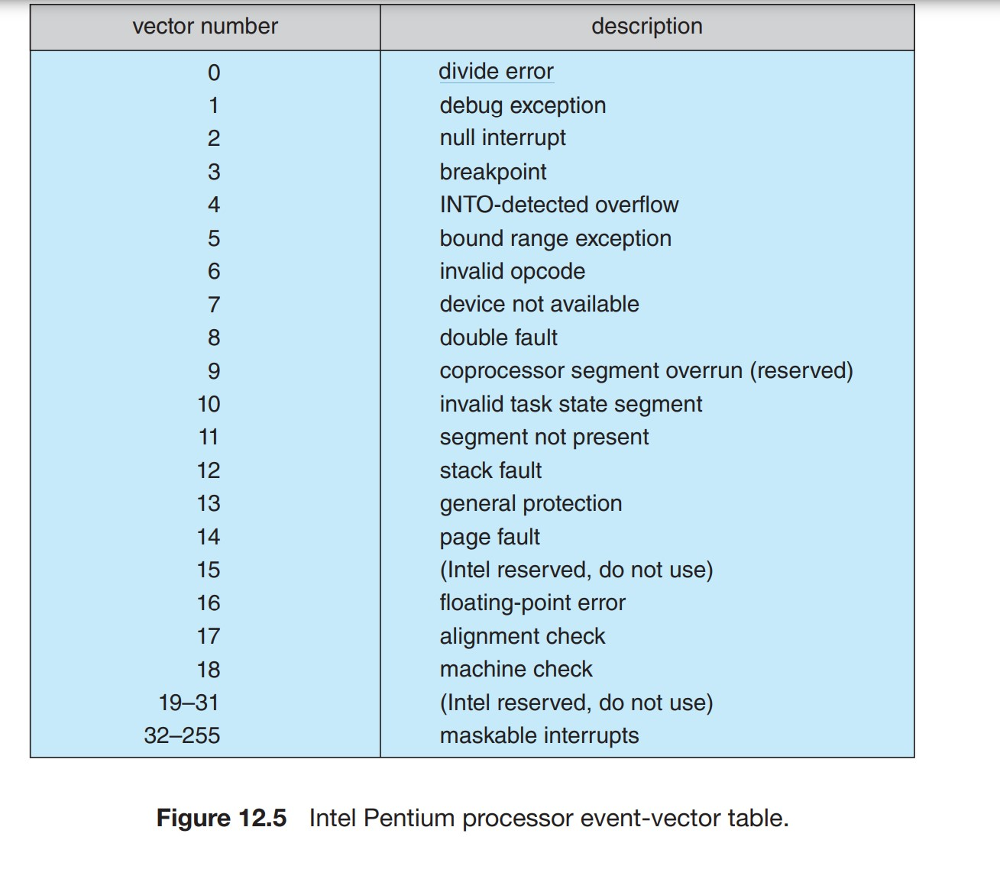

## Transfer Mechanism
- Programmed IO
- Direct Memory Access

### Programmed IO (PIO)
- use an general-purpose processor to watch status bits and to feed data into a controller register one byte at a time

### Direct Memory Access
- Computers avoid burdening the main CPU with PIO by offloading some of this work to a special-purpose processor called a directmemory-access (DMA) controller. 

- To initiate a DMA transfer, the host writes a DMA command block into memory. This block contains a pointer to the source of a transfer, a pointer to the destination of the transfer, and a count of the number of bytes to be transferred. The source and destination pointer can be a list, for non contiguous transfer.
- The CPU writes the address of this command block to the DMA controller, then goes on with other work.
- The DMA controller proceeds to operate the memory bus directly, placing addresses on the bus to perform transfers without the help of the main CPU.
- the target address is usually in kernel address space. If it were in user space, the user could, for example, modify the contents of that space during the transfer, losing some set of data.
- When the entire transfer is finished, the DMA controller interrupts the CPU.
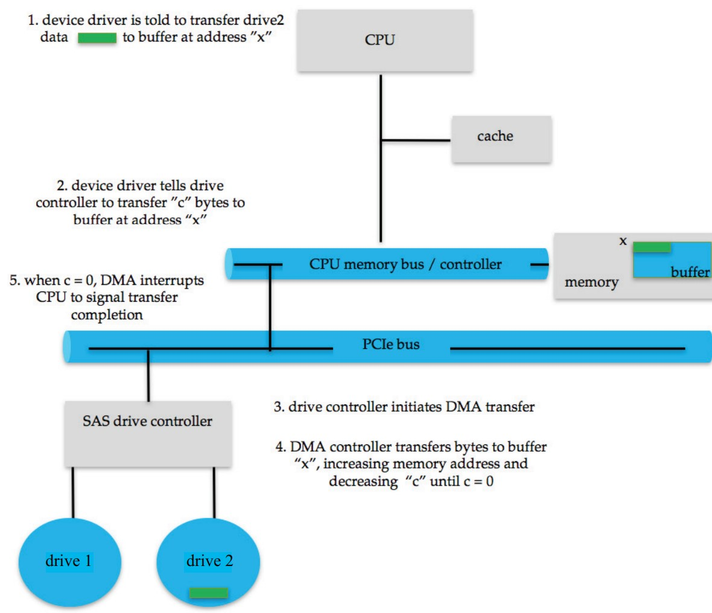

## Non Blocking and Asynchronous IO
-  When an application issues a blocking system call, the execution of the calling thread is suspended. The thread is moved from the operating system’s run queue to a wait queue.
- A nonblocking call does not halt the execution of the thread for
an extended time. Instead, it returns quickly, with a return value that indicates how many bytes were transferred.
- An alternative to a nonblocking system call is an asynchronous system
call. An asynchronous call returns immediately, without waiting for the I/O to
complete. The thread continues to execute its code. The completion of the I/O
at some future time is communicated to the thread,  through the triggering
of a signal or software interrupt or a call-back routine that is executed outside the linear control flow of the thread.
- The difference between nonblocking and asynchronous system calls is that a nonblocking read() returns immediately with whatever data are available— the full number of bytes requested, fewer, or none at all. An asynchronous read() call requests a transfer that will be performed in its entirety but will complete at some future time. 
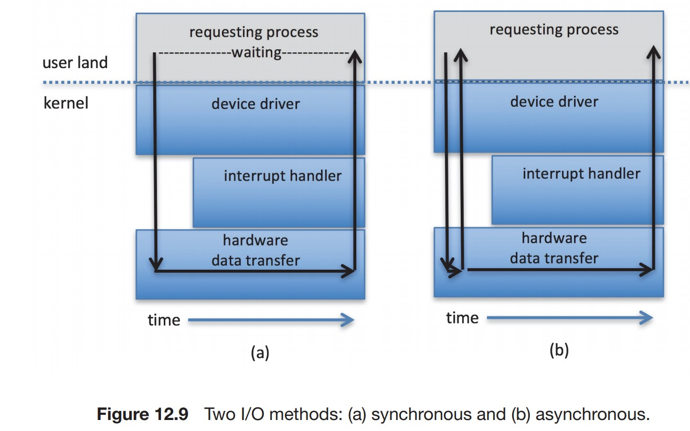

## Kernel IO Structure
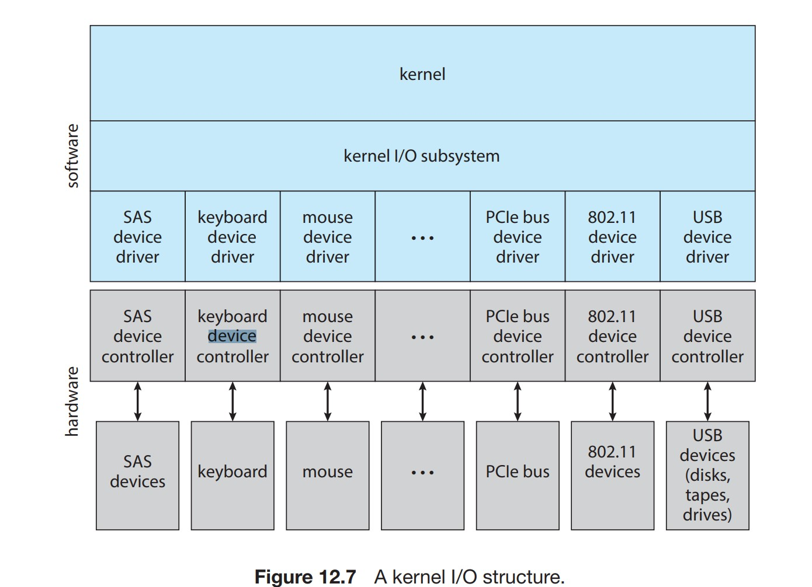

## Life Cycle of a blocking IO Read Request.
1. A process issues a blocking read() system call to a file descriptor of a file that has been opened previously.
2. The system-call code in the kernel checks the parameters for correctness. In the case of input, if the data are already available in the buffer cache, the data are returned to the process, and the I/O request is completed.
3. Otherwise, a physical I/O must be performed. The process is removed from the run queue and is placed on the wait queue for the device, and the I/O request is scheduled. Eventually, the I/O subsystem sends the request to the device driver. Depending on the operating system, the request is
sent via a subroutine call or an in-kernel message.
1. The device driver allocates kernel buffer space to receive the data and schedules the I/O. Eventually, the driver sends commands to the device controller by writing into the device-control registers (Using concept of memory mapped IO).
2. The device controller operates the device hardware to perform the data transfer.
3. The driver may poll for status and data, or it may have set up a DMA transfer into kernel memory. We assume that the transfer is managed by a DMA controller, which generates an interrupt when the transfer completes.
4. The correct interrupt handler receives the interrupt via the interrupt vector table, stores any necessary data, signals the device driver, and returns from the interrupt.
5. The device driver receives the signal, determines which I/O request has completed, determines the request’s status, and signals the kernel I/O subsystem that the request has been completed.
6. The kernel transfers data or return codes to the address space of the requesting process and moves the process from the wait queue back to the ready queue.
7.  Moving the process to the ready queue unblocks the process. When the scheduler assigns the process to the CPU, the process resumes execution at the completion of the system call.

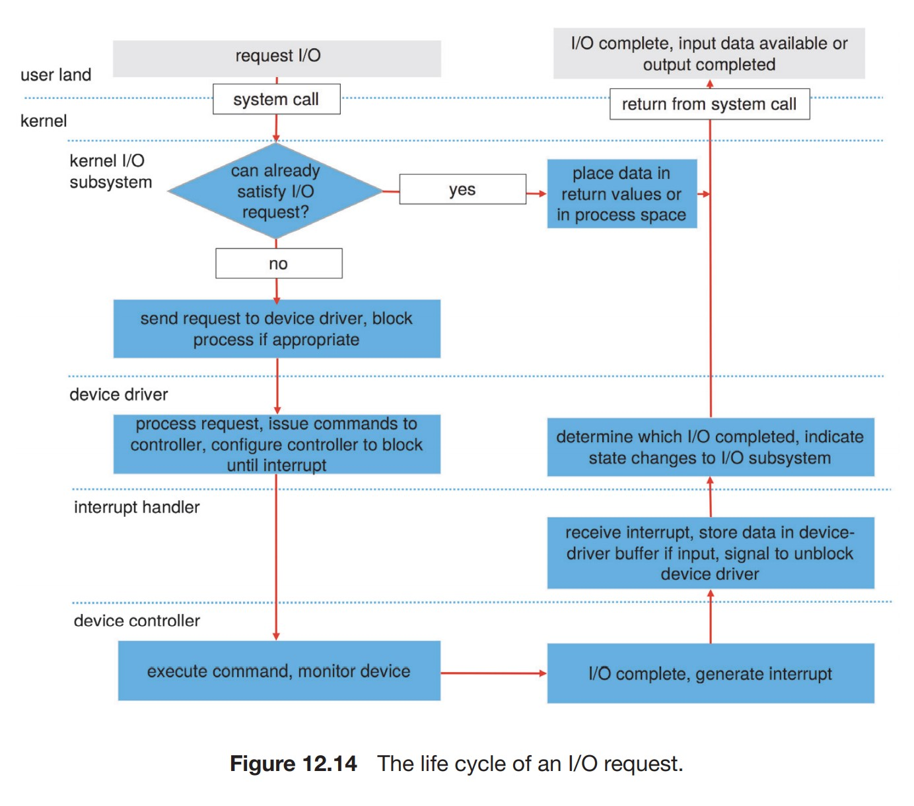

# Chapter 19

## UDP
The transport protocol UDP is unreliable in that it is a bare-bones extension to IP with the addition of a port number. In fact, the UDP header is very simple and contains only four fields: source port number, destination port number, length, and checksum. Packets may be sent quickly to a destination using UDP. However, since there are no guarantees of delivery in the lower layers of the network stack, packets may become lost. Packets can also arrive at the receiver out of order. It is up to the application to figure out these error cases and to adjust (or not adjust).

Figure, illustrates a common scenario involving loss of a packet between a client and a server using the UDP protocol. Note that this protocol is known as a connectionless protocol because there is no connection setup at the beginning of the transmission to set up state— the client just starts sending data. Similarly, there is no connection teardown.

The client begins by sending some sort of request for information to the server. The server then responds by sending four datagrams, or packets, to the client. Unfortunately, one of the packets is dropped by an overwhelmed router. The client must either make do with only three packets or use logic programmed into the application to request the missing packet. Thus, we need to use a different transport protocol if we want any additional reliability guarantees to be handled by the network.

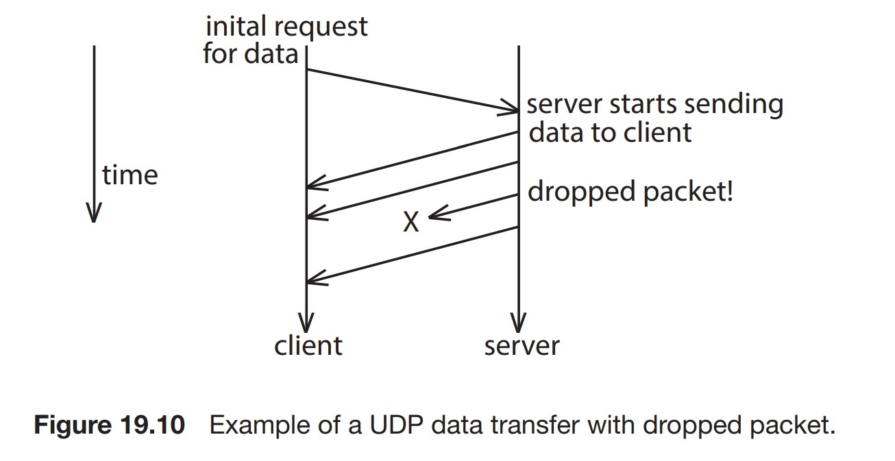

## TCP

TCP is a transport protocol that is both reliable and connection-oriented. In addition to specifying port numbers to identify sending and receiving processes on different hosts, TCP provides an abstraction that allows a sending process on one host to send an in-order, uninterrupted byte stream across the network to a receiving process on another host. It accomplishes these things through the
following mechanisms:
  
  - Whenever a host sends a packet, the receiver must send an acknowledgment packet, or ACK, to notify the sender that the packet was received. If the ACK is not received before a timer expires, the sender will send that packet again.
  - TCP introduces sequence numbers into the TCP header of every packet. These numbers allow the receiver to (1) put packets in order before sending data up to the requesting process and (2) be aware of packets missing from the byte stream.
  - TCP connections are initiated with a series of control packets between the sender and the receiver (often called a three-way handshake) and closed gracefully with control packets responsible for tearing down the connection. These control packets allow both the sender and the receiver to set up and remove state. 

Figure, demonstrates a possible exchange using TCP (with connection setup and tear-down omitted). After the connection has been established, the client sends a request packet to the server with the sequence number 904. Unlike the server in the UDP example, the server must then send an ACK packet back to the client. Next, the server starts sending its own stream of data packets starting with a different sequence number. The client sends an ACK packet for each data packet it receives. Unfortunately, the data packet with the sequence number 127 is lost, and no ACK packet is sent by the client. The sender times out waiting for the ACK packet, so it must resend data packet 127. Later in the connection, the server sends the data packet with the sequence number 128, but the ACK is lost. Since the server does not receive the ACK it must resend data packet 128. The client then receives a duplicate packet. Because the client knows that it previously received a packet with that sequence number, it throws the duplicate away. However, it must send another ACK back to the server to allow the server to continue.

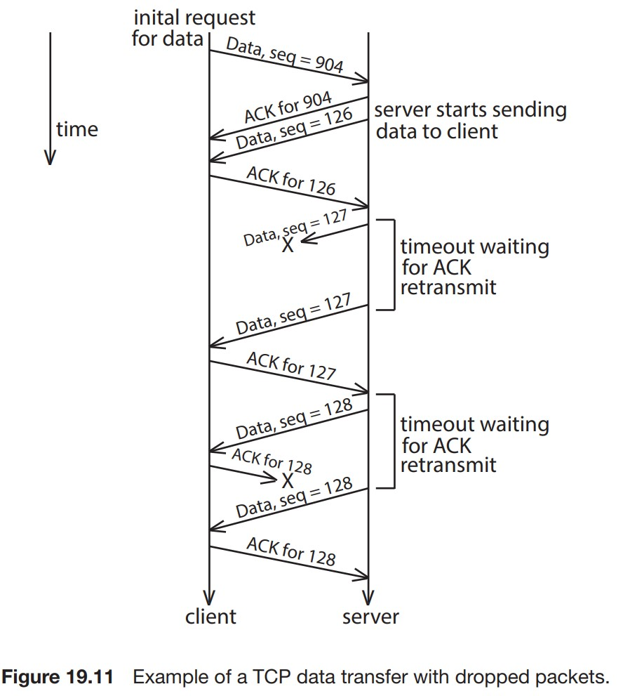

### Optimization
In the actual TCP specification, an ACK isn’t required for each and every packet. Instead, the receiver can send a cumulative ACK to ACK a series of packets. The server can also send numerous data packets sequentially before waiting for ACKs, to take advantage of network throughput. 

### Flow Control/ Congestion Control
TCP also helps regulate the flow of packets through mechanisms called flow control and congestion control. Flow control involves preventing the sender from overrunning the capacity of the receiver. For example, the receiver may have a slower connection or may have slower hardware components (like a
slower network card or processor). Flow-control state can be returned in the ACK packets of the receiver to alert the sender to slow down or speed up. Congestion control attempts to approximate the state of the networks (and generally the routers) between the sender and the receiver. If a router becomes overwhelmed with packets, it will tend to drop them. Dropping packets results in ACK timeouts, which results in more packets saturating the network. To prevent this condition, the sender monitors the connection for dropped packets by noticing how many packets are not acknowledged. If there are too many dropped packets, the sender will slow down the rate at which it sends them. This helps ensure that the TCP connection is being fair to other connections happening at the same time.

By utilizing a reliable transport protocol like TCP, a distributed system does not need extra logic to deal with lost or out-of-order packets. However, TCP is slower than UDP.

# To read
- https://blog.feabhas.com/2009/09/mutex-vs-semaphores-%E2%80%93-part-1-semaphores/
- https://blog.feabhas.com/2009/09/mutex-vs-semaphores-%E2%80%93-part-2-the-mutex/
- https://blog.feabhas.com/2009/10/mutex-vs-semaphores-%E2%80%93-part-3-final-part-mutual-exclusion-problems/
https://stackoverflow.com/questions/11227809/why-is-processing-a-sorted-array-faster-than-processing-an-unsorted-array

# To write
- //Interrupt Service Routine
- Process Control Block 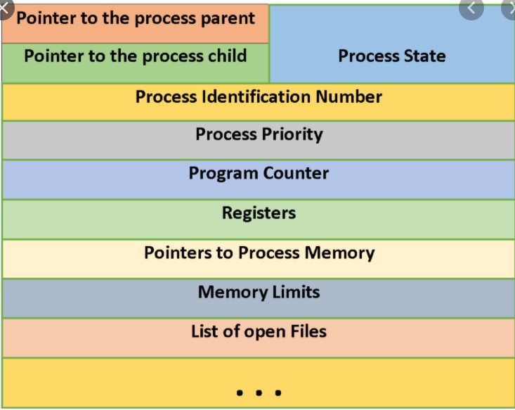
- spurious wake up : a thread is woken up only to have the while condition fail and it sleeps again.
- multithreading vs multiprocessing
- Branch Prediction


# Misc
-  If accesses to any types of data were random rather than patterned, caching would be useless. Data locality principle