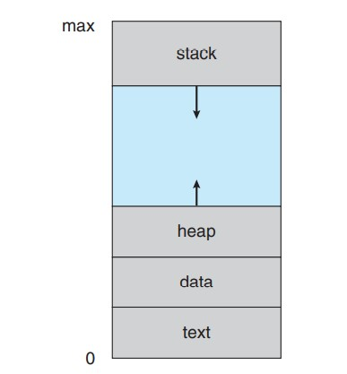
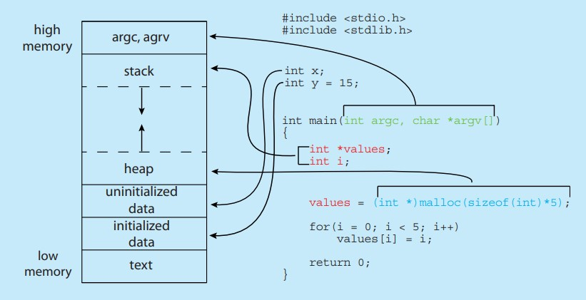
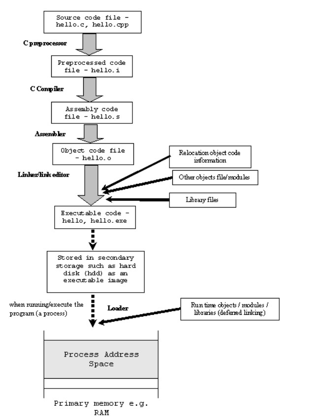
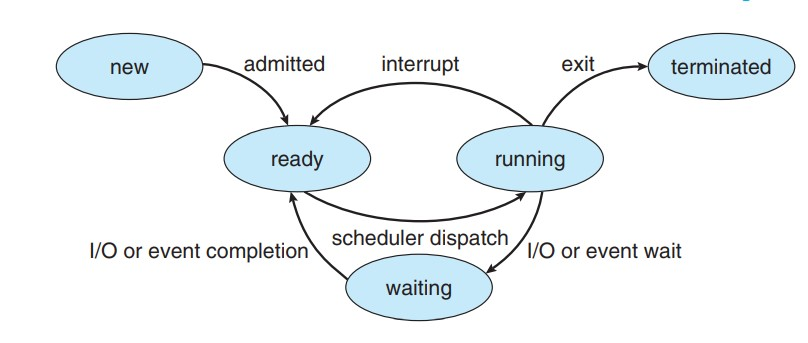
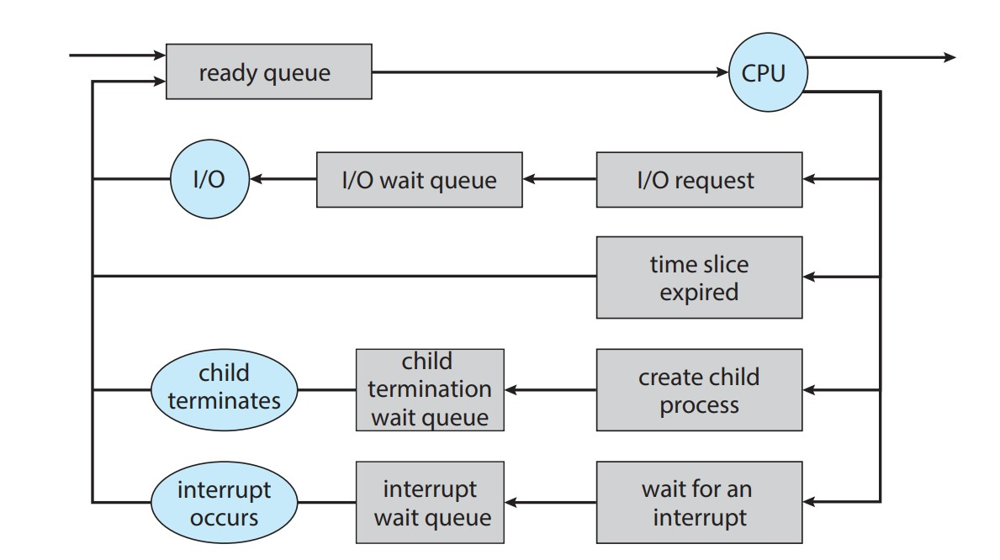
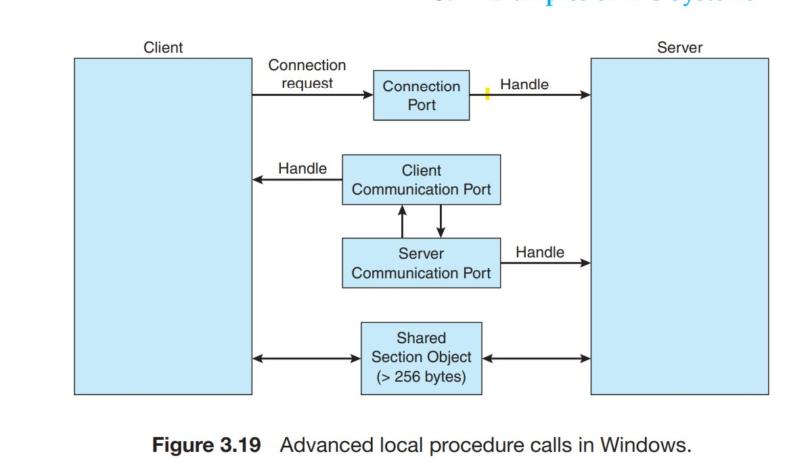
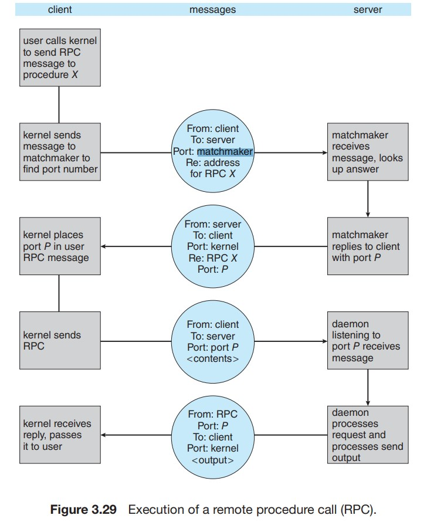
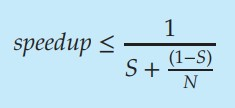
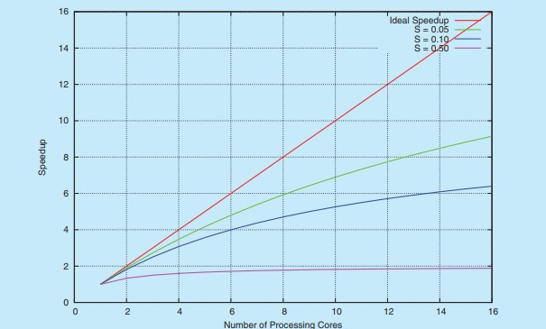
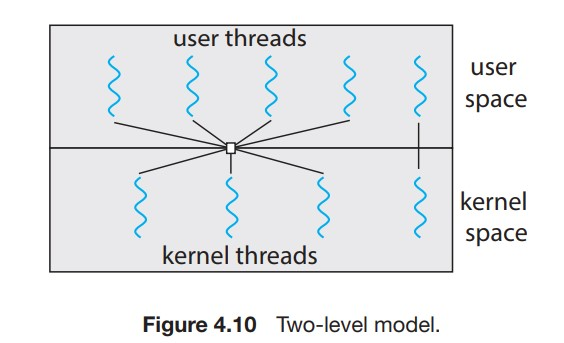

# Chapter - 1
## Interrupts
- Hardware may trigger an interrupt at any time by sending a signal to the CPU, usually by way of the system bus.
- When the CPU is interrupted, it stops what it is doing and immediately transfers execution to a fixed location. The fixed location usually contains the starting address where the service routine for the interrupt is located.
- Generally, the table of pointers is stored in low memory (the first hundred or so locations). These locations hold the addresses of the interrupt service routines for the various devices.
- Interrupt handlers run asynchronously, and must respond to time-critical inputs quickly. Therefore, interrupt handler is divided into top half and bottom half. First half was executed by the kernel immediately after a hardware interrupt, whereas bottom half are the tasks that can be deferred to execute later

## CPU Protection Rings
- Typically in x86 architecture, there are 4 rings of protection. Ring 0 (kernel mode), Ring 1 (may be used by virtual machine hypervisors or drivers), Ring 2 (may be used by drivers, I am not so sure about that though). Ring 3 is what typical applications run under. It is the least privileged ring, and applications running on it have access to a subset of the processor's instructions. Ring 0 (kernel space) is the most privileged ring, and has access to all of the machine's instructions. For example to this, a "plain" application (like a browser) can not use x86 assembly instructions lgdt to load the global descriptor table or hlt to halt a processor.
- The multiple mode of operation provides us with the means for protecting the operating system from errant users—and errant users from one another.

## Data Structures used in OS
### Lists, Stacks, and Queues
- Queues are also quite common in operating systems—jobs
that are sent to a printer are typically printed in the order in which they were submitted. Tasks that are waiting to be run on an available CPU are often organized in queues.
- Linux uses a balanced binary search tree (known as a red-black tree) as part its CPU-scheduling algorithm.
- A medium-sized disk drive might be divided into several thousand individual units, called disk blocks. A bitmap can be used to indicate the availability of each disk block.


# Chapter - 2


## High memory vs Low Memory
- On a 32-bit architecture, the address space range for addressing RAM is  (4 GB):
- The linux kernel splits that up 3/1 into user space (high memory) and kernel space (low memory) respectively.
- User processes are generally untrusted and therefore are forbidden to access the kernel space. Further, they are considered non-urgent, as a general rule, the kernel tries to defer the allocation of memory to those processes.
- Processes spawned in kernel space are trusted, urgent and assumed error-free, the memory request gets processed instantaneously.
- High memory access : Every kernel process can also access the user space range if it wishes to. And to achieve this, the kernel maps an address from the user space (the high memory) to its kernel space (the low memory)

## Linkers and Loaders
- Have a look at this section
## Relocation
- Relocation is the process of assigning load addresses for position-dependent code and data of a program and adjusting the code and data to reflect the assigned addresses.
- Relocation is typically done by the linker at link time, but it can also be done at load time by a relocating loader, or at run time by the running program itself. 
## Base and Limit Register
- used so that each process has a separate memory space.
- For every memory access
  - Base address is added to the address
  - Result is compared to the limit register.
## Object Files
### Relocatable object file
- They are “relocatable” because the functions and variables are not bound to any specific address. Instead, the addresses are still symbols.
- This file contains binary code and data that can be combined with other relocatable object files at compile time to create an executable object file.
- math.o is a relocatable file.
- Relocatable object files are linked together during compile time. 

### Executable Object Files
- an executable object file is simply a relocatable object file with the addresses assigned so that it can be placed into memory for execution.

### Shared Object Files
- shared object files are linked into programs during runtime. This is also known as dynamic linking.

## How to run applications on multiple os
- Use interpreter like Ruby or Python (slower than native)
- Use a VM based language, like Java (slower than native)
- Application programmer has to build binaries manually and test for all os. (lot of work for programmer).

## Application Binary Interface
- Each hardware architecture(ARM/x86) specifies certain standards at hardware level, including address width, methods of passing parameters to system calls etc.

## Kernel
- The kernel provides the file system, CPU scheduling, memory management, and other operating system functions through system calls.
- Applications typically use the glibc standard C library when communicating with the system call interface to the kernel.

## Types of kernel design
### Monolithic
### Layered 
  - (Only a higher layer can call lower layer).
  -  (Bad performance)
  -  Each layer has it's own defined and protected interface for debugging.
### Microkernel based.
  - Stripped off monolithic kernel 
  - certain components are moved from kernel space to user space. 
  - Bad performance.
### LKM Modules (LOADABLE KERNEL MODULES)
  - LKMs allow a dynamic and modular kernel, while maintaining the performance benefits of a monolithic system.
  - Here, the kernel has a set of core components and can link in additional services via modules, either at boot time or during run time.
  - Resembles layered since, each module has it's own protected interface but unliked layered any module can call any other module.
  - Also is similar to microkernels, in that the primary module has only core functions, but unlike microkernels, more efficient since the modules don't need to invoke message passing in order to communicate.
  - Linux uses loadable kernel modules, primarily for supporting device drivers and file systems.If the Linux kernel does not have the necessary driver, it can be dynamically loaded.

### Hybrid
  - Linux is monolithic, because having the operating system in a single address space provides very efficient performance. However, it also modular, so that new functionality can be dynamically added to the kernel.

## System boot
- The process of starting a computer by loading the kernel is
known as booting the system. 
###  Steps
- Power ON
- BIOS/UEFI
- MBR (First sector of Hard Disk) (Not in UEFI)
- A small piece of code known as the bootstrap program or boot loader(GRUB) locates the kernel.
- The kernel is loaded into memory and started.
- Intial RAM Disk - initramfs is loaded.
  - The kernel initializes hardware.
  - The root file system is mounted.
- /sbin/init or systemmd is spawned.
- Command shell using getty (Get tty)
- Bash opens up/ GUI (X Windows Server)

### Types of boot process
#### BIOS : Multistage boot process (BIOS based boot process) BIOS : Basic Input/Output system
- the Basic Input/Output System (BIOS) initializes the hardware, including the screen and keyboard, and tests the main memory. This process is also called POST (Power On Self Test).
- The BIOS software is stored on a ROM chip on the motherboard. After this, the remainder of the boot process is completely controlled by the operating system.
- Typically located in ROM/EPROM known as firmware.
- BIOS is not a bootloader, bootloader is a software, BIOS is firmware.

#### UEFI (Unified Extensible Firmware Interface)
- UEFI is a single, complete boot manager and therefore is faster than the multistage BIOS boot process.
- Better multiprocessor support.

### Bootloader

#### First Stage boot loader
- The first stage of PC boot loaders (FSBL, first-stage boot loader) located on fixed disks and removable drives must fit into the first 446 bytes of the Master Boot Record.
- Installed to MBR/master boot block/record or  first sector of the hard disk.
- It just initializes the second stage boot process
- Examples of first-stage bootloaders include coreboot, Libreboot and Das U-Boot.

#### Second Stage Boot loader 
- Example GRUB, Windows's BOOTMGR
- The second stage boot loader resides under /boot.
- Most Linux boot loaders can present a user interface for choosing alternative options for booting Linux,
- Loads file containing the kernel program. 
- run diagnostics to determine state of machine.
- provide booting into recovery mode or single-user mode for diagnosing hardware issues, fixing corrupt file systems, and even reinstalling the operating system.

#### GRUB (second stage boot loader)
- Open source bootstrap program.
- GRUB is flexible and allows changes to be made at boot time, including modifying kernel parameters and even selecting among different kernels that can be booted.


### Boot Loader working.
- Kernels are almost always compressed, so it's first job is to uncompress itself. 
-  During the boot process, the boot loader typically creates a temporary RAM file system, known as **initramfs**.
- This file system contains necessary drivers and kernel modules that must be installed to support the real root file system (which is not in main memory).
- Once the kernel has started and the necessary drivers are installed, the kernel switches the root file system from the temporary RAM location to the appropriate root file system location. 
-  Linux creates the systemd process, the initial process in the system, and then starts other services (for example, a web server and/or database). Most other processes on the system trace their origin ultimately to systemd; the exceptions are kernel processes, started by the kernel directly for managing internal operating system details.
-  Finally user is presented with login screen.


## Core dump
- a capture of the memory of the process—and store it in a file for later analysis, at event of failure.

## Proc in linux
- /proc is a “pseudo” file system that exists only in kernel memory and is used primarily for querying various per-process as well as kernel statistics. 
- the directory entry /proc/2155 would contain per-process statistics for the process with an ID of 2155.


# Chapter - 3

## Program vs Process
- A program becomes a process when an executable file
is loaded into memory

## The process memory layout


Although the stack and heap sections grow toward
one another, the operating system must ensure they do not overlap one another.

### Text section
- the executable code
- Fixed Size.

### Data section
- global variables
- Fixed Size

### Heap section
  - memory that is dynamically allocated during program run time.
### Stack section
  - temporary data storage when invoking functions (such as function parameters, return addresses, and local variables).
#### Activation Record
  - Each time a function is called, an activation record containing function parameters, local variables, and the return address is pushed onto the stack. when control is returned from the function, the activation record is popped from the stack.

## Build Process for various languages
- Machine code is binary (1's and 0's) code that can be executed directly by the CPU. If you were to open a machine code file in a text editor you would see garbage, including unprintable characters (no, not those unprintable characters ;) ). Machine code is pure hexadecimal code: ```5F 3A E3 F1```
- Object code is a portion of machine code not yet linked into a complete program. It's the machine code for one particular library or module that will make up the completed product. It may also contain placeholders or offsets not found in the machine code of a completed program. The linker will use these placeholders and offsets to connect everything together.
- Assembly code is plain-text and (somewhat) human read-able source code that mostly has a direct 1:1 analog with machine instructions. This is accomplished using mnemonics for the actual instructions, registers, or other resources. Examples include JMP and MULT for the CPU's jump and multiplication instructions. Unlike machine code, the CPU does not understand assembly code. You convert assembly code to machine code with the use of an assembler or a compiler, though we usually think of compilers in association with high-level programming language that are abstracted further from the CPU instructions. Assembly code : ```mov eax, 77```

### Compiled Languages
- Building a complete program involves writing source code for the program in either assembly or a higher level language like C++. The source code is assembled (for assembly code) or compiled (for higher level languages) to object code, and individual modules are linked together to become the machine code for the final program. In most cases, a complicated make script or solution file may be used to tell the environment how to build the final application.

### Interpreted Languages
- Interpreted languages rely on the machine code of a special interpreter program. At the basic level, an interpreter parses the source code and immediately converts the commands to new machine code and executes them. Modern interpreters are now much more complicated: evaluating whole sections of source code at a time, caching and optimizing where possible, and handling complex memory management tasks.

### Virtual machine
- In this situation, a program is first pre-compiled to a lower-level intermediate language or byte code. The byte code is then loaded by the virtual machine, which interprets/compiles(compilation is a optimization ste p for repeated parts of code) it to native code. The advantage here is the virtual machine can take advantage of optimizations available at the time the program runs. A compiler belongs to the developer, and therefore must produce relatively generic (less-optimized) machine code that could run in many places. The runtime environment or virtual machine, however, is located on the end user's computer, and therefore can take advantage of all the features provided in that environment.

## Memory Layout for c program


- GNU ```size``` command can be used to determine the size in bytes of the above section.
- The global data section is divided into different sections for (a) initialized data and (b) uninitialized data.
- A separate section is provided for the argc and argv parameters passed to the main() function.

## Build Process for c program


## Process state
It is important to realize that only one process can be running on any processor core at any instant.



## Process control block Components
- You can get some of this data from ```cat /proc/process_id/status```
- PCB must be kept in an area of memory protected from normal process access. In some operating systems the PCB is placed at the beginning of the kernel stack of the process.
- On systems that support threads, the PCB is expanded to include information for each thread.
- The process control block in the Linux operating system is represented by the C structure task struct, which is found in the <include/linux/sched.h>

### Process State
### Program Counter
### CPU registers
- They include accumulators, index registers, stack pointers, and general-purpose registers, plus any condition-code information. Along with the program counter, this state information must be saved when an interrupt occurs, to allow the process to be continued correctly afterward when it is rescheduled to run. The CPU uses these values to fill it's own register on each context switch.

### Memory-management information.
-  may include such items as the value of the base and limit registers and the page tables, or the segment tables

### I/O status information.
-  This information includes the list of I/O devices allocated to the process, a list of open files, and so on.

### CPU-scheduling information. 
- This information includes a process priority, pointers to scheduling queues, and any other scheduling parameters.

### Memory management information
This information may include such items as the value of the base and limit registers and the page tables, or the segment tables, depending on the memory system used by the operating
system.

### Accounting information.
This information includes the amount of CPU and real time used, time limits, account numbers, job or process numbers.

### I/O status information.
This information includes the list of I/O devices allocated to the process, a list of open files, and so on.


## Scheduling Queues
- As processes enter the system, they are put into a ready queue, where they are ready and waiting to execute on a CPU’s core This queue is generally stored as a linked list; a ready-queue header contains pointers to the first PCB in the list, and each PCB includes a pointer field that points to the next PCB in the ready queue.


- Context-switch times are highly dependent on hardware support. For instance, some processors provide multiple sets of registers.

## Process Creation.

-  A child process may be able to obtain its resources directly from
the operating system, or it may be constrained to a subset of the resources
of the parent process, like open files, pipes etc.

- Restricting a child process to a subset of
the parent’s resources prevents any process from overloading the system by
creating too many child processes.

- When a process terminates, its resources are deallocated by the operating system. However, its entry in the process table must remain there until the parent calls wait(), because the process table contains the process’s exit status.

- A process that has terminated, but whose parent has not yet called wait(), is known as a zombie process.

- Now consider what would happen if a parent did not invoke wait() and instead terminated, thereby leaving its child processes as orphans. Traditional UNIX systems addressed this scenario by assigning the init process as the new parent to orphan processes. The init process periodically invokes wait(), thereby allowing the exit status of any orphaned process to be collected and releasing the orphan’s process identifier and process-table entry.

### Fork and Exec
- Fork is an operation whereby a process creates a copy of itself.
- When a process calls fork, it is deemed the parent process and the newly created process is its child. After the fork, both processes not only run the same program, but they resume execution as though both had called the system call. They can then inspect the call's return value to determine their status, child or parent, and act accordingly. (return value is pid of child process for parent and zero for child).
- A child process uses the same pc(program counter), same CPU registers, same open files which use in the parent process.
- The fork operation creates a separate address space for the child. The child process has an exact copy of all the memory segments of the parent process. In modern UNIX variants that follow the virtual memory model from SunOS-4.0, copy-on-write semantics are implemented and the physical memory need not be actually copied. Instead, virtual memory pages in both processes may refer to the same pages of physical memory until one of them writes to such a page: then it is copied. This optimization is important in the common case where fork is used in conjunction with exec to execute a new program: typically, the child process performs only a small set of actions before it ceases execution of its program in favour of the program to be started, and it requires very few, if any, of its parent's data structures.
- Then, the copy, called the "child process", calls the exec system call to overlay itself with the other program: it ceases execution of its former program in favor of the other.
- Some UNIX systems have chosen to have two versions of fork(), one that duplicates all threads and another that duplicates only the thread that invoked the fork() system call.
- Which of the two versions of fork() to use depends on the application.
If exec() is called immediately after forking, then duplicating all threads is unnecessary, as the program specified in the parameters to exec() will replace the process. In this instance, duplicating only the calling thread is appropriate. If, however, the separate process does not call exec() after forking, the separate process should duplicate all threads.
## IPC
- There are two fundamental models of interprocess communication: shared memory and message passing.
- Chrome's multiprocess architecture, . If one website crashes, only its renderer process is affected; all other processes remain unharmed.
- Message passing is useful for exchanging smaller amounts of data, because no conflicts need be avoided. Message passing is also easier to implement in a distributed system than shared memory.
- Shared memory can be faster than message passing, since message-passing systems are typically implemented using system
calls and thus require the more time-consuming task of kernel intervention. In shared-memory systems, system calls are required only to establish sharedmemory regions. Once shared memory is established, all accesses are treated as routine memory accesses, and no assistance from the kernel is required.

### Shared Memory
- Interprocess communication using shared memory requires communicating processes to establish a region of shared memory. Typically, a shared-memory region resides in the address space of the process creating the shared-memory
segment.
-  Other processes that wish to communicate using this shared-memory segment must attach it to their address space.
-  They can then exchange information by reading and writing
data in the shared areas. The form of the data and the location are determined by these processes and are not under the operating system’s control. I.e They are responsible for data synchronization.

#### Memory mapped files
- POSIX shared memory is organized using memory-mapped files, which associate the region of shared memory with a file.
-  the mmap() function establishes a memory-mapped file containing
the shared-memory object. It also returns a pointer to the memory-mapped file
that is used for accessing the shared-memory object.

### Message Passing
- A message-passing facility provides at least two operations:
  - send(message)
  - receive(message)
  
- If processes P and Q want to communicate, they must send messages to and receive messages from each other: a communication link must exist between them.
#### Buffering in message systems
Whether communication is direct or indirect, messages exchanged by communicating processes reside in a temporary queue. Basically, such queues can be
implemented in three ways:
- Zero capacity. The queue has a maximum length of zero; thus, the link
cannot have any messages waiting in it. In this case, the sender must block
until the recipient receives the message.
- Bounded capacity. The queue has finite length n; thus, at most n messages
can reside in it. If the queue is not full when a new message is sent, else sender waits.
- Unbounded capacity. The queue’s length is potentially infinite.

### Windows IPC
- The message-passing facility in Windows is called the advanced local procedure call (ALPC) facility. It is used for communication between two processes
on the same machine.
- Windows uses a port object to establish and maintain a connection between two
processes. Windows uses two types of ports: connection ports and communication ports.
- When a client wants services from a subsystem, it opens a handle to the
server’s connection-port object and sends a connection request to that port.
The server then creates a channel and returns a handle to the client.
- The channel consists of a pair of private communication ports: one for client–server
messages, the other for server–client messages.
- Larger messages must be passed through a section object, which is a
region of shared memory associated with the channel.
- It is important to note that the ALPC facility in Windows is not part of the
Windows API and hence is not visible to the application programmer. Rather,
applications using the Windows API invoke standard remote procedure calls.
When the RPC is being invoked on a process on the same system, the RPC is
handled indirectly through an ALPC procedure call. Additionally, many kernel
services use ALPC to communicate with client processes.


### Pipes

- Example : ```ls | less``` 

#### Ordinary Pipes
- They are unidirectional and
employ parent–child relationships between the communicating processes.
- If two-way communication is required, two pipes must be used, with each pipe sending data in a different direction. 
-  Typically, a parent process creates a pipe and uses it to communicate with
a child process that it creates via fork().
-  a child process inherits open files from its parent. Since a pipe is a special type of file, the child inherits the pipe from its parent process.

- On UNIX systems, ordinary pipes are constructed using the function
```pipe(int fd[])``` This function creates a pipe that is accessed through the int fd[] file descriptors: fd[0] is the read end of the pipe, and fd[1] is the write end. UNIX treats a pipe as a special type of file. 
- Thus, pipes can be accessed using ordinary read() and write() system calls.
- once the processes have finished communicating and have terminated, the ordinary
pipe ceases to exist.

#### Named Pipes
- Named pipes provide a much more powerful communication tool.
- Communication can be bidirectional, and no parent–child relationship is required.
- Once a named pipe is established, several processes can use it for communication. In fact, in a typical scenario, a named pipe has several writers.
- Named pipes are referred to as FIFOs in UNIX systems.


## RPC
- RPC is the service and protocol offered by the operating system to allow code to be triggered for running by a remote application. It has a defined protocol by which procedures or objects can be accessed by another device over a network. An implementation of RPC can be done over basically any network transport (e.g. TCP, UDP).

- Similar to IPC, but because we are dealing with an environment in which the processes are executing on separate systems, we must use a message-based communication scheme to provide remote service. We can't use shared memory communication.
- In contrast to IPC messages, the messages exchanged in RPC communication are well structured and are thus no longer just packets of data.
-  Each message is addressed to an RPC daemon listening to a port on the remote system, and each contains an identifier specifying the function to execute and the parameters to pass to that function. 
- Parameter marshaling addresses the issue concerning differences in data representation(big endian/little) on the client and server machines. . To resolve differences like this, many RPC systems define a machine-independent representation of data. One such representation is known as **external data representation (XDR)**.
- Request handling should be Atmost once i.e, Idempotent.
- The client can know the port to communicate beforehand or can ask a rendezvous (also called a **matchmaker**) daemon on a fixed RPC port.


## Socket
- The socket is just a programming abstraction such that the application can send and receive data with another device through a particular network transport. You implement protocols (such as RPC) on top of a transport (such as TCP) with a socket.
- sockets packetize communication using IPv4 or IPv6

### Sockets vs Pipes
- pipes only exist within a specific host, and they refer to buffering between virtual files, or connecting the output / input of processes within that host. There are no concepts of packets within pipes.
- sockets packetize communication using IPv4 or IPv6; that communication can extend beyond localhost. Note that different endpoints of a socket can share the same IP address; however, they must listen on different TCP / UDP ports to do so.


# Chapter 4

- It comprises a thread ID, a program counter (PC), a register set, and a stack.
-  It shares with other threads belonging to the same process its code section, data section, and other operating-system resources, such as open files and signals. Also heap area.


## Advantages
- Responsive UI
- Resource sharing is easy, don't have to use IPC.
- Thread creation is easier than process creation.
- Greatly helps in case of multiprocessor architecture.

## Concurrency vs Parallelism
- A concurrent system supports more than one task by allowing all the tasks to make progress. By using time multiplexing. This doesn't need multicore architecture.

-  a parallel system can perform more than one task
simultaneously. In a multicore architecture. 

## Amdahl's Law
- Amdahl’s Law is a formula that identifies potential performance gains from adding additional computing cores to an application that has both serial (nonparallel) and parallel components. 
- If S is the portion of the application
that must be performed serially on a system with N processing cores, the formula appears as follows :




- One interesting fact about Amdahl’s Law is that as N approaches infinity, the speedup converges to 1/S. You can never go beyond 1/S, no matter the number of cores you add.

## Multithreading Modes
- Support for threads may be provided either at the user level, for user threads, or by the kernel, for kernel threads.
- User threads are supported above the kernel and are managed without kernel support, whereas kernel threads are supported and managed directly by the operating system.
-  A relationship must exist between user threads and kernel
threads.

### Many-to-One Model
- The many-to-one model maps many user-level threads to one kernel thread.
- The entire process will block if a thread makes a blocking system call. Since only 1 kernel thread is given to a process and that thread is busy in making the system call.
- multiple threads are unable to run in parallel on multicore systems.
- No one uses this nowadays.

### One to One Model
- maps each user thread to a kernel thread.
- It provides more concurrency than the many-to-one model by allowing another thread to run when a thread makes a blocking system call.
- Creating a user thread requires creating the corresponding kernel thread, and a large number of kernel threads may burden the performance of a system.
- Linux, along with the family of Windows operating systems, implement the one-to-one model.

### Many to Many Model
-  Multiplexes many user-level threads to a smaller or equal number of kernel threads.
-  The number of kernel threads may be specific to either a particular application or a particular machine (an application may be allocated more kernel threads on a system with eight
processing cores than a system with four cores).
-  Developers can create as many user threads as necessary, and
the corresponding kernel threads can run in parallel on a multiprocessor. Also, when a thread performs a blocking system call, the kernel can schedule another thread for execution.
- In practice it is difficult to implement.

### Two Level Model
-  still multiplexes many userlevel threads to a smaller or equal number of kernel threads but also allows a user-level thread to be bound to a kernel thread.



## Threading Libraries
- Pthreads, may be provided as either a user-level or a kernel-level library.
- The Windows thread library is a kernel-level library available on Windows systems. Invoking a function in the API for the library typically results in a system call to the kernel.
- Java thread API is generally implemented using a thread library available on the host system. This means that on Windows systems, Java threads are typically implemented using the Windows API; UNIX, Linux, and macOS systems typically use Pthreads.

### Two Types of Thread Creation
- Asynchronous : Once the parent creates a child thread, the parent resumes its execution, example UI app. 
- Synchronous :  Only after all of the children have joined can the parent resume execution, example  the
parent thread may combine the results calculated by its various children.

## Implicit Threading
- These strategies generally require application developers to
identify tasks—not threads— that can run in parallel.
- A task is usually written as a function, which the run-time library then maps to a separate thread.
-  developers only need to identify parallel tasks, and the
libraries determine the specific details of thread creation and management.

### Thread Pool
- The general idea behind a thread pool is to create a number of threads at
start-up and place them into a pool, where they sit and wait for work.
-  If the pool contains no available thread, the task is queued until
one becomes free. 
- Once a thread completes its service, it returns to the pool
and awaits more work.
-  Thread pools work well when the tasks submitted to
the pool can be executed asynchronously.

#### Advantages
- Servicing a request with an existing thread is often faster than waiting to
create a thread.
- Limits threads to a certain limit.
- Allows for task to be executed after time delay or execute periodically, since we separated the logic of creation and exectution.

### Fork Join
- look at fork join in java.

## Threading Design Consideration

### Fork and Exec
- Whether fork copies all threads or not, depends on the application.
If exec() is called immediately after forking, then duplicating all threads is unnecessary. e. If, however, the separate process does not call exec() after forking, the separate process should duplicate all threads.

### Signals
- A signal is used in UNIX systems to notify a process that a particular event has occurred.
- A signal may be received either synchronously or asynchronously.
- Examples of synchronous signals include illegal memory access and division by 0.  Synchronous signals are delivered to the same process that performed
the operation that caused the signal.
- When a signal is generated by an event external to a running process, that
process receives the signal asynchronously. Examples of such signals include
terminating a process with specific keystrokes (such as <control><C>), completion of an IO event.
- Once delivered, the signal must be handled.
  - A default signal handler
  - A user-defined signal handler
- Delivering signals is more complicated in multithreaded programs
  - synchronous signals need to be delivered to the thread causing
the signal and not to other threads in the process.
  - some async signals like terminate, should be sent to all threads.

#### APC (Asynchronous Procedure Calls)
- The APC facility enables a user thread to specify a function that is to be called when the user thread receives notification of a particular event.

### Thread Cancellation
- Two Types of cancellation
#### Async Cancellation
-  One thread immediately terminates the target thread. No chance to clean itself.
- canceling a thread asynchronously may not free a necessary system-wide resource.
#### Deferred Cancellation
- The target thread periodically checks whether it
      should terminate, allowing it an opportunity to terminate itself in an
      orderly fashion.
- cancellation occurs only after the target thread has checked a flag to determine whether or not it should be canceled. When a thread reaches a **cancellation point**.
# Misc
