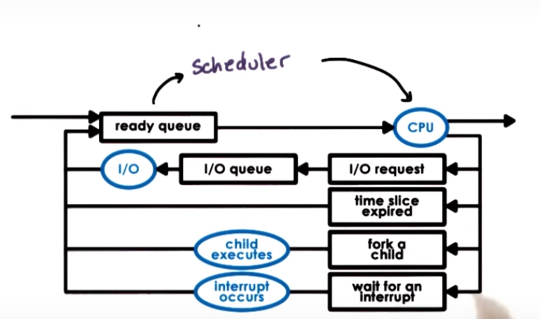
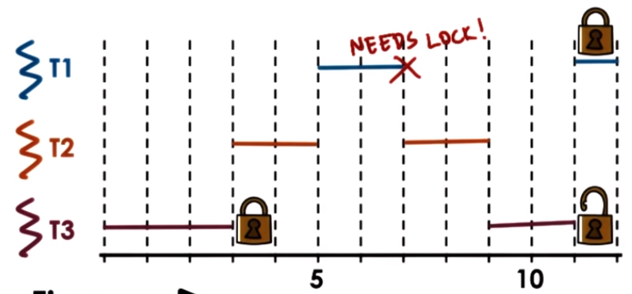

# Scheduler

## When does scheduler runs?
- When CPU is idle.
- When a new task is available either IO operation is over or new process is forked from existing one or an interrupt occurs, scheduler needs to decide wheather to interrupt current process because a process with higher priority has come in ready queue.
- Timesplice expired timeout. Each process has a certain time slice assigned to it once expired it goes back again to the ready queue. For pseudo parallelism. (Time multiplexing).

# What happens after task is dispatched to CPU
- Context switch
- enter user mode
- set Program counter
- new thread start executing

# Which task is executed
- depends on the policy of the scheduler.

## Types of scheduling algorithm or policy.

- ### FIFO / First come first served
  - runqueue -> queue
  - (Assuming run to completion)wait time is poor.

- ### Shortest Job First
  - runqueue -> priority queue / Heap
  - (Assuming run to completion)average wait time and average completion time is better than first come first served. 

- ### Round Robin Scheduling with timeslicing
  - First in first out but each process has a time slice after which process is back again in queue.
  - Short task finish sooner
  - more responsive
  - lengthy io operation intiated sooner.
  - **There are some overheads because of context switching, interrupts, schedule. Thus keep time slice values >> context_switching time to minimize overhead.**

  - #### Time Slicing
    - Maximum amount of uninterrupted time given to a task - time quantum
    - Task may run less if it has to wait on I/0, or **syncronize with another task because of mutex that is locked** or Higher priority task may prempt this task.   
    - If only CPU Bound task are there we will require a higher time slice. Cause of fewer context switching.
    - If IO Bound task are also there lower time slice is better this ensures both IO and CPU bound task will recieve equal time of execution. [link to video](https://classroom.udacity.com/courses/ud923/lessons/3399758762/concepts/34003089900923)
    - If only IO Bound them time slice doensn't matter.
    - CPU Utilization = (CPU_Running_time)/(CPU_Running_time + time_to_context_switch)*100

- ### Highest Priority Premptive 
  - priority matters not execution time.
  - different run queue/ heaps for each priority level.
  - **starvation is a problem** (low priority task is delayed and delayed). To fix it use priority aging i.e priority = priority + time_spent_on_run_queue.
 

### Metrics to compare
- throughput
- avg job completion time
- avg job wait time
- cpu utilization

## Priority Inversion
When a low priority process locks a mutex required by a high priority process, a priority inversion occurs in which the medium priority process finish first followed by the low priority then the highest priority cause only then mutex is released.

To fix this temporarily boost the priority of mutex acquiring process so that it executes before medium priority and as soon as that happens high priority process can execute. And then on mutex release reduce the priority back.

 

### Insights
- **The execution time is not easy to guess and is predicted based on history, heuristics etc.**

# How is this done?
- Run queue data structure