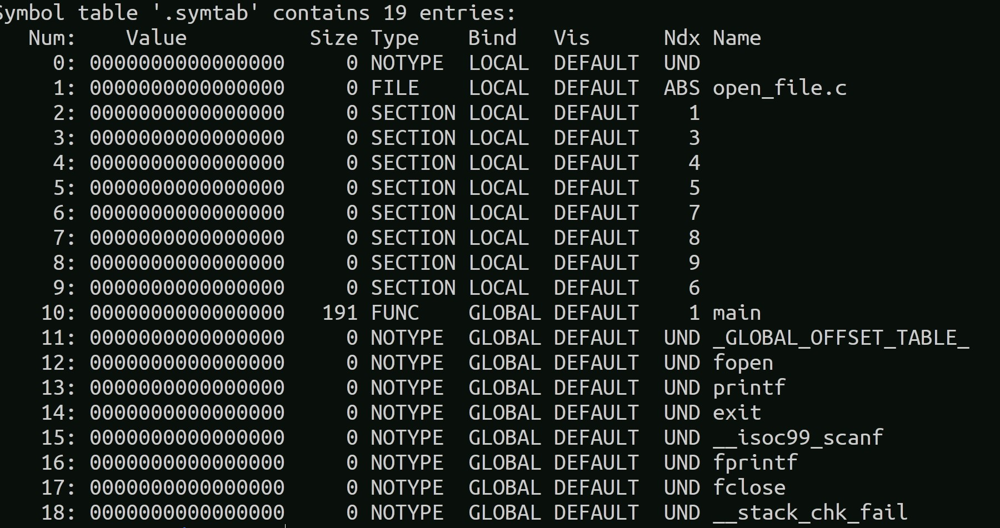

# Symbol
- Anything with a global or module level name
- Functions, Global vars, Static Vars 
- readelf -sW file.o to show the symbol table
- 
- static variables are local symbols
- local variables are not symbols
- Func names and global variables are global symbols

# Structure of ELF i.e .o file
## text :
assembly of the code
## rodata :
readonly data space
## data :
data space for global vars
## bss :
- Remember as better save space
-  the vars whose value is going to be zero when the program is going to be loaded into memory.
## symtab :
Symbol Table
## relocation.text :
Relocation entries for text (TO-DO that the compiler leaves for the linker to link while creating the final executable. Information about location of symbols which are present in other files)
## relocation.data :
Relocation entries for data
## debug information
- Useful for developer for debugging not the user.
### debug
- Info on stack local vars
### line
- Line number for assembly to source c file.
- Enables setting break points
### strtab
- symbol table entry to string variable names in source code.

# Symbol resolution
- Find single defination for each symbol.

# System Calls
- execve : executes the program referred to by pathname